# Google Cloud - Professional Cloud Network Engineer Certification

[^1] A Professional Cloud Network Engineer implements and manages network architectures in Google Cloud. This individual may work on networking or cloud teams with architects who design cloud infrastructure. The Cloud Network Engineer uses the Google Cloud Console and/or command line interface, and leverages experience with network services, application and container networking, hybrid and multi-cloud connectivity, implementing VPCs, and security for established network architectures to ensure successful cloud implementations.

The Professional Cloud Network Engineer exam assesses your ability to:

*   Design, plan, and prototype a Google Cloud network
*   Implement Virtual Private Cloud (VPC) instances
*   Configure network services
*   Implement hybrid interconnectivity
*   Manage, monitor, and optimize network operations

[Link to the exam guide](https://cloud.google.com/certification/guides/cloud-network-engineer/)

# Section 1: Designing, planning, and prototyping a Google Cloud network

<details>
<summary> 1.1 Designing an overall network architecture </summary>

## High availability, failover, and disaster recovery strategies

### Failover and DR Strategy

Two important metrics that characterizes the business impacts:
*   **Recovery Time Objective (RTO)**:
    *   This metric is the maximum acceptable time that your service can be offline. It refers to the maximum allowed downtime for a service and how quickly the service should be restored.
*   **Recovery Point Objective (RPO)**:
    *   This metric is the maximum acceptable time that data might be lost due to a major incident. In other words, it tells you how much data your service can lose from the last backup. It also defines how frequently the data is backed up.

Smaller RTOs and RPOs determine higher costs as the complexity of infrastructure and services increases.

Disaster Recovery (DR) scenerios are based on the business recovery goals and determine the RTO and RPO.

DR Patterns:
*   **Cold**:
    *   Applies to business with having high RTO / RPO
    *   No a dditional resources to overcome issues
    *   Service is stopped until resources are created, started, and ready to receive traffic.
*   **Warm**:
    *   Applies to businesses with having a medium RTP / RPO
    *   Service architecture does have spare resources to overcome issues but they need to be started or configured to be ready for traffic
*   **Hot**:
    *   Applies when business is mission-critical and requires a low RTO and RPO.
    *   Service architecture does have spare resources, and they are running and processing user traffic even when faults have not occurred yet.

### High Availability (HA) Options

Products to consider:
*   **External Cloud Load Balancing**:
    -   Distributes user requests across various backends
    -   Group of VMs, or applications
    -   Provides a _health check_ system to determine whether a backend can receive and process user traffic
    -   Publishes a single global anycast IP address to let user traffic reach the closest backend that reduces latency.
*   **Cloud DNS**:
    -   Provides tools to automate the maintenance of DNS entries when recovery happens
    -   Leverage Google's Anycast Domain Name Servers network to server DNS requests.
    -   If DNS is on-prem, Cloud DNS can forward DNS requests from VMs that running in GCP.
*   **Cloud Connectivity**:
    -   Several options to connect on-premises network and the VPC in google cloud, such as _Dedicated Interconnect_ and _Direct Peering_ are two solutions with the highest availability.

Sample Disaster Recovery Workflow:

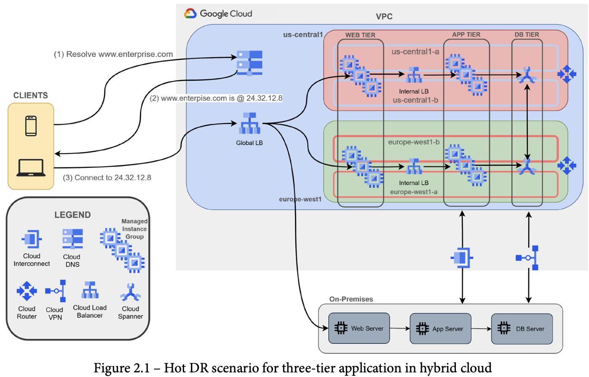

* Move DNS from on-prem to cloud dns first
* Users connect to Cloud DNS to resolve company URL
* Cloud DNS returns the A record of the anycast IP address of the global Cloud Load Balancing Service
* Using Cloud Load Balancing, traffic can be distribute and weighted to different backends that can be either:
    -   VM instances groups (managed or unmanaged)
    -   on-prem web server public IP
    -   Zonal NEG
    -   Serverless NEG
    -   Internet NEG
    -   Hybrid connectivity NEG
    -   Private Service Connect NEG
    -   Service Directory service bindings


## DNS strategy (e.g., on-premises, Cloud DNS)

Some situations require that DNS remain on-prem to resolve private names that some applications still use, therefore a hybrid solution will need to be established.

Choose a name pattern for corporate resources:
*   Complete domain seperation:
    -   seperate domain for on-prem vs cloud
    -   best to choose because it makes it extremely easy to forward DNS requests between Environments
*   GCP Domain as a subdomain:
    -   use a subdomain for all GCP resources which are subordinate to on-prem domain
    -   for instance use corp.enterprise.com for on-prem and gcp.corp.enterprise.com
    -   this pattern would apply if resources on-prem are far greater than ones in GCP
*   On-prem doamin as subdomain
    -   use a subdomain for all on-prem resources
    -   they are subordinate to the GCP domain
    -   corp.enterprise.com for GCP resources, dc.corp.enterprise.com for on-prem resources
    -   not common, applies to companies that have a small number of services on-premise


For hybrid environments the recommendation is for private DNS resolution is to use two separate authoritative DNS systems. Cloud DNS can be use as an authoritative DNS server for the GCP environment, while the existing DNS servers on-premises can still be used as an authoritative DNS server for the on-prem resources, as shown below.

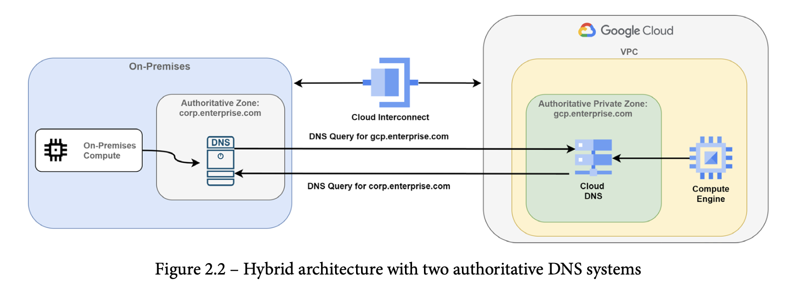

With a two authoritative DNS systems hybrid architecture it is required to configure **forwarding zones** and **server policies**, Cloud DNS provides the two features to allow DNS name lookup between on-prem and GCP environments.

**Forwarding Zones** are used to query DNS records in your on-prem environment for corporate resources. Cloud DNS **does not** sync or cache on-premise records, thus it is important to maintain the on-prem DNS server to be as highly available as possible.

DNS **server policies** allow on-prem hosts to query DNS records in a GCP private DNS environment. Any time a host that is on-prem sends a request to resolve some instance name in gcp.entreprise.com, a inbound DNS forwarding rule in the DNS server policy must be created.


## Load balancing

There are several options for load balancing traffic in GCP, divided into two categories:

*   **External Load Balancer**
  -   Distributes traffic from the internet to a VPC
*   **Internal Load Balancer**
  -   Distributes traffic between instances in a VPC

GCP Load Balancers are divided into **Global** and **Regional** categories.

*   **Global**
  -    External HTTP(S) LB
  -    SSL Proxy LB
  -    TCP Proxy LB
  -    TCP/UDP Network LB
*   **Regional**
  -    Internal TCP/UDP Network LB
  -    Internall HTTP(s) LB

The following image outlines a decision tree on how to choose the appropriate Load Balancer for your workloads.


## Optimizing for latency (for example, maximum transmission unit (MTU) size; caches; content delivery network (CDN))

The following items should be considered when designing your network for latency optimization:

*   **Round-trip time (RTT)**:
  -   Time it takes for a packet to travel to the service and return it to the requesting user
*   **Server processing latency**
  -   Time it takes to complete the processing of a user request.
  -   For multi-tier applications, this time may involve multiple servers or services
*   **Server throughput**
  -   Amount out information that a server can serve in 1 second
  -   influences the network latency
    -   Higher the the throughput is the lower the time is needed to transmit data

Best practices to reduce latency:

*   Deploy backends each GCP region where your users are located and route traffic to nearest backends using Global LBs (Https / SSL/TCP Proxy do this automatically)
*   Using HTTPs/SSL/TCP Proxy lbs will minimize both latency and Time to First Byte (TFFB), reduces slow starts, reduces Transport Layer Security (TLS) handshakes for every SSL offloading session, automatically upgrades users sessions to HTTP/2, reducing number of packets transmitted
*   For multi-tier applications they should all be deployed in the same GCP region. Avoid inter-regional traffic
*   Leverage Cloud CDN for cacheable user traffic (images, static file, etc)
  -   Enable automatic static content caching
  -   Set expiration time carefully
  -   Use a custom cache key to improve cache hit ratio, by default GCP uses the entire Uniform Resource Locator (URL) to generate a key that is used for content search in the CDN.

## Network Security Design Strategy

*   Manage traffic with firewall rules
    -   leverage services accounts or tags to direct traffic between GCE Instances  
*   Limit external access
    -   avoid exposing GCE instances to the Internet, deploy Cloud NAT to let all the VMs in one region go out to reach external services
    -   deploy vms without public IPs (can use org policies to prevent the use of public ips)
    -   deploy private GKE clusters
    -   use Google Private Access for access google services
*   Centralize network control
    -   Use a Shared VPC
    -   A single Network Admin IAM account with the least number of permissions that allow network administrators to configure subnets, routes, firewall rules, and so on for all projects in the organization
*   Interconnect privately to your on-premises network
    -   based on network latency, bandwidth, and service-level aggreement (SLA) requirements, consider either Cloud Internconnect (Dedicated or Partner) or Cloud VPN to avoid traversing the Internet. Use Cloud Interconnect for the lowest latency and high scalability and reliablity for transfering data.
*   Secure your application and data
    -   Leverage VPC Service controls
    -   Cloud Identity-Aware Proxy (IAP)
    -   Cloud Armor
*   Control access to resources
    -   Assigning IAM roles with least privileged approach. Only necessary access should be granted to your resources.

## IAM roles

* Organization Admin
  -  Delegate Network and Sec Admin
* Compute Network Admin
    - roles/compute.netowkrAdmin
    - full control of compute engine networking resources
    - unable to create FW rules, IAM roles, & SSL certificates
* Compute Security Admin
    - roles/compute.securityAdmin
    - Full control of compute engine security resources such as creating/updating FW rules and ssl certificates
* Compute Shared VPC Admin
    - roles/compute.xpnAdmin
    - Manage hosts and service projects, set permissions on subnetworks for Users
* Compute Network User
    - roles/compute.networkUser
    - Provides access to use a shared vpc network
* Compute Network viewer
    - roles/compute.networkViewer
    - Read-only access to compute engine networking resources

Service Account accounts do not have passwords and cannot log in via browsers or cookies

Service Accounts use RSA key pairs (public/private) for Authentication to google cloud.

Service account user role grants permissions to get, list, or impersonate a service account.

## Choosing the right Network Service Tier

Network Service Tiers lets you optimize connectivity between systems on the internet and your Google Cloud instances. Premium Tier delivers traffic on Google's premium backbone, while Standard Tier uses regular ISP networks.

Use Premium Tier to optimize for performance, and use Standard Tier to optimize for cost.

Uses Cases for each tier:


|Premium Tier |	Standard Tier |
| ----------- | ------------- |
| Highest performance: Traffic between the internet and VM instances in your VPC network is routed by keeping it within  Google's network as much as possible. | Cost optimized: Traffic between the internet and VM instances in your VPC network is routed over the internet in general.|
|For services that need global availability.   | For services hosted entirely within a region.|
| Unique to Google Cloud, Premium Tier is the default unless you make configuration changes.  |  Performance is comparable to other cloud providers. |

**Premium**


**Standard**


The following decision tree will help decide which tier best fits:


## 1.1.g - Applying quotas per project and per VPC

Quotas: https://cloud.google.com/docs/quota
VPC Quotas: https://cloud.google.com/vpc/docs/quota#per_network


## 1.1.f - Hybrid connectivity (e.g., Google private access for hybrid connectivity)

## 1.1.g - Container networking


## 1.1.i - SaaS, PaaS, and IaaS services

## 1.1.j - Microsegmentation for security purposes (e.g., using metadata, tags, service accounts)

</details>
<details>
<summary> 1.2 Designing Virtual Private Cloud (VPC)</summary>

## Virtual Private Cloud (VPC)
By default every new GPC project has a default VPC in auto-mode which has a subnet in each region.

VPC is a global resource that is not associated to any region, subnets are regionally bound resources which define a range of IP addresses.

When creating a VPC your have two options:

*   Automatic Mode:
    -   Google will assign a "default" IP address range for each subnet (one per region), like the default VPC
    -    Addresses come from a predefined set of ranges that fit inside the 10.128.0.0/9 **classless inter-domain routing (CIDR)** block.
    -    used for quick/dirty option, development, poc
*   Custom Mode:
    -   Allows for manually defining regions and subnets that you assign to resources. NO overlapping IP addresses are allowed in the same VPC.
    -   At least ONE subnet must be created
    -   You must select a Primary IP address range for VMs, Load Balancers, and internal protocol forward can use
    -   used for production

The following table lists possible valid ranges for custom subnet IP addresses:

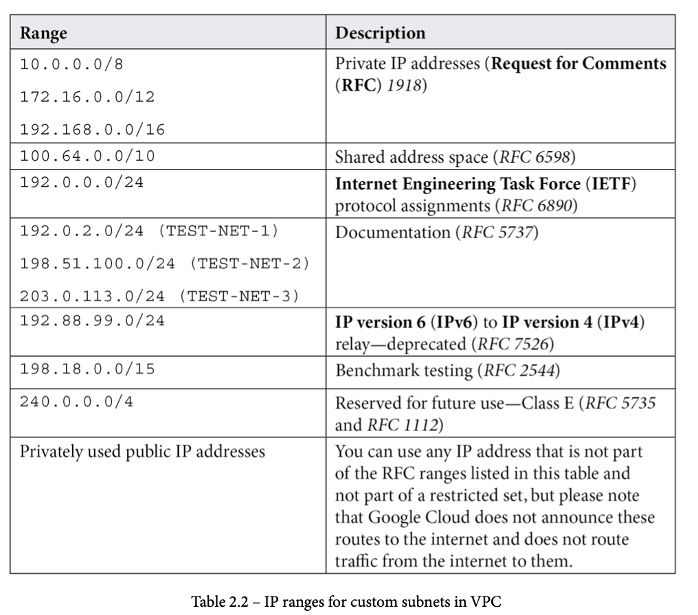

Some commonly reserved RFC ranges are not allowed in Google Cloud custom subnets, as outlined in the following table:

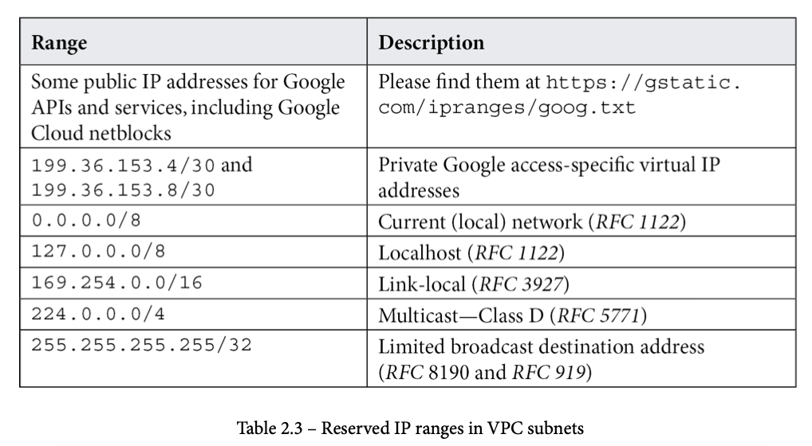

In every subnet four IP addresses are reserved from the primary range:

*   Network:
    -   172.16.10.0 in 172.16.10.0/24
    -   First address in the primary IP range for the subnet
*   Default Gateway:
    -   172.16.10.1 in 172.16.10.0 /24
    -   Second address in the primary IP range for the subnet
*   Second-to-last address
    -   172.16.10.254 in 172.16.10.0 /24
    -   Second-to-last address in the primary IP range that is reserved by google cloud for potential furtur use
*   Broadcast
    -  172.16.10.255 in 172.16.10.0 / 24
    -  Last address in the Primary IP range for the subnet

Your subnet can have primary and secondary CIDR ranges. This is useful if you want to maintain network separation between the VMs and the services running on them. One common use case is GKE. Indeed, worker Nodes get the IP address from the primary CIDR, while Pods have a separate CIDR range in the same subnet. This scenario is referred to as alias IPs in Google Cloud. Indeed, with **alias IPs**, you can configure multiple internal IP addresses in different CIDR ranges without having to define a separate network interface on the VM.

**Create auto mode VPC using gcloud**

```
gcloud compute networks create NETWORK \
  --subnet-mode=SUBNET_MODE \
  --bgp-routing-mode=DYNAMIC_ROUTING_MODE \
  --mtu=MTU
```


_DYNAMIC_ROUTING_MODE_ can be either `global` or `regional` to control Cloud Router behavior

_SUBNET_MODE_ can be either `auto` or `custom`, _auto_ all subnets will be created automatically by GCP one in each region.

_MTU_ is the maximum transmission unit of the network. MTU can be set to any value from 1300 through 8896 (default is 1460). Its the size, in bytes, of the largest packet supported by a network layer protocol, including both headers and data.

For custom mode subnets you can also include the `--enable-ula-internal-ipv6` and/or `--internal-ipv6-range=ULA_IPV6_RANGE` to setup a dual-stack subnets with internal IPv6 addressing, otherwise only external IPv6 addresses will be created.

_ULA_IPV6_RANGE_ is a `/48` prefix from within the `fd20::/20` range used by Google for internal IPv6 subnet ranges. if the `--internal-ipv6-range` is omitted Google with select a `/48` prefix for the network.


## IP address management and bring your own IP (BYOIP)

### RFC1918 (Address Allocation for Private Internets)

In the spec the **Internet Assigned Numbers Authority (IANA)** has reserved the following three blocks of the IP address space for private numbers:

*   10.0.0.0 - 10.255.255.255 (10/8 prefix)
*   172.16.0.0 - 17.31.255.255 (172.16/12 prefix)
*   192.168.0.0 - 192.168.255.255 (192.168/16 prefix)

All others addresses are potentially public.

When GCE VMs, GKE nodes/pods/services, internal load balancers (TCP/UDP or HTTPs load balancing), and internal protocol forwarding the assigned IP is _regional_ and internal.

For private service access resources will be assigned a _global_ internal IP address.

## Static vs Ephemeral IP Address

*   **Ephemeral**
    -   Default option
    -   released once the instance is stopped or deleted
    -   new IP is assigned to the instance/resource when a new one is created
*   **Static**
    -   Must be reserved in order to keep the lifetime beyond the lifetime of the resources it is assigned to
    -   Will incur costs, even when not in use

The following diagram shows how static IP address reservation will happen in the VPC:

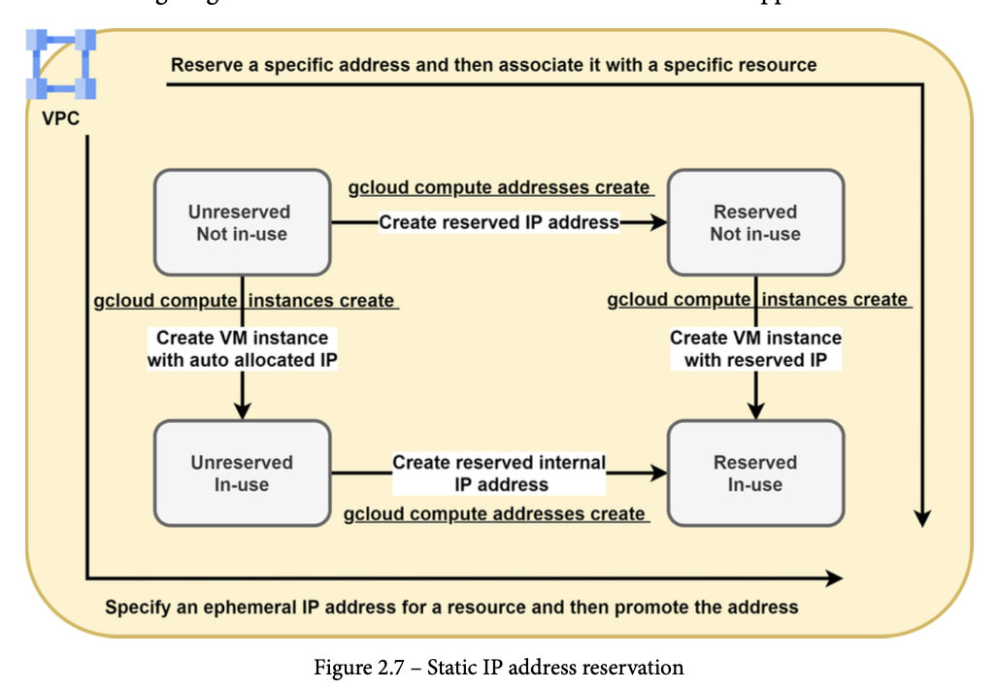

You can see in the figure above the two ways to reserve a static IP address (either internal or external), as described in more detail here:
  *   You can start a new resource with an ephemeral address and then promote it to a static IP address.
  *   You can reserve a static IP address and only after that create an associated resource.

To reserve and manage static internal IP addresses, you need to be granted the `compute.networkAdmin` role, or one or more of the following permissions:
  *   `compute.addresses.create` on the IP address
  *   `compute.addresses.createInternal` on the IP address
  *   `compute.instances.update` on the VM instance
  *   `compute.subnetworks.use` on the subnetwork

The following gcloud command creates the resource to hold the reserved static internal IP address.

```
gcloud compute addresses create ADDRESS_NAME [ADDRESS_NAME..] \
    --region REGION --subnet SUBNETWORK \
    --addresses IP_ADDRESS
```

Omitting the `--addresses` will automatically reserve an IP address from the given subnet.

You can also use the `--global` and `ip-version` flag with to reserve an external static IP:

```
gcloud compute addresses create ADDRESS_NAME \
    --global \
    --ip-version [IPV4 | IPV6]
```
or for regional static IP address

```
gcloud compute addresses create ADDRESS_NAME \
    --region [REGION]
```

You assign an IP to a gce instance using the following:

```
gcloud compute instances create VM_NAME --address=IP_ADDRESS
```
### Alias IP Ranges

Google Cloud alias IP ranges let you assign ranges of internal IP addresses as aliases to a virtual machine's (VM) network interfaces. This is useful if you have multiple services running on a VM and you want to assign each service a different IP address. Alias IP ranges also work with GKE Pods.

If you have only one service running on a VM, you can reference it by using the interface's primary IP address. If you have multiple services running on a VM, you might want to assign each one a different internal IP address. You can do this with alias IP ranges.

Limitations can be found [here](https://cloud.google.com/vpc/docs/configure-alias-ip-ranges#limitations).

**Creating a subnet range alias**
```
gcloud compute networks subnets create s1 \
    --network NETWORK_NAME \
    --region REGION \
    --range 10.65.61.0/24 \
    --secondary-range RANGE_NAME=RANGE_CIDR;RANGE_NAME=RANGE_CIDR;...
```

**Add secondary CIDR range to existing subnet**
```
gcloud compute networks subnets update SUBNET_NAME \
    --region REGION \
    --add-secondary-ranges RANGE_NAME=RANGE_CIDR;RANGE_NAME=RANGE_CIDR;...
```

**Assign alias IP range to VM**
```
gcloud compute instances create vm1 \
    --zone ZONE \
    --network-interface "subnet=SUBNET_NAME,aliases=RANGE_CIDR;RANGE_CIDR;..."
```

Example :

```
gcloud compute instances create multi-nic-alias-vm \
    --machine-type f1-micro \
    --network-interface "subnet=my-subnet1,aliases=/32;range1:/24" \
    --network-interface "subnet=my-subnet2,aliases=/32;range2:/24"
```

**Assign to exsitng VM**

```
gcloud compute instances network-interfaces update INSTANCE_NAME \
    --zone ZONE \
    [--network-interface NETWORK_INTERFACE; default="nic0"]
    --aliases "RANGE_NAME:RANGE_CIDR;RANGE_NAME:RANGE_CIDR;..."
```

### BYOIP

Bring your own IP (BYOIP) lets you provision and use your own public IPv4 addresses for Google Cloud resources. After the IP addresses are imported, Google Cloud manages them in the same way as Google-provided IP addresses, with these exceptions:

The IP addresses are available only to the customer who brought them.

There are no charges for idle or in-use IP addresses.

Google DOES NOT support overlapping IP addresses as part of the BYOIP route announcements:

For example, importing 203.0.112.0/23 is not supported if 203.0.112.0/23 or a subset of this prefix, such as 203.0.112.0/24, is advertised outside Google. If Google and another network advertise the same route with matching or mismatched prefix lengths, you might experience unexpected routing and packet loss.

#### Live Migration

Use live migration to import a BYOIP prefix when any part of the prefix is already publicly advertised. Importing an advertised prefix without using live migration might cause unexpected routing and packet loss.

To bring your own IP to Google:

  * First create a public advertised prefix (PAP). Verification of ownership is done for this public advertised prefix using ROA and reverse DNS validation.
  * After verification is complete, we configure the announcement of this prefix to the internet, but the prefix is not advertised until it is provisioned. It takes up to four weeks for the public advertised prefix to be provisioned.

While you wait for the public advertised prefix to provision, you split the prefix into public delegated prefixes (PDP), which you configure to have regional or global scope. You can then either divide the public delegated prefix further, or use it to create assignable IP addresses. It takes up to four weeks for the public delegated prefix to be provisioned.

Once provisioning of the public delegated prefix is complete, the public advertised prefix is advertised to the internet. IP addresses in the public advertised prefix always use the Premium Tier of Network Service Tiers.


The following figure displays the same project with different configurations, one of which prevents the prefix from being advertised, and two which cause the public advertised prefix to be advertised.


https://cloud.google.com/vpc/docs/using-bring-your-own-ip


## Routes

### Routing Table
*   Every VPC has a routing table, defined at the VPC level, that defines the path (physical or virtual) that the IP packet follows from starting point (VM) to its destination.
*   Composed of many routes that have an order of applicability depending on some predefined rules
*   Each route has a single destination prefix and a unique next hop

### Route Types

**System-generated Routes**
Created automatically when a VPC Network is created and has two sub-types: _default route_ and _subnet routes_.

_Default Route_ (0.0.0.0/0) is the _gateway of the last resort_ which is used by the IP packet to leave the VPC when a more specific route is not present in the routing table. Default path toward every out-of-vpc destination, including internet and private Google access. Can be deleted, default route priority is 1,000.

_Subnet routes_ implied automatic routes in every created subnet in a VPC. These are generated by Google Cloud pointing to the subnet's primary IP address range (and another route pointing to the secondary IP range if defined). This has the highest priority of 0.

**Custom Routes**
Route manually added, static or dynamic.

_Static routes_ defined manually inside the VPC (destination prefix, priority, next hop, and optional tag).

_Dynamic routes_ created dynamically when using a Cloud Router which learns by means of the **Border Gateway Protocol (BGP)**.

Use the following gcloud command to manually add a static route:

```
gcloud compute routes create ROUTE_NAME \
    --destination-range=DEST_RANGE \
    --network=NETWORK \
    NEXT_HOP_SPECIFICATION
```

_NEXT_HOP_SPECIFICATION_ represents the next hop for the custom static route. You must specify only one of the following as a next hop. For more information about the different types of next hops, see Static route next hops.
  *   `--next-hop-gateway=default-internet-gateway`: Use this next hop to send traffic outside of the VPC network, including to the Internet or to the IP addresses for Private Google Access.
  *   `--next-hop-instance=INSTANCE_NAME` and `--next-hop-instance-zone=ZONE`: Use this next hop to direct traffic to an existing VM instance by name and zone. Traffic is sent to the primary internal IP address for the VM's network interface located in the same network as the route.
  *   `--next-hop-address=ADDRESS`: Use this next hop to direct traffic to the IP address of an existing VM instance.
  *   `--next-hop-ilb=FORWARDING_RULE_NAME` and `--next-hop-ilb-region=REGION`: Use this next hop with Internal TCP/UDP load balancer to distribute traffic to the load balancer, specified by internal forwarding rule name (or IP address) and region. The load balancer distributes traffic among healthy backends where the load balancer is transparent to the clients in a bump-in-the-wire fashion.
    -   `--next-hop-vpn-tunnel=VPN_TUNNEL_NAME` and `--next-hop-vpn-tunnel-region=REGION`: Use this next hop to direct traffic to a Cloud VPN tunnel that uses static routing.


**Peering Routes**

Route information exchanged when VPC's are peered to one another.

_Peering subnet routes_ route information exchanged to reach resources located in any VPC that is peered.

_Peering custom routes_ user defined route information imported/exported when any VPC network is peered.

### Route Order

The route selection process makes a lookup on the routing table adhering to the following:

1. Longest prefix match
2. Route priority
3. Route type and next hop

## Shared VPC vs VPC Network Peering

Two options for designing interconnections between two or more VPCs in Google Cloud they are _Shared VPC_ and _VPC Network Peering_.

### Shared VPC

Allows multiple projects within the same organization to share one VPC.

Split into two components:

* **Host project**
  - Contains one or more Shared VPC Networks
  - Created by the Shared VPC Admin
  - Can have one or more service projects attached
* **Service project**
  - Any project attached to a host project
  - Can only belong to **ONE** host project

**IAM roles**

* **Organization Admin (resourcemanager.organizationAdmin)**
  - IAM principal in the organization
  - They nominate Shared VPC Admins by granting them appropriate project creation and deletion roles, and the Shared VPC Admin role for the organization. These admins can define organization-level policies, but specific folder and project actions require additional folder and project roles.
* **Shared VPC Admin (compute.xpnAdmin and resourcemanager.projectIamAdmin)**
  - IAM principal in the organization, or
  - IAM principal in a folder (beta) Shared VPC Admins have the Compute Shared VPC Admin (compute.xpnAdmin) and Project IAM Admin (resourcemanager.projectIamAdmin) roles for the organization or one or more folders.
  - Perform various tasks necessary to set up Shared VPC, such as enabling host projects, attaching service projects to host projects, and delegating access to some or all of the subnets in Shared VPC networks to Service Project Admins. A Shared VPC Admin for a given host project is typically its project owner as well.
  - A user assigned the Compute Shared VPC Admin role for the organization has that role for all folders in the organization. A user assigned the role for a folder has that role for the given folder and any folders nested underneath it.
  - A Shared VPC Admin can link projects in two different folders only if the admin has the role for both folders.
  - Has full control using Network Admin (`roles/compute.networkAdmin`) and Security Admin (`roles/compute.securityAdmin`)
* **Service Project Admin (compute.networkUser)**
  - IAM principal in the organization, or
  - IAM principal in a host project, or
  - IAM principal in some subnets in the host project
  - Should be granted Network User `roles/compute.networkUser`  to use all shared vpc subnets

Apply Shared VPC Admin role to an existing IAM principal. Replace _ORG_ID_ with the organization ID number from the previous step, and _EMAIL_ADDRESS_ with the email address of the user to whom you are granting the Shared VPC Admin role.

```
gcloud organizations add-iam-policy-binding ORG_ID \
    --member='user:EMAIL_ADDRESS' \
    --role="roles/compute.xpnAdmin"

gcloud organizations add-iam-policy-binding ORG_ID \
    --member='user:EMAIL_ADDRESS' \
    --role="roles/resourcemanager.projectIamAdmin"
```


**Basic Shared VPC scenario**


As you can see from the figure above, the host project has the VPC network that contains one subnet for each GCP region. Additionally, the host project has two service projects attached. You will note that service projects do not have any VPC network. However, they can deploy GCE instances that get private IP addresses from the region in which they run.

**Hybrid Connectivity With Shared VPC**
If you need to interconnect Shared VPC with your on-premises network, this must be done through the host project. For example, if you are using Cloud VPN as an interconnection solution, this service must be deployed in the Shared VPC that is contained within the host project. The following diagram shows an example of hybrid connectivity with Shared VPC:


#### Provisioning a Shared VPC

**Assgin a project as a Host project**

Authenticate as the Shared VPC admin
`gcloud auth login SHARED_VPC_ADMIN`

Enable Shared VPC for the project that you need to become a host project. Replace HOST_PROJECT_ID with the ID of the project.

If you have Shared VPC Admin role at the organization level

```
gcloud compute shared-vpc enable HOST_PROJECT_ID
```

If you have Shared VPC Admin role at the folder level
```
gcloud beta compute shared-vpc enable HOST_PROJECT_ID
```

Attaching a service project (Shared VPC Admin at the org level):

```
gcloud compute shared-vpc associated-projects add SERVICE_PROJECT_ID \
    --host-project HOST_PROJECT_ID
```

Attaching a service project (Shared VPC admin at folder level):

```
gcloud beta compute shared-vpc associated-projects add SERVICE_PROJECT_ID \
    --host-project HOST_PROJECT_ID
```

Deprovisioning a Shared VPC requires some additional steps which can be found [here](https://cloud.google.com/vpc/docs/deprovisioning-shared-vpc).


**Preventing Host Project Deletion**

When a project is configured to be a Shared VPC host project, a special lock—called a _lien_—is placed upon it. As long as the _lien_ is present, it prevents the project from being deleted accidentally. The lien is automatically removed from the host project when it is no longer configured for Shared VPC.

**Caution**: By default, a project owner can remove a _lien_ from a project, including a Shared VPC host project, unless an organization-level policy is defined to limit lien removal. (Specifically, lien removal requires an IAM principal with the `resourcemanager.projects.get` and `resourcemanager.projects.updateLiens` permissions on the project.)

The project owner for the host project could remove the _lien_ then delete the Shared VPC project. To prevent this from happening, follow the directions in this section.


A user with the `orgpolicy.policyAdmin` role can define an organization-level policy constraint (`constraints/compute.restrictXpnProjectLienRemoval`) that limits the removal of liens to just the following roles:

  * Users with `roles/owner` or `roles/resourcemanager.lienModifier` at the organization level
  * User with custom roles that include the `resourcemanager.projects.get` and `resourcemanager.projects.updateLiens` permissions at the organization level

To enforce the `compute.restrictXpnProjectLienRemoval` policy for your organization by running this command. Replace _ORG_ID_ with the number you determined from the previous step.

```
gcloud beta resource-manager org-policies enable-enforce \
      --organization ORG_ID compute.restrictXpnProjectLienRemoval
```

**Constraints**

* `constraints/compute.restrictSharedVpcHostProjects`: limits the set of hosts projects to which a non-host project or non-host projects in a folder or organization can be attached.
* `constraints/compute.restrictSharedVpcSubnetworks`: defines the set of subnets that can be accessed by a particular project or by projects in a folder or organization

Another mechanism to prevent Shared VPC host project from being deleted is to lock it to the billing account, details can be found [here](https://cloud.google.com/billing/docs/how-to/secure-project-billing-account-link).

### VPC Network Peering

Allows two or more VPCs to be interconnected even if they belong to different projects or organizations. Advantages are:
* Network Security: Services do not need to be exposed to the public Internet
* Network latency: Traffic remains confined to the Google worldwide network which is engineered for low-latency transport.
* Network costs: Google charges you an additional cost (as an egress bandwidth price) for whichever traffic uses external IPs, even if your traffic is within the same zone; using VPC Network Peering, you only pay for the regular network pricing.

VPC Peering allows for sharing and exchanging IP routes, subnet routes, or custom routes. Subnet routes are automatically exchanged between VPCs if they do not use privately used public IP addresses.

NOTE: overlapping IP's must be avoided between VPCs to allow VPC network peering to be established.

VPC Network Peering is not transitive, so (for example), if you have three VPCs—VPC A, VPC B, and VPC C—and you have one VPC Network Peering between VPC A and VPC B and another VPC Network Peering between VPC B and VPC C, then the following traffic is allowed:
  * VPC A can communicate with VPC B and vice versa.
  * VPC B can communicate with VPC C and vice versa.

Transit traffic is not allowed, as outlined here:
  * VPC A cannot communicate with VPC C.

If you want them to communicate with each other, you should configure a new VPC Network Peering, between VPC A and VPC C explicitly.

VPC Network Peering works with Compute Engine, GKE, and App Engine flexible environment.

VPC Network Peering supports IPv4 connectivity only. You can configure VPC Network Peering on a VPC network that contains dual-stack subnets. However, there is no IPv6 connectivity between the networks.

A dynamic route can overlap with a subnet route in a peer network. For dynamic routes, the destination ranges that overlap with a subnet route from the peer network are silently dropped. Google Cloud uses the subnet route.

The following routes are excluded from being imported and exported:
  * Tagged routes are never exchanged between peer networks. Tagged routes are custom static routes scoped to specific VM instances by using network tags. Network tags can only be resolved in the VPC network in which they're created.
  * Static routes with a next hop to the default Internet gateway are never exchanged. For example, the default route (0.0.0.0/0) with a next hop of default Internet gateway isn't exchanged between peer networks.

## Firewalls (e.g., service account-based, tag-based)

### Firewall Rules

Each GCP VPC contains one or more firewall rules and they work as
a distributed firewall. Therefore, they do not reside on a physical device that may cause a bottleneck, but they are instead distributed into the VPC and applied at the GCE instance level.

FW rules have the following specifications:
* Applied to one VPC network
* Stateful, no need to write a rule for returning traffic
* Controls either inbound traffic (ingress) and outbound traffic (egress)
* direction of traffic is always evaluated from GCP resource perspective
* have a target to whom the firewall rule is applied.
  - can be GCE instance, subgroup of them (referenced by tag), or a service account
* sorted by priority which are evaluated from lowest to highest
* have a condition to match
  - includes source or destination of the traffic and the protocol
* have an actions, either Allow or deny

By default each VPC have two implied rules, which are not visible to the user, one for egress to allow traffic to any destination IP )to 0.0.0.0/0) and an ingress rule to deny any traffic coming from any network (from 0.0.0.0/0).

**Creating a firewall rule**

```
gcloud compute firewall-rules create RULE_NAME \
    [--network NETWORK; default="default"] \
    [--priority PRIORITY;default=1000] \
    [--direction (ingress|egress|in|out); default="ingress"] \
    [--action (deny | allow )] \
    [--target-tags TAG[,TAG,...]] \
    [--target-service-accounts=IAM_SERVICE_ACCOUNT[,IAM_SERVICE_ACCOUNT,...]] \
    [--source-ranges CIDR_RANGE[,CIDR_RANGE,...]] \
    [--source-tags TAG,TAG,] \
    [--source-service-accounts=IAM_SERVICE_ACCOUNT[,IAM_SERVICE_ACCOUNT,...]] \
    [--destination-ranges CIDR_RANGE[,CIDR_RANGE,...]] \
    [--rules (PROTOCOL[:PORT[-PORT]],[PROTOCOL[:PORT[-PORT]],...]] | all ) \
    [--disabled | --no-disabled] \
    [--enable-logging | --no-enable-logging] \
    [--logging-metadata LOGGING_METADATA]

```

**Updating exsiting firewall**

```
gcloud compute firewall-rules update RULE_NAME \
    [--priority=PRIORITY] \
    [--description=DESCRIPTION] \
    [--target-tags=TAG,...] \
    [--target-service-accounts=IAM_SERVICE_ACCOUNT,_] \
    [--source-ranges=CIDR_RANGE,...] \
    [--source-tags=TAG,...] \
    [--source-service-accounts=IAM_SERVICE_ACCOUNT,_] \
    [--destination-ranges=CIDR_RANGE,...] \
    [--rules=[PROTOCOL[:PORT[-PORT]],…]] \
    [--disabled | --no-disabled] \
    [--enable-logging | --no-enable-logging]
```

Sample:

```
gcloud compute firewall-rules create deny-subnet1-webserver-access \
 --network NETWORK_NAME \
 --action deny \
 --direction ingress \
 --rules tcp \
 --source-ranges 0.0.0.0/0 \
 --priority 1000 \
 --target-tags webserver
```

#### Best practices for firewall rules
When designing and evaluating your firewall rules, keep in mind the following best practices:

  * Implement least-privilege principles. Block all traffic by default and only allow the specific traffic you need. This includes limiting the rule to just the protocols and ports you need.
  * Use hierarchical firewall policy rules to block traffic that should never be allowed at an organization or folder level.
  * For "allow" rules, restrict them to specific VMs by specifying the service account of the VMs.
  * If you need to create rules based on IP addresses, try to minimize the number of rules. It's easier to track one rule that allows traffic to a range of 16 VMs than it is to track 16 separate rules.
  * Turn on Firewall Rules Logging (`--enable-logging`) and use Firewall Insights to verify that firewall rules are being used in the intended way. Firewall Rules Logging can incur costs, so you might want to consider using it selectively.

#### IAMs

Permissions

`compute.regionFirewallPolicies.create|update|list|use`

Roles

`compute.securityAdmin` or `compute.networkAdmin`


### Firewall Policies
Grouping of several firewall rules so that you can update them all at once, effectively controlled by Identity and Access Management (IAM) roles. The policy contains rules that can explicitly deny or allow connections, as do Virtual Private Cloud (VPC) firewall rules.


#### Hierarchial Firewall Policies

* Grouping of rules into a policy object that can apply to many VPC networks in one or more projects. You can associate hierarchical firewall policies with an entire organization or individual folders.
* Contain rules that allow or deny connections, similar to VPC firewall rules do
* Can delegate evaluation rules to lower-level policies by using a `goto_next` action
* Differ from VPC network policies (firewall rules) by:
  - Every rule within a policy must have a different priority that decides the evaluation order
  - In addition to **Allow/Deny** actions, rules can evaluate lower-level policies with the `goto_next` actions
  - Using a tag in a target is not supported. Only networks and service accounts can be used.

  **Creating a organization firewall policy**

  ```
  gcloud compute firewall-policies create \
       --organization=123456789012 \
       --short-name="example-firewall-policy" \
       --description="rules that apply to all VMs in the organization"
  ```

  **Add firewall to policy***

  ```
  gcloud compute firewall-policies rules create 1000 \
      --action=allow \
      --description="allow-scan-probe" \
      --layer4-configs=tcp:123 \
      --firewall-policy=example-firewall-policy \
      --organization=123456789012 \
      --src-ip-ranges=10.100.0.1/32
  ```

  **Associate the rule to the policy**

  ```
  gcloud compute firewall-policies associations create \
      --firewall-policy=example-firewall-policy \
      --organization=123456789012
  ```


#### Global Network Firewall Policies

Grouping of rules into a policy object applicable to all regions (global). After you associate a global network firewall policy with a VPC network, the rules in the policy can apply to resources in the VPC network.

```
gcloud compute network-firewall-policies create \
    NETWORK_FIREWALL_POLICY_NAME
    --description DESCRIPTION --global
```

```
gcloud compute network-firewall-policies associations create \
    --firewall-policy POLICY_NAME \
    --network NETWORK_NAME \
    [ --name ASSOCIATION_NAME ] \
    --global-firewall-policy
```


#### Regional Network Firewall Policies

Grouping of rules into a policy object applicable to a specific region. After you associate a regional network firewall policy with a VPC network, the rules in the policy can apply to resources within that region of the VPC network.

**Creating a regional firewall policy and associate rule**
```
gcloud compute network-firewall-policies create \
    NETWORK_FIREWALL_POLICY_NAME
    --description DESCRIPTION \
    --region=REGION_NAME
```

```
gcloud compute network-firewall-policies associations create \
    --firewall-policy POLICY_NAME \
    --network NETWORK_NAME \
    --name ASSOCIATION_NAME  \
    --firewall-policy-region=REGION_NAME
    [ --replace-association-on-target true ]
```

```
gcloud compute network-firewall-policies rules create PRIORITY \
    --action ACTION \
    --firewall-policy POLICY_NAME \
    [--description DESCRIPTION ]\
    [--layer4-configs PROTOCOL_PORT] \
    [--target-secure-tags TARGET_SECURE_TAG[,TARGET_SECURE_TAG,...]] \
    [--target-service-accounts=SERVICE_ACCOUNT[,SERVICE_ACCOUNT,...]] \
    [--direction DIRECTION]\
    [--src-ip-ranges IP_RANGES] \
    [--src-secure-tags SRC_SECURE_TAG[,SRC_SECURE_TAG,...]] \
    [--dest-ip-ranges IP_RANGES] \
    [--enable-logging | --no-enable-logging]\
    [--disabled | --no-disabled]\
    --firewall-policy-region=REGION_NAME
```


All _hierarchical_, _global_, and _regional_ firewall policies have four pre-defined goto_next rules with lowest priority. These rules are applied to any connections that do not match an explicitly defined rule in the policy, causing such connections to be passed down to lower-level policies or network rules.

* IPv4 rules:
  - An egress rule whose destination is 0.0.0.0/0, with very low priority (2147483646), that sends processing of the connection to the next lower level of evaluation (goto_next).
  - An ingress rule whose source is 0.0.0.0/0, with a very low priority (2147483647), that sends processing of the connection to the next lower level of evaluation (goto_next).

* IPv6 rules:
  - An egress rule whose destination is ::/0, with very low priority (2147483644), that sends processing of the connection to the next lower level of evaluation (goto_next).

  - An ingress rule whose source is ::/0, with a very low priority (2147483645), that sends processing of the connection to the next lower level of evaluation (goto_next).

These pre-defined rules are visible, but cannot be modified or deleted. These rules are different from the implied and pre-populated rules of a VPC network.


Order of evaluation of firewall policies:


### Firewall Insights

Helps you better understand and safely optimize your firewall rules. It provides data about how your firewall rules are being used, exposes misconfigurations, and identifies rules that could be made more strict. It also uses machine learning to predict future usage of your firewall rules so that you can make informed decisions about whether to remove or tighten rules that appear to be overly permissive.

Firewall Insights uses Cloud Monitoring metrics and Recommender insights.

#### Metrics

Viewing the following metrics lets you see which firewall rules haven't been used recently.

* `firewall_hit_count`: metric tracks the number of times that a firewall rule was used to allow or deny traffic.
* `firewall_last_used_timestamp`: metric allows you to see the last time a particular firewall rule was used to allow or deny traffic by viewing the  metric.

**Cloud Logging**

Sample Cloud Logging query for firewall rules:

```
resource.type="gce_subnetwork"
logName="projects/PROJECT_ID/logs/compute.googleapis.com%2Ffirewall"
jsonPayload.instance.vm_name="INSTANCE_ID"
```

### Using tags for Firewalls

Create tags before you try to bind them to resources or use them in network firewall policies. To control network access, tags are only effective when bound to VM instances. For more details about creating tags.

The `tagAdmin` role lets you create new tags, update, and delete existing tags. An organization administrator can grant this role.

```
gcloud organizations add-iam-policy-binding ORGANIZATION_ID \
   --member=user:EMAIL_ADDRESS \
   --role=roles/resourcemanager.tagAdmin
```

The `tagUser` roles allow a user to use the tag to bind to a resource.

```
gcloud resource-manager tags keys add-iam-policy-binding ORGANIZATION_ID/TAG_KEY \
   --member=user:EMAIL_ADDRESS \
   --role=roles/resourcemanager.tagUser
```

Grant the `tagUser` to any and all values current and future

```
gcloud resource-manager tags values add-iam-policy-binding ORGANIZATION_ID/TAG_KEY/TAG_VALUE \
   --member=user:EMAIL_ADDRESS \
   --role=roles/resourcemanager.tagUser
```

Grant the `tagUser` role on the resources you want to bind the tags

```
gcloud projects add-iam-policy-binding PROJECT_NAME \
   --member=user:EMAIL_ADDRESS
   --role=roles/resourcemanager.tagUser
```

Tags used in firewall policies must be designated with a `GCE_FIREWALL` purpose. While the `GCE_FIREWALL` purpose is required for the tag to be used in networking features, you can use the tag for other actions.

Tags used in network firewall policies must have a scope limited to a single VPC.

**Creating a tag**
```
gcloud resource-manager tags keys create TAG_KEY \
   --parent organizations/ORGANIZATION_ID \
   --purpose GCE_FIREWALL \
   --purpose-data network=PROJECT_ID/NETWORK
```

**Add value(s) to tag**
```
gcloud resource-manager tags values create TAG_VALUE \
   --parent ORGANIZATION_ID/TAG_KEY
gcloud resource-manager tags values create TAG_VALUE \
   --parent ORGANIZATION_ID/TAG_KEY
```

**Using tags in Firewall policies**
```
gcloud compute network-firewall-policies rules create 1 \
    --firewall-policy FIREWALL_POLICY_NAME \
    --src-secure-tags ORGANIZATION_ID/TAG_KEY/TAG_VALUE \
    --target-secure-tags ORGANIZATION_ID/TAG_KEY/TAG_VALUE \
    --direction DIRECTION \
    --action ACTION \
    --layer4-configs tcp:PORT \
    --global-firewall-policy
```

**Resource vs Network Tag**

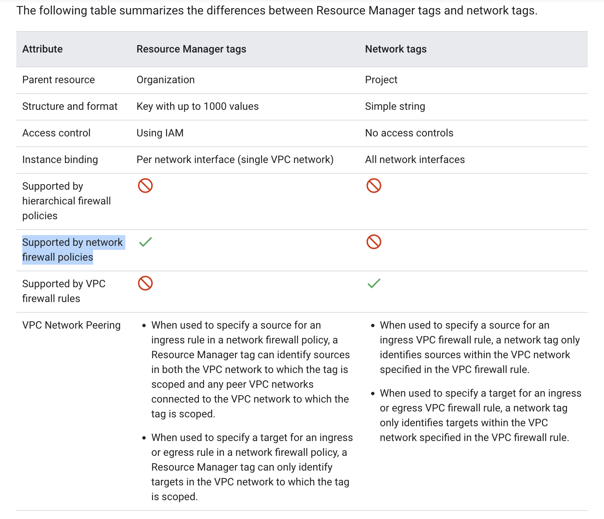

## Using managed services (e.g., Cloud SQL, Memorystore)

VPC Service Perimeter

## Third-party device insertion (NGFW) into VPC using multi-NIC and internal load balancer as a next hop or equal-cost multi-path (ECMP) routes

* https://cloud.google.com/vpc/docs/create-use-multiple-interfaces#configuring_policy_routing
* https://cloud.google.com/load-balancing/docs/internal/ilb-next-hop-overview
* https://cloud.google.com/load-balancing/docs/internal/setting-up-ilb-next-hop


</details>
<details>
<summary> 1.3 Designing a hybrid and multi-cloud network. </summary>

## Cloud Interconnect design (Dedicated Interconnect vs. Partner Interconnect)

List of Google's Point of Presence (PoP) can be found [here](https://cloud.google.com/network-connectivity/docs/interconnect/concepts/choosing-colocation-facilities#locations-table).

With both _Dedicated Interconnect_ and _Partner Interconnect,_ you can design a Cloud interconnect solution to exchange private IP addresses (that is, RFC 1918) between your on-premises network and your VPC in Google Cloud. These interconnection solutions are considered private, and they do not traverse over the internet. Additionally, they offer an SLA and thus they should be considered when your Cloud interconnect runs business-critical traffic.

### Dedicated

Allows you connect your own devices from a remote location to the facility provider's location via a Layer 1 circuit such as dark fiber or 10Gbps optical wave circuits. You router must have some technical requirements to get attached to Google peering edge. They are as listed below:

* 10/100 Gbps circuits with single-mode fiber: The Institute of Electrical and Electronics Engineers (IEEE) 10GBASE-LR(1310) and IEEE 100GBASE-LR4 optics
* IPv2 link-local addressing
* Link Aggregation Control Protocol (LACP) even with on single circuit
* EBGP-4 with multi-hop
* IEEE 802.1Q VLANs

If these requirements are met you can build dedicated internconnection to your VPC with multiple Ethernet links (upto 8 for 10 Gbps and 2 for 100 Gps), each one carrying 10 or 100 Gps of max througput.

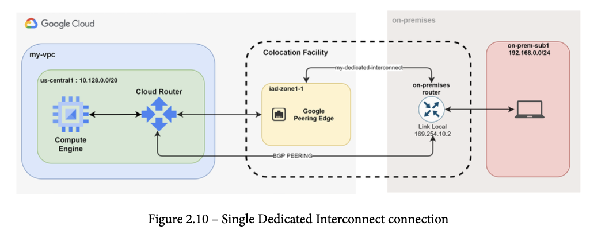

To build a _Dedicated Interconnect_ connection you are required to build a BGP (Border Gateway Protocol) peering with Cloud Router. The Cloud Router could be deployed in the same region in which you have the Google peering edge, but is not mandatory. Google has backbone connectivity and SDN (Software Defind Networking) between all interconnect edge POPs and every region within a continent.

### Partner Interconnect

If you are far from one of the colocation facilities you can rely on a Google Cloud-supported _service provider (SP)_. List of all available partner SP's can be found at the following link: https://cloud.google.com/network-connectivity/docs/interconnect/concepts/service-providers#by-provider.

Partner Interconnect allows for more flexible bandwidth from 50 megabits per second to 50 gigabits per second, also there is no device hardware technical requirements to meet.

Offers two connectivity options:

* **Layer 2 connectivity**:
  - emulates an Ethernet circuit accross the SP network and thus allows your on-premises router to be vitually interconnected with the Google peering edge.
  - You are requried to configure BGP peering between your on-prem router and Cloud Router in your VPC
* **Layer 3 connectivity**:
  - Provides IP connectivity between your on-premises router and Cloud Router in your VPC.
  - The SP establishes the BGP peering with Cloud Router and extends IP connectivity to your on-prem router. Cloud Router only supports BGP dynamic routing

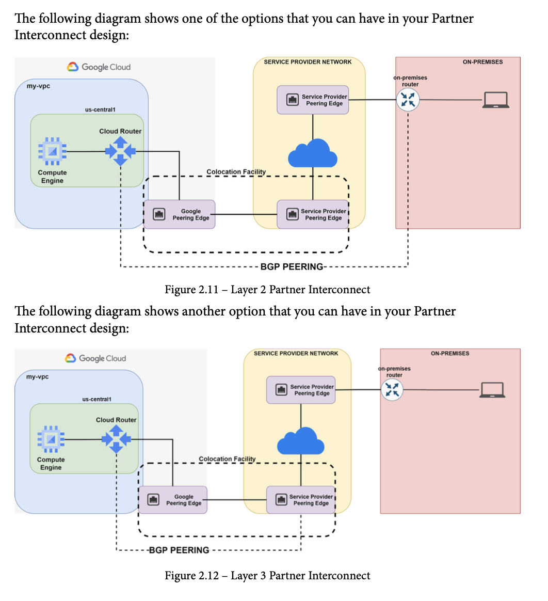

Pricing : https://cloud.google.com/network-connectivity/docs/interconnect/pricing#dedicated-interconnect-pricing


## Peering Options (Direct vs Carrier)

The main reason to consider peering options in your design is when you want to publicly access Google Cloud services and APIs from your on-premises network. Indeed, Google allows you to exchange BGP public routes with your on-premises network by establishing BGP peering.

You can establish BGP peering with Google Cloud with two peering options, as follows:

* **Direct Peering**:
  - co-located option requiring you have your physiscal device attached to a Google device edge
  - exchange BGP public routes directly with Goolge AS (ASN 15169)
  - allows you to connect directly to public IP address of Google services and Google Cloud products.
  - Google Cloud requires you to have `24/7` network operations center (NOC) contact and up-to-date maintainer, **ASN**, **AS-SET**, and router objects in the Internet Routing Registry (IRR).
  - note that if your workload requires super-low latency (<5 milliseconds (ms)) between your on-premises VMs and GCE instances, you must refer to the following list of colocation facilities: https://cloud.google.com/network-connectivity/docs/interconnect/concepts/choosing-colocation-facilities-low-latency#locations-table.
  - Pricing:
    - https://cloud.google.com/network-connectivity/docs/direct-peering#pricing
* **Carrier Peering**:
  - establish BGP peering with Google even though you are not co-located in one of the Google POPs
  - can be achived through a support SP that provides IP connectivity to the Google network.
  - Pricing :
    - https://cloud.google.com/network-connectivity/docs/carrier-peering#pricing
    - Service Provider fees are extra

**NOTE: With both Direct and Carrier Peering Google cannot offer SLAs, recommends using either Dedicated or Partner Interconnects solutions**


## IPsec VPN

* Establishes a secure tunnel across the internet to interconnect the VPC network and your on-premises network privately.
* Use when Cloud Interconnect is not an option (availability or pricing is too high)
* Can be used to interconnect multi-clouds (aws, azure)
* Encrypts traffic using IPSec technology and can be easily setup if you have a dedicated device (router or firewall)
* Carry up to 3 Gbps traffic per IPSec tunnel for both ingress and egress

There are two types:

* **Classic VPN**:
  - single IPSec VPN Gateway
  - uses on external IP address as an endpoint to terminiate a single encrypted tunnel
  - can route traffic using both dynamic and static routing
  - eventually be discontinued, therefore recommend using HA VPN at all times
  - One interface and one IP address reaches 99.9% SLAs
  - Does not support IPv6 addressing
* **HA VPN**:
  - uses two external IP addresses as an endpoint to terminiate two encrypted tunnels
  - dynamic routing must be adopted in order to choose between active/passive and active/active IPSec solutions
  - If you decide to deploy multiple HA VPN gateways in multiple regions, make sure you apply active/active tunnel configuration to avoid traffic loss.
  - Use active/passive tunnel configuration when deploying a single gateway.
  - With two interfaces and two IP addresses reaches 99.99% SLA

Important Specifications that should be considered when designing you Cloud VPN:

* **The tunnel MTU is 1460 bytes**:
  - To avoid packet fragmentation and improve the quality of service (QoS) of your application that runs on top of the IPSec tunnel, make sure that the _maximum segment size (MSS)_ is respected. This is for both TCP and UDP traffic.
* **Cloud VPN IPSec Specifications**:
  - **Internet Key Exchange (IKE)**:
    - v1 and IKEv2 are both supported
    - IKE pre-shared keys are only supported. _Rivest-Shamir-Adleman (RSA)_ authentication is not supported.
    - **Extensisble Service Proxy (ESP)** in tunnel mode is only supported. ESP in transport mode is not supported.
    - **Network Address Translation Traversal (NAT-T)** is supported.

**Creating a Classic VPN**

1. Create the target gateway object
```
gcloud compute target-vpn-gateways create GW_NAME \
   --network=NETWORK \
   --region=REGION \
   --project=PROJECT_ID
```

2. Create the regional (external) ip
```
gcloud compute addresses create GW_IP_NAME \
   --region=REGION \
   --project=PROJECT_ID
```

3. Create three forwarding rules; these rules instruct Google Cloud to send ESP (IPsec), UDP 500, and UDP 4500 traffic to the gateway:
```
gcloud compute forwarding-rules create fr-GW_NAME-esp \
   --load-balancing-scheme=EXTERNAL \
   --network-tier=PREMIUM \
   --ip-protocol=ESP \
   --address=GW_IP_NAME \
   --target-vpn-gateway=GW_NAME \
   --region=REGION \
   --project=PROJECT_ID
```
```
gcloud compute forwarding-rules create fr-GW_NAME-udp500 \
   --load-balancing-scheme=EXTERNAL \
   --network-tier=PREMIUM \
   --ip-protocol=UDP \
   --ports=500 \
   --address=GW_IP_NAME \
   --target-vpn-gateway=GW_NAME \
   --region=REGION \
   --project=PROJECT_ID
```
```
gcloud compute forwarding-rules create fr-GW_NAME-udp4500 \
   --load-balancing-scheme=EXTERNAL \
   --network-tier=PREMIUM \
   --ip-protocol=UDP \
   --ports=4500 \
   --address=GW_IP_NAME \
   --target-vpn-gateway=GW_NAME \
   --region=REGION \
   --project=PROJECT_ID
```
4. Create the tunnel

In the commands, replace the following:

* _TUNNEL_NAME_: a name for the tunnel
* _ON_PREM_IP_: the external IP address of the peer VPN gateway
* _IKE_VERS_: 1 for IKEv1 or 2 for IKEv2

**Known issue**: When configuring VPN tunnels to AWS, use the IKEv2 encryption protocol and select fewer transform sets on the AWS side; otherwise, the Cloud VPN tunnel can fail to rekey. For example, select a combination of single Phase 1 and Phase 2 encryption algorithms, integrity algorithms, and DH group numbers.
This rekeying issue is caused by a large SA payload size for the default set of AWS transform sets. This large payload size results in IP fragmentation of IKE packets on the AWS side, which Cloud VPN does not support.

* _SHARED_SECRET_: your pre-shared key (shared secret). The pre-shared key for the Cloud VPN tunnel must match the one used when you configure the counterpart tunnel on the peer VPN gateway. To generate a cryptographically strong pre-shared key, follow these directions.

For policy-based VPN:
* _LOCAL_IP_RANGES_: a comma-delimited list of the Google Cloud IP ranges. For example, you can supply the CIDR block for each subnet in a VPC network. This is the left side from the perspective of Cloud VPN.
* _REMOTE_IP_RANGES_: a comma-delimited list of the peer network IP ranges. This is the right side from the perspective of Cloud VPN.


```
gcloud compute vpn-tunnels create TUNNEL_NAME \
    --peer-address=ON_PREM_IP \
    --ike-version=IKE_VERS \
    --shared-secret=SHARED_SECRET \
    --local-traffic-selector=LOCAL_IP_RANGES \
    --remote-traffic-selector=REMOTE_IP_RANGES \
    --target-vpn-gateway=GW_NAME \
    --region=REGION \
    --project=PROJECT_ID
```

To configure route based VPN tunnel see r[outing options](https://cloud.google.com/network-connectivity/docs/vpn/concepts/choosing-networks-routing#ts-tun-routing) for details:

```
gcloud compute vpn-tunnels create TUNNEL_NAME \
    --peer-address=ON_PREM_IP \
    --ike-version=IKE_VERS \
    --shared-secret=SHARED_SECRET \
    --local-traffic-selector=0.0.0.0/0 \
    --remote-traffic-selector=0.0.0.0/0 \
    --target-vpn-gateway=GW_NAME \
    --region=REGION \
    --project=PROJECT_ID
```
5. Create the route
```
gcloud compute routes create ROUTE_NAME \
    --destination-range=REMOTE_IP_RANGE \
    --next-hop-vpn-tunnel=TUNNEL_NAME \
    --network=NETWORK \
    --next-hop-vpn-tunnel-region=REGION \
    --project=PROJECT_ID
```

## Cloud Router

Whether using Cloud Interconnect or Cloud VPN, Cloud Router is a constant. Fully distributed and managed service that exchanges dynamic routes at scale. Support static and dynamic routing (BGP only). Fundamental component in the follwoing networking products:

* **Cloud NAT**
* **Cloud Internconnect (Dedicated & Parnter)**
* **Cloud HA VPN**
* **Classic VPN**

Deployed into one region in your VPC which has two different types of dynamic routing mode that influences Cloud Router advertising behavior:

* **Regional dynamic routing**:
  - knows only the subnets attached to the region its deployed in.
  - only advertises the subnets that reside in its REGION_NAME
  - routes learned only apply to the subnets in the the same region as the Cloud Router
* **Gloabl dynamic routing**:
  - all subnets that belong to the VPC in which its deployed
  - advertises all VPC subnets
  - routes learned by the Cloud Router apply to all subnets in regions in the VPC

If you need to control the routes the Cloud Router advertises your need to configure _custom route advertisements_, which are route polices that is applied to all BGP sessions or per individual BGP peer that Cloud Router has.

Need to decide how to handle inbound and outbound routing:

* **AS_PATH PREPEND**:
  - changes the length of the BGP _PATH_ attribute to prefer one way over another.
  - applies only within a single Cloud Router with mulitple BGP sessions
  - not uses with two or more Cloud Router instances
  - currently no means to change **AS_PATH** when advertising from GCP to on-premises. Only **MED** is used in both ingress and egress directions.
* **multi-exit discriminator (MED)**:
  - changes costs of a given prefix to prefer one way over another

**Creating a Cloud Router**

```
gcloud compute routers create ROUTER_NAME_1 \
   --region=REGION \
   --network=NETWORK_1 \
   --asn=PEER_ASN_1
```

_PEER_ASN_1_ and _PEER_ASN_2_: any private ASN (64512 through 65534, 4200000000 through 4294967294) that you are not already using.

## Failover and disaster recovery strategy

### DR Design with Cloud Router and a multi-regional HA VPN


As Figure 2.13 shows, to design a multi-regional HA VPN solution, you must have two Cloud Routers and HA VPN gateways in your VPC. In addition, global routing mode should be enabled in your VPC. An HA VPN gateway allows you to have two external IP addresses on which you can build two IPsec tunnels. Moreover, Cloud Routers allow you to design active/active solutions in which both routers serve regional traffic and can be a backup for the other one in case of regional traffic loss. You can achieve this using a BGP _MED_ attribute. As shown in the preceding diagram, each Cloud Router instance advertises VPC subnets with different _MED_ values in order to communicate how the traffic from the on-premises network should enter the VPC. More specifically, you will notice that each Cloud Router instance announces VPC subnets with different _MED_ values. This is because Cloud Router takes the base priority and adds the regional cost to the _MED_ value. This happens when Cloud Router advertises subnet prefixes from other regions.

For local subnets, Cloud Router only advertises the base priority as BGP _MED_. In this manner, the traffic from your on-premises network will always use the appropriate regional gateway to reach your VPC subnets and will maintain a backup solution. In the example shown in the preceding diagram, traffic from the `172.16.10.0/24` network will use **US-GW** to reach sub1 because **US-GW**'s best BGP route is the one with the lowest _MED_ (that is, 100). On the contrary, traffic designated to sub2 will use **EU-GW** for the same reason.

In order to maintain symmetric routing in your design, you must advertise your on-premises subnets using _MED_. Google Cloud Router accepts _AS_PATH PREPEND_ when there are multiple BGP sessions terminated on the same Cloud Router. When
you have different Cloud Routers, only _MED_ is used in evaluating routing decisions. The recommendation is to maintain the same approach you choose with Cloud Router to have a simpler design.

### DR design with Cloud Router and Dedicated Interconnect

When you are designing hybrid Cloud interconnects for production and mission-critical applications that have a low tolerance to downtime, you should build an HA architecture that includes the following:
  * At least four Dedicated Interconnection connections, two for each metropolitan area. In each metro area, you should use separate Google edge availability domains that are connected to the VPC via separate VLAN attachments.
  * At least four Cloud Routers, two in each GCP rregion. Do this even if you have a GCE instance running on one single region.
  * Global dynamic routing mode must be set within the VPC.
  * Use two gateways in your on-premises network per each GCP region you are connecting with.

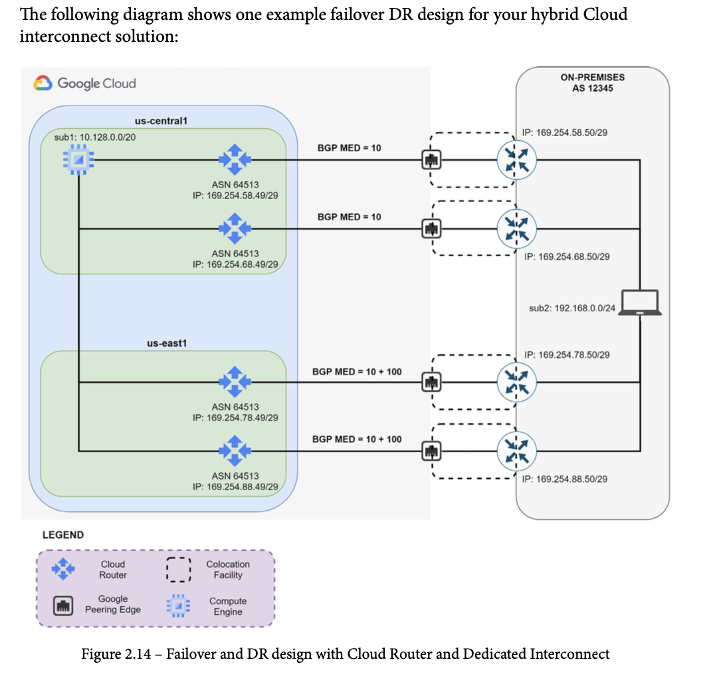

As shown in Figure 2.14, cloud routers exchange subnet prefixes with the on-premises routers using BGP. Indeed, in the DR design, you must use four BGP sessions, one for each VLAN attachment that you have in your co-location facility. Using BGP, you can exchange prefixes with different metrics (that is, MED). In this way, you can design an active/backup connectivity between sub1 (10.128.0.0/20) in your VPC and sub2 (192.168.0.0/24) in your on-premises network. Indeed, setting a base priority of
100 to sub1 in all your Cloud Routers allows you to have us-central1 Cloud Routers advertise two routes with lower MED values. On the contrary, us-east1 Cloud Routers will advertise two routes with higher MED values because they add to the base priority the regional cost between us-central1 and us-east1. In this manner, the on-premises routers will have two active routes toward the us-central1 Cloud Routers and two backup routes toward the us-east1 Cloud Routers. In case both Dedicated Interconnect links fail in the us-central1 region, BGP will reroute the traffic activating the path via us-east1. In this manner, you can design 99.99% availability interconnection between your VPC and on-premises network.

### DR design with Cloud Router and Partner Interconnect

When your applications require high levels of availability, but you are not physically co-located in one of the Google PoPs, then you need to select one of the supported SPs that will let you interconnect with Google Cloud infrastructure.
The Partner Interconnect failover and DR solution requires the following:
  * At least four VLAN attachments, each one connected to the SP peering edge.
  * At least four Cloud Routers, one for each VLAN attachment.
  * Global dynamic routing mode must be enabled on your VPC.
  * One on-premises router for each SP peering edge.

As discussed previously, you can design a Level 2 (L2) or Level 3 (L3) Partner Interconnect connection to reach your VPC in Google Cloud. Google recommends building an L2 interconnection when you want to have full control of your BGP routing. Instead, you can build an L3 interconnection when you want to delegate BGP routing to your SP. In this last case, you need to configure routing only between your on-premises routers and the SP routers. Here you can use any routing protocol that your SP supports (that is, BGP, OSPF, EIGRP, IS-IS).

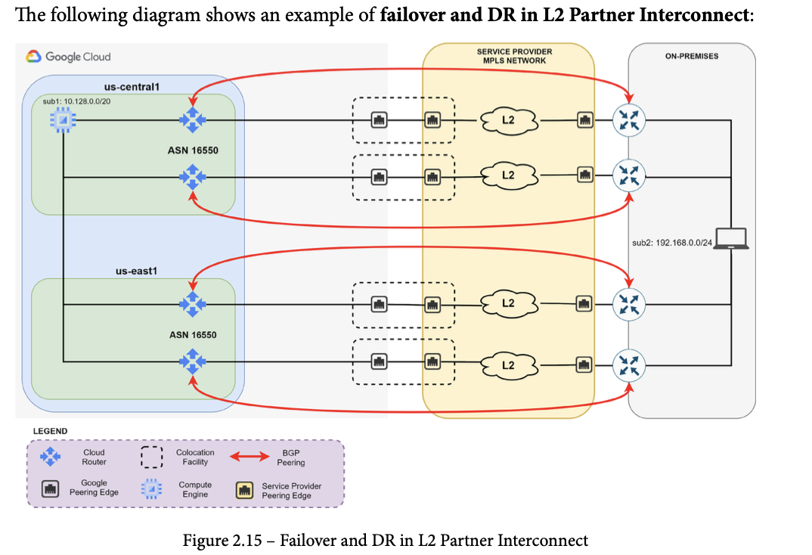

As you can see from Figure 2.15, the design of failover and DR in L2 Partner Interconnect is similar to what you have seen for Dedicated Interconnect except that now, the SP connects your on-premises routers to the GCP Cloud Router via the multi-protocol label switching (MPLS) L2 network. In this manner, you have a virtual Ethernet circuit between your on-premises routers and your Cloud Router. You can establish BGP peering between your Cloud Routers and on-premises routers directly and control the traffic as you would have done in a Dedicated Interconnect environment. Therefore, the recommendation is to use BGP MED to build active/backup connectivity between your subnets.

If you cannot have an L2 Partner Interconnect connection, or you just prefer L3 Partner Interconnect, you can design a failover and DR interconnection. See the following diagram for an example of this:


If you decide to use L3 Partner Interconnect for your failover design, you are required to establish BGP peering between your Cloud Routers/on-premises routers and the SP Edge routers. We recommend using BGP as a routing protocol to handle MED values and to easily achieve active/backup failover scenarios as well as in Dedicated Interconnect.
Now that you have been through the best practices for hybrid connectivity designs, it's time to learn how to design and plan container IP addressing for GKE.


    ●  Accessing multiple VPCs from on-premises locations (e.g., Shared VPC, multi-VPC peering topologies)

    ●  Bandwidth and constraints provided by hybrid connectivity solutions

    ●  Accessing Google Services/APIs privately from on-premises locations

    ●  IP address management across on-premises locations and cloud

    ●  DNS peering and forwarding

</details>
<details>
<summary> 1.4 Designing an IP addressing plan for Google Kubernetes Engine. </summary>

## Creating scalable GKE Clusters

To reach high availability best to go with a **regional cluster**. Regional clusters have multiple control planes across multiple zones and improves the resilience of the entire system. For situations where you require your GKE to upgrade rapidly, a **zonal cluster** is the way to go.

If you require increased reliability for your GKE workloads your should consider **multi-zonal Node pools** that allow you to distribute your workload uniformly across muliple compute zones within a region. Also you can enable a **cluster autoscaler** within a _Node pool_ to elastically increase or decrease the number of worker _Nodes_.

Kubernetes (k8s) control plane (Master) consists of the following components:
* _kube-apiserver_:
  - frontend of a k8s cluster
  - allows managers to control the entire cluster via APIs exposed, by using _kubectl_ command line tool
* _etcd_:
  - stores all the k8s data in the form of key-value pairs
* _kube-scheduler_:
  - responsible for assigning worker _Nodes_ to the newly created _Pods_
  - assignes _Nodes_ based on different policies or requirements
* _kube-dns_:
  - responsible for resolving names for Pod IPs and services

The following components operate on every worker _Node_:
* _kubelet_:
  - agent that makes sure that containers are running in _Pods_
* _kube_proxy_:
  - a network proxy which implements the Kubernetes service
  - responsible for _Pod_ communication inside and outside the cluster


### Public vs Private cluster

* **Private**:
    - Google recommendation
    - Worker Nodes only have private IP addresses and thus are isolated from the Internet
    - _VPC-native_ which allows VPC subnets to have a secondary range of IP addresses for all Pods running in the cluster. With VPC-native mode, routing traffic to Pods is automatically achieved without adding any custom routes to the VPC.
    - can be created in Standard or Autopilot mode
    - use a Cloud NAT to provide outbound internet connectivity
    - a Service of type _NodePort_ hosted in a private cluster is inaccessible to external clients because the node does not have an internet-routable public IP address.
    - has both a control plane private endpoint and a control plane public endpoint. You must specify a unique `/28` IP address range for the control plane's private endpoint, and you can choose to disable the control plane's public endpoint.
    - ensure Private Google Access is enabled on the subnet used by the private cluster when you create the cluster in order provide private nodes and their workloads access to Google Cloud APIs and services over Google's private network
* **Public**
  - Worker nodes have public and private IPs assigned
  - Control Plane is publicly available
  - NodePort service type can be used

Workload scalability impacts load balancing as well. GKE Ingress and Cloud Load Balancing allow your service running in your GKE cluster to be reachable from outside. They include many objects such as _forwarding rules_, _URL maps_, _backend services_, and more. Any of these services has a quota, and if the limits are reached, services and Ingress cannot be deployed. Therefore, to design a scalable GKE cluster, you should be aware of the load-balancer limits:

* **Internal TCP/UPD Load Balancer**:
  - 250 nodes per cluster
  - No node limit for services on clusters with internal TCP/UDP load-balancer subsetting enabeled
* **Externall HTTP(s) Load Balancer**:
  - 1,000 nodes per zone
  - No node limit when using container-native load Balancing
* **Internal HTTP(s) load balancer**:
  - No node limits

Additional thoughts should also be put into DNS when it comes to cluster scalability. Indeed, service discovery in GKE is provided by _kube-dns_, which is the principal component of DNS resolution of running Pods. When the workload increases, GKE automatically scales this component. However, for very large clusters, this is not enough. Therefore, Google Cloud's recommendation for high DNS scalability is to distribute DNS queries to each local Node. This can be implemented by enabling _NodeLocal DNSCache_. This caching mechanism allows any worker Nodes to answer queries locally and thus provide faster response times.

In general, when you design a scalable GKE cluster in order to support your applications, you should be aware of the limitations of Kubernetes. Even if the limitations may seem very high, it is crucial to know all of them in order to avoid performance degradation. Therefore, a clever design approach for a scalable GKE cluster should consider
the following:

* **Max Pods per Node are 100**:
  - GKE hard limit, gcp recommends not having more than two containers per pod
* **Total number of services should stay below 10,000**:
  - Perf of [_IPtables_](https://www.tkng.io/services/clusterip/dataplane/iptables/) will be impacted if there are too many services
* **Total number of Pods behind a single service should stay below 250**:
  - considered a safe threshold to maintain stability on _kube-proxy_ and _etcd_
* **Total number of services per namespace should not exceed 5,000**:
  - Pods may experience crashes on startup if limit is exceeded

### IP address planning in GKE

Google recommdends private clusters and _VPC-native_ networking.

**VPC-native** clusters have several benefits:
  * Pod IP addresses are natively routable within the cluster's VPC network and other VPC networks connected to it by VPC Network Peering.
  * Pod IP addresses are reserved in the VPC network before the Pods are created in your cluster. This prevents conflict with other resources in the VPC network and allows you to better plan IP address allocations.
  * Pod IP address ranges do not depend on custom static routes. They do not consume the system-generated and custom static routes quota. Instead, automatically-generated subnet routes handle routing for VPC-native clusters.
  * You can create firewall rules that apply to just Pod IP address ranges instead of any IP address on the cluster's nodes.
  * Pod IP address ranges, and subnet secondary IP address ranges in general, are accessible from on-premises networks connected with Cloud VPN or Cloud Interconnect using Cloud Routers.
  * Some features, such as network endpoint groups (NEGs), only work with VPC-native clusters.

Planning the IP address should follow these recommendations:

  * k8s control plane IP address range should be a private range (RFC-1918) and not should overlap with any other subnet within the VPC
  * Node subnet should accomodate the maximum number of Nodes expected in the cluster. A _cluster autoscaler_ can be used to limit the maximum number of Nodes in the cluster pool
  * Pods and service IPs should be implmenented as secondary ranges of your Node subnet using alias IP addresses in VPC-native Clusters:
    - recommended to use custom mode subnet for Flexibile cidr Ranges
    - the Pod subnet should be dimensioned on the maximum number of Pods per Node. By default, GKE allocates a `/24` range pe Node, which allows 110 maximum Pods per Node.
    - Avoid IP address overlapping between GKE subnets and on-premises subnets, Google recommends using the `100.64.0.0/10` (RFC 6598) range, which avoids interoperability issues
    - Recommended to use a seperate subnet for internal TCP/UDP loadbalancing if GKE services are being exposed. This allows you to improve security on the traffic to and from your GKE services.

NOTE: The maximum number of pods per Node in an Autopilot cluster is _32_ with a `/26` range for each Node, and these settings CANNOT be changed.

### Network Security Design in GKE

* Use private cluster and control access to it with _authorized networks_
  - In a private cluster _Pods_ communicate internally through the dedicated secondary subnet
* Use Cloud NAT to allow worker Nodes access to the Internet
* Enable **Private Google Access** to let worker Nodes private reach Google Services

The following diagram illustrates these recommendations:
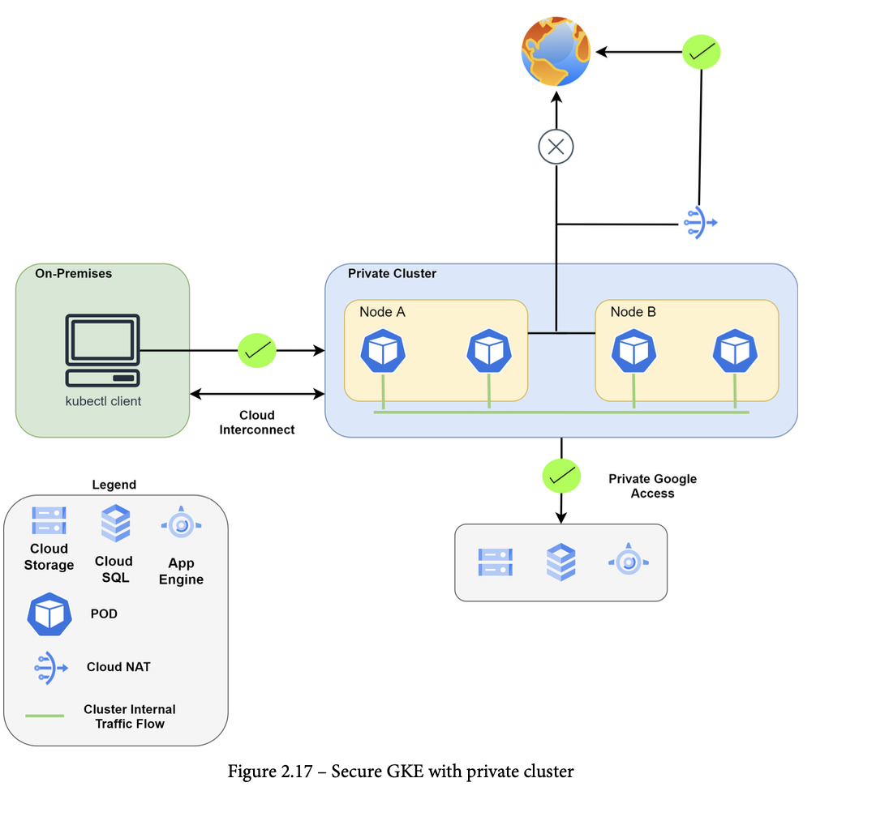

You can minimize exposure of your cluster's control plan in tow modes:

* `--enable-private-endpint`:
  - can be specified during cluster creation and allows a GKE cluster to be managed using Private IP only, the _Kubernetes API server_ will get a private IP address with the VPC
* **Authorized networks**:
  - used to control which IP subnet is able to access the GKE control-plane Nodes
  - applies to both public and private Endpoints

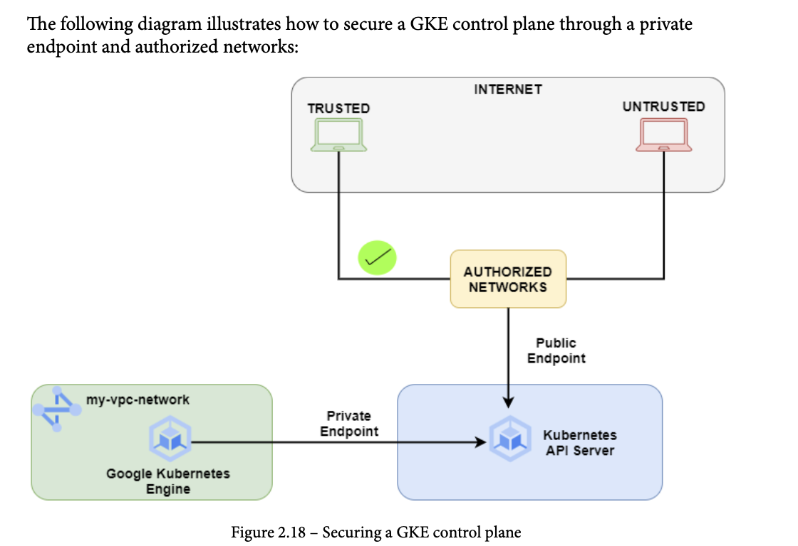

If you security is super high you may want to leverage GKE network policies to to have full control of traffic to and from Pods and services. Use the `--enable-network-policy` flag during cluster creation.

Also leverage Cloud Armor to prevent DDoS and web application attacks

</details>

# Section 2: Implementing Virtual Private Cloud (VPC) instances

<details>
<summary> 2.1 Configuring VPCs. </summary>

## Configuring VPC Networks

## Configuring and Managing Firewall ruleSet


    ●  Google Cloud VPC resources (e.g., networks, subnets, firewall rules)

    ●  VPC Network Peering

    ●  Creating a Shared VPC network and sharing subnets with other projects

    ●  Configuring API access to Google services (e.g., Private Google Access, public interfaces)

    ●  Expanding VPC subnet ranges after creation
</details>
<details>
<summary> 2.2 Configuring routing. </summary>

    ●  Static vs. dynamic routing

    ●  Global vs. regional dynamic routing

    ●  Routing policies using tags and priority

    ●  Internal load balancer as a next hop

    ●  Custom route import/export over VPC Network Peering
</details>
<details>
<summary> 2.3 Configuring and maintaining Google Kubernetes Engine clusters.</summary>

##  VPC-native clusters using alias IPs
## Clusters with Shared VPC
##  Creating Kubernetes Network Policies
##  Private clusters and private control plane endpoints

## Authorized Networks  


Adding authorized networks for cluster control plane endpoints

    ## A

</details>
<details>
<summary> 2.4 Configuring and managing firewall rules.</summary>

    ●  Target network tags and service accounts

    ●  Rule priority

    ●  Network protocols

    ●  Ingress and egress rules

    ●  Firewall rule logging

    ●  Firewall Insights

    ●  Hierarchical firewalls
</details>
<details>
<summary> 2.5 Implementing VPC Service Controls. </summary>

    ●  Creating and configuring access levels and service perimeters

    ●  VPC accessible services

    ●  Perimeter bridges

    ●  Audit logging

    ●  Dry run mode
</details>

# Section 3: Configuring network services
<details>
<summary> 3.1 Configuring load balancing. </summary>

    ●  Backend services and network endpoint groups (NEGs)

    ●  Firewall rules to allow traffic and health checks to backend services

    ●  Health checks for backend services and target instance groups

    ●  Configuring backends and backend services with balancing method (e.g., RPS, CPU, Custom), session affinity, and capacity scaling/scaler

    ●  TCP and SSL proxy load balancers

    ●  Load balancers (e.g., External TCP/UDP Network Load Balancing, Internal TCP/UDP Load Balancing, External HTTP(S) Load Balancing, Internal HTTP(S) Load Balancing)

    ●  Protocol forwarding

    ●  Accommodating workload increases using autoscaling vs. manual scaling
</details>
<details>
<summary> 3.2 Configuring Google Cloud Armor policies. </summary>

    ●  Security policies

    ●  Web application firewall (WAF) rules (e.g., SQL injection, cross-site scripting, remote file inclusion)

    ●  Attaching security policies to load balancer backends
</details>
<details>
<summary> 3.3 Configuring Cloud CDN. </summary>

    ●  Enabling and disabling

    ●  Cloud CDN

    ●  Cache keysInvalidating cached objects

    ●  Signed URLs

    ●  Custom origins
</details>
<details>
<summary> 3.4 Configuring and maintaining Cloud DNS. </summary>

    ●  Managing zones and records

    ●  Migrating to Cloud DNS

    ●  DNS Security Extensions (DNSSEC)

    ●  Forwarding and DNS server policies

    ●  Integrating on-premises DNS with Google Cloud

    ●  Split-horizon DNS

    ●  DNS peering

    ●  Private DNS logging
</details>
<details>
<summary> 3.5 Configuring Cloud NAT. </summary>

    ●  Addressing

    ●  Port allocations

    ●  Customizing timeouts

    ●  Logging and monitoring

    ●  Restrictions per organization policy constraints
</details>
<details>
<summary> 3.6  Configuring network packet inspection. </summary>

    ●  Packet Mirroring in single and multi-VPC topologies

    ●  Capturing relevant traffic using Packet Mirroring source and traffic filters

    ●  Routing and inspecting inter-VPC traffic using multi-NIC VMs (e.g., next-generation firewall appliances)

    ●  Configuring an internal load balancer as a next hop for highly available multi-NIC VM routing
</details>

# Section 4: Implementing hybrid interconnectivity

<details>
<summary> 4.1 Configuring Cloud Interconnect. </summary>

    ●  Dedicated Interconnect connections and VLAN attachments

    ●  Partner Interconnect connections and VLAN attachments
</details>
<details>
<summary> 4.2 Configuring a site-to-site IPsec VPN. </summary>

    ●  High availability VPN (dynamic routing)

    ●  Classic VPN (e.g., route-based routing, policy-based routing)
</details>
<details>
<summary> 4.3 Configuring Cloud Router. </summary>

    ●  Border Gateway Protocol (BGP) attributes (e.g., ASN, route priority/MED, link-local addresses)

    ●  Custom route advertisements via BGP

    ●  Deploying reliable and redundant Cloud Routers
</details>

# Section 5: Managing, monitoring, and optimizing network operations
<details>
<summary> 5.1 Logging and monitoring with Google Cloud’s operations suite. </summary>

    ●  Reviewing logs for networking components (e.g., VPN, Cloud Router, VPC Service Controls)

    ●  Monitoring networking components (e.g., VPN, Cloud Interconnect connections and interconnect attachments, Cloud Router, load balancers, Google Cloud Armor, Cloud NAT)
</details>
<details>
<summary> 5.2 Managing and maintaining security. </summary>

    ●  Firewalls (e.g., cloud-based, private)

    ●  Diagnosing and resolving IAM issues (e.g., Shared VPC, security/network admin)
</details>
<details>
<summary> 5.3 Maintaining and troubleshooting connectivity issues. </summary>

    ●  Draining and redirecting traffic flows with HTTP(S) Load Balancing

    ●  Monitoring ingress and egress traffic using VPC Flow Logs

    ●  Monitoring firewall logs and Firewall Insights

    ●  Managing and troubleshooting VPNs

    ●  Troubleshooting Cloud Router BGP peering issues
</details>
<details>
<summary> 5.4 Monitoring, maintaining, and troubleshooting latency and traffic flow. </summary>

    ●  Testing network throughput and latency

    ●  Diagnosing routing issues

    ●  Using Network Intelligence Center to visualize topology, test connectivity, and monitor performance

</details>
