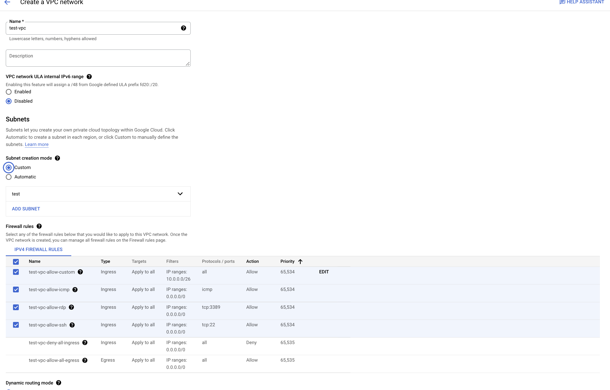
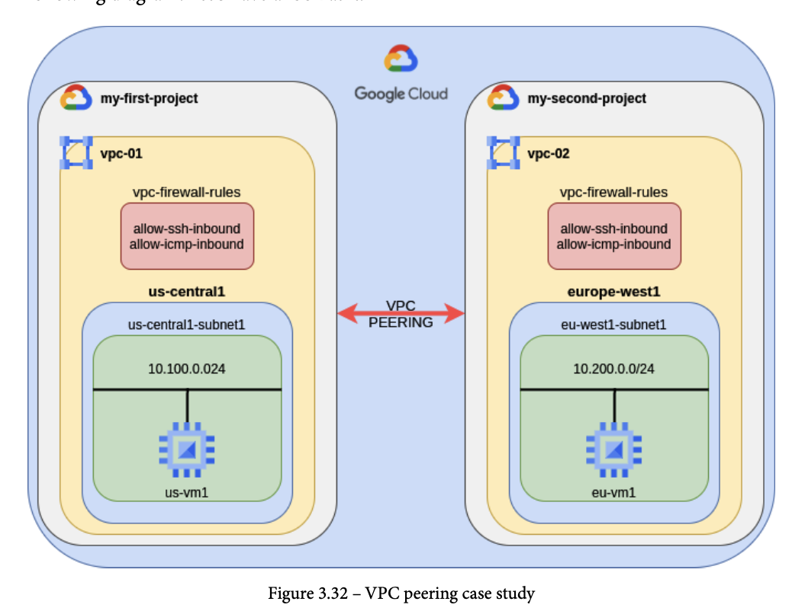
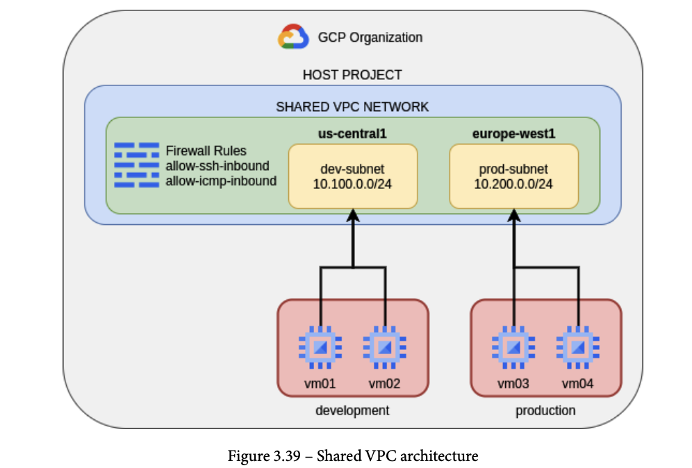
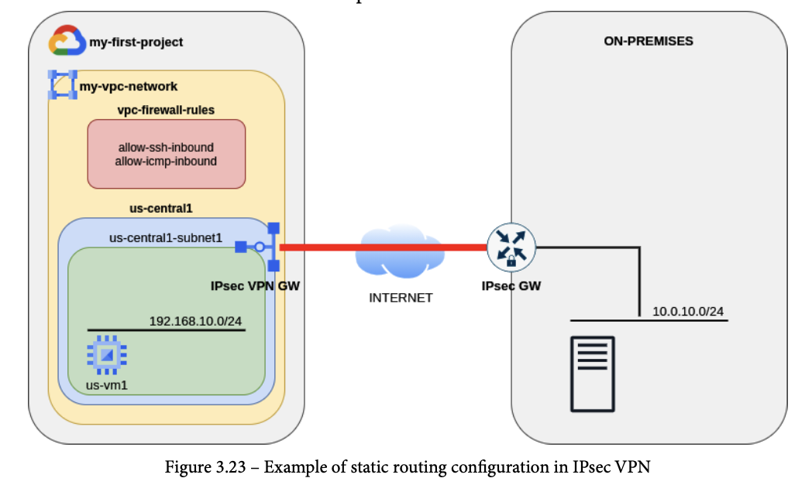
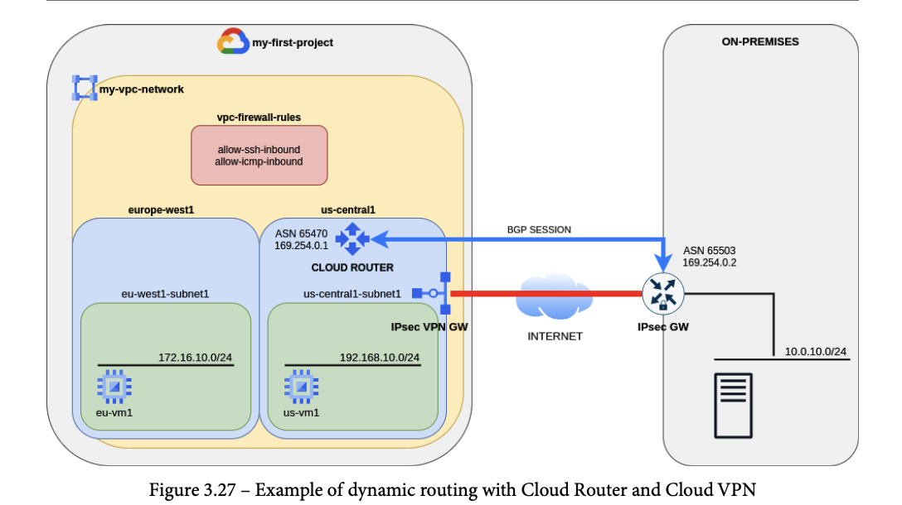
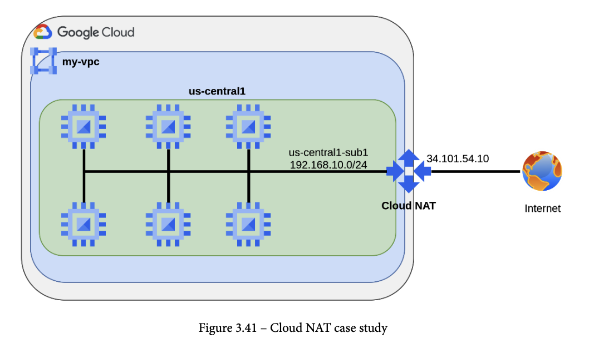
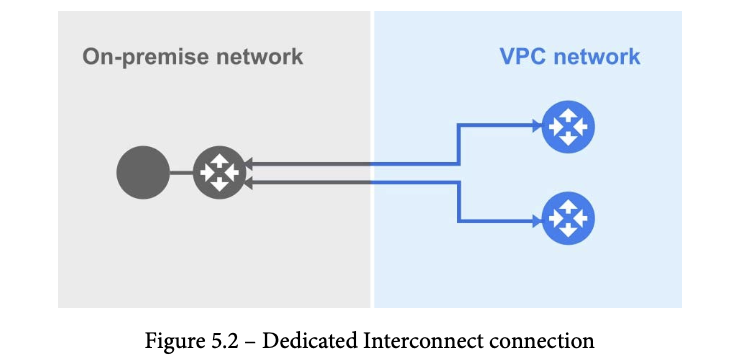
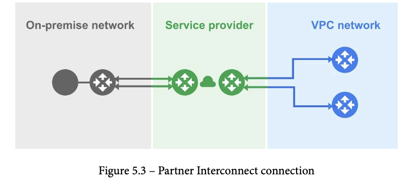

# Google Cloud - Professional Cloud Network Engineer Certification

[^1] A Professional Cloud Network Engineer implements and manages network architectures in Google Cloud. This individual may work on networking or cloud teams with architects who design cloud infrastructure. The Cloud Network Engineer uses the Google Cloud Console and/or command line interface, and leverages experience with network services, application and container networking, hybrid and multi-cloud connectivity, implementing VPCs, and security for established network architectures to ensure successful cloud implementations.

The Professional Cloud Network Engineer exam assesses your ability to:

*   Design, plan, and prototype a Google Cloud network
*   Implement Virtual Private Cloud (VPC) instances
*   Configure network services
*   Implement hybrid interconnectivity
*   Manage, monitor, and optimize network operations

[Link to the exam guide](https://cloud.google.com/certification/guides/cloud-network-engineer/)

# Section 1: Designing, planning, and prototyping a Google Cloud network

<details>
<summary> 1.1 Designing an overall network architecture </summary>

## High availability, failover, and disaster recovery strategies

### Failover and DR Strategy

Two important metrics that characterizes the business impacts:
*   **Recovery Time Objective (RTO)**:
    *   This metric is the maximum acceptable time that your service can be offline. It refers to the maximum allowed downtime for a service and how quickly the service should be restored.
*   **Recovery Point Objective (RPO)**:
    *   This metric is the maximum acceptable time that data might be lost due to a major incident. In other words, it tells you how much data your service can lose from the last backup. It also defines how frequently the data is backed up.

Smaller RTOs and RPOs determine higher costs as the complexity of infrastructure and services increases.

Disaster Recovery (DR) scenerios are based on the business recovery goals and determine the RTO and RPO.

DR Patterns:
*   **Cold**:
    *   Applies to business with having high RTO / RPO
    *   No additional resources to overcome issues
    *   Service is stopped until resources are created, started, and ready to receive traffic.
*   **Warm**:
    *   Applies to businesses with having a medium RTP / RPO
    *   Service architecture does have spare resources to overcome issues but they need to be started or configured to be ready for traffic
*   **Hot**:
    *   Applies when business is mission-critical and requires a low RTO and RPO.
    *   Service architecture does have spare resources, and they are running and processing user traffic even when faults have not occurred yet.

### High Availability (HA) Options

Products to consider:
*   **External Cloud Load Balancing**:
    -   Distributes user requests across various backends
    -   Group of VMs, or applications
    -   Provides a _health check_ system to determine whether a backend can receive and process user traffic
    -   Publishes a single global anycast IP address to let user traffic reach the closest backend that reduces latency.
*   **Cloud DNS**:
    -   Provides tools to automate the maintenance of DNS entries when recovery happens
    -   Leverage Google's Anycast Domain Name Servers network to server DNS requests.
    -   If DNS is on-prem, Cloud DNS can forward DNS requests from VMs that running in GCP.
*   **Cloud Connectivity**:
    -   Several options to connect on-premises network and the VPC in google cloud, such as _Dedicated Interconnect_ and _Direct Peering_ are two solutions with the highest availability.

Sample Disaster Recovery Workflow:


* Move DNS from on-prem to cloud dns first
* Users connect to Cloud DNS to resolve company URL
* Cloud DNS returns the A record of the anycast IP address of the global Cloud Load Balancing Service
* Using Cloud Load Balancing, traffic can be distribute and weighted to different backends that can be either:
    -   VM instances groups (managed or unmanaged)
    -   on-prem web server public IP
    -   Zonal NEG
    -   Serverless NEG
    -   Internet NEG
    -   Hybrid connectivity NEG
    -   Private Service Connect NEG
    -   Service Directory service bindings


## DNS strategy (e.g., on-premises, Cloud DNS)

Some situations require that DNS remain on-prem to resolve private names that some applications still use, therefore a hybrid solution will need to be established.

Choose a name pattern for corporate resources:
*   Complete domain seperation:
    -   seperate domain for on-prem vs cloud
    -   best to choose because it makes it extremely easy to forward DNS requests between Environments
*   GCP Domain as a subdomain:
    -   use a subdomain for all GCP resources which are subordinate to on-prem domain
    -   for instance use corp.enterprise.com for on-prem and gcp.corp.enterprise.com
    -   this pattern would apply if resources on-prem are far greater than ones in GCP
*   On-prem doamin as subdomain
    -   use a subdomain for all on-prem resources
    -   they are subordinate to the GCP domain
    -   corp.enterprise.com for GCP resources, dc.corp.enterprise.com for on-prem resources
    -   not common, applies to companies that have a small number of services on-premise


For hybrid environments the recommendation is for private DNS resolution is to use two separate authoritative DNS systems. Cloud DNS can be use as an authoritative DNS server for the GCP environment, while the existing DNS servers on-premises can still be used as an authoritative DNS server for the on-prem resources, as shown below.


With a two authoritative DNS systems hybrid architecture it is required to configure **forwarding zones** and **server policies**, Cloud DNS provides the two features to allow DNS name lookup between on-prem and GCP environments.

**Forwarding Zones** are used to query DNS records in your on-prem environment for corporate resources. Cloud DNS **does not** sync or cache on-premise records, thus it is important to maintain the on-prem DNS server to be as highly available as possible.

DNS **server policies** allow on-prem hosts to query DNS records in a GCP private DNS environment. Any time a host that is on-prem sends a request to resolve some instance name in gcp.entreprise.com, a inbound DNS forwarding rule in the DNS server policy must be created.


## Load balancing

There are several options for load balancing traffic in GCP, divided into two categories:

*   **External Load Balancer**
  -   Distributes traffic from the internet to a VPC
*   **Internal Load Balancer**
  -   Distributes traffic between instances in a VPC

GCP Load Balancers are divided into **Global** and **Regional** categories.

*   **Global**
  -    External HTTP(S) LB
  -    SSL Proxy LB
  -    TCP Proxy LB
  -    TCP/UDP Network LB
*   **Regional**
  -    Internal TCP/UDP Network LB
  -    Internall HTTP(s) LB

The following image outlines a decision tree on how to choose the appropriate Load Balancer for your workloads.


## Optimizing for latency (for example, maximum transmission unit (MTU) size; caches; content delivery network (CDN))

The following items should be considered when designing your network for latency optimization:

*   **Round-trip time (RTT)**:
  -   Time it takes for a packet to travel to the service and return it to the requesting user
*   **Server processing latency**
  -   Time it takes to complete the processing of a user request.
  -   For multi-tier applications, this time may involve multiple servers or services
*   **Server throughput**
  -   Amount out information that a server can serve in 1 second
  -   influences the network latency
    -   Higher the the throughput is the lower the time is needed to transmit data

Best practices to reduce latency:

*   Deploy backends each GCP region where your users are located and route traffic to nearest backends using Global LBs (Https / SSL/TCP Proxy do this automatically)
*   Using HTTPs/SSL/TCP Proxy lbs will minimize both latency and Time to First Byte (TFFB), reduces slow starts, reduces Transport Layer Security (TLS) handshakes for every SSL offloading session, automatically upgrades users sessions to HTTP/2, reducing number of packets transmitted
*   For multi-tier applications they should all be deployed in the same GCP region. Avoid inter-regional traffic
*   Leverage Cloud CDN for cacheable user traffic (images, static file, etc)
  -   Enable automatic static content caching
  -   Set expiration time carefully
  -   Use a custom cache key to improve cache hit ratio, by default GCP uses the entire Uniform Resource Locator (URL) to generate a key that is used for content search in the CDN.

## Network Security Design Strategy

*   Manage traffic with firewall rules
    -   leverage services accounts or tags to direct traffic between GCE Instances  
*   Limit external access
    -   avoid exposing GCE instances to the Internet, deploy Cloud NAT to let all the VMs in one region go out to reach external services
    -   deploy vms without public IPs (can use org policies to prevent the use of public ips)
    -   deploy private GKE clusters
    -   use Google Private Access for access google services
*   Centralize network control
    -   Use a Shared VPC
    -   A single Network Admin IAM account with the least number of permissions that allow network administrators to configure subnets, routes, firewall rules, and so on for all projects in the organization
*   Interconnect privately to your on-premises network
    -   based on network latency, bandwidth, and service-level aggreement (SLA) requirements, consider either Cloud Internconnect (Dedicated or Partner) or Cloud VPN to avoid traversing the Internet. Use Cloud Interconnect for the lowest latency and high scalability and reliablity for transfering data.
*   Secure your application and data
    -   Leverage VPC Service controls
    -   Cloud Identity-Aware Proxy (IAP)
    -   Cloud Armor
*   Control access to resources
    -   Assigning IAM roles with least privileged approach. Only necessary access should be granted to your resources.

## IAM roles

* Organization Admin
  -  Delegate Network and Sec Admin
* Compute Network Admin
    - roles/compute.netowkrAdmin
    - full control of compute engine networking resources
    - unable to create FW rules, IAM roles, & SSL certificates
* Compute Security Admin
    - roles/compute.securityAdmin
    - Full control of compute engine security resources such as creating/updating FW rules and ssl certificates
* Compute Shared VPC Admin
    - roles/compute.xpnAdmin
    - Manage hosts and service projects, set permissions on subnetworks for Users
* Compute Network User
    - roles/compute.networkUser
    - Provides access to use a shared vpc network
* Compute Network viewer
    - roles/compute.networkViewer
    - Read-only access to compute engine networking resources

Service Account accounts do not have passwords and cannot log in via browsers or cookies

Service Accounts use RSA key pairs (public/private) for Authentication to google cloud.

Service account user role grants permissions to get, list, or impersonate a service account.

## Choosing the right Network Service Tier

Network Service Tiers lets you optimize connectivity between systems on the internet and your Google Cloud instances. Premium Tier delivers traffic on Google's premium backbone, while Standard Tier uses regular ISP networks.

Use Premium Tier to optimize for performance, and use Standard Tier to optimize for cost.

Uses Cases for each tier:


|Premium Tier |	Standard Tier |
| ----------- | ------------- |
| Highest performance: Traffic between the internet and VM instances in your VPC network is routed by keeping it within  Google's network as much as possible. | Cost optimized: Traffic between the internet and VM instances in your VPC network is routed over the internet in general.|
|For services that need global availability.   | For services hosted entirely within a region.|
| Unique to Google Cloud, Premium Tier is the default unless you make configuration changes.  |  Performance is comparable to other cloud providers. |

**Premium**


**Standard**


The following decision tree will help decide which tier best fits:


## 1.1.g - Applying quotas per project and per VPC

Quotas: https://cloud.google.com/docs/quota
VPC Quotas: https://cloud.google.com/vpc/docs/quota#per_network


## 1.1.f - Hybrid connectivity (e.g., Google private access for hybrid connectivity)

## 1.1.g - Container networking


## 1.1.i - SaaS, PaaS, and IaaS services

## 1.1.j - Microsegmentation for security purposes (e.g., using metadata, tags, service accounts)

</details>
<details>
<summary> 1.2 Designing Virtual Private Cloud (VPC)</summary>

## Virtual Private Cloud (VPC)
By default every new GPC project has a default VPC in auto-mode which has a subnet in each region.

VPC is a global resource that is not associated to any region, subnets are regionally bound resources which define a range of IP addresses.

When creating a VPC your have two options:

*   Automatic Mode:
    -   Google will assign a "default" IP address range for each subnet (one per region), like the default VPC
    -    Addresses come from a predefined set of ranges that fit inside the 10.128.0.0/9 **classless inter-domain routing (CIDR)** block.
    -    used for quick/dirty option, development, poc
*   Custom Mode:
    -   Allows for manually defining regions and subnets that you assign to resources. NO overlapping IP addresses are allowed in the same VPC.
    -   At least ONE subnet must be created
    -   You must select a Primary IP address range for VMs, Load Balancers, and internal protocol forward can use
    -   used for production

The following table lists possible valid ranges for custom subnet IP addresses:


Some commonly reserved RFC ranges are not allowed in Google Cloud custom subnets, as outlined in the following table:


In every subnet four IP addresses are reserved from the primary range:

*   Network:
    -   172.16.10.0 in 172.16.10.0/24
    -   First address in the primary IP range for the subnet
*   Default Gateway:
    -   172.16.10.1 in 172.16.10.0 /24
    -   Second address in the primary IP range for the subnet
*   Second-to-last address
    -   172.16.10.254 in 172.16.10.0 /24
    -   Second-to-last address in the primary IP range that is reserved by google cloud for potential furtur use
*   Broadcast
    -  172.16.10.255 in 172.16.10.0 / 24
    -  Last address in the Primary IP range for the subnet

Your subnet can have primary and secondary CIDR ranges. This is useful if you want to maintain network separation between the VMs and the services running on them. One common use case is GKE. Indeed, worker Nodes get the IP address from the primary CIDR, while Pods have a separate CIDR range in the same subnet. This scenario is referred to as alias IPs in Google Cloud. Indeed, with **alias IPs**, you can configure multiple internal IP addresses in different CIDR ranges without having to define a separate network interface on the VM.


## IP address management and bring your own IP (BYOIP)

### RFC1918 (Address Allocation for Private Internets)

In the spec the **Internet Assigned Numbers Authority (IANA)** has reserved the following three blocks of the IP address space for private numbers:

*   10.0.0.0 - 10.255.255.255 (10/8 prefix)
*   172.16.0.0 - 17.31.255.255 (172.16/12 prefix)
*   192.168.0.0 - 192.168.255.255 (192.168/16 prefix)

All others addresses are potentially public.

When GCE VMs, GKE nodes/pods/services, internal load balancers (TCP/UDP or HTTPs load balancing), and internal protocol forwarding the assigned IP is _regional_ and internal.

For private service access resources will be assigned a _global_ internal IP address.

## Static vs Ephemeral IP Address

*   **Ephemeral**
    -   Default option
    -   released once the instance is stopped or deleted
    -   new IP is assigned to the instance/resource when a new one is created
*   **Static**
    -   Must be reserved in order to keep the lifetime beyond the lifetime of the resources it is assigned to
    -   Will incur costs, even when not in use

The following diagram shows how static IP address reservation will happen in the VPC:


You can see in the figure above the two ways to reserve a static IP address (either internal or external), as described in more detail here:
  *   You can start a new resource with an ephemeral address and then promote it to a static IP address.
  *   You can reserve a static IP address and only after that create an associated resource.

To reserve and manage static internal IP addresses, you need to be granted the `compute.networkAdmin` role, or one or more of the following permissions:
  *   `compute.addresses.create` on the IP address
  *   `compute.addresses.createInternal` on the IP address
  *   `compute.instances.update` on the VM instance
  *   `compute.subnetworks.use` on the subnetwork

The following gcloud command creates the resource to hold the reserved static internal IP address.

```
gcloud compute addresses create ADDRESS_NAME [ADDRESS_NAME..] \
    --region REGION --subnet SUBNETWORK \
    --addresses IP_ADDRESS
```

Omitting the `--addresses` will automatically reserve an IP address from the given subnet.

You can also use the `--global` and `ip-version` flag with to reserve an external static IP:

```
gcloud compute addresses create ADDRESS_NAME \
    --global \
    --ip-version [IPV4 | IPV6]
```
or for regional static IP address

```
gcloud compute addresses create ADDRESS_NAME \
    --region [REGION]
```

You assign an IP to a gce instance using the following:

```
gcloud compute instances create VM_NAME --address=IP_ADDRESS
```
### Alias IP Ranges

Google Cloud alias IP ranges let you assign ranges of internal IP addresses as aliases to a virtual machine's (VM) network interfaces. This is useful if you have multiple services running on a VM and you want to assign each service a different IP address. Alias IP ranges also work with GKE Pods.

If you have only one service running on a VM, you can reference it by using the interface's primary IP address. If you have multiple services running on a VM, you might want to assign each one a different internal IP address. You can do this with alias IP ranges.

Limitations can be found [here](https://cloud.google.com/vpc/docs/configure-alias-ip-ranges#limitations).

**Creating a subnet range alias**
```
gcloud compute networks subnets create s1 \
    --network NETWORK_NAME \
    --region REGION \
    --range 10.65.61.0/24 \
    --secondary-range RANGE_NAME=RANGE_CIDR;RANGE_NAME=RANGE_CIDR;...
```

**Add secondary CIDR range to existing subnet**
```
gcloud compute networks subnets update SUBNET_NAME \
    --region REGION \
    --add-secondary-ranges RANGE_NAME=RANGE_CIDR;RANGE_NAME=RANGE_CIDR;...
```

**Assign alias IP range to VM**
```
gcloud compute instances create vm1 \
    --zone ZONE \
    --network-interface "subnet=SUBNET_NAME,aliases=RANGE_CIDR;RANGE_CIDR;..."
```

Example :

```
gcloud compute instances create multi-nic-alias-vm \
    --machine-type f1-micro \
    --network-interface "subnet=my-subnet1,aliases=/32;range1:/24" \
    --network-interface "subnet=my-subnet2,aliases=/32;range2:/24"
```

**Assign to exsitng VM**

```
gcloud compute instances network-interfaces update INSTANCE_NAME \
    --zone ZONE \
    [--network-interface NETWORK_INTERFACE; default="nic0"]
    --aliases "RANGE_NAME:RANGE_CIDR;RANGE_NAME:RANGE_CIDR;..."
```

### BYOIP

Bring your own IP (BYOIP) lets you provision and use your own public IPv4 addresses for Google Cloud resources. After the IP addresses are imported, Google Cloud manages them in the same way as Google-provided IP addresses, with these exceptions:

The IP addresses are available only to the customer who brought them.

There are no charges for idle or in-use IP addresses.

Google DOES NOT support overlapping IP addresses as part of the BYOIP route announcements:

For example, importing 203.0.112.0/23 is not supported if 203.0.112.0/23 or a subset of this prefix, such as 203.0.112.0/24, is advertised outside Google. If Google and another network advertise the same route with matching or mismatched prefix lengths, you might experience unexpected routing and packet loss.

#### Live Migration

Use live migration to import a BYOIP prefix when any part of the prefix is already publicly advertised. Importing an advertised prefix without using live migration might cause unexpected routing and packet loss.

To bring your own IP to Google:

  * First create a public advertised prefix (PAP). Verification of ownership is done for this public advertised prefix using ROA and reverse DNS validation.
  * After verification is complete, we configure the announcement of this prefix to the internet, but the prefix is not advertised until it is provisioned. It takes up to four weeks for the public advertised prefix to be provisioned.

While you wait for the public advertised prefix to provision, you split the prefix into public delegated prefixes (PDP), which you configure to have regional or global scope. You can then either divide the public delegated prefix further, or use it to create assignable IP addresses. It takes up to four weeks for the public delegated prefix to be provisioned.

Once provisioning of the public delegated prefix is complete, the public advertised prefix is advertised to the internet. IP addresses in the public advertised prefix always use the Premium Tier of Network Service Tiers.


The following figure displays the same project with different configurations, one of which prevents the prefix from being advertised, and two which cause the public advertised prefix to be advertised.


https://cloud.google.com/vpc/docs/using-bring-your-own-ip


## Routes

### Routing Table
*   Every VPC has a routing table, defined at the VPC level, that defines the path (physical or virtual) that the IP packet follows from starting point (VM) to its destination.
*   Composed of many routes that have an order of applicability depending on some predefined rules
*   Each route has a single destination prefix and a unique next hop

### Route Types

**System-generated Routes**
Created automatically when a VPC Network is created and has two sub-types: _default route_ and _subnet routes_.

_Default Route_ (0.0.0.0/0) is the _gateway of the last resort_ which is used by the IP packet to leave the VPC when a more specific route is not present in the routing table. Default path toward every out-of-vpc destination, including internet and private Google access. Can be deleted, default route priority is 1,000.

_Subnet routes_ implied automatic routes in every created subnet in a VPC. These are generated by Google Cloud pointing to the subnet's primary IP address range (and another route pointing to the secondary IP range if defined). This has the highest priority of 0.

**Custom Routes**
Route manually added, static or dynamic.

_Static routes_ defined manually inside the VPC (destination prefix, priority, next hop, and optional tag).

_Dynamic routes_ created dynamically when using a Cloud Router which learns by means of the **Border Gateway Protocol (BGP)**.

Use the following gcloud command to manually add a static route:

```
gcloud compute routes create ROUTE_NAME \
    --destination-range=DEST_RANGE \
    --network=NETWORK \
    NEXT_HOP_SPECIFICATION
```

_NEXT_HOP_SPECIFICATION_ represents the next hop for the custom static route. You must specify only one of the following as a next hop. For more information about the different types of next hops, see Static route next hops.
  *   `--next-hop-gateway=default-internet-gateway`: Use this next hop to send traffic outside of the VPC network, including to the Internet or to the IP addresses for Private Google Access.
  *   `--next-hop-instance=INSTANCE_NAME` and `--next-hop-instance-zone=ZONE`: Use this next hop to direct traffic to an existing VM instance by name and zone. Traffic is sent to the primary internal IP address for the VM's network interface located in the same network as the route.
  *   `--next-hop-address=ADDRESS`: Use this next hop to direct traffic to the IP address of an existing VM instance.
  *   `--next-hop-ilb=FORWARDING_RULE_NAME` and `--next-hop-ilb-region=REGION`: Use this next hop with Internal TCP/UDP load balancer to distribute traffic to the load balancer, specified by internal forwarding rule name (or IP address) and region. The load balancer distributes traffic among healthy backends where the load balancer is transparent to the clients in a bump-in-the-wire fashion.
    -   `--next-hop-vpn-tunnel=VPN_TUNNEL_NAME` and `--next-hop-vpn-tunnel-region=REGION`: Use this next hop to direct traffic to a Cloud VPN tunnel that uses static routing.


**Peering Routes**

Route information exchanged when VPC's are peered to one another.

_Peering subnet routes_ route information exchanged to reach resources located in any VPC that is peered.

_Peering custom routes_ user defined route information imported/exported when any VPC network is peered.

### Route Order

The route selection process makes a lookup on the routing table adhering to the following:

1. Longest prefix match
2. Route priority
3. Route type and next hop

## Shared VPC vs VPC Network Peering

Two options for designing interconnections between two or more VPCs in Google Cloud they are _Shared VPC_ and _VPC Network Peering_.

### Shared VPC

Allows multiple projects within the same organization to share one VPC.

Split into two components:

* **Host project**
  - Contains one or more Shared VPC Networks
  - Created by the Shared VPC Admin
  - Can have one or more service projects attached
* **Service project**
  - Any project attached to a host project
  - Can only belong to **ONE** host project

**IAM roles**

* **Organization Admin (resourcemanager.organizationAdmin)**
  - IAM principal in the organization
  - They nominate Shared VPC Admins by granting them appropriate project creation and deletion roles, and the Shared VPC Admin role for the organization. These admins can define organization-level policies, but specific folder and project actions require additional folder and project roles.
* **Shared VPC Admin (compute.xpnAdmin and resourcemanager.projectIamAdmin)**
  - IAM principal in the organization, or
  - IAM principal in a folder (beta) Shared VPC Admins have the Compute Shared VPC Admin (compute.xpnAdmin) and Project IAM Admin (resourcemanager.projectIamAdmin) roles for the organization or one or more folders.
  - Perform various tasks necessary to set up Shared VPC, such as enabling host projects, attaching service projects to host projects, and delegating access to some or all of the subnets in Shared VPC networks to Service Project Admins. A Shared VPC Admin for a given host project is typically its project owner as well.
  - A user assigned the Compute Shared VPC Admin role for the organization has that role for all folders in the organization. A user assigned the role for a folder has that role for the given folder and any folders nested underneath it.
  - A Shared VPC Admin can link projects in two different folders only if the admin has the role for both folders.
  - Has full control using Network Admin (`roles/compute.networkAdmin`) and Security Admin (`roles/compute.securityAdmin`)
* **Service Project Admin (compute.networkUser)**
  - IAM principal in the organization, or
  - IAM principal in a host project, or
  - IAM principal in some subnets in the host project
  - Should be granted Network User `roles/compute.networkUser`  to use all shared vpc subnets

Apply Shared VPC Admin role to an existing IAM principal. Replace _ORG_ID_ with the organization ID number from the previous step, and _EMAIL_ADDRESS_ with the email address of the user to whom you are granting the Shared VPC Admin role.

```
gcloud organizations add-iam-policy-binding ORG_ID \
    --member='user:EMAIL_ADDRESS' \
    --role="roles/compute.xpnAdmin"

gcloud organizations add-iam-policy-binding ORG_ID \
    --member='user:EMAIL_ADDRESS' \
    --role="roles/resourcemanager.projectIamAdmin"
```


**Basic Shared VPC scenario**


As you can see from the figure above, the host project has the VPC network that contains one subnet for each GCP region. Additionally, the host project has two service projects attached. You will note that service projects do not have any VPC network. However, they can deploy GCE instances that get private IP addresses from the region in which they run.

**Hybrid Connectivity With Shared VPC**
If you need to interconnect Shared VPC with your on-premises network, this must be done through the host project. For example, if you are using Cloud VPN as an interconnection solution, this service must be deployed in the Shared VPC that is contained within the host project. The following diagram shows an example of hybrid connectivity with Shared VPC:


**Preventing Host Project Deletion**

When a project is configured to be a Shared VPC host project, a special lock—called a _lien_—is placed upon it. As long as the _lien_ is present, it prevents the project from being deleted accidentally. The lien is automatically removed from the host project when it is no longer configured for Shared VPC.

**Caution**: By default, a project owner can remove a _lien_ from a project, including a Shared VPC host project, unless an organization-level policy is defined to limit lien removal. (Specifically, lien removal requires an IAM principal with the `resourcemanager.projects.get` and `resourcemanager.projects.updateLiens` permissions on the project.)

The project owner for the host project could remove the _lien_ then delete the Shared VPC project. To prevent this from happening, follow the directions in this section.


A user with the `orgpolicy.policyAdmin` role can define an organization-level policy constraint (`constraints/compute.restrictXpnProjectLienRemoval`) that limits the removal of liens to just the following roles:

  * Users with `roles/owner` or `roles/resourcemanager.lienModifier` at the organization level
  * User with custom roles that include the `resourcemanager.projects.get` and `resourcemanager.projects.updateLiens` permissions at the organization level

To enforce the `compute.restrictXpnProjectLienRemoval` policy for your organization by running this command. Replace _ORG_ID_ with the number you determined from the previous step.

```
gcloud beta resource-manager org-policies enable-enforce \
      --organization ORG_ID compute.restrictXpnProjectLienRemoval
```

**Constraints**

* `constraints/compute.restrictSharedVpcHostProjects`: limits the set of hosts projects to which a non-host project or non-host projects in a folder or organization can be attached.
* `constraints/compute.restrictSharedVpcSubnetworks`: defines the set of subnets that can be accessed by a particular project or by projects in a folder or organization

Another mechanism to prevent Shared VPC host project from being deleted is to lock it to the billing account, details can be found [here](https://cloud.google.com/billing/docs/how-to/secure-project-billing-account-link).

### VPC Network Peering

Allows two or more VPCs to be interconnected even if they belong to different projects or organizations. Advantages are:
* Network Security: Services do not need to be exposed to the public Internet
* Network latency: Traffic remains confined to the Google worldwide network which is engineered for low-latency transport.
* Network costs: Google charges you an additional cost (as an egress bandwidth price) for whichever traffic uses external IPs, even if your traffic is within the same zone; using VPC Network Peering, you only pay for the regular network pricing.

VPC Peering allows for sharing and exchanging IP routes, subnet routes, or custom routes. Subnet routes are automatically exchanged between VPCs if they do not use privately used public IP addresses.

NOTE: overlapping IP's must be avoided between VPCs to allow VPC network peering to be established.

VPC Network Peering is not transitive, so (for example), if you have three VPCs—VPC A, VPC B, and VPC C—and you have one VPC Network Peering between VPC A and VPC B and another VPC Network Peering between VPC B and VPC C, then the following traffic is allowed:
  * VPC A can communicate with VPC B and vice versa.
  * VPC B can communicate with VPC C and vice versa.

Transit traffic is not allowed, as outlined here:
  * VPC A cannot communicate with VPC C.

If you want them to communicate with each other, you should configure a new VPC Network Peering, between VPC A and VPC C explicitly.

VPC Network Peering works with Compute Engine, GKE, and App Engine flexible environment.

VPC Network Peering supports IPv4 connectivity only. You can configure VPC Network Peering on a VPC network that contains dual-stack subnets. However, there is no IPv6 connectivity between the networks.

A dynamic route can overlap with a subnet route in a peer network. For dynamic routes, the destination ranges that overlap with a subnet route from the peer network are silently dropped. Google Cloud uses the subnet route.

The following routes are excluded from being imported and exported:
  * Tagged routes are never exchanged between peer networks. Tagged routes are custom static routes scoped to specific VM instances by using network tags. Network tags can only be resolved in the VPC network in which they're created.
  * Static routes with a next hop to the default Internet gateway are never exchanged. For example, the default route (0.0.0.0/0) with a next hop of default Internet gateway isn't exchanged between peer networks.

## Firewalls (e.g., service account-based, tag-based)

### Firewall Rules

Each GCP VPC contains one or more firewall rules and they work as
a distributed firewall. Therefore, they do not reside on a physical device that may cause a bottleneck, but they are instead distributed into the VPC and applied at the GCE instance level.

FW rules have the following specifications:
* Applied to one VPC network
* Stateful, no need to write a rule for returning traffic
* Controls either inbound traffic (ingress) and outbound traffic (egress)
* direction of traffic is always evaluated from GCP resource perspective
* have a target to whom the firewall rule is applied.
  - can be GCE instance, subgroup of them (referenced by tag), or a service account
* sorted by priority which are evaluated from lowest to highest
* have a condition to match
  - includes source or destination of the traffic and the protocol
* have an actions, either Allow or deny

By default each VPC have two implied rules, which are not visible to the user, one for egress to allow traffic to any destination IP )to 0.0.0.0/0) and an ingress rule to deny any traffic coming from any network (from 0.0.0.0/0).


#### Best practices for firewall rules
When designing and evaluating your firewall rules, keep in mind the following best practices:

  * Implement least-privilege principles. Block all traffic by default and only allow the specific traffic you need. This includes limiting the rule to just the protocols and ports you need.
  * Use hierarchical firewall policy rules to block traffic that should never be allowed at an organization or folder level.
  * For "allow" rules, restrict them to specific VMs by specifying the service account of the VMs.
  * If you need to create rules based on IP addresses, try to minimize the number of rules. It's easier to track one rule that allows traffic to a range of 16 VMs than it is to track 16 separate rules.
  * Turn on Firewall Rules Logging (`--enable-logging`) and use Firewall Insights to verify that firewall rules are being used in the intended way. Firewall Rules Logging can incur costs, so you might want to consider using it selectively.

#### IAMs

Permissions

`compute.regionFirewallPolicies.create|update|list|use`

Roles

`compute.securityAdmin` or `compute.networkAdmin`


### Firewall Policies
Grouping of several firewall rules so that you can update them all at once, effectively controlled by Identity and Access Management (IAM) roles. The policy contains rules that can explicitly deny or allow connections, as do Virtual Private Cloud (VPC) firewall rules.


#### Hierarchial Firewall Policies

* Grouping of rules into a policy object that can apply to many VPC networks in one or more projects. You can associate hierarchical firewall policies with an entire organization or individual folders.
* Contain rules that allow or deny connections, similar to VPC firewall rules do
* Can delegate evaluation rules to lower-level policies by using a `goto_next` action
* Differ from VPC network policies (firewall rules) by:
  - Every rule within a policy must have a different priority that decides the evaluation order
  - In addition to **Allow/Deny** actions, rules can evaluate lower-level policies with the `goto_next` actions
  - Using a tag in a target is not supported. Only networks and service accounts can be used.

  **Creating a organization firewall policy**

  ```
  gcloud compute firewall-policies create \
       --organization=123456789012 \
       --short-name="example-firewall-policy" \
       --description="rules that apply to all VMs in the organization"
  ```

  **Add firewall to policy***

  ```
  gcloud compute firewall-policies rules create 1000 \
      --action=allow \
      --description="allow-scan-probe" \
      --layer4-configs=tcp:123 \
      --firewall-policy=example-firewall-policy \
      --organization=123456789012 \
      --src-ip-ranges=10.100.0.1/32
  ```

  **Associate the rule to the policy**

  ```
  gcloud compute firewall-policies associations create \
      --firewall-policy=example-firewall-policy \
      --organization=123456789012
  ```


#### Global Network Firewall Policies

Grouping of rules into a policy object applicable to all regions (global). After you associate a global network firewall policy with a VPC network, the rules in the policy can apply to resources in the VPC network.

```
gcloud compute network-firewall-policies create \
    NETWORK_FIREWALL_POLICY_NAME
    --description DESCRIPTION --global
```

```
gcloud compute network-firewall-policies associations create \
    --firewall-policy POLICY_NAME \
    --network NETWORK_NAME \
    [ --name ASSOCIATION_NAME ] \
    --global-firewall-policy
```


#### Regional Network Firewall Policies

Grouping of rules into a policy object applicable to a specific region. After you associate a regional network firewall policy with a VPC network, the rules in the policy can apply to resources within that region of the VPC network.

**Creating a regional firewall policy and associate rule**
```
gcloud compute network-firewall-policies create \
    NETWORK_FIREWALL_POLICY_NAME
    --description DESCRIPTION \
    --region=REGION_NAME
```

```
gcloud compute network-firewall-policies associations create \
    --firewall-policy POLICY_NAME \
    --network NETWORK_NAME \
    --name ASSOCIATION_NAME  \
    --firewall-policy-region=REGION_NAME
    [ --replace-association-on-target true ]
```

```
gcloud compute network-firewall-policies rules create PRIORITY \
    --action ACTION \
    --firewall-policy POLICY_NAME \
    [--description DESCRIPTION ]\
    [--layer4-configs PROTOCOL_PORT] \
    [--target-secure-tags TARGET_SECURE_TAG[,TARGET_SECURE_TAG,...]] \
    [--target-service-accounts=SERVICE_ACCOUNT[,SERVICE_ACCOUNT,...]] \
    [--direction DIRECTION]\
    [--src-ip-ranges IP_RANGES] \
    [--src-secure-tags SRC_SECURE_TAG[,SRC_SECURE_TAG,...]] \
    [--dest-ip-ranges IP_RANGES] \
    [--enable-logging | --no-enable-logging]\
    [--disabled | --no-disabled]\
    --firewall-policy-region=REGION_NAME
```


All _hierarchical_, _global_, and _regional_ firewall policies have four pre-defined goto_next rules with lowest priority. These rules are applied to any connections that do not match an explicitly defined rule in the policy, causing such connections to be passed down to lower-level policies or network rules.

* IPv4 rules:
  - An egress rule whose destination is 0.0.0.0/0, with very low priority (2147483646), that sends processing of the connection to the next lower level of evaluation (goto_next).
  - An ingress rule whose source is 0.0.0.0/0, with a very low priority (2147483647), that sends processing of the connection to the next lower level of evaluation (goto_next).

* IPv6 rules:
  - An egress rule whose destination is ::/0, with very low priority (2147483644), that sends processing of the connection to the next lower level of evaluation (goto_next).

  - An ingress rule whose source is ::/0, with a very low priority (2147483645), that sends processing of the connection to the next lower level of evaluation (goto_next).

These pre-defined rules are visible, but cannot be modified or deleted. These rules are different from the implied and pre-populated rules of a VPC network.


Order of evaluation of firewall policies:


### Firewall Insights

Helps you better understand and safely optimize your firewall rules. It provides data about how your firewall rules are being used, exposes misconfigurations, and identifies rules that could be made more strict. It also uses machine learning to predict future usage of your firewall rules so that you can make informed decisions about whether to remove or tighten rules that appear to be overly permissive.

Firewall Insights uses Cloud Monitoring metrics and Recommender insights.

#### Metrics

Viewing the following metrics lets you see which firewall rules haven't been used recently.

* `firewall_hit_count`: metric tracks the number of times that a firewall rule was used to allow or deny traffic.
* `firewall_last_used_timestamp`: metric allows you to see the last time a particular firewall rule was used to allow or deny traffic by viewing the  metric.

**Cloud Logging**

Sample Cloud Logging query for firewall rules:

```
resource.type="gce_subnetwork"
logName="projects/PROJECT_ID/logs/compute.googleapis.com%2Ffirewall"
jsonPayload.instance.vm_name="INSTANCE_ID"
```

### Using tags for Firewalls

Create tags before you try to bind them to resources or use them in network firewall policies. To control network access, tags are only effective when bound to VM instances. For more details about creating tags.

The `tagAdmin` role lets you create new tags, update, and delete existing tags. An organization administrator can grant this role.

```
gcloud organizations add-iam-policy-binding ORGANIZATION_ID \
   --member=user:EMAIL_ADDRESS \
   --role=roles/resourcemanager.tagAdmin
```

The `tagUser` roles allow a user to use the tag to bind to a resource.

```
gcloud resource-manager tags keys add-iam-policy-binding ORGANIZATION_ID/TAG_KEY \
   --member=user:EMAIL_ADDRESS \
   --role=roles/resourcemanager.tagUser
```

Grant the `tagUser` to any and all values current and future

```
gcloud resource-manager tags values add-iam-policy-binding ORGANIZATION_ID/TAG_KEY/TAG_VALUE \
   --member=user:EMAIL_ADDRESS \
   --role=roles/resourcemanager.tagUser
```

Grant the `tagUser` role on the resources you want to bind the tags

```
gcloud projects add-iam-policy-binding PROJECT_NAME \
   --member=user:EMAIL_ADDRESS
   --role=roles/resourcemanager.tagUser
```

Tags used in firewall policies must be designated with a `GCE_FIREWALL` purpose. While the `GCE_FIREWALL` purpose is required for the tag to be used in networking features, you can use the tag for other actions.

Tags used in network firewall policies must have a scope limited to a single VPC.

**Creating a tag**
```
gcloud resource-manager tags keys create TAG_KEY \
   --parent organizations/ORGANIZATION_ID \
   --purpose GCE_FIREWALL \
   --purpose-data network=PROJECT_ID/NETWORK
```

**Add value(s) to tag**
```
gcloud resource-manager tags values create TAG_VALUE \
   --parent ORGANIZATION_ID/TAG_KEY
gcloud resource-manager tags values create TAG_VALUE \
   --parent ORGANIZATION_ID/TAG_KEY
```

**Using tags in Firewall policies**
```
gcloud compute network-firewall-policies rules create 1 \
    --firewall-policy FIREWALL_POLICY_NAME \
    --src-secure-tags ORGANIZATION_ID/TAG_KEY/TAG_VALUE \
    --target-secure-tags ORGANIZATION_ID/TAG_KEY/TAG_VALUE \
    --direction DIRECTION \
    --action ACTION \
    --layer4-configs tcp:PORT \
    --global-firewall-policy
```

**Resource vs Network Tag**


## Using managed services (e.g., Cloud SQL, Memorystore)

VPC Service Perimeter

## Third-party device insertion (NGFW) into VPC using multi-NIC and internal load balancer as a next hop or equal-cost multi-path (ECMP) routes

* https://cloud.google.com/vpc/docs/create-use-multiple-interfaces#configuring_policy_routing
* https://cloud.google.com/load-balancing/docs/internal/ilb-next-hop-overview
* https://cloud.google.com/load-balancing/docs/internal/setting-up-ilb-next-hop


</details>
<details>
<summary> 1.3 Designing a hybrid and multi-cloud network. </summary>

## Cloud Interconnect design (Dedicated Interconnect vs. Partner Interconnect)

List of Google's Point of Presence (PoP) can be found [here](https://cloud.google.com/network-connectivity/docs/interconnect/concepts/choosing-colocation-facilities#locations-table).

With both _Dedicated Interconnect_ and _Partner Interconnect,_ you can design a Cloud interconnect solution to exchange private IP addresses (that is, RFC 1918) between your on-premises network and your VPC in Google Cloud. These interconnection solutions are considered private, and they do not traverse over the internet. Additionally, they offer an SLA and thus they should be considered when your Cloud interconnect runs business-critical traffic.

### Dedicated

Allows you connect your own devices from a remote location to the facility provider's location via a Layer 1 circuit such as dark fiber or 10Gbps optical wave circuits. You router must have some technical requirements to get attached to Google peering edge. They are as listed below:

* 10/100 Gbps circuits with single-mode fiber: The Institute of Electrical and Electronics Engineers (IEEE) 10GBASE-LR(1310) and IEEE 100GBASE-LR4 optics
* IPv2 link-local addressing
* Link Aggregation Control Protocol (LACP) even with on single circuit
* EBGP-4 with multi-hop
* IEEE 802.1Q VLANs

If these requirements are met you can build dedicated internconnection to your VPC with multiple Ethernet links (upto 8 for 10 Gbps and 2 for 100 Gps), each one carrying 10 or 100 Gps of max througput.


To build a _Dedicated Interconnect_ connection you are required to build a BGP (Border Gateway Protocol) peering with Cloud Router. The Cloud Router could be deployed in the same region in which you have the Google peering edge, but is not mandatory. Google has backbone connectivity and SDN (Software Defind Networking) between all interconnect edge POPs and every region within a continent.

### Partner Interconnect

If you are far from one of the colocation facilities you can rely on a Google Cloud-supported _service provider (SP)_. List of all available partner SP's can be found at the following link: https://cloud.google.com/network-connectivity/docs/interconnect/concepts/service-providers#by-provider.

Partner Interconnect allows for more flexible bandwidth from 50 megabits per second to 50 gigabits per second, also there is no device hardware technical requirements to meet.

Offers two connectivity options:

* **Layer 2 connectivity**:
  - emulates an Ethernet circuit accross the SP network and thus allows your on-premises router to be vitually interconnected with the Google peering edge.
  - You are requried to configure BGP peering between your on-prem router and Cloud Router in your VPC
* **Layer 3 connectivity**:
  - Provides IP connectivity between your on-premises router and Cloud Router in your VPC.
  - The SP establishes the BGP peering with Cloud Router and extends IP connectivity to your on-prem router. Cloud Router only supports BGP dynamic routing


Pricing : https://cloud.google.com/network-connectivity/docs/interconnect/pricing#dedicated-interconnect-pricing


## Peering Options (Direct vs Carrier)

The main reason to consider peering options in your design is when you want to publicly access Google Cloud services and APIs from your on-premises network. Indeed, Google allows you to exchange BGP public routes with your on-premises network by establishing BGP peering.

You can establish BGP peering with Google Cloud with two peering options, as follows:

* **Direct Peering**:
  - co-located option requiring you have your physiscal device attached to a Google device edge
  - exchange BGP public routes directly with Goolge _Autonomous system number_ (ASN) (ASN 15169)
  - allows you to connect directly to public IP address of Google services and Google Cloud products.
  - Google Cloud requires you to have `24/7` network operations center (NOC) contact and up-to-date maintainer, **ASN**, **AS-SET**, and router objects in the Internet Routing Registry (IRR).
  - note that if your workload requires super-low latency (<5 milliseconds (ms)) between your on-premises VMs and GCE instances, you must refer to the following list of colocation facilities: https://cloud.google.com/network-connectivity/docs/interconnect/concepts/choosing-colocation-facilities-low-latency#locations-table.
  - Pricing:
    - https://cloud.google.com/network-connectivity/docs/direct-peering#pricing
* **Carrier Peering**:
  - establish BGP peering with Google even though you are not co-located in one of the Google POPs
  - can be achived through a support SP that provides IP connectivity to the Google network.
  - Pricing :
    - https://cloud.google.com/network-connectivity/docs/carrier-peering#pricing
    - Service Provider fees are extra

**NOTE: With both Direct and Carrier Peering Google cannot offer SLAs, recommends using either Dedicated or Partner Interconnects solutions**


## IPsec VPN

* Establishes a secure tunnel across the internet to interconnect the VPC network and your on-premises network privately.
* Use when Cloud Interconnect is not an option (availability or pricing is too high)
* Can be used to interconnect multi-clouds (aws, azure)
* Encrypts traffic using IPSec technology and can be easily setup if you have a dedicated device (router or firewall)
* Carry up to 3 Gbps traffic per IPSec tunnel for both ingress and egress

There are two types:

* **Classic VPN**:
  - single IPSec VPN Gateway
  - uses on external IP address as an endpoint to terminiate a single encrypted tunnel
  - can route traffic using both dynamic and static routing
  - eventually be discontinued, therefore recommend using HA VPN at all times
  - One interface and one IP address reaches 99.9% SLAs
  - Does not support IPv6 addressing
* **HA VPN**:
  - uses two external IP addresses as an endpoint to terminiate two encrypted tunnels
  - dynamic routing must be adopted in order to choose between active/passive and active/active IPSec solutions
  - If you decide to deploy multiple HA VPN gateways in multiple regions, make sure you apply active/active tunnel configuration to avoid traffic loss.
  - Use active/passive tunnel configuration when deploying a single gateway.
  - With two interfaces and two IP addresses reaches 99.99% SLA

Important Specifications that should be considered when designing you Cloud VPN:

* **The tunnel MTU is 1460 bytes**:
  - To avoid packet fragmentation and improve the quality of service (QoS) of your application that runs on top of the IPSec tunnel, make sure that the _maximum segment size (MSS)_ is respected. This is for both TCP and UDP traffic.
* **Cloud VPN IPSec Specifications**:
  - **Internet Key Exchange (IKE)**:
    - v1 and IKEv2 are both supported
    - IKE pre-shared keys are only supported. _Rivest-Shamir-Adleman (RSA)_ authentication is not supported.
    - **Extensisble Service Proxy (ESP)** in tunnel mode is only supported. ESP in transport mode is not supported.
    - **Network Address Translation Traversal (NAT-T)** is supported.


## Cloud Router

Whether using Cloud Interconnect or Cloud VPN, Cloud Router is a constant. Fully distributed and managed service that exchanges dynamic routes at scale. Support static and dynamic routing (BGP only). Fundamental component in the follwoing networking products:

* **Cloud NAT**
* **Cloud Internconnect (Dedicated & Parnter)**
* **Cloud HA VPN**
* **Classic VPN**

Deployed into one region in your VPC which has two different types of dynamic routing mode that influences Cloud Router advertising behavior:

* **Regional dynamic routing**:
  - knows only the subnets attached to the region its deployed in.
  - only advertises the subnets that reside in its REGION_NAME
  - routes learned only apply to the subnets in the the same region as the Cloud Router
* **Gloabl dynamic routing**:
  - all subnets that belong to the VPC in which its deployed
  - advertises all VPC subnets
  - routes learned by the Cloud Router apply to all subnets in regions in the VPC

If you need to control the routes the Cloud Router advertises your need to configure _custom route advertisements_, which are route polices that is applied to all BGP sessions or per individual BGP peer that Cloud Router has.

Need to decide how to handle inbound and outbound routing:

* **AS_PATH PREPEND**:
  - changes the length of the BGP _PATH_ attribute to prefer one way over another.
  - applies only within a single Cloud Router with mulitple BGP sessions
  - not uses with two or more Cloud Router instances
  - currently no means to change **AS_PATH** when advertising from GCP to on-premises. Only **MED** is used in both ingress and egress directions.
* **multi-exit discriminator (MED)**:
  - changes costs of a given prefix to prefer one way over another

**Creating a Cloud Router**

```
gcloud compute routers create ROUTER_NAME_1 \
   --region=REGION \
   --network=NETWORK_1 \
   --asn=PEER_ASN_1
```

_PEER_ASN_1_ and _PEER_ASN_2_: any private ASN (64512 through 65534, 4200000000 through 4294967294) that you are not already using.

## Failover and disaster recovery strategy

### DR Design with Cloud Router and a multi-regional HA VPN


As Figure 2.13 shows, to design a multi-regional HA VPN solution, you must have two Cloud Routers and HA VPN gateways in your VPC. In addition, global routing mode should be enabled in your VPC. An HA VPN gateway allows you to have two external IP addresses on which you can build two IPsec tunnels. Moreover, Cloud Routers allow you to design active/active solutions in which both routers serve regional traffic and can be a backup for the other one in case of regional traffic loss. You can achieve this using a BGP _MED_ attribute. As shown in the preceding diagram, each Cloud Router instance advertises VPC subnets with different _MED_ values in order to communicate how the traffic from the on-premises network should enter the VPC. More specifically, you will notice that each Cloud Router instance announces VPC subnets with different _MED_ values. This is because Cloud Router takes the base priority and adds the regional cost to the _MED_ value. This happens when Cloud Router advertises subnet prefixes from other regions.

For local subnets, Cloud Router only advertises the base priority as BGP _MED_. In this manner, the traffic from your on-premises network will always use the appropriate regional gateway to reach your VPC subnets and will maintain a backup solution. In the example shown in the preceding diagram, traffic from the `172.16.10.0/24` network will use **US-GW** to reach sub1 because **US-GW**'s best BGP route is the one with the lowest _MED_ (that is, 100). On the contrary, traffic designated to sub2 will use **EU-GW** for the same reason.

In order to maintain symmetric routing in your design, you must advertise your on-premises subnets using _MED_. Google Cloud Router accepts _AS_PATH PREPEND_ when there are multiple BGP sessions terminated on the same Cloud Router. When
you have different Cloud Routers, only _MED_ is used in evaluating routing decisions. The recommendation is to maintain the same approach you choose with Cloud Router to have a simpler design.

### DR design with Cloud Router and Dedicated Interconnect

When you are designing hybrid Cloud interconnects for production and mission-critical applications that have a low tolerance to downtime, you should build an HA architecture that includes the following:
  * At least four Dedicated Interconnection connections, two for each metropolitan area. In each metro area, you should use separate Google edge availability domains that are connected to the VPC via separate VLAN attachments.
  * At least four Cloud Routers, two in each GCP rregion. Do this even if you have a GCE instance running on one single region.
  * Global dynamic routing mode must be set within the VPC.
  * Use two gateways in your on-premises network per each GCP region you are connecting with.


As shown in Figure 2.14, cloud routers exchange subnet prefixes with the on-premises routers using BGP. Indeed, in the DR design, you must use four BGP sessions, one for each VLAN attachment that you have in your co-location facility. Using BGP, you can exchange prefixes with different metrics (that is, MED). In this way, you can design an active/backup connectivity between sub1 (10.128.0.0/20) in your VPC and sub2 (192.168.0.0/24) in your on-premises network. Indeed, setting a base priority of
100 to sub1 in all your Cloud Routers allows you to have us-central1 Cloud Routers advertise two routes with lower MED values. On the contrary, us-east1 Cloud Routers will advertise two routes with higher MED values because they add to the base priority the regional cost between us-central1 and us-east1. In this manner, the on-premises routers will have two active routes toward the us-central1 Cloud Routers and two backup routes toward the us-east1 Cloud Routers. In case both Dedicated Interconnect links fail in the us-central1 region, BGP will reroute the traffic activating the path via us-east1. In this manner, you can design 99.99% availability interconnection between your VPC and on-premises network.

### DR design with Cloud Router and Partner Interconnect

When your applications require high levels of availability, but you are not physically co-located in one of the Google PoPs, then you need to select one of the supported SPs that will let you interconnect with Google Cloud infrastructure.
The Partner Interconnect failover and DR solution requires the following:
  * At least four VLAN attachments, each one connected to the SP peering edge.
  * At least four Cloud Routers, one for each VLAN attachment.
  * Global dynamic routing mode must be enabled on your VPC.
  * One on-premises router for each SP peering edge.

As discussed previously, you can design a Level 2 (L2) or Level 3 (L3) Partner Interconnect connection to reach your VPC in Google Cloud. Google recommends building an L2 interconnection when you want to have full control of your BGP routing. Instead, you can build an L3 interconnection when you want to delegate BGP routing to your SP. In this last case, you need to configure routing only between your on-premises routers and the SP routers. Here you can use any routing protocol that your SP supports (that is, BGP, OSPF, EIGRP, IS-IS).


As you can see from Figure 2.15, the design of failover and DR in L2 Partner Interconnect is similar to what you have seen for Dedicated Interconnect except that now, the SP connects your on-premises routers to the GCP Cloud Router via the multi-protocol label switching (MPLS) L2 network. In this manner, you have a virtual Ethernet circuit between your on-premises routers and your Cloud Router. You can establish BGP peering between your Cloud Routers and on-premises routers directly and control the traffic as you would have done in a Dedicated Interconnect environment. Therefore, the recommendation is to use BGP MED to build active/backup connectivity between your subnets.

If you cannot have an L2 Partner Interconnect connection, or you just prefer L3 Partner Interconnect, you can design a failover and DR interconnection. See the following diagram for an example of this:


If you decide to use L3 Partner Interconnect for your failover design, you are required to establish BGP peering between your Cloud Routers/on-premises routers and the SP Edge routers. We recommend using BGP as a routing protocol to handle MED values and to easily achieve active/backup failover scenarios as well as in Dedicated Interconnect.
Now that you have been through the best practices for hybrid connectivity designs, it's time to learn how to design and plan container IP addressing for GKE.


    ●  Accessing multiple VPCs from on-premises locations (e.g., Shared VPC, multi-VPC peering topologies)

    ●  Bandwidth and constraints provided by hybrid connectivity solutions

    ●  Accessing Google Services/APIs privately from on-premises locations

    ●  IP address management across on-premises locations and cloud

    ●  DNS peering and forwarding

</details>
<details>
<summary> 1.4 Designing an IP addressing plan for Google Kubernetes Engine. </summary>

## Creating scalable GKE Clusters

To reach high availability best to go with a **regional cluster**. Regional clusters have multiple control planes across multiple zones and improves the resilience of the entire system. For situations where you require your GKE to upgrade rapidly, a **zonal cluster** is the way to go.

If you require increased reliability for your GKE workloads your should consider **multi-zonal Node pools** that allow you to distribute your workload uniformly across muliple compute zones within a region. Also you can enable a **cluster autoscaler** within a _Node pool_ to elastically increase or decrease the number of worker _Nodes_.

Kubernetes (k8s) control plane (Master) consists of the following components:
* _kube-apiserver_:
  - frontend of a k8s cluster
  - allows managers to control the entire cluster via APIs exposed, by using _kubectl_ command line tool
* _etcd_:
  - stores all the k8s data in the form of key-value pairs
* _kube-scheduler_:
  - responsible for assigning worker _Nodes_ to the newly created _Pods_
  - assignes _Nodes_ based on different policies or requirements
* _kube-dns_:
  - responsible for resolving names for Pod IPs and services

The following components operate on every worker _Node_:
* _kubelet_:
  - agent that makes sure that containers are running in _Pods_
* _kube_proxy_:
  - a network proxy which implements the Kubernetes service
  - responsible for _Pod_ communication inside and outside the cluster


### Public vs Private cluster

* **Private**:
    - Google recommendation
    - Worker Nodes only have private IP addresses and thus are isolated from the Internet
    - _VPC-native_ which allows VPC subnets to have a secondary range of IP addresses for all Pods running in the cluster. With VPC-native mode, routing traffic to Pods is automatically achieved without adding any custom routes to the VPC.
    - can be created in Standard or Autopilot mode
    - use a Cloud NAT to provide outbound internet connectivity
    - a Service of type _NodePort_ hosted in a private cluster is inaccessible to external clients because the node does not have an internet-routable public IP address.
    - has both a control plane private endpoint and a control plane public endpoint. You must specify a unique `/28` IP address range for the control plane's private endpoint, and you can choose to disable the control plane's public endpoint.
    - ensure Private Google Access is enabled on the subnet used by the private cluster when you create the cluster in order provide private nodes and their workloads access to Google Cloud APIs and services over Google's private network
* **Public**
  - Worker nodes have public and private IPs assigned
  - Control Plane is publicly available
  - NodePort service type can be used

Workload scalability impacts load balancing as well. GKE Ingress and Cloud Load Balancing allow your service running in your GKE cluster to be reachable from outside. They include many objects such as _forwarding rules_, _URL maps_, _backend services_, and more. Any of these services has a quota, and if the limits are reached, services and Ingress cannot be deployed. Therefore, to design a scalable GKE cluster, you should be aware of the load-balancer limits:

* **Internal TCP/UPD Load Balancer**:
  - 250 nodes per cluster
  - No node limit for services on clusters with internal TCP/UDP load-balancer subsetting enabeled
* **Externall HTTP(s) Load Balancer**:
  - 1,000 nodes per zone
  - No node limit when using container-native load Balancing
* **Internal HTTP(s) load balancer**:
  - No node limits

Additional thoughts should also be put into DNS when it comes to cluster scalability. Indeed, service discovery in GKE is provided by _kube-dns_, which is the principal component of DNS resolution of running Pods. When the workload increases, GKE automatically scales this component. However, for very large clusters, this is not enough. Therefore, Google Cloud's recommendation for high DNS scalability is to distribute DNS queries to each local Node. This can be implemented by enabling _NodeLocal DNSCache_. This caching mechanism allows any worker Nodes to answer queries locally and thus provide faster response times.

In general, when you design a scalable GKE cluster in order to support your applications, you should be aware of the limitations of Kubernetes. Even if the limitations may seem very high, it is crucial to know all of them in order to avoid performance degradation. Therefore, a clever design approach for a scalable GKE cluster should consider
the following:

* **Max Pods per Node are 100**:
  - GKE hard limit, gcp recommends not having more than two containers per pod
* **Total number of services should stay below 10,000**:
  - Perf of [_IPtables_](https://www.tkng.io/services/clusterip/dataplane/iptables/) will be impacted if there are too many services
* **Total number of Pods behind a single service should stay below 250**:
  - considered a safe threshold to maintain stability on _kube-proxy_ and _etcd_
* **Total number of services per namespace should not exceed 5,000**:
  - Pods may experience crashes on startup if limit is exceeded

### IP address planning in GKE

Google recommdends private clusters and _VPC-native_ networking.

**VPC-native** clusters have several benefits:
  * Pod IP addresses are natively routable within the cluster's VPC network and other VPC networks connected to it by VPC Network Peering.
  * Pod IP addresses are reserved in the VPC network before the Pods are created in your cluster. This prevents conflict with other resources in the VPC network and allows you to better plan IP address allocations.
  * Pod IP address ranges do not depend on custom static routes. They do not consume the system-generated and custom static routes quota. Instead, automatically-generated subnet routes handle routing for VPC-native clusters.
  * You can create firewall rules that apply to just Pod IP address ranges instead of any IP address on the cluster's nodes.
  * Pod IP address ranges, and subnet secondary IP address ranges in general, are accessible from on-premises networks connected with Cloud VPN or Cloud Interconnect using Cloud Routers.
  * Some features, such as network endpoint groups (NEGs), only work with VPC-native clusters.

Planning the IP address should follow these recommendations:

  * k8s control plane IP address range should be a private range (RFC-1918) and not should overlap with any other subnet within the VPC
  * Node subnet should accomodate the maximum number of Nodes expected in the cluster. A _cluster autoscaler_ can be used to limit the maximum number of Nodes in the cluster pool
  * Pods and service IPs should be implmenented as secondary ranges of your Node subnet using alias IP addresses in VPC-native Clusters:
    - recommended to use custom mode subnet for Flexibile cidr Ranges
    - the Pod subnet should be dimensioned on the maximum number of Pods per Node. By default, GKE allocates a `/24` range pe Node, which allows 110 maximum Pods per Node.
    - Avoid IP address overlapping between GKE subnets and on-premises subnets, Google recommends using the `100.64.0.0/10` (RFC 6598) range, which avoids interoperability issues
    - Recommended to use a seperate subnet for internal TCP/UDP loadbalancing if GKE services are being exposed. This allows you to improve security on the traffic to and from your GKE services.

NOTE: The maximum number of pods per Node in an Autopilot cluster is _32_ with a `/26` range for each Node, and these settings CANNOT be changed.

### Network Security Design in GKE

* Use private cluster and control access to it with _authorized networks_
  - In a private cluster _Pods_ communicate internally through the dedicated secondary subnet
* Use Cloud NAT to allow worker Nodes access to the Internet
* Enable **Private Google Access** to let worker Nodes private reach Google Services

The following diagram illustrates these recommendations:


You can minimize exposure of your cluster's control plan in tow modes:

* `--enable-private-endpint`:
  - can be specified during cluster creation and allows a GKE cluster to be managed using Private IP only, the _Kubernetes API server_ will get a private IP address with the VPC
* **Authorized networks**:
  - used to control which IP subnet is able to access the GKE control-plane Nodes
  - applies to both public and private Endpoints


If you security is super high you may want to leverage GKE network policies to to have full control of traffic to and from Pods and services. Use the `--enable-network-policy` flag during cluster creation.

Also leverage Cloud Armor to prevent DDoS and web application attacks

</details>

# Section 2: Implementing Virtual Private Cloud (VPC) instances

<details>
<summary> 2.1 Configuring VPCs. </summary>

## Configuring VPC Networks

For details on VPCs see [Section 1 - VPC Overview](#virtual-private-cloud-vpc)


**Create auto mode VPC using gcloud**

```
gcloud compute networks create NETWORK \
  --subnet-mode=SUBNET_MODE \
  --bgp-routing-mode=DYNAMIC_ROUTING_MODE \
  --mtu=MTU
```

_DYNAMIC_ROUTING_MODE_ can be either `global` or `regional` to control Cloud Router behavior

_SUBNET_MODE_ can be either `auto` or `custom`, _auto_ all subnets will be created automatically by GCP one in each region.

_MTU_ is the maximum transmission unit of the network. MTU can be set to any value from 1300 through 8896 (default is 1460). Its the size, in bytes, of the largest packet supported by a network layer protocol, including both headers and data.

For custom mode subnets you can also include the `--enable-ula-internal-ipv6` and/or `--internal-ipv6-range=ULA_IPV6_RANGE` to setup a dual-stack subnets with internal IPv6 addressing, otherwise only external IPv6 addresses will be created.

_ULA_IPV6_RANGE_ is a `/48` prefix from within the `fd20::/20` range used by Google for internal IPv6 subnet ranges. if the `--internal-ipv6-range` is omitted Google with select a `/48` prefix for the network.

Each _new_ GCP project contains a _default_ vpc, as discussed in [section 1 - VPC](#virtual-private-cloud-vpc), this VPC contains the following four default ingress firewall rules:

  * **default-allow-icmp**:
    - _Internet Control Message PROTOCOL_
    - used for _ping_ command
    - icmp
    - internal and external traffic is allowed
  * **default-allow-internal**:
    - IP ranges 10.128.0.0/9
    - protocols: tcp:0-65535, udp:0-65535, icmp
    - internal traffic generated from any subnet in the VPC is permitted
  * **default-allow-rdp**:
    - _Remote Desktop Protocol_
    - tcp:3389
    - internal and external traffic is allowed
  * **default-allow-ssh**:
    - _Secure Shell_
    - tcp:22
    - in

Also when you create an _auto_ or _custom_ vpc, you have the option to enable these at creation time, through the console as shown below:



or through gcloud commands below:

**Creating the VPC**
```
gcloud compute networks create test-vpc --project=sec-eng-training --subnet-mode=custom --mtu=1460 --bgp-routing-mode=regional
```
**Create and attach a subnet to the VPC**
```
gcloud compute networks subnets create test --project=sec-eng-training --range=10.0.0.0/26 --stack-type=IPV4_ONLY --network=test-vpc --region=us-east1 --enable-private-ip-google-access --enable-flow-logs --logging-aggregation-interval=interval-5-sec --logging-flow-sampling=0.5 --logging-metadata=include-all
```

**Create the allow-internal firewall rule**
```
gcloud compute firewall-rules create test-vpc-allow-custom --project=sec-eng-training --network=projects/sec-eng-training/global/networks/test-vpc --description=Allows\ connection\ from\ any\ source\ to\ any\ instance\ on\ the\ network\ using\ custom\ protocols. --direction=INGRESS --priority=65534 --source-ranges=10.0.0.0/26 --action=ALLOW --rules=all
```

**Create the allow-icmp firewall rule**
```
gcloud compute firewall-rules create test-vpc-allow-icmp --project=sec-eng-training --network=projects/sec-eng-training/global/networks/test-vpc --description=Allows\ ICMP\ connections\ from\ any\ source\ to\ any\ instance\ on\ the\ network. --direction=INGRESS --priority=65534 --source-ranges=0.0.0.0/0 --action=ALLOW --rules=icmp
```

**Create the allow-rdp firewall rule**
```
gcloud compute firewall-rules create test-vpc-allow-rdp --project=sec-eng-training --network=projects/sec-eng-training/global/networks/test-vpc --description=Allows\ RDP\ connections\ from\ any\ source\ to\ any\ instance\ on\ the\ network\ using\ port\ 3389. --direction=INGRESS --priority=65534 --source-ranges=0.0.0.0/0 --action=ALLOW --rules=tcp:3389
```

**Create the allow-ssh firewall rule**
```
gcloud compute firewall-rules create test-vpc-allow-ssh --project=sec-eng-training --network=projects/sec-eng-training/global/networks/test-vpc --description=Allows\ TCP\ connections\ from\ any\ source\ to\ any\ instance\ on\ the\ network\ using\ port\ 22. --direction=INGRESS --priority=65534 --source-ranges=0.0.0.0/0 --action=ALLOW --rules=tcp:22
```

Additionally, you can specify two important options when creating a custom subnet, as follows:
  * Private Google access (`--enable-private-ip-google-access`):
    - This option allows private GCE instances to access Google Cloud services such as Cloud Storage.
  * Flow logs (`--enable-flow-logs`):
    - This option enables subnet logging, which can be used for troubleshooting and monitoring on GCP.
    - After choosing On for Flow logs, you need to click on Configure logs to see these options.
    - Additional fields:
      - Here, you can configure the aggregation interval and sample rate of the flow logs, as well as whether to include metadata in the flow logs or not.
      - `--logging-aggregation-interval=interval-5-sec`
      - `--logging-flow-sampling=0.5`
      - `--logging-metadata=include-all`

When creating a VPC you must choose the routing option, show in the above commands `--bgp-routing-mode=[MODE]` :

* **Regional**:
  - _regional_
  - Restricts Cloud Router to learn only regional routes
* **Global**
  - _global_
  - Allows Cloud Router to learn all routes of the VPC


## Configuring and Managing Firewall Rules

Firewall govern traffic to an from GCE instances that will be deployed in the subnets, as described in detail in [Section 1 - Firewalls](#firewalls-eg-service-account-based-tag-based)


**Creating a firewall rule**
```
gcloud compute firewall-rules create RULE_NAME \
    [--network NETWORK; default="default"] \
    [--priority PRIORITY;default=1000] \
    [--direction (ingress|egress|in|out); default="ingress"] \
    [--action (deny | allow )] \
    [--target-tags TAG[,TAG,...]] \
    [--target-service-accounts=IAM_SERVICE_ACCOUNT[,IAM_SERVICE_ACCOUNT,...]] \
    [--source-ranges CIDR_RANGE[,CIDR_RANGE,...]] \
    [--source-tags TAG,TAG,] \
    [--source-service-accounts=IAM_SERVICE_ACCOUNT[,IAM_SERVICE_ACCOUNT,...]] \
    [--destination-ranges CIDR_RANGE[,CIDR_RANGE,...]] \
    [--rules (PROTOCOL[:PORT[-PORT]],[PROTOCOL[:PORT[-PORT]],...]] | all ) \
    [--disabled | --no-disabled] \
    [--enable-logging | --no-enable-logging] \
    [--logging-metadata LOGGING_METADATA]

```

**Updating exsiting firewall**
```
gcloud compute firewall-rules update RULE_NAME \
    [--priority=PRIORITY] \
    [--description=DESCRIPTION] \
    [--target-tags=TAG,...] \
    [--target-service-accounts=IAM_SERVICE_ACCOUNT,_] \
    [--source-ranges=CIDR_RANGE,...] \
    [--source-tags=TAG,...] \
    [--source-service-accounts=IAM_SERVICE_ACCOUNT,_] \
    [--destination-ranges=CIDR_RANGE,...] \
    [--rules=[PROTOCOL[:PORT[-PORT]],…]] \
    [--disabled | --no-disabled] \
    [--enable-logging | --no-enable-logging]
```

Sample:
```
gcloud compute firewall-rules create deny-subnet1-webserver-access \
 --network NETWORK_NAME \
 --action deny \
 --direction ingress \
 --rules tcp \
 --source-ranges 0.0.0.0/0 \
 --priority 1000 \
 --target-tags webserver
```

The parameters you need to enter when creating a firewall rule are:

* Name:
  - This is the name of the rule (`--name`), and it must be unique within the project
* Logs:
  - `[--enable-logging | --no-enable-logging]`
  - `[--logging-metadata LOGGING_METADATA]`
  - This option generates logs when the rule is matched
* Network:
  - `--network`
  - The VPC network to which the firewall rule will be applied
* Priority:
  - Rules are evaluated by priority, lower-priority rules are evaluate before others
    - rules with a priority 1000 will be evaluated before a rule with priority 2000
  - `--priority`
* Direction of traffic:
  - Determines the direction of traffic to apply control
  - Can be either _ingress_/_in_, _egress_/_out_
  - Can also use a range of IPs : `[--destination-ranges CIDR_RANGE[,CIDR_RANGE,...]]`
* Action on match:
  - Either _allow_ or _deny_
  - `--action`
* Targets:
  - Determines the which entities the rule applies
  - Can be all instances in a VPC, or some instances that have a tag or service account
  - `[--target-tags=TAG,...]`
  - `[--target-service-accounts=IAM_SERVICE_ACCOUNT,_]`
* Source filter:
  - Determines the source of the traffic.
  - Can be IP address ranges, tags, or a service account
  - `[--source-ranges CIDR_RANGE[,CIDR_RANGE,...]]`
  - `[--source-tags TAG,TAG,]`
  - `[--source-service-accounts=IAM_SERVICE_ACCOUNT[,IAM_SERVICE_ACCOUNT,...]]`
* Protocols and ports:
  - Which protocols and ports the traffic should match in the rule
  - `[--rules (PROTOCOL[:PORT[-PORT]],[PROTOCOL[:PORT[-PORT]],...]] | all )`

NOTE: Every VM running in the same zone must have a unique name, and you could reuse the same VM name in another zone. This behaviour is called zonal DNS, and it happens for the DNS internal resolution of the fully qualified domain names (FQDNs) of the VM. Zonal DNS is the default for all organizations or standalone projects that have enabled the GCE application programming interface (API) after September 6, 2018. The name format is [vm_name].[zone].[c.project_id].internal.

## VPC Network Peering

Whenever you need to make communication possible between two or more VPC networks together, either in the same project or in two different projects, the only choice you have is VPC peering.

VPC peering can be configured between no more than two VPC networks, but you can configure more than one peering (that is, VPC A <-> VPC B, VPC B <-> VPC C). Please note that transitive VPC Network Peering is not supported (so if you want to peer VPC A and VPC C, you need to configure a third VPC
Peering, VPC A <-> VPC C). VPC peering can also work for two projects of two different organizations.



**Creating VPC Peering**

```
gcloud compute networks peerings create PEERING_NAME \
    --network=NETWORK \
    --peer-project PEER_PROJECT_ID \
    --peer-network PEER_NETWORK_NAME \
    [--stack_type= STACK_TYPE] \
    [--import-custom-routes] \
    [--export-custom-routes] \
    [--import-subnet-routes-with-public-ip] \
    [--export-subnet-routes-with-public-ip]
```

Replace the following:

* _PEERING_NAME_: The name of the peering configuration.
* _NETWORK_: The name of the network in your project that you want to peer.
* _PEER_PROJECT_ID_: The ID of the project containing the network that you want to peer with.
* _PEER_NETWORK_NAME_: The name of the network that you want to peer with.
* _STACK_TYPE_: The stack type for the peering connection. Specify IPV4_ONLY to exchange only IPv4 routes. Alternatively, specify IPV4_IPV6 to exchange both IPv4 and IPv6 routes. IPV4_ONLY is the default value.
* _--import-custom-routes_: tells the network to accept custom routes from the peered network. The peered network must export the routes first.
* _--export-custom-routes_ tells the network to export custom routes to the peered network. The peered network must be set to import the routes.
* _--import-subnet-routes-with-public-ip_ tells the network to accept subnet routes from the peered network if that network is using privately used public IPv4 addresses in its subnets. The peered network must export the routes first.
* _--export-subnet-routes-with-public-ip_ tells the network to export subnet routes that contain privately used public IP addresses. The peered network must be set to import the routes.

Both sides on the peering connection need to have the peering setup, once the Green check mark appears in the console the peering is successful and is active.


## Creating a Shared VPC network and sharing subnets with other projects

Detailed in [Shared VPC](#shared-vpc).

Shared VPC allows a complex organization with several independent projects to centralize the administration of the VPC network and lets it share the one network for multiple projects.

The Shared VPC architecture is composed of one host project and several service projects. The host project contains the shared VPC network, while the service projects rely on the host project for networking operations. The following diagram depicts the Shared VPC architecture:



**Configuring host and service projects**

```
gcloud projects create host-project-34341212 \
–-name="host-project"
gcloud projects create serviceproject1-247521 \
–-name="development"
gcloud projects create serviceproject2-247521 \
-–name="production"
```

**Configure Shared VPC**

```
gcloud compute networks create shared-vpc \
--subnet-mode=custom
gcloud compute networks subnets create dev-subnet\
--network=shared-vpc \
--region=us-central1 \
--range=10.100.0.0/24
gcloud compute networks subnets create prod-subnet \
--network=shared-vpc \
--region=europe-west1 \
--range=10.200.0.0/24
```

**Configure FW rules for Shared VPC**

```
gcloud compute firewall-rules create allow-icmp-inbound \
--network=shared-vpc \
–-allow icmp \
–-source-ranges=0.0.0.0/0
gcloud compute firewall-rules create allow-ssh-inbound \
--network=shared-vpc \
–-allow tcp:22 \
–source-ranges=0.0.0.0/0
```

You can enable the host project through the console or via the following gcloud commands:

**Assgin a project as a Host project**

Authenticate as the Shared VPC admin
`gcloud auth login SHARED_VPC_ADMIN`

Enable Shared VPC for the project that you need to become a host project. Replace HOST_PROJECT_ID with the ID of the project.

If you have Shared VPC Admin role at the organization level

```
gcloud compute shared-vpc enable HOST_PROJECT_ID
```

If you have Shared VPC Admin role at the folder level
```
gcloud beta compute shared-vpc enable HOST_PROJECT_ID
```

Attaching a service project (Shared VPC Admin at the org level):

```
gcloud compute shared-vpc associated-projects add SERVICE_PROJECT_ID \
    --host-project HOST_PROJECT_ID
```

Attaching a service project (Shared VPC admin at folder level):

```
gcloud beta compute shared-vpc associated-projects add SERVICE_PROJECT_ID \
    --host-project HOST_PROJECT_ID
```

Deprovisioning a Shared VPC requires some additional steps which can be found [here](https://cloud.google.com/vpc/docs/deprovisioning-shared-vpc).


## Configuring API access to Google services (e.g., Private Google Access, public interfaces)

Private Service Connect endpoints are registered with the Service Directory, when a Private Service Connect endpoint is created the following DNS configurations are created:

  * A Service Directory private DNS zone is created for `p.googleapis.com`
  * DNS Records are created in `p.googleapis.com` for some commonly used Google APIs and services that are supported and have default DNS names that end with `googleapis.com`. You can create DNS records for those that do not, instructions [here](https://cloud.google.com/vpc/docs/configure-private-service-connect-apis#configure-dns-default)

**Private Service Connect to access Google APIs**
Roles required for creating a private service connect endpoint:
  * `roles/compute.networkAdmin` --> can also be assigned for configuring Private Google Access
  * `roles/servicedirectory.editor`
  * `roles./dns.admin`


APIs that need to be enabled:
  * Compute Engine (`compute.googleapapis.com`)
  * Service Directory (`servicedirectory.googleapis.com`)
  * Cloud DNS (`dns.googleapis.com`)


Enable private access on a subnet use the `--enable-private-ip-google-access` when using the `gcloud compute networks subnet create | update` command

Create the private service connect endpoint:

First reserve the global internal IP to assign to the endpoint, the IP Address must meet these [requirements](https://cloud.google.com/vpc/docs/configure-private-service-connect-apis#ip-address-requirements):

```
gcloud compute addresses create ADDRESS_NAME \
  --global \
  --purpose=PRIVATE_SERVICE_CONNECT \
  --addresses=ENDPOINT_IP \
  --network=NETWORK_NAME
```

Second create a forwarding rule to conenct the endpoint to Google APIs and services:

```
gcloud compute forwarding-rules create ENDPOINT_NAME \
  --global \
  --network=NETWORK_NAME \
  --address=ADDRESS_NAME \
  --target-google-apis-bundle=API_BUNDLE \
  [ --service-directory-registration=REGION_NAMESPACE_URI ]
```

* _API_BUNDLE_ can be either `all-apis` which will provide access to all [suppoorted APIs](https://cloud.google.com/vpc/docs/configure-private-service-connect-apis#supported-apis) or `vpc-sc` to restrict access to Google APIs that support VPC Service Controls, which are listed [here](https://cloud.google.com/vpc-service-controls/docs/supported-products).
* _REGION_NAMESPACE_URI_ is the Service Directory region or namespace that you want to use, it must reference the same project that the private service connect endpoint resides in, `projects/PROJECT_NAME/locations/REGION` or `projects/PROJECT_NAME/locations/REGION/namespace/NAMESPACE`

Examples for using the `p.googleapis.com` DNS Names can be found [here](https://cloud.google.com/vpc/docs/configure-private-service-connect-apis#configure-p-dns)


**Private Service Connect to access Google APIs with consumer HTTP(S) service controls**
**Private Service Connect to publish and consume managed services**


## Expanding VPC subnet ranges after creation

You can expand the primary IPv4 range of an existing subnet by modifying its subnet mask, setting the prefix length to a smaller number. The proposed new primary IPv4 range of the subnet must follow the subnet rules.

When expanding the IPv4 range of an automatically created subnet in an auto mode VPC network (or in a custom mode VPC network that was previously an auto mode VPC network), the broadest prefix (subnet mask) you can use is /16. Any prefix broader than /16 would conflict with the primary IPv4 ranges of the other automatically created subnets.

You can't expand subnets that are used exclusively for load balancer proxies. For more information, see Proxy-only subnets for load balancers.

Expanding the primary IPv4 range of a subnet can take several minutes to complete. During expansion, traffic within the subnet is not interrupted.

```
gcloud compute networks subnets expand-ip-range SUBNET \
  --region=REGION \
  --prefix-length=PREFIX_LENGTH
```
</details>
<details>
<summary> 2.2 Configuring routing. </summary>

## Static vs. dynamic routing

Each VPC has an assigned routing table by default, will some system-generated routes filled in a creation time.

Types of routes are discussed in the routing section in [Section 1](#route-types)

### Static Routing

Let's start introducing static routing into VPC.

The following diagram shows the hybrid interconnection we will use as an example:



* GCP IPSec VPN GW to other IPSec VPN GW (On-Prem, Other clouds)
* To create a static route its required to specify:
   - a unique name,
   - a network in which the route will be applied,
   - a destination IP address range of matching traffic,
   - and a next hop to redirect the traffic to.


Use the following gcloud command to manually add a static route:

```
gcloud compute routes create ROUTE_NAME \
    --destination-range=DEST_RANGE \
    --network=NETWORK \
    NEXT_HOP_SPECIFICATION
```

_NEXT_HOP_SPECIFICATION_ represents the next hop for the custom static route. You must specify only one of the following as a next hop. For more information about the different types of next hops, see Static route next hops.
  *   `--next-hop-gateway=default-internet-gateway`: Use this next hop to send traffic outside of the VPC network, including to the Internet or to the IP addresses for Private Google Access.
  *   `--next-hop-instance=INSTANCE_NAME` and `--next-hop-instance-zone=ZONE`: Use this next hop to direct traffic to an existing VM instance by name and zone. Traffic is sent to the primary internal IP address for the VM's network interface located in the same network as the route.
  *   `--next-hop-address=ADDRESS`: Use this next hop to direct traffic to the IP address of an existing VM instance.
  *   `--next-hop-ilb=FORWARDING_RULE_NAME` and `--next-hop-ilb-region=REGION`: Use this next hop with Internal TCP/UDP load balancer to distribute traffic to the load balancer, specified by internal forwarding rule name (or IP address) and region. The load balancer distributes traffic among healthy backends where the load balancer is transparent to the clients in a bump-in-the-wire fashion.
    -   `--next-hop-vpn-tunnel=VPN_TUNNEL_NAME` and `--next-hop-vpn-tunnel-region=REGION`: Use this next hop to direct traffic to a Cloud VPN tunnel that uses static routing.

### Dynamic Routing

If you have a dynamic environment and you want to automatically react when the network topology changes, you should consider dynamic routing with Cloud Router.

Let's consider another example that's slightly different from the previous one. Here, we will introduce Cloud Router to build a Border Gateway Protocol (BGP) session with the on-premises router. The BGP peering will be built on top of the IPsec tunnel (shown in red) between the Cloud VPN service and the on-premises gateway, so there is no need to use public addresses for the BGP peering establishment. We will have more than one tunnel in the case of high availability VPN (HA VPN). The network diagram is
shown here:




### Global vs. regional dynamic routing

Cloud Router announces by default all visible subnets, depending on whether you choose Regional or Global dynamic routing mode. In Regional mode, only the subnets within the Cloud Router region will be advertised. In Global mode, all the VPC subnets will be advertised.

**GC Cloud Command to create a Cloud Router**

```
gcloud compute routers create ROUTER_NAME \
    --project=PROJECT_ID \
    --network=NETWORK \
    --asn=ASN_NUMBER \
    --region=REGION
```

Replace the following:

* _ROUTER_NAME_: the name of the Cloud Router
* _PROJECT_ID_: the project ID for the project that contains the Cloud Router
* _NETWORK_: the VPC network that contains the instances that you want to reach
* _ASN_NUMBER_: any private ASN (64512-65534, 4200000000-4294967294) that you are not already using in the on-premises network; Cloud Router requires you to use a private ASN, but your on-premises ASN can be public or private.
* _REGION_: the region where you want to locate the Cloud Router; the Cloud Router advertises all subnets in the region where it's located

**Note: If you are using Cloud Router with Partner Interconnect, you must specify ASN 16550.**


To create a Cloud Router with custom route advertisements, set the `--advertisement-mode` to custom and use the `--set-advertisement-ranges` and `--set-advertisement-groups` flags to specify route advertisements.

```
gcloud compute routers create ROUTER_NAME \
    --project=PROJECT_ID \
    --network=NETWORK \
    --asn=ASN_NUMBER \
    --region=REGION \
    --advertisement-mode custom \
    --set-advertisement-groups all_subnets \
    --set-advertisement-ranges 1.2.3.4,6.7.0.0/16
```

To set the keepalive timer for a BGP peer, use the `--keepalive-interval` option, which sets the interval between BGP keepalive messages that are sent to the peer router. This value must be an integer between 20 and 60 that specifies the number of seconds for the interval. The default is 20 seconds.

## Routing policies using tags and priority

## Internal load balancer as a next hop

`--next-hop-ilb=FORWARDING_RULE_NAME` and `--next-hop-ilb-region=REGION`: Use this next hop with Internal TCP/UDP load balancer to distribute traffic to the load balancer, specified by internal forwarding rule name (or IP address) and region. The load balancer distributes traffic among healthy backends where the load balancer is transparent to the clients in a bump-in-the-wire fashion.

## Custom route import/export over VPC Network Peering


</details>
<details>
<summary> 2.3 Configuring and maintaining Google Kubernetes Engine clusters.</summary>

##  VPC-native clusters using alias IPs
## Clusters with Shared VPC
##  Creating Kubernetes Network Policies
##  Private clusters and private control plane endpoints

## Authorized Networks  


## Adding authorized networks for cluster control plane endpoints


</details>
<details>
<summary> 2.4 Configuring and managing firewall rules.</summary>

Firewall govern traffic to and from GCE instances that will be deployed in the subnets, as described in detail in [Section 1 - Firewalls](#firewalls-eg-service-account-based-tag-based)


**Creating a firewall rule**
```
gcloud compute firewall-rules create RULE_NAME \
    [--network NETWORK; default="default"] \
    [--priority PRIORITY;default=1000] \
    [--direction (ingress|egress|in|out); default="ingress"] \
    [--action (deny | allow )] \
    [--target-tags TAG[,TAG,...]] \
    [--target-service-accounts=IAM_SERVICE_ACCOUNT[,IAM_SERVICE_ACCOUNT,...]] \
    [--source-ranges CIDR_RANGE[,CIDR_RANGE,...]] \
    [--source-tags TAG,TAG,] \
    [--source-service-accounts=IAM_SERVICE_ACCOUNT[,IAM_SERVICE_ACCOUNT,...]] \
    [--destination-ranges CIDR_RANGE[,CIDR_RANGE,...]] \
    [--rules (PROTOCOL[:PORT[-PORT]],[PROTOCOL[:PORT[-PORT]],...]] | all ) \
    [--disabled | --no-disabled] \
    [--enable-logging | --no-enable-logging] \
    [--logging-metadata LOGGING_METADATA]

```

**Updating exsiting firewall**
```
gcloud compute firewall-rules update RULE_NAME \
    [--priority=PRIORITY] \
    [--description=DESCRIPTION] \
    [--target-tags=TAG,...] \
    [--target-service-accounts=IAM_SERVICE_ACCOUNT,_] \
    [--source-ranges=CIDR_RANGE,...] \
    [--source-tags=TAG,...] \
    [--source-service-accounts=IAM_SERVICE_ACCOUNT,_] \
    [--destination-ranges=CIDR_RANGE,...] \
    [--rules=[PROTOCOL[:PORT[-PORT]],…]] \
    [--disabled | --no-disabled] \
    [--enable-logging | --no-enable-logging]
```

Sample:
```
gcloud compute firewall-rules create deny-subnet1-webserver-access \
 --network NETWORK_NAME \
 --action deny \
 --direction ingress \
 --rules tcp \
 --source-ranges 0.0.0.0/0 \
 --priority 1000 \
 --target-tags webserver
```

The parameters you need to enter when creating a firewall rule are:

* Name:
  - This is the name of the rule (`--name`), and it must be unique within the project
* Logs:
  - `[--enable-logging | --no-enable-logging]`
  - `[--logging-metadata LOGGING_METADATA]`
  - This option generates logs when the rule is matched
* Network:
  - `--network`
  - The VPC network to which the firewall rule will be applied
* Priority:
  - Rules are evaluated by priority, lower-priority rules are evaluate before others
    - rules with a priority 1000 will be evaluated before a rule with priority 2000
  - `--priority`
* Direction of traffic:
  - Determines the direction of traffic to apply control
  - Can be either _ingress_/_in_, _egress_/_out_
  - Can also use a range of IPs : `[--destination-ranges CIDR_RANGE[,CIDR_RANGE,...]]`
* Action on match:
  - Either _allow_ or _deny_
  - `--action`
* Targets:
  - Determines the which entities the rule applies
  - Can be all instances in a VPC, or some instances that have a tag or service account
  - `[--target-tags=TAG,...]`
  - `[--target-service-accounts=IAM_SERVICE_ACCOUNT,_]`
* Source filter:
  - Determines the source of the traffic.
  - Can be IP address ranges, tags, or a service account
  - `[--source-ranges CIDR_RANGE[,CIDR_RANGE,...]]`
  - `[--source-tags TAG,TAG,]`
  - `[--source-service-accounts=IAM_SERVICE_ACCOUNT[,IAM_SERVICE_ACCOUNT,...]]`
* Protocols and ports:
  - Which protocols and ports the traffic should match in the rule
  - `[--rules (PROTOCOL[:PORT[-PORT]],[PROTOCOL[:PORT[-PORT]],...]] | all )`

NOTE: Every VM running in the same zone must have a unique name, and you could reuse the same VM name in another zone. This behaviour is called zonal DNS, and it happens for the DNS internal resolution of the fully qualified domain names (FQDNs) of the VM. Zonal DNS is the default for all organizations or standalone projects that have enabled the GCE application programming interface (API) after September 6, 2018. The name format is _[vm_name].[zone].[c.project_id].internal_.

## Target network tags and service accounts
Service Accounts and Network Tags cannot be mixed and matched in any firewall rule.

Use service accounts instead of network tags for strict control over how firewall rules are applied to VMs, as network tags can be inferred while using a service account would require access to it as well.

A network tag is an arbitrary attribute. One or more network tags can be associated with an instance by any IAM member who has permission to edit it. IAM members with the Compute Engine Instance Admin role to a project have this permission. IAM members who can edit an instance can change its network tags, which could change the set of applicable firewall rules for that instance.

A service account represents an identity associated with an instance. Only one service account can be associated with an instance. Access to the service account can be controlled by controlling the grant of the Service Account User role for other IAM members. For an IAM member to start an instance by using a service account, that member must have the Service Account User role to at least use that service account and appropriate permissions to create instances

## Rule priority

Each firewall rule has a priority defined from 0 to 65535 inclusive defaults to 1000. Lower integers indicate higher priorities.

## Network protocols

Firewall rules always block the following traffic
GRE traffic – Tunneling protocol
Protocols other than TCP, UDP, ICMP, and IPIP
Egress traffic on TCP port 25 (SMTP)

Firewall rules always allow the following traffic
DHCP
DNS
Instance metadata (169.254.169.254)
NTP

## Ingress and egress rules

Ingress (inbound) rule, the target parameter designates the destination VM instances

Egress (outbound) rule, the target designates the source instances.

Every VPC network has two implied firewall rules
* Implied allow egress rule – allow all egress traffic,
* Implied deny ingress rule – denies all ingress traffic.

Implied rules cannot be deleted but have the lowest possible priorities and can be overridden

## Firewall rule logging

Use the `[--enable-logging | --no-enable-logging]` flag when creating or updating a FW rule to enable or disable logging.

* Firewall Rules Logging enables auditing, verifying, and analyzing the effects of the firewall rules.
* Firewall Rules Logging can be enabled individually for each firewall rule whose connections need to log
* Google Cloud creates an entry called a connection record each time the firewall rule allows or denies traffic.
  - Each connection record contains the source and destination IP addresses, the protocol and ports, date and time, and a reference to the firewall rule that applied to the traffic.
* Firewall Rules Logging only records TCP and UDP connections.
* Firewall Rules Logging cannot be enabled for the implied deny ingress and implied allow egress rules. Instead, create explicit Allow or Deny rules.


## Firewall Insights

Helps you better understand and safely optimize your firewall rules. It provides data about how your firewall rules are being used, exposes misconfigurations, and identifies rules that could be made more strict. It also uses machine learning to predict future usage of your firewall rules so that you can make informed decisions about whether to remove or tighten rules that appear to be overly permissive.

Firewall Insights uses Cloud Monitoring metrics and Recommender insights.

**Insights**
You can use insights to analyze your firewall rule configuration and help simplify your firewall rules. Insights help you identify firewall rules that overlap existing rules, rules with no hits, and unused firewall rule attributes such as IP address and port ranges. You can get the following insights:

* [Shadowed firewall rule](https://cloud.google.com/network-intelligence-center/docs/firewall-insights/concepts/insights-categories-states#shadowed-firewall-rules) insights, which are derived from data about how you have configured your firewall rules. A shadowed rule shares attributes—such as IP address ranges—with other rules of higher or equal priority.
* [Overly permissive rule](https://cloud.google.com/network-intelligence-center/docs/firewall-insights/concepts/insights-categories-states#overly-permissive-rules) insights, including each of the following:
  - _Allow rules_ with no hits
  - _Allow rules_ with unused attributes
  - _Allow rules_ with overly permissive IP addresses or port ranges
  - _Deny rule_ insights with no hits during the observation period.

With these insights, you can perform the following tasks:

  * Identify firewall misconfigurations for firewall rules containing IPv4 or IPv6 address ranges.
  * Optimize firewall rules and tighten security boundaries by identifying overly permissive allow rules and reviewing predictions about their future usage.

**Metrics**

Viewing the following metrics lets you see which firewall rules haven't been used recently.

* `firewall_hit_count`: metric tracks the number of times that a firewall rule was used to allow or deny traffic.
* `firewall_last_used_timestamp`: metric allows you to see the last time a particular firewall rule was used to allow or deny traffic by viewing the  metric.

**Cloud Logging**

Sample Cloud Logging query for firewall rules:

```
resource.type="gce_subnetwork"
logName="projects/PROJECT_ID/logs/compute.googleapis.com%2Ffirewall"
jsonPayload.instance.vm_name="INSTANCE_ID"
```

## Hierarchical firewalls


* Grouping of rules into a policy object that can apply to many VPC networks in one or more projects. You can associate hierarchical firewall policies with an entire organization or individual folders.
* Contain rules that allow or deny connections, similar to VPC firewall rules do
* Can delegate evaluation rules to lower-level policies by using a `goto_next` action
* Differ from VPC network policies (firewall rules) by:
  - Every rule within a policy must have a different priority that decides the evaluation order
  - In addition to **Allow/Deny** actions, rules can evaluate lower-level policies with the `goto_next` actions
  - Using a tag in a target is not supported. Only networks and service accounts can be used.

  **Creating a organization firewall policy**

  ```
  gcloud compute firewall-policies create \
       --organization=123456789012 \
       --short-name="example-firewall-policy" \
       --description="rules that apply to all VMs in the organization"
  ```

  **Add firewall to policy***

  ```
  gcloud compute firewall-policies rules create 1000 \
      --action=allow \
      --description="allow-scan-probe" \
      --layer4-configs=tcp:123 \
      --firewall-policy=example-firewall-policy \
      --organization=123456789012 \
      --src-ip-ranges=10.100.0.1/32
  ```

  **Associate the rule to the policy**

  ```
  gcloud compute firewall-policies associations create \
      --firewall-policy=example-firewall-policy \
      --organization=123456789012
  ```


#### Global Network Firewall Policies

Grouping of rules into a policy object applicable to all regions (global). After you associate a global network firewall policy with a VPC network, the rules in the policy can apply to resources in the VPC network.

```
gcloud compute network-firewall-policies create \
    NETWORK_FIREWALL_POLICY_NAME
    --description DESCRIPTION --global
```

```
gcloud compute network-firewall-policies associations create \
    --firewall-policy POLICY_NAME \
    --network NETWORK_NAME \
    [ --name ASSOCIATION_NAME ] \
    --global-firewall-policy
```


#### Regional Network Firewall Policies

Grouping of rules into a policy object applicable to a specific region. After you associate a regional network firewall policy with a VPC network, the rules in the policy can apply to resources within that region of the VPC network.

**Creating a regional firewall policy and associate rule**
```
gcloud compute network-firewall-policies create \
    NETWORK_FIREWALL_POLICY_NAME
    --description DESCRIPTION \
    --region=REGION_NAME
```

```
gcloud compute network-firewall-policies associations create \
    --firewall-policy POLICY_NAME \
    --network NETWORK_NAME \
    --name ASSOCIATION_NAME  \
    --firewall-policy-region=REGION_NAME
    [ --replace-association-on-target true ]
```

```
gcloud compute network-firewall-policies rules create PRIORITY \
    --action ACTION \
    --firewall-policy POLICY_NAME \
    [--description DESCRIPTION ]\
    [--layer4-configs PROTOCOL_PORT] \
    [--target-secure-tags TARGET_SECURE_TAG[,TARGET_SECURE_TAG,...]] \
    [--target-service-accounts=SERVICE_ACCOUNT[,SERVICE_ACCOUNT,...]] \
    [--direction DIRECTION]\
    [--src-ip-ranges IP_RANGES] \
    [--src-secure-tags SRC_SECURE_TAG[,SRC_SECURE_TAG,...]] \
    [--dest-ip-ranges IP_RANGES] \
    [--enable-logging | --no-enable-logging]\
    [--disabled | --no-disabled]\
    --firewall-policy-region=REGION_NAME
```


All _hierarchical_, _global_, and _regional_ firewall policies have four pre-defined goto_next rules with lowest priority. These rules are applied to any connections that do not match an explicitly defined rule in the policy, causing such connections to be passed down to lower-level policies or network rules.

* IPv4 rules:
  - An egress rule whose destination is 0.0.0.0/0, with very low priority (2147483646), that sends processing of the connection to the next lower level of evaluation (goto_next).
  - An ingress rule whose source is 0.0.0.0/0, with a very low priority (2147483647), that sends processing of the connection to the next lower level of evaluation (goto_next).

* IPv6 rules:
  - An egress rule whose destination is ::/0, with very low priority (2147483644), that sends processing of the connection to the next lower level of evaluation (goto_next).

  - An ingress rule whose source is ::/0, with a very low priority (2147483645), that sends processing of the connection to the next lower level of evaluation (goto_next).

These pre-defined rules are visible, but cannot be modified or deleted. These rules are different from the implied and pre-populated rules of a VPC network.


Order of evaluation of firewall policies:


</details>
<details>
<summary> 2.5 Implementing VPC Service Controls. </summary>

    ●  Creating and configuring access levels and service perimeters

    ●  VPC accessible services

    ●  Perimeter bridges

    ●  Audit logging

    ●  Dry run mode
</details>

# Section 3: Configuring network services
<details>
<summary> 3.1 Configuring load balancing. </summary>


### Backend services and network endpoint groups (NEGs)

**Backend Services**
* Defines how Cloud Load Balancing distributes traffic.
* Backend service configuration contains a set of values, such as the protocol used to connect to backends, various distribution and session settings, health checks, and timeouts. These settings provide fine-grained control over how your load balancer behaves. If you need to get started quickly, most of the settings have default values that allow for easy configuration. A backend service is either global or regional in scope.
* Load balancers, Envoy proxies, and proxyless gRPC clients use the configuration information in the backend service resource to do the following:
  - Direct traffic to the correct backends, which are instance groups or network endpoint groups (NEGs).
  - Distribute traffic according to a balancing mode, which is a setting for each backend.
  - Determine which health check is monitoring the health of the backends.
  - Specify session affinity.
  - Determine whether other services are enabled, including the following services that are only available for certain load balancers:
    * Cloud CDN
    * Google Cloud Armor security policies
    * Identity-Aware Proxy

You set these values when you create a backend service or add a backend to the backend service.

**Network Endpoint Groups (NEGs)**

A network endpoint group (NEG) is a configuration object that specifies a group of backend endpoints or services. A common use case for this configuration is deploying services in containers. You can also distribute traffic in a granular fashion to applications running on your backend instances.

You can use NEGs as backends for some load balancers and with Traffic Director.

Types of NEGs:

**Zonal NEG**:
  - One or more internal IP address endpoints that resolve to either Compute Engine VM instances or GKE Pods.
  - _GCE_VM_IP_:
    * IP only: resolves to the primary internal IP address of a Compute Engine VM's NIC
    * Only be use by internal TCP/UDP Load balancers
  - _GCE_VM_IP_PORT_:
    * IP:Port: resolves to either the primary internal IP address of a Google Cloud VM's NIC or an alias IP address on a NIC; for example, Pod IP addresses in VPC-native clusters.
    * Used by HTTP(S) , SSL Proxy , External & internal regional TCP Proxy
  - Scope is zonal
  - Can have 1 or more endpoints
  - Centralized health checks for NEGs with GCE_VM_IP_PORT and GCE_VM_IP endpoints.
  - Routing is VPC Network only
  - Type of services that use Zonal Negs:
    - Internal TCP/UDP Load Balancing (GCE_VM_IP endpoints):
      * Set up zonal NEGs for internal TCP/UDP load balancers
    - Internal regional TCP proxy load balancer (GCE_VM_IP_PORT endpoints)
      * Set up zonal NEGs for internal regional TCP proxy load balancers
    - Internal HTTP(S) Load Balancing (GCE_VM_IP_PORT endpoints)
    - Global external HTTP(S) load balancer (GCE_VM_IP_PORT endpoints)
    - Global external HTTP(S) load balancer (classic) (GCE_VM_IP_PORT endpoints)
    - Regional external HTTP(S) load balancer (GCE_VM_IP_PORT endpoints)
    - External TCP Proxy Load Balancing (GCE_VM_IP_PORT endpoints)
    - External SSL Proxy Load Balancing (GCE_VM_IP_PORT endpoints)
    - Traffic Director (GCE_VM_IP_PORT endpoints)

Creating a Zonal NEG use the following gcloud command:

```
gcloud compute network-endpoint-groups create NEG_NAME \
    --zone=ZONE \
    --network=NETWORK
    [--subnet=SUBNET]
    [--default-port=DEFAULT_PORT]
```

Use the `--network-endpoint-type` flag to set the type of endpoint either _GCE_VM_IP_ or _GCE_VM_IP_PORT_.

Run the following to add addtional endpoints to a Zonal NEG, this is only supported by _GCE_VM_IP_PORT_ type:

```
gcloud compute network-endpoint-groups update NEG_NAME \
    --zone=ZONE \
    --add-endpoint 'instance=INSTANCE_NAME,[ip=IP_ADDRESS],[port=PORT]' \
    [--add-endpoint ...]
```

Ex:
```
gcloud compute network-endpoint-groups update my-lb-neg \
    --zone=asia-southeast1-a
    --add-endpoint 'instance=my-vm1,ip=10.1.1.1,port=80' \
```

Add the NEG to a backend service:

```
gcloud compute backend-services add-backend BACKEND_SERVICE \
     --network-endpoint-group=NETWORK_ENDPOINT_GROUP \
     --network-endpoint-group-zone=ZONE
```

ex:
```
gcloud compute backend-services add-backend my-lb \
   --network-endpoint-group my-lb-neg \
   --network-endpoint-group-zone=asia-southeast1-a \
   --global \
   --balancing-mode=RATE \
   --max-rate-per-endpoint=5
```

**Internet NEG**:

* A single internet-routable endpoint that is hosted outside of Google Cloud.
* Type:
  - _INTERNET_IP_PORT_ : IP:Port, where IP must not be a RFC 1918 address.
  - _INTERNET_FQDN_PORT_:
      - Fully Qualified Domain Name (FQDN):Port
      - When using HTTPS or HTTP/2 as the backend protocol, we strongly recommend that you use INTERNET_FQDN_PORT to create your external backend.
* A single endpoint is supported
* Scope is global
* Routing is over the internet
* Health Check not supported
* Google Products that can use:
  - Cloud CDN (INTERNET_IP_PORT or INTERNET_FQDN_PORT endpoint)
  - Global external HTTP(S) load balancer (classic) (INTERNET_IP_PORT or INTERNET_FQDN_PORT endpoint):
    - Internet NEGs are not supported with the global external HTTP(S) load balancer or the regional external HTTP(S) load balancer.
  - Traffic Director (INTERNET_FQDN_PORT endpoint)

Creating an internet NEG using gcloud:

```
gcloud compute network-endpoint-groups create NEG_NAME \
    --network-endpoint-type=ENDPOINT_TYPE --global

gcloud compute network-endpoint-groups update NEG_NAME \
  --add-endpoint="fqdn=backend.example.com,port=443" \
  --global
```

`-network-endpoint-type` can be either _INTERNET_IP_PORT_ or _INTERNET_FQDN_PORT_.

**Serverless NEG**:

* A single endpoint within Google's network that resolves to an App Engine, Cloud Functions, API Gateway, or Cloud Run service.
* Type:
  - _SERVERLESS_: FQDN belonging to an App Engine, Cloud Functions, API Gateway, or Cloud Run service.
* Supports a single endpoint
* Scope is regional
* Routing is to Google APIs and services
* Health Check not supported
* Google Products that use this NEG
  - Global external HTTP(S) load balancer and global external HTTP(S) load balancer (classic): Cloud Run, App Engine, and Cloud Functions are supported.
  - Regional external HTTP(S) load balancer (Preview): Only Cloud Run is supported.
  - Internal HTTP(S) load balancer (Preview): Only Cloud Run is supported.

Creating an internet NEG using gcloud:

```
gcloud compute network-endpoint-groups create SERVERLESS_NEG_NAME \
    --region=REGION \
    --network-endpoint-type=serverless  \
    --cloud-run-service=CLOUD_RUN_SERVICE_NAME
```


**Hybrid connectivity NEG**:

Public Facing Clients:


Private Facing clients:


* One or more endpoints that resolve to on-premises services, server applications in another cloud, and other internet-reachable services outside Google Cloud.
* Type:
  - _NON_GCP_PRIVATE_IP_PORT_:
    - IP:Port belonging to a VM that is not in Compute Engine and that must be routable using hybrid connectivity.
* Supports multiple endpoints
* Health Checks:
  - Centralized health checks when you use this NEG with a supported load balancing product.
  - Distributed Envoy health checks for NEGs used with Traffic Director
  - Currently, health check probes for hybrid NEGs originate from Google's centralized health checking mechanism. If you cannot allow traffic that originates from the Google health check ranges to reach your hybrid endpoints and would prefer to have the health check probes originate from private IP addresses instead, speak to your Google account representative to get your project allowlisted for distributed Envoy health checks.
* Scope is zonal
* Route is to an on-premises network or another Cloud provider network by way of Cloud Interconnect VLAN attachment, Cloud VPN tunnel, or Router appliance VM in a VPC network
* Google products that use this NEG:
  - External HTTP(S) Load Balancing
  - Internal HTTP(S) Load Balancing
  - External TCP Proxy Load Balancing
  - External SSL Proxy Load Balancing
  - Internal Regional TCP Proxy Load Balancing
  - Traffic Director

gcloud:

```
gcloud compute network-endpoint-groups create ON_PREM_NEG_NAME \
    --network-endpoint-type=NON_GCP_PRIVATE_IP_PORT \
    --zone=ON_PREM_NEG_ZONE \
    --network=NETWORK
```

**Private Service Connect NEG**:

* A single endpoint that resolves to one of the following:
  - A Google-managed regional API endpoint
  - A managed service published using Private Service Connect
* Type:
  - _PRIVATE_SERVICE_CONNECT_
* Single endpoint is supported
* Health Checks are not supported
* Scope is regional
* Routing:
  - Internal HTTP(S) Load Balancing:
    - To Google APIs and services
  - External HTTP(S) Load Balancing:
    - VPC network
* GCP Products that use this neg:
  - Internal regional TCP proxy load balancer
    - Use Private Service Connect to publish services using internal IP addresses in your VPC network
  - Internal HTTP(S) Load Balancing:
    - Access Google APIs using Private Service Connect with consumer HTTP(S) service controls
  - Global external HTTP(S) load balancer:
    - Access managed services using Private Service Connect with consumer HTTP(S) service controls
  - Private Service Connect NEGs are not supported by the global external HTTP(S) load balancer (classic).
  - Regional external HTTP(S) load balancer


## Firewall rules to allow traffic and health checks to backend services

**Global External HTTPs LB Regular and Classic**
* Health check ranges:
  - _35.191.0.0/16_
  - _130.211.0.0/22_
* GFE proxy ranges:
  - **Regular**: Same as health check ranges
  - **Classic**:
    - Same as health check ranges if the backends are instance groups, zonal NEGs (GCE_VM_IP_PORT), or hybrid connectivity NEGs (_NON_GCP_PRIVATE_IP_PORT_)
    - _34.96.0.0/20_ and _34.127.192.0/18_ for Internet NEG backends (_INTERNET_FQDN_PORT_ and _INTERNET_IP_PORT_)

Example:

```
gcloud compute firewall-rules create fw-allow-health-check \
    --network=default \
    --action=allow \
    --direction=ingress \
    --source-ranges=130.211.0.0/22,35.191.0.0/16 \
    --target-tags=allow-health-check \
    --rules=tcp:80
```

**Regional external HTTP(S) load balancer, Internal HTTP(S) load balancer, and Internal regional TCP proxy load balancer**
* Health check ranges
  - _35.191.0.0/16_
  - _130.211.0.0/22_
* Currently, health check probes for hybrid NEGs originate from Google's centralized health checking mechanism. If you cannot allow traffic that originates from the Google health check ranges to reach your hybrid endpoints and would prefer to have the health check probes originate from private IP addresses instead, speak to your Google account representative to get your project allowlisted for distributed Envoy health checks.
* Proxy-only subnet:
  - provides a set of IP addresses that Google uses to run Envoy proxies on your behalf. The proxies terminate connections from the client and create new connections to the backends.
  - is used by all Envoy-based regional load balancers in the same region of the lb-network VPC network. There can only be one active proxy-only subnet per region, per network.

Example:

```
gcloud compute networks subnets create proxy-only-subnet \
  --purpose=REGIONAL_MANAGED_PROXY \
  --role=ACTIVE \
  --region=us-west1 \
  --network=lb-network \
  --range=10.129.0.0/23

gcloud compute firewall-rules create fw-allow-health-check \
      --network=lb-network \
      --action=allow \
      --direction=ingress \
      --source-ranges=130.211.0.0/22,35.191.0.0/16 \
      --target-tags=load-balanced-backend \
      --rules=tcp

gcloud compute firewall-rules create fw-allow-proxy-only-subnet \
          --network=lb-network \
          --action=allow \
          --direction=ingress \
          --source-ranges=10.129.0.0/23 \
          --target-tags=allow-proxy-only-subnet \
          --rules=tcp:80
```

**Internal TCP/UDP load balancer**
* Health check ranges
  - _35.191.0.0/16_
  - _130.211.0.0/22_
  - Internal source IP addresses of clients

Example:

```
gcloud compute firewall-rules create fw-allow-lb-access \
    --network=lb-network \
    --action=allow \
    --direction=ingress \
    --source-ranges=10.1.2.0/24,10.3.4.0/24 \
    --rules=tcp,udp,icmp
```

**External SSL and TCP proxy load balancer**
* Health check ranges
  - _35.191.0.0/16_
  - _130.211.0.0/22_
* GFE proxy ranges: Same as health check ranges

Example
```
gcloud compute firewall-rules create allow-ssl-lb-and-health \
   --source-ranges=130.211.0.0/22,35.191.0.0/16 \
   --target-tags=ssl-lb \
   --allow=tcp:443

gcloud compute firewall-rules create allow-tcp-lb-and-health \
      --source-ranges 130.211.0.0/22,35.191.0.0/16 \
      --target-tags tcp-lb \
      --allow tcp:110
```

**Network load balancer**
* Health check ranges
  - For IPv4 traffic to the backends:
    - _35.191.0.0/16_
    - _209.85.152.0/22_
    - _209.85.204.0/22_
  - For IPv6 traffic to the backends:
    - _2600:1901:8001::/48_
* External source IP addresses of clients on the internet.
For example, _0.0.0.0/0 (all IPv4 clients)_ or _::/0 (all IPv6 clients)_ or a specific set of IP address ranges.


## Health checks for backend services and target instance groups

Google Cloud health checks are implemented by dedicated software tasks that connect to backends according to parameters specified in a health check resource. Each connection attempt is called a probe. Google Cloud records the success or failure of each probe.

Based on a configurable number of sequential successful or failed probes, an overall health state is computed for each backend. Backends that respond successfully for the configured number of times are considered healthy. Backends that fail to respond successfully for a separately configurable number of times are unhealthy.

The overall health state of each backend determines eligibility to receive new requests or connections. You can configure the criteria that define a successful probe. This is discussed in detail in the section How health checks work.

Health checks implemented by dedicated software tasks use special routes that aren't defined in your Virtual Private Cloud (VPC) network. For more information, see Load balancer return paths.

**Creating Health Checks**

```
gcloud compute health-checks create PROTOCOL NAME \
    --global | --region=REGION \
    --description=DESCRIPTION \
    --check-interval=CHECK_INTERVAL \
    --timeout=TIMEOUT \
    --healthy-threshold=HEALTHY_THRESHOLD \
    --unhealthy-threshold=UNHEALTHY_THRESHOLD \
    PORT_SPECIFICATION \
    ADDITIONAL_FLAGS
```

Replace the following:

* _PROTOCOL_ defines the protocol used for the health check. Valid options are `grpc`, `http`, `https`, `http2`, `ssl`, and `tcp`.
* _NAME_ is the name of the health check. Within a given project: Each global health check must have a unique name, and regional health checks must have unique names within a given region.
* _REGION_: All load balancers except for regional external HTTP(S) load balancers and internal HTTP(S) load balancers use global health checks (--global). Internal HTTP(S) load balancers use regional health checks whose region must match the region of the backend service.
* _DESCRIPTION_ is an optional description.
* _CHECK_INTERVAL_ is the amount of time from the start of one health check probe system's connection to the start of the next one. Units are seconds. If omitted, Google Cloud uses a value of 5s (5 seconds).
* _TIMEOUT_ is the amount of time that Google Cloud waits for a response to a probe. The value of TIMEOUT must be less than or equal to the CHECK_INTERVAL. Units are seconds. If omitted, Google Cloud uses a value of 5s (5 seconds).
* _HEALTHY_THRESHOLD_ and _UNHEALTHY_THRESHOLD_ specify the number of sequential probes that must succeed or fail for the VM instance to be considered healthy or unhealthy. If either is omitted, Google Cloud uses a default threshold of 2.
* _PORT_SPECIFICATION_: Defines the port specification using one of the Port specification flags.
* _ADDITIONAL_FLAGS_ are other flags for specifying ports and options specific to the _PROTOCOL_. See [Additional flags for HTTP, HTTPS, and HTTP/2 health checks](https://cloud.google.com/load-balancing/docs/health-checks#optional-flags-hc-protocol-http), [Additional flags for SSL and TCP health checks](https://cloud.google.com/load-balancing/docs/health-checks#optional-flags-hc-protocol-ssl-tcp), or [Additional flag for gRPC health checks](https://cloud.google.com/load-balancing/docs/health-checks#optional-flags-hc-protocol-grpc).


## Configuring backends and backend services with balancing method (e.g., RPS, CPU, Custom), session affinity, and capacity scaling/scaler


## Load balancers

There are several options for load balancing traffic in GCP, divided into two categories:

*   **External Load Balancer**
  -   Distributes traffic from the internet to a VPC
*   **Internal Load Balancer**
  -   Distributes traffic between instances in a VPC

GCP Load Balancers are divided into **Global** and **Regional** categories.

*   **Global**
  -    External HTTP(S) LB
  -    SSL Proxy LB
  -    TCP Proxy LB
  -    TCP/UDP Network LB
*   **Regional**
  -    Internal TCP/UDP Network LB
  -    Internal HTTP(s) LB

The following image outlines a decision tree on how to choose the appropriate Load Balancer for your workloads.


## Forwarding Rules (Protocol forwarding)

Compute Engine supports protocol forwarding, which lets you create forwarding rule objects that can send packets to target instances that do not have a NAT policy applied to them. Each target instance contains a single virtual machine (VM) instance that receives and handles traffic from the corresponding forwarding rules.

Protocol forwarding can be used in a number of scenarios, including:

* **External protocol forwarding**:
  - You can set up multiple forwarding rules to point to a single target instance, allowing you to use multiple external IP addresses with one VM instance. You can use this in scenarios where you may want to serve data from just one VM instance, but through different external IP addresses, or different protocols and ports. This is especially useful for setting up SSL virtual hosting. You can also switch regional forwarding rules from using target instances to backend services and vice versa.
  - Supports the following protocols:
    - `AH`: Specifies the IP Authentication Header protocol.
    - `ESP`: Specifies the IP Encapsulating Security Payload protocol.
    - `ICMP`: Specifies the Internet Control Message Protocol.
    - `SCTP`: Specifies the Stream Control Transmission Protocol.
    - `TCP`: Specifies the Transmission Control Protocol.
    - `UDP`: Specifies the User Datagram Protocol.

* **Virtual private networks (VPN)**
- Supports the following protocols:
  - `AH`: Specifies the IP Authentication Header protocol.
  - `ESP`: Specifies the IP Encapsulating Security Payload protocol.
  - `ICMP`: Specifies the Internet Control Message Protocol.
  - `SCTP`: Specifies the Stream Control Transmission Protocol.
  - `TCP`: Specifies the Transmission Control Protocol.
  - `UDP`: Specifies the User Datagram Protocol.


* **Internal protocol forwarding**:
  - You can use protocol forwarding for internal regional forwarding rules with VPC subnet ranges. Use this feature to configure internal forwarding rules that send TCP or UDP traffic to a target instance in the same region. You can also switch internal regional forwarding rules from using target instances to backend services and vice versa.
  -   - Supports the following protocols:
      - `TCP`: Specifies the Transmission Control Protocol.
      - `UDP`: Specifies the User Datagram Protocol.


  Creating a forwarding rule:

  ```
  gcloud compute forwarding-rules create NAME
       (--backend-service=BACKEND_SERVICE
         | --target-google-apis-bundle=TARGET_GOOGLE_APIS_BUNDLE
         | --target-grpc-proxy=TARGET_GRPC_PROXY
         | --target-http-proxy=TARGET_HTTP_PROXY
         | --target-https-proxy=TARGET_HTTPS_PROXY
         | --target-instance=TARGET_INSTANCE | --target-pool=TARGET_POOL
         | --target-service-attachment=TARGET_SERVICE_ATTACHMENT
         | --target-ssl-proxy=TARGET_SSL_PROXY
         | --target-tcp-proxy=TARGET_TCP_PROXY
         | --target-vpn-gateway=TARGET_VPN_GATEWAY) [--allow-global-access]
       [--description=DESCRIPTION] [--ip-protocol=IP_PROTOCOL]
       [--is-mirroring-collector]
        [--load-balancing-scheme=LOAD_BALANCING_SCHEME] [--network=NETWORK]
        [--network-tier=NETWORK_TIER]
        [--service-directory-registration=SERVICE_DIRECTORY_REGISTRATION]
        [--service-label=SERVICE_LABEL] [--subnet=SUBNET]
        [--subnet-region=SUBNET_REGION]
        [--target-instance-zone=TARGET_INSTANCE_ZONE]
        [--target-pool-region=TARGET_POOL_REGION]
        [--target-service-attachment-region=TARGET_SERVICE_ATTACHMENT_REGION]
        [--target-vpn-gateway-region=TARGET_VPN_GATEWAY_REGION]
        [--address=ADDRESS | --ip-version=IP_VERSION]
        [--address-region=ADDRESS_REGION | --global-address]
        [--backend-service-region=BACKEND_SERVICE_REGION
          | --global-backend-service] [--global | --region=REGION]
        [--global-target-http-proxy
          | --target-http-proxy-region=TARGET_HTTP_PROXY_REGION]
        [--global-target-https-proxy
          | --target-https-proxy-region=TARGET_HTTPS_PROXY_REGION]
        [--port-range=[PORT | START_PORT-END_PORT] | --ports=ALL | [PORT
          | START_PORT-END_PORT],[...]] [GCLOUD_WIDE_FLAG ...]
  ```

Examples:

To create a global forwarding rule that will forward all traffic on port 8080 for IP address ADDRESS to a target http proxy PROXY, run:

```
$ gcloud compute forwarding-rules create RULE_NAME --global \
    --target-http-proxy=PROXY --ports=8080 --address=ADDRESS
```

To create a regional forwarding rule for the subnet SUBNET_NAME on the default network that will forward all traffic on ports 80-82 to a backend service SERVICE_NAME, run:

```
$ gcloud compute forwarding-rules create RULE_NAME \
           --load-balancing-scheme=INTERNAL \
           --backend-service=SERVICE_NAME --subnet=SUBNET_NAME \
           --network=default --region=REGION --ports=80-82
```

    ●  Accommodating workload increases using autoscaling vs. manual scaling
</details>
<details>
<summary> 3.2 Configuring Google Cloud Armor policies. </summary>

## Cloud Armor

Google Cloud's fully distributed managed service to protect your web application against Denial of Service (DoS), Distributed Denial of Service (DDoS), and web application attacks. More specifically, Cloud Armor can protect from the Open Web Application Security Project (OWASP) top 10 attacks. This is the
list of the top 10 most dangerous attacks targeting web applications. It is a list that is updated by the OWASP every year. It can also mitigate DDoS at scale. Cloud Armor has the following features:

  *  _IP-based and geo-based access control_: You can blacklist clients based on IP ranges or from Google's GeoIP maps.
  * _A pre-configured Web Application Firewall (WAF) policy to block the top 10 OWASP attacks_: You can block intrusion attacks to vulnerable web applications using industry-standard predefined rules. The traffic is inspected at the application level, and for HTTPS traffic, Cloud Armor can host your web application's digital trusted certificate for SSL inspection.
  * _Adaptive protection through machine learning_: Cloud Armor can adapt to your normal web application traffic to intercept traffic anomalies, and it can suggest policies to mitigate future attacks.
  * _A fully distributed serverless service_: You do not have to worry about dimensions and scale your Cloud Armor security protection. Your web application traffic is unpredictable by nature. Instead, everything is managed by Google Cloud, and you just focus on the security for your web application, such as the danger of data leakage or not-so-well-managed authentication or authorization.

Cloud Armor is available in two service tiers:
  * _Standard_ : Pay-as-you-go model that that provides always-on protection from volumetric and protocol DDoS attacks for your global distributed web application. It also includes WAF capabilities against OWASP attacks through pre-configured rules.
  * _Managed Protection Plus_: Compared with the standard tier, the Managed Protection Plus tier adds Adaptive Protection with machine learning and third- party named IP address lists from security providers such as **Fastly**, **Cloudflare**, and **Imperva**. With Adaptive Protection, you can be alerted of potential attacks, and you can deploy suggested rules to block the attack and therefore secure your web application.

## Security policies

Google Cloud Armor security policies protect your application by providing Layer 7 filtering and by scrubbing incoming requests for common web attacks or other Layer 7 attributes to potentially block traffic before it reaches your load balanced backend services or backend buckets. Each security policy is made up of a set of rules that filter traffic based on conditions such as an incoming request's IP address, IP range, region code, or request headers.

Security policies are available only for backend services of global external HTTP(S) load balancers, global external HTTP(S) load balancer (classic)s, external TCP proxy load balancers, or external SSL proxy load balancers. The load balancer can be in Premium Tier or Standard Tier.

The backends to the backend service can be any of the following:
  * **Instance groups**
  * **Zonal network endpoint groups (NEGs)**
  * **Serverless NEGs**:
    - One or more App Engine, Cloud Run, or Cloud Functions services
  * **Internet NEGs for external backends**
  * **Buckets in Cloud Storage**

Google Cloud Armor also provides advanced network DDoS protection for [External TCP/UDP network load balancer](https://cloud.google.com/load-balancing/docs/network), [protocol forwarding](https://cloud.google.com/armor/docs/load-balancing/docs/protocol-forwarding), and VMs with public IP addresses. For more information about advanced DDoS protection, see [Configure advanced network DDoS protection](https://cloud.google.com/armor/docs/advanced-network-ddos).

Google Cloud Armor security policies are sets of rules that match on attributes from Layer 3 to Layer 7 to protect externally facing applications or services. Each rule is evaluated with respect to incoming traffic.

A Google Cloud Armor security policy rule consists of a match condition and an action to take when that condition is met. Conditions can be as simple as whether the incoming traffic's source IP address matches a specific IP address or CIDR range (also known as IP address allowlist and denylist rules). Alternatively, by using the Google Cloud Armor custom rules language reference, you can create custom conditions that match on various attributes of the incoming traffic, such as the URL path, request method, or request header values.

Rule evaluation order is determined by rule priority, from the lowest number to the highest number.

Each Google Cloud Armor security policy contains a default rule that is matched if none of the higher priority rules are matched or if there are no other rules in the policy. The default rule is automatically assigned a priority of _2147483647_ (INT-MAX), and it is always present in the security policy.

You cannot delete the default rule, but you can modify it. The default action for the default rule is deny, but you can change the action to allow.

Common use cases for security policies can be found [here](https://cloud.google.com/armor/docs/common-use-cases).

The Compute Security Admin (`roles/compute.securityAdmin`) can create and modify Security Policies while the Compute Network Admin (`roles/compute.networkAdmin`) can set the security policy for backend services.

**Configuring Security Policies**

Create the sec policy:

```
gcloud compute security-policies create NAME [--description=DESCRIPTION]
        [--file-format=FILE_FORMAT]
        [--file-name=FILE_NAME | --type=SECURITY_POLICY_TYPE]
```

Replace:
  * _NAME_: Name of the security policy to create.
  * _DESCRIPTION_: An optional, textual description for the security policy.
  * `--file-format=FILE_FORMAT`:
      - The format of the file to create the security policy config from. Specify either yaml or json. Defaults to yaml if not specified. Will be ignored if not specified. FILE_FORMAT must be one of: _json_, _yaml_.
  * `--file-name=FILE_NAME`: The name of the JSON or YAML file to create a security policy config from. Ignored if not provided.
  * `--type=SECURITY_POLICY_TYPE`:
      - The type indicates the intended use of the security policy. _SECURITY_POLICY_TYPE_ must be one of: **CLOUD_ARMOR**, **CLOUD_ARMOR_EDGE**.


Create the rule:

```
gcloud compute security-policies rules create PRIORITY --action=ACTION
        (--expression=EXPRESSION | --src-ip-ranges=[SRC_IP_RANGE,...])
        [--ban-duration-sec=BAN_DURATION_SEC]
        [--ban-threshold-count=BAN_THRESHOLD_COUNT]
        [--ban-threshold-interval-sec=BAN_THRESHOLD_INTERVAL_SEC]
        [--conform-action=CONFORM_ACTION] [--description=DESCRIPTION]
        [--enforce-on-key=ENFORCE_ON_KEY]
        [--enforce-on-key-name=ENFORCE_ON_KEY_NAME]
        [--exceed-action=EXCEED_ACTION]
        [--exceed-redirect-target=EXCEED_REDIRECT_TARGET]
        [--exceed-redirect-type=EXCEED_REDIRECT_TYPE] [--preview]
        [--rate-limit-threshold-count=RATE_LIMIT_THRESHOLD_COUNT]
        [--rate-limit-threshold-interval-sec=RATE_LIMIT_THRESHOLD_INTERVAL_SEC]
        [--redirect-target=REDIRECT_TARGET] [--redirect-type=REDIRECT_TYPE]
        [--request-headers-to-add=[REQUEST_HEADERS_TO_ADD,...]]
        [--security-policy=SECURITY_POLICY]
```

Replace:
  * _PRIORITY_: The priority of the rule to add. Rules are evaluated in order from highest priority to lowest priority where 0 is the highest priority and 2147483647 is the lowest priority.
  * `--action=ACTION`: The action to take if the request matches the match condition. _ACTION_ must be one of:
    - **allow**: Allows the request from HTTP(S) Load Balancing.
    - **deny-403**: Denies the request from HTTP(S) Load Balancing, with an HTTP response status code of 403.
    - **deny-404**: Denies the request from HTTP(S) Load Balancing, with an HTTP response status code of 404.
    - **deny-502**: Denies the request from HTTP(S) Load Balancing, with an HTTP response status code of 503.
    - **rate-based-ban**: Enforces rate-based ban action from HTTP(S) Load Balancing, based on rate limit options.
    - **redirect**: Redirects the request from HTTP(S) Load Balancing, based on redirect options.
    - **redirect-to-recaptcha**: (DEPRECATED) Redirects the request from HTTP(S) Load Balancing, for reCAPTCHA Enterprise assessment. This flag choice is deprecated. Use `--action=redirect` and `--redirect-type=google-recaptcha` instead.
    - **throttle**: Enforces throttle action from HTTP(S) Load Balancing, based on rate limit options.
  * `--expression=EXPRESSION`: The Cloud Armor rules language expression to match for this rule.
  * `--src-ip-ranges=[SRC_IP_RANGE,...]`: The source IPs/IP ranges to match for this rule. To match all IPs specify *.
  * `--security-policy=SECURITY_POLICY` The security policy that this rule belongs to.
  * **OPTIONAL FLAGS**:
     - `--ban-duration-sec=BAN_DURATION_SEC`: Can only be specified if the action for the rule is rate-based-ban. If specified, determines the time (in seconds) the traffic will continue to be banned by the rate limit after the rate falls below the threshold.
     - `--ban-threshold-count=BAN_THRESHOLD_COUNT`: Number of HTTP(S) requests for calculating the threshold for banning requests. Can only be specified if the action for the rule is rate-based-ban. If specified, the key will be banned for the configured. _BAN_DURATION_SEC_ when the number of requests that exceed the _RATE_LIMIT_THRESHOLD_COUNT_ also exceed this _BAN_THRESHOLD_COUNT_.
     - `--ban-threshold-interval-sec=BAN_THRESHOLD_INTERVAL_SEC`: Interval over which the threshold for banning requests is computed. Can only be specified if the action for the rule is rate-based-ban. If specified, the key will be banned for the configured _BAN_DURATION_SEC_ when the number of requests that exceed the _RATE_LIMIT_THRESHOLD_COUNT_ also exceed this _BAN_THRESHOLD_COUNT_.
    - `--conform-action=CONFORM_ACTION`: Action to take when requests are under the given threshold. When requests are throttled, this is also the action for all requests which are not dropped. _CONFORM_ACTION_ must be (currently only one value is supported): **allow**.
    - `--description=DESCRIPTION`: An optional, textual description for the rule.
    - `--enforce-on-key=ENFORCE_ON_KEY`: Different key types available to enforce the rate limit threshold limit on, _ENFORCE_ON_KEY_ must be one of:
        * _ip_: each client IP address has this limit enforced separately
        * _all_: a single limit is applied to all requests matching this rule
        * _http-header_: key type takes the value of the HTTP header configured
          in enforce-on-key-name as the key value
        * _xff-ip_: takes the original IP address specified in the
          **X-Forwarded-For** header as the key
        * _http-cookie_: key type takes the value of the HTTP cookie configured
          in enforce-on-key-name as the key value
    - `--enforce-on-key-name=ENFORCE_ON_KEY_NAME`: Determines the key name for the rate limit key. Applicable only for the following rate limit key types:
        * _http-header_: The name of the HTTP header whose value is taken as the key value.
        * _http-cookie_: The name of the HTTP cookie whose value is taken as the key value.
    - `--exceed-action=EXCEED_ACTION`: Action to take when requests are above the given threshold. When a request is denied, return the specified HTTP response code. When a request is redirected, use the redirect options based on `--exceed-redirect-type` and `--exceed-redirect-target` below. **EXCEED_ACTION** must be one of: _deny-403_, _deny-404_, _deny-429_, _deny-502_, _redirect_.
    - `--exceed-redirect-target=EXCEED_REDIRECT_TARGET`: URL target for the redirect action that is configured as the exceed action when the redirect type is `external-302`.
    - `--exceed-redirect-type=EXCEED_REDIRECT_TYPE`: Type for the redirect action that is configured as the exceed action. **EXCEED_REDIRECT_TYPE** must be one of: _google-recaptcha_, _external-302_.
    - `--preview`: If specified, the action will not be enforced.
    - `--rate-limit-threshold-count=RATE_LIMIT_THRESHOLD_COUNT`: Number of HTTP(S) requests for calculating the threshold for rate limiting requests.
    - `--rate-limit-threshold-interval-sec=RATE_LIMIT_THRESHOLD_INTERVAL_SEC`: Interval over which the threshold for rate limiting requests is computed.
    - `--redirect-target=REDIRECT_TARGET`: URL target for the redirect action. Must be specified if the redirect type is _external-302_. Cannot be specified if the redirect type is _google-recaptcha_.
    - `--redirect-type=REDIRECT_TYPE`: Type for the redirect action. Default to _external-302_ if unspecified while `--redirect-target` is given. **REDIRECT_TYPE** must be one of: _google-recaptcha_, _external-302_.
    - `--request-headers-to-add=[REQUEST_HEADERS_TO_ADD,...]`: A comma-separated list of header names and header values to add to requests that match this rule.

Example:

```
gcloud compute security-policies rules create 1000 \
            --action deny-403 \
            --security-policy my-policy \
            --description "block 1.2.3.0/24" \
            --src-ip-ranges 1.2.3.0/24
```
## Web application firewall (WAF) rules (e.g., SQL injection, cross-site scripting, remote file inclusion)

Google Cloud Armor preconfigured WAF rules are complex web application firewall (WAF) rules with dozens of signatures that are compiled from open source industry standards, [ModSecurity Core Rule Set (CRS)](https://github.com/coreruleset/coreruleset/releases/tag/v3.3.2). Each signature corresponds to an attack detection rule in the ruleset. Google offers these rules as-is. The rules allow Google Cloud Armor to evaluate dozens of distinct traffic signatures by referring to conveniently named rules rather than requiring you to define each signature manually.

Google Cloud Armor preconfigured WAF rules can be tuned to best suit your needs, see [rule tunining](https://cloud.google.com/armor/docs/rule-tuning) for more details.

A request matches a preconfigured WAF rule if the request matches any of the signatures that are associated with the preconfigured WAF rule. A match is made when the _evaluatePreconfiguredWaf()_ or _evaluatePreconfiguredExpr()_ expression returns the value true.

Example:

```
gcloud compute security-policies rules create 1000 \
    --security-policy my-policy \
    --expression "evaluatePreconfiguredExpr('sourceiplist-fastly')" \
    --action "allow"
```

```
gcloud compute security-policies rules create 1000 \
    --security-policy my-policy \
    --expression "evaluatePreconfiguredExpr('sqli-canary') && evaluatePreconfiguredExpr('xss-canary')" \
    --action "deny"
```


Optionally you can enable **Adaptive Protection** using the `--enable-layer7-ddos-defense` flag on the `gcloud compute security-policies create | update` command.


## Attaching security policies to load balancer backends

Using `--security-policy CLOUD_ARMOR_POLICY` flag on the `gcloud compute backend-services create | update` command to attach to load balancer backend service.

</details>
<details>
<summary> 3.3 Configuring Cloud CDN. </summary>

## Cloud CDN

Cloud CDN works with external HTTP(S) Load Balancing to deliver content to your users. The external HTTP(S) load balancer provides the frontend IP addresses and ports that receive requests and the backends (or origins) that respond to the requests.

Cloud CDN content can be sourced from various types of backends:
  * Instance groups
    - [Set up Cloud CDN with Managed Instance Groups](https://cloud.google.com/cdn/docs/setting-up-cdn-with-mig)
  * Zonal network endpoint groups (NEGs)
    - [Set up Cloud CDN with NEGs](https://cloud.google.com/cdn/docs/set-up-external-backend-internet-neg)
  * Serverless NEGs: One or more App Engine, Cloud Run, or Cloud Functions services
    - [Setup cloud cdn with severless negs](https://cloud.google.com/cdn/docs/setting-up-cdn-with-serverless)
  * Internet NEGs for external backends
    - [Setup](https://cloud.google.com/cdn/docs/set-up-external-backend-internet-neg)
  * Buckets in Cloud Storage
    - [Setup with GCS](https://cloud.google.com/cdn/docs/setting-up-cdn-with-bucket)
    - [Setup with third-party storage](https://cloud.google.com/cdn/docs/setting-up-cdn-with-third-party-storage)

## Enabling and disabling
Cloud CDN can be enabled for many different types of content, either static or dynamic, from the following categories:
* Compute Engine instance groups
* Network Endpoint Groups (NEGs)
* Cloud Storage buckets

Enabling through an HTTPS Load Balancer you must set the _Cache Mode_ which by default, Cloud CDN will cache static content - including web assets and video files - that are not explicitly marked as private for the configured default time to live (TTL), without requiring any changes at your origin.

You can also choose to _Use origin settings based on Cache-Control headers_ in which _Origin_ must set headers or you can choose to _Force cache all content_. With _Force call all content_, CDN will cache all content served by the origin, ignoring any "private", "no-store" or "no-cache" directives.

If you decide to use the Cache-Control headers, Cloud CDN will only cache responses with valid cache directives contained in the HTTP response header. A full list of available directives can be found in the [Cloud CDN documentation](https://cloud.google.com/cdn/docs/caching?_ga=2.146230836.-1066977515.1628720034#cache_control_directives.)

You also specify the TTL (Time to Live):
* Client time to live --> defaults to 1 hour
* Default time to live --> defaults to 1 hour
* Maximum time to live --> defaults to 1 day


Use the `--enable-cdn` and  `--cache-mode=CACHE_MODE` on the `gcloud compute backend-services create | update` command.

_CACHE_MODE_ can be one of the following:

* **CACHE_All_STATIC**: Automatically caches static content.
* **USE_ORIGIN_HEADERS** (default): Requires the origin to set valid caching headers to cache content.
* **FORCE_CACHE_ALL**: Caches all content, ignoring any private, no-store, or no-cache directives in Cache-Control response headers.


Other optional flags :
* `--no-cache-key-include-protocol`
* `--no-cache-key-include-host`
* `--no-cache-key-include-query-string`

If using GKE you can setup ingress using a BackendConfig manifest to enable caching with Cloud CDN:

```
apiVersion: cloud.google.com/v1
kind: BackendConfig
metadata:
  name: my-backendconfig
spec:
  cdn:
    enabled: CDN_ENABLED
    cachePolicy:
      includeHost: INCLUDE_HOST
      includeProtocol: INCLUDE_PROTOCOL
      includeQueryString: INCLUDE_QUERY_STRING
      queryStringBlacklist: QUERY_STRING_DENYLIST
      queryStringWhitelist: QUERY_STRING_ALLOWLIST
    cacheMode: CACHE_MODE
    clientTtl: CLIENT_TTL
    defaultTtl: DEFAULT_TTL
    maxTtl: MAX_TTL
    negativeCaching: NEGATIVE_CACHING
    negativeCachingPolicy:
      code: NEGATIVE_CACHING_CODE
      ttl: NEGATIVE_CACHING_TTL
    requestCoalescing: REQ_COALESCING
    serveWhileStale: SERVE_WHILE_STALE
    signedUrlCacheMaxAgeSec: SIGNED_MAX_AGE
    signedUrlKeys:
      keyName: KEY_NAME
      keyValue: KEY_VALUE
      secretName: SECRET_NAME
```

To disable Cloud CDN use the following:

```
gcloud compute backend-services | backend-buckets update BACKEND_SERVICE_NAME \
    --no-enable-cdn
```


## Cache keys
By default, backend services configured to use Cloud CDN include all components of the request URI in cache keys.

Use the following flags:

* `--cache-key-include-protocol`
* `--cache-key-include-host`
* `--cache-key-include-query-string`

Examples can be found [here](https://cloud.google.com/cdn/docs/using-cache-keys).

## Invalidating cached objects

Example:
```
gcloud compute url-maps invalidate-cdn-cache LOAD_BALANCER_NAME \
    --path "/images/*"
```

More examples to invalidate cache can be found [here](https://cloud.google.com/cdn/docs/invalidating-cached-content)

## Secure access control

Cloud CDN signed URLs and signed cookies let you serve responses from Google Cloud's globally distributed caches, even when you need requests to be authorized.

Signed URLs and signed cookies achieve similar goals: they both control access to your cached content. If you want to serve content from Google Cloud's globally distributed caches, and you're deciding between signed URLs or signed cookies, consider the following use case comparison.

### Signed URLs

A signed URL is a URL that provides limited permission and time to make a request.

Use signed URLs in the following cases:
* You need to restrict access to individual files, such as an installation download.
* Your users are using client applications that don't support cookies.

You need create a crytographic key and attach it to the backend service or backend bucket:

```
gcloud compute backend-services \
   add-signed-url-key BACKEND_NAME \
   --key-name KEY_NAME \
   --key-file KEY_FILE_NAME

gcloud compute backend-buckets \
      add-signed-url-key BACKEND_NAME \
      --key-name KEY_NAME \
      --key-file KEY_FILE_NAME
```

Use the  `--signed-url-cache-max-age MAX_AGE` to set the maximum cache age
Use the `--expires-in=TIME` to set an experation for the cache

If your using a restricted Cloud Storage bucket you must provide CLoud CDN permission to view the objects:

```
gsutil iam ch \
  serviceAccount:service-PROJECT_NUM@cloud-cdn-fill.iam.gserviceaccount.com:objectViewer \
  gs://BUCKET
```
### Signed Cookies

A signed cookie is a cookie that provides limited permission and time to make requests for a set of files.

Use cases
* Use signed cookies in the following cases:
* You need to provide access to multiple restricted files.
* You want to avoid changing your current URLs.
* You want to avoid updating URLs each time you refresh authorization to access content.

Setting up and using signed cookies --> [here](https://cloud.google.com/cdn/docs/using-signed-cookies#console)


## Custom origins

You can also specify custom origins using `--custom-request-header` flag, as shown in the following example:

```
gcloud compute backend-services update images \
   --custom-request-header "Host: backend.example.com" --global
```

Then specify a url-map

```
gcloud compute url-maps add-path-matcher EXAMPLE_URL_MAP \
  --default-service=GCP_SERVICE_EXAMPLE \
  --path-matcher-name=CUSTOM_ORIGIN_PATH_MATCHER_EXAMPLE \
  --backend-service-path-rules=/CART/ID/1223515=IMAGES
```


## Media CDN
Media CDN is Google Cloud's media delivery CDN platform that complements Cloud CDN. Media CDN is optimized for high-throughput egress workloads such as streaming video and large file downloads.

The use cases outlined [here](https://cloud.google.com/media-cdn/docs/choose-cdn-product) will help decide which CDN product best fits the scenerio.


</details>
<details>
<summary> 3.4 Configuring and maintaining Cloud DNS. </summary>

## Cloud DNS

Cloud DNS is a high-performance, resilient, global Domain Name System (DNS) service that publishes your domain names to the global DNS. DNS is a hierarchical distributed database that lets you store IP addresses and other data, and look them up by name. Cloud DNS lets you publish your zones and records in DNS without the burden of managing your own DNS servers and software.

### Managing zones and records

Cloud DNS offers both public zones and private managed DNS zones. A public zone is visible to the public internet, while a private zone is visible only from one or more Virtual Private Cloud (VPC) networks that you specify.

**Public Zone**
A public zone is visible to the internet. You can create DNS records in a public zone to publish your service on the internet. For example, you might create an A record in a public zone called example.com. (note the trailing dot) for your public website www.example.com..

**Private Zone**
A private zone is any zone that cannot be queried over the public internet.

**Records**
A record is a mapping between a DNS resource and a domain name. Each individual DNS record has a type (name and number), an expiration time (time to live), and type-specific data.

Some of the commonly used record types are:

  * **A**: Address record, which maps host names to their IPv4 address.
  * **AAAA**: IPv6 Address record, which maps host names to their IPv6 address.
  * **CNAME**: Canonical name record, which specifies alias names.
  * **MX**: Mail exchange record, which is used in routing requests to mail servers.
  * **NS**: Name server record, which delegates a DNS zone to an authoritative server.
  * **PTR**: Pointer record, which defines a name associated with an IP address.
  * **SOA**: Start of authority, used to designate the primary name server and administrator responsible for a zone. Each zone hosted on a DNS server must have an SOA (start of authority) record. You can modify the record as needed (for example, you can change the serial number to an arbitrary number to support date-based versioning).

Cloud DNS creates NS and SOA records for you automatically when you create the zone

**Managed reverse lookup zones**
Private zone with a special attribute that instructs Cloud DNS to perform a _PTR_ lookup against Compute Engine DNS data.

```
gcloud dns managed-zones create NAME \
    --description=DESCRIPTION \
    --dns-name=DNS_SUFFIX \
    --networks=VPC_NETWORK_LIST \
    --visibility=private \
    --managed-reverse-lookup=true
```

_DNS_SUFFIX_: must end in `.in-addr.arpa`, typical for is `${ip_block_in_reverse}.in-addr.arpa`

See [here](https://cloud.google.com/dns/docs/zones/zones-overview#ptr_records_in_private_zones) for more details on PTR records for RFX 1918 addresses in private zones.

**Creating a public zone**

```
gcloud dns managed-zones create NAME \
    --description=DESCRIPTION \
    --dns-name=DNS_SUFFIX \
    --labels=LABELS \
    --visibility=public
```

**Creating a private zone**

```
gcloud dns managed-zones create NAME \
    --description=DESCRIPTION \
    --dns-name=DNS_SUFFIX \
    --networks=VPC_NETWORK_LIST \
    --labels=LABELS \
    --visibility=private
```

* _DNS_SUFFIX_ example: `example.private`
* _VPC_NETWORK_LIST_: comma seperated list of VPC networks that are authroized to query the zone.

## Scope and Hierarchies

You can create a VPC-scoped or a GKE cluster-scoped DNS zone depending on whether you want DNS names to be visible to the entire VPC network or limit them to a GKE cluster:

  * **VPC scope**. Use this scope when DNS names have to be resolved VPC network-wide. A VPC-scoped DNS zone lets DNS names be available globally to the entire VPC network.

  * **GKE cluster scope**. Cloud DNS lets you create a scope for a single GKE cluster. You can then create one or more private managed zones for each cluster, just like you can for networks. Queries from within that cluster first check to see if the query can be answered by a resource scoped to that specific GKE cluster. If not, queries fall back to normal matching, which starts by checking if the query can be answered by any network-scoped resources.


## Migrating to Cloud DNS

See https://cloud.google.com/dns/docs/migrating

## DNS Security Extensions (DNSSEC)

Domain Name System Security Extensions (DNSSEC) is a feature of the Domain Name System (DNS) that authenticates responses to domain name lookups. It does not provide privacy protections for those lookups, but prevents attackers from manipulating or poisoning the responses to DNS requests.

There are three places where you must enable and configure DNSSEC for it to protect domains from spoofing and poisoning attacks:

  1. The DNS Zone for your domain must serve special DNSSEC records for public keys (DNSKEY), signatures (RRSIG), and non-existence (NSEC, or NSEC3 and NSEC3PARAM) to authenticate your zone's contents. This is managed by Cloud DNS when DNSSEC is enabled.
  2. The top-level domain (TLD) registry (for `example.com` this would be `.com`) must have a DS record that authenticates a DNSKEY record in your zone. Do this by activating DNSSec at your domain registrar.
  3. For full DNSSEC protection, you must use a DNS resolver that _validates_ signatures for DNSSEC-signed domains. You can enable validation for individual systems or your local caching resolvers if you administer your network's DNS services.

More details can be found [here](https://cloud.google.com/dns/docs/dnssec).

Use the `--dnssec-state on` parameter to enable and `dnssec-state off` to disable it when using the `gcloud dns managed-zones create | update` command.

For advanced DNSSEC configuraions, see --> https://cloud.google.com/dns/docs/dnssec-advanced

For migrating DNSSEC-enabled zones, see --> https://cloud.google.com/dns/docs/dnssec-migrate

### Forwarding and DNS server policies

Cloud DNS supports different types of policies. This page provides details about the different policy types and when you can use one or the other.

  * **Server policies** apply private DNS configuration to a Virtual Private Cloud (VPC) network (DNS forwarding, logging).
    - Use server policies to set up hybrid deployments for DNS resolutions. You can set up an inbound server policy depending on the direction of DNS resolutions. If your workloads plan to use an on-premises DNS resolver, you can set up DNS forwarding zones by using an outbound server policy. On the other hand, if you want your on-premises workloads to resolve names on Google Cloud, you can set up an inbound server policy.
  * **Response policies** override private DNS responses based on the query name.
  * **Routing policies** steer/forward traffic based on query (for example, round robin, geolocation).

You can use all three policies at the same time depending on your needs.

**Creating inbound dns server policies**

```
gcloud dns policies create NAME \
    --description=DESCRIPTION \
    --networks=VPC_NETWORK_LIST \
    --enable-inbound-forwarding
```

**Creating outbound dns server policies**
```
gcloud dns policies create NAME \
    --description=DESCRIPTION \
    --networks=VPC_NETWORK_LIST \
    --alternative-name-servers=ALTERNATIVE_NAMESERVER_LIST \
    --private-alternative-name-servers=PRIVATE_ALTERNATIVE_NAMESERVER_LIST
```

* _ALTERNATIVE_NAMESERVER_LIST_: a comma-delimited list of IP addresses that you can use as alternative name servers; private routing is only used for alternative name servers that have RFC 1918 addresses
* _PRIVATE_ALTERNATIVE_NAMESERVER_LIST_: a comma-delimited list of IP addresses that you can use as alternative name servers, accessed by using private routing

Alternative names server requirements -->https://cloud.google.com/dns/docs/policies#firewall-rules


**Create response policies**
```
gcloud dns response-policies create RESPONSE_POLICY_NAME \
    --networks=NETWORK \
   [--description=DESCRIPTION]
```

Add rules:

```
gcloud dns response-policies rules create RESPONSE_POLICY_RULE_NAME \
  --response-policy=RESPONSE_POLICY_NAME \
  --dns-name=DNS_NAME \
  --local-data=name="DNS_NAME.",type="RRTYPE",ttl=TTL,rrdatas="RRDATA"
```

Replace the following:

  * _RESPONSE_POLICY_RULE_NAME_: a name for the response policy rule that you want to create, such as myresponsepolicyrule
  * _RESPONSE_POLICY_NAME_: the name of the response policy, such as myresponsepolicy
  * _DNS_NAME_: the DNS or domain name, such as www.googleapis.com
  * _TTL_: time to live for the response policy, such as 21600
  * _RRTYPE_: the resource record type, such as A
  * _RRDATA_: the resource record data, such as 1.2.3.4. Separate multiple entries with |, such as 1.2.3.4|5.6.7.8.

To create a bypass rule, run the `gcloud dns response-policies rules create` command, and set the `--behavior` flag to _bypassResponsePolicy_

Response policies use cases --> https://cloud.google.com/dns/docs/zones/manage-response-policies#use_cases

**Routing Policies**

DNS routing policies steer traffic based on query (for example, round robin or geolocation). You can configure routing policies by creating special _ResourceRecordSets_ (in the collection sense) with special routing policy values.

To use DNS routing policies, create a _ResourceRecordSet_ and choose one of the following DNS routing policies to apply to the _ResourceRecordSet_:

  * **Weighted round robin (WRR) routing policy** : Use WRR to specify different weights per ResourceRecordSet for the DNS name. DNS routing policies ensure that traffic is distributed according to the configured weights. Combining a WRR routing policy with a geolocation routing policy is not supported.
  * **Geolocation (GEO) routing policy**: Use GEO to specify source geolocations and to provide answers corresponding to those geographies. The geolocation routing policy applies a nearest match for the source location when the source of the traffic doesn't match any policy items exactly.
  * **Geofenced routing policy**: Use geofencing to restrict traffic to a specific geolocation even if all endpoints in that geolocation are unhealthy.
  * **Failover routing policy**: Use to setup active backup configurations.

Creating record set policies:

```
gcloud dns record-sets create RRSET_NAME \
    --ttl=TTL \
    --type=RRSET_TYPE \
    --zone=MANAGED_ZONE \
    --routing-policy-type=ROUTING_TYPE \
    --routing-policy-data=ROUTING_POLICY_DATA \
    --enable-health-checking
```

* _ROUTING_TYPE_ can be either **GEO**, **WRR**, or **FAILOVER**.

To setup up _Geofenced Policies_ use the routing type of **GEO** and use the `--enable-geo-fencing` flag.

To setup _Failover policies_ use the routing type of **FAILOVER** and include the following flags:
  * `--routing-policy-primary-data=ROUTING_POLICY_PRIMARY_DATA`
  * `--routing-policy-backup-data-type=ROUTING_POLICY_BACKUP_DATA_TYPE`
  * `--routing-policy-backup-data=ROUTING_POLICY_BACKUP_DATA`
  * `--backup-data-trickle-ratio=BACKUP_DATA_TRICKLE_RATIO`

* _ROUTING_POLICY_DATA_: the routing policy data
  - For `--routing-policy-type=WRR`, enter a semicolon-delimited list in the format `${weight_percent}:${rrdatas}`, such as `.8=203.0.113.1;.2=198.51.100.1`. Specify the weight as a non-negative decimal. The ratio of traffic routed to the target is calculated from the ratio of individual weight over the total across all weights. Forwarding rule names are acceptable values and result in health checking.
  - For `--routing-policy-type=GEO`, enter a semicolon-delimited list in the format `${region}=${IP_address}`, such as `asia-east1=198.51.100.1;us-central1=203.0.113.1`. You can specify multiple IP addresses for a single region by adding IP addresses separated by a comma. Forwarding rule names are acceptable values and result in health checking.
  - For `--routing-policy-type=FAILOVER`, enter the name of the forwarding rule that you created in the format `${region}=${Forwarding rule name}`.
* _ROUTING_POLICY_PRIMARY_DATA_: the primary target to use for FAILOVER routing policies. This target must be a reference to one or more forwarding rules, such as forwarding-rule-1. As long as at least one of these forwarding rules is healthy, the IP addresses of all healthy forwarding rules are used to answer queries for this name.
* _ROUTING_POLICY_BACKUP_DATA_: the backup target to use for FAILOVER routing policies. These targets are used when all forwarding rules specified in --routing-policy-primary-data are unhealthy. Cloud DNS only supports geo-based backup targets. The format of this field matches that of --routing-policy-data when --routing-policy-type = 'GEO', such as asia-east1=forwarding-rule-2.
* _ROUTING_POLICY_BACKUP_DATA_TYPE_: for FAILOVER routing policies, the type of routing policy the backup data uses. This must be GEO.
* _BACKUP_DATA_TRICKLE_RATIO_: the ratio of traffic to send to the backup targets, even when the primaries are healthy. The ratio must be between 0 and 1, such as 0.1. The default is set to 0.

Note: When health checks are disabled, the rrdata for WRR or GEO can be RFC 1035 format DNS rrdata.
When health checks are enabled, the rrdata is a reference to a forwarding rule. Cloud DNS uses the IP address of the forwarding rule as the rrdata. Cloud DNS monitors the health status of the forwarding rule and removes the forwarding rule from the results if it becomes unhealthy.

You must specify both the routing policy type and the routing policy data. If you specify one, you cannot leave the other flag unpopulated.

### Split-horizon DNS

Split horizon is a term used to describe an instance when two zones, one to be used by the internal network and the other to be used by the external network (usually the internet), are created for the same domain. Split-horizon DNS lets you serve different answers (different resource record sets) for the same name depending on who is asking.

For example, you can provide the development/staging version of your app if the query comes from the development network, and the production/public version of your app if the query comes from the public internet.

## DNS peering

DNS peering lets you send requests for records that come from one zone's namespace to another VPC network. For example, a SaaS provider can give a SaaS customer access to DNS records it manages. DNS peering is a one-way relationship. It allows Google Cloud resources in the DNS consumer network to look up records in the peering zone's namespace as if the Google Cloud resources were in the DNS producer network.

Transitive DNS peering is supported, but only through a single transitive hop. In other words, no more than three VPC networks (with the network in the middle being the transitive hop) can be involved. For example, you can create a peering zone in vpc-net-a that targets vpc-net-b, and then create a peering zone in vpc-net-b that targets vpc-net-c.

Roles required to configure DNS peering: `roles/dns.admin` and `roles/dns.peer`

```
gcloud dns managed-zones create NAME \
  --description=DESCRIPTION \
  --dns-name=DNS_SUFFIX \
  --networks=CONSUMER_VPC_NETWORK \
  --account=SERVICE_ACCOUNT \
  --target-network=PRODUCER_VPC_NETWORK \
  --target-project=PRODUCER_PROJECT_ID \
  --visibility=private
```

Replace the following:

  * **NAME**: a name for your zone
  * **DESCRIPTION**: a description for your zone
  * **DNS_SUFFIX**: the DNS suffix for your zone, such as example.com
  * **CONSUMER_VPC_NETWORK**: the name of the consumer VPC network
  * **SERVICE_ACCOUNT**: [Optional] the service account in the project that contains the consumer VPC network. If you do not add the the service account in the project that contains the consumer VPC network, the gcloud CLI uses the currently active IAM member, as indicated by gcloud auth list.
  * **PRODUCER_VPC_NETWORK**: the name of the producer VPC network
  * **PRODUCER_PROJECT_ID**: the ID of the project that contains the producer VPC network

## Cross-project binding

You can create a managed private zone that can be bound to a network that is owned by a different project within the same organization. Instead of specifying the network in the same project, specify the URL of the network in another project under the same organization.

Example: Suppose that you have two projects, _project A_ and _project B_. The VPC network is in _project A._ To make sure that all the VMs in that VPC network are able to resolve the DNS zones in _project B_.

```
gcloud dns managed-zones create NAME \
 --dns-name=DNS_SUFFIX \
 --description="Cross Project Binding" \
 --visibility=private \
 --networks=VPC_NETWORK
```

_VPC_NETWORK_ should be the shared VPC URL that is authorized to query the zone from _project A_, such as https://www.googleapis.com/compute/v1/projects/project-a/global/networks/default.

## DNS logging

**Public Zones**

Use the `--log-dns-queries` to enable dns logs in the `gcloud dns managed-zones create | update` command. To disable logging use the `--no-log-dns-queries`.

**Private Zones**
```
gcloud dns policies create|update POLICY_NAME \
    --networks=NETWORK \
    --enable-logging \
    --description=DESCRIPTION
```

To turn off logging update the policy with the `--no-enable-logging` flag.

Details of log entries can be found [here](https://cloud.google.com/dns/docs/monitoring#dns-log-record-format)

## Work with GKE

Set the `--gkeclusters=GKE_CLUSTER` flag to the fully-qualified resource path of a GKE cluster, such as `projects/my-project/locations/us-east1a/clusters/my-cluster`, when creating the managed dns zone with the `gcloud dns managed-zone create | update` command.

You can also configure the GKE cluster to query a response policy:

```
gcloud dns response-policies create NAME \
    --description=DESCRIPTION \
    --gkeclusters=GKE_CLUSTER
```

If your GKE cluster is zonal, specify the `--location=LOCATION` which is the same ZONE that the gke cluster resides in, example: `us-east1-a`

</details>
<details>
<summary> 3.5 Configuring Cloud NAT. </summary>

## Cloud NAT

Cloud NAT is a distributed, software-defined managed service. It's not based on proxy VMs or appliances. Cloud NAT configures the [Andromeda software](https://cloudplatform.googleblog.com/2014/04/enter-andromeda-zone-google-cloud-platforms-latest-networking-stack.html) that powers your Virtual Private Cloud (VPC) network so that it provides source network address translation (source NAT or SNAT) for VMs without external IP addresses. Cloud NAT also provides destination network address translation (destination NAT or DNAT) for established inbound response packets.

Cloud NAT embeds Cloud Router to route outbound traffic out of one GCP region. It is a regional service and works in a fully distributed manner as it is a software-defined network (SDN) component




Cloud NAT implements outbound NAT in conjunction with static routes in your VPC network whose next hops are the default internet gateway. In a basic configuration, a default route in your VPC network meets this requirement.

Cloud NAT does not implement unsolicited inbound connections from the internet. DNAT is only performed for packets that arrive as responses to outbound packets.

**Configure CLOUD NAT**

```
gcloud compute routers nats create NAT_CONFIG \
   --router=NAT_ROUTER \
   --region=REGION \
   --auto-allocate-nat-external-ips \
   --nat-all-subnet-ip-ranges \
   --enable-logging \
   [--nat-external-ip-pool=IP_ADDRESS1,IP_ADDRESS2] \
   [--enable-dynamic-port-allocation] \
   [--min-ports-per-vm=MIN_PORTS ] \
   [--max-ports-per-vm=MAX_PORTS ] \
   [--nat-custom-subnet-ip-ranges=SUBNET_IP_RANGE_LIST]
   [--udp-idle-timeout=60s] \
   [--tcp-established-idle-timeout=60s] \
   [--tcp-transitory-idle-timeout=60s]\
   [--tcp-time-wait-timeout=60s] \
   [--icmp-idle-timeout=60s] \
   [--enable-endpoint-independent-mapping | --no-enable-endpoint-independent-mapping]
```

Replace the following:

* _NAT_CONFIG_: the name of your NAT configuration.
* _NAT_ROUTER_: the name of your Cloud Router.
* _REGION_: the region of the NAT to create. If not specified, you might be prompted to select a region (interactive mode only).
* _SUBNET_IP_RANGE_LIST_: a comma-separated list of subnet names. For example:
  - SUBNET_NAME_1,SUBNET_NAME_2: includes only the primary subnet range of SUBNET_NAME_1 and SUBNET_NAME_2.
  - SUBNET_NAME:SECONDARY_RANGE_NAME: includes the secondary range SECONDARY_RANGE_NAME of subnet SUBNET_NAME. It does not include the primary range of SUBNET_NAME.
  - SUBNET_NAME_1,SUBNET_NAME_2:SECONDARY_RANGE_NAME: includes the primary range of SUBNET_NAME_1 and the specified secondary range SECONDARY_RANGE_NAME of subnet SUBNET_NAME_2.
* OPTIONAL:
  - `--nat-external-ip-pool=[IP_ADDR1,IP_ADDR_2]`: static reserved external IP address(es) to use for NAT.
  - `--enable-dynamic-port-allocation`: required for dynamic port allocation
  - `--min-ports-per-vm`: the minimum number of ports to allocate for each VM. If dynamic port allocation is turned on, MIN_PORTS must be a power of 2, and can be between 32 and 32768. Default is 32.
  - `--max-ports-per-vm`: the maximum number of ports to allocate for each VM. MAX_PORTS must be a power of 2, and can be between 64 and 65536. MAX_PORTS must be greater than MIN_PORTS. Default is 65536.
  - `--udp-idle-timeout`: timeout in secs
  - `--tcp-established-idle-timeout`: timeout in secs
  - `--tcp-transitory-idle-timeout`: timeout in secs
  - `--tcp-time-wait-timeout`: timeout in secs
  - `--icmp-idle-timeout`: timeout in secs

Endpoint-Idependdent Mapping (_--enable-endpoint-independent-mapping_ | _--no-enable-endpoint-independent-mapping_ ) option means that if a VM sends packets from a given internal IP address and port pair to multiple different destinations, then the gateway maps all of those packets to the same NAT IP address and port pair, regardless of the destination of the packets. Its purpose is to improve port utilization. By default its disabled.

Cloud NAT supports Endpoint-Independent Mapping and Endpoint-Dependent Filtering as defined in RFC 5128. You can enable or disable Endpoint-Independent Mapping (_--enable-endpoint-independent-mapping_ | _--no-enable-endpoint-independent-mapping_ ). By default, Endpoint-Independent Mapping is disabled when you create a NAT gateway.

_Endpoint-Dependent Filtering_ means that response packets from the internet are allowed to enter only if they are from an IP address and port that a VM had already sent packets to. The filtering is endpoint-dependent regardless of Endpoint Mapping type. This feature is always on and not user configurable.

## NAT flow


See --> https://cloud.google.com/nat/docs/ports-and-addresses#snat-flow-example


## IP Addressing

A NAT IP address is a regional external IP address, routable on the internet. A VM without an external IP address, in a subnetwork (subnet) served by a Cloud NAT gateway, uses a NAT IP address when it sends packets to a destination on the internet.

To assign NAT IP addresses to a Cloud NAT gateway, use one of the following methods:

**Automatic NAT IP address allocation**
* Default option
* Cloud NAT automatically adds regional external IP addresses to the gateway based on the number of VMs that use it and the number of ports reserved for each VM.
* Automatically removes the IP address when it no longer needs any source ports
* When a Cloud NAT gateway adds a NAT IP address, it creates a static (reserved) regional external IP address.
* Cannot predict the next IP address that is allocated
* If you switch to manual NAT IP address assignment later, the automatically reserved regional external IP addresses are deleted.

**Manual NAT IP address assignment**
* You create and manually assign static (reserved) regional external IP addresses to your Cloud NAT gateway. You can increase or decrease the number of manually assigned NAT IP addresses by editing the Cloud NAT gateway.
* You must calculate the number of regional external IP addresses that you need for the Cloud NAT gateway.
* If your gateway runs out of NAT IP addresses, Cloud NAT drops packets.
* Removing NAT IP address immediately brakes established NAT connections
* you can _drain_ manually assigned NAT IP addresses instead of removing them, _draining_ instructs the Cloud NAT gateway to stop using the NAT IP address for new connections but continue using it for established connections. Established connections are permitted to close normally instead of being abruptly terminated.

To drain an address, you must move it from the active pool to the drain pool in the same command. If you remove it from the active pool without adding it to the drain pool in a single command, the IP address is deleted from service and existing connections are terminated immediately.

```
gcloud compute routers nats update NAT_CONFIG \
    --router=NAT_ROUTER \
    --region=REGION \
    --nat-external-ip-pool=IP_ADDRESS3 \
    --nat-external-drain-ip-pool=IP_ADDRESS2
```


**Switching between Auto and Manual**
You can switch a Cloud NAT gateway from automatic NAT IP address allocation to manual NAT IP address assignment; however, the NAT IP addresses cannot be preserved. The set of regional external IP addresses that Cloud NAT uses for automatic NAT IP address allocation are different from the set of regional external IP addresses that you can manually choose.


## Port allocations

Each NAT IP address on a Cloud NAT gateway offers 64,512 TCP source ports and 64,512 UDP source ports. TCP and UDP each support 65,536 ports per IP address, but Cloud NAT doesn't use the first 1,024 well-known (privileged) ports.

When a Cloud NAT gateway performs source network address translation (SNAT) on a packet sent by a VM, it changes the packet's NAT source IP address and source port.

**Static Port Allocation**
* You specify a minimum number of ports per VM instance.
  - `--min-ports-per-vm`: the minimum number of ports to allocate for each VM. If dynamic port allocation is turned on, MIN_PORTS must be a power of 2, and can be between 32 and 32768. Default is 32.
* works best if all VMs have similar internet usage.


**Dynamic Port Allocation**
* You specify the min/max number of ports per VM instance
  - `--min-ports-per-vm`: the minimum number of ports to allocate for each VM. If dynamic port allocation is turned on, MIN_PORTS must be a power of 2, and can be between 32 and 32768. Default is 32.
  - `--max-ports-per-vm`: the maximum number of ports to allocate for each VM. MAX_PORTS must be a power of 2, and can be between 64 and 65536. MAX_PORTS must be greater than MIN_PORTS. Default is 65536.
* lets the same Cloud NAT gateway allocate different numbers of ports per VM, based on the VM's usage (increase / decrease automatically)

### Port reservation procedure

1. Cloud NAT determines the VM internal IP addresses for which NAT should be performed.
2. Cloud NAT adjusts the minimum ports per VM instance if necessary.
3. Cloud NAT reserves NAT source IP address and source port tuples for each VM.

## Logging and monitoring

`--enable-logging` in gcloud or through the console.

`--log-filter=TRANSLATIONS_ONLY | ERRORS_ONLY | ALL` to filter the types of logs that will be generated

Cloud NAT flow logs provides two types of logs:
* **Translation**: a VM instance initiates a connection that is successfully allocated to a Cloud NAT IP and port and traverses to the internet
* **Error**: a VM instance attempts to connect to the internet by sending a packet over the connection, but the Cloud NAT gateway can't allocate a Cloud NAT IP and port due to port exhaustion

## Cloud NAT rules

Lets you create access rules that define how Cloud NAT is used to connect to the internet. NAT rules support source NAT based on destination address. When you configure a NAT gateway without NAT rules, the VMs using that NAT gateway use the same set of NAT IP addresses to reach all internet addresses.

If you need more control over packets that pass through Cloud NAT, you can add NAT rules. A NAT rule defines a match condition and a corresponding action. After you specify NAT rules, each packet is matched with each NAT rule. If a packet matches the condition set in a rule, then the action corresponding to that match occurs.

NAT rules are written in the [Common Expressions Language](https://github.com/google/cel-spec) syntax.

To add Cloud NAT rules the _Endpoint-Independant Mapping_ must be disabled.

**Create a NAT rule**

The following example configuration steps fulfill the following conditions:

  * VMs must use NAT IP address with resource name _IP_ADDRESS1_ to send traffic to destination `198.51.100.10`.
  * VMs must use NAT IP address with resource name `IP_ADDRESS2` or `IP_ADDRESS3` to send traffic to `198.51.100.20/30`.

First add a NAT rule that sends traffic from _IP_ADDRESS1_ to `198.51.100.10`

```
gcloud compute routers nats rules create NAT_RULE_NUMBER \
    --router=ROUTER_NAME \
    --nat=NAT_NAME \
    --match='destination.ip == "198.51.100.10"' \
    --source-nat-active-ips=[IP_ADDRESS1] \
    [--region=REGION] [GLOBAL-FLAG ...]
```

Next, add a NAT rule that sends traffic from _IP_ADDRESS2_ or _IP_ADDRESS3_ to `198.51.100.20/30`.

```
gcloud compute routers nats rules create NAT_RULE_NUMBER \
    --router=ROUTER_NAME \
    --nat=NAT_NAME \
    --match='inIpRange(destination.ip, "198.51.100.20/30")' \
    --source-nat-active-ips=[IP_ADDRESS2],[IP_ADDRESS3] \
    [--region=REGION] [GLOBAL-FLAG ...]
```

**Create a NAT gateway using a NAT rule file**

Nat Rule file:

```
rules:
 - ruleNumber: 100
   match: destination.ip == '198.51.100.10'
   action:
     sourceNatActiveIps:
     -  /projects/PROJECT ID/regions/REGION/addresses/IP_ADDRESS1
 - ruleNumber: 200
   match: inIpRange(destination.ip, '198.51.100.20/30')
   action:
     sourceNatActiveIps:
     -  /projects/PROJECT ID/regions/REGION/addresses/IP_ADDRESS2
     -  /projects/PROJECT ID/regions/REGION/addresses/IP_ADDRESS3
```

```
gcloud compute routers nats create NAT_NAME \
    --router=ROUTER_NAME \
    --nat-external-ip-pool=[IP_ADDRESS4],[IP_ADDRESS5] \
    --nat-all-subnet-ip-ranges \
    --rules=PATH_TO_NAT_RULE_FILE \
    [--region=REGION] [GLOBAL-FLAG ...]
```

## Restrictions per organization policy constraints

Network administrators can create Cloud NAT configurations and specify which subnetworks (subnets) can use the gateway.

An Organization Policy Administrator (`roles/orgpolicy.policyAdmin`) can use the `constraints/compute.restrictCloudNATUsage` constraint to limit which subnets can use Cloud NAT.

**Interactions between allowed and denied values**

* If a `restrictCloudNatUsage` constraint is configured but neither `allowedValues` nor `deniedValues` is specified, everything is allowed.
* If `allowedValues` is configured and `deniedValues` is not configured, everything not specified in `allowedValues` is denied.
* If `deniedValues` is configured and `allowedValues` is not configured, everything not specified in `deniedValues` is allowed.
* If both `allowedValues` and `deniedValues` are configured, everything not specified in `allowedValues` is denied.
* If two values conflict, `deniedValues` takes precedence.

**Interactions between allowed and denied values**

Constraints do not prevent subnets from using a NAT gateway. Instead, constraints prevent a configuration that would violate the constraint by preventing the creation of either a gateway or a subnet.


</details>
<details>
<summary> 3.6  Configuring network packet inspection. </summary>

Packet Mirroring in single and multi-VPC topologies

    ●  Capturing relevant traffic using Packet Mirroring source and traffic filters

## Routing and inspecting inter-VPC traffic using multi-NIC VMs (e.g., next-generation firewall appliances)

## Configuring an internal load balancer as a next hop for highly available multi-NIC VM routing

</details>

# Section 4: Implementing hybrid interconnectivity

<details>
<summary> 4.1 Configuring Cloud Interconnect. </summary>

## Dedicated Interconnect connections and VLAN attachments

See details [here](#dedicated)

Your on-prem network must physically meet the Google network in a supported colocation facility (Interconnect connection location). Dedicated Interconnect connections are available from 110 locations in the world. Some of them can also guarantee a less than 5 milliseconds (ms) round-trip latency between virtual machines (VMs) in a specific region and its associated Interconnect connection locations. You can see a representation of a Dedicated Interconnect connection in the following diagram:



```
gcloud compute interconnects attachments dedicated create my-attachment \
    --region us-central1 \
    --router my-router \
    --interconnect my-interconnect
```

For the BGP peering IP addresses, Google allocates unused IP addresses from the link-local IP address space (_169.254.0.0/16_). To constrain the range of IP addresses that Google can select from, you can use the `--candidate-subnets` flag, as shown in the following example.

The BGP IP address range that you specify must be unique among all Cloud Routers in all regions of a VPC network.:

```
gcloud compute interconnects attachments dedicated create my-attachment \
    --router my-router \
    --interconnect my-interconnect \
    --candidate-subnets 169.254.0.0/29,169.254.10.0/24 \
    --region us-central1
```

You can specify a range of up to 16 IP prefixes from the link-local IP address space. All prefixes must reside within 169.254.0.0/16 and must be a /29 or shorter, for example, /28 or /27. An unused /29 is automatically selected from your specified range of prefixes. The address allocation request fails if all possible /29 prefixes are in use by Google Cloud.

To specify a VLAN ID, use the `--vlan` flag, as shown in the following example:

```
gcloud compute interconnects attachments dedicated create my-attachment \
    --router my-router \
    --interconnect my-interconnect \
    --vlan 5 \
    --region us-central1
```

## Partner Interconnect connections and VLAN attachments

See details[here](#partner-interconnect)

If you cannot physically meet the Google
network in a supported colocation facility, you still have an interconnection option. In this case, though, you should use a third-party service provider (SP) that can connect your on-premises data center to your virtual private cloud (VPC) network in Google Cloud, as shown in the following diagram:



VLAN attachments for Partner Interconnect connections (also known as interconnectAttachments) connect your Virtual Private Cloud (VPC) networks with your on-premises network through your service provider's network by allocating VLANs on your service provider's connection.

VLAN attachments support traffic speeds up to 50 Gbps or 6.25 M packets per second (pps) for 100-Gbps connections. Throughput depends on which limit you reach first. For example, if your traffic uses very small packets, you may reach the 6.25 M pps limit before the 50 Gbps limit.

To achieve higher throughput into a VPC network, you must configure multiple VLAN attachments into the VPC network. For each BGP session, you should use the same MED values to let the traffic use equal-cost multipath (ECMP) routing over all the configured VLAN attachments.

_edge availability domain_ (Dedicated Interconnect or Partner Interconnect)
Each metropolitan area has at least two zones called edge availability domains. These domains provide isolation during scheduled maintenance, which means that two domains in the same metro are not down for maintenance at the same time. This isolation is important when you're building for redundancy.

Edge availability domains span a single metro, not across metros. To maintain availability and an SLA, you must build duplicate Interconnect connections in different edge availability domains in the same metro. For example, building connections in `dfw-zone1-4` and `dfw-zone2-4` provides redundancy across different edge availability domains, whereas building them in `dfw-zone1-4` and `dfw-zone1-505` does not because they are in the same edge availability domain.

Maintenance windows are not coordinated across metros. For example, the edge availability domains `dfw-zone1-4` and `ord-zone1-7` could experience overlapping maintenance events. When connecting to multiple metros for redundancy, it is important to connect to different edge availability domains in each of those metros, as described in the production topology.

```
gcloud compute interconnects attachments partner create my-attachment \
    --region us-central1 \
    --router my-router \
    --edge-availability-domain availability-domain-1
```

You can specify the MTU of your attachment. Valid values are 1440 (default) and 1500. To specify an MTU of 1500, use the `--mtu` parameter (`--mtu 1500`)

If you're requesting a Layer 3 connection from your service provider, you can pre-activate the attachment by selecting `--admin-enabled` flag. Activating attachments enables you to confirm that you're connecting to the expected service provider. Pre-activating attachments enables you to skip the activation step and lets the attachments start passing traffic immediately after your service provider completes their configuration.

Once the VLAN attachment is created, your can [request connection](https://cloud.google.com/network-connectivity/docs/interconnect/how-to/partner/requesting-connections) from the service provider.

Update on-prem routers --> https://cloud.google.com/network-connectivity/docs/interconnect/how-to/partner/configuring-onprem-routers


</details>

<details>
<summary> 4.2 Configuring a site-to-site IPsec VPN. </summary>

IPSec VPN Details can be found [here](#ipsec-vpn)

## High availability VPN (dynamic routing only)

Create the HA VPN gateway:

```
gcloud compute vpn-gateways create GW_NAME \
    --network=NETWORK \
    --region=REGION  \
    --stack-type=IP_STACK
```

_IP_STACK_ : Optional: the IP stack to use. Specify either IPV4_ONLY or IPV4_IPV6. If you do not specify this flag, the default stack type is IPV4_ONLY.

Once the VPN is create you cannot change the STACK-TYPE.

Next create an external VPN gateway resource that provides information to Google Cloud about your peer VPN gateway or gateways. Depending on the high availability recommendations for your peer VPN gateway, you can create external VPN gateway resources for the following different types of on-premises VPN gateways:

```
gcloud compute external-vpn-gateways create PEER_GW_NAME \
   --interfaces 0=PEER_GW_IP_0,1=PEER_GW_IP_1
```

Replace the following:

* _PEER_GW_NAME_: a name representing the peer gateway
* _PEER_GW_IP_0_: the external IP address for a peer gateway
* _PEER_GW_IP_1_: the external IP address for another peer gateway

When running the above command, enter the interface ID and IP address for your physical VPN gateway. You can enter 1, 2, or 4 interfaces.

Create the Cloud Router:

```
gcloud compute routers create ROUTER_NAME \
    --region=REGION \
    --network=NETWORK \
    --asn=GOOGLE_ASN
```

_GOOGLE_ASN_: any private ASN (64512 through 65534, 4200000000 through 4294967294) that you are not already using in the peer network; the Google ASN is used for all BGP sessions on the same Cloud Router, and it cannot be changed later

Create the VPN tunnel:

```
gcloud compute vpn-tunnels create TUNNEL_NAME_GW1_IF0 \
    --peer-gcp-gateway=PEER_GW_NAME \
    --region=REGION \
    --ike-version=IKE_VERS \
    --shared-secret=SHARED_SECRET \
    --router=ROUTER_NAME \
    --vpn-gateway=GW_NAME \
    --interface=INT_NUM_0
```

In the following commands, replace the following:

* _REGION_: the region where GW_NAME_2 is located
Optional: The --vpn-gateway-region is the region of the VPN gateway to operate on. Its value should be the same as --region. If not specified, this option is automatically set. This option overrides the default compute/region property value for this command invocation.
* _TUNNEL_NAME_GW2_IF0_ and _TUNNEL_NAME_GW2_IF1_: a name for each tunnel originating from GW_NAME_2; naming the tunnels by including the gateway interface name can help identify the tunnels later
* _GW_NAME_1_: the value of `--peer-gcp-gateway`; the value for `--peer-gcp-gateway-region` must be in the same region as the VPN tunnel. If not specified, the value is set automatically. For this example, the region is REGION.
* _IKE_VERS_: 2 for IKEv2; because these tunnels connect to the two tunnels created in the previous step, they must use the same IKE version (Google recommends using IKEv2). To allow IPv6 traffic, you must use IKEv2.
* _SHARED_SECRET_: your pre-shared key (shared secret), which must correspond with the pre-shared key for the partner tunnel that you created on each interface of GW_NAME_1; for recommendations, see Generate a strong pre-shared key
* _GW_NAME_2_: the name of the second gateway that you configured in the gateway configuration step
* _INT_NUM_0_: the number 0 for the first interface on GW_NAME_2
* _INT_NUM_1_: the number 1 for the second interface on GW_NAME_2
If the peer-gcp-gateway is in a different project than the VPN tunnel and local VPN gateway, to specify the project, use the --peer-gcp-gateway option as a full URI or as a relative name. The following sample option is a relative name:
  * `--peer-gcp-gateway`: projects/other-project/regions/us-central1/vpnGateways/ha-vpn-gw-b

The `--peer-gcp-gateway-region`, which is the region of the peer-side HA VPN gateway to which the VPN tunnel is connected, must be in the same region as the VPN tunnel. If not specified, the region is automatically set.

[HA VPN Topologies](https://cloud.google.com/network-connectivity/docs/vpn/concepts/topologies)


**Dynamic Routing**
Dynamic routing uses a Cloud Router to automatically manage the exchange of routes by using BGP. A BGP interface on a Cloud Router in the same region as the corresponding Cloud VPN tunnel manages this exchange. The Cloud Router adds and removes routes without requiring that the tunnel be deleted and re-created.

The dynamic routing mode of your VPC network controls the behavior of all its Cloud Routers. This mode determines whether the routes learned from your peer network are applied to Google Cloud resources in the same region as the VPN tunnel, or if they are applied in all regions. You control the routes advertised by your peer router or gateway.

The dynamic routing mode also determines whether subnet routes from only the tunnel's region or all regions are shared with your peer router or gateway. In addition to these subnet routes, you can configure custom route advertisements on a Cloud Router.

## Classic VPN (e.g., route-based routing, policy-based routing)

**Creating a Classic VPN**

1. Create the target gateway object
```
gcloud compute target-vpn-gateways create GW_NAME \
   --network=NETWORK \
   --region=REGION \
   --project=PROJECT_ID
```

2. Create the regional (external) ip
```
gcloud compute addresses create GW_IP_NAME \
   --region=REGION \
   --project=PROJECT_ID
```

3. Create three forwarding rules; these rules instruct Google Cloud to send ESP (IPsec), UDP 500, and UDP 4500 traffic to the gateway:
```
gcloud compute forwarding-rules create fr-GW_NAME-esp \
   --load-balancing-scheme=EXTERNAL \
   --network-tier=PREMIUM \
   --ip-protocol=ESP \
   --address=GW_IP_NAME \
   --target-vpn-gateway=GW_NAME \
   --region=REGION \
   --project=PROJECT_ID
```
```
gcloud compute forwarding-rules create fr-GW_NAME-udp500 \
   --load-balancing-scheme=EXTERNAL \
   --network-tier=PREMIUM \
   --ip-protocol=UDP \
   --ports=500 \
   --address=GW_IP_NAME \
   --target-vpn-gateway=GW_NAME \
   --region=REGION \
   --project=PROJECT_ID
```
```
gcloud compute forwarding-rules create fr-GW_NAME-udp4500 \
   --load-balancing-scheme=EXTERNAL \
   --network-tier=PREMIUM \
   --ip-protocol=UDP \
   --ports=4500 \
   --address=GW_IP_NAME \
   --target-vpn-gateway=GW_NAME \
   --region=REGION \
   --project=PROJECT_ID
```
4. Create the tunnel

In the commands, replace the following:

* _TUNNEL_NAME_: a name for the tunnel
* _ON_PREM_IP_: the external IP address of the peer VPN gateway
* _IKE_VERS_: 1 for IKEv1 or 2 for IKEv2

**Known issue**: When configuring VPN tunnels to AWS, use the IKEv2 encryption protocol and select fewer transform sets on the AWS side; otherwise, the Cloud VPN tunnel can fail to rekey. For example, select a combination of single Phase 1 and Phase 2 encryption algorithms, integrity algorithms, and DH group numbers.
This rekeying issue is caused by a large SA payload size for the default set of AWS transform sets. This large payload size results in IP fragmentation of IKE packets on the AWS side, which Cloud VPN does not support.

* _SHARED_SECRET_: your pre-shared key (shared secret). The pre-shared key for the Cloud VPN tunnel must match the one used when you configure the counterpart tunnel on the peer VPN gateway. To generate a cryptographically strong pre-shared key, follow these directions.

For policy-based VPN:
* _LOCAL_IP_RANGES_: a comma-delimited list of the Google Cloud IP ranges. For example, you can supply the CIDR block for each subnet in a VPC network. This is the left side from the perspective of Cloud VPN.
* _REMOTE_IP_RANGES_: a comma-delimited list of the peer network IP ranges. This is the right side from the perspective of Cloud VPN.


```
gcloud compute vpn-tunnels create TUNNEL_NAME \
    --peer-address=ON_PREM_IP \
    --ike-version=IKE_VERS \
    --shared-secret=SHARED_SECRET \
    --local-traffic-selector=LOCAL_IP_RANGES \
    --remote-traffic-selector=REMOTE_IP_RANGES \
    --target-vpn-gateway=GW_NAME \
    --region=REGION \
    --project=PROJECT_ID
```

To configure route based VPN tunnel see [routing options](https://cloud.google.com/network-connectivity/docs/vpn/concepts/choosing-networks-routing#ts-tun-routing) for details.

```
gcloud compute vpn-tunnels create TUNNEL_NAME \
    --peer-address=ON_PREM_IP \
    --ike-version=IKE_VERS \
    --shared-secret=SHARED_SECRET \
    --local-traffic-selector=0.0.0.0/0 \
    --remote-traffic-selector=0.0.0.0/0 \
    --target-vpn-gateway=GW_NAME \
    --region=REGION \
    --project=PROJECT_ID
```
5. Create the route
```
gcloud compute routes create ROUTE_NAME \
    --destination-range=REMOTE_IP_RANGE \
    --next-hop-vpn-tunnel=TUNNEL_NAME \
    --network=NETWORK \
    --next-hop-vpn-tunnel-region=REGION \
    --project=PROJECT_ID
```


Classic VPN tunnels support _policy-based_ and _route-based static_ routing options. Consider a static routing option only if you cannot use dynamic (BGP) routing or HA VPN.

* Policy-based routing. : Local IP ranges (left side) and remote IP ranges (right side) are defined as part of the tunnel creation process.

* Route-based VPN.: When you use the Google Cloud console to create a route-based VPN, you only specify a list of remote IP ranges. Those ranges are used only to create routes in your VPC network to peer resources.

</details>
<details>
<summary> 4.3 Configuring Cloud Router. </summary>

For details on Cloud Router see [here](#cloud-router)

To create a Cloud Router:

```
gcloud compute routers create ROUTER_NAME_1 \
   --region=REGION \
   --network=NETWORK_1 \
   --asn=PEER_ASN_1
```

## Border Gateway Protocol (BGP) attributes (e.g., ASN, route priority/MED, link-local addresses)

### BGP Attributes

**Border Gateway Protocol (BGP)** is an exterior gateway routing protocol standardized by the Internet Engineering Task Force (IETF) in RFC 1722. BGP automatically exchanges routing and reachability information among autonomous systems on the internet. Your device is BGP-capable if it can perform BGP routing, which means that you can enable the BGP protocol on it and assign it a BGP IP address and an autonomous system number. To determine if your device supports BGP, see the vendor information for your device or contact your device's vendor.

**ASN**, _Autonomous system number_, is a globally unique ID (GUID) that defines a group of one more IP prefixes run by one or more network operators that maintain a single, clearly defined routing policy. These groups of IP prefixes are known as _autonomous systems_ (**ASes**). Must be a 16-bit or 32-bit private ASN as defined in https://tools.ietf.org/html/rfc6996, for example `--asn=64512`.

**link-local addresses** is a unicast network address that is valid only for communications within the subnetwork that the host is connected to. Link-local addresses are most often assigned automatically with a process known as stateless address autoconfiguration or _link-local_ address autoconfiguration, also known as automatic private IP addressing (APIPA) or auto-IP. _Link-local_ addresses are not guaranteed to be unique beyond their network segment. Therefore, routers do not forward packets with link-local source or destination addresses. IPv4 link-local addresses are assigned from address block `169.254.0.0/16` (`169.254.0.0` through `169.254.255.255`). In IPv6, they are assigned from the block `fe80::/10`.

**route priority**

As per the article [BGP Path Selection](https://networklessons.com/bgp/bgp-attributes-and-path-selection) there are 11 attributes that determine which path is the best to route traffic to and _MED_ is the 6th attribute.

_MED_ can be used to advertise to your neighbors how they should enter your AS.
_MED_ is exchanged between autonomous systems.
The lowest _MED_ is the preferred path.
_MED_ is propagated to all routers within the neighbor AS but not passed along any other autonomous systems.

## BGP authentication

By default, Cloud Router BGP sessions are unauthenticated. However, when you use Cloud Router with certain products, you can optionally configure your BGP sessions to use MD5 authentication.

Use the `--md5-authentication-key=SECRET_KEY` flag to configure MD5 authentication.

To clear the authentication session use the  `--clear-md5-authentication-key` flag.

Use the `gcloud compute routers remove-bgp-peer` command to remove a BGP session with MD5 authentication enabled.

## Configure Bidirectional Forwarding Detection (BFD)

BFD ([RFC 5880](https://tools.ietf.org/html/rfc5880), [RFC 5881](https://tools.ietf.org/html/rfc5881)) is a forwarding path outage detection protocol that is supported by most commercial routers. With BFD for Cloud Router, you can enable BFD functionality inside a BGP session to detect forwarding path outages such as link down events. This capability makes hybrid networks more resilient.

When you peer with Google Cloud from your on-premises network by using Dedicated Interconnect or Partner Interconnect, you can enable BFD for fast detection of link failure and failover of traffic to an alternate link that has a backup BGP session. In this way, BFD provides a high-availability network connectivity path that can respond quickly to link faults.

**BFD Session Establishment**

The following diagram shows a simple network with two routers running BGP and BFD. These numbers represent the BFD session establishment process:

  1. BGP neighbor is set up.
  2. BGP sends a request to the local BFD process to initiate a BFD neighbor session with the BGP peer/neighbor router.
  3. The BFD neighbor session with the BGP neighbor router is established.


**BFD during failure event**

The following figure shows what happens when a failure occurs in the network.

In BFD control-only mode, the Cloud Router and your on-premises router periodically send BFD control packets to each other. If the number of control packets in a row configured in the bfd multiplier setting on the Cloud Router is not received by the other router, the session is declared down. Then, the following happens:

  1. A failure in the link occurs between Google Cloud and the on-premises router.
  2. The BFD neighbor session with the BGP neighbor router is torn down.
  3. BFD notifies the local BGP process that the BFD neighbor is no longer reachable.
  4. The local BGP process tears down the BGP neighbor relationship.

If an alternative path is available, the routers immediately start converging on it.


Cloud Router implements BFD dampening internally to supress the negative effect of frequent BFD session flaps on BGP. See more details [here](https://cloud.google.com/network-connectivity/docs/router/concepts/bfd#bfd-dampening)

Cloud Router supports an asynchronous mode of operation, where the systems involved periodically send BFD control packets to on another. If a configured number of those packets in a row are not received by the other system, the session is declared to be down.

BFD is disabled by default on Cloud Router and only supports single-hop mode.
BFD can only be enabled on a provisioned VLAN attachement that uses [Dataplane version 2](https://cloud.google.com/network-connectivity/docs/interconnect/concepts/terminology#dataplaneVersion)

Use the following flags to enable BFD on an existing bgp peer on cloud router

`gcloud compute routers update-bgp-peer`

```
--bfd-session-initialization-mode=BFD_SESSION_INITIALIZATION_MODE  \
    --bfd-min-receive-interval=BFD_MIN_RECEIVE_INTERVAL \
    --bfd-min-transmit-interval=BFD_MIN_TRANSMIT_INTERVAL \
    --bfd-multiplier=BFD_MULTIPLIER
```


## Custom route advertisements via BGP

With custom route advertisements, you choose which routes Cloud Router advertises to your on-premises router through the Border Gateway Protocol (BGP).

You can specify route advertisements on the Cloud Router or for each BGP session. If you specify advertised routes on the Cloud Router, they apply to all BGP sessions on the Cloud Router. If you specify route advertisements on a BGP session, those advertisements replace the Cloud Router advertisements.

```
gcloud compute routers create ROUTER_NAME \
    --project=PROJECT_ID \
    --network=NETWORK \
    --asn=ASN_NUMBER \
    --region=REGION \
    --advertisement-mode custom \
    --set-advertisement-groups all_subnets \
    --set-advertisement-ranges 1.2.3.4,6.7.0.0/16
```


## Deploying reliable and redundant Cloud Routers

## Router appliance

Router appliance is a Network Connectivity Center feature that lets you use a third-party network virtual appliance in Google Cloud. When you use this approach, the appliance can exchange routes with Cloud Router by using Border Gateway Protocol (BGP).


Create the Hub
```
gcloud network-connectivity hubs create HUB_NAME \
  --description="DESCRIPTION" \
  --labels="KEY"="VALUE"
```

Create the router spoke

```
gcloud network-connectivity spokes linked-router-appliances create NAME \
  --hub="HUB_URI" \
  --description="DESCRIPTION" \
  --router-appliance=instance="ROUTER_APPLIANCE_URI",ip=IP_ADDRESS \
  --router-appliance=instance="ROUTER_APPLIANCE_URI_2",ip=IP_ADDRESS_2 \
  --region=REGION \
  --labels="KEY"="VALUE" \
```

* _ROUTER_APPLIANCE_URI_ & _ROUTER_APPLIANCE_URI_2_ :
  - Is the GCE instance where the router appliance is installed
  - https://www.googleapis.com/compute/projects/PROJECT_ID/zones/ZONE/instances/INSTANCE_NAME

Example:
```
gcloud network-connectivity spokes linked-router-appliances create my-spoke \
    --hub=my-hub \
    --description="Test spoke 1" \
    --router-appliance=instance="https://www.googleapis.com/compute/v1/projects/my-project/zones/us-west1-a/instances/router-app-a",ip=10.0.1.10 \
    --router-appliance=instance="https://www.googleapis.com/compute/v1/projects/my-project/zones/us-west1-b/instances/router-app-b",ip=10.0.1.11 \
    --region=us-west1 \
    --labels="environment"="test"
    --site-to-site-data-transfer
```

Create and configure Cloud Router for the Router appliance to exchange routes:

```
gcloud compute routers create NAME \
    --region=REGION \
    --network=NETWORK \
    --asn=ASN \
    --project=PROJECT_ID
```

Crete two redundant interfaces on the Cloud Router

First one:
```
gcloud compute routers add-interface NAME \
    --interface-name=INTERFACE_NAME \
    --ip-address=IP_ADDRESS \
    --subnetwork=SUBNET \
    --region=REGION \
    --project=PROJECT_ID
```

Redundant one:
```
gcloud compute routers add-interface NAME \
    --interface-name=INTERFACE_NAME \
    --ip-address=IP_ADDRESS \
    --subnetwork=SUBNET \
    --redundant-interface=REDUNDANT_INTERFACE \
    --region=REGION \
    --project=PROJECT_ID
```

Create the BGP peers for the router appliance:

First one:
```
gcloud compute routers add-bgp-peer NAME \
    --peer-name=PEER_NAME \
    --interface=INTERFACE \
    --peer-ip-address=PEER_IP_ADDRESS \
    --peer-asn=PEER_ASN \
    --instance=ROUTER_APPLIANCE \
    --instance-zone=ROUTER_APPLIANCE_ZONE \
    --region=REGION
```

Second one:
```
gcloud compute routers add-bgp-peer NAME \
    --peer-name=PEER_NAME \
    --interface=INTERFACE \
    --peer-ip-address=PEER_IP_ADDRESS \
    --peer-asn=PEER_ASN \
    --instance=ROUTER_APPLIANCE \
    --instance-zone=ROUTER_APPLIANCE_ZONE \
    --region=REGION
```

Use the same above to create 2 BGP peers for the the second router appliance


</details>

# Section 5: Managing, monitoring, and optimizing network operations
<details>
<summary> 5.1 Logging and monitoring with Google Cloud’s operations suite. </summary>

## Reviewing logs for networking components (e.g., VPN, Cloud Router, VPC Service Controls)

## VPC Service Controls - Audit Logs

Google Cloud Audit Logs helps users answer the question: _Who did what_, _when_, _and where?_. It includes four audit logs for each Google Cloud project, folder, and organization:
  * **Admin Activity**: Always enabled, it records modifications to configuration or metadata (who added that GCS bucket?).
  * **System Event**: Always enabled as well, it records GCP non-human admin actions that modify configurations (did automatic scaling occur in a managed instance group?).
  * **Data Access**: Non-enabled by default, this records calls that read metadata, configurations, or that create, modify, or read user-provided data (who modified that Cloud Storage file?).
  * **Policy Denied:** Recorded when a Google Cloud service denies access to a user or service account (https://cloud.google.com/iam/docs/service- accounts) because of a security policy violation. They are generated by default and you can't disable them.


### VPC Flow Logs

Collect network traffic samples that are sent or received by Compute Engine instances or Google Kubernetes Engine (GKE) nodes. These logs are stored in Cloud Logging and can be used for network monitoring, network forensics, security analysis, and much more. Flow logs are aggregated by connection, and you can export them for further analysis.

Sample Cloud Logging Query:

```
resource.type='gce_subnetwork' resource.labels.subnetwork_id='588989'
logName='projects/PROJECT_NAME/logs/compute./googleapis.com%20Fvpc_flows'
jsonPayload.connection.src_ip='5.91.24.182'
```

### Firewall Rules Logging

When logs are enabled on firewall rules, the following basic information is reported in Cloud Logging:

| Field | Sub Field | Description |
| ------ | ---------- | ---------- |
| connection| src_ip   | Source IP address   |
| --   | src_port   | Source port number   |
| --   | dest_ip   | Destination IP address  |
| --   | dest_port  | Destination port number  |
| --   | protocol   | Transport  |
| dispostiion   |   | Connection ALLOWED or DENIED |
| rule_details  | reference  | Reference to the firewall in the following format: network: {network name} firwall: {firewall_name} |

When you add metadata, the following information will be reported:

* _Rule_details_:
  a. **Priority**: Number of rule priority
  b. **Action**: Either DENY or PERMIT
  c. _source_range[]_: List of source ranges that the firewall rule applies to
  d. _destination_range[]_: List of destination ranges that the firewall rule applies to
  e. _ip_port_info[]_: List of IP protocols and applicable port ranges for rules
  f. **Direction**: Either ingress or egress
  g. _source_tag[]_: List of all the source tags that the firewall rule applies to
  h. _target_tag[]_: List of all the target tags that the firewall rule applies to
  i. _source_service_account[]_: List of all the source service accounts that the firewall rule applies to
  j. _target_service_account[]_: List of all the target service accounts that the firewall rule applies to: https://cloud.google.com/vpc/docs/ firewall-rules-logging#ruledetails
* **Instance**:
  a. _project_id_: Project ID of the VM
  b. _vm_name_: Name of the VM
  c. **region**: Region of the VM
  d. **zone**: Zone of the VM
* _vpc_:
  a. _project_id_: ID of the project containing the network
  b. _vpc_name_: Network on which the VM is operating
  c. _subnetwork_name_: Subnet on which the VM is operating
* _remote_instance_: This is the same as the instance field. If the remote endpoint of the connection was a VM located in the Compute Engine instance, this field is populated with VM instance details.
* _remote_vpc_: This is the same as the vpc field. If the remote endpoint of the connection was a VM that is located in a VPC network, this field is populated with the network details.
* _remote_location_: If the remote endpoint of the connection was external to the VPC network, the following fields are populated with available location metadata:
  a. **continent**
  b. **country**
  c. **region**
  d. **city**

## Monitoring networking components (e.g., VPN, Cloud Interconnect connections and interconnect attachments, Cloud Router, load balancers, Google Cloud Armor, Cloud NAT)

## Packet Mirroring

Similar to VPC Flow logs except that it is not based on sampling. Copy of every packet that is flowing in the background between VMs or services is logged. Essentially, Packet Mirroring captures network traffic (both inbound and outbound) from a set of mirrored sources, duplicates it, and sends the copy to collectors. So, the main difference is that Packet Mirroring clones all traffic and packet data, including payloads and headers.

This configuration requires more bandwidth and introduces some aspect of latency and therefore it is recommended to disable it whenever you do not require in-depth understanding of what is happening from the network and security point of view.

**Configuring Packet Mirroring**

The working principle behind Packet Mirroring is based on a Packet Mirroring policy, which you can configure and that contains the following attributes:
  * Region
  * VPC network(s)
  * Mirrored source(s)
  * Collector (destination)
    - Must be in the same region as _mirrored sources_, but could be in dfferent zones or even different VPCs
  * Mirrored traffic (filter)
    - TCP, UDP, and ICMP traffic only

To create and manage packet mirroring policies, Google Cloud provides two roles that are related to Packet Mirroring:

* `compute.packetMirroringUser` grants users permission to create, update, and delete packet mirroring policies. To use Packet Mirroring, users must have this role in projects where they create packet mirroring policies.
* `compute.packetMirroringAdmin` grants users permission to mirror particular resources. Even if users have permission to create a packet mirroring policy, they still require permission to mirror related sources. Use this role in projects where the owner of a policy might not have any other permissions, for example, in Shared VPC scenarios.

Setting up Packet Mirroring is decribed [here](https://cloud.google.com/vpc/docs/using-packet-mirroring).


</details>
<details>
<summary> 5.2 Managing and maintaining security. </summary>

    ●  Firewalls (e.g., cloud-based, private)

    ●  Diagnosing and resolving IAM issues (e.g., Shared VPC, security/network admin)
</details>
<details>
<summary> 5.3 Maintaining and troubleshooting connectivity issues. </summary>

    ●  Draining and redirecting traffic flows with HTTP(S) Load Balancing

    ●  Monitoring ingress and egress traffic using VPC Flow Logs

    ●  Monitoring firewall logs and Firewall Insights

    ●  Managing and troubleshooting VPNs

    ●  Troubleshooting Cloud Router BGP peering issues
</details>
<details>
<summary> 5.4 Monitoring, maintaining, and troubleshooting latency and traffic flow. </summary>

    ●  Testing network throughput and latency

    ●  Diagnosing routing issues

    ●  Using Network Intelligence Center to visualize topology, test connectivity, and monitor performance

</details>
