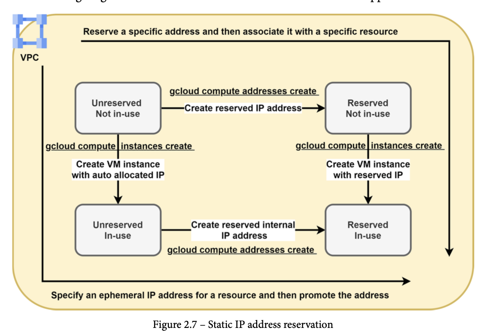
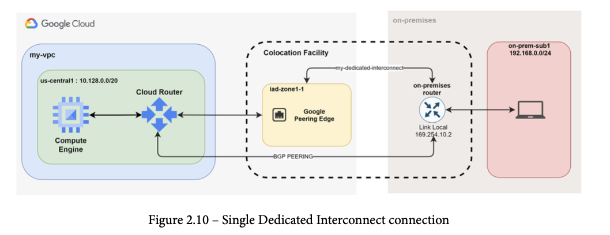
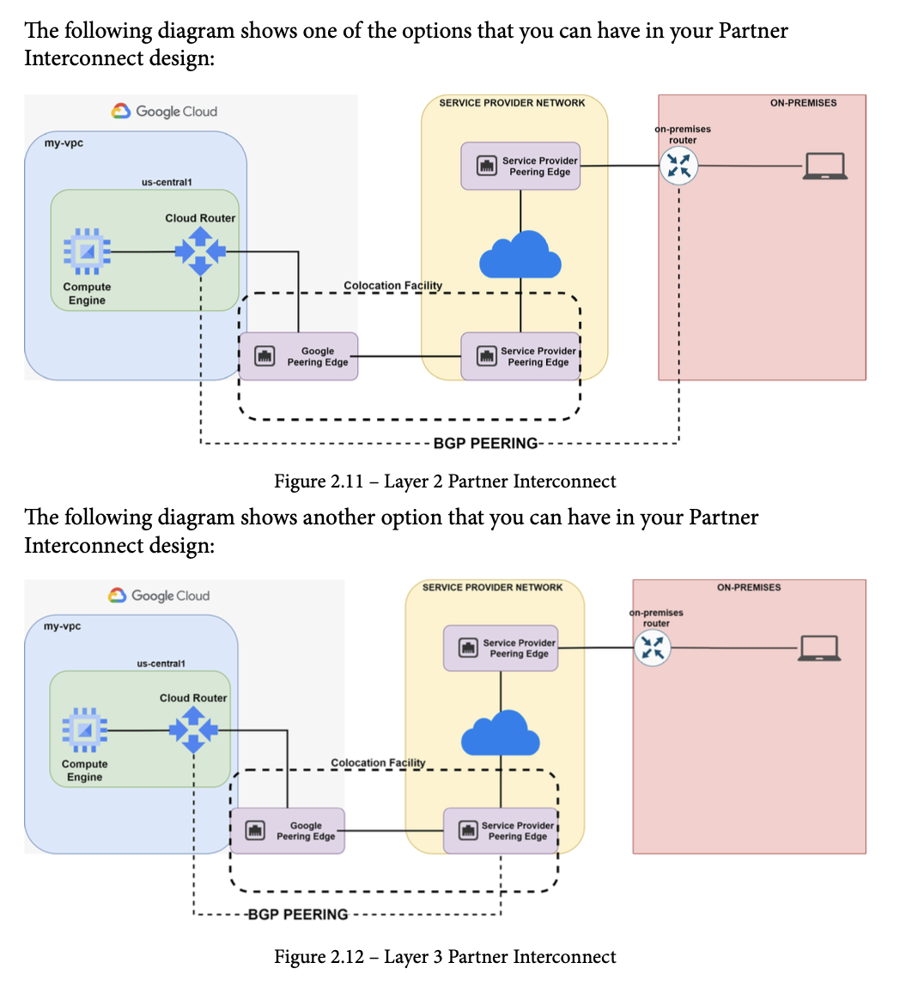
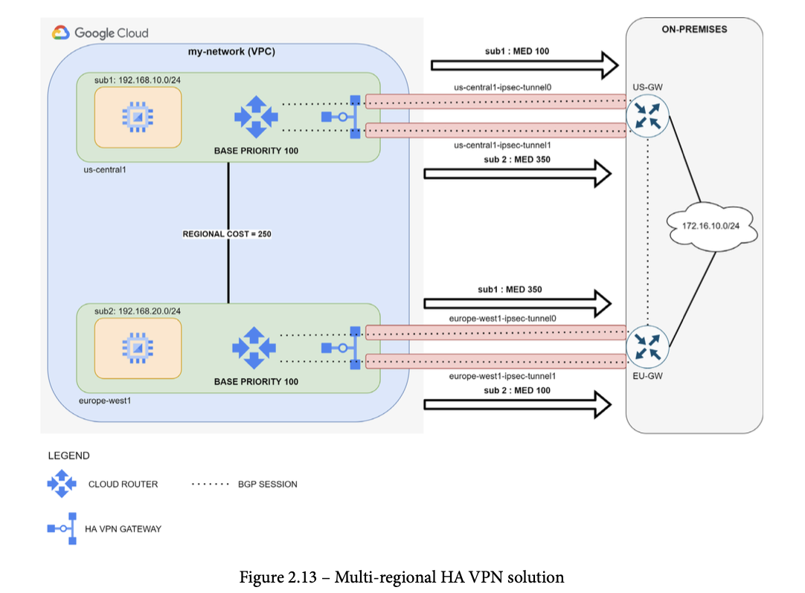
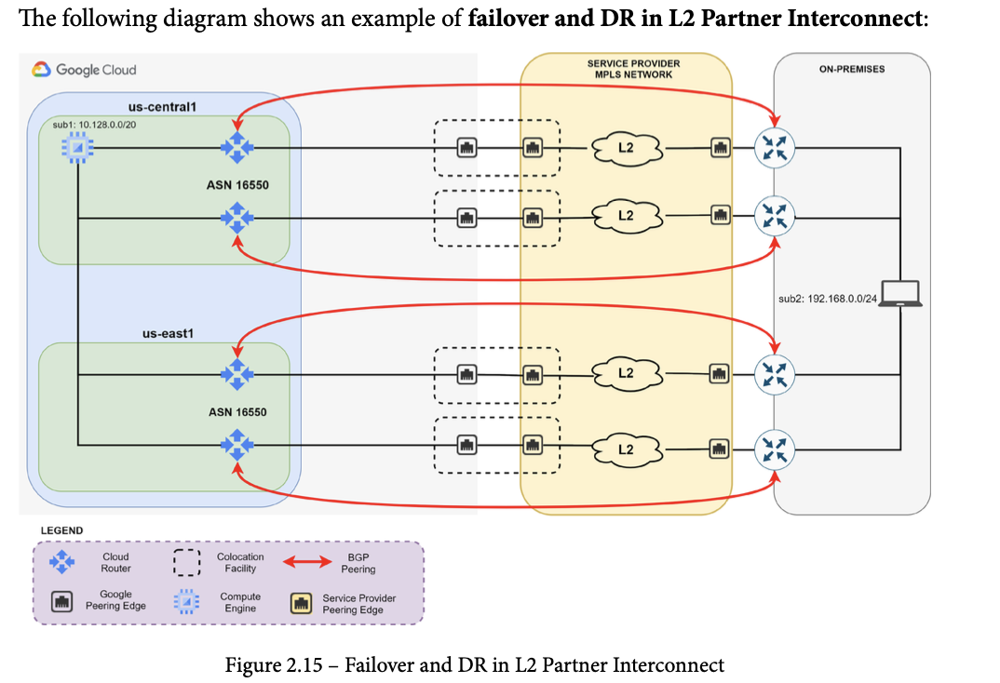
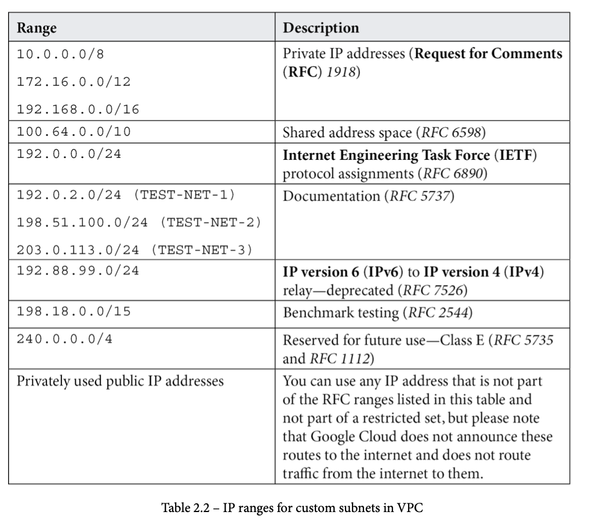
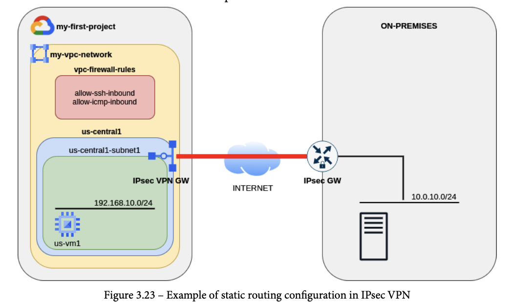
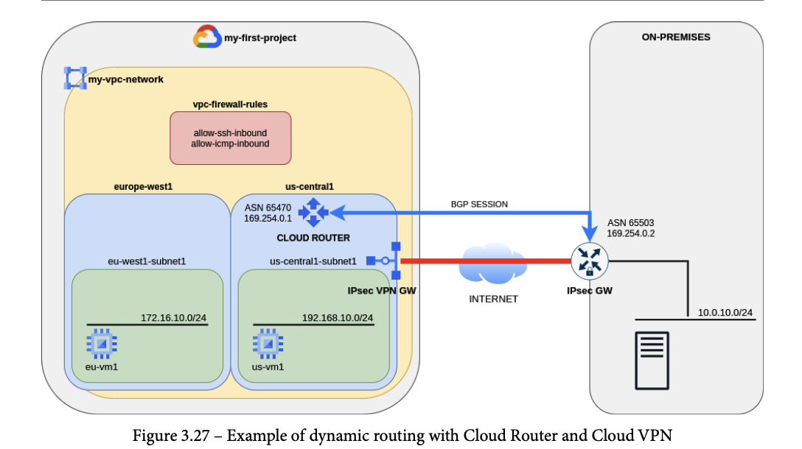

# Google Cloud - Professional Cloud Network Engineer Certification

[^1] A Professional Cloud Network Engineer is responsible for the design, implementation, and management of Google Cloud network infrastructure. This includes designing network architectures for high availability, scalability, resiliency, and security. This individual is skilled in configuring and managing Virtual Private Clouds (VPCs), routing, network security services, load balancing, and Cloud DNS. Additionally, they are proficient in setting up hybrid connectivity through Cloud Interconnect and Cloud VPN. Their expertise extends to diagnosing, monitoring, and troubleshooting network operations by using Google Cloud Observability and the Network Intelligence Center.

The Professional Cloud Network Engineer exam assesses your ability to:

* Design and plan a Google Cloud network.
* Implement a Virtual Private Cloud network.
* Configure managed network services.
* Implement hybrid network interconnectivity.
* Manage, monitor, and troubleshoot network operations.

[Link to the exam guide](https://services.google.com/fh/files/misc/professional_cloud_network_engineer_exam_guide_english.pdf)

# Section 1: Designing and planning a Google Cloud network (~26% of the exam)

<details>
<summary> 1.1 Designing an overall network architecture </summary>

## Designing for high availability, failover, disaster recovery, and scale.

### Failover and DR Strategy

Two important metrics that characterizes the business impacts:
*   **Recovery Time Objective (RTO)**:
    * This metric is the maximum acceptable time that your service can be offline.
    * usually part of a larger Service Level Agreement (SLA) 
*   **Recovery Point Objective (RPO)**:
    * This metric is the maximum acceptable time that data might be lost due to a major incident. 
    * In other words, it tells you how much data your service can lose from the last backup. 
    * It also defines how frequently the data is backed up.

Smaller RTOs and RPOs determine higher costs as the complexity of infrastructure and services increases.


Disaster Recovery (DR) scenerios are based on the business recovery goals and determine the RTO and RPO.

DR Patterns:
*   **Cold**:
    *   Applies to business with having high RTO / RPO
    *   No additional resources to overcome issues
    *   Service is stopped until resources are created, started, and ready to receive traffic.
*   **Warm**:
    *   Applies to businesses with having a medium RTP / RPO
    *   Service architecture does have spare resources to overcome issues but they need to be started or configured to be ready for traffic
*   **Hot**:
    *   Applies when business is mission-critical and requires a low RTO and RPO.
    *   Service architecture does have spare resources, and they are running and processing user traffic even when faults have not occurred yet.

### High Availability (HA) Options

Operational uptime metrics
* **Service Level Indicator (SLI)**
    * metric which is used to quantify an important aspect of your workload level of service
    * **Availability** 
        * one of the most used SLIs
        * defined as the fraction of the time that a service is usable (example 99%)
    * **Durability**
        * indicates the probability that data will be retained over a long period of time
    * Other examples:   
        * **Request Latency**
            * indicates how long it takes to return a response to a request
        * **Error rate**
            * fraction between erroneous requests and all requests received
        * **System throughput**
            * typically measured in requests per second
            * measurements are often aggregated
                * raw data is collected over a measurement window and then turned into a rate, average or percentile
* **Service Level Objective (SLO)**
    * target or range of threshold values for a service level that is measured by an SLI
    * natural structure is : lower bound <= SLI
    * examples:
        * Availability > 99.99%
        * RTO < 4 Hours
        * RPO < 2 hours
        * Requested latency < 100 milliseconds

Products to consider:
* **Compute Engine** and **Persistent Disk**
    - Zonal resources and provide 99.9% availability
* **External Cloud Load Balancing**:
    -   Distributes user requests across various backends
    -   Group of VMs, or applications
    -   Provides a _health check_ system to determine whether a backend can receive and process user traffic
    -   Publishes a single global anycast IP address to let user traffic reach the closest backend that reduces latency.
* **Cloud DNS**:
    -   Provides tools to automate the maintenance of DNS entries when recovery happens
    -   Leverage Google's Anycast Domain Name Servers network to server DNS requests.
    -   If DNS is on-prem, Cloud DNS can forward DNS requests from VMs that running in GCP.
* **Cloud Connectivity**:
    -   Several options to connect on-premises network and the VPC in google cloud, such as _Dedicated Interconnect_ and _Direct Peering_ are two solutions with the highest availability.

Sample Disaster Recovery Workflow:


* Move DNS from on-prem to cloud dns first
* Users connect to Cloud DNS to resolve company URL
* Cloud DNS returns the A record of the anycast IP address of the global Cloud Load Balancing Service
* Using Cloud Load Balancing, traffic can be distribute and weighted to different backends that can be either:
    -   VM instances groups (managed or unmanaged)
    -   on-prem web server public IP
    -   Zonal NEG
    -   Serverless NEG
    -   Internet NEG
    -   Hybrid connectivity NEG
    -   Private Service Connect NEG
    -   Service Directory service bindings


## Designing the DNS topology (e.g., on-premises, Cloud DNS).

Some situations require that DNS remain on-prem to resolve private names that some applications still use, therefore a hybrid solution will need to be established.

Choose a name pattern for corporate resources:
*   Complete domain separation:
    -   separate domain for on-prem vs cloud: (`corp.example.com` vs `gcp.example`)
    -   best to choose because it makes it extremely easy to forward DNS requests between Environments
*   GCP Domain as a subdomain:
    -   use a subdomain ('`gcp.corp.example.com`) for all GCP resources which are subordinate to on-prem domain
    -   for instance use `corp.example.com` for on-prem and `gcp.corp.example.com` DNS resolution is to use two separate authoritative DNS systems. Cloud DNS can be use as an authoritative DNS server for the GCP environment, while the existing DNS servers on-premises can still be used as an authoritative DNS server for the on-prem resources, as shown below.
* Avoid using the same DNS name, both on-prem and gcp share (`corp.example.com`), as this makes managing records in a hybrid environment much hard, only possible with a single authoritative DNS system.

Use existing on-premises DNS server for authoritatively hosting all internal domain names. In that case, you can use an alternative name server to forward all requests from Google Cloud through outbound DNS forwarding.

This approach has the following advantages:
* You make fewer changes in business processes.
* You can continue to use your existing tools.
* You can use deny lists to filter individual DNS requests on-premises.

However, it has the following disadvantages:
* DNS requests from Google Cloud have higher latency.
* Your system relies on connectivity to on-premises environments for DNS operations.
* You might find it difficult to integrate highly flexible environments such as autoscaled instance groups.
* The system might not be compatible with products such as Dataproc because those products rely on reverse resolution of Google Cloud instance names.

Migrate to Cloud DNS as an authoritative service for all domain resolution. You can then use private zones and inbound DNS forwarding to migrate your existing on-premises name resolution to Cloud DNS.

This approach has the following advantages:
* You don't need to maintain a high availability DNS service on-premises.
* Your system can use Cloud DNS to take advantage of centralized logging and monitoring.

However, it has the following disadvantages:
* DNS requests from on-premises have higher latency.
* Your system requires a reliable connection to your VPC network for name resolution.


With a two authoritative DNS systems hybrid architecture it is required to configure **forwarding zones** and **server policies**, Cloud DNS provides the two features to allow DNS name lookup between on-prem and GCP environments.


**Forwarding Zones** are used to query DNS records in your on-prem environment for corporate resources. Cloud DNS **does not** sync or cache on-premise records, thus it is important to maintain the on-prem DNS server to be as highly available as possible. 

DNS **server policies** allow on-prem hosts to query DNS records in a GCP private DNS environment. Any time a host that is on-prem sends a request to resolve some instance name in gcp.entreprise.com, a inbound DNS forwarding rule in the DNS server policy must be created. Three types:
* Conditional forwarding
    * corp DNS forwards requests for specific zones or subdomains to the forwarding IP addresses on GCP
    * recommended approach due to being the least complex and allows for DNS monitoring on-prem
* Delegation
    * if gcp is a subdomain of the on-prem zone then the gcp one can be delegated to the GCP name server 
    * requires setting NS entries within the zone
    * client communicate to the forwarding IP addresses on GCP directly, need to make sure firewalls allows this
* Zone transfers
    * Cloud DNS does not support zone transfers


Other best practices for Cloud DNS:
* If you use Shared VPC networks within your organization, you must host all the private zones on Cloud DNS within the host project. 
* Alternatively use [cross-project binding](https://cloud.google.com/dns/docs/zones/cross-project-binding)
* Make sure that DNS traffic is not filtered anywhere inside your VPC network or on-premises environment by doing the following:
    * Ensure that your on-premises firewall passes queries from Cloud DNS. Cloud DNS sends queries from the IP address range `35.199.192.0/19`. DNS uses `UDP port 53` or` TCP port 53`, depending on the size of the request or response.
    * Ensure that your DNS server does not block queries. If your on-premises DNS server accepts requests only from specific IP addresses, make sure that the IP address range `35.199.192.0/19` is included.
    * Ensure that traffic can flow from on-premises to your forwarding IP addresses. In Cloud Router instances, add a custom advertised route for the IP address range `35.199.192.0/19` in your VPC network to the on-premises environment.
* Use DNS peering to avoid outbound forwarding from multiple VPC networks
    * 
* Managed Service for Microsoft Active Directory is a highly available, hardened service that runs Microsoft Active Directory, including a domain controller.

[Reference architectures for hybrid DNS](https://cloud.google.com/dns/docs/best-practices#reference_architectures_for_hybrid_dns)


## Designing for security and data exfiltration prevention requirements.
* VPC Service Controls (service perimeter)
* Workload Identity
* Sensitive Data Protection
* Proper IAM for Least Priviledge and Seperation of Duties
* Proper Resource Hierarchy with PoLP IAM set on Folder/Projects
* VPC firewall rules for network segmentation
* Organization Policies
* Identity-Aware Proxy
* Manage traffic with firewall rules
    * leverage services accounts or tags to direct traffic between GCE Instances  
* Limit external access
    * Avoid exposing GCE instances to the Internet, deploy Cloud NAT to let all the VMs in one region go out to reach external services
    * Deploy vms without public IPs (can use org policies to prevent the use of public ips)
    * Deploy private GKE clusters
    * se Google Private Access for access google services
* Centralize network control
    * Use a Shared VPC
    * A single Network Admin IAM account with the least number of permissions that allow network administrators to configure subnets, routes, firewall rules, and so on for all projects in the organization
* Interconnect privately to your on-premises network
    * based on network latency, bandwidth, and service-level aggreement (SLA) requirements, consider either Cloud Internconnect (Dedicated or Partner) or Cloud VPN to avoid traversing the Internet. Use Cloud Interconnect for the lowest latency and high scalability and reliablity for transfering data.
* Secure your application and data
    * Leverage VPC Service controls
    * Cloud Identity-Aware Proxy (IAP)
    * Cloud Armor
* Control access to resources
    * Assigning IAM roles with least privileged approach. Only necessary access should be granted to your resources.

## Choosing a load balancer for an application.

There are several options for load balancing traffic in GCP, divided into two categories:

*   **External Load Balancer**
  -   Distributes traffic from the internet to a VPC
*   **Internal Load Balancer**
  -   Distributes traffic between instances in a VPC

GCP Load Balancers are divided into two high level deployment modes **Application** and **Network** categories.

* **Application Load Balancer (HTTP/HTTPS)**
    * **External**
        * Global external App Load Balancer
            * implemented as a managed service on [Google Front Ends (GFEs)](https://cloud.google.com/docs/security/infrastructure/design#google-frontend-service)
            * uses open-source [Envoy proxy](https://www.envoyproxy.io/) to support [advanced traffic management](https://cloud.google.com/load-balancing/docs/https/traffic-management-global)
                * traffic mirroring, weight-based traffic splitting, request/response-based header transformations, and more
        * Class Application Load Balancer
            * Global on Premium Network Tier or regional on Standard Tier
            * implemented on GFEs, GFEs are distributed globally and operate together using Google's global network and control plane.
        * Regional external App Load Balancer
            * implemented as a managed service on Envoy proxy
    * **Internal**
        * Regional internal App Load Balancer
        * Cross-Region internal App Load Balancer
            * multi-region load balancer that is implemented as a managed service based on the open-source Envoy proxy
* **Network Load Balancer (TCP / UDP)**
    * **Proxy Load Balancers**
        * Layer 4 Reverse Proxy Load Balancers that distribute TCP traffic to backends 
        * Client traffic is terminated at the LB and forwarded to the closest backend
        * offers SSL termination also
        * **External**
            * Global external proxy Network Load Balancer
                * Supports SSL Termination
            * Class Proxy Network Load Balancer
                * global on premium network or regional on standard
                * supports SSL termination
            * Regional external proxy Network Load Balancer
        * **Internal**
            * Regional internal proxy Network Load Balancer
            * Cross-Region internal proxy Network Load Balancer
    * **Passthrough Load Balancer**
        * Passthrough Network Load Balancers Forwards original client packets to the backend un-proxied and preserves client source IP addresses. 
        * Passthrough Network Load Balancers also support additional protocols like UDP, ESP, and ICMP.
        * SSL decryption is passed to the backend (at a cost of CPU burden)
        * **External**
            * Regional external Passthrough Network Load Balancer
            * Regional internal Passthrough Network Load Balancer

See more on IPv6 --> https://cloud.google.com/load-balancing/docs/ipv6

The following image outlines a decision tree on how to choose the appropriate Load Balancer for your workloads.


## Designing for hybrid connectivity (e.g., Private Google Access for hybrid connectivity).

https://cloud.google.com/vpc/docs/configure-private-google-access-hybrid

**Domain Options**
* https://cloud.google.com/vpc/docs/configure-private-google-access-hybrid#config-choose-domain
* private.googleapis.com
    * 199.36.153.8/30
    * 2600:2d00:0002:2000::/64
    * access Google APIs and services using a set of IP addresses only routable from within Google Cloud
    * use if:
        * you don't use VPC service controls, or
        * you do use VPC service controls but you also need to access Google APIs and services that are not supported by VPC Service Controls
* restricted.googleapis.com
    * 199.36.153.4/30
    * 2600:2d00:0002:1000::/64
    * use when you **only** need access to Google APIs and services that **are** supported by VPC Service Controls.
    * does not permit access to Google APIs and services that do not support VPC Service Controls. 
* Configure DNS for on-premise systems  
    * create an [inbound server policy](https://cloud.google.com/dns/docs/policies#create-in) in the vpc that the on-prem network connects
    * identify [inbound forwarder entry points](https://cloud.google.com/dns/docs/policies#list-in-entrypoints) in the region(s) where the cloud vpn tunnels and VLAN attachements are located
    * config on-prem systems and on-prem DNS name servers to forward `googleapis.com` and any additional domain names to an inbound forwarder entry in the same region as the cloud vpn or vlan attachment

## Planning for Google Kubernetes Engine (GKE) networking (e.g., secondary ranges, scale potential based on IP address space, access to GKE control plane).

* https://cloud.google.com/kubernetes-engine/docs/best-practices/networking

* Use VPC-native clusters to support the use of alias IPs and scale easier to avoid routing limits like route-based clusters
* [Plan the required IP address allotment](https://cloud.google.com/kubernetes-engine/docs/best-practices/networking#plan-ip-allotment)
* [Use non-RFC 1918 space if needed](https://cloud.google.com/kubernetes-engine/docs/best-practices/networking#use-non-rfc1918)
* [Use custom subnet mode](https://cloud.google.com/kubernetes-engine/docs/best-practices/networking#custom-subnet-mode)
* [Plan Pod density per node](https://cloud.google.com/kubernetes-engine/docs/best-practices/networking#pod-density-per-node)
* [Avoid overlaps with IP addresses used in other environments](https://cloud.google.com/kubernetes-engine/docs/best-practices/networking#avoid-ip-overlaps)
* [Create a load balancer subnet](https://cloud.google.com/kubernetes-engine/docs/best-practices/networking#create-lb-subnet)
* [Reserve enough IP address space for cluster autoscaler](https://cloud.google.com/kubernetes-engine/docs/best-practices/networking#reserve-ip-space)
* [Share IP addresses across clusters](https://cloud.google.com/kubernetes-engine/docs/best-practices/networking#share-ip-clusters)
* [Share IP addresses for internal LoadBalancer Services](https://cloud.google.com/kubernetes-engine/docs/best-practices/networking#share-ip-services)
* Use container-native Load Balancing
    * Network Endpoint Group (NEGs)
        * efficiently mediate the interaction between the LB and the cluster pods
        * fully integrated with the K8S ingress controller running on GKE which eliminates the need for iptables
    * benefits  
        * Accurate Load Balancing
        * Accurate health checks
        * no double-hop traffic
        * visibility and traceability

### IP Address Planning

Considerations for Primary IP address range subnet
* Every subnet must have a primary IP address range. 
    * This is the IP address range that GKE uses to allocate IP addresses for internal load balancers and nodes.
* You cannot shrink or change a subnet's primary IP address range after the subnet has been created.
* The first two and last two IP addresses of a primary IP address range are reserved by Google Cloud.
* Clusters with Private Service Connect use the primary subnet range to provision the internal IP address assigned to the control plane endpoint. 
    * However, you can override this IP address provisioning with the `private-endpoint-subnetwork` flag. 

The following table shows the maximum number of nodes you can create give the size of the subnet's primary IP address range and cluster config
* **Scenario 1**: Maximum nodes in cluster that uses the default subnet
* **Scenario 2**: Maximum nodes in a Private Service Connect cluster that doesn't use the `private-endpoint-subnetwork` flag

|   Subnet primary IP range                |    Scenario 1    |     Scenario 2   |
| ---------------------------------------- | ---------------- | ---------------- |
| /29 (min size for subnet's primary range)|      4 nodes     |     3 nodes      |
| /28                                      |     12 nodes     |    11 nodes      |
| /27                                      |     28 nodes     |    27 nodes      |
| /26                                      |     60 nodes     |    59 nodes      |
| /25                                      |    124 nodes     |   123 nodes      |
| /24                                      |    252 nodes     |   251 nodes      |
| /23                                      |    508 nodes     |   507 nodes      |
| /22                                      |  1,020 nodes     | 1,019 nodes      |
| /21                                      |  2,044 nodes     | 2,043 nodes      |
| /20 (default size in auto mode networks) |  4,092 nodes     | 4,091 nodes      |
| /19                                      |  8,188 nodes     | 8,187 nodes      |
| /8 (max size for subnet's primary ip range) | 16,777,212 nodes | 16,777,211 nodes |
| ----------------------------------------- | ---------------- | ---------------- |


Use the following formulas:
* Calculate the max number of nodes (N) that a given netmask (S) can support in the clusters that use the default subnet:
    * `N = 2^(32-S) - 4`
* Calculate the size of the netmask (S), required to support a maximum of N nodes
    * `S = 32 - [log base 2(N+4)]` --> [ceiling (least integer) function](https://en.wikipedia.org/wiki/Floor_and_ceiling_functions)
    * Private Service Connect clusters reduce the value of N by 1

Carefully plan your secondary IP address range for Pods

|   Subnet secondary IP range for Pods           |    Max Pod IP address    |     Max Nodes   |    Max Pods      |
| ---------------------------------------------- | -----------------------  | --------------- | ---------------- |
| /24 Smallest possible Pod Range with user-managed | 256 addresses         |  1 node         | Auto: 32 , STD: 110 |
| /23 only user-managed                         |  521 addresses            |  2 nodes        | Auto: 64, STD: 220  |
| /22 only user-managed                         |  1,024 addresses          |  4 nodes        | Auto: 128, STD: 440 |
| /21 only managed by GKE                       |  2,048 addresses          |  8 nodes        | Auto: 256, STD: 880 |
| /20                                           |  4,096 addresses          |  16 nodes       | Auto: 512, STD: 1,760 |
| /19                                           |  8,192 addresses          |  32 nodes       | Auto: 1,024, STD: 3,520 |
| /18                                           |  16,384 addresses         |  64 nodes       | Auto: 2,048, STD: 7,040 |
| /17                                           |  32,768 addresses         | 128 nodes       | Auto: 4,096, STD: 14,080 |
| /16                                           |  65,536 addresses         | 256 nodes       | Auto: 8,192, STD: 28,160 | 
| /15                                           |  131,072 addresses        | 512 nodes       | Auto: 16,384, STD: 56,320 |
| /14 Default size sec subnet range for Pods with GKE managed | 262,144 addresses | 1,024 nodes    | Auto: 32,768, STD: 112,640 |
| /13                                           |  524,288 addresses        | 2,048 nodes     | Auto: 65,536, STD: 225,280 |
| /12                                           |  1,048,576 addresses      | 4,096 nodes     | Auto: 121,072 STD: 450,560 | 
| /11                                           |  2,097,152 addresses      | 8,192 nodes     | Auto: 262,144 STD: 901,120 | 
| /10                                           |  4,194,304 addresses      | 16,384 Nodes    | Auto: 524,288 STD: 1,802,240 | 
| /9 Largest possible POD address range         |  8,388,608 addresses      | 32,768 nodes    | Auto: 1,048,576 STD: 3,604,480 |
| --------------------------------------------- | ------------------------- | ---------------- | ----------------------------- |

Use the following calculations if you change the max number of pods per node to calculate the maximum number of nodes and Pods that a subnet's secondary IP address range for Pods can support:

1. Calculate the size of the netmask of each node's Pod range, M.
    * `M = 31 - [log base 2(Q)]` where:
        * Q is the number of Pods per node
        * [] is the ceiling (least integer) function, meaning round up to the next integer
        * for example if Q is 110 then M = 24
2. Calculate the max num or nodes, N, that the subnet's secondary IP address range of pods can support
    * `N = 2^(M-S)` where:
        * M is the size of the netmask of each node's alias IP address range for Pods, calculated in the first step
        * S is the size of the subnet mask of the subnet's secondary IP address range
        * Example: if M is 24, and S is 20, then N = 16
3. Calculate the max num of pods, P, that the subnet's secondary IP address range for Pods can support:
    * `P = N x Q` where:
        * N is the max numb of nodes, calculated in the previous step
        * Q is the number of pods per node
        * Example : N is 16, and Q is 110, then P = 1760

You can add more IP addresses for PODS by using [discontiguous multi-pod cidr](https://cloud.google.com/kubernetes-engine/docs/how-to/multi-pod-cidr), 

Carefully plan your secondary IP address range for Services, because this is also a subnet secondary IP address range, this range cannot be changed once the cluster is created.

If you use [multi-cluster services](https://cloud.google.com/kubernetes-engine/docs/concepts/multi-cluster-services), the `ServiceImport` object uses IP addresses from the secondary IP address range for Services.

In GKE Autopilot clusters v1.27+ and GKE Standard clusters v1.29+, GKE assigns IP addresses for Services from a GKE-managed range by default: `34.118.224.0/20`. 
* This eliminates the need for you to specify your own IP address range for Services. 
* The following considerations apply:
    * You can optionally specify custom ranges for Services by using the `--services-ipv4-cidr` flag or the `--services-secondary-range-name` flag.
    * If you specify only a range size using the `--services-ipv4-cidr` flag (for example, `/22`), GKE still uses the GKE-managed range to obtain the sub-range of addresses.
    * GKE doesn't create a separate secondary IP address range for Services when the Google-managed range is used. 
        * The GKE-managed range doesn't use the secondary IP address range quota for your subnet.

|   Secondary IP range for Services   |    Max num of services   |
| ----------------------------------- | -----------------------  |
| /28 (smallest services range with user-managed) | 16 services  |
| /27 (smallest services range with GKE managed)  | 32 services  |
| /26                                 |  64 services   |
| /25                                 |  128 services  |
| /24                                 |  256 services  |
| /23                                 |  512 services  |
| /22                                 |  1,024 services |
| /21                                 |  2,048 services |
| /20 (default size for services managed by GKE) |  4,096 services  |
| /19                                 |  8,192 services  |
| /18                                 | 16,384 services  |
| /17                                 | 32,768 services  |
| /16 (largest possible services address range) |  65,536 services |


## Planning Identity and Access Management (IAM) roles including managing IAM roles in Shared VPC environment.

* Organization Admin
  -  Delegate Network and Sec Admin
* Compute Network Admin
    - roles/compute.networkAdmin
    - full control of compute engine networking resources
    - unable to create FW rules, IAM roles, & SSL certificates
* Compute Security Admin
    - roles/compute.securityAdmin
    - Full control of compute engine security resources such as creating/updating FW rules and ssl certificates
* Compute Shared VPC Admin
    - roles/compute.xpnAdmin
    - Manage hosts and service projects, set permissions on subnetworks for Users
* Compute Network User
    - roles/compute.networkUser
    - Provides access to use a shared vpc network
* Compute Network viewer
    - roles/compute.networkViewer
    - Read-only access to compute engine networking resources

Service Account accounts do not have passwords and cannot log in via browsers or cookies

Service Accounts use RSA key pairs (public/private) for Authentication to google cloud.

Service account user role grants permissions to get, list, or impersonate a service account.

## Incorporating micro segmentation for security purposes (e.g., using metadata, tags, service accounts, secure tags).

Control traffic through firewall rules
* Implement least-privilege principles. 
    * Block all traffic by default and only allow the specific traffic you need. 
    * This includes limiting the rule to just the protocols and ports you need.
* Use [hierarchical firewall policy rules](https://cloud.google.com/firewall/docs/firewall-policies) to block traffic that should never be allowed at an organization or folder level.
* For "allow" rules, restrict them to specific VMs by specifying the service account of the VMs.
* If you need to create rules based on IP addresses, try to minimize the number of rules. 
    * It's easier to track one rule that allows traffic to a range of 16 VMs than it is to track 16 separate rules.
* Turn on Firewall Rules Logging and use Firewall Insights to verify that firewall rules are being used in the intended way. Firewall Rules Logging can incur costs, so you might want to consider using it selectively.

VPC Isolation
* use VPC Service Controls (service perimeter) to create a security boundary

Network Tags
* arbitrary character string added to a _tags_ field in a resource (Compute Engine VM, etc)
* not a separate resource
* one or more tags can be associated with an instance
* can assign to new VMs at creation time or edit any time
* only applies to the VPC network that are directly attached to the instance's nics
* can be used as targets in firewall rules
* Not supported in Network FW policies only at the VPC Fw Rule

Service Account
* represents an identity associated with an instance
* only one service account can be associated with an instance
* control access to the service account by granting the Service Account User role for other IAM principals
* cannot be combined/mixed with network tags in firewall rules
* recommended for strict control over how fw rules are applied to VMs
* Supported only at the project level
* VPC Peering
    * When used to specify a source for an ingress VPC firewall rule, a network tag only identifies sources within the VPC network specified in the VPC firewall rule.
    * When used to specify a target for an ingress or egress VPC firewall rule, a network tag only identifies targets within the VPC network specified in the VPC firewall rule.

Tags for firewalls
* different from network tags
* referred to as _secure tags_ in global network firewall policies and regional network firewall policies
* not supported at the VPC FW rule level but at the Network FW Policy level
* Supported at the Org or Project level
* VPC Peering
    * When used to specify a source for an ingress rule in a network firewall policy, a Tag can identify sources in both the VPC network to which the Tag is scoped and any peer VPC networks connected to the VPC network to which the Tag is scoped.
    * When used to specify a target for an ingress or egress rule in a network firewall policy, a Tag can only identify targets in the VPC network to which the Tag is scoped.


## Planning for connectivity to managed services (e.g., private services access, Private Service Connect, Serverless VPC Access).

### Private Services Access
* https://cloud.google.com/vpc/docs/private-services-access

Private services access lets you reach the internal IP addresses of Google and third-party services (know as service producers) by using private connections. 
This is useful if you want your VM instances in your VPC network to use internal IP addresses instead of external IP addresses.

Requires you to first allocate an internal IPv4 address range and then create a private connection. 
An allocated range is a reserved CIDR block that can't be used in your local VPC network. 
It's set aside for service producers only and prevents overlap between your VPC network and the service producer's VPC network.

The private connection links your VPC network with the service producer's VPC network.

If a service producer offers multiple services, you only need one private connection. 
When you create a private connection, you use the Service Networking API to create it.

Google sets up the connection as a VPC peering connection and to delete the private connection you must delete the peering connection.

IPV6 is not supported

Supported Services : https://cloud.google.com/vpc/docs/private-services-access#private-services-supported-services

**Service Producer Network**
* VPC network where your service resources are provisioned. 
* The service producer's network is created exclusively for you and contains only your resources 
* similar to any other VPC network so it's reachable through internal IP addresses by other resources in your VPC network. 
* You can also create firewall rules in your VPC network to control access to the service producer's network.
* service producer's network contains a default route (0.0.0.0/0) that goes to the internet
* If you export a default route to the service producer's network, it is ignored because the service producer network's default route takes precedence
* By default, on-premises hosts can't reach the service producer's network by using private services access.
* With a private connection, the VPC network and service producer network exchange subnet routes only.
* Each service producer requires a minimum IP address range size. 
    * For Google, the minimum size is a single /24 block (256 addresses), but the recommended size is a /16 block (65,536 addresses).
    * If you don't have a contiguous /16 block, you can start with a smaller allocation and add new ones if you need more IP addresses later.
* As you provision additional resources, the service provisions them in existing regional subnets that it previously created. 
    * If a subnet is full, the service creates a new one in that region.
* Considerations:
    * https://cloud.google.com/vpc/docs/configure-private-services-access#considerations

**Create a allocated range in your VPC Network**
```
gcloud compute addresses create RESERVED_RANGE_NAME \
    --global \
    --purpose=VPC_PEERING \
    [--addresses=192.168.0.0 \]
    --prefix-length=16 \
    --description="DESCRIPTION" \
    --network=VPC_NETWORK
```

if the `--addresses` field is omitted Google automatically selects an unused address range in you vpc

**Create a private connection**
```
gcloud services vpc-peerings connect \
    --service=servicenetworking.googleapis.com \
    --ranges=RESERVED_RANGE_NAME \
    --network=VPC_NETWORK
```

**Share private DNS zones with service producers**

Cloud DNS private zones are private to your VPC network. 
If you want to let a service producer network resolve names from your private zone, you can configure DNS peering between the two networks.

When you configure DNS peering, you provide a VPC network and a DNS suffix. 
If the service producer needs to resolve an address with that DNS suffix, the service producer forwards those queries to your VPC network to be resolved.

```
gcloud services peered-dns-domains create PEERING_NAME \
    --network=VPC_NETWORK \
    --dns-suffix=DNS_SUFFIX
```

Troubleshooting: https://cloud.google.com/vpc/docs/configure-private-services-access#troubleshooting

### Private Service Connect

* https://cloud.google.com/vpc/docs/private-service-connect
* Allows consumers to access managed services privately from inside their VPC network. 
* Similarly, it allows managed service producers to host these services in their own separate VPC networks and offer a private connection to their consumers. 
    * For example, when you use Private Service Connect to access Cloud SQL, you are the service consumer, and Google is the service producer.
* consumers can use their own internal IP addresses to access services without leaving their VPC networks. 
* Traffic remains entirely within Google Cloud. 
* Private Service Connect provides service-oriented access between consumers and producers with granular control over how services are accessed.
* Supports access to the following types of managed services:
    * Published VPC-hosted services, which include the following:
        * [Google published services](https://cloud.google.com/vpc/docs/private-service-connect-compatibility#google-services), such as Apigee or the GKE Control Plane
        * [Third-party published services](https://cloud.google.com/vpc/docs/private-service-connect-compatibility#third-party-services) provided by Private Service Connect partners
        * Intra-organization [published services](https://cloud.google.com/vpc/docs/private-service-connect#published-services), where the consumer and producer might be two different VPC networks within the same company
    * [Google APIs](https://cloud.google.com/vpc/docs/private-service-connect-compatibility#google-apis-global), such as Cloud Storage or BigQuery
    
Connect Types:
* Private Service Connect (PSC) Endpoints:
    * https://cloud.google.com/vpc/docs/private-service-connect#endpoints
    * Deployed using forwarding rules that provide the consumer an IP address that is mapped to the PSC service
* Private Service Connect Backends
    * https://cloud.google.com/vpc/docs/private-service-connect#backends
    * Deployed using network endpoint groups (NEGs) that let consumers direct traffic to their load balancers before reaching a PSC service
    * Forwarding rule can reference either a service attachment or a bundle of Google APIs
* Private Service Connect interfaces
    * https://cloud.google.com/vpc/docs/about-private-service-connect-interfaces
    * provide bidirectional communication initiated by service producers
    * can be used in the same vpc network as endpoints and backends

**Bundle of Google APIs**
* https://cloud.google.com/vpc/docs/about-accessing-google-apis-endpoints#supported-apis
* Can be either:
    * `all-apis`
        * Enables API access to most Google APIs and services regardless of whether they are supported by VPC Service Controls. 
        * Includes API access to Google Maps, Google Ads, Google Cloud, and most other Google APIs, see full list [here](https://cloud.google.com/vpc/docs/about-accessing-google-apis-endpoints#supported-apis)
        * Does not support Google Workspace web applications such as Gmail and Google Docs. 
        * Does not support any interactive websites.
        * Use when you don't have any VPC Service Controls or if you use VPC SC but need access to google apis and services that DO NOT support VPC SC's.
    * `vpc-sc`
        * Enables API access to Google APIs and services that are supported by VPC Service Controls.
        * Blocks access to Google APIs and services that do not support VPC Service Controls. 
        * Does not support Google Workspace APIs or Google Workspace web applications such as Gmail and Google Docs.
        * Use when you only need access to Google APIs supported by VPC SC

**Service Attachment**
* resources that are used to create Private Service Connect published services
* used by either one or more endpoints or backends
* targets a producer load balancer and lets clients in a consumer VPC network access the load balancer
* configured with one or more NAT subnets (also referred to as Private Service Connect subnets)
    * Packets from the consumer VPC network are translated using source NAT (SNAT) so that their original source IP addresses are converted to source IP addresses from the NAT subnet in the producer's VPC network.
* can have multiple NAT subnets configure however one NAT subnet connect be use with more than one service attachment and cannot be used by resources such as VMs and are only used for SNAT of incoming messages
* configuration defines the following:
    * consumer accept list that defines which consumers are allowed to connect to the service
    * The NAT subnet where traffic is source from in the producer VPC network
        * https://cloud.google.com/vpc/docs/about-vpc-hosted-services#psc-subnets
    * an optional DNS Domain, if provided, that is used in the DNS entries for endpoints that are automatically created in the consumer's Cloud DNS zone.
        * https://cloud.google.com/vpc/docs/dns-vpc-hosted-services#dns-configuration-produce

**PSC Deployment Patterns**
* Single-tenant services
    * https://cloud.google.com/vpc/docs/private-service-connect-deployments#single-tenant-services
* Multi-tenant services 
    * https://cloud.google.com/vpc/docs/private-service-connect-deployments#multi-tenant-services
* Multi-point access 
    * https://cloud.google.com/vpc/docs/private-service-connect-deployments#multi-point
* Multi-Region Access   
    * https://cloud.google.com/vpc/docs/private-service-connect-deployments#multi-region-access
* On-prem and hybrid access
    * https://cloud.google.com/vpc/docs/private-service-connect-deployments#on-premises-hybrid-access
* Bidirectional connectivity

### Serverless VPC Access
* https://cloud.google.com/vpc/docs/serverless-vpc-access

Serverless VPC Access makes it possible for you to connect directly to your Virtual Private Cloud (VPC) network from serverless environments such as Cloud Run, App Engine, or Cloud Run functions. 
Configuring Serverless VPC Access allows your serverless environment to send requests to your VPC network by using internal DNS and internal IP addresses (as defined by RFC 1918 and RFC 6598).

When a connector is created, google automatically generates the following Fw rules, they are visible but cannot be edited

* `aet-CONNECTOR_REGION-CONNECTOR_NAME-hcfw`
    * Purpose: 
        * Allow traffic to the connector's VM instances from health check probes ranges (`35.191.0.0/16`, `35.191.192.0./18`, `130.211.0.0/22`) on certain ports
    * Type: Ingress
    * Action: Allow
    * Priority: 100
    * Ports & Protocols: TCP:667
* `aet-CONNECTOR_REGION-CONNECTOR_NAME-rsgfw`
    * Purpose: 
        * Allow traffic to the connector's VM instances from [Google's underlying serverless infrastructure (`35.199.224.0/19`)](https://cloud.google.com/vpc/docs/routes#serverless-vpc-return-path) on certain ports
    * Type: Ingress
    * Action: Allow
    * Priority: 100
    * Ports & Protocols: TCP:667, UDP:665-666, ICMP
* `aet-CONNECTOR_REGION-CONNECTOR_NAME-earfw`
    * Purpose: 
        * Allow traffic from the connector's VM instances from [Google's underlying serverless infrastructure (`35.199.224.0/19`)](https://cloud.google.com/vpc/docs/routes#serverless-vpc-return-path) on certain ports
    * Type: Egress
    * Action: Allow
    * Priority: 100
    * Ports & Protocols: TCP:667, UDP:665-666, ICMP
* `aet-CONNECTOR_REGION-CONNECTOR_NAME-egrfw`
    * Purpose: 
        * Blocks traffic from the connector's VM instances from [Google's underlying serverless infrastructure (`35.199.224.0/19`)](https://cloud.google.com/vpc/docs/routes#serverless-vpc-return-path) for all other ports
    * Type: Egress
    * Action: Deny
    * Priority: 100
    * Ports & Protocols: TCP:1-666,668-65535 UDP:1-664,667-65535 UDP
* `aet-CONNECTOR_REGION-CONNECTOR_NAME-sbntfw`
    * Purpose: 
        * Allows all traffic from the connector's VM instances (based on their IP address) to all resources in the connector's VPC network
    * Type: Ingress
    * Action: Allow
    * Priority: 1000
    * Ports & Protocols: TCP, UDP, ICMP
* `aet-CONNECTOR_REGION-CONNECTOR_NAME-tagfw`
    * Purpose: 
        * Allows all traffic from the connector's VM instances (based on their network tag) to all resources in the connector's VPC network
    * Type: Ingress
    * Action: Allow
    * Priority: 1000
    * Ports & Protocols: TCP, UDP, ICMP

**Use cases**
You can use Serverless VPC Access to access resources such as: 
* Compute Engine VM instances, 
* MemoryStore instances, and any other resources with internal DNS or internal IP address. 

Some examples are:
* You use MemoryStore to store data for a serverless service.
* Your serverless workloads use third-party software that you run on a Compute Engine VM.
* You run a backend service on a Managed Instance Group in Compute Engine and need your serverless environment to communicate with this backend without exposure to the internet.
* Your serverless environment needs to access data from your on-premises database through Cloud VPN.

[Configure Serverless VPC Access](https://cloud.google.com/vpc/docs/configure-serverless-vpc-access)

```
gcloud compute networks vpc-access connectors create CONNECTOR_NAME \
 --region REGION \
 [--subnet SUBNET_NAME \]
 [--network VPC_NETWORK] [--range IP_RANGE ] \
 --subnet-project HOST_PROJECT_ID \
 --min-instances MIN \
 --max-instances MAX \
 --machine-type MACHINE_TYPE
```

Configure Cloud Run to use a connector: `gcloud run deploy SERVICE --image IMAGE_URL --vpc-connector CONNECTOR_NAME`
Configure Cloud Run Functions to use a connector: `gcloud functions deploy FUNCTION_NAME --vpc-connector CONNECTOR_NAME FLAGS... `

Configure APP Engine: https://cloud.google.com/vpc/docs/configure-serverless-vpc-access#appengine

CONNECTOR_NAME = `projects/HOST_PROJECT_ID/locations/CONNECTOR_REGION/connectors/CONNECTOR_NAME`


## Differentiating between network tiers (e.g., Premium and Standard). 

Network Service Tiers lets you optimize connectivity between systems on the internet and your Google Cloud instances. Premium Tier delivers traffic on Google's premium backbone, while Standard Tier uses regular ISP networks.

Use Premium Tier to optimize for performance, and use Standard Tier to optimize for cost.

Uses Cases for each tier:


|Premium Tier |	Standard Tier |
| ----------- | ------------- |
| Highest performance: Traffic between the internet and VM instances in your VPC network is routed by keeping it within  Google's network as much as possible. | Cost optimized: Traffic between the internet and VM instances in your VPC network is routed over the internet in general.|
|For services that need global availability.   | For services hosted entirely within a region.|
| Unique to Google Cloud, Premium Tier is the default unless you make configuration changes.  |  Performance is comparable to other cloud providers. |

**Premium**


**Standard**


The following decision tree will help decide which tier best fits:


## Designing for VPC Service Controls.
* https://cloud.google.com/vpc-service-controls/docs/enable
* https://cloud.google.com/vpc-service-controls/docs/enable#document-use-cases

</details>
</summary>


<details>
<summary> 1.2 Designing Virtual Private Cloud (VPC) networks </summary>

## Choosing the VPC type and quantity (e.g., standalone or Shared VPC, number of VPC environments).

VPC is a global resource that is not associated with any region, subnets a regionally bound resources which define a range of IP

Each GCP comes with a default VPC created automatically with a subnet in every supported region, the creation of this can be disabled by setting the following Org Policy:
* `constraints/compute.skipDefaultNetworkCreation`

You can also control IPv6 configurations
* **Disable VPC External IPv6 usage**: 
    * `constraints/compute.disableVpcExternalIpv6` 
    * prevents the use of dual-stack subnets with external ipv6 ranges
* **Disable VPC Internal IPv6 usage**:
    * `constraints/compute.disableVpcInternalIpv6`
    * prevent the configuration of dual-stack subents with internal IPv6 ranges
* **Disable All IPv6 usage**
    * `constraints/compute.disableAllIpv6`
    * disables the creation of, or update to, any resource involved in IPv6 usage

Two types of VPC:
* **Standalone**
    * Standard version,  single VPC
    * Modes
        * Custom
            * no subnets created automatically
            * provide complete control over its subnets and IP ranges as well as the regions they reside in
            * cannot be switched to auto mode
            * Considerations
                * more flexible and more suited for a production environment
                * with proper IP planning you can peer custom vpcs just be mindful of overlapping IPs
                * supports dual-stack subnets (can use both IPv4 and IPv6)
        * Auto
            * one subnet from each region is automatically created within it. 
            * subnets use a set of predefined IPv4 ranges that fit within the `10.128.0.0/9` CIDR block.
            * new subnets are automatically added as new supported regions become available
            * can also add manually created subnets in regions of your choice but they must be outside the range of `10.128.0.0/9`
            * can be switched to custom mode but its a one-way conversion
            * Considerations
                * Having subnets in each region is useful
                * each predefined IP ranges of subnets do not overlap and would be ideal for different purposes(Cloud VPN connections, etc)
                * `10.128.0.0/9` CIDR range is part of the commonly used RFC 1918, networks outside of Google Cloud might use an overlapping CIDR range so in this case a Custom mode VPC is more ideal
                * two auto mode VPC are unable to Peer or connect via Cloud VPN as they would have overlapping IP ranges
                * does not support IPv6
* **Shared VPC**
    * Allows multiple projects within the same organization to share one VPC.
    * centrally shared network for elligible resources in service projects
    * Linked projects can be in the same or different folders, but the Shared VPC Admin needs rights to both folders
    * Split into two components:
        * **Host project**
            * Contains one or more Shared VPC Networks
            * Created by the Shared VPC Admin
            * Can have one or more service projects attached
            * Can have multiple host projects
            * All fw rules, subnets, secondary address ranges, and other network resource reside in the host project
            * has a special lock (_lien_) is place on it when the project is configure, this lock prevents the destruction of the host project, it is removed when it is no longer configured as a Shared VPC
                * **Caution**: By default, a project owner can remove a _lien_ from a project, including a Shared VPC host project, unless an organization-level policy is defined to limit lien removal. (Specifically, lien removal requires an IAM principal with the `resourcemanager.projects.get` and `resourcemanager.projects.updateLiens` permissions on the project.)
            * Project owner of the host project can remove the _lien_ then delete the Shared VPC project, this can be prevented
            * A user with the `orgpolicy.policyAdmin` role can define an organization-level policy constraint (`constraints/compute.restrictXpnProjectLienRemoval`) that limits the removal of liens to just the following roles:
                * Users with `roles/owner` or `roles/resourcemanager.lienModifier` at the organization level
                * User with custom roles that include the `resourcemanager.projects.get` and `resourcemanager.projects.updateLiens` permissions at the organization level
            * To enforce the `compute.restrictXpnProjectLienRemoval` policy for your organization by running the `resource-manager org-policies enable-enforce` command. 
                * Replace _ORG_ID_ with the number you determined from the previous step.
                    * `gcloud beta resource-manager org-policies enable-enforce --organization ORG_ID compute.restrictXpnProjectLienRemoval`
        * **Service project**
            * Any project attached to a host project
            * Can only belong to **ONE** host project
            * Cannot be a host project simultaneously
**Constraints**

* `constraints/compute.restrictSharedVpcHostProjects`: 
    * limits the set of hosts projects to which a non-host project or non-host projects in a folder or organization can be attached.
* `constraints/compute.restrictSharedVpcSubnetworks`: 
    * defines the set of subnets that can be accessed by a particular project or by projects in a folder or organization

Another mechanism to prevent Shared VPC host project from being deleted is to lock it to the billing account, details can be found [here](https://cloud.google.com/billing/docs/how-to/secure-project-billing-account-link).


**IAM Roles**

* **Organization Admin (resourcemanager.organizationAdmin)**
    * IAM principal in the organization
    * nominate Shared VPC Admins by granting them appropriate project creation and deletion roles, and the Shared VPC Admin role for the organization. 
    * Can define organization-level policies, but specific folder and project actions require additional folder and project roles.
* **Shared VPC Admin (compute.xpnAdmin and resourcemanager.projectIamAdmin)**
    * IAM principal in the organization, or in a folder 
    * Have the Compute Shared VPC Admin (`compute.xpnAdmin`) and Project IAM Admin (`resourcemanager.projectIamAdmin`) roles for the organization or one or more folders.
    * Perform various tasks necessary to set up Shared VPC, such as enabling host projects, attaching service projects to host projects, and delegating access to some or all of the subnets in Shared VPC networks to Service Project Admins. 
        * A Shared VPC Admin for a given host project is typically its project owner as well.
    * A user assigned the Compute Shared VPC Admin role for the organization has that role for all folders in the organization. 
    * A user assigned the role for a folder has that role for the given folder and any folders nested underneath it.
    * Can link projects in two different folders only if the admin has the role for both folders.
    * Has full control using Network Admin (`roles/compute.networkAdmin`) and Security Admin (`roles/compute.securityAdmin`)
* **Service Project Admin (compute.networkUser)**
    * IAM principal in the organization, or a host project, or some subnets in the host project
    * Should be granted Network User `roles/compute.networkUser`  to use all shared vpc subnets

Apply Shared VPC Admin role to an existing IAM principal. Replace _ORG_ID_ with the organization ID number from the previous step, and _EMAIL_ADDRESS_ with the email address of the user to whom you are granting the Shared VPC Admin role.

**Basic Shared VPC scenario**


**Hybrid Connectivity With Shared VPC**


## Determining how the networks connect based on requirements (e.g., VPC Network Peering, VPC Network Peering with Network Connectivity Center, Private Service Connect).

### VPC Network Peering

Allows two or more VPCs to be interconnected even if they belong to different projects or organizations. Advantages are:
* **Network Security**: Services do not need to be exposed to the public Internet
* **Network latency**: Traffic remains confined to the Google worldwide network which is engineered for low-latency transport.
* **Network costs**: Google charges you an additional cost (as an egress bandwidth price) for whichever traffic uses external IPs, even if your traffic is within the same zone; using VPC Network Peering, you only pay for the regular network pricing.

VPC Peering allows for: 
* sharing and exchanging IP routes, subnet routes, or custom routes. 
* All Subnet routes are automatically exchanged between VPCs if they do not use privately used public IP addresses.
* **_NOTE_**: overlapping IP's must be avoided between VPCs to allow VPC network peering to be established.

VPC Network Peering is not transitive, so (for example), if you have three VPCsVPC A, VPC B, and VPC Cand you have one VPC Network Peering between VPC A and VPC B and another VPC Network Peering between VPC B and VPC C, then the following traffic is allowed:
  * VPC A can communicate with VPC B and vice versa.
  * VPC B can communicate with VPC C and vice versa.

Transit traffic is not allowed, as outlined here:
  * VPC A cannot communicate with VPC C.
  * In order to allow them to communicate, you need to configure a new VPC network Peering between VPC A and VPC C explicitly


VPC Network Peering works with Compute Engine, GKE, and App Engine flexible environment.

VPC Network Peering supports IPv4 connectivity only. 
* You can configure VPC Network Peering on a VPC network that contains dual-stack subnets. 
* However, there is no IPv6 connectivity between the networks.

A dynamic route can overlap with a subnet route in a peer network. 
* For dynamic routes, the destination ranges that overlap with a subnet route from the peer network are silently dropped. 
* Google Cloud uses the subnet route.

The following routes are excluded from being imported and exported:
  * Tagged routes are never exchanged between peer networks. Tagged routes are custom static routes scoped to specific VM instances by using network tags. Network tags can only be resolved in the VPC network in which they're created.
  * Static routes with a next hop to the default Internet gateway are never exchanged. For example, the default route (0.0.0.0/0) with a next hop of default Internet gateway isn't exchanged between peer networks.

### Network Connectivity Center VPC Peering

**Network Connectivity Center** 
* is composed of one hub and many spokes, one for each Google Cloud network resource you need to interconnect. 
* The hub provides data transfer service across all spokes, thus interconnecting all the on-premises networks attached. 
* Spokes are attached to Google Cloud network resources such as Cloud VPN, Partner Interconnect, Dedicated Interconnect, and the third-party SD-WAN virtual router. 
* You can attach only one resource type to a spoke. 
* However, you can have multiple instances of the same type attached to one spoke. 
    * For instance, multiple VLAN attachments of your Dedicated Interconnect can be part of the same spoke.
* is a global service and relies on the Google Cloud network to provide instant access and global reachability to your enterprise on-premises networks.

**VPC Spokes**
* NCC supports inter-vpc connectivity via _spokes_
* reduces the operational complexity of managing the individual pair-wise VPC network peering
* provides centralized connectivity management model
* exports/imports all IPv4 subnets from other spokes connected to a NCC hub
* traffic stays within GCP network and does not travel through the internet
* can be in the same project and organization or different projects and organizations from the NCC hub
* can be connected one at a time 


### Comparison VPC Peering vs NCC VP Spokes

**VPC Peering**
* supports up to 25 VPC networks
* 15,500 [instances per peering group](https://console.cloud.google.com/iam-admin/quotas?service=compute.googleapis.com&metric=compute.googleapis.com/instances_per_peering_group)
* 1000 subnets ranges per peering group
* 300 Static routes per peering group
* 300 Dynamic routes per region per peering group

**NNC VPC Spokes**
* Up to 250 active Spokes per Hub
* Up to a 	1,000 (active or in active hubs)
* 1000 subnet routes per router table
* 500 dynamic routes per hub
* static route exchange is not supported
* 15,000 instance per VPC network
* IPv6 is not supported

Also see [here](https://cloud.google.com/network-connectivity/docs/network-connectivity-center/concepts/vpc-spokes-overview#vpc-peering-vs-vpc-spokes) for other details


## Planning the IP address management strategy (e.g., subnets, IPv6, bring your own IP (public advertised prefix (PAP) and public delegated prefix (PDP)), Private NAT, non-RFC 1918, managed services).

### Subnets
* Component of a VPC which consits of one or more IP address Ranges (subnets)
* A VPC must have at least one
* Can be dual-stack (IPv4 and IPv6) or single-stack (IPv4)
* IPv4 can have primary (required) and a secondary (optional)
* IPv6 can be either internal (unique local addresses (ULAs)) or external (Global unicast addresses (GUAs))
    * `--ipv6-access-type=INTERNAL | EXTERNAL` 
* Purpose
    * Regular
        * default type
        * `purpose=PRIVATE`
    * Private Service Connect Subnets
        * `purpose=PRIVATE_SERVICE_CONNECT` - PSC Internal Load Balancing
    * Proxy-only subnets
        * https://cloud.google.com/load-balancing/docs/proxy-only-subnets
        * used with regional Envoy-based Load Balancers (as well as Secure Web Proxy)
        * `purpose=GLOBAL_MANAGED_PROXY` --> Global Envoy-based LBs
            * Cross-region internal Application Load Balancer
            * Cross-region internal proxy Network Load Balancer
        * `purpose=INTERNAL_HTTPS_LOAD_BALANCER` --> Internal HTTPS LBs
        * `purposs=REGIONAL_MANAGED_PROXY` --> Regional Envoy-based LBs
            * Regional external Application Load Balancer
            * Regional internal Application Load Balancer
            * Regional external proxy Network Load Balancer
            * Regional internal proxy Network Load Balancer
    * Private NAT subnets
        * reserved for use as the source range for [Private NAT](https://cloud.google.com/nat/docs/private-nat)
        * `purpose=PRIVATE_NAT`
* In more cases the purpose CANNOT be changed after a subnet has been created

**Create a subnet**
```
gcloud compute networks subnets create NAME --network=NETWORK [--description=DESCRIPTION] \ 
    [--enable-flow-logs] [--enable-private-ip-google-access] [--ipv6-access-type=IPV6_ACCESS_TYPE] \
    [--logging-aggregation-interval=LOGGING_AGGREGATION_INTERVAL] [--logging-filter-expr=LOGGING_FILTER_EXPR] \
    [--logging-flow-sampling=LOGGING_FLOW_SAMPLING] [--logging-metadata=LOGGING_METADATA] \
    [--logging-metadata-fields=[METADATA_FIELD,]] [--private-ipv6-google-access-type=PRIVATE_IPV6_GOOGLE_ACCESS_TYPE] \
    [--purpose=PURPOSE] [--range=RANGE] [--region=REGION] [--reserved-internal-range=RESERVED_INTERNAL_RANGE] \
    [--role=ROLE] [--secondary-range=PROPERTY=VALUE,[]] \
    [--secondary-range-with-reserved-internal-range=RANGE_NAME=INTERNAL_RANGE_URL,[]] \
    [--stack-type=STACK_TYPE] [GCLOUD_WIDE_FLAG ]
```
```
gcloud compute networks subnets create subnet-1 \ 
    --network=network-0 --range=10.10.0.0/24 --region=us-central1
```

### Bring your own IP address (BYOIP)

Lets you provision and use your own IPv4 addresses for GCP resources, once import GCP manages them as like any managed GCP IP address with the following exceptions:
* IP addresses are available only to the customer who brought them
* No charges for idle or in-use IP addresses
* Google does not support overlapping BYOIP route announcements
    * example 203.0.112.0/23 is not supported supported if 203.0.112.0/23 or a subset of this prefix, such as 203.0.112.0/24, is advertised outside Google.
* Planning Details: https://cloud.google.com/vpc/docs/byoip-planning

#### Import process

To import you must create a **public advertised prefix (PAP)** 
**Public advertised prefix (PAP)** 
* which is a resource in Compute Engine that represents an IP prefix.
* a single unit of route advertisement
* Google's backbone advertises the PAP from all of its points of presence (POPs)
* IP addresses in the PAP always use Premium Tier 
* Let's you allocation IP addresses from your own prefix to GCP.
* can be used to create **public delegated prefixes** 

**Public delegated prefixes (PDP)**
* an IP address block with your defined public advertised prefix
* configured within a single scope, and must be delegated and assigned to a scope before they can be allocated
    * Two scope types:
        * Global
            * controlled by an allowlist
            * can only be created in a project that has been given access to create global prefixes
        * Regional

The following diagram outlines the workflow for creating public advertised prefixes and public delegated prefixes


**IAM**
Anyone who has the [appropriate IAM](https://cloud.google.com/compute/docs/access/iam) for the project can use the IP address:
* `compute.address.*` for regional IP addresses
* `compute.globalAddresses.*` for global IP addresses

### Managed Services

### Private NAT

* https://cloud.google.com/nat/docs/private-nat
* enables private-to-private address translation between networks
* Two types:
    * Private NAT for NCC Spokes
        * p2p NAT for VPC networks that are connected to a NCC hub
            * Includes p2p nat for traffic between VPC spokes and between VPC spokes and hybrid spokes
        * https://cloud.google.com/nat/docs/about-private-nat-for-ncc
    * Hyrbid NAT
        * p2p between GCP VPC networks and on-prem or other cloud provider networks that are connected via VPN or Cloud Interconnect
        * https://cloud.google.com/nat/docs/about-hybrid-nat

#### RFC1918 (Address Allocation for Private Internets)

In the spec the **Internet Assigned Numbers Authority (IANA)** has reserved the following three blocks of the IP address space for private numbers:

*   10.0.0.0 - 10.255.255.255 (10/8 prefix)
*   172.16.0.0 - 17.31.255.255 (172.16/12 prefix)
*   192.168.0.0 - 192.168.255.255 (192.168/16 prefix)

All others addresses are potentially public.

When GCE VMs, GKE nodes/pods/services, internal load balancers (TCP/UDP or HTTPs load balancing), and internal protocol forwarding the assigned IP is _regional_ and internal.

For private service access resources will be assigned a _global_ internal IP address.

## Static vs Ephemeral IP Address

*   **Ephemeral**
    -   Default option
    -   released once the instance is stopped or deleted
    -   new IP is assigned to the instance/resource when a new one is created
*   **Static**
    -   Must be reserved in order to keep the lifetime beyond the lifetime of the resources it is assigned to
    -   Will incur costs, even when not in use

The following diagram shows how static IP address reservation will happen in the VPC:



You can see in the figure above the two ways to reserve a static IP address (either internal or external), as described in more detail here:
  *   You can start a new resource with an ephemeral address and then promote it to a static IP address.
  *   You can reserve a static IP address and only after that create an associated resource.

## Planning a global or regional network environment.

* VPCs are global and subnets are regional
* if you have customers in spefic regions you need to have system/applications instances closer to then so each instance would be in a regional subnet
* you can control the placement of you instances with a zone using [placement policies](https://cloud.google.com/compute/docs/instances/placement-policies-overview)

## Planning the firewall strategy (e.g., VPC firewall rules, Cloud Next Generation Firewall, hierarchical firewall rules).

### VPC Firewall Rules

Each GCP VPC contains one or more firewall rules and they work as
a distributed firewall. Therefore, they do not reside on a physical device that may cause a bottleneck, but they are instead distributed into the VPC and applied at the GCE instance level.

FW rules have the following specifications:
* Applied to one VPC network
* Stateful, no need to write a rule for returning traffic
* Controls either inbound traffic (ingress) and outbound traffic (egress)
* direction of traffic is always evaluated from GCP resource perspective
* have a target to whom the firewall rule is applied.
  - can be GCE instance, subgroup of them (referenced by tag), or a service account
* sorted by priority which are evaluated from lowest to highest
* have a condition to match
  - includes source or destination of the traffic and the protocol
* have an actions, either Allow or deny

By default each VPC have two implied rules, which are not visible to the user:
* one for egress to allow traffic to any destination IP (to 0.0.0.0/0)
* one for ingress rule to deny any traffic coming from any network (from 0.0.0.0/0).


#### Best practices for firewall rules
When designing and evaluating your firewall rules, keep in mind the following best practices:

  * Implement least-privilege principles. Block all traffic by default and only allow the specific traffic you need. This includes limiting the rule to just the protocols and ports you need.
  * Use hierarchical firewall policy rules to block traffic that should never be allowed at an organization or folder level.
  * For "allow" rules, restrict them to specific VMs by specifying the service account of the VMs.
  * If you need to create rules based on IP addresses, try to minimize the number of rules. It's easier to track one rule that allows traffic to a range of 16 VMs than it is to track 16 separate rules.
  * Turn on Firewall Rules Logging (`--enable-logging`) and use Firewall Insights to verify that firewall rules are being used in the intended way. Firewall Rules Logging can incur costs, so you might want to consider using it selectively.

#### IAMs

Permissions

`compute.regionFirewallPolicies.create|update|list|use`

Roles

`compute.securityAdmin` or `compute.networkAdmin`


### Cloud Next Generation Firewall (Cloud NGFW)

Cloud Next Generation Firewall is a fully distributed and stateful firewall service with advanced protection capabilities, micro-segmentation, and pervasive coverage to protect your Google Cloud workloads from internal and external attacks.

Three tiers:
* Essentials
    * foundational / legacy firewall service offered by GCP
    * Included features and capabilities:
        * Global and regional network policies
        * IAM-governed tags that can be used for segmentation
        * Address Groups
        * VPC firewall rules
* Standard
    * extends Essentials with the following enhanced capabilities
        * Fully qualified domain name objects in firewall policy rules
        * Geolocation objects in fw policies
        * Google Threat Intelligence for fw policy rules
* Enterprise
    * advanced layer 7 sec capabilities
    * includes signature-based instrusion detection and prevention service with TLS interception and decryption
    * provides threat detection and prevention from malware, spyware, and command-and-control attacks

**Security Profile**
* Profiles define layer 7 inspection policies
* Requires the Network Security API to be enabled in the project
* used by fw endpoints for scanning intercepted traffic to provide app layer services, such as intrusion prevention
* specifications:
    * an organizational level resource
    * supports sec profile type `threat prevention`
    * each profile is uniquely identified by a URL with the following elements
        * Org ID
        * Location --> always set to `global`
        * Name
            * 1-63 character string
            * includes only alphanumeric characters or hyphens
            * must NOT start with a number
        * example:
            * `organization/2345678432/locations/global/securityProfiles/example-security-profile`
* default threat intelligence signature set can be found [here](https://cloud.google.com/firewall/docs/about-threats#default_signature_set)
* attached to **security profile groups** which are containers for sec profiles
* security profile group is referenced by firewall policies
* security profile group has the same specification as Sec Profile
* example URL ID:
    * `organization/2345678432/locations/global/securityProfileGroups/example-security-profile-group`


**Firewall endpoints**
* Resource of Cloud NGFW that enables layer 7 advanced protection capabilities
* organizational resources created at the zonal level
* performs layer 7 firewall inspection of intercepted traffic, interception and inspection of traffic is transparent to the customer
    * technology is built on Palo Alto platform running in a managed gcp project
* firewall associations are used to attach an endpoint to a VPC network and must be in the same zone
* can process up to 2 Gbps of traffic with TLS and 10 Gbps with out TLS, traffic beyond this may result in packet loss
* must remove the association first before deleting the endpoint


### Hierarchial Firewall Rules

* Grouping of rules into a policy object that can apply to many VPC networks in one or more projects. You can associate hierarchical firewall policies with an entire organization or individual folders.
* Contain rules that allow or deny connections, similar to VPC firewall rules do
* Can delegate evaluation rules to lower-level policies by using a `goto_next` action
* Differ from VPC network policies (firewall rules) by:
  - Every rule within a policy must have a different priority that decides the evaluation order
  - In addition to **Allow/Deny** actions, rules can evaluate lower-level policies with the `goto_next` actions
  - Using a tag in a target is not supported. Only networks and service accounts can be used.

### Gloabl Network Firewall Policies
* Grouping of rules into a policy object applicable to all regions (global). 
* After you associate a global network firewall policy with a VPC network, the rules in the policy can apply to resources in the VPC network.

### Regional Network Firewall Policies
* Grouping of rules into a policy object applicable to a specific region. 
* After you associate a regional network firewall policy with a VPC network, the rules in the policy can apply to resources within that region of the VPC network.
* Evaludated after the Global Network firewall policy


## Planning custom routes (static or policy-based) for third-party device insertion (e.g.,network virtual appliance).

See https://cloud.google.com/vpc/docs/routes
See https://cloud.google.com/network-connectivity/docs/network-connectivity-center/concepts/site-to-cloud
See https://cloud.google.com/network-connectivity/docs/network-connectivity-center/concepts/connect-vpc-networks
See https://cloud.google.com/network-connectivity/docs/network-connectivity-center/how-to/connect-site-to-cloud

</summary>
</details>

<details>
<summary> 1.3 Designing a resilient and performant hybrid and multi-cloud network. </summary>

## Designing for datacenter connectivity including bandwidth constraints (e.g., Dedicated Interconnect, Partner Interconnect, Cloud VPN).

### Cloud Interconnect
* Provides low-latency, high-availability connections to reliably transfer data between your Google VPC networks and your other networks (on-prem or other clouds).
* Leverages internal IP address communication for both networks, offering a complete private connection
* Traffic doesnt pass over the public internet
* List of Google's Point of Presence (PoP) can be found [here](https://cloud.google.com/network-connectivity/docs/interconnect/concepts/choosing-colocation-facilities#locations-table).
* 3 Types of Internconnects
    * _Dedicated Interconnect_
        * provides a direct physical connection between your on-premises network and the Google network.
    * _Partner Interconnect_
        * provides connectivity between your on-premises and VPC networks through a supported service provider.
    * _Cross-Cloud Interconnect_
        * provides a direct physical connection between your network in another cloud and the Google network.

With both _Dedicated Interconnect_ and _Partner Interconnect,_ you can design a Cloud interconnect solution to exchange private IP addresses (that is, RFC 1918) between your on-premises network and your VPC in Google Cloud. 
These interconnection solutions are considered private, and they do not traverse over the internet. 
Additionally, they offer an SLA and thus they should be considered when your Cloud interconnect runs business-critical traffic.

#### Dedicated Interconnect
Allows you connect your own devices from a remote location to the facility provider's location via a Layer 1 circuit such as dark fiber or 10Gbps optical wave circuits. You router must have some technical requirements to get attached to Google peering edge. They are as listed below:

* 10/100 Gbps circuits with single-mode fiber: The Institute of Electrical and Electronics Engineers (IEEE) 10GBASE-LR(1310) and IEEE 100GBASE-LR4 optics
* IPv2 link-local addressing
* Link Aggregation Control Protocol (LACP) even with on single circuit
* EBGP-4 with multi-hop
* IEEE 802.1Q VLANs

If these requirements are met you can build dedicated internconnection to your VPC with multiple Ethernet links (upto 8 for 10 Gbps and 2 for 100 Gps), each one carrying 10 or 100 Gps of max througput.



To build a _Dedicated Interconnect_ connection you are required to build a BGP (Border Gateway Protocol) peering with Cloud Router. 
The Cloud Router can be deployed in the same region in which you have the Google peering edge, but is not mandatory. 
Google has backbone connectivity and SDN (Software Defind Networking) between all interconnect edge POPs and every region within a continent.

#### Partner Interconnect

If you are far from one of the colocation facilities you can rely on a Google Cloud-supported _service provider (SP)_. 
List of all available partner SP's can be found at the following link: https://cloud.google.com/network-connectivity/docs/interconnect/concepts/service-providers#by-provider.

Allows for more flexible bandwidth from 50 megabits per second to 50 gigabits per second, also there is no device hardware technical requirements to meet.

Traffic flows through the provider network and not the public internet
Offers two connectivity options:

* **Layer 2 connectivity**:
  - emulates an Ethernet circuit accross the SP network and thus allows your on-premises router to be vitually interconnected with the Google peering edge.
  - You are requried to configure BGP peering between your on-prem router and Cloud Router in your VPC
* **Layer 3 connectivity**:
  - Provides IP connectivity between your on-premises router and Cloud Router in your VPC.
  - The SP establishes the BGP peering with Cloud Router and extends IP connectivity to your on-prem router. Cloud Router only supports BGP dynamic routing



Pricing : https://cloud.google.com/network-connectivity/docs/interconnect/pricing#dedicated-interconnect-pricing

#### Cross-Cloud Interconnect

* https://cloud.google.com/network-connectivity/docs/interconnect/concepts/cci-overview

Private connection to other supported Cloud providers:
* [Amazon Web Services](https://cloud.google.com/network-connectivity/docs/interconnect/how-to/cci/aws/connectivity-overview)
* [Microsoft Azure](https://cloud.google.com/network-connectivity/docs/interconnect/how-to/cci/azure/connectivity-overview)
* [Oracle Cloud Infrastructure](https://cloud.google.com/network-connectivity/docs/interconnect/how-to/cci/oci/connectivity-overview)
    * Also offers Partner Cross-Cloud Interconnect for OCI
        * https://cloud.google.com/network-connectivity/docs/interconnect/concepts/partner-cci-for-oci-overview
        * Connection setup is through a Parnter
        * Flexible connection speeds (1 Gbps, 2 Gbps, 5 Gbps, 10 Gbps, 20 Gbps, and 50 Gbps).
        * Coordinated support from both Google Cloud and OCI to address any issues.
        * Zer0-cost data transfers
        * Uses pre-provisioned capacity because Google Cloud and OCI build, maintain, and scale multi-tenant private connections between their edge routers in different locations.
* [Alibaba Cloud](https://cloud.google.com/network-connectivity/docs/interconnect/how-to/cci/alibaba/connectivity-overview)

* When a Cross-Cloud Interconnect is purchased, Google provisions a dedicated physical connection between Google Cloud and your other cloud service provider
* To satisfy Cloud Interconnect [Minimum SLA](https://cloud.google.com/network-connectivity/docs/interconnect/concepts/cci-overview#minimum-requirements) you purchase two connections, primary and secondary to reach each cloud for 99.9% 
    * For [HA](https://cloud.google.com/network-connectivity/docs/interconnect/concepts/cci-overview#high-availability) (99.99%) 
        * Two pairs of connections in different regions connected to two different Cloud Routers
* To connect to more than one cloud service provider you should use different pairs of Cross-Cloud Internconnect connections for earch
* Supports MACsec
* Setup process is documented here: https://cloud.google.com/network-connectivity/docs/interconnect/concepts/cci-overview#setup-process


### Cloud VPN

Securely extends your _peer network_ to your VPC network through an [IPSec](https://wikipedia.org/wiki/IPsec) [VPN](https://wikipedia.org/wiki/Virtual_private_network) connection
VPN connection encrypts 
* traffic traveling between the networks, with one VPN gateway handling encryption and the other handling decryption.
* process protects data during transmission
Can also connect two VPC networks togther by connecting two Cloud VPN instances
Cannot be used to route traffic to the public internet
* Establishes a secure tunnel across the internet to interconnect the VPC network and your on-premises network privately.
* Use when Cloud Interconnect is not an option (availability or pricing is too high)
* Can be used to interconnect multi-clouds (aws, azure)
* Encrypts traffic using IPSec technology and can be easily setup if you have a dedicated device (router or firewall)
* Carry up to 3 Gbps traffic per IPSec tunnel for both ingress and egress

There are two types:

* **Classic VPN**:
    - single IPSec VPN Gateway
    - uses on external IP address as an endpoint to terminiate a single encrypted tunnel
    - can route traffic using both dynamic and static routing
    - eventually be discontinued, therefore recommend using HA VPN at all times
    - One interface and one IP address reaches 99.9% SLAs
    - Does not support IPv6 addressing
    - Known as `target-vpn-gateway` CLI / Google apis
    - ONLY static routing will be supported moving forward
    - Dyanmic Router and BGP support will be **deprecated** as of Aug 1 2025
        - https://cloud.google.com/network-connectivity/docs/vpn/deprecations/classic-vpn-deprecation
* **HA VPN**:
    - uses two external IP addresses as an endpoint to terminiate two encrypted tunnels
    - dynamic routing must be adopted in order to choose between active/passive and active/active IPSec solutions
    - If you decide to deploy multiple HA VPN gateways in multiple regions, make sure you apply active/active tunnel configuration to avoid traffic loss.
    - Use active/passive tunnel configuration when deploying a single gateway.
    - With two interfaces and two IP addresses reaches 99.99% SLA
    - Must use the same IP stack IPV4 / IPV6
    - support dual stack IPv4 and IPv6 configuration
    - Support [generic routing encapsulation (GRE)](https://wikipedia.org/wiki/Generic_Routing_Encapsulation) tunneling
        - lets you terminate GRE traffic on a VM from the internet (external IP address) and Cloud VPN or Cloud Interconnect (internal IP address). 
        - The decapsulated traffic can then be forwarded to a reachable destination. 
        - allows you to use services such as Secure Access Service Edge (SASE) and [SD-WAN](https://wikipedia.org/wiki/SD-WAN) 
    - Known as `vpn-gateway` CLI / Google apis
    - Configure two VPN tunnels from the perspective of the Cloud VPN gateway:
        - If you have two peer VPN gateway devices, each of the tunnels from each interface on the Cloud VPN gateway must be connected to its own peer gateway.
        - If you have a single peer VPN gateway device with two interfaces, each of the tunnels from each interface on the Cloud VPN gateway must be connected to its own interface on the peer gateway.
        - If you have a single peer VPN gateway device with a single interface, both of the tunnels from each interface on the Cloud VPN gateway must be connected to the same interface on the peer gateway.
    - With [HA VPN over Cloud Interconnect](https://cloud.google.com/network-connectivity/docs/interconnect/concepts/ha-vpn-interconnect), you get the security of IPsec encryption from Cloud VPN alongside the increased capacity of Cloud Interconnect

Important Specifications that should be considered when designing you Cloud VPN:

* **The tunnel MTU is 1460 bytes**:
    - To avoid packet fragmentation and improve the quality of service (QoS) of your application that runs on top of the IPSec tunnel, make sure that the _maximum segment size (MSS)_ is respected. This is for both TCP and UDP traffic.
    - Each tunnel supports up to 250,000 packets per second for the sum of ingress and egress traffic
        - Equivalent to between 1 Gbps and 3 Gpbs of bandwidth
        - metrics related to this limit are `Sent bytes` and `Received bytes` when viewing them in logs/metrics
        - Consider that the unit for the metrics is bytes, while the 3-Gbps limit refers to bits per second. 
        - When converted to bytes, the limit is 375 megabytes per second (MBps). 
        - When measuring usage against the limit, use the sum of Sent bytes and Received bytes compared to the converted limit of 375 MBps.
* **Cloud VPN IPSec Specifications**:
    - **Internet Key Exchange (IKE)**:
        - [IKEv1](https://tools.ietf.org/html/rfc2409) and [IKEv2](https://tools.ietf.org/html/rfc5996) are both supported
        - IKE pre-shared keys (shared secret) and IKE ciphers are only supported. 
            - See supported IKE ciphers: https://cloud.google.com/network-connectivity/docs/vpn/concepts/supported-ike-ciphers
        - _Rivest-Shamir-Adleman (RSA)_ authentication is not supported.
    - **Extensisble Service Proxy (ESP)** in tunnel mode is only supported. ESP in transport mode is not supported.
    - **Authentication Header (AH)** is not supported
    - **Network Address Translation Traversal (NAT-T)** is supported.


## Designing for branch office connectivity (e.g., IPSec VPN, SD-WAN appliances).

**Software-Defined Wide Area Network (SD-WAN)**
* [Wide are network](https://en.wikipedia.org/wiki/Wide_area_network)
    * network that extends over a large geographic area, which uses [software-defined networking](https://en.wikipedia.org/wiki/Software-defined_networking) technology 
    * such as communicating over the Internet using overlay tunnels which are encrypted when destined for internal organization locations.

## Choosing when to use Direct Peering or a Verified Peering Provider.

The main reason to consider peering options in your design is when you want to publicly access Google Cloud services and APIs from your on-premises network. Indeed, Google allows you to exchange BGP public routes with your on-premises network by establishing BGP peering.

You can establish BGP peering with Google Cloud with two peering options, as follows:

* **Direct Peering**:
  - co-located option requiring you have your physiscal device attached to a Google device edge
  - exchange BGP public routes directly with Goolge _Autonomous system number_ (ASN) (ASN 15169)
  - allows you to connect directly to public IP address of Google services and Google Cloud products.
  - Google Cloud requires you to have `24/7` network operations center (NOC) contact and up-to-date maintainer, **ASN**, **AS-SET**, and router objects in the Internet Routing Registry (IRR).
  - note that if your workload requires super-low latency (<5 milliseconds (ms)) between your on-premises VMs and GCE instances, you must refer to the following list of colocation facilities: https://cloud.google.com/network-connectivity/docs/interconnect/concepts/choosing-colocation-facilities-low-latency#locations-table.
  - Pricing:
    - https://cloud.google.com/network-connectivity/docs/direct-peering#pricing
* **Carrier Peering**:
  - establish BGP peering with Google even though you are not co-located in one of the Google POPs
  - can be achived through a support SP that provides IP connectivity to the Google network.
  - Pricing :
    - https://cloud.google.com/network-connectivity/docs/carrier-peering#pricing
    - Service Provider fees are extra
* **Verified Peering Provider**
    * allows you reach all publicly available Google Cloud resources through an internet service provider, without the need to directly peer with Google.
    * simplier alertnative to Direct Peering
    * Providers manage all aspects of the Direct Peering arrangements with Google
    * providers must demonstrate diverse and reliable connectivity to Google
    * provders are either siler or gold based solely on technical criteria related to their connectivity depth
    * Providers must adhere to guidelines that minimize latency changes to our customers during network outages, such as redundant and physically diverse connectivity to Google's network.
    * Recommended approach by google for reaching publicly available Google Cloud resources
    * offer a variety of internet services designed for enterprises, ranging from business-class internet access to high-bandwidth IP address transit
    * using a provider you do not need to meet Google's Direct Peering requirements
    * List of providers can be found here: https://peering.google.com/#/options/verified-peering-provider
 

**NOTE: With both Direct and Carrier Peering Google cannot offer SLAs, recommends using either Dedicated or Partner Interconnects solutions**


## Designing high-availability and disaster recovery connectivity strategies.

### DR Design with Cloud Router and a multi-regional HA VPN



As Figure 2.13 shows, to design a multi-regional HA VPN solution, you must have two Cloud Routers and HA VPN gateways in your VPC. In addition, global routing mode should be enabled in your VPC. An HA VPN gateway allows you to have two external IP addresses on which you can build two IPsec tunnels. Moreover, Cloud Routers allow you to design active/active solutions in which both routers serve regional traffic and can be a backup for the other one in case of regional traffic loss. You can achieve this using a BGP _MED_ attribute. As shown in the preceding diagram, each Cloud Router instance advertises VPC subnets with different _MED_ values in order to communicate how the traffic from the on-premises network should enter the VPC. More specifically, you will notice that each Cloud Router instance announces VPC subnets with different _MED_ values. This is because Cloud Router takes the base priority and adds the regional cost to the _MED_ value. This happens when Cloud Router advertises subnet prefixes from other regions.

For local subnets, Cloud Router only advertises the base priority as BGP _MED_. In this manner, the traffic from your on-premises network will always use the appropriate regional gateway to reach your VPC subnets and will maintain a backup solution. In the example shown in the preceding diagram, traffic from the `172.16.10.0/24` network will use **US-GW** to reach sub1 because **US-GW**'s best BGP route is the one with the lowest _MED_ (that is, 100). On the contrary, traffic designated to sub2 will use **EU-GW** for the same reason.

In order to maintain symmetric routing in your design, you must advertise your on-premises subnets using _MED_. Google Cloud Router accepts _AS_PATH PREPEND_ when there are multiple BGP sessions terminated on the same Cloud Router. When
you have different Cloud Routers, only _MED_ is used in evaluating routing decisions. The recommendation is to maintain the same approach you choose with Cloud Router to have a simpler design.

### DR design with Cloud Router and Dedicated Interconnect

When you are designing hybrid Cloud interconnects for production and mission-critical applications that have a low tolerance to downtime, you should build an HA architecture that includes the following:
  * At least four Dedicated Interconnection connections, two for each metropolitan area. In each metro area, you should use separate Google edge availability domains that are connected to the VPC via separate VLAN attachments.
  * At least four Cloud Routers, two in each GCP rregion. Do this even if you have a GCE instance running on one single region.
  * Global dynamic routing mode must be set within the VPC.
  * Use two gateways in your on-premises network per each GCP region you are connecting with.


As shown in Figure 2.14, cloud routers exchange subnet prefixes with the on-premises routers using BGP. Indeed, in the DR design, you must use four BGP sessions, one for each VLAN attachment that you have in your co-location facility. Using BGP, you can exchange prefixes with different metrics (that is, MED). In this way, you can design an active/backup connectivity between sub1 (10.128.0.0/20) in your VPC and sub2 (192.168.0.0/24) in your on-premises network. Indeed, setting a base priority of
100 to sub1 in all your Cloud Routers allows you to have us-central1 Cloud Routers advertise two routes with lower MED values. On the contrary, us-east1 Cloud Routers will advertise two routes with higher MED values because they add to the base priority the regional cost between us-central1 and us-east1. In this manner, the on-premises routers will have two active routes toward the us-central1 Cloud Routers and two backup routes toward the us-east1 Cloud Routers. In case both Dedicated Interconnect links fail in the us-central1 region, BGP will reroute the traffic activating the path via us-east1. In this manner, you can design 99.99% availability interconnection between your VPC and on-premises network.

### DR design with Cloud Router and Partner Interconnect

When your applications require high levels of availability, but you are not physically co-located in one of the Google PoPs, then you need to select one of the supported SPs that will let you interconnect with Google Cloud infrastructure.
The Partner Interconnect failover and DR solution requires the following:
  * At least four VLAN attachments, each one connected to the SP peering edge.
  * At least four Cloud Routers, one for each VLAN attachment.
  * Global dynamic routing mode must be enabled on your VPC.
  * One on-premises router for each SP peering edge.

As discussed previously, you can design a Level 2 (L2) or Level 3 (L3) Partner Interconnect connection to reach your VPC in Google Cloud. Google recommends building an L2 interconnection when you want to have full control of your BGP routing. Instead, you can build an L3 interconnection when you want to delegate BGP routing to your SP. In this last case, you need to configure routing only between your on-premises routers and the SP routers. Here you can use any routing protocol that your SP supports (that is, BGP, OSPF, EIGRP, IS-IS).



As you can see from Figure 2.15, the design of failover and DR in L2 Partner Interconnect is similar to what you have seen for Dedicated Interconnect except that now, the SP connects your on-premises routers to the GCP Cloud Router via the multi-protocol label switching (MPLS) L2 network. In this manner, you have a virtual Ethernet circuit between your on-premises routers and your Cloud Router. You can establish BGP peering between your Cloud Routers and on-premises routers directly and control the traffic as you would have done in a Dedicated Interconnect environment. Therefore, the recommendation is to use BGP MED to build active/backup connectivity between your subnets.

If you cannot have an L2 Partner Interconnect connection, or you just prefer L3 Partner Interconnect, you can design a failover and DR interconnection. See the following diagram for an example of this:


If you decide to use L3 Partner Interconnect for your failover design, you are required to establish BGP peering between your Cloud Routers/on-premises routers and the SP Edge routers. We recommend using BGP as a routing protocol to handle MED values and to easily achieve active/backup failover scenarios as well as in Dedicated Interconnect.
Now that you have been through the best practices for hybrid connectivity designs, it's time to learn how to design and plan container IP addressing for GKE.


## Selecting regional or global dynamic routing mode.

* **Regional dynamic routing**:
  - knows only the subnets attached to the region its deployed in.
  - only advertises the subnets that reside in its REGION_NAME
  - routes learned only apply to the subnets in the the same region as the Cloud Router
* **Gloabl dynamic routing**:
  - all subnets that belong to the VPC in which its deployed
  - advertises all VPC subnets
  - routes learned by the Cloud Router apply to all subnets in regions in the VPC

If you need to control the routes the Cloud Router advertises your need to configure _custom route advertisements_, which are route polices that is applied to all BGP sessions or per individual BGP peer that Cloud Router has.

Need to decide how to handle inbound and outbound routing:

* **AS_PATH PREPEND**:
  - changes the length of the BGP _PATH_ attribute to prefer one way over another.
  - applies only within a single Cloud Router with mulitple BGP sessions
  - not uses with two or more Cloud Router instances
  - currently no means to change **AS_PATH** when advertising from GCP to on-premises. Only **MED** is used in both ingress and egress directions.
* **multi-exit discriminator (MED)**:
  - changes costs of a given prefix to prefer one way over another

## Accessing multiple VPCs from on-premises locations (e.g., Shared VPC, multi-VPC peering and Network Connectivity Center topologies).

## Accessing Google Services and APIs privately from on-premises locations (e.g., Private Service Connect for Google APIs).

## Accessing Google-managed services through VPC Network Peering connections (e.g., private services access, Service Networking).

**Private Service Access**

**Service Networking**

Service Networking (API) automates the private connectivity set up (using VPC Network Peering) between you and the service consumer. 
You enable and use Service Networking in the same project in which you created the private access management service. 
This is a different project from the one that contains your managed service.


## Designing the IP address space across on-premises locations and cloud environments (e.g., internal ranges, planning to avoid overlaps).

## Designing the DNS peering and forwarding strategy (e.g., DNS forwarding path).

### DNS Peering

DNS peering lets you send requests for records that come from one zone's namespace to another VPC network. 
For example, a SaaS provider can give a SaaS customer access to DNS records it manages. 
DNS peering is a one-way relationship. It allows Google Cloud resources in the DNS consumer network to look up records in the peering zone's namespace as if the Google Cloud resources were in the DNS producer network.

Transitive DNS peering is supported, but only through a single transitive hop. 
In other words, no more than three VPC networks (with the network in the middle being the transitive hop) can be involved. For example, you can create a peering zone in vpc-net-a that targets vpc-net-b, and then create a peering zone in vpc-net-b that targets vpc-net-c.

Roles required to configure DNS peering: `roles/dns.admin` and `roles/dns.peer`

### DNS Forwarding paths

Forwarding zones, special type of private zone, let you configure target name servers for specific private zones. 
Using a forwarding zone is one way to implement outbound DNS forwarding from your VPC network.
Specify a set of forwarding targets


</summary>
</details>

<details>
<summary> 1.4 Designing an IP addressing plan for Google Kubernetes Engine (GKE) </summary>

## Choosing between public or private cluster nodes and node pools.

**GKE Public Cluster**:
* public cluster is a cluster of virtual machines that run Kubernetes, an open-source container orchestration system. 
* This cluster can be accessed from the internet, making it a public cluster.
* Typically used when you want to deploy and manage containerized applications in a production environment that is accessible to users on the internet.
    * This could include web applications, microservices, or other types of services that need to be exposed to the public. 
* It provides high availability, automatic scaling, and easy management of the Kubernetes cluster, making it a popular choice for production deployments.

**GKE Private Cluster**:
* cluster of virtual machines that runs Kubernetes, an open-source container orchestration system. 
* not directly accessible from the internet and can only be accessed through a VPN or Cloud Interconnect. 
* typically used when you want to deploy and manage containerized applications in a production environment that is not accessible to users on the internet. 
    * include internal web applications, microservices, or other types of services that should not be exposed to the public. 
* It provides the same features as a public GKE cluster such as high availability, automatic scaling, and easy management of the Kubernetes cluster, but with added security and isolation.
* Additionally, it can be used in sensitive environments where the data must be kept private and not accessible to the public.

Decision Maker for GKE Public Cluster and GKE Private Cluster:
* Public GKE clusters are used in companies that want to provide a service or application to a large number of users or customers. 
* Public GKE clusters can handle high levels of traffic and ensure that the service or application remains available and responsive even during periods of high demand.
* Public GKE clusters also provide the ability to easily connect to other GCP services like BigQuery, Cloud Storage, and Cloud SQL. 
    * This makes it easy to build and deploy applications that make use of these services and store data in the cloud.
* Overall, public GKE clusters are an excellent choice for organizations that want to deploy and manage containerized applications in a production environment that is easily accessible to users on the internet while taking advantage of the features and benefits of Kubernetes and GKE.

* Private GKE clusters can be useful in scenarios where you need to comply with regulatory or compliance requirements that mandate that certain data and applications be kept within a private network. 
    * This can include healthcare, finance, or government applications that are subject to strict security and data privacy regulations.
* Private GKE clusters are used in companies that have a multi-cloud strategy and want to keep their workloads isolated from each other and managed through a private network. 
    * This allows them to have better control over the traffic flow and secure communication between the different clusters, regardless of the cloud provider.
* Overall, a Private GKE cluster is an excellent choice for organizations that want to deploy and manage containerized applications in a secure and isolated environment while still taking advantage of the features and benefits of Kubernetes and GKE.

## Choosing between public or private control plane endpoints.

https://cloud.google.com/blog/products/containers-kubernetes/understanding-gkes-new-control-plane-connectivity
https://cloud.google.com/kubernetes-engine/docs/concepts/cluster-architecture

* **Private**:
    - Google recommendation
    - Worker Nodes only have private IP addresses and thus are isolated from the Internet
    - _VPC-native_ which allows VPC subnets to have a secondary range of IP addresses for all Pods running in the cluster. With VPC-native mode, routing traffic to Pods is automatically achieved without adding any custom routes to the VPC.
    - can be created in Standard or Autopilot mode
    - use a Cloud NAT to provide outbound internet connectivity
    - a Service of type _NodePort_ hosted in a private cluster is inaccessible to external clients because the node does not have an internet-routable public IP address.
    - has both a control plane private endpoint and a control plane public endpoint. You must specify a unique `/28` IP address range for the control plane's private endpoint, and you can choose to disable the control plane's public endpoint.
    - ensure Private Google Access is enabled on the subnet used by the private cluster when you create the cluster in order provide private nodes and their workloads access to Google Cloud APIs and services over Google's private network
* **Public**
  - Worker nodes have public and private IPs assigned
  - Control Plane is publicly available
  - NodePort service type can be used

## Choosing between GKE Autopilot mode or Standard mode.

Full Comparison can be found [here](https://cloud.google.com/kubernetes-engine/docs/resources/autopilot-standard-feature-comparison)

* **Autopilot (recommended)**: 
    * Provides a fully-provisioned and managed cluster configuration.
    * Security Features/Capabilities:
        *  https://cloud.google.com/kubernetes-engine/docs/concepts/autopilot-security
    * Autopilot clusters are pre-configured with an optimized cluster configuration that is ready for production workloads.
    * Pre-configured on a regional basis
    * Autopilot manages nodes
    * Automatically scales the quantity and size of nodes based on Pods in the cluster
    * Pre-configured with [Container-Optimized OS with containerd](https://cloud.google.com/kubernetes-engine/docs/concepts/node-images#cos)
    * Can optionally configure
        * [Horizontal Pod Autoscaler](https://cloud.google.com/kubernetes-engine/docs/how-to/horizontal-pod-autoscaling)
        * [Vertical Pod Autoscaler](https://cloud.google.com/kubernetes-engine/docs/how-to/vertical-pod-autoscaling)
* **Standard**: 
    * Provides advanced configuration flexibility over the cluster's underlying infrastructure. 
    * For clusters created using the Standard mode, you determine the configuration needed for your production workloads.
    * Regional or Zonal
    * Use creates and manages nodes in node pools
    * Need to manually provision new nodes and specify node resources
    * Default: Container-Optimized OS with containerd
        * Optional:
            * Container-Optimized OS with Docker (deprecated)
            * Ubuntu with containerd
            * Ubuntu with Docker (deprecated)
            * Windows Server LTSC
            * Windows Server SAC (deprecated)
    * Can optionally configure:
        * [Horizontal Pod Autoscaler](https://cloud.google.com/kubernetes-engine/docs/how-to/horizontal-pod-autoscaling)
        * [Vertical Pod Autoscaler](https://cloud.google.com/kubernetes-engine/docs/how-to/vertical-pod-autoscaling)
        * [Cluster autoscaler](https://cloud.google.com/kubernetes-engine/docs/how-to/cluster-autoscaler)
        * [Node auto-provisioning](https://cloud.google.com/kubernetes-engine/docs/how-to/node-auto-provisioning)

## Planning subnets and alias IPs.

Your subnet can have primary and secondary CIDR ranges. 
This is useful if you want to maintain network separation between the VMs and the services running on them. 
One common use case is GKE. Indeed, worker Nodes get the IP address from the primary CIDR, while Pods have a separate CIDR range in the same subnet. 
This scenario is referred to as alias IPs in Google Cloud. 
Indeed, with **alias IPs**, you can configure multiple internal IP addresses in different CIDR ranges without having to define a separate network interface on the VM.


## Selecting RFC 1918, non-RFC 1918, and/or privately used public IP (PUPI) addresses.

The following table lists possible valid ranges for custom subnet IP addresses:



Some commonly reserved RFC ranges are not allowed in Google Cloud custom subnets, as outlined in the following table:


In every subnet four IP addresses are reserved from the primary range:

*   Network:
    -   172.16.10.0 in 172.16.10.0/24
    -   First address in the primary IP range for the subnet
*   Default Gateway:
    -   172.16.10.1 in 172.16.10.0 /24
    -   Second address in the primary IP range for the subnet
*   Second-to-last address
    -   172.16.10.254 in 172.16.10.0 /24
    -   Second-to-last address in the primary IP range that is reserved by google cloud for potential furtur use
*   Broadcast
    -  172.16.10.255 in 172.16.10.0 / 24
    -  Last address in the Primary IP range for the subnet

## Planning for IPv6.

* IPv6 is much larger than IPv4 with 128 bits per address
* widely supported in GCP through dual-stack compute and networking services
    * [Supported Compute/Network Service](https://cloud.google.com/vpc/docs/ipv6-support#core_compute_and_networking_services)
    * [Supported App Services](https://cloud.google.com/vpc/docs/ipv6-support#application_services)


</summary>
</details>

# Section 2: Implementing Virtual Private Cloud (VPC) networks (~22% of the exam)

<details>
<summary> 2.1 Configuring VPCs </summary>

## Creating Google Cloud VPC resources (e.g., networks, subnets, firewall rules or policy, private services access subnet).

### VPC Networks

```
gcloud compute networks create NETWORK \
    --subnet-mode=auto | custom \
    --bgp-routing-mode=global | regional \
    --mtu=(1460) (1300-8896)
```
Dual Stack
```
gcloud compute networks create NETWORK \
    --subnet-mode=auto | custom \
    [ --enable-ula-internal-ipv6 [ --internal-ipv6-range=ULA_IPV6_RANGE ]]
    --bgp-routing-mode=global | regional \
    --mtu=(1460) (1300-8896)
```

If `--interanl-ipv6-range` is not sepecifed then Google selects a `/48` prefix for the network

### Subnet

Add a IPv4 only subnet
```
gcloud compute networks subnets create SUBNET \
    --network=NETWORK \
    --range=PRIMARY_RANGE \
    --region=REGION
    [--secondary-range=SECONDARY_RANGE_NAME=SECONDARY_RANGE]
    [--enable-flow-logs]
```

Specify the following to create a dual-stack IPv4 & IPv6 subnet
`--stack-type=IPV4_IPV6 | IPV4_ONLY`
`--ipv6-access-type=EXTERNAL | INTERNAL`

### Firewall rules / polices

### Private Service Access Subnets

Use the optional `--enable-private-ip-google-access` flag to enebale Private Google Access in the subnet at creation time


## Configuring VPC Network Peering.

```
gcloud compute networks peerings create PEERING_NAME \
    --network=NETWORK \
    --peer-project=PEER_PROJECT_ID \
    --peer-network=PEER_NETWORK_NAME \
    [--stack-type=IPV4_IPV6 | IPV4_ONLY] \
    [--import-custom-routes] \
    [--export-custom-routes] \
    [--import-subnet-routes-with-public-ip] \
    [--export-subnet-routes-with-public-ip]
```

* `--import-custom-routes` 
    * tells the network to accept custom routes from the peered network. 
    * The peered network must export the routes first.
* `--export-custom-routes` 
    * tells the network to export custom routes to the peered network. 
    * The peered network must be set to import the routes.
* `--import-subnet-routes-with-public-ip` 
    * tells the network to accept subnet routes from the peered network if that network is using privately used public IPv4 addresses in its subnets. 
    * The peered network must export the routes first.
* `--export-subnet-routes-with-public-ip` 
    * tells the network to export subnet routes that contain privately used public IPv4 addresses. 
    * The peered network must be set to import the routes.

## Creating a Shared VPC network and sharing subnets with other projects.

https://cloud.google.com/vpc/docs/provisioning-shared-vpc

**Enable the project to be the Host**

`gcloud compute shared-vpc enable HOST_PROJECT_ID`

**Attach a service project**

```
gcloud compute shared-vpc associated-projects add SERVICE_PROJECT_ID \
    --host-project HOST_PROJECT_ID
```

Restrict access for service projects to specific subnets in the host you create an IAM policy for the Service Project Admin

Sample subnet-policy.json
```
{
  "bindings": [
  {
     "members": [
           "user:[SERVICE_PROJECT_ADMIN]",
           "user:[SERVICE_PROJECT_ADMIN]"
        ],
        "role": "roles/compute.networkUser"
  }
  ],
  "etag": "[ETAG_STRING]"
}
```

The you apply that to each subnet you want to grant access to:

```
gcloud compute networks subnets set-iam-policy SUBNET_NAME subnet-policy.json \
    --region SUBNET_REGION \
    --project HOST_PROJECT_ID
```

Use the following command to remove the project association form the Shared VPC host
```
gcloud compute shared-vpc associated-projects remove SERVICE_PROJECT_ID
    --host-project HOST_PROJECT_ID
```

And then disable the host project as a shared VPC:
```
gcloud compute shared-vpc disable HOST_PROJECT_ID
```


## Configuring API access to Google services (e.g., Private Google Access, public interfaces).

[Private Google Access](https://cloud.google.com/vpc/docs/configure-private-google-access)


## Expanding VPC subnet ranges after creation.

* can expand the primary range by modifying its subnet mask, setting the prefix length to a _smaller_ number (i.e going from a `/24` to a `/20`)
* cant expand subnets that are used exclusively for Load Balancer proxies
* once expanded this cannot not be reverted (cant shrink)
* may take several minutes, during expansion traffic within the subnet is **not** interupted
```
gcloud compute networks subnets expand-ip-range SUBNET \
  --region=REGION \
  --prefix-length=PREFIX_LENGTH (`10.1.2.0/20`)
```


</summary>
</details>

<details>
<summary> 2.2 Configuring VPC Routing </summary>

## Setting up static and dynamic routing.

Every new network has two types of system-generated routes: 
* a default route, which you can remove or replace
    * broadest possible destination: `0.0.0.0/0` for IPv4 and `::/0` for IPv6
    * gcp only uses a default route to deliver a packet when the packet doesnt match a more specific route in the route order
    * https://cloud.google.com/vpc/docs/routes#routingpacketsinternet
* and one subnet route for each of its subnets. 
    * You cannot remove a subnet route unless you delete the corresponding subnet itself.


### Static Routing

**Static Routes** is a network routing technique that uses a manually configured routing table instead of dynamic routing information. 
Static routes are useful for a number of situations, including:
* Smaller networks
    * Static routes are useful for smaller networks with a single path to an outside network. 
* Security
    * Static routes can provide security for certain types of traffic or links to other networks in larger networks. 
* Preferred routes
    * Static routes can be used to define a preferred route for traffic to reach a destination. For example, if there are two redundant internet circuits, a static route can be used to prefer one circuit over the other. 
* Default routes
    * Static routes can be used to define default routes.

Used when admins dont expect changes, due to routes being preconfigured and require manual configuration to adapt to network changes
Less scalable than dynamic routing, but most networks use a combination of both
Static routes take precedence over dynamically learned routes because they have an administrative distance (AD) of 1

The following diagram shows the hybrid interconnection we will use as an example:



If multiple routes have identical destinations, priority is used to determine which route should be used. Lower numbers indicate higher priorities; for example, a route with a priority value of 100 has higher priority than one with a priority value of 200. Highest route priority means the smallest possible non-negative integer. Because zero is the smallest possible non-negative integer, it has the highest priority, `--priority` field.

* GCP IPSec VPN GW to other IPSec VPN GW (On-Prem, Other clouds)
* To create a static route its required to specify:
   - a unique name,
   - a network in which the route will be applied,
   - a destination IP address range of matching traffic,
   - and a next hop to redirect the traffic to.


Use the following gcloud command to manually add a static route:

```
gcloud compute routes create ROUTE_NAME \
    --destination-range=DEST_RANGE \
    --network=NETWORK \
    NEXT_HOP_SPECIFICATION
```

**NEXT_HOP_SPECIFICATION** represents the next hop for the custom static route. You must specify only one of the following as a next hop.
* `--next-hop-gateway=default-internet-gateway`: 
    * Use this next hop to send traffic outside of the VPC network, including to the Internet or to the IP addresses for Private Google Access.
* `--next-hop-instance=INSTANCE_NAME` and `--next-hop-instance-zone=ZONE`: 
    * Use this next hop to direct traffic to an existing VM instance by name and zone. 
    * Traffic is sent to the primary internal IP address for the VM's network interface located in the same network as the route.
* `--next-hop-address=ADDRESS`: 
    * Use this next hop to direct traffic to the IP address of an existing VM instance.
* `--ext-hop-ilb=FORWARDING_RULE_NAME` and `--next-hop-ilb-region=REGION`: 
    * Use this next hop with Internal TCP/UDP load balancer to distribute traffic to the load balancer, specified by internal forwarding rule name (or IP address) and region. The load balancer distributes traffic among healthy backends where the load balancer is transparent to the clients in a bump-in-the-wire fashion.
* `--next-hop-vpn-tunnel=VPN_TUNNEL_NAME` and `--next-hop-vpn-tunnel-region=REGION`: 
    * Use this next hop to direct traffic to a Cloud VPN tunnel that uses static routing.
* `--next-hop-ilb=FORWARDING_RULE` and `--next-hop-ilb-region=REGION`:
    * Use this to send/deliver packets to an internal passthrough network load balancer
    * specify the forwarding rule by its name as well as the region

### Dynamic Routing

If you have a dynamic environment and you want to automatically react when the network topology changes, you should consider dynamic routing with Cloud Router.

Let's consider another example that's slightly different from the previous one. 
Here, we will introduce Cloud Router to build a Border Gateway Protocol (BGP) session with the on-premises router. 
The BGP peering will be built on top of the IPsec tunnel (shown in red) between the Cloud VPN service and the on-premises gateway, so there is no need to use public addresses for the BGP peering establishment. 
We will have more than one tunnel in the case of high availability VPN (HA VPN). The network diagram is shown here:



Dynamic routes are created in one region or in all regions based on the dynamic routing mode and best path selection mode of the VPC network that contains the Cloud Router.

[Learned Routes](https://cloud.google.com/network-connectivity/docs/router/concepts/learned-routes)

Whenever a dynamic route is propagated from a region to another, a cross-regional penalty is added.
[**Cross-regional (XR) penalty**](https://cloud.google.com/network-connectivity/docs/router/concepts/overview#guidance_for_base_priorities) also known as region-to-region cost is the extra "cost we pay" along the path to send traffic cross-region.
* value is unique between regions
* between 201 and 9999 inclusive
* https://medium.com/google-cloud/gcp-routing-adventures-vol-1-44a57806f739


## Configuring global or regional dynamic routing.

**Regional dynamic routing mode**
* Each region's dynamic route control plane only processes learned routes from the Cloud Router BGP tasks in its own region. 
* The resulting dynamic routes created in a particular region of a VPC network have next hops only within that specific region.
**Global dynamic routing mode**
* Each region's dynamic route control plane processes learned routes from the Cloud Router BGP tasks in its own region. 
* Each region's dynamic route control plane also sends the best path for each prefix to the dynamic route control planes in all other regions used in the VPC network. 
* The resulting dynamic routes created in a particular region of a VPC network can have next hops in any region.

```
gcloud compute networks create NETWORK \
    --subnet-mode=auto | custom
    [ --enable-ula-internal-ipv6 [ --internal-ipv6-range=ULA_IPV6_RANGE ]] --> dual-stack
    --bgp-routing-mode=global | regional
    --mtu=1300...8896 | default is 1460
```

## Implementing routing using network tags and priority.

https://cloud.google.com/vpc/docs/use-policy-based-routes#create

## Implementing an internal load balancer as a next hop.

https://cloud.google.com/vpc/docs/use-policy-based-routes#create

## Configuring custom route import/export over VPC Network Peering.

https://cloud.google.com/vpc/docs/routes#peering-custom-routes


## Configuring Policy-based Routing
**Policy-based routes** 
* https://cloud.google.com/vpc/docs/policy-based-routes
* https://cloud.google.com/vpc/docs/use-policy-based-routes#create
* lets you select a next hop based on more than a packet's destination IP address. 
* You can match traffic by protocol and source IP address as well. 
* Matching traffic is redirected to an internal passthrough Network Load Balancer. 
* This can help you insert appliances such as firewalls into the path of network traffic.

```
gcloud network-connectivity policy-based-routes create ROUTE_NAME \
    --source-range=SOURCE_RANGE \
    --destination-range=DESTINATION_RANGE \
    --ip-protocol=PROTOCOL \
    --protocol-version=IP_VERSION \
    --network="projects/PROJECT_ID/global/networks/NETWORK" \
    --next-hop-ilb-ip=NEXT_HOP \
    --description=DESCRIPTION \
    --priority=PRIORITY
    [--tags=NETWORK_TAGS]
    [--interconnect-attachment-region=INTERCONNECT_REGION]
    [--next-hop-other-routes=DEFAULT_ROUTING] --> skips other policy-based routes
```

* `ip_protocol`: can be either `ALL`, `TCP`, or `UDP`. Default is `ALL`


</summary>
</details>

<details>
<summary> 2.3 Configuring Network Connectivity Center </summary>

## Managing VPC topology (e.g., star topology, hub and spokes, mesh topology).
**Concepts**
* _Hub_ 
    * global resource to which you attach spokes
    * 1 hub can contain multiple regions
    * any spoke of a hub use the site-to-site data transfer feature
    * resources associated with those spokes must all be in the same vpc
    * spokes that don't use site-to-site data transfer can be associated with any vpc network in your project
* _Spoke_
    * represents one or more Google Cloud network resources that are connected to a hub
    * must be associated with at least one supported connectivity resource, which is called a _backing resoure_
    * can use any of the following resources as its backing resource:
        * VPC Spokes
            * connect two or more VPC networks to a hub to exchange IPv4 routes
            * attached to a single hub can reference VPC networks in the same project or a different project (org)
            * https://cloud.google.com/network-connectivity/docs/network-connectivity-center/concepts/vpc-spokes-overview
        * Producter VPC Spokes (**PREVIEW**)
            * an existing VPC spoke that consumes a service from a producer network in another project through VPC Peering
            * https://cloud.google.com/network-connectivity/docs/network-connectivity-center/concepts/producer-vpc-spokes-overview
        * Hybrid Spokes 
            * represents one or more network connectivity resources that are connected to a hub
            * can be any of the following resources that a spoke is associated with:
                * Router appliance VMs
                * HA VPN tunnels
                * Cloud Internconnect VLAN attachments
            * 1 spoke can be associated with more than one resource of the same type
                * can reference two or more HA VPN tunnels but cannat reference a Router applicance or Cloud internconnect VLAN
            * must be in the same project as the NCC hub
            * Site-to-site data transfer using hybrid spokes requires that the spokes be located in the same VPC network
                * https://cloud.google.com/network-connectivity/docs/network-connectivity-center/concepts/data-transfer 
        * Router Appliance 
            * spoke associate with a Router NVA supports the following use cases:
                * IPv4 site-to-cloud connectivity
                    * establish connectivity between an external site and you VPC resources
                * IPv4 site-to-side data transfer
                    * use Google's network as part of a WAN that includes your external sites to move data between all sites
                * IPv4 connectivity between VPC spokes  
                    * use a 3rd party NVA to establish connectivity between your VPCs
        * HA VPN Tunnel Spokes
            * associated with Cloud VPN (HA) tunnels
            * use cases:
                * IPv4 site-to-cloud connectivity: 
                    * Establish connectivity between an external site and your VPC network resources.
                * IPv4 site-to-site data transfer: 
                    * Use Google's network as part of a wide area network (WAN) that includes your external sites to move data between all the sites.
        * Cloud Interconnect VLAN attachement spokes
            * associated with Cloud Interconnect VLAN attachments supports the following use cases:
                * IPv4 site-to-cloud connectivity:
                    * all of the appliances linked to from a single spoke must be in the same VPC network.
                * IPv4 site-to-site data transfer: 
                    * all of the Cloud VPN tunnels, VLAN attachments, or both, must be in the same VPC network.
* _Workload VPC_
    * a VPC network with workloads that a spoke admin adds to a hub as a vpc spoke
    * can be standard alone VPC or Shared VPC in the same project as the Hub or a different project/org
* _Routing VPC_
    * is any designated VPC network that contains Cloud Interconnect VLAN attachments, HA Tunnels, or Router appliances that you intend to add a hub as as a hybrid spoke
    * cannot be added to the hub as a VPC spoke, subnets of the routing VPC arent exported to the hub
    * hybrid attachments can, however, access these subnets because these are local to the VPC

Example Uses Cases for NCC: 
* https://cloud.google.com/network-connectivity/docs/network-connectivity-center/concepts/overview#example_use_cases

**Traditional Hub & Spoke Using VPC Networks**
* https://cloud.google.com/architecture/deploy-hub-spoke-vpc-network-topology


_VPC Peering_


_Cloud VPN_


**Network Topologies**
NCC lets you specify the desired connectivity configuration across all VPC spokes. 
You can choose one of the following two preset topologies:
* Mesh topology
    * provides high scale networking connectivity between VPC spokes
    * lets all spokes connect to and communicate with each other
    * subnets are fully reachable unless you specify `exclude explort filters`
    * by default when two or more workload VPC networks are configured to join a NCC hub as a spokes
    * NCC autormatically constructs a full mesh of connectivity between each spoke
    * all spokes within a mesh belong to a single default _group_
    * supported on VPC and Hybrid spoke types
* Star topology
    * only supported with VPC spokes
    * edge spokes and their associated subnets reach only the designated _center_ spokes
    * _center_ spokes can reach all other spokes
    * helps ensure segementation and connectivity seperation across edge VPC networks
    * choose for the following use cases:
        * workloads running in different VPC networks that don't require connectivity with each other but do require access only to the VPC through the central shared services VPC network
        * security control over communication across multiple VPC networks that requires the traffic to pass through a set of centrallized network virtual appliances (NVAs)

**Mesh Topology**


**Star Topology**


When you start designing your enterprise connectivity with Network Connectivity Center, you should consider the following points:
  * Only dynamic routing is supported, and you must use BGP to exchange routes with Cloud Router.
  * Best-path selection on routes received by Cloud Router is done through the BGP Multi Exit Discriminator (MED) attribute.
  * Only one instance of the hub can exist per VPC. Network resources such as Cloud VPN and VLAN attachments must be within the same VPC.
  * When using Cloud VPN, only HA VPN tunnels are supported as attachments to a spoke.
  * VPC peering is supported, and you can peer with the VPC that hosts the hub. Route advertisements are not affected by Network Connectivity Center.
  * Shared VPC is supported, but you must create the hub in the host project.


Permissions:
  * networkconnectivity.hubs.create
    Additionally, if you are working in the Google Cloud console:
    * networkconnectivity.hubs.get
    * networkconnectivity.hubs.list
    * networkconnectivity.spokes.list
    * compute.projects.get
Roles:
  * Hub & Spoke Admin (roles/networkconnectivity.hubAdmin)
  * Hub & Spoke Viewer (roles/networkconnectivity.hubViewer)
  * Spoke Admin (roles/networkconnectivity.spokeAdmin)
    * Also requires Compute Network Admin Role (roles/compute.NetworkAdmin)
    * Also requires IAM bindings on the Network Connectivity Center hub or on the project that contains the Network Connectivity Center hub:
        * Network Connectivity Center Group User Role (roles/networkconnectivity.groupUser)
        * Network Connectivity Center Hub & Spoke Viewer Role (roles/networkconnectivity.hubViewer)


Creating a hub:

```
  gcloud network-connectivity hubs create HUB_NAME \
    --description="DESCRIPTION" \
    --labels="KEY"="VALUE"
```

Working with Spokes --> https://cloud.google.com/network-connectivity/docs/network-connectivity-center/how-to/working-with-hubs-spokes#working-with-spokes

```
  gcloud network-connectivity spokes linked-router-appliances create NAME \
    --hub=HUB_NAME \
    --description="DESCRIPTION" \
    --router-appliance=instance="ROUTER_APPLIANCE_URI",ip=IP_ADDRESS \
    --router-appliance=instance="ROUTER_APPLIANCE_URI_2",ip=IP_ADDRESS_2 \
    --region=REGION \
    --labels="KEY"="VALUE" \
    --site-to-site-data-transfer
 
```

```
  gcloud network-connectivity spokes linked-interconnect-attachments create SPOKE_NAME \
    --hub=HUB_NAME \
    --description="DESCRIPTION" \
    --interconnect-attachments=VLAN_ATTACHMENT_NAME,VLAN_ATTACHMENT_NAME_2 \
    --region=REGION \
    --labels="KEY"="VALUE"
    --site-to-site-data-transfer
```

```
  gcloud network-connectivity spokes linked-vpn-tunnels create SPOKE_NAME \
    --hub=HUB_NAME \
    --description="DESCRIPTION" \
    --vpn-tunnels=TUNNEL_NAME,TUNNEL_NAME_2 \
    --region=REGION
    --labels="KEY"="VALUE"
    --site-to-site-data-transfer
```


## Implementing Private NAT.

Provides private-to-private address translation between networks

Requires a NAT subnet with the purpose of `PRIVATE`

```
  gcloud compute networks subnets create NAT_SUBNET \
      --network=NETWORK \
      --region=REGION \
      --range=IP_RANGE \
      --purpose=PRIVATE_NAT
```

**Configuing Private NAT**

_Cloud Router_

```
gcloud compute routers create ROUTER_NAME \
    --network=NETWORK --region=REGION
```

_Private NAT Gateway_

By default Private NAT uses dynamic port allocation
```
gcloud compute routers nats create NAT_CONFIG \
    --router=ROUTER_NAME --type=PRIVATE --region=REGION \
    --nat-custom-subnet-ip-ranges=SUBNETWORK:ALL|[SUBNETWORK_1:ALL,SUBNETWORK_2:ALL,...] | \
    [--nat-all-subnet-ip-ranges]
```

use the following for static port allocation

```
gcloud compute routers nats create NAT_CONFIG \
    --router=ROUTER_NAME --type=PRIVATE --region=REGION \
    --nat-custom-subnet-ip-ranges=SUBNETWORK:ALL|[SUBNETWORK_1:ALL,SUBNETWORK_2:ALL,...] | \
    [--nat-all-subnet-ip-ranges]
    --no-enable-dynamic-port-allocation \
    [--min-ports-per-vm=VALUE]
```


**Hybrid NAT**
* https://cloud.google.com/nat/docs/about-hybrid-nat

Create a NAT rule for Hybrid NAT

```
gcloud compute routers nats rules create NAT_RULE_NUMBER \
    --router=ROUTER_NAME --region=REGION \
    --nat=NAT_CONFIG \
    --match='nexthop.is_hybrid' \
    --source-nat-active-ranges=NAT_SUBNET
```


**Private NAT for NCC Spokes**
* https://cloud.google.com/nat/docs/about-private-nat-for-ncc


Create a NAT rule for Private NAT NCC

```
gcloud compute routers nats rules create NAT_RULE_NUMBER \
    --router=ROUTER_NAME --region=REGION \
    --nat=NAT_CONFIG \
    --match='nexthop.hub == "//networkconnectivity.googleapis.com/projects/PROJECT_ID/locations/global/hubs/HUB"' \
    --source-nat-active-ranges=NAT_SUBNET
```

If you want to create a NAT rule for both use the following `match` entry:
`--match='nexthop.is_hybrid || nexthop.hub == "//networkconnectivity.googleapis.com/projects/PROJECT_ID/locations/global/hubs/HUB"' \`

Match Rule number should be between 1 and 6500

Example
```
gcloud compute routers nats rules create NAT_RULE_NUMBER \
    --router=ROUTER_NAME --region=REGION \
    --nat=NAT_CONFIG \
    --match='nexthop.is_hybrid || nexthop.hub == "//networkconnectivity.googleapis.com/projects/PROJECT_ID/locations/global/hubs/HUB"' \
    --source-nat-active-ranges=NAT_SUBNET

```
When increasing ports per VM using PRIVATE NAT ensure that the subnet from which the gateway allocates IP addresses has an adequate number of IP addresses.


</summary>
</details>

<details>
<summary> 2.4 Configuring and maintaining Google Kubernetes Engine clusters </summary>

## Creating VPC-native clusters using alias IPs.

```
gcloud container clusters create CLUSTER_NAME \
    --location=COMPUTE_LOCATION \
    --enable-ip-alias \
    --create-subnetwork name=SUBNET_NAME,range=NODE_IP_RANGE \
    --cluster-ipv4-cidr=POD_IP_RANGE \
    --services-ipv4-cidr=SERVICES_IP_RANGE
```

Or instead of creating a new subent use an existing one by specifying the `--subnetwork=SUBNET_NAME` flag

## Setting up clusters with Shared VPC.

* https://cloud.google.com/kubernetes-engine/docs/how-to/cluster-shared-vpc
* The GKE Service Account (`service-SERVICE_PROJECT_NUM@container-engine-robot.iam.gserviceaccount.com`) needs to create firewall rules in the Host Project so grant it one of the following:
    * **Compute Security Admin**: (`roles/compute.securityAdmin`)
    * Custom Role with the following permissions for finer grain control:
        * `compute.networks.updatePolicy`, 
        * `compute.firewalls.list`, 
        * `compute.firewalls.get`, 
        * `compute.firewalls.create`, 
        * `compute.firewalls.update`, 
        * `compute.firewalls.delete`
    * Also requires the **Host Service Agent User** (`roles/container.hostServiceAgentUser`) on the Host Project
        * This provides the following permissions:
            * `compute.firewalls.get`
            * `container.hostServiceAgent.*`
            * `dns.networks.bindDNSResponsePolicy`
            * `dns.networks.bindPrivateDNSPolicy`
            * `dns.networks.bindPrivateDNSZone`
    * Also requires **Compute Network User** (`roles/compute.networkUser`) on the subnet shared to the service project

**Create a cluster in a service project**
```
gcloud container clusters create-auto tier-1-cluster \
    --project=SERVICE_PROJECT_1_ID \
    --location=COMPUTE_REGION \
    --network=projects/HOST_PROJECT_ID/global/networks/shared-net \
    --subnetwork=projects/HOST_PROJECT_ID/regions/COMPUTE_REGION/subnetworks/tier-1 \
    --cluster-secondary-range-name=tier-1-pods \
    --services-secondary-range-name=tier-1-services
```

## Configuring private clusters and private control plane endpoints.

**As v1.29 (current) of Kubernetes**
Two options for private control plane access:
* DNS-based endpoints
    * access to the control plane depends on the DNS resolution of the source traffic
    * enabled on the cluster using the `--enable-dns-access` flag
    * benefits
        * Dynamic access policy based on IAM policies
        * access to control plane from other VPC networks or external locations without the need of setting up bastion hosts or proxy nodes
* IP-based endpoints
    * Access depends on the source IP address and is controlled by authorized networks
     * enabled on the cluster using the `--enable-ip-access` flag
    * More configurations are required to authorize multiple networks
    * Enable or disable the IP-based endpoint.
    * Enable or disable the external endpoint to allow access from external traffic. The internal endpoint is always enabled when you enable the control plane IP-based endpoints.
    * Add authorized networks to allowlist or deny access from public IP addresses. If you don't configure authorized networks, the control plane is accessible from any external IP address. This includes public internet or Google Cloud external IP addresses addresses with no restrictions.
    * Allowlist or deny access from any or all private IP addresses in the cluster.
    * Allowlist or deny access from Google Cloud external IP addresses, which are external IP addresses assigned to any VM used by any customer hosted on Google Cloud.
    * Allowlist or deny access from IP addresses in other Google Cloud regions.

Both can be enabled simultaneously
```
  gcloud container clusters create CLUSTER_NAME \
      --enable-ip-access \
      --enable-dns-access
```

```
  gcloud container clusters create-auto CLUSTER_NAME \
      --enable-ip-access \
      --enable-dns-access
```

**v1.28 and ealier (unsupported)**

_Standard Clusters_
```
gcloud container clusters create private-cluster-0 \
    --create-subnetwork name=my-subnet-0 \
    --enable-master-authorized-networks \
    --enable-ip-alias \
    --enable-private-nodes \
    --enable-private-endpoint \
    --master-ipv4-cidr 172.16.0.32/28
```

_Autopilot Clusters_
```
gcloud container clusters create-auto private-cluster-0 \
    --create-subnetwork name=my-subnet-0 \
    --enable-master-authorized-networks \
    --enable-private-nodes \
    --enable-private-endpoint
```


## Adding authorized networks for cluster control plane endpoints.

* `enable-private-endpoint`: 
    * Specifies that access to the external endpoint is disabled. 
    * Omit this flag if you want to allow access to the control plane from external IP addresses. 
    * In this case, we strongly recommend that you control access to the external endpoint with the `enable-master-authorized-networks` flag.
* `enable-master-authorized-networks`: 
    * Specifies that access to the external endpoint is restricted to IP address ranges that you authorize.
* `master-authorized-networks`: 
    * Lists the CIDR values for the authorized networks. 
    * This list is comma-delimited list. For example, 8.8.8.8/32,8.8.8.0/24.
    * Best practice:
        * Use the `enable-master-authorized-networks` flag so that access to control plane is restricted.
* `enable-authorized-networks-on-private-endpoint`: 
    * Specifies that access to the internal endpoint is restricted to IP address ranges that you authorize with the `enable-master-authorized-networks` flag.
* `no-enable-google-cloud-access`: 
    * Denies access to the control plane from Google Cloud external IP addresses.
* `enable-master-global-access`: 
    * Allows access from IP addresses in other Google Cloud regions.

## Configuring Cloud Service Mesh.
* Formerly known as **Anthos Service Mesh** and **Traffic Director**
* https://cloud.google.com/service-mesh/docs/overview
* Fully managed Service Mesh that enables managed, observable, and secure communication among your services, making it easier for you to create robust enterprise applications made up of many microservices on your chosen infrastructure
* Manages common requirements for running a service, such as networking, monitoring, and security
* consists of one or more control planes and a data plane
* Deployed as a proxy using the [sidecar pattern](https://kubernetes.io/docs/concepts/workloads/pods/sidecar-containers/) on kubernetes to the microservices in the mesh
    * uses open source Istio APIs
* Can be deployed on Compute Engine via proxies on VMs or use the proxyless gRPC for the data plane
    * uses Google Cloud-specific service routing APIs
    * service routing API model and resources:
        * `Mesh resource`
            * Service-to-service (east-west) traffic management and security configuration for Envoy sidecar proxies and proxyless gRPC clients.
        * `Gateway resource`
            * Traffic management and security configuration for Envoy proxies acting as ingress gateways, allowing external clients to connect to the service mesh (north-south).
        * Route resources with the following types:
            * `HTTPRoute`
            * `GRPCRoute`
            * `TCPRoute`
            * `TLSRoute`
                * routes TLS-encrypted traffic based on Service Name Indication (SNI) in the TLS handshakes
                * supported only with Envoy proxies deployed as sidecar proxies or gateways

### Configure for GKE
* https://cloud.google.com/service-mesh/docs/onboarding/provision-control-plane

Enable the `mesh.googleapis.com` on the project containing the GKE cluster

Enable mesh at the fleet level `gcloud container fleet mesh enable --project FLEET_PROJECT_ID`
Register the cluster with the fleet:
```
gcloud container clusters update CLUSTER_NAME \
  --location CLUSTER_LOCATION \
  --fleet-project FLEET_PROJECT_ID
```

Allow the cluster to leverage the Cloud Service Mesh service account:
```
 gcloud projects add-iam-policy-binding "NETWORK_PROJECT_ID"  \
      --member "serviceAccount:service-FLEET_PROJECT_NUMBER@gcp-sa-servicemesh.iam.gserviceaccount.com" \
      --role roles/anthosservicemesh.serviceAgent
```

Verify the control plane status: `gcloud container fleet mesh describe --project FLEET_PROJECT_ID`
Output:
```
...
membershipSpecs:
  projects/746296320118/locations/us-central1/memberships/demo-cluster-1:
    mesh:
      management: MANAGEMENT_AUTOMATIC
membershipStates:
  projects/746296320118/locations/us-central1/memberships/demo-cluster-1:
    servicemesh:
      controlPlaneManagement:
        details:
        - code: REVISION_READY
          details: 'Ready: asm-managed'
        state: ACTIVE
        implementation: ISTIOD | TRAFFIC_DIRECTOR
      dataPlaneManagement:
        details:
        - code: OK
          details: Service is running.
        state: ACTIVE
    state:
      code: OK
      description: 'Revision(s) ready for use: asm-managed.'
...
```
### Configuring on GCE
* https://cloud.google.com/service-mesh/docs/onboarding/prepare-service-routing-envoy-proxyless

Cloud Service Mesh and its clients (Envoy proxies or proxyless gRPC libraries) use the open source [xDS API](https://www.envoyproxy.io/docs/envoy/latest/api/api) to exchange information.
Cloud Service Mesh only supports xDS v3

Enable the following apis:
* `osconfig.googleapis.com`
* `trafficdirector.googleapis.com`
* `compute.googleapis.com`
* `networkservices.googleapis.com`

[Set up roxyless gRPC services](https://cloud.google.com/service-mesh/docs/service-routing/set-up-proxyless-mesh)
[Set up Envoy proxies with HTTP services](https://cloud.google.com/service-mesh/docs/service-routing/set-up-envoy-http-mesh)
[Set up an ingress gateway](https://cloud.google.com/service-mesh/docs/service-routing/set-up-ingress-gateway)
[Set up TCP services](https://cloud.google.com/service-mesh/docs/service-routing/set-up-tcp-route)
[Set up cross-project references](https://cloud.google.com/service-mesh/docs/service-routing/set-up-cross-project-mesh-route)
[Set up Gateway TLS routing](https://cloud.google.com/service-mesh/docs/service-routing/set-up-gateway-tls-routing)


## Enabling GKE Dataplane V2.

GKE Dataplane V2 is implemented using [Cilium](https://cilium.io/) which uses [eBPF (extended Berkeley Packet Filter)](https://docs.tigera.io/calico/latest/about/kubernetes-training/about-ebpf) and [Calico Container Network Interface (CNI)](https://docs.tigera.io/calico/latest/about/)
As packets arrive at a GKE node, eBPF programs installed in the kernel decide how to route and process the packets. 
Unlike packet processing with `iptables`, eBPF programs can use Kubernetes-specific metadata in the packet. 
This lets GKE Dataplane V2 performantly process network packets in the kernel and report annotated actions back to user space for logging.

The following diagram shows the path of a packet through a node using GKE Dataplane V2 as described in the preceding paragraph:


Number of nodes per cluster	
* GKE: 7,500
* Google Distributed Cloud Edge (Anthos BM): 500
* Google Distributed Cloud Hosted (Anthos on-prem): 500
Number of Pods per cluster
* GKE: 200,000
* Google Distributed Cloud Edge (Anthos BM): 15,000
* Google Distributed Cloud Hosted (Anthos on-prem): 15,000
Number of Pods behind one service
* GKE: 10,000
* Google Distributed Cloud Edge (Anthos BM): 1000
* Google Distributed Cloud Hosted (Anthos on-prem): 1000
Number of cluster IP services
* GKE: 10,000
* Google Distributed Cloud Edge (Anthos BM): 1000
* Google Distributed Cloud Hosted (Anthos on-prem): 1000
Number of LoadBalancer services
* GKE: 750
* Google Distributed Cloud Edge (Anthos BM): 500
* Google Distributed Cloud Hosted (Anthos on-prem): 100

Use the `--enable-dataplane-v2` flag when creating a cluster to enable Dataplane v2. 

GKE Dataplane v2 also comes with [Kubernetes network policy] enforcement built-in IF your leverage the latest version of gke 1.20.6-gke.700 or later
* See the **Release Channels** documentation: https://cloud.google.com/kubernetes-engine/docs/concepts/release-channels


## Configuring source NAT (SNAT) and IP Masquerade policies.

**GKE IP Masquerading**
[IP masquerading](https://cloud.google.com/kubernetes-engine/docs/concepts/ip-masquerade-agent) is a form of source network address translation (SNAT) that performs many-to-one IP address translations. 
GKE can use IP masquerading to change the source IP addresses of packets sent from Pods.

When IP masquerading applies to a packet emitted by a Pod, GKE changes the packet's source IP address from the Pod IP address to the underlying node's IP address. 
Masquerading a packet's source IP address is useful when a recipient is configured to receive packets only from the cluster's node IP addresses.

On Linux nodes, GKE configures iptables rules. GKE uses the `ip-masq-agent` DaemonSet to configure the appropriate dataplane.

IP masquerading is **not supported** with Windows Server node pools.

[Standard Cluster IP Masquerading](https://cloud.google.com/kubernetes-engine/docs/concepts/ip-masquerade-agent#how_ipmasq_works_standard)
[Autopilot Cluster IP Masquerading](https://cloud.google.com/kubernetes-engine/docs/concepts/ip-masquerade-agent#how_ipmasq_works_autopilot)

**Standard Cluster**

_Create the ip-masq-agent ConfigMap YAML_
```
apiVersion: v1
data:
  config: |
    nonMasqueradeCIDRs:
      - CIDR_1
      - CIDR_2
    masqLinkLocal: false
    resyncInterval: SYNC_INTERVALUNIT_OF_TIME
kind: ConfigMap
metadata:
  name: ip-masq-agent
  namespace: kube-system
```

_Create the ConfigMap resource_
```
kubectl create configmap ip-masq-agent \
   --namespace=kube-system \
   --from-file=config=LOCAL_CONFIG_FILE_PATH
```


https://cloud.google.com/kubernetes-engine/docs/how-to/ip-masquerade-agent#how_ipmasq_works

https://medium.com/@pbijjala/3-key-best-practices-for-gke-deployment-4fa132e157e2

https://cloud.google.com/knowledge/kb/snat-and-nat-in-google-kubernetes-engine-clusters-000004894

## Creating GKE network policies.

Network policies allow you to limit connections between Pods. 
Therefore, using network policies provide better security by reducing the compromise radius.

**Note** that the network policies determine whether a connection is allowed, and they do not offer higher level features like authorization or secure transport (like SSL/TLS).

To enable Network Policies use the `--enable-network-policy` flag when creating a cluster

Sample Network Policy that selects Pods with label app=hello and specifies an Ingress policy to allow traffic only from Pods with the label app=foo:
```
kind: NetworkPolicy
apiVersion: networking.k8s.io/v1
metadata:
  name: hello-allow-from-foo
spec:
  policyTypes:
  - Ingress
  podSelector:
    matchLabels:
      app: hello
  ingress:
  - from:
    - podSelector:
        matchLabels:
          app: foo
```


## Configuring Pod ranges and service ranges, and deploying additional Pod ranges for GKE clusters.

* https://cloud.google.com/kubernetes-engine/docs/how-to/multi-pod-cidr
* https://cloud.google.com/kubernetes-engine/docs/how-to/flexible-pod-cidr


</summary>
</details>

<details>
<summary> 2.5 Configuring and managing Cloud Next Generation Firewall (NGFW) rules </summary>

## Creating the firewall rules and regional/global policies.

### Global Network Firewall Policies

```
gcloud compute firewall-rules create fw-allow-lb-access \
    --network=lb-network \
    --action=allow \
    --direction=ingress \
    --source-ranges=10.1.2.0/24,10.3.4.0/24 \
    --rules=tcp,udp,icmp
```

```
gcloud compute network-firewall-policies create \
    NETWORK_FIREWALL_POLICY_NAME
    --description DESCRIPTION --global
```

```
gcloud compute network-firewall-policies associations create \
    --firewall-policy POLICY_NAME \
    --network NETWORK_NAME \
    [ --name ASSOCIATION_NAME ] \
    --global-firewall-policy
```

**Creating a regional firewall policy and associate rule**
```
gcloud compute network-firewall-policies create \
    NETWORK_FIREWALL_POLICY_NAME
    --description DESCRIPTION \
    --region=REGION_NAME
```

```
gcloud compute network-firewall-policies associations create \
    --firewall-policy POLICY_NAME \
    --network NETWORK_NAME \
    --name ASSOCIATION_NAME  \
    --firewall-policy-region=REGION_NAME
    [ --replace-association-on-target true ]
```

```
gcloud compute network-firewall-policies rules create PRIORITY \
    --action ACTION \
    --firewall-policy POLICY_NAME \
    [--description DESCRIPTION ]\
    [--layer4-configs PROTOCOL_PORT] \
    [--target-secure-tags TARGET_SECURE_TAG[,TARGET_SECURE_TAG,...]] \
    [--target-service-accounts=SERVICE_ACCOUNT[,SERVICE_ACCOUNT,...]] \
    [--direction DIRECTION]\
    [--src-ip-ranges IP_RANGES] \
    [--src-secure-tags SRC_SECURE_TAG[,SRC_SECURE_TAG,...]] \
    [--dest-ip-ranges IP_RANGES] \
    [--enable-logging | --no-enable-logging]\
    [--disabled | --no-disabled]\
    --firewall-policy-region=REGION_NAME
```

All _hierarchical_, _global_, and _regional_ firewall policies have four pre-defined goto_next rules with lowest priority. 
These rules are applied to any connections that do not match an explicitly defined rule in the policy, causing such connections to be passed down to lower-level policies or network rules.

* IPv4 rules:
  - An egress rule whose destination is 0.0.0.0/0, with very low priority (2147483646), that sends processing of the connection to the next lower level of evaluation (goto_next).
  - An ingress rule whose source is 0.0.0.0/0, with a very low priority (2147483647), that sends processing of the connection to the next lower level of evaluation (goto_next).

* IPv6 rules:
  - An egress rule whose destination is ::/0, with very low priority (2147483644), that sends processing of the connection to the next lower level of evaluation (goto_next).

  - An ingress rule whose source is ::/0, with a very low priority (2147483645), that sends processing of the connection to the next lower level of evaluation (goto_next).

These pre-defined rules are visible, but cannot be modified or deleted. These rules are different from the implied and pre-populated rules of a VPC network.


## Mapping target network tags, service accounts, and secure tags.

Service Accounts and Network Tags cannot be mixed and matched in any firewall rule.

Use service accounts instead of network tags for strict control over how firewall rules are applied to VMs, as network tags can be inferred while using a service account would require access to it as well.

A network tag is an arbitrary attribute. One or more network tags can be associated with an instance by any IAM member who has permission to edit it. 
IAM members with the Compute Engine Instance Admin role to a project have this permission. IAM members who can edit an instance can change its network tags, which could change the set of applicable firewall rules for that instance.

A service account represents an identity associated with an instance. 
Only one service account can be associated with an instance. Access to the service account can be controlled by controlling the grant of the Service Account User role for other IAM members. 
For an IAM member to start an instance by using a service account, that member must have the Service Account User role to at least use that service account and appropriate permissions to create instances


Network tags
* Simple strings that are attached to resources, such as virtual machine (VM) instances. 
* They don't offer access control, and anyone with access to the nodes in the GKE API can add them. 
Service accounts
* Provide an identity for applications running on virtual machine instances. 
* They can be used as targets for applying firewall policy rules, but can't be used to evaluate rules themselves. 
Secure tags
* Key-value pairs that can be used to define sources and targets in firewall policies. 
* They provide IAM controls, such as the ability to restrict which users can modify or bind tags. 

Here are some other things to know about network tags, service accounts, and secure tags:
* Migrating from network tags and service accounts to secure tags
    * To migrate from network tags and service accounts to secure tags, you can create corresponding secure tags for each network tag and service account. 
    * https://cloud.google.com/firewall/docs/migrate-vpc-firewall-rules-overview
    * https://cloud.google.com/firewall/docs/migrate-firewall-rules-no-dependencies
    * https://cloud.google.com/firewall/docs/migrate-firewall-rules-with-dependencies
* Using secure tags in firewall policies
    * Firewall policies support secure tags, but not network tags. 
    * You can use secure tags to filter traffic referring to VM NICs attached to VPCs. 

Benefits of secure tags
* Secure tags offer benefits such as: 
* Fine-grained IAM controls: You can use IAM authorization policies to restrict who can modify or bind tags. 
* Scalability: You can create up to 1,000 tag keys in an organization, with up to 1,000 tag values per tag key. 
* Anti-spoofing protection: Tag-based firewall policies are enforced using the identity of the sender. 

Comparison of Tags and Network Tags:
* Tags
    * Parent resource: Organization or project
    * Structure/format: Key with up to 1,000 values
    * Access Control: IAM
    * Instance Binding: Per network interface (single vpc network)
    * Supported by Hirearchial Firewall policies: NO
    * Supported by VPC firewall rules: NO
    * Supported by Network Firewall Polices: YES
    * VPC Peering:
        * used to specify a source for an ingress rule in a network fw policy
            * tag identify sources in both VPC network to which the tag is scoped and any peer VPC networks connected to whihc the tag is scope
        * used to specify targets for an ingress or egress rule in a network fw policy
            * tag only identify targets in the VPC network to which the tag is scoped
* Network Tags
    * Parent resource: Project
    * Structure/format: simple string
    * Access Control: no access control
    * Instance Binding: All network interfaces
    * Supported by Hirearchial Firewall policies: NO
    * Supported by VPC firewall rules: YES
    * Supported by Network Firewall Polices: NO
    * VPC Peering:
        * used to specify a source for an ingress VPC FW rule
            * network tag only identifies sources in the VPC network which specified the fw rule
        * used to specify a target for an ingress or egress VPC fw rule
            * network tag only identifies targets within the VPC network specified in the FW rule

## Migrating from firewall rules to firewall policies.

* https://cloud.google.com/firewall/docs/migrate-vpc-firewall-rules-overview
* https://services.google.com/fh/files/misc/vpc_firewall_rules_network_firewall_policy_migration_guide.pdf
* https://cloud.google.com/firewall/docs/migrate-firewall-rules-no-dependencies
* https://cloud.google.com/firewall/docs/migrate-firewall-rules-with-dependencies


## Configuring firewall rule criteria (e.g., rule priority, network protocols, ingress and egress rules).

### Rule priority

Each firewall rule has a priority defined from 0 to 65535 inclusive defaults to 1000. Lower integers indicate higher priorities.

### Network protocols

Firewall rules always block the following traffic
GRE traffic  Tunneling protocol
Protocols other than TCP, UDP, ICMP, and IPIP
Egress traffic on TCP port 25 (SMTP)

Firewall rules always allow the following traffic
DHCP
DNS
Instance metadata (169.254.169.254)
NTP

### Ingress and egress rules

Ingress (inbound) rule, the target parameter designates the destination VM instances

Egress (outbound) rule, the target designates the source instances.

Every VPC network has two implied firewall rules
* Implied allow egress rule  allow all egress traffic,
* Implied deny ingress rule  denies all ingress traffic.

Implied rules cannot be deleted but have the lowest possible priorities and can be overridden

### Sample

```
gcloud compute firewall-rules create RULE_NAME \
    [--network NETWORK; default="default"] \
    [--priority PRIORITY;default=1000] \
    [--direction (ingress|egress|in|out); default="ingress"] \
    [--action (deny | allow )] \
    [--target-tags TAG[,TAG,...]] \
    [--target-service-accounts=IAM_SERVICE_ACCOUNT[,IAM_SERVICE_ACCOUNT,...]] \
    [--source-ranges CIDR_RANGE[,CIDR_RANGE,...]] \
    [--source-tags TAG,TAG,] \
    [--source-service-accounts=IAM_SERVICE_ACCOUNT[,IAM_SERVICE_ACCOUNT,...]] \
    [--destination-ranges CIDR_RANGE[,CIDR_RANGE,...]] \
    [--rules (PROTOCOL[:PORT[-PORT]],[PROTOCOL[:PORT[-PORT]],...]] | all ) \
    [--disabled | --no-disabled] \
    [--enable-logging | --no-enable-logging] \
    [--logging-metadata LOGGING_METADATA]
```

https://cloud.google.com/firewall/docs/using-firewalls#creating_firewall_rules


## Configuring Firewall Rules Logging.

Use the `[--enable-logging | --no-enable-logging]` flag when creating or updating a FW rule to enable or disable logging.

* Firewall Rules Logging enables auditing, verifying, and analyzing the effects of the firewall rules.
* Firewall Rules Logging can be enabled individually for each firewall rule whose connections need to log
* Google Cloud creates an entry called a connection record each time the firewall rule allows or denies traffic.
  - Each connection record contains the source and destination IP addresses, the protocol and ports, date and time, and a reference to the firewall rule that applied to the traffic.
* Firewall Rules Logging only records TCP and UDP connections.
* Firewall Rules Logging cannot be enabled for the implied deny ingress and implied allow egress rules. Instead, create explicit Allow or Deny rules.


To enable FW rule logging use the `--enable-logging` on any firewall rule created or disable using `--no-enable-logging`

`--logging-metadata=exclude-all | include-all`

```
gcloud compute firewall-rules update RULE_NAME \
    --enable-logging \
    --logging-metadata=LOGGING_METADATA
```

Sample query for fw loggs
```
resource.type="gce_subnetwork"
logName="projects/PROJECT_ID/logs/compute.googleapis.com%2Ffirewall"
```


## Configuring hierarchical firewall policies.

**Creating a organization firewall policy**

  ```
  gcloud compute firewall-policies create \
       --organization=123456789012 \
       --short-name="example-firewall-policy" \
       --description="rules that apply to all VMs in the organization"
  ```

**Add firewall to policy***

  ```
  gcloud compute firewall-policies rules create 1000 \
      --action=allow \
      --description="allow-scan-probe" \
      --layer4-configs=tcp:123 \
      --firewall-policy=example-firewall-policy \
      --organization=123456789012 \
      --src-ip-ranges=10.100.0.1/32
  ```

  **Associate the rule to the policy**

  ```
  gcloud compute firewall-policies associations create \
      --firewall-policy=example-firewall-policy \
      --organization=123456789012
  ```

## Configuring the intrusion prevention service (IPS).
**Instrusion prevention service** monitors your GCP network traffic for any malicious activity and takes preemptive actions to prevent it.
* Requires multiple Cloud Next Generation Firewall components to be setup and configured
* 
* Links:
    * https://cloud.google.com/firewall/docs/about-intrusion-prevention
    * https://cloud.google.com/firewall/docs/configure-intrusion-prevention
    * https://cloud.google.com/firewall/docs/tutorials/set-up-ips-tutorial

**Create network security profile and security profile groups**
```
gcloud network-security security-profiles \
    threat-prevention \
    create sec-profile-ips \
    --organization ORGANIZATION_ID \
    --location global \
    --project PROJECT_ID \
    --description "Security profile to set up intrusion prevention service."
```

```
gcloud network-security security-profile-groups \
    create sec-profile-group-ips \
    --organization ORGANIZATION_ID \
    --location global \
    --project PROJECT_ID \
    --threat-prevention-profile  \
    organizations/ORGANIZATION_ID/locations/global/securityProfiles/sec-profile-ips \
    --description "Security profile group to set up intrusion prevention service."
```

**Create a firewall endpoint and associate it it to the vpc you want to protect**

```
gcloud network-security firewall-endpoints \
    create endpoint-ips \
    --organization ORGANIZATION_ID \
    --zone asia-southeast1-a \
    --billing-project PROJECT_ID
```
```
gcloud network-security firewall-endpoint-associations \
    create endpoint-association-ips \
    --endpoint  organizations/ORGANIZATION_ID/locations/asia-southeast1-a/firewallEndpoints/endpoint-ips \
    --network vpc-ips \
    --zone asia-southeast1-a \
    --project PROJECT_ID
```

**Create a globale network firewall policy for both layer 4 and layer 7 protection**
```
gcloud compute network-firewall-policies \
  create fw-policy-ips \
  --global \
  --project PROJECT_ID

gcloud compute network-firewall-policies rules create 100 \
  --firewall-policy fw-policy-ips \
  --direction INGRESS \
  --action ALLOW \
  --src-ip-ranges 35.235.240.0/20 \
  --layer4-configs tcp:22, tcp:3389 \
  --global-firewall-policy \
  --enable-logging

gcloud compute network-firewall-policies rules create 200 \
  --direction INGRESS \
  --firewall-policy fw-policy-ips \
  --action apply_security_profile_group \
  --dest-ip-ranges SERVER_VM_IP \
  --layer4-configs tcp:0-65535 \
  --global-firewall-policy \
  --security-profile-group \
  //networksecurity.googleapis.com/organizations/ORGANIZATION_ID \
  /locations/global/securityProfileGroups/sec-profile-group-ips \
  --enable-logging
```

**Associate the fw policy with the VPC**
```
gcloud compute network-firewall-policies associations create \
 --firewall-policy fw-policy-ips \
 --network vpc-ips \
 --name fw-pol-association-ips \
 --global-firewall-policy \
 --project PROJECT_ID
```

## Implementing fully qualified domain name (FQDN) firewall objects.
* https://cloud.google.com/blog/products/networking/fqdn-in-cloud-ngfw-simplifies-managing-firewall-rules
* Must adhere to the [standard FQDN syntax](https://wikipedia.org/wiki/Fully_qualified_domain_name#Syntax) and the [Domain name format](https://cloud.google.com/firewall/docs/firewall-policies-rule-details#domain-name-format)
* At periodic intervals, Cloud NGFW updates the firewall policy rules that contain FQDN objects with the latest domain name resolution results.
* Other FAQs can be found [here](https://cloud.google.com/firewall/docs/firewall-policies-rule-details#domain-names-for-firewall)
* https://cloud.google.com/firewall/docs/quickstarts/configure-nwfwpolicy-fqdn-egress

</summary>
</details>

# Section 3: Configuring managed network services (~21% of the exam)

<details>
<summary> 3.1 Configuring load balancing </summary>

## Configuring backend services (e.g., network endpoint groups (NEGs), managed instance groups).

### Network Endpoint Groups (NEGs)

A NEG is a configuration object that specifies a group of backend endpoints/services that can be used by Load Balancers to server VM, serverles, and containerized workloads.
NEGss distributes traffic to backends at a more granular level, some NEGs can be used by Cloud Service Mesh.

Types exists:

**Zonal NEG**:
  - One or more internal IP address endpoints that resolve to either Compute Engine VM instances or GKE Pods.
  - Zonal NEGs can be used as backends for backend services in a load balancer. When you use a zonal NEG as a backend for a backend service, all other backends in that backend service must also be zonal NEGs of the same type (either all GCE_VM_IP or GCE_VM_IP_PORT). You cannot use instance groups and zonal NEGs as backends in the same backend service.
  - You can add the same network endpoint to more than one zonal NEG. You can use the same zonal NEG as a backend for more than one backend service.
  - You cannot use the UTILIZATION balancing mode with zonal NEG backends.
  - _GCE_VM_IP_:
    * IP only: resolves to the primary internal IP address of a Compute Engine VM's NIC
    * Only be use by internal TCP/UDP Load balancers
  - _GCE_VM_IP_PORT_:
    * IP:Port: resolves to either the primary internal IP address of a Google Cloud VM's NIC or an alias IP address on a NIC; for example, Pod IP addresses in VPC-native clusters.
    * Used by HTTP(S) , SSL Proxy , External & internal regional TCP Proxy
  - Scope is zonal
  - Can have 1 or more endpoints
  - Centralized health checks for NEGs with GCE_VM_IP_PORT and GCE_VM_IP endpoints.
  - Routing is VPC Network only
  - Type of services that use Zonal NEGs:
    - Internal passthrough Network Load Balancer (GCE_VM_IP endpoints)
    - External passthrough Network Load Balancer (GCE_VM_IP endpoints):
    - Regional internal proxy Network Load Balancer (GCE_VM_IP_PORT endpoints)
    - Cross-region internal proxy Network Load Balancer (GCE_VM_IP_PORT endpoints)
    - Regional external proxy Network Load Balancer (GCE_VM_IP_PORT endpoints)
    - Internal Application Load Balancer (GCE_VM_IP_PORT endpoints)
    - Global external Application Load Balancer (GCE_VM_IP_PORT endpoints)
    - Classic Application Load Balancer (GCE_VM_IP_PORT endpoints)
    - Regional external Application Load Balancer (GCE_VM_IP_PORT endpoints)
    - Global external proxy Network Load Balancer (GCE_VM_IP_PORT endpoints)
    - Classic proxy Network Load Balancer (GCE_VM_IP_PORT endpoints)
    - Cloud Service Mesh (GCE_VM_IP_PORT endpoints)


Creating a Zonal NEG (GCE_VM_IP_PORT) use the following gcloud command:

```
gcloud compute network-endpoint-groups create NEG_NAME \
    --zone=ZONE \
    --network=NETWORK
    [--subnet=SUBNET]
    [--default-port=DEFAULT_PORT]
```

Use the `--network-endpoint-type` flag to set the type of endpoint either _GCE_VM_IP_ or _GCE_VM_IP_PORT_.

Run the following to add addtional endpoints to a Zonal NEG, this is only supported by _GCE_VM_IP_PORT_ type:

```
gcloud compute network-endpoint-groups update NEG_NAME \
    --zone=ZONE \
    --add-endpoint 'instance=INSTANCE_NAME,[ip=IP_ADDRESS],[port=PORT]' \
    [--add-endpoint ...]
```

Ex:
```
gcloud compute network-endpoint-groups update my-lb-neg \
    --zone=asia-southeast1-a
    --add-endpoint 'instance=my-vm1,ip=10.1.1.1,port=80' \
```

Add the NEG to a backend service:

```
gcloud compute backend-services add-backend BACKEND_SERVICE \
     --network-endpoint-group=NETWORK_ENDPOINT_GROUP \
     --network-endpoint-group-zone=ZONE
```

ex:
```
gcloud compute backend-services add-backend my-lb \
   --network-endpoint-group my-lb-neg \
   --network-endpoint-group-zone=asia-southeast1-a \
   --global \
   --balancing-mode=RATE \
   --max-rate-per-endpoint=5
```

**Internet NEG**:

* A single internet-routable endpoint that is hosted outside of Google Cloud.
* Type:
  - _INTERNET_IP_PORT_ : IP:Port, where IP must not be a RFC 1918 address.
  - _INTERNET_FQDN_PORT_:
      - Fully Qualified Domain Name (FQDN):Port
      - When using HTTPS or HTTP/2 as the backend protocol, we strongly recommend that you use INTERNET_FQDN_PORT to create your external backend.
* A single endpoint is supported
* For external backends, the target proxy must be either `TargetHttpProxy` or `TargetHttpsProxy`
* Scope is global
* Routing is over the internet
* Health Check not supported
* Google Products that can use:
  - Cloud CDN (INTERNET_IP_PORT or INTERNET_FQDN_PORT endpoint)
  - External Application Load Balancer (INTERNET_IP_PORT or INTERNET_FQDN_PORT endpoint)
  - Regional Internet NEGs (INTERNET_IP_PORT or INTERNET_FQDN_PORT endpoint)
  - Cloud Service Mesh (INTERNET_FQDN_PORT endpoint)

Creating an internet NEG using gcloud:

```
gcloud compute network-endpoint-groups create NEG_NAME \
    --network-endpoint-type=ENDPOINT_TYPE --global

gcloud compute network-endpoint-groups update NEG_NAME \
  --add-endpoint="fqdn=backend.example.com,port=443" \
  --global
```

`-network-endpoint-type` can be either _INTERNET_IP_PORT_ or _INTERNET_FQDN_PORT_.

[Setup NEG withh CDN](https://cloud.google.com/cdn/docs/set-up-external-backend-internet-neg)
[Setup NEG with Cloud Service Mesh](https://cloud.google.com/service-mesh/legacy/load-balancing-apis/set-up-internet-neg)
[Setup Internet NEG with Regional External Applicaion LB](https://cloud.google.com/load-balancing/docs/https/setup-regional-ext-https-external-backend)


**Serverless NEG**:

* A single endpoint within Google's network that resolves to an App Engine, Cloud Functions, API Gateway, or Cloud Run service.
* Type:
  - _SERVERLESS_: FQDN belonging to an App Engine, Cloud Functions, API Gateway, or Cloud Run service.
* Supports a single endpoint
* Scope is regional
* Routing is to Google APIs and services
* Health Check not supported
* Google Products that use this NEG
  - External Application Load Balancer
    * https://cloud.google.com/load-balancing/docs/https/setup-global-ext-https-serverless
    * https://cloud.google.com/load-balancing/docs/https/setting-up-https-serverless
    * https://cloud.google.com/load-balancing/docs/https/setting-up-reg-ext-https-serverless
    * https://cloud.google.com/api-gateway/docs/gateway-serverless-neg
  - Regional internal Application Load Balancer (Cloud Run only)
    * https://cloud.google.com/load-balancing/docs/l7-internal/setting-up-l7-internal-serverless
  - Cross-regional internal Application Load Balancer (Cloud Run Only)
    * https://cloud.google.com/load-balancing/docs/l7-internal/setting-up-l7-cross-reg-serverless

Creating an internet NEG using gcloud:

```
gcloud compute network-endpoint-groups create SERVERLESS_NEG_NAME \
    --region=REGION \
    --network-endpoint-type=serverless  \
    --cloud-run-service=CLOUD_RUN_SERVICE_NAME
```

**Hybrid connectivity NEG**:
Public Facing Clients:


Private Facing clients:


* One or more endpoints that resolve to on-premises services, server applications in another cloud, and other internet-reachable services outside Google Cloud.
* Type:
  - _NON_GCP_PRIVATE_IP_PORT_:
    - IP:Port belonging to a VM that is not in Compute Engine and that must be routable using hybrid connectivity.
* Supports multiple endpoints
* Health Checks:
  - Centralized health checks when you use this NEG with a supported load balancing product.
  - Distributed Envoy health checks for NEGs used with Traffic Director
  - Currently, health check probes for hybrid NEGs originate from Google's centralized health checking mechanism. If you cannot allow traffic that originates from the Google health check ranges to reach your hybrid endpoints and would prefer to have the health check probes originate from private IP addresses instead, speak to your Google account representative to get your project allowlisted for distributed Envoy health checks.
* Scope is zonal
* Route is to an on-premises network or another Cloud provider network by way of Cloud Interconnect VLAN attachment, Cloud VPN tunnel, or Router appliance VM in a VPC network
* Google products that use this NEG:
  - External Application Load Balancers
    - https://cloud.google.com/load-balancing/docs/https/setting-up-ext-global-https-hybrid
    - https://cloud.google.com/load-balancing/docs/https/setting-up-ext-https-hybrid
    - https://cloud.google.com/load-balancing/docs/https/setting-up-reg-ext-https-hybrid
  - Internal Application Load Balancer
    - https://cloud.google.com/load-balancing/docs/l7-internal/setting-up-int-https-hybrid
    - https://cloud.google.com/load-balancing/docs/l7-internal/setting-up-int-https-hybrid
  - External proxy Network Load Balancer
    - Global exteranl proxu NLB, Classic proxy NLB
    - https://cloud.google.com/load-balancing/docs/tcp/set-up-ext-reg-tcp-proxy-hybrid
  - Internal proxy NLB
    - https://cloud.google.com/load-balancing/docs/tcp/set-up-int-tcp-proxy-hybrid
    - https://cloud.google.com/load-balancing/docs/tcp/setup-cross-reg-proxy-hybrid
  - Cloud Service Mesh
    - https://cloud.google.com/traffic-director/docs/multi-environment-overview
    - https://cloud.google.com/traffic-director/tutorials/network-edge-services-multi-environment

gcloud:

```
gcloud compute network-endpoint-groups create ON_PREM_NEG_NAME \
    --network-endpoint-type=NON_GCP_PRIVATE_IP_PORT \
    --zone=ON_PREM_NEG_ZONE \
    --network=NETWORK
```

**Private Service Connect NEG**:
* A single endpoint that resolves to one of the following:
  - A Google-managed regional API endpoint
  - A managed service published using Private Service Connect
* Type:
  - _PRIVATE_SERVICE_CONNECT_
* Single endpoint is supported
* Health Checks are not supported
* Scope is regional
* Routing:
  - Internal HTTP(S) Load Balancing:
    - To Google APIs and services
  - External HTTP(S) Load Balancing:
    - VPC network
* GCP Products that use this neg:
    - Cross-region internal ALB
    - Global external ALB
    - Regional internal/external ALB
    - Global external proxy NLB
        - to associate a PSC NEG use the gcloud cli or API
    - Regional internal proxy NLB
    - Cross-region internal proxy NLB
    - Regional external proxy NLB
    - PSC NEGs are not supported by the classic proxy Network Load Balancer.
    - PSC NEGs are not supported by classic ALB


**Port mapping NEG**
* One or more endpoints each of which provides a mapping from a client port of a Private Service Connect endpoint to a combination of service port and service producer VM
* https://cloud.google.com/vpc/docs/about-private-service-connect-port-mapping
* Type:
    - GCE_VM_IP_PORTMAP
* 1 or more endpoints
* Health checks are not applicable
* Regionally scoped
* Routing to a service producer VPC network through a connection between a PSC endpoint and a service attachment
* https://cloud.google.com/vpc/docs/about-private-service-connect-port-mapping


### Instance groups

A collection of VM instances that you can manage as a single entity, offers two kinds:
* **Managed Instance Groups (MIGs)**
    * https://cloud.google.com/compute/docs/instance-groups#managed_instance_groups
    * operate apps on multiple identical VMs
    * allows workloads to be scalable and highly available by taking advantage of automated MIG services such as:
        * autoscaling
        * autohealing
        * regional muliple zone deployment
        * automatic updating
    * supports Stateless and Stateful applications
    * containerization
    * https://cloud.google.com/compute/docs/instance-groups/creating-groups-of-managed-instances#create_managed_group
* **Unmanaged Instance Groups**
    * https://cloud.google.com/compute/docs/instance-groups#unmanaged_instance_groups
    * load balance across a fleet of the VMs that you manage
    * supports upto 2000 vms per group

**Add a MIG as a backend**
```
gcloud compute backend-services add-backend BACKEND_SERVICE_NAME \
    --instance-group=INSTANCE_GROUP \
    [--instance-group-region=INSTANCE_GROUP_REGION | --instance-group-zone=INSTANCE_GROUP_ZONE] \
    --balancing-mode=BALANCING_MODE
```

`BALANCING_MODE` support differs based on the type of load balancer
* Passthrough NLBs : `CONNECTION`
* Application Load Balancers:
    * `RATE`
        * used for Zonal NEGs with `GCE_VM_IP_PORT` endpoints
        * used for hybrid NEGs with `NON_GCP_PRIVATE_IP_PORT`
    * `UTILIZATION`
        * Instance Groups
* Proxy NLBs
    * `CONNECTION`
        * used for Zonal NEGs with `GCE_VM_IP_PORT` endpoints
        * used for hybrid NEGs with `NON_GCP_PRIVATE_IP_PORT`
    * `UTILIZATION`
        * Instance Groups
* Passthrough NLBs
    * `CONNECTION`
        * used for Zonal NEGs with `GCE_VM_IP_PORT` endpoints
        * Instance Groups

Each balancing mode has corresponding _target capacity_ that defines one of the followign target maximums:
* Num of connections
* Rate
* CPU utilization

**Connection Balancing Mode**
* https://cloud.google.com/load-balancing/docs/backend-service#connection_balancing_mode
* defines targe number of connections
* except for internal and external passthrough NLB you must use one of the following:
    * `max-connections-per-instance`
        * target avg number of connections per a single VM
    * `max-connections-per-endpoint`
        * target avg number of conenctions for a single (zonal neg) endpoint
    * `max-connections`
        * per zonal neg and zonal instance group
        * target avg number of connections for the whole NEG or IG
        * for regional MIGs, use `max-connections-per-intance` instead
**Rate Balancing Mode**
* https://cloud.google.com/load-balancing/docs/backend-service#rate_balancing_mode
* defines target capacity using one of the following parameters:
    * `max-rate-per-instance`:
        * target avg HTTP request rate for a single vm
    * `max-rate-per-endpoint`:
        * target avg http request rate for a single endpoint (zonal neg)
    * `max-rate`
        * per zonal neg or IG
        * target avg http request rate for the whole NEG or IG
        * for regional MIGs use `max-rate-per-instance` instead
**Utilization Balancing Mode**
* no mandatory target capacity
* `max-utilization`
    * target capacity can only be specified per instance group and cannot be applied to a particular vm in the group
    * gcp console sets the utilization to 0.8 (80%) if `UTILIZATION` is selected


Use the `--capacity-scaler` flag to effectively scale the target capacity without explicitly changing the `max-*` parametrers
* https://cloud.google.com/load-balancing/docs/backend-service#capacity_scaler


## Configuring backends and backend services with the balancing method (e.g., RPS, CPU, custom), session affinity, and serving capacity.

https://cloud.google.com/load-balancing/docs/service-lb-policy
https://cloud.google.com/load-balancing/docs/https#request-distribution

### Session affinity

**service load balancing policy (serviceLbPolicy)** 
* https://cloud.google.com/load-balancing/docs/service-lb-policy#configure-service-lb-policy
* resource associated with the load balancer's backend service. 
* let's you customize the parameters that influence how traffic is distributed within the backends associated with a backend service
* allows for :
    * Enable auto-capacity draining so that the LB can quickly drain traffic from unhealthy backends
    * Customize the LB algorithm used to determine how traffic is distributed within a particular region or zone
    * Set a failover threshold to determin when a backend is considered healthy
        * Lets traffic fail over to a different backend to avoid unhealthy backends
    * Can designate specifc backends as _preferred backends_, which must be used to capacity before requests are sent to the remaining backends
* supported backends:
    * Instance Groups
        * Zonal Managed
        * Unmanaged
    * Zonal NEGs (GCE_VM_IP_PORT)
    * Hybrid NEGs (NON_GCP_PRIVATE_IP_PORT)
* Auto-capacity drianing:
    * sets the backend to zero when both the following are true:
        * fewer than 25% of the backend's instances or endpoints pass health checks
        * total number of instance group or NEGs that are to be drained automatically doesnt exceed 50% of the total backend IG or NEG
            * when calculating 50% ratio, backends with zero capacity are not included in the numerator. However all backends are included in the denominator.
        * Backends with _zero capacity_ are the following:
            * IGs with no member instances, where the IG capacity is defined on a per instance basis
            * NEGs with no member endpoints, where the NEG capacity is defined on a per endpoint basis
            * IG or NEGs with capacity scalers set to zero
    * Equivalent to setting a backend's `backendService.backends[].capacityScaler` to `0`, but without setting the capacity scaler value
* Auto-capacity undraining
    * returns the capacity of a backend to the value controlled by the backend's capacity scaler when 35% or more of the backend instances or endpoints pass health checks for atleast 60 seconds.
    * 60 second requirement reduces the chances of sequential draining and undraining when health checks fail and pass in rapid succession
* Failover threshold
    * determines the distribution of traffic among backends in a multi-level fashion.
    * _primary backends_, optimal for latency and capacity, and recieves traffic based of the described LB algorithm
    * _failover backends_, used when primary backends become unhealthy and are unable to handle traffic, typically nearby backends with capacity available
    * LB uses the _failover threshold_ to determine when to start send traffic to a failover backend, the LB tolerates unhealthiness in the primary backends to the to failover threshold, then shifts to the failover backends
    * value is between 1 and 99 , expressed as a percentage of endpints in a backend that must be healthy, default is 70
* Load Balancing algorithms
    * Waterfall by region
        * `WATERFALL_BY_REGION`
        * default
        * minimizes latency between zones at low requests rate
        * aggregated all Google GFEs in the region closet to the user attempt to fill backends in proportion to their configured target capacities
        * Each individual second-layer GFE prefers to select backend instances or endpoints in a zone that's as close as possible (defined by network round-trip time) to the second-layer GFE
        * Configuration as _Preferred Backend_ does not apply to this algo
    * Spray to region
        * `SPRAY_TO_REGION`
        * modifies the individual behavior of each second-layer GFE to the extent that each second-layer GFE has no preference for selecting backend instances / endpoints that in a zone as close as possible 
        * each second-layer GFE sends requests to all backends or endpoints in all zones of the region without preference to shorter round-trip time 
        * Configuration as _Preferred Backend_ does not apply to this algo
    * Waterfall by zone
        * `WATERFALL_BY_ZONE`
        * minimizes latency with the following considerations:
            * does not inherently minimize cross-zone connections, steered only by latency
            * does not guarantee that each second-layer GFE always fills it most favored zone before filling other zones
                * maintenance events can temporarily cause all traffic from a second-layer GFE to be sent to backend instances or endpoints in another zone
            * can result in less uniform distribution of requests among all backend instances or endpoints within the region as a whole.
                * example: backend instances or endpoints in the second-layer GFE's most favored zone might be filled to capacity while backends in other zones are not filled to capacity
        * Configuration as _Preferred Backend_ does not apply to this algo

**Configure a policy**
```
name: projects/PROJECT_ID/locations/global/serviceLbPolicies/SERVICE_LB_POLICY_NAME
autoCapacityDrain:
    enable: True
failoverConfig:
    failoverHealthThreshold: FAILOVER_THRESHOLD_VALUE
loadBalancingAlgorithm: SPRAY_TO_REGION | WATERFALL_BY_REGION | WATERFALL_BY_ZONE
```
```
gcloud network-services service-lb-policies import SERVICE_LB_POLICY_NAME \
 --source=PATH_TO_POLICY_FILE \
 --location=global
```

Without a yaml file
```
gcloud network-services service-lb-policies create SERVICE_LB_POLICY_NAME \
 --load-balancing-algorithm=SPRAY_TO_REGION | WATERFALL_BY_REGION | WATERFALL_BY_ZONE \
 --auto-capacity-drain \
 --failover-health-threshold=0 .. 99 \
 --location=global
```

You can also associate a policy when creating a backend
```
gcloud compute backend-services create BACKEND_SERVICE_NAME \
    --protocol=PROTOCOL \
    --port-name=NAMED_PORT_NAME \
    --health-checks=HEALTH_CHECK_NAME \
    --load-balancing-scheme=LOAD_BALANCING_SCHEME \
    --service-lb-policy=SERVICE_LB_POLICY_NAME \
    --global
```

Update a backend service to be associated with the policy:
```
gcloud compute backend-services update BACKEND_SERVICE_NAME \
  --service-lb-policy=SERVICE_LB_POLICY_NAME \
  --global
```

Set a backend as a preferred backend

```
gcloud compute backend-services add-backend | update-backend BACKEND_SERVICE_NAME \
    ...
    --preference=PREFERRED | DEFAULT \
    --global
```

**Session affinity**
* supports TCP and UDP
* must be one of the following:
    * `CLIENT_IP`:
        * route requests to instances based on the hash of the client's IP address
    * `CLIENT_IP_NO_DESTINATION`:
        * directs a particular client's request to the same backend VM base on a hash created on the client's IP address only
        * used in L4 LB as Next-Hop scenarios
        * differs from Client-IP option in that Client-IP uses a hash base on both the Client-IPs address and destination address
    * `CLIENT_IP_PORT_PROTO`:
        * applicable if `--load-balancing-scheme` is `INTERNAL`
        * connections from the same client ip with the same IP protocol and port will go to the same backend VM while that VM remains healthy
    * `CLIENT_IP_PROTO`
        * applicable if `--load-balancing-scheme` is `INTERNAL`
        * connections from the same client IP with the same IP protocol will go to the same backend VM while that VM reamins healthy
    * `GENERATED_COOKIE`
        * applicable if `--load-balancing-scheme` either of the following:
            * `INTERNAL_MANAGED` or `INERNAL_SELF_MANAGED`
                * routes traffic to backend VMs or endpoints in a NEG based on the contents of the `GCILB` cookie set by the proxy
                * if nothing is set the proxy chooses a backend and sends a `Set-Cookie` request for future requests
                * if scheme is `INTERNAL_SELF_MANAGED` then routes to the backend based on the contents of a cookie set by Traffic Director
            * `EXTERNAL_MANAGED` or `EXTERNAL`
                * routes to the backend based on the contents of the `GCLB` cookie set by the LB, only applicable when `--protocol` is HTTP, HTTPS, or HTTP2
        * only valid if LB locality policy is either `RING_HASH` or `MAGLEV`
    * `HEADER_FIELD`
        * applicable if `--load-balancing-scheme` is `INTERNAL_MANAGED`, `EXTERNAL_MANAGED` or `INTERNAL_SELF_MANAGED`
        * routes traffic to backends based on the HTTP header named in the `--custom-request-header` flag
        * only valid if the lb locality policy is either `RING_HASH` or `MAGLEV` and the backend service's consistent hash specifies the name of the HTTP header
    * `HTTP_COOKIE`
        * applicable if `--load-balancing-scheme` is `INTERNAL_MANAGED`, `EXTERNAL_MANAGED` or `INTERNAL_SELF_MANAGED`
        * routes requests to the backend based on an HTTP cookie in the `--affinity-cookie-name` flag
        * if client has not provided the cookie, the proxy generates the cookie and returns it in a `Set-Cookie` heahder
        * only valid if LB locality policy is either `RING_HASH` or `MAGLEV` and the backend service's consistent hash specifies the HTTP cookie
    * `NONE`
        * Session affinity is disabled
    * `STRONG_COOKIE_AFFINITY`
        * applicable if `--load-balancing-scheme` is `INTERNAL_MANAGED` or `EXTERNAL_MANAGED`
        * based on an HTTP cookie named in the `--affinity-cookie-name` flag (with the optional `--affinity-cookie-ttl` flag)
        * connections bearing the same cookie will be served by the same backend while that VM/endpoint remains healthy, as long as the cookie has not expired
        * if ttl is 0, the cookie will be treated as a session cookie
        

**load balancing locality policy (LocalityLbPolicy)**
* determines how traffic is load balanced across instances or endpoints within each zone, for regional migs the locality policy applies to each constituent zone
* following settings are available:
    * `INVALID_LB_POLICY`:
        * disabled
    * `ROUND_ROBIN`:
        * default
        * selects healthiest backend in round robin order
    * `LEAST_REQUEST`
        * an 0(1) algorithm in which the LB selects two random health hosts and picks the host which has fewer active requests
    * `RING_HASH`
        * implements consistent hashing to backends, has the property that the addition or removal of a host from a set of N hosts only affects 1/N of the requests.
    * `RANDOM`
        * lb selects a random heathy host
    * `ORIGINAL_DESTINATION`
        * lb selects a backend based on client connection metadata
        * connections are opened to the original destination IP address specified in the incoming client request, before the request was redirected to the lb
    * `MAGLEV`
        * implements consistent hashing to backends and can be used as a replacement for the RING_HASH policy
        * not as stable as RING_HASH but has faster table lookup build times and host selection times
        * https://research.google/pubs/maglev-a-fast-and-reliable-software-network-load-balancer/
    * `WEIGHTED_MAGLEV`
        * per-instance weighted lb uing weights reported by health checks
        * backend MUST configure a non legacy http-based health check 
        * health check replies are expected to contain the non-standard http response header field, `X-Load-Balacing-Endpoint-Weight`, to specify per-instance weights
        * decisions are made based on per-instance weights reported
        * supported only by External passthrough NLB
            * https://cloud.google.com/load-balancing/docs/network/configure-weighted-netlb
* Supported Load Balancers:
    * Global external Application Load Balancer
    * Regional external Application Load Balancer
    * Cross-region internal Application Load Balancer
    * Regional internal Application Load Balancer
    * External passthrough Network Load Balancer
* if session affinity reamins at `NONE` then the default locality policy is `ROUND_ROBIN`, if its set to anything other than `NONE` then default is `MAGLEV`
* Use the `--locality-lb-policy=LOCALITY_LB_POLICY` flag when creating a new backend and must be flags listed above

## Configuring URL maps.

https://cloud.google.com/load-balancing/docs/url-map-concepts
https://cloud.google.com/load-balancing/docs/url-map-concepts#advanced-traffic-management

A URL map is a set of rules for routing incoming HTTP(S) requests to specific backend services or backend buckets. 
A minimal URL map matches all incoming request paths (/*).

Support with either of the following LBs:
* External Applicaiton LB (Global, Classic, and regional modes)
* Internal App LB
* Cloud Service Mesh

**Host Rules**
* defines a set of hosts to match requests against
* must be a FQDN and NOT IPv4, IPv6 Address
* example:
    * `example.com`, `web.example.com`, `*.example.com`

```
gcloud compute url-maps create URL_MAP_NAME \
   (--default-backend-bucket=DEFAULT_BACKEND_BUCKET | --default-service=DEFAULT_SERVICE) \
   [--description DESCRIPTION] \
   [--global | --region=REGION]
```

Create a path matcher
```
gcloud compute url-maps add-path-matcher URL_MAP_NAME \
   (--default-backend-bucket=DEFAULT_BACKEND_BUCKET | --default-service=DEFAULT_SERVICE) \
   --path-matcher-name PATH_MATCHER \
   [--path-rules="PATH=SERVICE or BUCKET"]
```
Path Rule sample : `--path-rules="/video=video-service,/video/*=video-service"`

Create the host rule:
```
gcloud compute url-maps add-host-rule URL_MAP_NAME \
    --hosts=[HOSTS] --path-matcher-name=PATH_MATCHER
```

Sample host rule: `--hosts=[*.altostat.com, www.example.com]`

**Validating URL Maps**

Modfiy the URL Map Configuration using the following command to generate a YAML file

```
gcloud compute url-maps export URL_MAP_NAME \
   --destination PATH_TO_URL_MAP_CONFIG_FILE \
   --global
```

SAMPLE file
```
 kind: compute#urlMap
 name: URL_MAP_NAME
 defaultService: https://www.googleapis.com/compute/v1/projects/PROJECT_ID/global/backendService/web-backend-service
 hostRules:
 - hosts:
   - '*'
   pathMatcher: pathmap
 pathMatchers:
 - defaultService: https://www.googleapis.com/compute/v1/projects/PROJECT_ID/global/backendService/web-backend-service
   name: pathmap
   pathRules:
   - paths:
     - /video
     - /video/*
     service: https://www.googleapis.com/compute/v1/projects/PROJECT_ID/global/backendService/video-backend-service
 tests:
 - description: Test routing to existing web service
   host: foobar
   path: /
   service: https://www.googleapis.com/compute/v1/projects/PROJECT_ID/global/backendService/web-backend-service
 - description: Test routing to new video service
   host: foobar
   path: /video
   service: https://www.googleapis.com/compute/v1/projects/PROJECT_ID/global/backendService/video-backend-service
- host: example.com
    service: https://www.googleapis.com/compute/v1/projects/PROJECT_ID/global/backendServices/www-service
    - host: example.net
    service: https://www.googleapis.com/compute/v1/projects/PROJECT_ID/global/backendServices/www-service
- host: example.com
    path: /videos
    service: https://www.googleapis.com/compute/v1/projects/PROJECT_ID/global/backendServices/video-service
- host: example.com
    path: /videos/browse
    service: https://www.googleapis.com/compute/v1/projects/PROJECT_ID/global/backendServices/video-service
- host: example.net
    path: /web
    service: https://www.googleapis.com/compute/v1/projects/PROJECT_ID/global/backendServices/www-service
- host: example.net
    path: /static
    service: https://www.googleapis.com/compute/v1/projects/PROJECT_ID/global/backendServices/static-service
- host: example.net
    path: /static/images
    service: https://www.googleapis.com/compute/v1/projects/PROJECT_ID/global/backendServices/static-service
```

Run the `gcloud compute url-maps validate --source PATH_TO_URL_MAP_CONFIG_FILE` to run the validation and tests


## Configuring forwarding rules.

https://cloud.google.com/load-balancing/docs/forwarding-rule-concepts

A forwarding rule specifies how to route traffic to the backend services of a load balancer, includes IP address, an IP protocol, and one or more ports on which the LB accepts traffic.
Some LB's limit you to a [predefined set of ports](https://cloud.google.com/load-balancing/docs/forwarding-rule-concepts#port_specifications)

Two types of forwarding rules:
* **Internal**
    * Used by the following LBs:
        * **Internal ALB**
            * https://cloud.google.com/load-balancing/docs/forwarding-rule-concepts#internal_https_lb
            * supports IPv4 traffic using either HTTP, HTTPS, or HTTP/2 protocols
            * supports connection to a regional target HTTP(s) proxy on any port between 1 and 65535 inclusive
        * **Internal proxy NLB**
            * https://cloud.google.com/load-balancing/docs/forwarding-rule-concepts#internal_tcp_udp_lb
            * supports IPv4 traffic for TCP protocol
            * supports connection to a regional target TCP proxy on any port between 1 and 65535 inclusive
        * **Internal passthrough NLB**
            * https://cloud.google.com/load-balancing/docs/forwarding-rule-concepts#internal_tcp_udp_lb
            * supports either [IPv4 or IPv6 traffic](https://cloud.google.com/load-balancing/docs/internal#load_balancing_ip_address)
            * connects to regional internal targets
            * supports the following protocols:
                * TCP (IPv4/IPv6)
                    * Forwording rule protocal: `TCP`
                    * Backend Service Protocol: `TCP` or `UNSPECIFIED`
                * UDP (IPv4/v6)
                    * Forwording rule protocal: `UDP`
                    * Backend Service Protocol: `UDP` or `UNSPECIFIED`
                * TCP, UDP, ICMP,ICMPv6, SCTP, ESP, AH, and GRE
                    * Forwording rule protocal: `L3_DEFAULT`
                    * Backend Service Protocol: `UNSPECIFIED`
* **External**
    * Used by the following LBs:
        * **External ALB**
            * https://cloud.google.com/load-balancing/docs/forwarding-rule-concepts#https_lb
            * supports IPv4 traffic using either HTTP, HTTPS, or HTTP/2 protocols
            * supports connection to a target HTTP(s) proxy on any port between 1 and 65535 inclusive
        * **External proxy NLB**
            * https://cloud.google.com/load-balancing/docs/forwarding-rule-concepts#tcp_proxy
            * supports TCP proxying capabilities with optional SSL offload
            * don't support path-based redirection like ALBs so bettern suited for IMAP or WebSockets over SSL versus HTTP(S)
            * supports connection to a TCP or SSL target proxy on any port between 1 and 65535 inclusive
        * **External passthrough NLB**
            * https://cloud.google.com/load-balancing/docs/forwarding-rule-concepts#network
            * support regional external rules and IP address and the following protocols TCP, UDP, ESP, GRE, ICMP, and ICMPv6 traffic
            * supports the following features:
                * Traffic Sterring
                    * https://cloud.google.com/load-balancing/docs/network/networklb-backend-service#traffic-steering
                * Weighted Load Balancing
                    * https://cloud.google.com/load-balancing/docs/network/networklb-backend-service#weighted-lb

**Forwarding Rule IP Protocol Specs**
* https://cloud.google.com/load-balancing/docs/forwarding-rule-concepts#protocol-specifications

**Forward Rule IP Address Specs**
* https://cloud.google.com/load-balancing/docs/forwarding-rule-concepts#ip_address_specifications

**Create a forwarding rule**
```
gcloud compute forwarding-rules create network-lb-forwarding-rule-ipv4 \
  --load-balancing-scheme EXTERNAL \
  --region us-central1 \
  --ports 80 \
  --address network-lb-ipv4 \
  --backend-service network-lb-backend-service
```

## Defining firewall rules to allow traffic and health checks to backend services.

Need to create fw rules to allow LB [health checks prober ranges](https://cloud.google.com/load-balancing/docs/health-check-concepts#ip-ranges)
* https://cloud.google.com/load-balancing/docs/health-checks#fw-rule

Example allows all TCP traffic to vms (TCP traffic includes SSL, HTTP(S)/2)

```
gcloud compute firewall-rules create fw-allow-health-checks \
    --network=NETWORK_NAME \
    --action=ALLOW \
    --direction=INGRESS \
    --source-ranges=SOURCE_IP_RANGE \
    --target-tags=allow-health-checks \
    --rules=tcp:PORT
```


## Creating health checks for backend services and target instance groups.

**Create Health Check**

https://cloud.google.com/load-balancing/docs/health-checks#create-hc

```
gcloud compute health-checks create PROTOCOL NAME \
    [--global] [--region=REGION] \
    --description=DESCRIPTION \
    --check-interval=CHECK_INTERVAL \
    --timeout=TIMEOUT \
    --healthy-threshold=HEALTHY_THRESHOLD \
    --unhealthy-threshold=UNHEALTHY_THRESHOLD \
    PORT_SPECIFICATION \
    ADDITIONAL_FLAGS
```

Protocol options are `grpc`, `http`, `https`, `http2`, `ssl`, or `tcp`
Port Specification Flags: https://cloud.google.com/load-balancing/docs/health-checks#hc-port-flags
Additional Flags:
* HTTP, HTTPS, HTTP/2: https://cloud.google.com/load-balancing/docs/health-checks#optional-flags-hc-protocol-http
* SSL and TCP: https://cloud.google.com/load-balancing/docs/health-checks#optional-flags-hc-protocol-ssl-tcp

**Legacy Health Checks**

* Supported for Internal Passthrough NLB using Target Pools (http only)
* Support for Global external ALB and Classic ALB
    * Instance Groups only and VMs serve traffic that use HTTP or HTTPS protocol

```
gcloud compute LEGACY_CHECK_TYPE create NAME \
    --description=DESCRIPTION \
    --check-interval=CHECK_INTERVAL \
    --timeout=TIMEOUT \
    --healthy-threshold=HEALTHY_THRESHOLD \
    --unhealthy-threshold=UNHEALTHY_THRESHOLD \
    --host=HOST \
    --port=PORT \
    --request-path=REQUEST_PATH
```

`LEGACY_CHECK_TYPE` is either `http-health-checks` for legacy HTTP health check or `https-health-checks` for legacy HTTPS health checks


## Configuring protocol forwarding.
* https://cloud.google.com/load-balancing/docs/protocol-forwarding

Uses a regional forwarding rule for delivering packets of a specific protocol to a single VM instance
Can have an internal or external IP address and preserves the destination IP of the the forwarding rule

Protocol forwarding is different from a pass-through load balancer in the following ways:
* No load balancing. A target instance only distributes packets to a single VM.
* No health check. Unlike a backend service, a target instance does not support a health check. 
    * You must use other means to ensure that the necessary software is running and operational on the VM referenced by the target instance.

* https://cloud.google.com/load-balancing/docs/set-up-protocol-forwarding
* https://cloud.google.com/load-balancing/docs/switch-between-target-instance-and-backend-service

## Accommodating workload increases by using autoscaling or manual scaling.

* https://cloud.google.com/compute/docs/load-balancing-and-autoscaling#autoscaling
* https://cloud.google.com/compute/docs/autoscaler/scaling-load-balancing
* https://cloud.google.com/compute/docs/autoscaler

## Configuring load balancers for GKE (e.g., GKE Gateway controller, GKE Ingress controller, NEG).

### GKE Ingress 
* https://cloud.google.com/kubernetes-engine/docs/concepts/ingress
* https://kubernetes.io/docs/concepts/services-networking/ingress/
* [Ingress Object](https://kubernetes.io/docs/concepts/services-networking/ingress/) defines rules for routing HTTPS traffic to applications running in a cluster
    * associated with one or more [Service Objects](https://cloud.google.com/kubernetes-engine/docs/concepts/service), 
        * each Service is associated with a set of pods
* When an ingress object is created, the [GKE Ingress Controller](https://github.com/kubernetes/ingress-gce) 
    * creates a [GCP HTTPS Load Balancer](https://cloud.google.com/load-balancing/docs/https)
    * configures it according to the information in the ingress and its associated Services
* Two types:
    * Ingress for external ALB
        * deployes the classic ALB is deployed globally across Google's edge network as a managed and scalable pool of load balancing resources
        * https://cloud.google.com/kubernetes-engine/docs/how-to/load-balance-ingress
        * kubernetes.io/ingress.class: "gce"
    * Ingress for internal ALB
        * deploys internal ALB powered by Envoy proxy systems outside of GKE cluster within your VPC network
        * https://cloud.google.com/kubernetes-engine/docs/how-to/internal-load-balance-ingress
        * kubernetes.io/ingress.class: "gce-internal"

To uses Cloud Load Balancing making sure you cluster has teh `HttpLoadBalancing` add-on enabled:
`gcloud container clusters update CLUSTER_NAME --update-addons=HttpLoadBalancing=ENABLED`

This feature is enabled by default in newer GKE cluster


**Ingress Config**
```
apiVersion: networking.k8s.io/v1
kind: Ingress
metadata:
  name: my-ingress
  annotations:
    # If the class annotation is not specified it defaults to "gce".
    kubernetes.io/ingress.class: "gce"
spec:
  rules:
  - http:
      paths:
      - path: /*
        pathType: ImplementationSpecific
        backend:
          service:
            name: hello-world-1
            port:
              number: 60000
      - path: /v2
        pathType: ImplementationSpecific
        backend:
          service:
            name: hello-world-2
            port:
              number: 80
```

**FrontedConfig**
Referenced in an Ingress object and can only be used with external Ingresses. 
Configurations:
* SSL Policies:
    * https://cloud.google.com/load-balancing/docs/ssl-policies-concepts
* HTTP-to-HTTPs Redirects

You configure the _FrontEndCongig_ using annotations on the Ingress:

```
apiVersion: networking.k8s.io/v1
kind: Ingress
metadata:
  annotations:
    networking.gke.io/v1beta1.FrontendConfig: "FRONTENDCONFIG_NAME"
...
```

FrontEndCongig for SSL, SSL Policies MUST be created outside of GKE see [here](https://cloud.google.com/load-balancing/docs/use-ssl-policies#creating_ssl_policies)
```
apiVersion: networking.gke.io/v1beta1
kind: FrontendConfig
metadata:
  name: my-frontend-config
spec:
  sslPolicy: gke-ingress-ssl-policy
```

HTTP to HTTP Redirects
```
apiVersion: networking.gke.io/v1beta1
kind: FrontendConfig
metadata:
  name: my-frontend-config
spec:
  redirectToHttps:
    enabled: true
    responseCodeName: RESPONSE_CODE
```

RESPONSE_CODE can be either of the following
* MOVED_PERMANENTLY_DEFAULT 
    * to return a 301 redirect response code (default if responseCodeName is unspecified).
* FOUND to return a 302 redirect response code.
* SEE_OTHER to return a 303 redirect response code.
* TEMPORARY_REDIRECT to return a 307 redirect response code.
* PERMANENT_REDIRECT to return a 308 redirect response code.


**BackendConfig**
Referenced by a Service object. 
Configurations:
* **Backend service timeout**
    * https://cloud.google.com/load-balancing/docs/backend-service#timeout-setting
    * https://cloud.google.com/kubernetes-engine/docs/how-to/ingress-configuration#timeout
* **Cloud CDN**
    * https://cloud.google.com/cdn/docs/overview
    * https://cloud.google.com/kubernetes-engine/docs/how-to/ingress-configuration#cloud_cdn
* **Connection draining timeout**
    * https://cloud.google.com/load-balancing/docs/enabling-connection-draining
    * https://cloud.google.com/kubernetes-engine/docs/how-to/ingress-configuration#draining_timeout
* **Custom load balancer health check configuration**
    * https://cloud.google.com/kubernetes-engine/docs/concepts/ingress#health_checks
    * https://cloud.google.com/kubernetes-engine/docs/how-to/ingress-configuration#direct_health
* **Google Cloud Armor security policy**
    * https://cloud.google.com/armor/docs/security-policy-concepts
    * https://cloud.google.com/kubernetes-engine/docs/how-to/ingress-configuration#cloud_armor
    * https://cloud.google.com/kubernetes-engine/docs/how-to/ingress-configuration#two_sources_of_truth
    * https://github.com/GoogleCloudPlatform/gke-networking-recipes/tree/main/ingress/single-cluster/ingress-cloudarmor
* **HTTP access logging configuration**
    * https://cloud.google.com/load-balancing/docs/https/https-logging-monitoring
    * https://cloud.google.com/kubernetes-engine/docs/how-to/ingress-configuration#http_logging
* **Identity-Aware Proxy (IAP)**
    * https://cloud.google.com/iap/docs/concepts-overview
    * https://cloud.google.com/kubernetes-engine/docs/how-to/ingress-configuration#iap
* **Session affinity**
    * https://cloud.google.com/load-balancing/docs/backend-service#session_affinity
    * https://cloud.google.com/kubernetes-engine/docs/how-to/ingress-configuration#session_affinity
* **User-defined request headers**
    * https://cloud.google.com/load-balancing/docs/user-defined-request-headers
    * https://cloud.google.com/kubernetes-engine/docs/how-to/ingress-configuration#request_headers
* **Custom response headers**
    * https://cloud.google.com/kubernetes-engine/docs/how-to/ingress-configuration#response_headers


To use the same backend config for all services use the `default` otherwise you need to specify per service
```
apiVersion: v1
kind: Service
metadata:
  annotations:
    cloud.google.com/backend-config: '{"default": "my-backendconfig"}'
...
```
GKE 1.16+
```
apiVersion: v1
kind: Service
metadata:
  annotations:
    cloud.google.com/backend-config: '{"ports": {
    "SERVICE_REFERENCE_A":"BACKENDCONFIG_REFERENCE_A",
    "SERVICE_REFERENCE_B":"BACKENDCONFIG_REFERENCE_B"
    }}'
spec:
  ports:
  - name: PORT_NAME_1
    port: PORT_NUMBER_1
    protocol: TCP
    targetPort: 50000
  - name: PORT_NAME_2
    port: PORT_NUMBER_2
    protocol: TCP
    targetPort: 8080
...

```

All Supported versions
```
apiVersion: v1
kind: Service
metadata:
  annotations:
    cloud.google.com/backend-config: '{"ports": {
      PORT_NAME_1:"BACKENDCONFIG_REFERENCE_A",
      PORT_NAME_2:"BACKENDCONFIG_REFERENCE_B"
    }}'
spec:
  ports:
  - name: PORT_NAME_1
    port: PORT_NUMBER_1
    protocol: TCP
    targetPort: 50000
  - name: PORT_NAME_2
    port: PORT_NUMBER_2
    protocol: TCP
    targetPort: 8080
...
```

### GKE Gateway
https://cloud.google.com/kubernetes-engine/docs/concepts/gateway-api

Support on 
* For Standard, GKE version 1.24 or later
    * controlled by the `--gateway-api` flag and should be set to `standard`
* For Autopilot, GKE version 1.26 or later
    * Enabled by default on 1.26+ 

[GKE Gateway Controller](https://cloud.google.com/kubernetes-engine/docs/concepts/gateway-api#gateway_controller)
* role oriented resource model, designed for the personas who interact k8s networking
* the model enables different non-coorindating service owners to share the same underlying network infrastructure safely in a way that centralizes policy and control for the platform admin
* Contains the following resource types:
    * [GatewayClass](https://cloud.google.com/kubernetes-engine/docs/concepts/gateway-api#gatewayclass): 
        * Defines a cluster-scoped resource that's a template for creating load balancers in a cluster. 
        * GKE provides GatewayClasses that can be used in GKE clusters.
        * Layer 7 resource
    * [Gateway](https://cloud.google.com/kubernetes-engine/docs/concepts/gateway-api#gateway): 
        * Defines where and how the load balancers listen for traffic. Cluster operators create Gateways in their clusters based on a GatewayClass. GKE creates load balancers that implement the configuration defined in the Gateway resource.
    * [HTTPRoute](https://cloud.google.com/kubernetes-engine/docs/concepts/gateway-api#httproute): 
        * Defines protocol-specific rules for routing requests from a Gateway to Kubernetes services. GKE supports HTTPRoutes for HTTP(S)-based traffic routing. Application developers create HTTPRoutes to expose their HTTP applications using Gateways.
    * [Policy](https://cloud.google.com/kubernetes-engine/docs/concepts/gateway-api#policy): 
        * Defines a set of implementation-specific characteristics of a Gateway resource. You can attach a policy to a Gateway, a Route, or a Kubernetes Service.
    * [ReferenceGrant](https://cloud.google.com/kubernetes-engine/docs/concepts/gateway-api#referencegrant): 
        * Enables cross-namespace references within Gateway API. To refer to an object outside its namespace, you must create a ReferenceGrant resource.
* Watches K8S api for Gateway API resources and reconciles Cloud Load Balancing resources to implment the networking behavior
* Two versions
    * Single-cluster: manages single cluster Gateways for a single GKE cluster
    * Multi-Cluster: manages multi-cluster Gateways for one or more GKE clusters
* Unlike GKE Ingress Controller, Gateway controllers are Google-hosted and not hosted on the GKE control plane or in the user project
    * This enables them to be more scalable and robust
* They DO NOT process traffic and sit out of band from traffic and manage various data planes that process traffic
* Gateways can have many Routes and a Route can be attached to more than one Gateway
    * https://cloud.google.com/kubernetes-engine/docs/concepts/gateway-api#usage-patterns
* Deploy Gateways
    * https://cloud.google.com/kubernetes-engine/docs/how-to/deploying-gateways
* Secure Gateways with Cloud Armor/IAP
    * https://cloud.google.com/kubernetes-engine/docs/how-to/secure-gateway

The following diagram shows the architecture of the single and multi-cluster GKE Gateway Controllers:


Sample Gateway Config
```
apiVersion: gateway.networking.k8s.io/v1beta1
kind: Gateway
metadata:
  name: my-gateway
spec:
  gatewayClassName: gke-l7-rilb
  listeners:
  - name: http
    protocol: HTTP
    port: 80
    allowedRoutes:
      kinds:
      - kind: HTTPRoute
```

Sample HTTPRoute config
```
apiVersion: gateway.networking.k8s.io/v1beta1
kind: HTTPRoute
metadata:
  name: my-route
spec:
  parentRefs:
  - name: my-gateway
  hostnames:
  - "example.com"
  rules:
  - matches:
    - path:
        value: /
    backendRefs:
    - name: site
      port: 80
  - matches:
    - path:
        value: /shop
    backendRefs:
    - name: store
      port: 80
```

## Setting up traffic management on Application Load Balancers (e.g., traffic splitting, traffic mirroring, URL rewrites).

### Gateway Traffic Management
* https://cloud.google.com/kubernetes-engine/docs/concepts/traffic-management

### ALB Traffic Management
* https://cloud.google.com/load-balancing/docs/https/setting-up-global-traffic-mgmt

#### Traffic steering
https://cloud.google.com/load-balancing/docs/https/traffic-management-global#traffic_steering_header-based_routing

```
    defaultService: projects/PROJECT_ID/global/backendServices/BACKEND_SERVICE_1
    hostRules:
    - hosts:
      - '*'
      pathMatcher: matcher1
    name: URL_MAP_NAME
    pathMatchers:
    - defaultService: projects/PROJECT_ID/global/backendServices/BACKEND_SERVICE_1
      name: matcher1
      routeRules:
      - matchRules:
        - prefixMatch: /PREFIX
        priority: PRIORITY  # 0 is highest
        routeAction:
          weightedBackendServices:
          - backendService: projects/PROJECT_ID/global/backendServices/BACKEND_SERVICE_1
            weight: 100
```

#### Traffic splitting
https://cloud.google.com/load-balancing/docs/https/traffic-management-global#traffic_actions_weight-based_traffic_splitting

```
   defaultService: projects/PROJECT_ID/global/backendServices/BACKEND_SERVICE_1
   hostRules:
   - hosts:
     - '*'
     pathMatcher: matcher1
   name: URL_MAP_NAME
   pathMatchers:
   - defaultService: projects/PROJECT_ID/global/backendServices/BACKEND_SERVICE_1
     name: matcher1
     routeRules:
     - matchRules:
       - prefixMatch: /PREFIX
       priority: 2
       routeAction:
         weightedBackendServices:
         - backendService: projects/PROJECT_ID/global/backendServices/BACKEND_SERVICE_1
           weight: 95
         - backendService: projects/PROJECT_ID/global/backendServices/BACKEND_SERVICE_2
           weight: 5
```

#### Traffic Mirroring

Traffic mirroring is supported when both backend services have managed instance groups, zonal NEGs, or hybrid NEGs backends. 
It is not supported for internet NEGs, serverless NEGs, and Private Service Connect backends.

https://cloud.google.com/load-balancing/docs/https/setting-up-global-traffic-mgmt#mirror-traffic
```
   defaultService: projects/PROJECT_ID/global/backendServices/BACKEND_SERVICE_1
   name: global-lb-map
   hostRules:
   - hosts:
     - '*'
     pathMatcher: matcher1
   pathMatchers:
   - defaultService: projects/PROJECT_ID/global/backendServices/BACKEND_SERVICE_1
     name: matcher1
     routeRules:
       - matchRules:
           - prefixMatch: /PREFIX
         priority: PRIORITY  # 0 is highest
         routeAction:
           weightedBackendServices:
             - backendService: projects/PROJECT_ID/global/backendServices/BACKEND_SERVICE_1
               weight: 100
           requestMirrorPolicy:
             backendService: projects/PROJECT_ID/global/backendServices/BACKEND_SERVICE_2
             mirrorPercent: 50.0
```
```
   defaultService: projects/PROJECT_ID/global/backendServices/BACKEND_SERVICE_1
   name: global-lb-map
   hostRules:
   - hosts:
     - '*'
     pathMatcher: matcher1
   pathMatchers:
   - defaultService: projects/PROJECT_ID/global/backendServices/BACKEND_SERVICE_1
     name: matcher1
     routeRules:
       - matchRules:
           - prefixMatch: /PREFIX
         priority: PRIORITY  # 0 is highest
         routeAction:
           weightedBackendServices:
            - backendService: projects/PROJECT_ID/global/backendServices/BACKEND_SERVICE_1
              weight: 95
              headerAction:
                requestHeadersToAdd:
                - headerName: x-weighted-picked-backend
                  headerValue: BACKEND_SERVICE_1
                  replace: True
            - backendService: projects/PROJECT_ID/global/backendServices/BACKEND_SERVICE_2
              weight: 5
              headerAction:
                requestHeadersToAdd:
                - headerName: x-weighted-picked-backend
                  headerValue: BACKEND_SERVICE_2
                  replace: True
           requestMirrorPolicy:
             backendService: projects/PROJECT_ID/global/backendServices/BACKEND_SERVICE_3
```


#### URL Rewrites
https://cloud.google.com/load-balancing/docs/https/setting-up-global-traffic-mgmt#configure_a_url_redirect
https://cloud.google.com/load-balancing/docs/https/setting-up-global-http-https-redirect

```
   defaultService: projects/PROJECT_ID/global/backendServices/BACKEND_SERVICE_1
   name: <var>URL_MAP_NAME</var>
   hostRules:
   - hosts:
     - "HOST TO REDIRECT FROM" # Use * for all hosts
     pathMatcher: matcher1
   pathMatchers:
   - defaultService: projects/PROJECT_ID/global/backendServices/BACKEND_SERVICE_1
     name: matcher1
     defaultUrlRedirect:
       hostRedirect: "HOST TO REDIRECT TO" # Omit to keep the requested host
       pathRedirect: "PATH TO REDIRECT TO" # Omit to keep the requested path
       redirectResponseCode: MOVED_PERMANENTLY_DEFAULT
       stripQuery: True
```

</summary>
</details>

<details>
<summary> 3.2 Configuring Google Cloud Armor polices </summary>

## Cloud Armor

Google Cloud's fully distributed managed service to protect your web application against Denial of Service (DoS), Distributed Denial of Service (DDoS), and web application attacks. More specifically, Cloud Armor can protect from the Open Web Application Security Project (OWASP) top 10 attacks. This is the
list of the top 10 most dangerous attacks targeting web applications. It is a list that is updated by the OWASP every year. It can also mitigate DDoS at scale. Cloud Armor has the following features:

  *  _IP-based and geo-based access control_: You can blacklist clients based on IP ranges or from Google's GeoIP maps.
  * _A pre-configured Web Application Firewall (WAF) policy to block the top 10 OWASP attacks_: You can block intrusion attacks to vulnerable web applications using industry-standard predefined rules. The traffic is inspected at the application level, and for HTTPS traffic, Cloud Armor can host your web application's digital trusted certificate for SSL inspection.
  * _Adaptive protection through machine learning_: Cloud Armor can adapt to your normal web application traffic to intercept traffic anomalies, and it can suggest policies to mitigate future attacks.
  * _A fully distributed serverless service_: You do not have to worry about dimensions and scale your Cloud Armor security protection. Your web application traffic is unpredictable by nature. Instead, everything is managed by Google Cloud, and you just focus on the security for your web application, such as the danger of data leakage or not-so-well-managed authentication or authorization.

Cloud Armor is available in two service tiers:
  * _Standard_ : Pay-as-you-go model that that provides always-on protection from volumetric and protocol DDoS attacks for your global distributed web application. It also includes WAF capabilities against OWASP attacks through pre-configured rules.
  * _Managed Protection Plus_: Compared with the standard tier, the Managed Protection Plus tier adds Adaptive Protection with machine learning and third- party named IP address lists from security providers such as **Fastly**, **Cloudflare**, and **Imperva**. With Adaptive Protection, you can be alerted of potential attacks, and you can deploy suggested rules to block the attack and therefore secure your web application.


## Configuring security policies.
Security policies protect your application by providing Layer 7 filtering and by scrubbing incoming requests for common web attacks or other Layer 7 attributes to potentially block traffic before it reaches your load balanced backend services or backend buckets. 
Each security policy is made up of a set of rules that filter traffic based on conditions such as an incoming request's IP address, IP range, region code, or request headers.

Security policies are available only for backend services of global external HTTP(S) load balancers, global external HTTP(S) load balancer (classic)s, external TCP proxy load balancers, or external SSL proxy load balancers. 
The load balancer can be in Premium Tier or Standard Tier.

The backends to the backend service can be any of the following:
  * **Instance groups**
  * **Zonal network endpoint groups (NEGs)**
  * **Serverless NEGs**:
    - One or more App Engine, Cloud Run, or Cloud Functions services
  * **Internet NEGs for external backends**
  * **Buckets in Cloud Storage**

Create the sec policy:

```
gcloud compute security-policies create NAME [--description=DESCRIPTION]
        [--file-format=FILE_FORMAT]
        [--file-name=FILE_NAME | --type=SECURITY_POLICY_TYPE]
```

Replace:
  * _NAME_: Name of the security policy to create.
  * _DESCRIPTION_: An optional, textual description for the security policy.
  * `--file-format=FILE_FORMAT`:
      - The format of the file to create the security policy config from. Specify either yaml or json. Defaults to yaml if not specified. Will be ignored if not specified. FILE_FORMAT must be one of: _json_, _yaml_.
  * `--file-name=FILE_NAME`: The name of the JSON or YAML file to create a security policy config from. Ignored if not provided.
  * `--type=SECURITY_POLICY_TYPE`:
      - The type indicates the intended use of the security policy. _SECURITY_POLICY_TYPE_ must be one of: **CLOUD_ARMOR**, **CLOUD_ARMOR_EDGE**.

Create the rule:

```
gcloud compute security-policies rules create PRIORITY --action=ACTION
        (--expression=EXPRESSION | --src-ip-ranges=[SRC_IP_RANGE,...])
        [--ban-duration-sec=BAN_DURATION_SEC]
        [--ban-threshold-count=BAN_THRESHOLD_COUNT]
        [--ban-threshold-interval-sec=BAN_THRESHOLD_INTERVAL_SEC]
        [--conform-action=CONFORM_ACTION] [--description=DESCRIPTION]
        [--enforce-on-key=ENFORCE_ON_KEY]
        [--enforce-on-key-name=ENFORCE_ON_KEY_NAME]
        [--exceed-action=EXCEED_ACTION]
        [--exceed-redirect-target=EXCEED_REDIRECT_TARGET]
        [--exceed-redirect-type=EXCEED_REDIRECT_TYPE] [--preview]
        [--rate-limit-threshold-count=RATE_LIMIT_THRESHOLD_COUNT]
        [--rate-limit-threshold-interval-sec=RATE_LIMIT_THRESHOLD_INTERVAL_SEC]
        [--redirect-target=REDIRECT_TARGET] [--redirect-type=REDIRECT_TYPE]
        [--request-headers-to-add=[REQUEST_HEADERS_TO_ADD,...]]
        [--security-policy=SECURITY_POLICY]
```

Replace:
  * _PRIORITY_: The priority of the rule to add. Rules are evaluated in order from highest priority to lowest priority where 0 is the highest priority and 2147483647 is the lowest priority.
  * `--action=ACTION`: The action to take if the request matches the match condition. _ACTION_ must be one of:
    - **allow**: Allows the request from HTTP(S) Load Balancing.
    - **deny-403**: Denies the request from HTTP(S) Load Balancing, with an HTTP response status code of 403.
    - **deny-404**: Denies the request from HTTP(S) Load Balancing, with an HTTP response status code of 404.
    - **deny-502**: Denies the request from HTTP(S) Load Balancing, with an HTTP response status code of 503.
    - **rate-based-ban**: Enforces rate-based ban action from HTTP(S) Load Balancing, based on rate limit options.
    - **redirect**: Redirects the request from HTTP(S) Load Balancing, based on redirect options.
    - **redirect-to-recaptcha**: (DEPRECATED) Redirects the request from HTTP(S) Load Balancing, for reCAPTCHA Enterprise assessment. This flag choice is deprecated. Use `--action=redirect` and `--redirect-type=google-recaptcha` instead.
    - **throttle**: Enforces throttle action from HTTP(S) Load Balancing, based on rate limit options.
  * `--expression=EXPRESSION`: The Cloud Armor rules language expression to match for this rule.
  * `--src-ip-ranges=[SRC_IP_RANGE,...]`: The source IPs/IP ranges to match for this rule. To match all IPs specify *.
  * `--security-policy=SECURITY_POLICY` The security policy that this rule belongs to.
  * **OPTIONAL FLAGS**:
     - `--ban-duration-sec=BAN_DURATION_SEC`: Can only be specified if the action for the rule is rate-based-ban. If specified, determines the time (in seconds) the traffic will continue to be banned by the rate limit after the rate falls below the threshold.
     - `--ban-threshold-count=BAN_THRESHOLD_COUNT`: Number of HTTP(S) requests for calculating the threshold for banning requests. Can only be specified if the action for the rule is rate-based-ban. If specified, the key will be banned for the configured. _BAN_DURATION_SEC_ when the number of requests that exceed the _RATE_LIMIT_THRESHOLD_COUNT_ also exceed this _BAN_THRESHOLD_COUNT_.
     - `--ban-threshold-interval-sec=BAN_THRESHOLD_INTERVAL_SEC`: Interval over which the threshold for banning requests is computed. Can only be specified if the action for the rule is rate-based-ban. If specified, the key will be banned for the configured _BAN_DURATION_SEC_ when the number of requests that exceed the _RATE_LIMIT_THRESHOLD_COUNT_ also exceed this _BAN_THRESHOLD_COUNT_.
    - `--conform-action=CONFORM_ACTION`: Action to take when requests are under the given threshold. When requests are throttled, this is also the action for all requests which are not dropped. _CONFORM_ACTION_ must be (currently only one value is supported): **allow**.
    - `--description=DESCRIPTION`: An optional, textual description for the rule.
    - `--enforce-on-key=ENFORCE_ON_KEY`: Different key types available to enforce the rate limit threshold limit on, _ENFORCE_ON_KEY_ must be one of:
        * _ip_: each client IP address has this limit enforced separately
        * _all_: a single limit is applied to all requests matching this rule
        * _http-header_: key type takes the value of the HTTP header configured
          in enforce-on-key-name as the key value
        * _xff-ip_: takes the original IP address specified in the
          **X-Forwarded-For** header as the key
        * _http-cookie_: key type takes the value of the HTTP cookie configured
          in enforce-on-key-name as the key value
    - `--enforce-on-key-name=ENFORCE_ON_KEY_NAME`: Determines the key name for the rate limit key. Applicable only for the following rate limit key types:
        * _http-header_: The name of the HTTP header whose value is taken as the key value.
        * _http-cookie_: The name of the HTTP cookie whose value is taken as the key value.
    - `--exceed-action=EXCEED_ACTION`: Action to take when requests are above the given threshold. When a request is denied, return the specified HTTP response code. When a request is redirected, use the redirect options based on `--exceed-redirect-type` and `--exceed-redirect-target` below. **EXCEED_ACTION** must be one of: _deny-403_, _deny-404_, _deny-429_, _deny-502_, _redirect_.
    - `--exceed-redirect-target=EXCEED_REDIRECT_TARGET`: URL target for the redirect action that is configured as the exceed action when the redirect type is `external-302`.
    - `--exceed-redirect-type=EXCEED_REDIRECT_TYPE`: Type for the redirect action that is configured as the exceed action. **EXCEED_REDIRECT_TYPE** must be one of: _google-recaptcha_, _external-302_.
    - `--preview`: If specified, the action will not be enforced.
    - `--rate-limit-threshold-count=RATE_LIMIT_THRESHOLD_COUNT`: Number of HTTP(S) requests for calculating the threshold for rate limiting requests.
    - `--rate-limit-threshold-interval-sec=RATE_LIMIT_THRESHOLD_INTERVAL_SEC`: Interval over which the threshold for rate limiting requests is computed.
    - `--redirect-target=REDIRECT_TARGET`: URL target for the redirect action. Must be specified if the redirect type is _external-302_. Cannot be specified if the redirect type is _google-recaptcha_.
    - `--redirect-type=REDIRECT_TYPE`: Type for the redirect action. Default to _external-302_ if unspecified while `--redirect-target` is given. **REDIRECT_TYPE** must be one of: _google-recaptcha_, _external-302_.
    - `--request-headers-to-add=[REQUEST_HEADERS_TO_ADD,...]`: A comma-separated list of header names and header values to add to requests that match this rule.

Example:

```
gcloud compute security-policies rules create 1000 \
            --action deny-403 \
            --security-policy my-policy \
            --description "block 1.2.3.0/24" \
            --src-ip-ranges 1.2.3.0/24
```

Custom rules language: https://cloud.google.com/armor/docs/rules-language-reference

## Implementing web application firewall (WAF) rules (e.g., SQL injection, cross-site scripting, remote file inclusion).

Google Cloud Armor preconfigured WAF rules are complex web application firewall (WAF) rules with dozens of signatures that are compiled from open source industry standards, [ModSecurity Core Rule Set (CRS)](https://github.com/coreruleset/coreruleset/releases/tag/v3.3.2). 
Each signature corresponds to an attack detection rule in the ruleset. 
Google offers these rules as-is. 
The rules allow Google Cloud Armor to evaluate dozens of distinct traffic signatures by referring to conveniently named rules rather than requiring you to define each signature manually.

Google Cloud Armor preconfigured WAF rules can be tuned to best suit your needs, see [rule tunining](https://cloud.google.com/armor/docs/rule-tuning) for more details.

A request matches a preconfigured WAF rule if the request matches any of the signatures that are associated with the preconfigured WAF rule. 
A match is made when the _evaluatePreconfiguredWaf()_ or _evaluatePreconfiguredExpr()_ expression returns the value true.

Each signature has a sensitivity level, between 0 and 4, that corresponds to a [ModSecurity paranoia level](https://coreruleset.org/20211028/working-with-paranoia-levels/)
Lower sensitivity indicates higher confidence signatures that are less likely to generate false positives
High sensitivity increases security but also increases the risk of generating false positives

Tune using the following as an example `evaluatePreconfiguredWaf('sqli-v33-stable', {'sensitivity': 1})`

You can also opt-out of rule signatures for scenarios such as rule matches more request than is necessary or if a rule is block legit traffic your can opt out using the following:
```
evaluatePreconfiguredWaf('sqli-v33-stable', {'sensitivity': 4, 'opt_out_rule_ids': ['owasp-crs-v030301-id942350-sqli', 'owasp-crs-v030301-id942360-sqli']})
```

The preferred option is to opt-in on those signatures that meet your needs :
```
evaluatePreconfiguredWaf('cve-canary', {'sensitivity': 0, 'opt_in_rule_ids': ['owasp-crs-v030001-id044228-cve', 'owasp-crs-v030001-id144228-cve']})
```

Example:

```
gcloud compute security-policies rules create 1000 \
    --security-policy my-policy \
    --expression "evaluatePreconfiguredExpr('sourceiplist-fastly')" \
    --action "allow"
```

```
gcloud compute security-policies rules create 1000 \
    --security-policy my-policy \
    --expression "evaluatePreconfiguredExpr('sqli-canary') && evaluatePreconfiguredExpr('xss-canary')" \
    --action "deny"
```

SQL Injection (SQLi): https://cloud.google.com/armor/docs/waf-rules#sql_injection_sqli
Cross-site Scripting (XSS): https://cloud.google.com/armor/docs/waf-rules#cross-site_scripting_xss
Local File inclusion (LFI): https://cloud.google.com/armor/docs/waf-rules#local_file_inclusion_lfi
Remote code execution (RCE): https://cloud.google.com/armor/docs/waf-rules#remote_code_execution_rce
Remote file inclusion (RFI): https://cloud.google.com/armor/docs/waf-rules#remote_file_inclusion_rfi
Method enforcement: https://cloud.google.com/armor/docs/waf-rules#method_enforcement
Scanner detection: https://cloud.google.com/armor/docs/waf-rules#scanner_detection
Protocol attack: https://cloud.google.com/armor/docs/waf-rules#protocol_attack
PHP: https://cloud.google.com/armor/docs/waf-rules#php
Session fixation: https://cloud.google.com/armor/docs/waf-rules#session_fixation
Java Attack: https://cloud.google.com/armor/docs/waf-rules#java_attack
NodeJS Attack: https://cloud.google.com/armor/docs/waf-rules#nodejs_attack
CVEs and other Vulnerabilities: https://cloud.google.com/armor/docs/waf-rules#cves_and_other_vulnerabilities
JSON-formatted content SQLi vulnerability: https://cloud.google.com/armor/docs/waf-rules#json-formatted_content_sqli_vulnerability


## Attaching security policies to load balancer backends.

Using `--security-policy CLOUD_ARMOR_POLICY` flag on the `gcloud compute backend-services create | update` command to attach to load balancer backend service.

## Configuring advanced network DDoS protection.

Use for workloads using External Passthrough NLBs, protocol forwarding, VMs with public IPs, Cloud Armor offers:
* Standard Network DDoS Protection
    * basic always-on protection no action needed
    * covered under Standard Tier of Cloud Armor
    * Features
        * Endpoint protection
        * Forwarding rule enforcement
    
* Adavanced Network DDoS Protection
    * Cloud Armor Enterprise only
    * Includes standard tier features
    * regional
    * Policy Type is `CLOUD_ARMOR_NETWORK`
    * Additional features
        * Always-on attack monitoring/alerting
        * Target attack mitigations
        * Mitigation telemetry

Create the security policy of type `CLOUD_ARMOR_NETWORK`
```
 gcloud compute security-policies create SECURITY_POLICY_NAME \
     --type CLOUD_ARMOR_NETWORK \
     --region REGION
```

Update to set `--network-ddos-protection` flag to `ADVANCED`
```
 gcloud compute security-policies update SECURITY_POLICY_NAME \
     --network-ddos-protection ADVANCED \
     --region REGION
```

Or [Preview Mode](https://cloud.google.com/armor/docs/advanced-network-ddos#preview-mode), which lets you monitor the effects of advanced network DDoS protection without enforcing the mitigation.
```
 gcloud beta compute security-policies update SECURITY_POLICY_NAME \
     --network-ddos-protection ADVANCED_PREVIEW \
     --region REGION
```


## Configuring edge and network edge security policies.

Created Network Edge Security service:
```
 gcloud compute network-edge-security-services create SERVICE_NAME \
     --security-policy SECURITY_POLICY_NAME \
     --region REGION
```
## Configuring Adaptive Protection.

Full adaptive Protection alerts are available on Cloud Armor Enterprise, otherwise you only get _basic alerts_ without **attack signatures** or the ability to deploy a suggested rule

Enable **Adaptive Protection** using the `--enable-layer7-ddos-defense` flag on the `gcloud compute security-policies create | update` command.

Disable **Adaptive Protection** using the `--no-enable-layer7-ddos-defense` flag on the `gcloud compute security-policies update` command.

**Granular Models**
Adaptive Protection detects an attack and suggests mitigations based on the typical traffic directed to each backend service.

Granular models feature lets you configure specific hosts or paths as the granular units that Adaptive Protection analyzes.
When you use granular models, Adaptive Protection's suggested mitigations filter traffic based on matched host or URL path prefixes, helping to reduce false positives. 
Each of these hosts or paths is called a _granular traffic unit_.

Use the `gcloud compute security-policies add-layer7-ddos-defense-threshold-config POLICY_NAME` command with any of the following examples:
* `--threshold-config-name`: 
    * The name of the threshold config.
* `--traffic-granularity-configs`: 
    * Configuration options for enabling Adaptive Protection to work on the specified service granularity.
* `--auto-deploy-impacted-baseline-threshold`
    * Threshold on Adaptive Protection's estimated impact to the baseline traffic of the suggested mitigating rule to a detected attack. Automatic defenses are applied only if the threshold is not exceeded.
* `--auto-deploy-expiration-sec`
    * The duration of actions, if any, taken by auto-deploy.
* `--detection-load-threshold`
    * Detection threshold based on the backend service's load.
* `--detection-absolute-qps`
    * Detection threshold based on absolute QPS.
* `--detection-relative-to-baseline-qps`
    * Detection threshold based on QPS relative to the average of baseline traffic.

Example:
```
gcloud compute security-policies add-layer7-ddos-defense-threshold-config POLICY_NAME 

--threshold-config-name=my-host-config 

--auto-deploy-impacted-baseline-threshold=0.01 

--auto-deploy-expiration-sec=3600 

--traffic-granularity-configs=type=HTTP_HEADER_HOST;value=HOST,type=HTTP_PATH;value=PATH
```

Use the `--express "evaluateAdaptiveProtectionAutoDeploy()"` flag to automatically deploy the suggested rules that Adaptive Protection generates.

You can configure the thresholds for automatic deployment of rules by tuning the following parameters. 
If you don't set the value for a parameter, Google Cloud Armor uses the default value.

```
gcloud beta compute security-policies update NAME [
    --layer7-ddos-defense-auto-deploy-load-threshold LOAD_THRESHOLD
    --layer7-ddos-defense-auto-deploy-confidence-threshold CONFIDENCE_THRESHOLD
    --layer7-ddos-defense-auto-deploy-impacted-baseline-threshold IMPACTED_BASELINE_THRESHOLD
    --layer7-ddos-defense-auto-deploy-expiration-sec EXPIRATION_SEC
]
```


## Configuring rate limiting.

https://cloud.google.com/armor/docs/rate-limiting-overview
https://cloud.google.com/armor/docs/configure-rate-limiting

Use the flags to configure rate limiting on security policies:

--rate-limit-threshold-count=RATE_LIMIT_THRESHOLD_COUNT \
--rate-limit-threshold-interval-sec=RATE_LIMIT_THRESHOLD_INTERVAL_SEC \
--conform-action=[allow] \
--exceed-action=[deny-403|deny-404|deny-429|deny-502|redirect] \
--exceed-redirect-type=[google-recaptcha|external-302] \
--exceed-redirect-target=REDIRECT_URL \
--enforce-on-key=[IP | ALL | HTTP-HEADER | XFF-IP | HTTP-COOKIE | HTTP-PATH | SNI | REGION-CODE] \
--enforce-on-key-name=[HTTP_HEADER_NAME|HTTP_COOKIE_NAME]

Include the following to rate limit on multiple keys:

--enforce-on-key-configs="HTTP-PATH,HTTP-COOKIE=site_id"

Include the following for rate-based bans:

--ban-duration-sec=BAN_DURATION_SEC \
--ban-threshold-count=BAN_THRESHOLD_COUNT \
--ban-threshold-interval-sec=BAN_THRESHOLD_INTERVAL_SEC \


## Configuring bot management.

* https://cloud.google.com/armor/docs/configure-bot-management

Associate the security policy with a reCAPTCHA key using the `--recaptcha-redirect-site-key SITE_KEY` on the `gcloud compute security-policies create | update` command

Redirect Traffic for reCAPTCHA assessment:

```
gcloud compute security-policies rules create PRIORITY \
  --security-policy SECURITY_POLICY \
  {--expression EXPRESSION | --src-ip-ranges SRC_IP_RANGE} \
  --action redirect \
  --redirect-type google-recaptcha
```

## Applying Google Threat Intelligence.

Google Cloud Armor Threat Intelligence lets Google Cloud Armor Enterprise subscribers secure their traffic by allowing or blocking traffic to their external Application Load Balancers based on several categories of threat intelligence data. 
Threat Intelligence data is divided into the following categories:

* **Tor exit nodes**: 
    * Tor is open-source software that enables anonymous communication. 
    * To exclude users who hide their identity, block the IP addresses of Tor exit nodes (points at which traffic exits the Tor network).
    * Feed Name: `iplist-tor-exit-nodes`
* **Known malicious IP addresses**: 
    * IP addresses that need to be blocked to improve your application's security posture because attacks on web applications are known to originate there.
    * Feed Name: `iplist-known-malicious-ips`
* **Search engines**: 
    * IP addresses that you can allow to enable site indexing.
    * Feed Name: `iplist-search-engines-crawlers`
* **VPN providers**: 
    * IP addresses that are used by low-reputation VPN providers. 
    * This category can be blocked to deny attempts to circumnavigate IP address-based rules.
    * Feed Name: `iplist-vpn-providers`
* **Anonymous proxies**: 
    * IP addresses that are used by known anonymous proxies.
    * Feed Name: `iplist-anon-proxies`
* **Crypto miners**: 
    * IP addresses that are used by known cryptocurrency mining websites.
    * Feed Name: `iplist-crypto-miners`
* **Public cloud IP address ranges**: 
    * This category can be either blocked to avoid malicious automated tools from browsing web applications or allowed if your service uses other public clouds.
    * Feed Names:
        * `iplist-cloudflare`: Matches IPv4 and IPv6 address ranges of Cloudflare proxy services
        * `iplist-fastly`: Matches [IP address ranges of fastly proxy services](https://api.fastly.com/public-ip-list)
        * `iplist-imperva`: Match [IP address ranges of Imperva proxy services](https://docs.imperva.com/howto/c85245b7)
        * `iplist-public-clouds`: Matchs IP addresses belonging to public clouds
            * `iplist-public-clouds-aws`: Match IP address ranges used by AWS
            * `iplist-public-clouds-azure`: Match IP address ranges used by Microsoft Azure
            * `iplist-public-clouds-gcp`: Match IP address ranges used by Google Cloud

To configure Threat Intelligence use the following match expression when creating rules
`--expression="evaluateThreatIntelligence('FEED_NAME')"`

### Address Groups

https://cloud.google.com/armor/docs/address-groups-overview

Address groups let you combine multiple IP addresses and IP address ranges into a single named logical unit, which you can use across multiple products. 
For Cloud Armor this requires an active Enterprise subsription

Creating an address group
```
gcloud network-security address-groups create GROUP_NAME \
  --location global \
  --description  "address group description" \
  --capacity 1000 \
  --type IPv4 | IPv6 \
  --purpose DEFAULT,CLOUD_ARMOR
```

You can set the capacity to be larger (e.g. 10,000) by setting the `--purpose` flag to only `CLOUD_ARMOR`

Add items to the group

```
gcloud network-security address-groups add-items GROUP_NAME \
  --location global \
  --items 192.168.1.2,192.168.1.8,192.168.1.9
```

Using address groups with security policies use the followin match expression:

`evaluateAddressGroup('BAD_IPS', origin.ip)` --> `BAD_IPS` is the name of the Address Group

</summary>
</details>

<details>
<summary> 3.3 Configuring Cloud CDN </summary>

## Setting up Cloud CDN for supported origins (e.g., managed instance groups, Cloud Storage buckets, Cloud Run).

[Set up Cloud CDN with Managed Instance Groups](https://cloud.google.com/cdn/docs/setting-up-cdn-with-mig)
[Setup with Storage Bucket Backend](https://cloud.google.com/cdn/docs/setting-up-cdn-with-bucket)
[Setup with Serverless NEG (Cloud Run, Cloud Functions, App Engine)](https://cloud.google.com/cdn/docs/setting-up-cdn-with-serverless)

If using GKE you can setup ingress using a BackendConfig manifest to enable caching with Cloud CDN:

```
apiVersion: cloud.google.com/v1
kind: BackendConfig
metadata:
  name: my-backendconfig
spec:
  cdn:
    enabled: CDN_ENABLED
    cachePolicy:
      includeHost: INCLUDE_HOST
      includeProtocol: INCLUDE_PROTOCOL
      includeQueryString: INCLUDE_QUERY_STRING
      queryStringBlacklist: QUERY_STRING_DENYLIST
      queryStringWhitelist: QUERY_STRING_ALLOWLIST
    cacheMode: CACHE_MODE
    clientTtl: CLIENT_TTL
    defaultTtl: DEFAULT_TTL
    maxTtl: MAX_TTL
    negativeCaching: NEGATIVE_CACHING
    negativeCachingPolicy:
      code: NEGATIVE_CACHING_CODE
      ttl: NEGATIVE_CACHING_TTL
    requestCoalescing: REQ_COALESCING
    serveWhileStale: SERVE_WHILE_STALE
    signedUrlCacheMaxAgeSec: SIGNED_MAX_AGE
    signedUrlKeys:
      keyName: KEY_NAME
      keyValue: KEY_VALUE
      secretName: SECRET_NAME
```

## Setting up Cloud CDN for external backends (internet NEGs) and third-party object storage.

[Setup with third-party storage](https://cloud.google.com/cdn/docs/setting-up-cdn-with-third-party-storage)
[Setup external internet NEG](https://cloud.google.com/cdn/docs/set-up-external-backend-internet-neg)

Use the `--enable-cdn` and  `--cache-mode=CACHE_MODE` on the `gcloud compute backend-services create | update` command.

_CACHE_MODE_ can be one of the following:

* **CACHE_All_STATIC**: 
    * Automatically caches [static content](https://cloud.google.com/cdn/docs/caching#static)
    * Responses marked as uncacheable (`private` or `no-store` directives in `Cache-Control` response headers) aren't cached
    * 
* **USE_ORIGIN_HEADERS** 
    * default
    * Requires the origin to set [valid caching headers](https://cloud.google.com/cdn/docs/caching#cacheability) to cache content.
* **FORCE_CACHE_ALL**: 
    * Caches all content, ignoring any private, no-store, or no-cache directives in Cache-Control response headers.
    * Not recommended for backends server private content or dynamic content

Optional flags:
--no-cache-key-include-protocol
--no-cache-key-include-host
--no-cache-key-include-query-string

These instructions re-add the protocol, host, and query string to the cache key:
--cache-key-include-protocol \
--cache-key-include-host \
--cache-key-include-query-string

When using the `--cache-key-include-query-string` flag you can specify a whitelist or blacklist to include/exclude values
`--cache-key-query-string-whitelist | --cache-key-query-string-blacklist user`

Update cache keys to use HTTP headers or named cookies

`--cache-key-include-http-header=[HEADER_FIELD_NAME,...]`
`--cache-key-include-named-cookie=[NAMED_COOKIE,...]`


## Invalidating cached content.
https://cloud.google.com/cdn/docs/cache-invalidation-overview

Use the `gcloud compute url-maps invalidate-cdn-cache LOAD_BALANCER_NAME` command 

Specify `--path` flag to invalidate a single file (`"images/file.jpg"`), whole directory (`"/images/*"`), or everything (`"/*"`)
Use the `--host` to limit invalidating to only one host (`--host example.com`)
Use the `--async` flag to perform the invalidation in the background


## Configuring signed URLs.

https://cloud.google.com/cdn/docs/using-signed-urls

A signed URL is a URL that provides limited permission and time to make a request.

Use signed URLs in the following cases:
* You need to restrict access to individual files, such as an installation download.
* Your users are using client applications that don't support cookies.

You need create a crytographic key and attach it to the backend service or backend bucket:

`head -c 16 /dev/urandom | base64 | tr +/ -_ > KEY_FILE_NAME`

```
gcloud compute backend-services \
   add-signed-url-key BACKEND_NAME \
   --key-name KEY_NAME \
   --key-file KEY_FILE_NAME

gcloud compute backend-buckets \
      add-signed-url-key BACKEND_NAME \
      --key-name KEY_NAME \
      --key-file KEY_FILE_NAME
```

Use the  `--signed-url-cache-max-age MAX_AGE` to set the maximum cache age
Use the `--expires-in=TIME` to set an experation for the cache

If your using a restricted Cloud Storage bucket you must provide Cloud CDN permission to view the objects:

```
gsutil iam ch \
  serviceAccount:service-PROJECT_NUM@cloud-cdn-fill.iam.gserviceaccount.com:objectViewer \
  gs://BUCKET
```

Use the `--signed-url-cache-max-age MAX_AGE` to customize the maximum cache time

Once the keys are create and assigned to the backend use the following command to create the signed URL

```
gcloud compute sign-url \
  "URL" \
  --key-name KEY_NAME \
  --key-file KEY_FILE_NAME \
  --expires-in TIME_UNTIL_EXPIRATION \
  [--validate]
```

Example:
```
gcloud compute sign-url \
  "https://example.com/media/video.mp4" \
  --key-name my-test-key \
  --expires-in 30m \
  --key-file sign-url-key-file
```

## Signed Cookies

A signed cookie is a cookie that provides limited permission and time to make requests for a set of files.

Use cases
* Use signed cookies in the following cases:
* You need to provide access to multiple restricted files.
* You want to avoid changing your current URLs.
* You want to avoid updating URLs each time you refresh authorization to access content.

Setting up and using signed cookies --> [here](https://cloud.google.com/cdn/docs/using-signed-cookies)


## Negative caching
Negative caching lets you set a different TTL for each status code.
Cloud CDN applies the following default TTLs to these status codes:
| Status code	|  Meaning	|  TTL    |
| ------------- | --------- | ------- |
| HTTP 300	    | Multiple choices | 10 minutes |
| HTTP 301 and 308	| Permanent redirects	| 10 minutes |
| HTTP 302 and 307	| Temporary redirects	| Not cached by default |
| HTTP 404	    | Not found	       | 120 seconds |
| HTTP 405	    | Method not found | 60 seconds  |
| HTTP 410      | 	Gone	       | 120 seconds |
| HTTP 451	    | Unavailable for legal reasons  |	120 seconds     |
| HTTP 501	    | Not implemented	| 60 seconds |

Use the `--negative-caching` flag to enable the negative caching
Use the `--no-negative-caching` flag to disable
Use the `--negative-cache-policy` to configure a ttl per status code (`--negative-caching-policy='404=60,405=120'`)
* if this is ommitted Cloud CDN uses the defaults listed above
* Status Codes:
    * 300, 301, 302, 307, 308
    * 404, 405, 410, 421, 451
    * 501

## Configure Cache TTL

`--default-ttl` 
* configures default ttl
* Improve cache hit rates for content that doesn't change often
* Default value is 3600 seconds (1 hour)
* Max Allowed is 31,622,400 (1 year)
* When to use:
    * One of the following is true:
        * cach mode is `FORCE_CACHE_ALL`
        * cache mode is `CACHE_All_STATIC`
            * the content-type is statically cacheable
            * TTL isn't set by orgin headers (`max-age`, `s-maxage`, or `Expires`)
* Must be less than or equal to the max TTL
* setting to `0` forces the response to be revalidated at the orgin

`--max-ttl`
* Force Cloud CDN to revalidate content more often than specified by an origin header
* Default value is 84,600 seconds (24 hour)
* Max Allowed is 31,622,400 (1 year)
* When to use:
    * One of the following is true:
        * cach mode is `CACHE_All_STATIC`
        * A TTL is set by orgin headers (`max-age`, `s-maxage`, or `Expires`)
        * The TTL specified in the origin header is greater than the max TTL value

`--client-ttl`
* Force clients to revalidate content more often against Cloud CDN
* Default value is 3600 seconds (1 hour)
* Max Allowed is 31,622,400 (1 year)
* When to use:
    * One of the following is true:
        * cache mode = `FORCE_CACHE_ALL`, and the client TTL value is less than Cloud CDN's TTL
        * cache mode = `CACHE_ALL_STATIC`, and the client TTL is less than the TTL set by the origin header (or default TTL if no origin header information is present)
* Must be less than or equal to the max TTL

## Configure Dynamic Compression
https://cloud.google.com/cdn/docs/dynamic-compression

Compresses responses served by Cloud CDN, the size of the data sent over the network is reduced by 60% to 85% in typical cases.

Use the `--compression-mode=AUTOMATIC` when setting up the backends `gcloud compute backend-service update | gcloud compute backend-buckets update` command

AUTOMATIC mode allows Cloud CDN to choose the best compression method based on the following:
* The client's accepted encoding
* The response's anticipated compression ratio
* Cloud CDN's compression speed (throughput)
* Automatically uses the best compression based on the Accept-Encoding header sent by the client. 
    * In most cases, this results in Brotli compression being favored.

Default mode is `DISABLED`

**When is a response not compressed?**

Dynamic compression doesn't compress a response that has one or more of the following characteristics:
* The response doesn't have a `Content-Type` header that matches a compressible content type.
* It doesn't have a `Content-Length` header.
* It has a `Content-Encoding` header.
* It's smaller than 1 KiB.
    * The time spent compressing and decompressing often offsets any benefits. 
    * There's also less content to compress, which can reduce the effectiveness of compression and lead to a lower compression ratio.
* It's larger than 10 MiB.
* It has a `Cache-Control: no-transform` header.
* It has a `Vary: Accept-Encoding` header.

## Configure privte origin authentication

https://cloud.google.com/cdn/docs/configure-private-origin-authentication

Private origin authentication gives Cloud CDN long-term resource access to private Amazon S3 buckets or other compatible object stores. 
Using private origins prevents clients from bypassing Cloud CDN and accessing your origin directly.

Example
```
 name: shopping-cart-services
 backends:
   - description: cart-backend-1
     group: 'https://www.googleapis.com/compute/v1/projects/my-project-id/global/networkEndpointGroups/my-network-origin-group'
 securitySettings:
   awsV4Authentication:
     accessKeyId: AWS_ACCESS_KEY_ID
     accessKey: AWS_ACCESS_KEY
     accessKeyVersion: prod-access-key-v1.2
     originRegion: us-east-2
```

Use the following to update the backend configuration

```
gcloud compute backend-services import BACKEND_SERVICE_NAME \
   [--source=NAME_OF_YAML_CONFIG]
```

## Web Security Best Practices

https://cloud.google.com/cdn/docs/web-security-best-practices

</summary>
</details>

<details>
<summary> 3.4 Configuring and maintaing Cloud DNS </summary>

## General DNS
DNS is a hierarchical distributed database that stores IP addresses and other data and allows queries by name.
### DNS Server Types

**Authoritative server**
* server that holds the DNS name records, including A, AAAA, CNAME
* _non-authoritative server_ 
    * constructs a cache file based on previous queries for domains
    * does not hold original name records

**Recursive resolver**
* server that sends queries to the authoritative / non-authoritative server for resolution
* so-called because it performs each query for a given name and returns the final result
* _iterative resolver_ only returns a referral to the next DNS servers that might have the answer
* Example:
    * when resolving the name `google.com.`, the recursive resolver must determine who is authoritative for `.` (the root zone of DNS). 
    * Then it asks those name servers who is authoritative for `.com.`. 
    * Finally, it asks those name servers who is authoritative for `google.com.`, and the rdata for the A record is returned to the client.
    * example of a recursive resolver in action; if you run `dig +trace google.com`, the recursive resolver performs the following action (8.8.8.8/Google Public DNS is one such resolver)


## Managing Cloud DNS zones and records.

**Public Zone**
* A public zone is visible to the internet. 
* You can create DNS records in a public zone to publish your service on the internet. 
* For example, you might create an A record in a public zone called example.com. (note the trailing dot) for your public website www.example.com..

**Private Zone**
A private zone is any zone that cannot be queried over the public internet.

**Delegated subzone**
* DNS allows the owner of a zone to use NS records to delegate a subdomain to a different name server. 
* Resolvers follow these records and send queries for the subdomain to the target name server specified in the delegation.
* essentially a pointer to the authoritative name server for a subdomain
* To enable delegation in Cloud DNS, you can add NS records for the subdomains in the zone of the parent domain.

**Split horizon DNS**
* term used to describe an instance when two zones are created for the same domain:
    * one to be used by the internal network
    * the other to be used by the external network (usually the internet)

**Forwarding Zones**
* https://cloud.google.com/dns/docs/zones/zones-overview#forwarding_zones
* used to query DNS records in your on-prem environment for corporate resources. 
* Using a forwarding zone is one way to implement outbound DNS forwarding from your VPC network.
* special type of Cloud DNS private zone
* you specify a set of forwarding targets
    * each target is an IP address of a DNS server, located in your VPC network, or in an on-prem network connected to your VPC
* Cloud DNS **does not** sync or cache on-premise records, thus it is important to maintain the on-prem DNS server to be as highly available as possible.
* Three Types:
    * **Type 1**
        * internal IP of a VM, int passthrough NLB in the same VPC that is authorized to use the fowarding zone
        * Cloud DNS uses automatically created [subnet routes] 
    * **Type 2**
        * An IP address of an on-premises system, connected to the VPC network authorized to query the forwarding zone, using Cloud VPN or Cloud Interconnect.
        * Cloud DNS can use either [custom dynamic routes or custom static routes](https://cloud.google.com/vpc/docs/routes#custom-routes), except for custom static routes with network tags,
    * **Type 3**
        * An external IP address of a DNS name server accessible to the internet or the external ip of a GCP resource
        * Private routing is not supported
        * Source of requests from [Google Public DNS source ranges](https://developers.google.com/speed/public-dns/faq#locations)
* Routing methods:
    * **Standard**
        * routes traffic through an authorized VPC or over the internet based on whether the forwarding target is an RFC 1918 IP address
        * If the forwarding target is an RFC 1918 IP address, Cloud DNS classifies the target as either a Type 1 or Type 2 target, and routes requests through an authorized VPC network. 
        * If the target is not an RFC 1918 IP address, Cloud DNS classifies the target as Type 3, and expects the target to be internet accessible.
    * **Private**
        * Always routes traffic through an authorized VPC network, regardless of the target's IP address (RFC 1918 or not). 
        * Consequently, only Type 1 and Type 2 targets are supported.
* Prohibited forwarding target IP addresses
    * 169.254.0.0/16
    * 192.0.0.0/24
    * 192.0.2.0/24
    * 192.88.99.0/24
    * 198.51.100.0/24
    * 203.0.113.0/24
    * 224.0.0.0/4
    * 240.0.0.0/4
    * ::1/128
    * ::/128
    * 2001:db8::/32
    * fe80::/10
    * fec0::/10
    * ff00::/8

**Peering Zone**
* https://cloud.google.com/dns/docs/zones/zones-overview#peering_zones
* private zone that lets you send DNS requests between Cloud DNS zones in different VPC networks.
* you must create a Cloud DNS private peering zone, called the _DNS Producer Network_ and configure it to perform DNS lookups in a VPC network where the records for that zone's namespace are available.
* The peering zone is only visible to VPC networks that are selected during zone configuration. 
    * The VPC network that is authorized to use the peering zone is called the DNS consumer network.
**Records**
* A record is a mapping between a DNS resource and a domain name. 
* Each individual DNS record has a type (name and number), an expiration time (time to live), and type-specific data.

Some of the commonly used record types are and those supported by Cloud DNS:
* **A**: Address record, which maps host names to their IPv4 address.
* **AAAA**: IPv6 Address record, which maps host names to their IPv6 address.
* **ALIAS**: 
    * [Alias Record](https://cloud.google.com/dns/docs/records-overview#alias-records) (Preview)
    * maps an alias domain name to a canonical name at the zone apex
    * also called an ANAME record or CNAME flattening
* **CAA**: 
    * Certificate Authority (CA) Authorization
    * which specifies which CAs are allowed to create certificates for a domain
* **CNAME**: Canonical name record, which specifies alias names.
* **DNSKEY**:
    * DNSSEC key from another operator for secure transfer
    * can only be added to DNSSEC-enabled zones in Transfer State
* **DS**
    * DNSSEC key fingerprint for a secure delegated zone
    * does not activate DNSSEC for a delegated zone unless you enable (and activate) DNSSEC for this zone
* **HTTPS**
    * HTTPS service binding record
    * allows an origin to indicate multiple alternative endpoints, each with associated parameters
    * also redirects HTTP to HTTPS
    * based on the more general SCVB record type and uses the same value format
* **IPSECKEY**
    * IPSec tunnel gateway data and public keys for IPSec-capable clients to [enable opportunistic encryption](https://cloud.google.com/dns/docs/dnssec-advanced#ipseckey)
* **MX**: Mail exchange record, which is used in routing requests to mail servers.
* **NAPTR**: Naming authority pointer record, defined by [RFC 3403](https://datatracker.ietf.org/doc/html/rfc3403)
* **NS**: 
    * Name server record, which delegates a DNS zone to an authoritative server.
    * Created automatically when a zone is created
* **PTR**: 
    * Pointer record, which defines a name associated with an IP address.
    * often used for reverse DNS lookup
* **SOA**: 
    * Start of authority, used to designate the primary name server and administrator responsible for a zone. 
    * Created automatically when a zone is created
    * Each zone hosted on a DNS server must have an SOA (start of authority) record. 
    * You can modify the record as needed (for example, you can change the serial number to an arbitrary number to support date-based versioning).
* **SPF**
    * Sender Policy Framewwork record
    * deprecated, formerly used in email validation systems (use TXT instead)
* **SRV**
    * Service locator record
    * used by some voice over ip (VOIP), instant messaging protocols and other applications
* **SSHFP**: SSH fingerprint for SSH clients to [validate the public keys for SSH servers](https://cloud.google.com/dns/docs/dnssec-advanced#sshfp)
* **SVCB**
    * Service Binding record
    * allows a logical service to indicate multiple alternative endpoints, each with associated parameters
    * For HTTPS origins, use HTTPS record type
* **TLSA**: TLS authentication record for TLS clients to [validate x.509 server certificates](https://cloud.google.com/dns/docs/dnssec-advanced#tlsa)
* **TXT**
    * Text record
    * can contain arbitrary text and can also be used to define machine-readable data, such as security or abuse prevention information
    * con contain one or more text strings, max length of each is 255 characters
    * mail agents and other software agents concatenate multiple strings
    * enclose each string in quotation marks

**Record sets**
* Records with the same name and of the same type but with different data values
* When you create a record, if a set with the same name and type exists, the record is added to this matching set. 
    * If there's no matching set, a new set is created and appended to the list of record sets.

Creting a records set use the `gcloud dns record-sets create` command:
```
gcloud dns record-sets create RRSET_NAME \
    --rrdatas=RR_DATA \
    --ttl=TTL \
    --type=RRSET_TYPE \
    --zone=MANAGED_ZONE
```

You can add multiple record sets by creating a transaction that specifices the changes. 
A _transaction_ is a group of one or more DNS record changes that must be applied as a unit, the entire transactions either succeeds or fails, to ensure data consistency.

Use the `gcloud dns record-sets transaction start` command to be begin a transaction: `gcloud dns record-sets transaction start --zone=MANAGED_ZONE`
Use the `gcloud dns record-sets transaction add` command to add a resource record set as part of the transaction
```
gcloud dns record-sets transaction add RR_DATA \
   --name=DNS_NAME \
   --ttl=TTL \
   --type=RECORD_TYPE \
   --zone=MANAGED_ZONE
```
Use the `gcloud dns record-sets transaction execute` to excute the transaction 


**Managed reverse lookup zones**
Private zone with a special attribute that instructs Cloud DNS to perform a _PTR_ lookup against Compute Engine DNS data.

```
gcloud dns managed-zones create NAME \
    --description=DESCRIPTION \
    --dns-name=DNS_SUFFIX \
    --networks=VPC_NETWORK_LIST \
    --visibility=private \
    --managed-reverse-lookup=true
```

_DNS_SUFFIX_: must end in `.in-addr.arpa`, typical for is `${ip_block_in_reverse}.in-addr.arpa`

See [here](https://cloud.google.com/dns/docs/zones/zones-overview#ptr_records_in_private_zones) for more details on PTR records for RFX 1918 addresses in private zones.

**Creating a public zone**

```
gcloud dns managed-zones create NAME \
    --description=DESCRIPTION \
    --dns-name=DNS_SUFFIX \
    --labels=LABELS \
    --visibility=public
```

**Creating a private zone**

```
gcloud dns managed-zones create NAME \
    --description=DESCRIPTION \
    --dns-name=DNS_SUFFIX \
    --networks=VPC_NETWORK_LIST \
    --labels=LABELS \
    --visibility=private
```

* _DNS_SUFFIX_ example: `example.private`
* _VPC_NETWORK_LIST_: comma seperated list of VPC networks that are authroized to query the zone.

**Creating a peering zone**
Grant a the DNS Peer Role (`roles/dns.peer`) on the service account in the consumer VPC network to project that contains the Producer VPC network
```
gcloud projects add-iam-policy-binding PRODUCER_PROJECT_ID \
   --member=SERVICE_ACCOUNT \
   --role=roles/dns.peer
```

Grant the DNS Administrator Role (`roles/dns.admin`) to the sevice account in the consumer VPC network and create the managed private peering zone
```
gcloud dns managed-zones create NAME \
  --description=DESCRIPTION \
  --dns-name=DNS_SUFFIX \
  --networks=CONSUMER_VPC_NETWORK \
  --account=SERVICE_ACCOUNT \
  --target-network=PRODUCER_VPC_NETWORK \
  --target-project=PRODUCER_PROJECT_ID \
  --visibility=private
```

### Cross-Project Binding

https://cloud.google.com/dns/docs/zones/zones-overview#cross-project_binding

Allows you to keep the ownership of the DNS namespace of the service project independent of the ownership of the DNS namespace of the entire VPC network.
Provides the following benefits:
* Service project administrators and users can create and manage their own DNS zones.
* You don't need to create a placeholder VPC network.
* Host project administrators don't have to manage the service project.
* IAM roles still apply at the project level.
* All the DNS zones are directly associated with the Shared VPC network.
* Any-to-any DNS resolution is readily available. 
    * Any VM in the Shared VPC network can resolve associated zones.
* There is no transitive hop limit. You can manage it in a hub and spoke design.

Example: 
* Suppose that you have two projects, _project A_ and _project B_. 
* The VPC network is in _project A._ 
* To make sure that all the VMs in that VPC network are able to resolve the DNS zones in _project B_.

```
gcloud dns managed-zones create NAME \
 --dns-name=DNS_SUFFIX \
 --description="Cross Project Binding" \
 --visibility=private \
 --networks=VPC_NETWORK
```
* `VPC_NETWORK`: the shared VPC URL that is authorized to query the zone from project A, such as https://www.googleapis.com/compute/v1/projects/project-a/global/networks/default.

## Scope and Hierarchies

https://cloud.google.com/dns/docs/scopes

You can create a VPC-scoped or a GKE cluster-scoped DNS zone depending on whether you want DNS names to be visible to the entire VPC network or limit them to a GKE cluster:
* **VPC scope**:
    * https://cloud.google.com/kubernetes-engine/docs/how-to/cloud-dns#vpc_scope_dns
    * Use this scope when DNS names have to be resolved VPC network-wide. 
    * A VPC-scoped DNS zone lets DNS names be available globally to the entire VPC network.
    * `--cloud-dns-scope=vpc` on the cluster create command
        * Migrating from kube-dns to clouddns vpc scope is not possible in GKE Autopilot
* **GKE cluster scope**:
    * Use this scope for a single GKE cluster. 
    * You can then create one or more private managed zones for each cluster, just like you can for networks. 
    * Queries from within that cluster first check to see if the query can be answered by a resource scoped to that specific GKE cluster. 
        * If not, queries fall back to normal matching, which starts by checking if the query can be answered by any network-scoped resources.
    * Use the `--cluster-dns=clouddns` and the optional`--cluster-dns-scope=cluster` flags when up `gcloud container clusters create` command to enable GKE cluster scoped DNS
        * https://cloud.google.com/kubernetes-engine/docs/how-to/cloud-dns#cluster_scope_dns
    * Can also include the use of the optional Cloud DNS additive VPC scope feature that extends the GKE cluster scope to make headless Services resolvable from other resources in the VPC
        * use the `--additive-vpc-scope-dns-domain=UNIQUE_CLUSTER_DOMAIN`
            * You must ensure this name is unique within the VPC because GKE does not confirm this value. 
            * You cannot change this value after it is set. 
            * You must not use a domain that ends in ".local", or you might experience DNS resolution failures

## Migrating to Cloud DNS.

https://cloud.google.com/dns/docs/migrating

Cloud DNS supports the import of [zone files](https://wikipedia.org/wiki/Zone_file), text file that descibes a DNS zone, in BIND or YAML format.
* Examples:
    * [Dyn](https://www.oracle.com/cloud/networking/dns/?er=221886)
        * [Download you file](https://help.dyn.com/dns-knowledge-base/download-your-zone-file/)
    * AWS Route 53 does not support export, but you can use the open source tool [cli53](https://github.com/barnybug/cli53)

Use the following command to import the zone file
```
gcloud dns record-sets import -z=EXAMPLE_ZONE_NAME
--zone-file-format path-to-example-zone-file
```
NOTES:
* If your import file contains NS or SOA records for the apex of the zone, they will conflict with the pre-existing Cloud DNS records. 
* To use the pre-existing Cloud DNS records (recommended), ensure that you remove the NS or SOA records from your import file. 
    * However, there are use cases for overriding this behavior.
* If your authoritative DNS is split across multiple providers and you have a non-Cloud DNS primary name server, then you must replace the Cloud DNS SOA record with the record from the other provider. 
    * To do this, you must use the `--delete-all-existing` flag when importing record sets to replace the SOA records that Cloud DNS provides. 
    * Otherwise, the update fails because the imported records conflict with the pre-existing Cloud DNS records.
* For similar reasons, you can specify that the NS records in the import file be used instead of the pre-existing Cloud DNS records by using the `--delete-all-existing` and `--replace-origin-ns` flags together. 
    * Specifying an NS record for the apex of a zone results in an error even if the `--replace-origin-ns` flag is not specified. 
    * Either remove these records from the import file or use both the `--delete-all-existing` and `--replace-origin-ns` flags together if appropriate.


## Enabling DNS Security Extensions (DNSSEC).

Domain Name System Security Extensions (DNSSEC) is a feature of the Domain Name System (DNS) that authenticates responses to domain name lookups. 
It does not provide privacy protections for those lookups, but prevents attackers from manipulating or poisoning the responses to DNS requests.

There are three places where you must enable and configure DNSSEC for it to protect domains from spoofing and poisoning attacks:

  1. The DNS Zone for your domain must serve special DNSSEC records for public keys (DNSKEY), signatures (RRSIG), and non-existence (NSEC, or NSEC3 and NSEC3PARAM) to authenticate your zone's contents. This is managed by Cloud DNS when DNSSEC is enabled.
  2. The top-level domain (TLD) registry (for `example.com` this would be `.com`) must have a DS record that authenticates a DNSKEY record in your zone. Do this by activating DNSSec at your domain registrar.
  3. For full DNSSEC protection, you must use a DNS resolver that _validates_ signatures for DNSSEC-signed domains. You can enable validation for individual systems or your local caching resolvers if you administer your network's DNS services.

More details can be found [here](https://cloud.google.com/dns/docs/dnssec).

Use the `--dnssec-state on` parameter to enable and `dnssec-state off` to disable it when using the `gcloud dns managed-zones create | update` command.

For advanced DNSSEC configuraions, see --> https://cloud.google.com/dns/docs/dnssec-advanced

For migrating DNSSEC-enabled zones, see --> https://cloud.google.com/dns/docs/dnssec-migrate

## Configuring DNS forwarding and DNS server policies.

Cloud DNS supports different types of policies. This page provides details about the different policy types and when you can use one or the other.

  * **Server policies** apply private DNS configuration to a Virtual Private Cloud (VPC) network (DNS forwarding, logging).
    - Use server policies to set up hybrid deployments for DNS resolutions. You can set up an inbound server policy depending on the direction of DNS resolutions. If your workloads plan to use an on-premises DNS resolver, you can set up DNS forwarding zones by using an outbound server policy. On the other hand, if you want your on-premises workloads to resolve names on Google Cloud, you can set up an inbound server policy.
  * **Response policies** override private DNS responses based on the query name.
  * **Routing policies** steer/forward traffic based on query (for example, round robin, geolocation).

To change the DNS resolution of an entire VPC network, you would use a **DNS Server Policy**. For a single zone, you would use DNS Forwarding which allows you to configure target name servers for specific zones.

You can use all three policies at the same time depending on your needs.

**Creating inbound dns server policies**

```
gcloud dns policies create NAME \
    --description=DESCRIPTION \
    --networks=VPC_NETWORK_LIST \
    --enable-inbound-forwarding
```

**Creating outbound dns server policies**
```
gcloud dns policies create NAME \
    --description=DESCRIPTION \
    --networks=VPC_NETWORK_LIST \
    --alternative-name-servers=ALTERNATIVE_NAMESERVER_LIST \
    --private-alternative-name-servers=PRIVATE_ALTERNATIVE_NAMESERVER_LIST
```

* _ALTERNATIVE_NAMESERVER_LIST_: a comma-delimited list of IP addresses that you can use as alternative name servers; private routing is only used for alternative name servers that have RFC 1918 addresses
* _PRIVATE_ALTERNATIVE_NAMESERVER_LIST_: a comma-delimited list of IP addresses that you can use as alternative name servers, accessed by using private routing

Alternative names server requirements -->https://cloud.google.com/dns/docs/policies#firewall-rules


**Create response policies**
```
gcloud dns response-policies create RESPONSE_POLICY_NAME \
    --networks=NETWORK \
   [--description=DESCRIPTION]
```

Add rules:

```
gcloud dns response-policies rules create RESPONSE_POLICY_RULE_NAME \
  --response-policy=RESPONSE_POLICY_NAME \
  --dns-name=DNS_NAME \
  --local-data=name="DNS_NAME.",type="RRTYPE",ttl=TTL,rrdatas="RRDATA"
```

Replace the following:

  * _RESPONSE_POLICY_RULE_NAME_: a name for the response policy rule that you want to create, such as myresponsepolicyrule
  * _RESPONSE_POLICY_NAME_: the name of the response policy, such as myresponsepolicy
  * _DNS_NAME_: the DNS or domain name, such as www.googleapis.com
  * _TTL_: time to live for the response policy, such as 21600
  * _RRTYPE_: the resource record type, such as A
  * _RRDATA_: the resource record data, such as 1.2.3.4. Separate multiple entries with |, such as 1.2.3.4|5.6.7.8.

To create a bypass rule, run the `gcloud dns response-policies rules create` command, and set the `--behavior` flag to `bypassResponsePolicy`
* [passthru](https://datatracker.ietf.org/doc/html/draft-ietf-dnsop-dns-rpz-00#section-3.3) behavior which bypasses the response policy and exempts names that would otherwise match
Response policies use cases --> https://cloud.google.com/dns/docs/zones/manage-response-policies#use_cases

**Routing Policies**

DNS routing policies steer traffic based on query (for example, round robin or geolocation). 
You can configure routing policies by creating special _ResourceRecordSets_ (in the collection sense) with special routing policy values.

https://cloud.google.com/dns/docs/configure-routing-policies

To use DNS routing policies, create a _ResourceRecordSet_ and choose one of the following DNS routing policies to apply to the _ResourceRecordSet_:

  * **Weighted round robin (WRR) routing policy**
    * Use `--routing-policy-type=WRR` to specify different weights per ResourceRecordSet for the DNS name. 
    * DNS routing policies ensure that traffic is distributed according to the configured weights. 
    * Combining a WRR routing policy with a geolocation routing policy is not supported.
  * **Geolocation (GEO) routing policy**
    * Use `-routing-policy-type=GEO` to specify source geolocations and to provide answers corresponding to those geographies. 
    * The geolocation routing policy applies a nearest match for the source location when the source of the traffic doesn't match any policy items exactly.
    * **Geofenced routing policy**
        * `--enable-geo-fencing` flag to restrict traffic to a specific geolocation even if all endpoints in that geolocation are unhealthy.
  * **Failover routing policy**
    * Use `--routing-policy-type=FAILOVER` to setup active backup configurations.

Creating record set policies:

```
gcloud dns record-sets create RRSET_NAME \
    --ttl=TTL \
    --type=RRSET_TYPE \
    --zone=MANAGED_ZONE \
    --routing-policy-type=ROUTING_TYPE \
    --routing-policy-data=ROUTING_POLICY_DATA \
    --enable-health-checking
```

* _ROUTING_TYPE_ can be either **GEO**, **WRR**, or **FAILOVER**.

To setup up _Geofenced Policies_ use the routing type of **GEO** and use the `--enable-geo-fencing` flag.

To setup _Failover policies_ use the routing type of **FAILOVER** and include the following flags:
  * `--routing-policy-primary-data=ROUTING_POLICY_PRIMARY_DATA`
  * `--routing-policy-backup-data-type=ROUTING_POLICY_BACKUP_DATA_TYPE`
  * `--routing-policy-backup-data=ROUTING_POLICY_BACKUP_DATA`
  * `--backup-data-trickle-ratio=BACKUP_DATA_TRICKLE_RATIO`

* _ROUTING_POLICY_DATA_: the routing policy data
  - For `--routing-policy-type=WRR`, enter a semicolon-delimited list in the format `${weight_percent}:${rrdatas}`, such as `.8=203.0.113.1;.2=198.51.100.1`. 
    - Specify the weight as a non-negative decimal. 
    - The ratio of traffic routed to the target is calculated from the ratio of individual weight over the total across all weights. 
    - Forwarding rule names are acceptable values and result in health checking.
  - For `--routing-policy-type=GEO`, enter a semicolon-delimited list in the format `${region}=${IP_address}`, such as `asia-east1=198.51.100.1;us-central1=203.0.113.1`. You can specify multiple IP addresses for a single region by adding IP addresses separated by a comma. Forwarding rule names are acceptable values and result in health checking.
  - For `--routing-policy-type=FAILOVER`, enter the name of the forwarding rule that you created in the format `${region}=${Forwarding rule name}`.
* _ROUTING_POLICY_PRIMARY_DATA_: the primary target to use for FAILOVER routing policies. This target must be a reference to one or more forwarding rules, such as forwarding-rule-1. As long as at least one of these forwarding rules is healthy, the IP addresses of all healthy forwarding rules are used to answer queries for this name.
* _ROUTING_POLICY_BACKUP_DATA_: the backup target to use for FAILOVER routing policies. These targets are used when all forwarding rules specified in --routing-policy-primary-data are unhealthy. Cloud DNS only supports geo-based backup targets. The format of this field matches that of --routing-policy-data when --routing-policy-type = 'GEO', such as asia-east1=forwarding-rule-2.
* _ROUTING_POLICY_BACKUP_DATA_TYPE_: for FAILOVER routing policies, the type of routing policy the backup data uses. This must be GEO.
* _BACKUP_DATA_TRICKLE_RATIO_: the ratio of traffic to send to the backup targets, even when the primaries are healthy. The ratio must be between 0 and 1, such as 0.1. The default is set to 0.

Note: When health checks are disabled, the rrdata for WRR or GEO can be RFC 1035 format DNS rrdata.
When health checks are enabled, the rrdata is a reference to a forwarding rule. Cloud DNS uses the IP address of the forwarding rule as the rrdata. Cloud DNS monitors the health status of the forwarding rule and removes the forwarding rule from the results if it becomes unhealthy.

You must specify both the routing policy type and the routing policy data. If you specify one, you cannot leave the other flag unpopulated.

## Integrating on-premises DNS with Google Cloud.
https://cloud.google.com/vmware-engine/docs/networking/howto-dns-on-premises
https://blog.thecloudside.com/extending-gcp-cloud-dns-to-on-prem-with-multiple-vpcs-3632f2aa5108
https://cloud.google.com/dns/docs/best-practices#keep_dns_resolution_on-premises
https://cloud.google.com/dns/docs/best-practices#move-dns-resolution-to-cloud-dns

Use forwarding zones to query on-prem servers
* https://cloud.google.com/dns/docs/best-practices#use_forwarding_zones_to_query_on-premises_servers
* https://cloud.google.com/dns/docs/best-practices#reference_architectures_for_hybrid_dns

Use DNS server policies to allow queries from on-prem servers
* https://cloud.google.com/dns/docs/best-practices#use_dns_server_policies_to_allow_queries_from_on-premises
* https://cloud.google.com/dns/docs/best-practices#reference_architectures_for_hybrid_dns
* [create a DNS server policy using inbound DNS forwarding](https://cloud.google.com/dns/docs/policies#create-in)

Open GCP and on-prem firewalls to allow DNS traffic
* https://cloud.google.com/dns/docs/best-practices#open-google-cloud-and-on-premises-firewalls

Use conditional forwarding for accessing DNS records from on-premises
* `Conditional forwarding`. 
    * Using conditional forwarding means that your corporate DNS server forwards requests for specific zones or subdomains to the forwarding IP addresses on Google Cloud. 
    * We recommend this approach because it is the least complex and lets you centrally monitor all DNS requests on the corporate DNS servers.
* `Delegation`. 
    * If your private zone on Google Cloud is a subdomain of the zone that you use on-premises, you can also delegate this subdomain to the Google Cloud name server by setting NS entries within your zone. 
    * When you use this setup, clients can talk to the forwarding IP addresses on Google Cloud directly, so make sure that the firewall passes these requests.
* `Zone transfers`. 
    * Cloud DNS doesn't support zone transfers, so you cannot use zone transfers to synchronize DNS records with your on-premises DNS servers.

Use DNS Peering to avoid outdbound forwarding from multiple VPC networks
* https://cloud.google.com/dns/docs/best-practices#use-dns-peering-to-avoid-outbound-forwarding-from-multiple_vpc-networks
* Do not use outbound forwarding to your on-premises DNS servers from multiple VPC networks because it creates problems with the return traffic.

## Using split-horizon DNS.
* https://medium.com/google-cloud/resolve-split-horizon-dns-on-google-cloud-platform-gcp-a861d9c0e1d6
* https://cloud.google.com/dns/docs/zones/zones-overview#split-horizon

Split horizon DNS is useful whenever you need to provide different records for the same DNS queries depending on the originating VPC network.

## Setting up DNS peering.

DNS peering lets you send requests for records that come from one zone's namespace to another VPC network. For example, a SaaS provider can give a SaaS customer access to DNS records it manages. DNS peering is a one-way relationship. It allows Google Cloud resources in the DNS consumer network to look up records in the peering zone's namespace as if the Google Cloud resources were in the DNS producer network.

Transitive DNS peering is supported, but only through a single transitive hop. In other words, no more than three VPC networks (with the network in the middle being the transitive hop) can be involved. For example, you can create a peering zone in vpc-net-a that targets vpc-net-b, and then create a peering zone in vpc-net-b that targets vpc-net-c.

Roles required to configure DNS peering: `roles/dns.admin` and `roles/dns.peer`

```
gcloud dns managed-zones create NAME \
  --description=DESCRIPTION \
  --dns-name=DNS_SUFFIX \
  --networks=CONSUMER_VPC_NETWORK \
  --account=SERVICE_ACCOUNT \
  --target-network=PRODUCER_VPC_NETWORK \
  --target-project=PRODUCER_PROJECT_ID \
  --visibility=private
```

Replace the following:

  * **NAME**: a name for your zone
  * **DESCRIPTION**: a description for your zone
  * **DNS_SUFFIX**: the DNS suffix for your zone, such as example.com
  * **CONSUMER_VPC_NETWORK**: the name of the consumer VPC network
  * **SERVICE_ACCOUNT**: [Optional] the service account in the project that contains the consumer VPC network. If you do not add the the service account in the project that contains the consumer VPC network, the gcloud CLI uses the currently active IAM member, as indicated by gcloud auth list.
  * **PRODUCER_VPC_NETWORK**: the name of the producer VPC network
  * **PRODUCER_PROJECT_ID**: the ID of the project that contains the producer VPC network

## Configuring Cloud DNS and external-DNS operator for GKE.
https://cloud.google.com/kubernetes-engine/docs/how-to/cloud-dns

</summary>
</details>

<details>
<summary> 3.5 Configuring and securing internet egress traffic </summary>

## Assigning NAT IP addresses (e.g., automatic, manual).

**Automatic**
* Default and recommended approach for Public NAT
* automatically allocates the necessary external IP addresses to provide NAT services to a region.
* Google Cloud reserves IP addresses in your project, which count against your static IP address quota
* use the `--auto-allocate-nat-external-ips` flag to automatically allocates the necessary external IP addresses to provide NAT services to the region.

```
gcloud compute routers nats create NAT_CONFIG \
    --router=NAT_ROUTER \
    --region=REGION \
    --auto-allocate-nat-external-ips \
    --nat-all-subnet-ip-ranges
```
**Manual**
* make sure to allocate enough IP addresses to avoid dropped packets
* must reserve static IP addresses
* use the `--nat-external-ip-pool=IP_ADDR_1, IP_ADDR_2` to manually specify reserved external IP addresses to use

```
gcloud compute routers nats create NAT_CONFIG \
    --router=NAT_ROUTER \
    --region=REGION \
    --nat-all-subnet-ip-ranges \
    --nat-external-ip-pool=IP_ADDRESS_1,IP_ADDRESS_2
```

**General**
* the `--nat-all-subnet-ip-ranges` flag will leverage all primary and secondary IP ranges for all subnets in the region
* you can use the `--nat-custom-subnet-ip-ranges=SUBNET_RANGES_LIST` to restrict the subnet to use
    * `SUBNET_NAME_1:ALL,SUBNET_NAME_2:ALL`: 
        * includes both the primary and secondary subnet ranges of SUBNET_NAME_1 and SUBNET_NAME_2.
    * `SUBNET_NAME_1,SUBNET_NAME_2`: 
        * includes only the primary subnet range of SUBNET_NAME_1 and SUBNET_NAME_2.
    * `SUBNET_NAME:SECONDARY_RANGE_NAME`: 
        * includes the secondary range SECONDARY_RANGE_NAME of subnet SUBNET_NAME. 
        * It doesn't include the primary range of SUBNET_NAME.
    * `SUBNET_NAME_1,SUBNET_NAME_2:SECONDARY_RANGE_NAME`: 
        * includes the primary range of SUBNET_NAME_1 and the specified secondary range SECONDARY_RANGE_NAME of subnet SUBNET_NAME_2.
* use `--auto-netork-tier=PREMIUM | STANDARD` to chose the google network service tier to use
* use the `--enable-endpoint-independent-mapping` | `-no-enable-independent-mapping` to configure [Endpoint-Independent Mapping](https://tools.ietf.org/html/rfc5128#section-2.3)
    * the number of simultaneous connections that a client VM can make to a unique destination 3-tuple:
        * the destination IP address, the destination port, the protocol
    * can be reduced if Public NAT assigns the same NAT source IP address and source port tuple to more than one internal IP address and ephemeral source port of a client VM.
    * The chances of this happening increase if the client VM has a large number of internal source IP addresses and makes a large number of connections to the same destination 3-tuple.
    * Detail conflict example:
        * https://cloud.google.com/nat/docs/ports-and-addresses#example-conflict-eim

## Configuring port allocations (e.g., static, dynamic).

**Static Port Allocation**
* enabled by default for Public NAT
* necessary and must be used for [Endpoint-Independant Mapping](https://datatracker.ietf.org/doc/html/rfc5128)
* or use the `--no-enable-dynamic-port-allocation` flag (for Private NAT)
* Use both the `--min-ports-per-vm=MIN` and `--max-ports-per-vm=MAX` to limit the port numbers that can be allocated
    * default min is 32
    * default max is 65536

**Dynamic Port Allocation**
* Use the `--enable-dynamic-port-allocation` enable dynamic port allocation for Public NAT
* enabled by default for Private NAT
* Use both the `--min-ports-per-vm=MIN` and `--max-ports-per-vm=MAX` to limit the port numbers that can be allocated
    * default min is 32
    * default max is 65536


## Customizing timeouts.

Use the `gcloud compute router nats update` command to to customer NAT timesout for the following flags:
* `--udp-idle-timeout=VALUE`: 
    * UDP Mapping Idle timeout
    * Specifies the time in seconds after which UDP flows must stop sending traffic to endpoints so that Cloud NAT mappings are removed
    * default is 30 seconds
* `--tcp-established-idle-timeout=VALUE`: 
    * TCP Established Connection Idle Timeout
    * Specifies the time in seconds that a connection is idle
    * default is 1200 seconds / 20 minutes
* `--tcp-transitory-idle-timeout=VALUE`: 
    * TCP Transitory Connection Idle Timeout
    * Specifies the time in seconds that TCP connections can remain in the half-open state before the Cloud NAT mappings can be deleted
    * default is 30 seconds (however Cloud NAT may require up to an additional 30 seconds before a Cloud NAT source IP address/tuple can be used)
* `--tcp-time-wait-timeout=VALUE`: 
    * TCP TIME_WAIT Timeout
    * Specifies the time in seconds that a fully closed TCP connection is retained in the Cloud NAT mappings after the connection expires.
    * Default is 120 seconds, but could require an additional 30 seconds
* `--icmp-idle-timeout=VALUE`: 
    * ICMP Mapping Idle Timeout
    * Specifies the time in seconds after which Internet Control Message Protocol (ICMP) Cloud NAT mappings that don't have any traffic flows are closed.
    * default is 30 seconds

Use the following to reset all timeoouts to default settings:
```
gcloud compute routers nats update NAT_CONFIG \
    --router=ROUTER_NAME \
    --region=REGION \
    --clear-udp-idle-timeout \
    --clear-icmp-idle-timeout \
    --clear-tcp-established-idle-timeout \
    --clear-tcp-time-wait-timeout \
    --clear-tcp-transitory-idle-timeout
```

**Drain external Ip Addresses associated with NAT**

```
gcloud compute routers nats update NAT_CONFIG \
    --router=NAT_ROUTER \
    --region=REGION \
    --nat-external-ip-pool=IP_ADDRESS3 \
    --nat-external-drain-ip-pool=IP_ADDRESS2
```

## Configuring organization policy constraints for Cloud NAT.

An Organization Policy Administrator (roles/orgpolicy.policyAdmin) can use the: 
* `constraints/compute.restrictCloudNATUsage` constraint to limit which subnets can use Cloud NAT.

**Creating a custom constraint**

`constraint-restrict-nat-auto-network-tier.yaml`
```
name: organizations/ORGANIZATION_ID/customConstraints/custom.restrictNatAutoNetworkTier
resourceTypes:
- compute.googleapis.com/Router
methodTypes:
- CREATE
- UPDATE
condition: "resource.nats.all(nat, nat.autoNetworkTier == 'STANDARD')"
actionType: ALLOW
displayName: Restrict network tier used for automatic reservation of NAT IP addresses.
description: All Cloud NAT gateways must use autoNetworkTier STANDARD.
```

Apply the contraint:

```
gcloud org-policies set-custom-constraint ~/constraint-restrict-nat-auto-network-tier.yaml
```

**Create the policy**

`policy-restrict-nat-auto-network-tier.yaml`
```
name: projects/PROJECT_ID/policies/custom.restrictNatAutoNetworkTier
spec:
  rules:
  - enforce: true
```

Apply the policy
```
gcloud org-policies set-policy ~/policy-restrict-nat-auto-network-tier.yaml
```

Verify constraint by creating a router and NAT gateway on the premuim tier

```
gcloud compute routers create r1 --region=us-central1 --network=default

gcloud compute routers nats create n1 --router=r1 --region=us-central1 \
    --nat-all-subnet-ip-ranges --auto-allocate-nat-external-ips \
    --auto-network-tier=PREMIUM 
```

Output:

```
Operation denied by custom org policies: ["customConstraints/custom.restrictNatAutoNetworkTier": "All Cloud NAT gateways must use autoNetworkTier STANDARD."]
```

Another sample policy is retristricting network tier used for automatic reservation of Cloud NAT IP Address

```
  name: organizations/ORGANIZATION_ID/customConstraints/custom.restrictNatAutoNetworkTier
  resourceTypes:
  - compute.googleapis.com/Router
  methodTypes:
  - CREATE
  - UPDATE
  condition: "resource.nats.all(nat, nat.autoNetworkTier == 'STANDARD')"
  actionType: ALLOW
  displayName: Restrict network tier used for automatic reservation of NAT IP addresses.
  description: All Cloud NAT gateways must use autoNetworkTier STANDARD.
```

Oter support Cloud NAT services to use:
* https://cloud.google.com/nat/docs/custom-constraints#supported_resources

## Configuring Private NAT.

***General Specifications**
* Port Restricted Cone NAT, see [RFC 3489](https://www.ietf.org/rfc/rfc3489.txt)
* allows out/inbound responses to those connections, each gateway performs Source NAT (SNAT) on egress and Destination NAT (DNAT) for established packets
* does not support auto mode VPC networks
* does not permit unsolicted inbound requests from connected networks, event if FW rules would otherwise permite those requests
* each GW is associated with a single VPC network, region, and Cloud Router
* the PNat and Cloud Route provide a control plane and are not involved in the data plane, so packets do not passthrought the PNAT GW or CR
* does not support Endpoint-Independant Mapping
* Supports a maximum of 64,000 simultaneous connections per endpoint.
* Supports only TCP and UDP connections.
* virtual machine (VM) instance in a VPC network can only access destinations in a non-overlappingnot in an overlappingsubnetwork in a connected network.
* after the subnet is created you cannot increase or decrease the PNAT subnet size, you can specify multiple PNAT subnet ranges for a give GW
* cannot use PNAT to translate a specific primary or secondary IP address range for a given subnet. 
    * A Private NAT gateway performs NAT on all IPv4 address ranges for a given subnet or list of subnets.
* More specifications can be found [here](https://cloud.google.com/nat/docs/private-nat)

See section 2.3 - Implementing Private NAT

Troubleshooting Common NAT issues: https://cloud.google.com/nat/docs/troubleshooting

## Configuring Secure Web Proxy.

**Secure Web Proxy**
* Cloud Native service to secure egress HTTP(S) traffic
* Configure the following source clients to explicitly use the SWP as a gateway:
    * VMs 
    * Containers
    * Serverless Workloads (using serverless connector)
    * workloads outside of GCP using a VPN or Cloud Interconnect 

**Deployment Modes**

_Explicit proxy routing mode_

Configure to use it explicitly


_Private Service Connect service attachment mode_

Centralize SWP to be used by mulitple networks with NCC


_Secure Web Proxy as next hop_

Configure SWP as a next hop for routing in your network

### Deployment

**Create a SWP Policy with TLS Inspection**

File: policy.yaml
```
description: basic Secure Web Proxy policy
name: projects/PROJECT_ID/locations/REGION/gatewaySecurityPolicies/policy1
tlsInspectionPolicy: projects/PROJECT_ID/locations/REGION/tlsInspectionPolicies/TLS_INSPECTION_NAME
```

NOTE: remove the `tlsInspectionPolicy` item to NOT configure TLS inspection

**Create the policy**
```
gcloud network-security gateway-security-policies import policy1 \
    --source=policy.yaml \
    --location=REGION
```

**Create SWP Rules**

File: rule.yaml (with TLS Inspection)
```
name: projects/PROJECT_ID/locations/REGION/gatewaySecurityPolicies/policy1/rules/allow-wikipedia-org
description: Allow wikipedia
enabled: true
priority: 1
basicProfile: ALLOW
sessionMatcher: host() == 'wikipedia.org'
applicationMatcher: request.path.contains('index.html')
tlsInspectionEnabled: true

```

File: rule.yaml (without TLS Inspection)
```
name: projects/PROJECT_ID/locations/REGION/gatewaySecurityPolicies/policy1/rules/allow-wikipedia-org
description: Allow wikipedia.org
enabled: true
priority: 1
basicProfile: ALLOW
sessionMatcher: host() == 'wikipedia.org'
```

**Deploy the Rule**
```
gcloud network-security gateway-security-policies rules import allow-wikipedia-org \
    --source=rule.yaml \
    --location=REGION \
    --gateway-security-policy=policy1
```

**Create the Proxy Gatewat**

File: gateway.yaml
```
name: projects/PROJECT_ID/locations/REGION/gateways/swp1
type: SECURE_WEB_GATEWAY
addresses: ["10.128.0.99"]
ports: [443]
certificateUrls: ["projects/PROJECT_ID/locations/REGION/certificates/cert1"]
gatewaySecurityPolicy: projects/PROJECT_ID/locations/REGION/gatewaySecurityPolicies/policy1
network: projects/PROJECT_ID/global/networks/default
subnetwork: projects/PROJECT_ID/regions/REGION/subnetworks/default
scope: samplescope
```

**Create the instance**
```
gcloud network-services gateways import swp1 \
    --source=gateway.yaml \
    --location=REGION
```

**Create as a Service Attachment** 
https://cloud.google.com/secure-web-proxy/docs/deploy-service-attachment#console

_Service Attacment_
```
gcloud compute service-attachments create SERVICE_ATTACHMENT_NAME \
  --target-service=SWP_INSTANCE \ 
  --connection-preference ACCEPT_AUTOMATIC \ 
  --nat-subnets NAT_SUBNET_NAME \ 
  --region REGION  \
  --project PROJECT
```

_Create a Private Service Connect endpoint_

```
gcloud compute forwarding-rules create ENDPOINT_NAME \
  --region REGION  \
  --target-service-attachment=SERVICE_ATTACHMENT_NAME  \
  --project PROJECT \
  --network NETWORK \
  --subnet SUBNET  \
  --address= ADDRESS
```

**Deploy SWP as next hop**

https://cloud.google.com/secure-web-proxy/docs/deploy-next-hop

_Create a static route(s)_

```
gcloud compute routes create STATIC_ROUTE_NAME \
    --network=NETWORK_NAME \
    --next-hop-ilb=SWP_IP \
    --destination-range=DESTINATION_RANGE \
    --priority=PRIORITY \
    --tags=TAGS \
    --project=PROJECT
 
```

_Create policy-based routes_

```
gcloud network-connectivity policy-based-routes create POLICY_BASED_ROUTE_NAME \
    --network="projects/PROJECT/global/networks/NETWORK_NAME" \
    --next-hop-ilb-ip=SWP_IP \
    --protocol-version="IPV4" \
    --destination-range=DESTINATION_RANGE \
    --source-range=SOURCE_RANGE \
    --priority=2 \
    --project=PROJECT
 
```

_Create default-routing policy-based route_

```
gcloud network-connectivity policy-based-routes create DEFAULT_POLICY_BASED_ROUTE_NAME \
    --network="projects/PROJECT/global/networks/NETWORK_NAME" \
    --next-hop-other-routes="DEFAULT_ROUTING" \
    --protocol-version="IPV4" \
    --destination-range=DESTINATION_RANGE \
    --source-range=SOURCE_RANGE \
    --priority=1 \
    --project=PROJECT
```

[SWP Authentication](https://cloud.google.com/secure-web-proxy/docs/authentication)
[Other considerations](https://cloud.google.com/secure-web-proxy/docs/additional-considerations)

SWP can use secure tags make with the `GCE_FIREWALL` purpose


SWP creates its own Cloud NAT called `swg-autogen-nat`


</summary>
</details>

<details>
<summary> 3.6 Configuring network packet inspection </summary>

## Routing and inspecting inter-VPC traffic inspect using multi-NIC VMs (e.g., next-generation firewall appliances).

## Conguring an internal load balancer as a next hop for highly available multi-NIC VM routing.

https://cloud.google.com/load-balancing/docs/internal/ilb-next-hop-overview#ilb-nh-multi-nic
https://cloud.google.com/load-balancing/docs/internal/setting-up-ilb-next-hop#ilb-nh-multi-nic-setup
https://cloud.google.com/load-balancing/docs/internal/setting-up-ilb-next-hop#ilb_next_hop

## Enabling Layer 7 packet inspection in Cloud NGFW

https://github.com/PaloAltoNetworks/google-cloud-ngfw-tutorial

* https://cloud.google.com/firewall/docs/about-firewall-endpoints

Layer 7 advance capabilities such as traffic inspection and intrusion detections in Cloud NGFW is done via `firewall endpoints` which you leverage `firewall endpoint associations` to attach the firewall endpoint to a VPC network
* can process up to 2 Gbps of traffic with TLS inspection and 10 Gbps without TLS inspection
* must be in the same zone as the VPC network
* You can associate one or more VPC networks to a specific firewall endpoint in the same zone.

**Create the firewall endpoint**
```
gcloud network-security firewall-endpoints create NAME \
   --organization ORGANIZATION_ID \
   --zone ZONE \
   --billing-project BILLING_PROJECT_ID
```

**Associate the FW Endpoint with a VPC**
```
gcloud network-security firewall-endpoint-associations create NAME \
   --endpoint organization/ORGANIZATION_ID/locations/ZONE/firewallEndpoints/FIREWALL_ENDPOINT_NAME \
   --network projects/PROJECT_NAME/global/networks/NETWORK_NAME \
   --zone ZONE \
   --project PROJECT_ID \
   --tls-inspection-policy  projects/TLS_PROJECT_NAME/locations/REGION_NAME/tlsInspectionPolicies/TLS_POLICY_NAME
```
### Intrusion prevention

https://cloud.google.com/firewall/docs/about-intrusion-prevention
Cloud NGFW's intrusion prevention service continuously monitors your Google Cloud workload traffic for any malicious activity and takes preemptive actions to prevent it.

Configuring instrusion prevention without TLS Inspection
* https://cloud.google.com/firewall/docs/configure-intrusion-prevention#configure-ips-without-tls

Configuring intrusion prevention with TLS inspection
* https://cloud.google.com/firewall/docs/configure-intrusion-prevention#configure-ips-with-tls

Create a Security Profile
```
gcloud network-security security-profiles threat-prevention create sec-profile-ips \
    --organization ORGANIZATION_ID \
    --location global \
    --project PROJECT_ID \
    --description "Security profile to set up intrusion prevention service."
```

Create a Security Profile Group
```
gcloud network-security security-profile-groups create sec-profile-group-ips \
    --organization ORGANIZATION_ID \
    --location global \
    --project PROJECT_ID \
    --threat-prevention-profile organizations/ORGANIZATION_ID/locations/global/securityProfiles/sec-profile-ips \
    --description "Security profile group to set up intrusion prevention service."
```

### Transport Layer Security (TLS)

Cloud NGFW offers TLS interception and decryption service that can inspect encrypted and unencrypted traffic for network attacks and disruptions.
TLS connections are inspected on both inbound and outbound connections, including traffic to and from the internet and traffic within Google Cloud.
Cloud NGFW decrypts the TLS traffic to enable the firewall endpoint to perform Layer 7 inspection, such as intrusion prevention, in your network. 
After the inspection, Cloud NGFW re-encrypts the traffic before sending it to its destination.
Uses Google-managed Certificate Authority Service (CAS) to generate short-lived intermediate certificates to generate the certificates that are required to decrypt the intercepted traffic
Cloud NGFW does not support HTTP/2, QUIC, HTTP/3, or PROXY protocol traffic with TLS inspection.

Requires a CA Pool and a root CA : https://cloud.google.com/firewall/docs/setup-tls-inspection#before-you-begin

Create a YAML file `TLS_INSPECTION_FILE.yaml`

```
name: projects/PROJECT_ID/locations/REGION/tlsInspectionPolicies/TLS_INSPECTION_NAME
caPool: projects/PROJECT_ID/locations/REGION/caPools/CA_POOL
minTlsVersion: TLS_VERSION
tlsFeatureProfile: PROFILE_TYPECIPHER_NAME
excludePublicCaSet: `TRUE`|`FALSE`
trustConfig: projects/PROJECT_ID/locations/REGION/trustConfigs/TRUST_CONFIG_NAME
```

* `TLS_VERSION`
    * an optional argument that specifies the minimum TLS version supported by Cloud NGFW
    * You can select from one of the following values: `TLS_1_0`, `TLS_1_1`, `TLS_1_2`
* `PROFILE_TYPE`: 
    * an optional argument that specifies the type of TLS profile
    * You can select from one of the following values:
        * `PROFILE_COMPATIBLE`: allows the broadest set of clients, including clients that support only out-of-date TLS features, to negotiate TLS.
        * `PROFILE_MODERN`: supports a wide set of TLS features, allowing modern clients to negotiate TLS.
        * `PROFILE_RESTRICTED`: supports a reduced set of TLS features intended to meet stricter compliance requirements.
        * `PROFILE_CUSTOM`: lets you select TLS features individually.
* `CIPHER_NAME`: 
    * an optional argument to specify the name of the [cipher suite supported](https://cloud.google.com/firewall/docs/about-tls-inspection#tls-specification) by the custom profile
    * You specify this argument only when the profile type is set to `PROFILE_CUSTOM`.

Import the TLS inspection config

```
gcloud network-security tls-inspection-policies import TLS_INSPECTION_NAME \
    --source TLS_INSPECTION_FILE.yaml \
    --location REGION
```


</summary>
</details>

## Section 4 - Implementing hybrid network connectivity (~18% of the exam)

<details>
<summary> 4.1 Configuring Cloud Interconnect </summary>

## Creating Dedicated Interconnect connections and conguring VLAN aachments.

See details [here](#dedicated)

Your on-prem network must physically meet the Google network in a supported colocation facility (Interconnect connection location). 
Dedicated Interconnect connections are available from 110 locations in the world. 
Some of them can also guarantee a less than 5 milliseconds (ms) round-trip latency between virtual machines (VMs) in a specific region and its associated Interconnect connection locations. 
You can see a representation of a Dedicated Interconnect connection in the following diagram:


* Overview: https://cloud.google.com/network-connectivity/docs/interconnect/how-to/dedicated/provisioning-overview
* Order Connection: https://cloud.google.com/network-connectivity/docs/interconnect/how-to/dedicated/ordering-dedicated-interconnect
* Retrieve the LOA-CFAs:
    * https://cloud.google.com/network-connectivity/docs/interconnect/how-to/dedicated/retrieving-loas
    * Letter of Authorization and Connecting Facility Assignment (LOA-CFA): 
        * https://cloud.google.com/network-connectivity/docs/interconnect/concepts/terminology#loa
        * You must send these LOA-CFAs to your vendor so that they can install your connections
        * After the status of a Dedicated Interconnect connection changes to `PROVISIONED`, the LOA-CFA is no longer valid, necessary, or available in the Google Cloud console.
* Test Connections: 
    * https://cloud.google.com/network-connectivity/docs/interconnect/how-to/dedicated/testing-connections
    * Google polls its edge devices every 24 hrs checking for light on the the port to your on-premises router
    * Receiving light indicates that your connection has been installed. 
    * After detecting this light, Google sends you an email containing an IP address that Google uses to ping your on-premises router to test the circuit.
    * Configure the [link-local IP address](https://en.wikipedia.org/wiki/Link-local_address) and LACP on that interface
* Create VLAN Attachemnts: https://cloud.google.com/network-connectivity/docs/interconnect/how-to/dedicated/creating-vlan-attachments
* Configure on-premise routers: https://cloud.google.com/network-connectivity/docs/interconnect/how-to/dedicated/configuring-onprem-routers
    * Configuration for Layer 2 and Layer 3 topology for production:
        * https://cloud.google.com/network-connectivity/docs/interconnect/how-to/dedicated/configuring-onprem-routers#configure_layer_2layer_3_topology_for_production
    * Configure Layer 3 only topology for production: 
        * https://cloud.google.com/network-connectivity/docs/interconnect/how-to/dedicated/configuring-onprem-routers#configure_layer_3_only_topology_for_production
    * Setup on-prem routers for IPv4/IPv6:
        * https://cloud.google.com/network-connectivity/docs/interconnect/how-to/dedicated/configuring-onprem-routers#set-up-on-premises-routers-for-ipv4-and-ipv6-traffic
    * Configure devices for active/active forwarding
        * Ensure that the same MED values are exchanged across all BGP sessions.
        * Enable [equal-cost multipath (ECMP) routing](https://wikipedia.org/wiki/Equal-cost_multi-path_routing) in your BGP configuration.
        * Enable graceful restart on your BGP sessions to minimize the impact of Cloud Router task restarts.
        * If you are configuring two on-premises devices, use any routing protocol to connect both devices to each other. 
            * If you are configuring your device to use redistribution, use either IBGP or IGP.
    * Configure devices for active/passive forwarding
        * To avoid asymmetric routing, make sure that higher MED values are applied on the Cloud Router side and on the on-premises device side.
        * Enable graceful restart on your BGP sessions to minimize the impact of Cloud Router task restarts.
        * If you are configuring two on-premises devices, make sure that both devices have Layer 3 connectivity to each other. 
            * If you are configuring your device to use redistribution, use either IBGP or IGP.

## Creating Partner Interconnect connections and conguring VLAN aachments.
* Provisioning Overview: https://cloud.google.com/network-connectivity/docs/interconnect/how-to/partner/provisioning-overview
* Create VLAN Attachments:
    * https://cloud.google.com/network-connectivity/docs/interconnect/how-to/partner/creating-vlan-attachments
    * The maximum rate for a 50-Gbps VLAN attachment is 6.25 M packets per second (pps).
    * The maximum rate for a 10-Gbps VLAN attachment is 1.25 M packets per second (pps).
* Request Connections: https://cloud.google.com/network-connectivity/docs/interconnect/how-to/partner/requesting-connections
* Active Connections: https://cloud.google.com/network-connectivity/docs/interconnect/how-to/partner/activating-connections
* Configure On-Prem Routers: https://cloud.google.com/network-connectivity/docs/interconnect/how-to/partner/configuring-onprem-routers

## Creating Cross-Cloud Interconnect connections and conguring VLAN aachments.

https://cloud.google.com/network-connectivity/docs/interconnect/concepts/cci-overview

**AWS**
* Overview: https://cloud.google.com/network-connectivity/docs/interconnect/how-to/cci/aws/connectivity-overview
* Choose Locations: https://cloud.google.com/network-connectivity/docs/interconnect/how-to/cci/aws/choose-locationshttps://cloud.google.com/network-connectivity/docs/interconnect/how-to/cci/aws/choose-locations
* Order Cross-cloud Internconnect: https://cloud.google.com/network-connectivity/docs/interconnect/how-to/cci/aws/order-google-connections
* Order Ports: https://cloud.google.com/network-connectivity/docs/interconnect/how-to/cci/aws/order-aws-ports
    * AWS Offers two types
        * Link Aggregation Group (LAG)
            * Enables [Link Aggregation Control Protocol (LACP)](https://en.wikipedia.org/wiki/Link_aggregation)
            * which must be ordered
            * required for Cross-cloud Interconnect
            * one lag per connection, each LAG represents an AWS DirectConnect port to which you can add multiple links.
                * AWS permits up to four links for a 10-Gbps port and up to two links for a 100-Gbps port
                * So if you need 60 Gbps of capacity, you need to order two 30-Gbps bundle ports with three 10-Gbps links each.
                * You can use [equal-cost multipath (ECMP) routing](https://en.wikipedia.org/wiki/Equal-cost_multi-path_routing) to distribute traffic among them.
            * For Google to provision your connection, it must have a letter of authorization (LOA) for each connection that you created in each AWS LAG
        * Connections
* Configure GCP Resources: https://cloud.google.com/network-connectivity/docs/interconnect/how-to/cci/aws/configure-google-resources
* Configure AWS Resources: https://cloud.google.com/network-connectivity/docs/interconnect/how-to/cci/aws/configure-aws
* Test Connections: https://cloud.google.com/network-connectivity/docs/interconnect/how-to/cci/aws/test-connections

**Azure**
* Overview: https://cloud.google.com/network-connectivity/docs/interconnect/how-to/cci/azure/connectivity-overview
* Choose Locations: https://cloud.google.com/network-connectivity/docs/interconnect/how-to/cci/azure/choose-locations
* Order Connection: https://cloud.google.com/network-connectivity/docs/interconnect/how-to/cci/azure/order-google-connections
    * Azure does not support Link Aggregation Control Protocol (LACP) so you need to leverage the `--requested-link-count=1` flag in the `gcloud compute interconnects create` command
* Order Azure Ports: https://cloud.google.com/network-connectivity/docs/interconnect/how-to/cci/azure/order-azure-ports
* Configure GCP Resources: https://cloud.google.com/network-connectivity/docs/interconnect/how-to/cci/azure/configure-google-resources
    * Azure reserves the 65515-65520 ranges for its internal use, which leaves 64512-65514 and 65521-65534 ranges availble for ASN assignment
* Configure Azure Resources: https://cloud.google.com/network-connectivity/docs/interconnect/how-to/cci/azure/configure-azure
* Test Connections: https://cloud.google.com/network-connectivity/docs/interconnect/how-to/cci/oci/test-connections

**Oracle Cloud Infrastructure (OCI)**
* Overview: https://cloud.google.com/network-connectivity/docs/interconnect/how-to/cci/oci/connectivity-overview
* Choose Locations: https://cloud.google.com/network-connectivity/docs/interconnect/how-to/cci/oci/choose-locations
* Order Connections: https://cloud.google.com/network-connectivity/docs/interconnect/how-to/cci/oci/order-google-connections
    * Because OCI supports LACP for 10-Gbps ports, you can set the `--requested-link-count` flag to 1 or 2, but only if you set capacity to 10. 
    * OCI does not support LACP for 100-Gbps ports.
* Order OCI ports: https://cloud.google.com/network-connectivity/docs/interconnect/how-to/cci/oci/order-oci-ports
* Configure GCP Resources: https://cloud.google.com/network-connectivity/docs/interconnect/how-to/cci/oci/configure-google-resources
    * Give the Cloud Router an ASN of 16550 or any private ASN in the 64512-65533 (inclusive) range except ASN 65534. 
    * For more information about the ASNs that OCI reserves for itself, see the [OCI documentation](https://docs.oracle.com/en-us/iaas/Content/Network/Concepts/fastconnectcolocate.htm#FastConnect_Colocation_with_Oracle).
* Configure OCI Resources: https://cloud.google.com/network-connectivity/docs/interconnect/how-to/cci/oci/configure-oci
* Test Connections: https://cloud.google.com/network-connectivity/docs/interconnect/how-to/cci/oci/test-connections

**Alibaba Cloud**
* Overview: https://cloud.google.com/network-connectivity/docs/interconnect/how-to/cci/alibaba/connectivity-overview
* Choose Locations: https://cloud.google.com/network-connectivity/docs/interconnect/how-to/cci/alibaba/choose-locations
* Order Cross-Cloud Connection: https://cloud.google.com/network-connectivity/docs/interconnect/how-to/cci/alibaba/order-google-connections
    * Alibaba Cloud does not support LACP and doesn't support 100 Gb/s links. 
        * For that reason, set `--requested-link-count` to 1 and set `--link-type to LING_TYPE_ETHERNET_10G_LR` 
        * If you need more capacity, order additional Cross-Cloud Interconnect connections.
* Order Alibaba Cloud Ports: https://cloud.google.com/network-connectivity/docs/interconnect/how-to/cci/alibaba/order-alibaba-ports
* Configure GCP Resources: https://cloud.google.com/network-connectivity/docs/interconnect/how-to/cci/alibaba/configure-google-resources
* Configure Alibaba Cloud Resources: https://cloud.google.com/network-connectivity/docs/interconnect/how-to/cci/alibaba/configure-alibaba
* Test Connections: https://cloud.google.com/network-connectivity/docs/interconnect/how-to/cci/alibaba/test-connections

**Partner Cross-Cloud for OCI**
* Overview: https://cloud.google.com/network-connectivity/docs/interconnect/concepts/partner-cci-for-oci-overview
* Provisioning Overview: https://cloud.google.com/network-connectivity/docs/interconnect/how-to/partner-cci-for-oci/provisioning-overview
* Paired Locations: https://cloud.google.com/network-connectivity/docs/interconnect/how-to/partner-cci-for-oci/paired-locations
* Create VLAN Attachments: https://cloud.google.com/network-connectivity/docs/interconnect/how-to/partner-cci-for-oci/creating-vlan-attachments
* Request OCI Connections: https://cloud.google.com/network-connectivity/docs/interconnect/how-to/partner-cci-for-oci/requesting-oci-connections
* Activate Connections: https://cloud.google.com/network-connectivity/docs/interconnect/how-to/partner-cci-for-oci/activating-connections

**General Commands**
Create a redundant dedicated connections using the following command

Note this is also used for Cross-Cloud Interconnect also

```
gcloud compute interconnects create INTERCONNECT_NAME \
   --customer-name=NAME \
   --interconnect-type=DEDICATED \
   --link-type=LINK_TYPE \
   --location=LOCATION_NAME \
   --requested-link-count=NUMBER_OF_LINKS \
  [--requested-features=IF_MACSEC]
  [--noc-contact-email=EMAIL_ADDRESS] \
  [--description=STRING]
```

* `LINK_TYPE` can be either `LINK_TYPE_ETHERNET_10G_LR` or `LINK_TYPE_ETHERNET_100G_LR`
* `NUMBER_OF_LINKS`: 
    * the number of Link Aggregation Control Protocol (LACP) links that you want for your connection; valid values are as follows:
    * For 10-Gbps connections: 1 through 4
    * For 100-Gbps connections: 1 or 2

**Create VLAN Attachements (interconnectAttachments)**

They determine which Virtual Private Cloud (VPC) networks can reach your on-premises network through a Interconnect connection

**Dedicated**

Use this for Cross-Cloud Internconnect aslo

Each VLAN attachment supports a maximum bandwidth of 50 Gbps 

https://cloud.google.com/network-connectivity/docs/interconnect/how-to/dedicated/creating-vlan-attachments

```
gcloud compute interconnects attachments dedicated create my-attachment \
    --region REGION \
    --router CLOUD_ROUTER_NAME \
    --interconnect INTERCONNECT_NAME \
    [--vlan VLAN_ID] \
    [ --bandwidth BANDWIDTH ] \
    [ ----mtu MTU ] \
    [--candidate-subnets 169.254.0.0/29,169.254.10.0/24 ] \
    [--stack-type IPV4_IPV6] --> Dual-stack (IPV4/v6) \
    [--encryption IPSEC] \
    [--ipsec-internal-addresses ip-range-1]
```

* `--mtu`:
    * Maximum transmission unit is the size, in bytes, of the largest possible IP package that can fit inside an Ethernet frame
        * includes IP headers, layer 4 protocol headers, and layer 4 data
    * default MTU of an attachment is 1440 bytes
    * can also specify an attachment MTU of 1460, 1500, or 8896 bytes
        * the VPC network that uses the attachment and the on-premises systems and routers must all have the same MTU value set.
* `--bandwidth`:
    * attachment's maximum bandwidth and defaults to 10g (10 Gbit/s) if not specified
    * valid values:
        * 50m (50 Mbit/s)
        * 100m (100 Mbit/s)
        * 200m (200 Mbit/s)
        * 300m (300 Mbit/s)
        * 400m (400 Mbit/s)
        * 500m (500 Mbit/s)
        * 1g (1 Gbit/s)
        * 2g (2 Gbit/s)
        * 5g (5 Gbit/s)
        * 10g (10 Gbit/s)
        * 20g (20 Gbit/s)   
        * 50g (50 Gbit/s)
* `--vlan`: 
    * Google automatically generates a VLAN ID by default
    * you can specify an ID in the range of 2-4093, but must be unique
* `--candidate-subnets`: 
    * allows to constrain the range of IPv4 addresses that Google can select from
    * The BGP peering IPv4 address range that you specify must be unique among all Cloud Routers in all regions of a VPC network
    * You can specify a range of up to `16` prefixes from the IPv4 link-local address space. 
        * All prefixes must reside within `169.254.0.0/16` and must be a `/29` or shorter, for example, `/28` or `/27`.
        * An unused `/29` is automatically selected from your specified range of prefixes. 
            * The address allocation request fails if all possible `/29` prefixes are in use by Google Cloud.
* `--encryption`: 
    * specifies the encrytion for the VLAN attachement MUST be set to `IPSEC`
    * the Cloud Router configuration for the tunnel should leverage the `--encrypted-interconnect-router` flag
    * the IP address range should have the `--purpose` flag set to `IPSEC_INTERCONNECT` for the the command `gcloud compute addresses create`
    * All encrypted VLAN attachments must use an MTU of 1440 bytes, which is the default value and therefore the `--mtu` flag MUST be ommitted
* `--ipsec-internal-addresses`
    * specifies the ip address range to use for the encrypted traffic
    * if this is omitted then it defaults to the exteranl IP addresses of the HA VPN Gateway interfaces on your VLAN Attachments

**Partner**

Use this for OCI Parnter Interconnect also

https://cloud.google.com/network-connectivity/docs/interconnect/how-to/partner/creating-vlan-attachments
Billing for VLAN attachments starts when your service provider completes their configurations, whether or not you pre-activated your attachments.
Your service provider configures your attachments when they are in the `PENDING_CUSTOMER` or `ACTIVE` state. 
Billing stops when you or the service provider deletes the attachments (when they are in the `DEFUNCT` state).
The VLAN ID is unique to your Partner Interconnect connection, and therefore you can reuse the same VLAN ID on a different connection, regardless of where that connection is located


```
gcloud compute interconnects attachments partner create ATTACHMENT_NAME \
    --region=REGION \
    --router=ROUTER_NAME \
    --stack-type=IPV4_ONLY | IPV4_IPV6 \
    --edge-availability-domain EDGE_DOMAIN
    [--mut MTU] \
    [--adamin-enabled] \
    [--encryption IPSEC] \
    [--ipsec-internal-addresses ip-range-1]

```

* `--mtu`:
    * Maximum transmission unit is the size, in bytes, of the largest possible IP package that can fit inside an Ethernet frame
        * includes IP headers, layer 4 protocol headers, and layer 4 data
    * default MTU of an attachment is 1440 bytes
    * can also specify an attachment MTU of 1460, 1500, or 8896 bytes
        * the VPC network that uses the attachment and the on-premises systems and routers must all have the same MTU value set.
* `--edge-availability-domain`
    * Each metropolitan area, city where a colocation facility is located, has two independent failure domains called edge availability domains. 
    * named `zone1` and `zone2`, they provide isolation during scheduled maintenance, which means that two domains in the same metro are not down for maintenance at the same time. 
        * This isolation is important when you're building for redundancy.
    * Edge availability domains span a whole metro, and do not cross metros. 
    * To maintain availability and an SLA, you must build duplicate Cloud Interconnect connections by picking two [connection locations](https://cloud.google.com/network-connectivity/docs/interconnect/concepts/terminology#locations) in the same metro that are different edge availability domains.
* `--admin-enabled`
    * pre-activate the attachement (for layer 3 connections from the service provider), allows to skip activation step
* `--encryption`: 
    * specifies the encrytion for the VLAN attachement MUST be set to `IPSEC`
    * the Cloud Router configuration for the tunnel should leverage the `--encrypted-interconnect-router` flag
    * the IP address range should have the `--purpose` flag set to `IPSEC_INTERCONNECT` for the the command `gcloud compute addresses create`
    * All encrypted VLAN attachments must use an MTU of 1440 bytes, which is the default value and therefore the `--mtu` flag MUST be ommitted
* `--ipsec-internal-addresses`
    * specifies the ip address range to use for the encrypted traffic
    * if this is omitted then it defaults to the exteranl IP addresses of the HA VPN Gateway interfaces on your VLAN Attachments


The state of the VLAN attachment is `PENDING_PARTNER` until you request a connection with your service provider and they complete your VLAN attachment configuration. 
After the configuration is complete, the state of the attachment changes to `ACTIVE` or `PENDING_CUSTOMER`.
If your encrypted VLAN attachment remains in the `PENDING_PARTNER` or `Waiting for service provider state` for an extended period of time, contact your service provider for assistance.

## Organization Policies

You can use the following constraints when defining your policy:

* `constraints/compute.restrictDedicatedInterconnectUsage`
    * This constraint defines the set of VPC networks that you can use when creating a VLAN attachment using Dedicated Interconnect.
* `constraints/compute.restrictPartnerInterconnectUsage`
    * This constraint defines the set of VPC networks that you can use when creating a VLAN attachment using Partner Interconnect.

## Setting up and enabling MACsec.

MACsec for Cloud Interconnect 
* https://cloud.google.com/network-connectivity/docs/interconnect/concepts/macsec-overview
* helps you secure traffic on Cloud Interconnect connections, specifically between your on-premises router and Google's edge routers.
* uses [IEEE standard 802.1AE Media Access Control Security (MACsec)](https://1.ieee802.org/security/802-1ae/) to encrypt traffic between your on-premises router and Google's edge routers.
* available for 10Gbps and 100Gbps circuits
    * However, to order MACsec for Cloud Interconnect for 10Gbps circuits, you must contact your account manager.
    * Google support can't enable 10GB MACsec requests for your projects.
* A 100-Gb Cloud Interconnect is MACsec capable by default, however a 10-Gb connect is not
    * if you connection is not capable you need to request a new connection specifying the `--requested-features=IF_MACSEC` flag

**Create pre-shared Keys to use for encrypting traffic**

```
gcloud compute interconnects macsec add-key INTERCONNECT_CONNECTION_NAME \
     --key-name=KEY_NAME --start-time="START_TIME"
```

Use the `gcloud compute interconnects macsec get-config INTERCONNECT_CONNECTION_NAME` command to retrieve the macsec pre-shared keys and will show a similar output:
```
preSharedKeys:
- cak: 0123456789abcdef...0123456789abcdef
  ckn: 0101016789abcdef...0123456789abcdef
  name: key1
  startTime: 2023-07-01T21:00:01.000Z
```

Once you have configured your on-prem routers with the pre-shared keys, you then can enable MACSEC on the connection
`gcloud compute interconnects macsec update INTERCONNECT_CONNECTION_NAME --enabled`

Use the `--no-enable` flag to disable MACsec


Very the state: `gcloud compute interconnects describe INTERCONNECT_CONNECTION_NAME`
```
adminEnabled: true
availableFeatures:
- IF_MACSEC
circuitInfos:
- customerDemarcId: fake-peer-demarc-0
  googleCircuitId: LOOP-0
  googleDemarcId: fake-local-demarc-0
creationTimestamp: '2021-10-05T03:39:33.888-07:00'
customerName: Fake Company
description: something important
googleReferenceId: '123456789'
id: '12345678987654321'
interconnectAttachments:
- https://www.googleapis.com/compute/v1/projects/my-project1/regions/us-central1/interconnectAttachments/interconnect-123456-987654321-0
interconnectType: IT_PRIVATE
kind: compute#interconnect
labelFingerprint: 12H17262736_
linkType: LINK_TYPE_ETHERNET_10G_LR
location: https://www.googleapis.com/compute/v1/projects/my-project1/global/interconnectLocations/cbf-zone2-65012
macsec:
  failOpen: false
  preSharedKeys:
  - name: key1
    startTime: 2023-07-01T21:00:01.000Z
macsecEnabled: true
name: INTERCONNECT_CONNECTION_NAME
operationalStatus: OS_ACTIVE
provisionedLinkCount: 1
requestedFeatures:
- IF_MACSEC
requestedLinkCount: 1
selfLink: https://www.googleapis.com/compute/v1/projects/my-project1/global/interconnects/INTERCONNECT_CONNECTION_NAME
selfLinkWithId: https://www.googleapis.com/compute/v1/projects/my-project1/global/interconnects/12345678987654321
state: ACTIVE

```

**Fail-Open Behavior**

Fail-open means that if Google's edge routers can't establish a MACsec key agreement (MKA) session with your router, then the Cloud Interconnect connection remains operational with unencrypted traffic. 
The default setting drops all traffic if an MKA session can't be established with your router.

To enable run the following commands:
```
gcloud compute interconnects macsec update INTERCONNECT_CONNECTION_NAME \
    --no-enabled \
    --fail-open
gcloud compute interconnects macsec update INTERCONNECT_CONNECTION_NAME \
    --enabled
```

To disable run the following commands:
```
gcloud compute interconnects macsec update INTERCONNECT_CONNECTION_NAME \
    --no-enabled \
    --no-fail-open
gcloud compute interconnects macsec update INTERCONNECT_CONNECTION_NAME \
    --enabled
```

Troubleshooting MACsec: https://cloud.google.com/network-connectivity/docs/interconnect/how-to/macsec/troubleshoot-macsec

## Conguring HA VPN over Cloud Interconnect.

Overview: https://cloud.google.com/network-connectivity/docs/interconnect/concepts/ha-vpn-interconnect

When you deploy HA VPN over Cloud Interconnect, you create two operational tiers:
* The Cloud Interconnect tier, which includes the VLAN attachments and the Cloud Router for Cloud Interconnect.
* The HA VPN tier, which includes the HA VPN gateways and tunnels and the Cloud Router for HA VPN.

Each tier requires its own Cloud Router:
* The Cloud Router for Cloud Interconnect is used exclusively to exchange VPN gateway prefixes between the VLAN attachments. 
    * This Cloud Router is used only by the VLAN attachments of the Cloud Interconnect tier. It cannot be used in the HA VPN tier.
* The Cloud Router for HA VPN exchanges prefixes between your VPC network and your on-premises network. 
    * You configure the Cloud Router for HA VPN and its BGP sessions in the same way you would for a regular HA VPN deployment.

Deployment Process: https://cloud.google.com/network-connectivity/docs/interconnect/how-to/ha-vpn-interconnect-deploy-process
Terraform Examples: https://cloud.google.com/network-connectivity/docs/interconnect/how-to/ha-vpn-interconnect-terraform
Assigned Internal IP Address Ranges: https://cloud.google.com/network-connectivity/docs/interconnect/how-to/ha-vpn-interconnect-internal-ips

Configure HA VPN over Cloud Interconnect: https://cloud.google.com/network-connectivity/docs/interconnect/how-to/configure-ha-vpn-interconnect
* use the `--inerconnect-attachments` flag on each gateway to attach the redundant connections example:
    * ` --interconnect-attachments attachment-a-zone1,attachment-a-zone2`

Delete HA VPN over Cloud Interconnect: https://cloud.google.com/network-connectivity/docs/interconnect/how-to/delete-ha-vpn-interconnect

</summary>
</details>

<details>
<summary> 4.2 Configuring a site-to-site IPSec VPN </summary>

## Configuring HA VPN

Overview: https://cloud.google.com/network-connectivity/docs/vpn/concepts/overview#ha-vpn
HA VPN Topologies: https://cloud.google.com/network-connectivity/docs/vpn/concepts/topologies
Referred to as _VPN Gateways_
Terraform Example: https://cloud.google.com/network-connectivity/docs/vpn/how-to/automate-vpn-setup-with-terraform?hl=en
Create an HA VPN Gateway to a peer vpn gateway: https://cloud.google.com/network-connectivity/docs/vpn/how-to/creating-ha-vpn?hl=en
VPN Gateway to Connect VPC Networks: https://cloud.google.com/network-connectivity/docs/vpn/how-to/creating-ha-vpn2?hl=en
Add an HA VPN gateway to HA VPN over Cloud Interconnect: https://cloud.google.com/network-connectivity/docs/vpn/how-to/add-gateway-ha-vpn-interconnect?hl=en

**Commands**

Create an HA VPN Gateway:
```
gcloud compute vpn-gateways create GW_NAME \
    --network=NETWORK \
    --region=REGION \
   [ --gateway-ip-version=IPV4 | IPV6] \
   [--stack-type=IPV4_ONLY | IPV4_IPV6]
```

* `--gateway-ip-version` can be ommitted as it defaults to IPV4 anyways

Create an external VPN gateway resource:
```
gcloud compute external-vpn-gateways create PEER_GW_NAME \
   --interfaces 0=PEER_GW_IP_0,1=PEER_GW_IP_1
```

* `--interfaces` : 
    * can have one to more peers
    * for the peering end if its two seperate vpn devices then the interafaces would be seperate exteranl ips for each peer device
    * if the peering device has multiple interfaces then the ips are different ips for each NIC
    * if only a single peering device then the interface 0 is the only one used

Create the Cloud Router:

```
gcloud compute routers create ROUTER_NAME \
    --region=REGION \
    --network=NETWORK \
    --asn=GOOGLE_ASN
```

_GOOGLE_ASN_: any private ASN (64512 through 65534, 4200000000 through 4294967294) that you are not already using in the peer network; the Google ASN is used for all BGP sessions on the same Cloud Router, and it cannot be changed later

Create the VPN tunnel:

```
gcloud compute vpn-tunnels create TUNNEL_NAME_GW1_IF0 \
    [ --peer-gcp-gateway=PEER_GW_NAME ] \
    [ --peer-external-gateway=PEER_GW_NAME ] \
    [ --peer-external-gateway-interface=PEER_EXT_GW_IF0 ] \
    --region=REGION \
    --ike-version=IKE_VERS \
    --shared-secret=SHARED_SECRET \
    --router=ROUTER_NAME \
    --vpn-gateway=GW_NAME \
    [--vpn-gateway-region=VPN_GATEWAY_REGION] \
    --interface=INT_NUM_0
```

In the following commands, replace the following:

* _REGION_: the region where GW_NAME_2 is located
Optional: 
* The `--vpn-gateway-region` is the region of the VPN gateway to operate on. 
    * Its value should be the same as `--region`. 
    * If not specified, this option is automatically set. 
    * This option overrides the default compute/region property value for this command invocation.
* _TUNNEL_NAME_GW2_IF0_ and _TUNNEL_NAME_GW2_IF1_: 
    * a name for each tunnel originating from GW_NAME_2; 
    * naming the tunnels by including the gateway interface name can help identify the tunnels later
* _GW_NAME_1_: 
    * the value of `--peer-gcp-gateway`; 
    * the value for `--peer-gcp-gateway-region` must be in the same region as the VPN tunnel. 
        * If not specified, the value is set automatically. For this example, the region is REGION.
* _IKE_VERS_: 2 for IKEv2; because these tunnels connect to the two tunnels created in the previous step, they must use the same IKE version (Google recommends using IKEv2). To allow IPv6 traffic, you must use IKEv2.
* _SHARED_SECRET_: your pre-shared key (shared secret), which must correspond with the pre-shared key for the partner tunnel that you created on each interface of GW_NAME_1; for recommendations, see Generate a strong pre-shared key
* _GW_NAME_2_: the name of the second gateway that you configured in the gateway configuration step
* _INT_NUM_0_: the number 0 for the first interface on GW_NAME_2
* _INT_NUM_1_: the number 1 for the second interface on GW_NAME_2
* If the `peer-gcp-gateway` is in a different project than the VPN tunnel and local VPN gateway, to specify the project, use the --peer-gcp-gateway option as a full URI or as a relative name. 
    * The following sample option is a relative name:
        * `--peer-gcp-gateway projects/other-project/regions/us-central1/vpnGateways/ha-vpn-gw-b

The `--peer-gcp-gateway-region`, which is the region of the peer-side HA VPN gateway to which the VPN tunnel is connected, must be in the same region as the VPN tunnel. If not specified, the region is automatically set.


## Configuring Classic VPN (e.g., route-based, policy-based)

Overview: https://cloud.google.com/network-connectivity/docs/vpn/concepts/overview#classic-vpn
Classic VPN Topologies: https://cloud.google.com/network-connectivity/docs/vpn/concepts/classic-topologies
Classic VPN gateways provide an SLA of 99.9% service availability.
Classic VPN gateways don't support IPv6.
Does not support BGP only static routes (policy or route based)
Refered to as _Target Gatways_
Create a Classic VPN using Static Routing: https://cloud.google.com/network-connectivity/docs/vpn/how-to/creating-static-vpns
Create a Classic VPN using Dynamic Routing: https://cloud.google.com/network-connectivity/docs/vpn/how-to/creating-vpn-dynamic-routes

1. Create the target gateway object
```
gcloud compute target-vpn-gateways create GW_NAME \
   --network=NETWORK \
   --region=REGION \
   --project=PROJECT_ID
```

2. Create the regional (external) ip
```
gcloud compute addresses create GW_IP_NAME \
   --region=REGION \
   --project=PROJECT_ID
```

3. Create three forwarding rules; these rules instruct Google Cloud to send ESP (IPsec), UDP 500, and UDP 4500 traffic to the gateway:
```
gcloud compute forwarding-rules create fr-GW_NAME-esp \
   --load-balancing-scheme=EXTERNAL \
   --network-tier=PREMIUM \
   --ip-protocol=ESP \
   --address=GW_IP_NAME \
   --target-vpn-gateway=GW_NAME \
   --region=REGION \
   --project=PROJECT_ID
```
```
gcloud compute forwarding-rules create fr-GW_NAME-udp500 \
   --load-balancing-scheme=EXTERNAL \
   --network-tier=PREMIUM \
   --ip-protocol=UDP \
   --ports=500 \
   --address=GW_IP_NAME \
   --target-vpn-gateway=GW_NAME \
   --region=REGION \
   --project=PROJECT_ID
```
```
gcloud compute forwarding-rules create fr-GW_NAME-udp4500 \
   --load-balancing-scheme=EXTERNAL \
   --network-tier=PREMIUM \
   --ip-protocol=UDP \
   --ports=4500 \
   --address=GW_IP_NAME \
   --target-vpn-gateway=GW_NAME \
   --region=REGION \
   --project=PROJECT_ID
```
4. Create the tunnel

In the commands, replace the following:

* _TUNNEL_NAME_: a name for the tunnel
* _ON_PREM_IP_: the external IP address of the peer VPN gateway
* _IKE_VERS_: 1 for IKEv1 or 2 for IKEv2

**Known issue**: When configuring VPN tunnels to AWS, use the IKEv2 encryption protocol and select fewer transform sets on the AWS side; otherwise, the Cloud VPN tunnel can fail to rekey. For example, select a combination of single Phase 1 and Phase 2 encryption algorithms, integrity algorithms, and DH group numbers.
This rekeying issue is caused by a large SA payload size for the default set of AWS transform sets. This large payload size results in IP fragmentation of IKE packets on the AWS side, which Cloud VPN does not support.

* _SHARED_SECRET_: your pre-shared key (shared secret). The pre-shared key for the Cloud VPN tunnel must match the one used when you configure the counterpart tunnel on the peer VPN gateway. To generate a cryptographically strong pre-shared key, follow these directions.

For policy-based VPN:
* _LOCAL_IP_RANGES_: 
    * a comma-delimited list of the Google Cloud IP ranges. 
    * For example, you can supply the CIDR block for each subnet in a VPC network. 
        * This is the left side from the perspective of Cloud VPN.
* _REMOTE_IP_RANGES_: a comma-delimited list of the peer network IP ranges. This is the right side from the perspective of Cloud VPN.


```
gcloud compute vpn-tunnels create TUNNEL_NAME \
    --peer-address=ON_PREM_IP \
    --ike-version=IKE_VERS \
    --shared-secret=SHARED_SECRET \
    --local-traffic-selector=LOCAL_IP_RANGES \
    --remote-traffic-selector=REMOTE_IP_RANGES \
    --target-vpn-gateway=GW_NAME \
    --region=REGION \
    --project=PROJECT_ID
```

To configure route based VPN tunnel see [routing options](https://cloud.google.com/network-connectivity/docs/vpn/concepts/choosing-networks-routing#ts-tun-routing) for details.

```
gcloud compute vpn-tunnels create TUNNEL_NAME \
    --peer-address=ON_PREM_IP \
    --ike-version=IKE_VERS \
    --shared-secret=SHARED_SECRET \
    --local-traffic-selector=0.0.0.0/0 \
    --remote-traffic-selector=0.0.0.0/0 \
    --target-vpn-gateway=GW_NAME \
    --region=REGION \
    --project=PROJECT_ID
```
5. Create the route
```
gcloud compute routes create ROUTE_NAME \
    --destination-range=REMOTE_IP_RANGE \
    --next-hop-vpn-tunnel=TUNNEL_NAME \
    --network=NETWORK \
    --next-hop-vpn-tunnel-region=REGION \
    --project=PROJECT_ID
```


Classic VPN tunnels support _policy-based_ and _route-based static_ routing options. Consider a static routing option only if you cannot use dynamic (BGP) routing or HA VPN.

* Policy-based routing: 
    * Local IP ranges (left side) and remote IP ranges (right side) are defined as part of the tunnel creation process.
        * `--local-traffic-selector` and `--remote-traffic-selector`
* Route-based VPN: 
    * When you use the Google Cloud console to create a route-based VPN, you only specify a list of remote IP ranges. 
    * Those ranges are used only to create routes in your VPC network to peer resources:
        * `--local-traffic-selector=0.0.0.0/0` and `--remote-traffic-selector=0.0.0.0/0`


</summary>
</details>

<details>
<summary> 4.3 Configuring Cloud Router </summary>

## Cloud Router
Overview: https://cloud.google.com/network-connectivity/docs/router/concepts/overview
How Cloud Router Works: https://cloud.google.com/network-connectivity/docs/router/concepts/how-cloud-router-works
Software Maintenance:
* Google Cloud performs regular maintenance events to release new features and to improve reliability. 
* During maintenance, new BGP tasks take over as BGP speakers and responders.
* Cloud Router maintenance is an automatic process, and it is designed so that it does not interrupt routing. 
* Maintenance events are expected to take no more than 60 seconds. Before maintenance, the Cloud Router sends a graceful restart notification (a TCP FIN packet) to the on-premises router.
* If your on-premises router can process graceful restart events, it logs a graceful restart event during Cloud Router maintenance. 
    * For on-premises routers that don't support graceful restart, ensure that the on-premises router's hold timer is set to 60 seconds.
    * https://cloud.google.com/network-connectivity/docs/router/concepts/bfd#graceful-restart-and-bfd
BGP Session States: https://cloud.google.com/network-connectivity/docs/router/concepts/bgp-states

## Set routing and best selection modes

Overview: https://cloud.google.com/network-connectivity/docs/router/how-to/create-network-set-modes

```
gcloud compute networks {create|update} NETWORK_NAME \
    --bgp-routing-mode=DYNAMIC_ROUTING_MODE \
    --bgp-best-path-selection-mode=BEST_PATH_SELECTION_MODE \
    --[no-]bgp-bps-always-compare-med \
    --bgp-bps-inter-region-cost=COST_MODE \
    --project=PROJECT_ID
```

Replace the following:
* `NETWORK_NAME`: the name of the VPC network to modify
* `DYNAMIC_ROUTING_MODE`: the dynamic routing mode to usespecify `REGIONAL` or `GLOBAL`. The default value is `REGIONAL`.
* `BEST_PATH_SELECTION_MODE`: the best path selection mode to usespecify `LEGACY` or `STANDARD`. The default value is `LEGACY`.
* The following are only applicable when using `STANDARD` best path selection mode. 
    * These flags must be omitted if you use `LEGACY` best path selection mode.
    * `--bgp-bps-always-compare-med`: use this flag to always compare `MED` without considering the neighbor `ASN` values.
    * `--no-bgp-bps-always-compare-med`: use this flag to conditionally compare `MED` values within each neighbor `ASN`.
    * `COST_MODE`: controls whether an inter-region cost is added to the received `MED` valuespecify `DEFAULT` or `ADD-COST-TO-MED`.
        * `DEFAULT` doesn't add inter-region costs to `MED` values.
        * `ADD-COST-TO-MED` adds inter-region costs to `MED` values.


## Implementing Border Gateway Protocol (BGP) aributes (e.g., ASN, route priority/MED, link-local addresses, authentication).

Border Gateway Protocol (BGP): 
* https://en.wikipedia.org/wiki/Border_Gateway_Protocol

### Autonomous system number (ASN)
The optional BGP autonomous system number (ASN) for this router. Must be a 16-bit or 32-bit private ASN as defined in https://tools.ietf.org/html/rfc6996, for example --asn=64512.
Overview: https://cloud.google.com/network-connectivity/docs/router/how-to/create-router-vpc-network#asn

```
gcloud compute routers create ROUTER_NAME \
    --project=PROJECT_ID \
    --network=NETWORK \
    --asn=ASN_NUMBER \
    --region=REGION
```

* `ASN_NUMBER`: 
    * any private ASN (64512-65534, 4200000000-4294967294) that you are not already using in the on-premises network; 
    * Cloud Router requires you to use a private ASN, but your on-premises ASN can be public or private.
    * Note: If you are using Cloud Router with Partner Interconnect, you must specify ASN 16550.

Use the following optional flags to use custom route advertisements

```
--advertisement-mode custom \
--set-advertisement-groups=all_subnets \
--set-advertisement-ranges='192.0.2.0/24,198.51.100.0/24'
```

Use the `--keepalive-interval` option to set the interval between BGP keepalive messages that are sent to the peer router. Value between 20 and 60 seconds, default is 20


## Conguring Bidirectional Forwarding Detection (BFD).
Overview: https://cloud.google.com/network-connectivity/docs/router/concepts/bfd
Configure: https://cloud.google.com/network-connectivity/docs/router/how-to/configuring-bfd

BFD ([RFC 5880](https://tools.ietf.org/html/rfc5880), [RFC 5881](https://tools.ietf.org/html/rfc5881)) is a forwarding path outage detection protocol that is supported by most commercial routers. 
With BFD for Cloud Router, you can enable BFD functionality inside a BGP session to detect forwarding path outages such as link down events. 
This capability makes hybrid networks more resilient.

When you peer with Google Cloud from your on-premises network by using Dedicated Interconnect or Partner Interconnect, you can enable BFD for fast detection of link failure and failover of traffic to an alternate link that has a backup BGP session. 
In this way, BFD provides a high-availability network connectivity path that can respond quickly to link faults.

Cloud Router implements BFD dampening internally to supress the negative effect of frequent BFD session flaps on BGP. 
See more details [here](https://cloud.google.com/network-connectivity/docs/router/concepts/bfd#bfd-dampening)

Cloud Router supports an asynchronous mode of operation, where the systems involved periodically send BFD control packets to on another. 
If a configured number of those packets in a row are not received by the other system, the session is declared to be down.

BFD is disabled by default on Cloud Router and only supports single-hop mode.
BFD can only be enabled on a provisioned VLAN attachement that uses [Dataplane version 2](https://cloud.google.com/network-connectivity/docs/interconnect/concepts/terminology#dataplaneVersion)

Use the following command to enable BFD on an existing bgp peer on cloud router

```
gcloud compute routers update-bgp-peer ROUTER_NAME \
    --project=PROJECT_ID \
    --peer-name=PEER_NAME \
    --interface=INTERFACE \
    --ip-address=IP_ADDRESS \
    --peer-asn=PEER_ASN \
    --peer-ip-address=PEER_IP_ADDRESS \
    --region=REGION \
    --bfd-session-initialization-mode=BFD_SESSION_INITIALIZATION_MODE  \
    --bfd-min-receive-interval=BFD_MIN_RECEIVE_INTERVAL \
    --bfd-min-transmit-interval=BFD_MIN_TRANSMIT_INTERVAL \
    --bfd-multiplier=BFD_MULTIPLIER
```

**BFD Session Establishment**

The following diagram shows a simple network with two routers running BGP and BFD. These numbers represent the BFD session establishment process:

  1. BGP neighbor is set up.
  2. BGP sends a request to the local BFD process to initiate a BFD neighbor session with the BGP peer/neighbor router.
  3. The BFD neighbor session with the BGP neighbor router is established.


**BFD during failure event**

The following figure shows what happens when a failure occurs in the network.

In BFD control-only mode, the Cloud Router and your on-premises router periodically send BFD control packets to each other. If the number of control packets in a row configured in the bfd multiplier setting on the Cloud Router is not received by the other router, the session is declared down. Then, the following happens:

  1. A failure in the link occurs between Google Cloud and the on-premises router.
  2. The BFD neighbor session with the BGP neighbor router is torn down.
  3. BFD notifies the local BGP process that the BFD neighbor is no longer reachable.
  4. The local BGP process tears down the BGP neighbor relationship.

If an alternative path is available, the routers immediately start converging on it.


## Creating custom advertised routes and custom learned routes.

### Advertised Routes
Overview: https://cloud.google.com/network-connectivity/docs/router/concepts/advertised-routes

Advertised routes are Cloud Router BGP prefixes advertised to its BGP peers.
For example, when a BGP peer is a router in an on-premises network, advertised routes allow the systems in the on-premises network to send packets to resources in your VPC network.

Cloud Routers advertise routes to BGP peers with a multi-exit discriminator (MED) value for each prefix in the route advertisement.
Has four advertisement modes:
* **Cloud Router default advertisment mode**
    * Advertises local subnet ranges as described in [Subnet range advertisement](https://cloud.google.com/network-connectivity/docs/router/concepts/advertised-routes#am-subnets).
    * advertise the subnet IPv4 and IPv6 address ranges that are local to the VPC network
* **Cloud Router customer advertisment mode**
    * Allows you to control the IP prefixes that a BGP session advertises
* **Per-BGP session default advertisement mode**
    * Advertises prefixes according to the advertisement mode defined for the Cloud Router that contains the BGP session.
    * advertise the subnet IPv4 and IPv6 address ranges that are local to the VPC network
* **Per-BGP session custom advertisment mode** 

By default, the Cloud Router advertises all available subnets, including new ones. 
For BGP sessions, the default behavior is to inherit the Cloud Router's behavior.

With custom route advertisements, you choose which routes Cloud Router advertises to your on-premises router through the Border Gateway Protocol (BGP).

You can specify route advertisements on the Cloud Router or for each BGP session. 
If you specify advertised routes on the Cloud Router, they apply to all BGP sessions on the Cloud Router. 
If you specify route advertisements on a BGP session, those advertisements replace the Cloud Router advertisements.

Effective Routes
* Cloud Router advertisement mode == default and BGP Session advertisement mode == default
    * The BGP session inherits the advertisement configuration of the Cloud Router, and the Cloud Router advertises local subnet ranges.
* Cloud Router advertisement mode == customer and BGP Session advertisement mode == default
    * The BGP session inherits the advertisement configuration of the Cloud Router, and the Cloud Router advertises customer prefixes
* Cloud Router advertisement mode == default or customer and BGP Session advertisement mode == custom
    * The BGP session doesn't inherit the advertisement configuration of the Cloud Router. 
    * The BGP session advertises prefixes as in Custom advertisement.

```
gcloud compute routers create ROUTER_NAME \
    --project=PROJECT_ID \
    --network=NETWORK \
    --asn=ASN_NUMBER \
    --region=REGION \
    --advertisement-mode custom \
    --set-advertisement-groups all_subnets \
    --set-advertisement-ranges 1.2.3.4,6.7.0.0/16
```

The following command removes the custom advertised routes on Cloud Router:
```
 gcloud compute routers update ROUTER_NAME \
      --remove-advertisement-groups=ADVERTISED_GROUPS
      --remove-advertisement-ranges=ADVERTISED_IP_RANGES
```


**Advertised Priority**
Overview: https://cloud.google.com/network-connectivity/docs/router/concepts/advertised-routes#advertised-priority

On a per-BGP session basis, you define a base advertised priority that is used as a value for the BGP MED attribute.

Base priorities are whole numbers from 0 to 65535. 
The highest possible base priority is 0. 
The default base priority is 100. If you don't specify a base priority, the default priority is used.

Cloud Router advertises the following prefixes using only the configured base advertised priority:
* Custom IP address ranges when the effective advertisements for the BGP session are set to custom advertisement.
* Subnet ranges of subnets in the same region as the Cloud Router when the effective advertisements for the BGP session includes subnet range advertisement.

Cloud Router uses the configured base advertised priority plus an inter-regional cost to advertise subnet ranges that come from regions that don't match the region of the Cloud Router when both of the following conditions are met:
* The dynamic routing mode of VPC network that contains the Cloud Router is global dynamic routing mode.
* The effective advertisements for the BGP session includes subnet range advertisement.

When choosing base priorities, keep the following in mind:
* Region-to-region costs are between 201 and 9999, inclusive. 
    * The value depends on the distance, latency, and other factors between two regions. 
    * Google generates the region-to-region cost values, and you can't modify them.
* Base priorities among Cloud Routers in a region are recommended to be between 0 and 200, inclusive. 
    * Because region-to-region costs are at least 201, if you use base priorities of 201 or more, you might accidentally assign a Cloud VPN tunnel or VLAN attachment a lower priority than you intend. 
    * Another BGP session in a different region might advertise the same prefix with an overall higher priority (MED, which equals base priority plus region-to-region cost). 
    * Without carefully setting base priorities in other regions, you might cause on-premises traffic to be delivered to your VPC network by way of an unexpected Cloud VPN tunnel or VLAN attachment.
* Base priorities of 10200 or more help ensure that a prefix's overall advertised priority (MED, base priority plus region-to-region cost) is always lower than any other advertised prefix with a base priority of 200 or less.

Use the following command to set the base priority:
```
gcloud compute routers update-bgp-peer ROUTER_NAME \
    --peer-name=NAME_OF_BGP_SESSION \
    --advertised-route-priority=BASE_PRIORITY_VALUE
```
### Learned Routes
Overview: https://cloud.google.com/network-connectivity/docs/router/concepts/learned-routes

**Learned Routers**
* are either routes that Cloud Router receives from remote peer routers using the BGP protocol or custom learned routes that you configure on a Cloud Router
    * **BGP received routes**
        * BGP routes learned from a remote peer. The peer router can be any of the following:
            * A physical on-premises router
            * Another Cloud Router
            * A Router appliance VM (with Network Connectivity Center)
            * A router from a different cloud provider
    * **Custom learned routes**
        * Custom learned routes are manually configured on Cloud Router to simulate routes learned from a remote peer. 
        * Custom learned routes are useful when you don't have administrator control to configure a remote peer router.
* are not re-advertise unless you use Network Connectivity Center Hybrid Spokes with data transfer enabled

```
  gcloud compute routers update-bgp-peer ROUTER_NAME \
      --peer-name=PEER_NAME \
      --region=REGION \
      --add-custom-learned-route-ranges=IP_PREFIXES \
      --custom-learned-route-priority=ROUTE_PRIORITY
```

* `IP_PREFIXES`: 
    * a list of comma-separated IPv4 or IPv6 address prefixesfor example, `192.0.2.0/24,198.51.100.0/24,2001:db8:abcd:12::/64`
    * If you provide an IP address prefix without a subnet mask, it is interpreted as a `/32` subnet mask for IPv4 and a `/128` subnet mask for IPv6. 
* `ROUTE_PRIORITY`: 
    * a priority value between `0` and `65535` (inclusive) for all the custom learned routes configured for this session
    * Google Cloud gives greater preference to routes that have smaller priority values. 
        That is, a route with a priority of 100 is given greater preference than one with a priority of `200`. 
        * If you don't provide a value, internally Google Cloud applies a value of `100`.

Use the `--set-custom-learned-route-ranges=IP_PREFIXES` to overwrite existing custom learned routes
Use the ` --remove-custom-learned-route-ranges=IP_PREFIXES` to remove the custom learned routes

</summary>
</details>

<details>
<summary> 4.4 Configuring Network Connectivity Center </summary>

Network Connectivity Center Overview: https://cloud.google.com/network-connectivity/docs/network-connectivity-center/concepts/overview

## Creating hybrid spokes (e.g., VPN, Cloud Interconnect)

Hybrid spokes, consisting of:
* HA VPN tunnels
* Cloud Interconnect VLAN attachments
* Router appliance VMs

Hybrid spokes: 
* Network Connectivity Center supports IPv4 only. For example:
* If a spoke has site-to-site data transfer enabled, the resources associated with the spokes support IPv4 traffic only. 
    * This statement applies to all hybrid spoke types: Router appliance, VLAN attachment, and VPN spokes.
* Site-to-cloud Router appliance spokes support IPv4 traffic only.
* When you create a Router appliance VM, the VM's primary internal IPv4 address must be an RFC 1918 address.

### VPN Spoke
https://cloud.google.com/network-connectivity/docs/network-connectivity-center/tutorials/connecting-two-offices-with-vpns

```
  gcloud network-connectivity spokes linked-vpn-tunnels create SPOKE_NAME \
    --hub=HUB_NAME \
    --description="DESCRIPTION" \
    --vpn-tunnels=TUNNEL_NAME,TUNNEL_NAME_2 \
    --region=REGION \
    --labels="KEY"="VALUE" \
    --site-to-site-data-transfer
```

## Establishing site-to-site data transfer

Overview: https://cloud.google.com/network-connectivity/docs/network-connectivity-center/concepts/data-transfer
Sample Topology: https://cloud.google.com/network-connectivity/docs/network-connectivity-center/concepts/data-transfer-topology
Route Exchange: https://cloud.google.com/network-connectivity/docs/network-connectivity-center/concepts/route-exchange
ASN Requirements: https://cloud.google.com/network-connectivity/docs/network-connectivity-center/concepts/asn-requirements

Use the `--site-to-site-data-transfer` flag to enable on Site-to-Site data transfer on the spoke

## Creating Router appliances (RAs)

Overview: https://cloud.google.com/network-connectivity/docs/network-connectivity-center/how-to/creating-router-appliances

https://cloud.google.com/network-connectivity/docs/network-connectivity-center/how-to/connect-site-to-cloud

```
  gcloud network-connectivity spokes linked-router-appliances create NAME \
    --hub="HUB_NAME" \
    --description="DESCRIPTION" \
    --router-appliance=instance="ROUTER_APPLIANCE_URI",ip=IP_ADDRESS \
    --router-appliance=instance="ROUTER_APPLIANCE_URI_2",ip=IP_ADDRESS_2 \
    --region=REGION \
    --labels="KEY"="VALUE"
 
```


</summary>
</details>

# Section 5 - Managing, monitoring, and troubleshooting network operations (~13% of the exam)

<details>
<summary> 5.1 Logging and monitoing with Google Cloud Observability</summary>

## Enabling and reviewing logs for networking components (e.g., Cloud VPN, Cloud Router, VPC Service Controls, Cloud NGFW, Firewall Insights, VPC Flow Logs, Cloud DNS, Cloud NAT).

Monitoing Queries can be built with one of two query languages:
* [Prometheus Query Language (PromQL)](https://prometheus.io/docs/prometheus/latest/querying/basics/)
    * [Examples](https://prometheus.io/docs/prometheus/latest/querying/examples/)
    * [Cheat Sheet](https://promlabs.com/promql-cheat-sheet/)
* [Monitoring Query Language (MQL)](https://cloud.google.com/monitoring/mql) (Deprecated as of October 2024)
    * [Examples](https://cloud.google.com/monitoring/mql/examples)

### Cloud VPN Logging

* https://cloud.google.com/network-connectivity/docs/vpn/how-to/viewing-logs-metrics

Cloud VPN gateways send logging information to Cloud Logging automatically, and Cloud VPN tunnels send monitoring metrics to Cloud Monitoring. 
Cloud Logging stores Cloud VPN logs for only 30 days. If you want to keep your logs for a longer period, you must route them. 
You can route Cloud VPN logs to Pub/Sub or BigQuery for analysis

* https://cloud.google.com/network-connectivity/docs/vpn/how-to/viewing-logs-metrics#define-bandwidth-alerts

### Cloud Router Logging

* https://cloud.google.com/network-connectivity/docs/router/how-to/viewing-logs-metrics
* https://cloud.google.com/network-connectivity/docs/router/how-to/viewing-logs-metrics#common-searches

### VPC Service Controls Logging

* https://cloud.google.com/vpc-service-controls/docs/audit-logging
* https://cloud.google.com/vpc-service-controls/docs/retrieve-troubleshoot-errors
* https://cloud.google.com/vpc-service-controls/docs/troubleshooter
* https://cloud.google.com/vpc-service-controls/docs/troubleshooting
* https://cloud.google.com/vpc-service-controls/docs/troubleshoot-services-within-perimeter

### Cloud NGFW Logging

Use the `--enable-logging` flag to enable firewall logs

* https://cloud.google.com/firewall/docs/firewall-rules-logging
* https://cloud.google.com/firewall/docs/firewall-rules-logging#log-format
* https://cloud.google.com/firewall/docs/audit-logging
* https://cloud.google.com/firewall/docs/threat_logs

### Firewall Insights
* https://cloud.google.com/network-intelligence-center/docs/firewall-insights/concepts/overview

Enable the following APIs:
* Firewall Insights: `gcloud services enable firewallinsights.googleapis.com`
* Recommender API: `gcloud services enable recommender.googleapis.com`

Use the `--enable-logging` flag on the firewall rules you wish to log insights for

Insights about overly permissive rules or deny rules; these insights are known collectively as _log-based insights_

Firewall Insights does not generate shadowed or overly permissive rule insights unless you actively enable these features on the Firewall Insights page.

```
  PATCH https://recommender.googleapis.com/v1beta1/projects/PROJECT_ID/locations/global/insightTypes/google.compute.firewall.Insight/config
  {
    "name": "projects/PROJECT_ID/locations/global/insightTypes/google.compute.firewall.Insight/config",
      "insightTypeGenerationConfig": {
        "params": {
          "observation_period": "OBSERVATION_PERIOD_OVERLY_PERMISSIVE",
          "enable_shadowed_rule_insights": ENABLEMENT_SHADOWED,
          "enable_overly_permissive_rule_insights": ENABLEMENT_OVERLY_PERMISSIVE
         }
       },
    "etag": "\"ETAG\"",
  }
```

**Categories**
* Configuration-based
    * insights generated based on data about hour you configure your fw rules
    * Showed rules
        *  https://cloud.google.com/network-intelligence-center/docs/firewall-insights/concepts/insights-categories-states#shadowed-firewall-rules
* Log-based
    * genereated based on logging about your fw rules usage and information about how you configured your firewall rules
    * Overly permissive rules   
        * Allow rules with no hits
        * Allow rules that are obsolete based on adaptive anaylsis
        * Allow rules with unused attributes
        * Allow rules with overly permissive IP addresses or port ranges
    * Deny rules with hits
**States**:
* ACTIVE
    * google continues to update content based on latest information
* DISMISSED
    * no longer shown to any user on any active insight list
    * can be restored to ACTIVE state on Dismissed History page
        * https://cloud.google.com/network-intelligence-center/docs/firewall-insights/how-to/manage-insights#mark-dismissed


### VPC Flow Logs

* https://cloud.google.com/vpc/docs/access-flow-logs

```
gcloud compute networks subnets create SUBNET_NAME \
    --enable-flow-logs \
    [--logging-aggregation-interval=AGGREGATION_INTERVAL] \
    [--logging-flow-sampling=SAMPLING_RATE] \
    [--logging-filter-expr=FILTER_EXPRESSION] \
    [--logging-metadata=LOGGING_METADATA] \
    [--logging-metadata-fields=METADATA_FIELDS] \
    [other flags as needed]
```

* `AGGREGATION_INTERVAL`: 
    * the aggregation interval for flow logs in that subnet. The interval can be set to any of the following: 5-sec (default), 30-sec, 1-min, 5-min, 10-min, or 15-min.
* `SAMPLING_RATE`: 
    * the secondary flow sampling rate. Secondary flow sampling can be set from 0.0 (no sampling) to 1.0 (all logs). Default is 0.5. For more information, see Log sampling and processing.
* `FILTER_EXPRESSION`: 
    * an expression that defines which logs you want to keep. The expression has a limit of 2,048 characters. For details, see Log filtering.
* `LOGGING_METADATA`: 
    * the metadata annotations that you want to include in the logs:
        * Use `include-all` to include all metadata annotations.
        * Use `exclude-all` to exclude all metadata annotations (default).
        * Use `custom` to include a custom list of metadata fields that you specify in METADATA_FIELDS.

Note: If a subnet had flow logging enabled at any time before March 1, 2021, and if LOGGING_METADATA was never explicitly configured, the default value for LOGGING_METADATA is include-all.
METADATA_FIELDS: a comma-separated list of metadata fields you want to include in the logs. For example, src_instance,dst_instance. Can be set only if LOGGING_METADATA is set to custom.

[Example Queries](https://cloud.google.com/vpc/docs/access-flow-logs#example-queries)
[Troubleshooting](https://cloud.google.com/vpc/docs/access-flow-logs#troubleshooting)

### Cloud DNS

**Public Zones**

Use the `--log-dns-queries` to enable dns logs in the `gcloud dns managed-zones create | update` command. To disable logging use the `--no-log-dns-queries`.

**Private Zones**
```
gcloud dns policies create|update POLICY_NAME \
    --networks=NETWORK \
    --enable-logging \
    --description=DESCRIPTION
```

To turn off logging update the policy with the `--no-enable-logging` flag.

Details of log entries can be found [here](https://cloud.google.com/dns/docs/monitoring#dns-log-record-format)

### Cloud NAT

Use the `----enable-logging` to enable logging on the Cloud NAT resource
* https://cloud.google.com/nat/docs/monitoring
* https://cloud.google.com/nat/docs/monitoring#what_is_logged
* https://cloud.google.com/nat/docs/monitoring#examples

## Monitoring metrics of networking components (e.g., Cloud VPN, Cloud Interconnect and VLAN aachments, Cloud Router, load balancers, Google Cloud Armor, Cloud NAT).

</summary>
</details>

<details>
<summary> 5.2 Maintaining and troubleshooting connectivity issues</summary>

## Draining and redirecting traffic flows with Application Load Balancers.
* https://cloud.google.com/load-balancing/docs/enabling-connection-draining

## Tuning and troubleshooting Cloud NGFW rules or policies.

* https://cloud.google.com/firewall/docs/troubleshoot/layer-7-inspection-setup

## Managing and troubleshooting VPNs.

* https://cloud.google.com/network-connectivity/docs/vpn/how-to/checking-vpn-status
* https://cloud.google.com/network-connectivity/docs/vpn/support/troubleshooting
* https://cloud.google.com/network-connectivity/docs/vpn/how-to/viewing-logs-metrics


## Troubleshooting Cloud Router BGP peering issues.

* https://cloud.google.com/network-connectivity/docs/router/support/troubleshoot-bgp-peering
* https://cloud.google.com/network-connectivity/docs/router/support/troubleshoot-bgp-routes
* https://cloud.google.com/network-connectivity/docs/router/support/troubleshoot-bgp-sessions
* https://cloud.google.com/network-connectivity/docs/router/support/troubleshoot-log-messages

## Troubleshooting with VPC Flow Logs, rewall logs, and Packet Mirroring.

* https://cloud.google.com/vpc/docs/flow-logs
* 


</summary>
</details>

<details>
<summary> 5.3 Using Network Intelligence Center to monitor and troubleshoot common networking issues</summary>

## Using Network Topology to visualize throughput and traffic flows.
* https://cloud.google.com/network-intelligence-center/docs/network-topology/how-to/audit-troubleshoot-networking-issues
* https://cloud.google.com/network-intelligence-center/docs/network-topology/concepts/overview

## Using Connectivity Tests to diagnose route and rewall miscongurations.

* https://cloud.google.com/network-intelligence-center/docs/connectivity-tests/concepts/overview
* https://cloud.google.com/network-intelligence-center/docs/connectivity-tests/concepts/reachability#how-it-works
* https://cloud.google.com/network-intelligence-center/docs/connectivity-tests/concepts/test-within-vpc-networks
* https://cloud.google.com/network-intelligence-center/docs/connectivity-tests/concepts/common-use-cases
* https://cloud.google.com/network-intelligence-center/docs/connectivity-tests/tutorials/tutorial-troubleshooting-workflow

## Using Performance Dashboard to identify packet loss and latency (e.g., Google-wide, project scoped).

* https://cloud.google.com/network-intelligence-center/docs/performance-dashboard/concepts/overview
* https://cloud.google.com/network-intelligence-center/docs/performance-dashboard/concepts/metrics-views
* Google-Wide:
    * https://cloud.google.com/network-intelligence-center/docs/performance-dashboard/concepts/use-cases-google-cloud
* Project scoped
    * https://cloud.google.com/network-intelligence-center/docs/performance-dashboard/concepts/use-cases-project


## Using Firewall Insights to monitor rule hit count and identify shadowed rules.
* https://cloud.google.com/network-intelligence-center/docs/firewall-insights/concepts/overview
* https://cloud.google.com/network-intelligence-center/docs/firewall-insights/concepts/insights-categories-states
* https://cloud.google.com/network-intelligence-center/docs/firewall-insights/concepts/insights-categories-states#shadowed-firewall-rules
* https://cloud.google.com/network-intelligence-center/docs/firewall-insights/how-to/configure-observation-period
* https://cloud.google.com/network-intelligence-center/docs/network-analyzer/insights/hybrid-connectivity/dynamic-route-shadowed#fully-shadowed-by-peering-subnet-route


## Using Network Analyzer to identify network failures, suboptimal congurations, and utilization warnings.

**Network Analyzer** 
* https://cloud.google.com/network-intelligence-center/docs/network-analyzer/overview
* Analyses are triggered approximately ten minutes after a related configuration change is made. 
* Periodic analyses are performed at least once daily.
* Analysis known as insights for the following:
    * VPC network
    * Network services
    * Kubernetes engine
    * Hybrid connectivity
    * Managed services
* https://cloud.google.com/network-intelligence-center/docs/network-analyzer/detect-suboptimal-configurations
* https://cloud.google.com/network-intelligence-center/docs/network-analyzer/insights/vpc-network/ip-utilization#ip-allocation-ratio-high
* https://cloud.google.com/network-intelligence-center/docs/network-analyzer/detect-invalid-configuration


</summary>
</details>