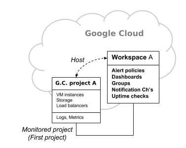

# Operations (formerly know as Stackdriver)

Suite of tools that allows you to monitor, troubleshoot and improve application performance on a Google Cloud environment.

* Collects metrics, logs and traces across GCP and your apps
* Has buil-in out-of-the-box dashboards and views to monitor systems
* Setup alerts and notification rules

The suite contains the following Modules (which are detailed below):

1. Cloud Logging
2. Cloud Monitoring
3. Error Reporting
4. Application Performance Management
   1. Cloud Debugger
   2. Cloud Trace
   3. Cloud Profiler

## Cloud Logging
Cloud Logging allows you to store, search, analyze, monitor, and alert on logging data and events from Google Cloud and Amazon Web Services.

Using Cloud Logging includes access to the [BindPlane service](https://bluemedora.com/products/bindplane/bindplane-for-stackdriver/), which you can use to collect logging data from over 150 common application components, on-premises systems, and hybrid cloud systems.

The Logging Agent, an application based on [fluentd](https://www.fluentd.org/), which runs on VMs in order to stream logs into Cloud Logging.

**How The Logging Agent Works**


The agent is supported on GCP COmpute Engine instances and AWS EC2 instances, which sends logs to an [AWS Connector Project](https://cloud.google.com/monitoring/accounts#account-project) in GCP.

App Engine (Standard and Flexibile) has built-in support for writing logs to Cloud Logging.

Google Kubernetes Engine (GKE) node instances have built-in support also for writing to Cloud Logging. [Cloud Operations for GKE](https://cloud.google.com/monitoring/kubernetes-engine/installing) can be enabled on new or existing cluster to add cluster wide logging.

Cloud Run and Cloud Functions (HTTP and Background) have built-in support for writing logs to Cloud Logging.

GCP leverages the _Logs Router_, which checks the log entry against a set of rules to determine which logs to discard, write/ingest/store in Cloud Logging and which logs to route to other destinations using _sinks_.

**Log Exclusions**

There are 2 kinds of exclusions:
* Exclusion Filters:
  * based on a filter expression
* Resource-type exclusions:
  * block all logs from a specific resource types

[Creating Exclusions](https://cloud.google.com/logging/docs/exclusions)

Logs entries can be exported to Cloud Storage, BigQuery or Pub/Sub before they are excluded and they are logs are lost forever.

**Log Retention Periods**
Two log buckets

* _Required
  * [Admin Activity audit logs](https://cloud.google.com/logging/docs/audit#admin-activity), [System Event audit logs](https://cloud.google.com/logging/docs/audit#system-event) and [Access Transparency logs](https://cloud.google.com/logging/docs/audit/access-transparency-overview)
    * Logs generated by Google personnel when they user uploaded content into any service that supports Access Transparency Logs see this [list](https://cloud.google.com/logging/docs/audit/access-transparency-services).
  * 400 day retention
  * Not configurable
* _Default
  * All other ingested logs
  * rentention
    * 7 days on Basic and 30 days on Premium
  * Configurable upto 3650 days
  *  `gcloud beta logging buckets update _Default --location=global --retention-days=[RETENTION_DAYS]`

### Exporting Logs
Exporting involves writing a filter that selects the log entries you want to export, and choosing a destination in Cloud Storage, BigQuery, Pub/Sub, or Cloud Logging. The filter and destination are held in an object called a sink. Sinks can be created in Google Cloud projects, organizations, folders, and billing accounts.

To create sinks, the user must have the IAM roles of `role/owner` or `role/logging.configWriter`.

Logging export scenerios and best practices can be found [here](https://cloud.google.com/solutions/design-patterns-for-exporting-stackdriver-logging).

When logs are exported to BigQuery, dated tables are created to hold log entries and log entries are placed in the tables whose names are based on the entries' log names.

#### Exporting logs to external systems
* Splunk
  * [Pub/Sub logs To Splunk via Dataflow](https://cloud.google.com/solutions/exporting-stackdriver-logging-for-splunk#deploy_splunk_dataflow_template)
    * create a Dataflow job that pulls messages from the previously created Pub/Sub subscription, converts payloads into Splunk HEC event format, and forwards them to Splunk HEC.
  * [Splunk-Add on For Google Cloud](https://cloud.google.com/solutions/exporting-stackdriver-logging-for-splunk#configure_splunk_add-on_for_gcp)
    * The Splunk Add-on for Google Cloud uses the Pub/Sub topic and a service account in Google Cloud. The service account is used to generate a private key that the add-on uses to establish a Pub/Sub subscription and ingest messages from the logging export topic. The appropriate IAM permissions are required to allow the service account to create the subscription and list the components in the Pub/Sub project that contains the subscription.
* ElasticSearch:
  *  The [Elastic Stack](https://www.elastic.co/products) has multiple solutions for ingesting data into an Elasticsearch cluster. [Logstash](https://www.elastic.co/products/logstash) and [Beats](https://www.elastic.co/products/beats) are the core products used for collecting, transforming, and ingesting data. Choosing between Logstash and Beats depends on your data volume, ingest rates, and latency requirements. This solution focuses on the Logstash component of the Elastic Stack because Logstash is the most flexible option for working with logs exported from Logging. 
     *  Logstash
        *  Use [Pub/Sub input plugin](https://github.com/logstash-plugins/logstash-input-google_pubsub) and [Cloud Storage input plugin](https://github.com/josephlewis42/logstash-input-google_cloud_storage) to integrate with Logstash.

### Create Logging Sinks - Command Line Samples

```
gcloud logging sinks create  NEW_SINK_NAME  DESTINATION  --log-filter="..." ...
```
The above command is the general gcloud command to create a sink for exporting logs. 

You can leverage one of the following additional flags `--folder`,`--billing-account`, and `--organization` to export logs from those resources. NOTE that by default, using these flags restricts the sink to exporting only the logs held in the named folder, organization, or billing account.

If you additionally add the `--include-children` flag, then the sink becomes an `aggregated` sink and the sink exports logs from all folders and projects contained within the named resource, subject to the filter in the `--log-filter` flag.

Also note that Billing accounts don't contain folders or projects, so `--include-children` has no effect with `--billing-account`.


## Cloud Monitoring and Alerting
Cloud Monitoring uses _Workspaces_ to organize monitoring information contained in one or more GCP projects or AWS Accounts.

Each workspace has a _host project_.The host project is the Google Cloud project used to create the Workspace. The name of the Workspace is set to the name of host project. **This isn't configurable.**

A _Workspace_ can be configured to monitor up to 100 GCP projects and AWS accounts.



### Cloud Monitoring Agent
The Cloud Monitoring agent is a [collectd](https://collectd.org/)-based daemon that gathers system and application metrics from virtual machine instances and sends them to Monitoring. By default, the Monitoring agent collects disk, CPU, network, and process metrics.

The Cloud Monitoring agent is s optional but recommended to be installed on all VMs (GCE and AWS EC2) that you wish to monitor. Monitoring can access some instance metrics without the Monitoring agent, including CPU utilization, some disk traffic metrics, network traffic, and uptime information. Monitoring uses the Monitoring agent to access additional system resources and application services in virtual machine (VM) instances. If you want these additional capabilities, you should install the Monitoring agent.


* App-Engine Standard has built-in Monitoring support, no agent required.
* App Engine Flexible, Dataflow, Dataproc have pre-installed agents with service-specific configurations
* GKE
  * has Cloud Operations for GKE pre-installed which offers monitoring and logging enabled by default

### Alerting
Cloud Monitoring allows alerting to give timely awareness to problems in you cloud apps so they can be resolved quickly.

This is accomplished by setuping _Alerting Policies_. Each policies contains:
  * Conditions:
    * identify when a resource or a group of resources are in a state that require action to be taken.
    * Type of conditions can be found [here](https://cloud.google.com/monitoring/alerts/types-of-conditions).
  * Notifications:
    * Where to send the alert to:
      * Email
      * Page Duty
      * Slack
      * SMS
      * Webhooks
      * Pub/Sub
  * Documentation:
    * Any details around how to solve the issue.

In order to create alerting policies the user must have one of the following IAM roles assigned:
  * `roles/monitoring.alertPolicyEditor`
  * `role/monitoring.editor`
  * `role/monitoring.admin`
  * `role/owner`

## Error Reporting
Error Reporting counts, analyzes, and aggregates the crashes in your running cloud services. A centralized error management interface displays the results with sorting and filtering capabilities. A dedicated view shows the error details: time chart, occurrences, affected user count, first- and last-seen dates and a cleaned exception stack trace. Opt in to receive email and mobile alerts on new errors.

App Engine and Cloud Run supports Error Reporting by default, all exceptions are written to `stderr`, `stdout` or other logs that include a stack trace in any [supported language](https://cloud.google.com/error-reporting/docs/setup#setup-by-language).

Cloud Functions is configured to use Error Reporting automatically. Unhandled JavaScript exceptions will appear in Logging and be processed by Error Reporting without needing to use the Error Reporting library for Node.js.

## Application Performance Management (APM)
Is a suite of developer tools to monitoring you app at runtime so you can understand how they behave in production.

### Cloud Debugger
Cloud Debugger is a feature of Google Cloud Platform that lets you inspect the state of an application, at any code location, without stopping or slowing down the running app. Cloud Debugger makes it easier to view the application state without adding logging statements.
You can use Cloud Debugger with any deployment of your application, including test, development, and production. The debugger adds less than 10ms to the request latency only when the application state is captured. In most cases, this is not noticeable by users.
### Cloud Trace
Distributed tracing system that collects latency data from you applications and displays it in the GCP Console Dashboards. 

Allows you to find performance bottlenecks by inspecting detail latency information for a single request or view aggregated latency for an entire application.

All the data can be view via the Analysis Report feature, which allows you to compare over time and/or versions of you application.

App Engine Environments have buil-in support for Cloud Trace and automatically capture and send trace latency data to Cloud Trace. All others must configure tracing instrumentation by either using `OpenTelemetry`, `OpenCensus` or the `Clout Trace API`.

### Cloud Profiler
Cloud Profiler is a statistical, low-overhead profiler that continuously gathers CPU usage and memory-allocation information from your production applications. It attributes that information to the application's source code, helping you identify the parts of the application consuming the most resources, and otherwise illuminating the performance characteristics of the code.


