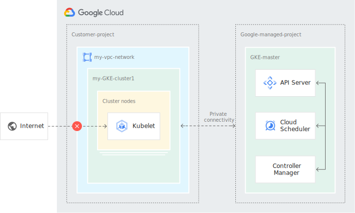
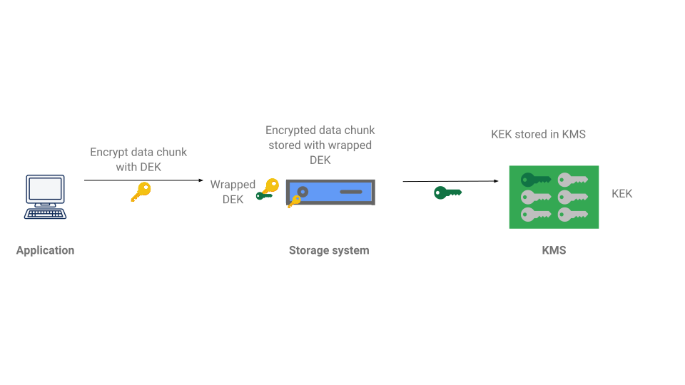
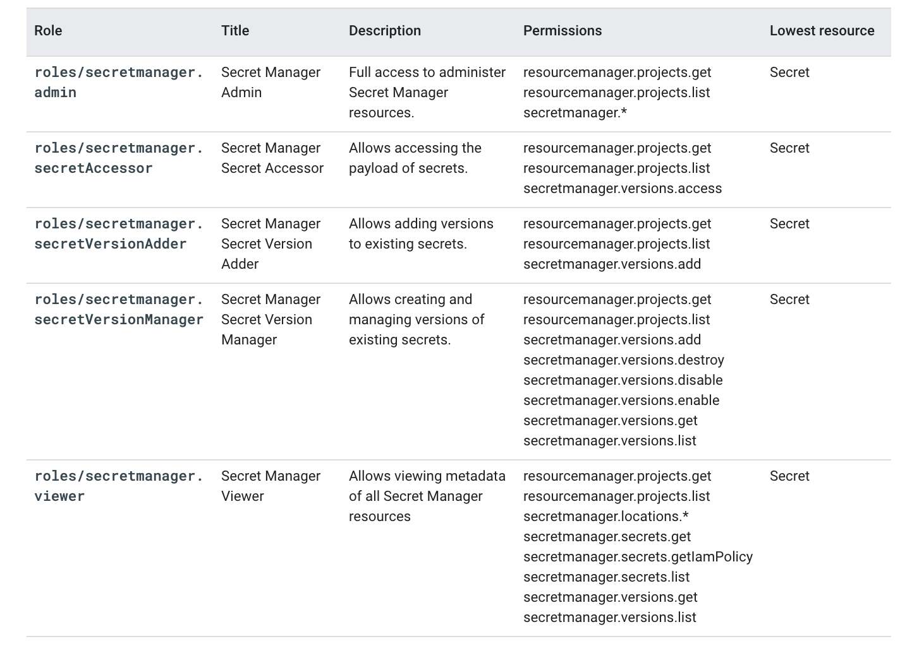
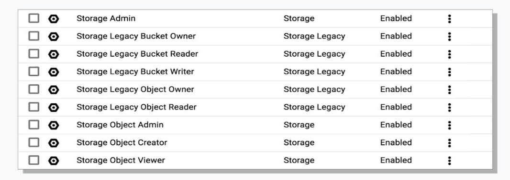
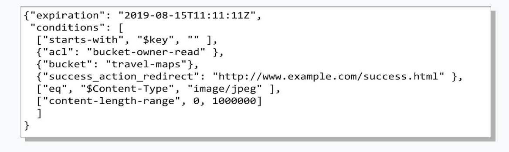

# Compute Engine Security Best Practices
## Service Accounts and IAMs
A default compute engine service account is created for every GCP project when Compute Engine API is enabled. The default SA has `Project Editor` role which can be dangerous as it has access to create and delete resources.

The default SA can be assigned to an instance created or you can specifiy another custom sa, which would require the correct permissions.

When an instance is assigned a service account, the VM authenticates using the identity of the service account when making calls to Google APIs.

Specifying _scopes_ can limit what the default service account can and cannot do.

Scopes:
* Allow default access:
  * Read-only access to storage
  * Access to Stackdriver Logging and Monitoring
* Allow full access:
  * can grant access to all Cloud APIs
  * Not best practice
* Set access for each API:
  * Choose requirements for you application
  * Can grant individual access to specific CLoud Apis

Using the default account, the instance(s) must be stopped in order to change the scopes associated. If using a custom/user-managed service account, IAM roles can be changed without needing to stop instances.

```
gcloud compute instances set-scopes [INSTANCE_NAME] --scopes [SCOPES]
```
`--scopes compute-rw,storage-ro,etc`

## Secure Connection
Can added project wide ssh keys or instance level ssh keys.

Use OS Login to simplify SSH access management by linking your Linux user account to your Google identity.

Use firewalls to restrict traffic.
Use HTTPS and SSL for production Web Servers.
Configure Port Forwarding over SSH.
```
gcloud compute ssh example-instance \
    --project my-project \
    --zone us-central1-a \
    -- -L 2222:localhost:8888 -L 2299:localhost:8000
```

Connecting via Bastion Host to instances without external IPs:


Use Identity Aware Proxy for TCP Forwarding.

To configure IAP setup firewalls like such:

```
gcloud compute firewall-rules create allow-rdp-ingress-from-iap \
  --direction=INGRESS \
  --action=allow \
  --rules=tcp:3389 \
  --source-ranges=35.235.240.0/20
```
```
gcloud compute firewall-rules create allow-ssh-ingress-from-iap \
  --direction=INGRESS \
  --action=allow \
  --rules=tcp:22 \
  --source-ranges=35.235.240.0/20
```
```
gcloud compute firewall-rules create allow-ingress-from-iap \
  --direction=INGRESS \
  --action=allow \
  --rules=tcp:PORT \
  --source-ranges=35.235.240.0/20
```

Also grant permissions to use IAP:

```
gcloud projects add-iam-policy-binding [PROJECT_ID] \
    --member=user:[EMAIL ]\
    --role=roles/iap.tunnelResourceAccessor
```

Once IAP is configure you can use tunnel over ssh:

`gcloud compute ssh [INSTANCE_NAME]`

Or use the follow for IAP TCP tunnelling other ports:

```
gcloud compute start-iap-tunnel [INSTANCE_NAME] [INSTANCE_PORT] `
    --local-host-port=localhost:LOCAL_PORT `
    --zone=ZONE
```

If the instance(s) have no public IP configure a bastion host vm in order to connect to any private VM. The bastion host should be hardend and have necessary firewall rules to limit the source IPs that can connect to it.


## Secure Images
Define an Organization Policy that only allow compute engine VMs to be created from approved images and use only Trust images.

```
constraint: constraints/compute.trustedImageProjects
listPolicy:
  allowedValues:
    - projects/debian-cloud
    - projects/cos-cloud
  deniedValues:
    - projects/unwanted-images
```
Use Hardened custom OS images to help reduce the surface of vulnerability for the instance.

Subscribe to [gce-image-notifications](https://groups.google.com/forum/#!aboutgroup/gce-image-notifications) to recieve notifications about Compute Engine image update releases.


# Google Kubernetes Engine (GKE)
Google Kubernetes Engine (GKE) provides a managed environment for deploying, managing, and scaling your containerized applications using Google infrastructure. The GKE environment consists of multiple machines (specifically, Compute Engine instances) grouped together to form a cluster.

GKE contains at least one _cluster master_ and multiple worker machines called _nodes_. 

**Upgrading Clusters**

_Master_:
```
gcloud container clusters upgrade [cluster-name] \
  --master --cluster-version [cluster-version]
```
_Nodes_:
```
gcloud container clusters upgrade [cluster-name] \
  --node-pool=[node-pool-name] \
  --cluster-version [cluster-version]
```

Disregard the flag `--cluster-version` to upgrade to the default verison.

You can use the `rollback` command to rollback node pools that failed to upgrade or whose upgrades were cancelled to their previous Kubernetes verison.

### Pods
The smallest, most basic deployable objects in Kubernetes. A Pod represents a single instance of a running process in your cluster.

Pods contain one or more containers, such as Docker containers. When a Pod runs multiple containers, the containers are managed as a single entity and share the Pod's resources. Generally, running multiple containers in a single Pod is an advanced use case.

Pods share networking and storage resources and is meant to run a single "instance" of the application. It is NOT recommended to create individual pods, instead you create `replicas`, your application runs in a `replicaset` which is managed by a controller (deployment) which manages the Pod lifecycle.

### Cluster Master
The master node runs the Kubernetes control plane, which includes the _API Server_, scheduler and resource controllers. The master lifecylce is managed by GKE (Google) when you create or delete a cluster. It runs on a VM in a VPC network contained in a project owned by Google. 

GKE cluster masters are automatically upgraded to run new versions of  of Kubernetes as those versions become stable. This can also be manually done.

The master is responsible for deciding what runs on all of the cluster's nodes. 

### Nodes
A cluster typically has one or more _nodes_ which run containerized applications and/or workloads. These are compute engine VM instances, which are are created by GKE. 

Each node is managed by the master and can be setup to have auto-upgrades and repairs.

**Enable/disable auto-upgrad on existing node pool**

```
gcloud container node-pools update node-pool-name --cluster cluster-name \
    --zone compute-zone --enable-autoupgrade |no-enable-autoupgrade
```
**Creating a cluster or node pool with node auto-upgrades enabled**

```
gcloud container clusters create cluster-name --zone compute-zone \
    --enable-autoupgrade
```
```
gcloud container node-pools create node-pool-name --cluster cluster-name \
    --zone compute-zone --enable-autoupgrade
```

### Sole-tenant Nodes
Sole-tenant nodes are dedicated physical servers that run a project's VMs. This allows isolation from VMs in other projects or groups you VMs together on the same host hardware.

**Sole-tenant node template**
```
gcloud compute sole-tenancy node-templates create template-name \
    --region compute-region --node-requirements vCPU=any,memory=any,localSSD=0
```

**Sole-tenant node group**
```
gcloud compute sole-tenancy node-groups create group-name --zone compute-zone \
  --node-template template-name --target-size target-size
```

**GKE Node pool using sole-tenant node group**

```
 gcloud container node-pools create node-pool-name \
   --node-group group-name --cluster cluster-name \
   --zone compute-zone --machine-type=node-group-machine-type \
   --node-locations=node-group-zone
```
Replace _group-name_ with the _sole-tenant group_ created.

## Private clusters
Private clusters give you the ability to isolate nodes from having inbound and outbound connectivity to the public internet. This isolation is achieved as the nodes have internal IP addresses only. If you need or want to provide outbound internet access for private nodes you can leverage Cloud NAT or managed your own NAT Gateway.

The master is peered to your VPC network containing the cluster nodes.

Even though the node IP addresses are private, external clients can reach [Services](https://cloud.google.com/kubernetes-engine/docs/concepts/service) in your cluster. For example, you can create a Service of type LoadBalancer, and external clients can call the IP address of the load balancer. Or you can create a Service of type NodePort and then create an Ingress. GKE uses information in the Service and the Ingress to configure an [HTTP(S) load balancer](https://cloud.google.com/load-balancing/docs/https). External clients can then call the external IP address of the HTTP(S) load balancer.



Private Google Access is enabled by default for Private Clusters.

## GKE Security
* Use _authorized networks_ to whitelist specific CIDR ranges and allow IP addresses in those ranges to access the _cluster master_.
* alternatively create _private clusters_.
* Use shieled GKE nodes `--enable-shielded-nodes` at cluster creation or udpate. Shielded GKE nodes should be configured with secure boot, `--shielded-secure-boot` at cluster creation.
* Use hardened node image with `containerd` runtime, which is the core runtime component of Dockerand has been designed to deliver core container functionality for the Kubernetes Container Runtime Interface (CRI). It is significantly less complex than the full Docker daemon, and therefore has a smaller attack surface.
  * use the `glcoud` flag `--image-type=cos_containerd` at cluster creation or upgrade time.
* Use _Workload Identity_ for access Google Services from applications running in GKE. 
  * [k8s service account](https://kubernetes.io/docs/tasks/configure-pod-container/configure-service-account/) is configured to act as a Google service account, which would authenticate as the GCP account when accessing GCP Apis.
  
```
gcloud iam service-accounts add-iam-policy-binding \
  --role roles/iam.workloadIdentityUser \
  --member "serviceAccount:project-id.svc.id.goog[default/default]" \
  gsa-name@project-id.iam.gserviceaccount.com
```

* RBAC is a built-in mechanism which allows you to configure fine-grained access and permission to interact with K8S objects in the cluster.
  * `cluster-admin` grants full permissions in the cluster to a user

**Provide a user with full admin**

```
kubectl create clusterrolebinding cluster-admin-binding \
  --clusterrole cluster-admin \
  --user [user-account]
```

These can be defined as objects via yaml files and provisions in the cluster also.

* `ClusterRole` or `Role`:
  * set of resource types and operations that can be assigned to a user or group of users in a cluster (ClusterRole) or Namespace (Role) but does not specify the user or group of users.
* `ClusterRoleBinding` or `RoleBinding`:
  * assignes ClusterRole or Role to a user or group of users.

Samples:
```
kind: Role
apiVersion: rbac.authorization.k8s.io/v1
metadata:
  namespace: accounting
  name: pod-reader
rules:
- apiGroups: [""] # "" indicates the core API group
  resources: ["pods"]
  verbs: ["get", "watch", "list"]
```
```
kind: RoleBinding
apiVersion: rbac.authorization.k8s.io/v1
metadata:
  name: pod-reader-binding
  namespace: accounting
subjects:
# Google Cloud user account
- kind: User
  name: janedoe@example.com
# Kubernetes service account
- kind: ServiceAccount
  name: johndoe
# IAM service account
- kind: User
  name: test-account@test-project-123456.google.com.iam.gserviceaccount.com
# G Suite Google Group
- kind: Group
  name: accounting-group@example.com
roleRef:
  kind: Role
  name: pod-reader
  apiGroup: rbac.authorization.k8s.io
```

**Application-layer Secrets Encryption**
By defulat GKE encrypts content stored at rest, including Secrets. 

_Application-layer Secrets Encryption_ is an additional layer of security for sensitive data, such as Secrets, stored in [etcd](https://kubernetes.io/docs/concepts/overview/components/#etcd). To use this feature a Cloud KMS key and GKE service account **MUST** be created. The key must be in the same location as the cluster in order to decrease latency.

GKE will encrypt secrets locally using the [AES-CBC](https://tools.ietf.org/html/rfc3602) provider, using local data enccryotion keys (DEKs) and the DEKs are encrypted with a key encryption key (KEK) that is managed in Cloud KMS.

This is referred to as _Envelope Encryption_, which provides the following benefits:

* KEKs can be rotated without having to re-encrypt secrets
* Secrets stored in Kubernetes can rely on an external root trust, [Hardware Security Module](https://en.wikipedia.org/wiki/Hardware_security_module).



When a secret is added:

* Kubernetes API server generates a DEK for the secret, using a random number generator
* Uses the DEK locally to encrypt the secret
* The [KMS plugin](https://github.com/GoogleCloudPlatform/k8s-cloudkms-plugin) sends the DEK to Cloud KMS for encryption, using the GKE Service Account to authenticate.
* Cloud KMS encrypts the DEK and sends it back
* K8S api server saves the encrypted secret and encryted DEK, the plaintext DEK is not saved.

**NOTE**
_When a key is destroyed in Cloud KMS any Secrets, that were encrypted by it, will no longer be available._

**GKE Sandbox**
Provides and extra layer of security to prevent untrusted code from affecting the host kernel on you worker nodes. This is done by leveraging [gVisor](https://gvisor.dev/).

gVisor is a userspace re-implementation of the Linux kernel API that does not need elevated privileges. In conjunction with a container runtime such as `containerd`, the userspace kernel re-implements the majority of system calls and services them on behalf of the host kernel. From the container's point of view, gVisor is nearly transparent, and does not require any changes to the containerized application.

When enabled on a node pool, a sandbox is created for each Pod running on a node in that node pool. 

GKE sandboxes are typically a good fit for:
* Untrusted or 3rd party applications using runtimes such as Rust, Java, Python, Node.js, or Golang
* Web server FE, caches or proxies
* Apps processing external media or data using CPUs
* ML workloads
* CPU or RAM intensive workloads

It recommended to specify resource limits for containers in sandboxes.

GKE Sandbox cannot be enabled on the default node pool. Node pool cannot use e2-micro, e2-small and e2-medium machine types. 

Hyper-threading is disbaled by default for Sandboxed node pools to prevent side channel vulnerabilities that take advantange of core state shared between hyper-threads. To enable this at node pool creation time add a node lable `cloud.google.com/gke-smt-disabled=false:`, then deploy a `DaemonSet` to the node pool using:

```
kubectl create -f \
    https://raw.githubusercontent.com/GoogleCloudPlatform/k8s-node-tools/master/disable-smt/gke/enable-smt.yaml
```
The DaemonSet will only run on nodes with the `cloud.google.com/gke-smt-disabled=false` label. It will enable Hyper-Threading and then reboot the node.

**GKE Network Security**
Limit Pod-to-Pod communication by using [network policies](https://kubernetes.io/docs/concepts/services-networking/network-policies/) which will lock down ingress and egress to and from pod within a namespace. Once a policy if configured, all traffic that does not match the configured labels is dropped.

Sample Network policy:
```
kind: NetworkPolicy
apiVersion: networking.k8s.io/v1
metadata:
  name: hello-allow-from-foo
spec:
  policyTypes:
  - Ingress
  podSelector:
    matchLabels:
      app: hello
  ingress:
  - from:
    - podSelector:
        matchLabels:
          app: foo

```

Use the `--enable-network-policy` flag at cluster creation time to enforce network policies. If the flag is omited any network policy configure will be ignored.

[Network Policy Tutorial](https://cloud.google.com/kubernetes-engine/docs/tutorials/network-policy)

Another concept is to filtering load balanced traffic. To accomplish this a [network load balancer](https://cloud.google.com/compute/docs/load-balancing/network) must be created as a k8s Service of type `LoadBalancer` which matches you Pod's labels. When this service is created, and external-facing IP is configured that maps to ports on you k8s pods. 
By specifying a list of CIDR ranges in the `loadBalancerSourceRanges` in the Service deployment yaml will whitelist those ips as authorized access to the service. If no ips are specified all address are allowed.

Using a [kube-proxy](https://kubernetes.io/docs/reference/generated/kube-proxy/), you can filter traffic a the node level.

**Securing Workloads**
Kubernetes allows users to quickly provision, scale, and update container-based workloads. This section describes tactics that administrators and users can employ to limit the effect a running container can have on other containers in the same cluster, the nodes where containers can run, and the Google Cloud services enabled in users' projects.

Use the [Security Context](https://kubernetes.io/docs/tasks/configure-pod-container/security-context/) to set security-related options on both Pods and Containers, such as:

* User and groupt to run as
* Available Linux capabilities
* Ability to escalate privileges

Sample Security Context:

```
apiVersion: v1
kind: Pod
metadata:
  name: security-context-demo
spec:
  securityContext:
    runAsUser: 1000
    runAsGroup: 3000
    fsGroup: 2000
  volumes:
  - name: sec-ctx-vol
    emptyDir: {}
  containers:
  - name: sec-ctx-demo
    image: busybox
    command: [ "sh", "-c", "sleep 1h" ]
    volumeMounts:
    - name: sec-ctx-vol
      mountPath: /data/demo
    securityContext:
      allowPrivilegeEscalation: false
```

To change these settings at the cluster level a `PodSecurityPolicy` needs to be implemented. 

A PodSecurityPolicy is an admission controller resource that is created which validates requests to create and update Pods on the cluster. The PodSecurityPolicy defines a set of conditions that Pods must meet to be accepted by the cluster; when a request to create or update a Pod does not meet the conditions in the PodSecurityPolicy, that request is rejected and an error is returned.


Sample PodSecurity Policy Spec:

```
apiVersion: policy/v1beta1
kind: PodSecurityPolicy
metadata:
  name: my-psp
spec:
  privileged: false  # Prevents creation of privileged Pods
  seLinux:
    rule: RunAsAny
  supplementalGroups:
    rule: RunAsAny
  runAsUser:
    rule: RunAsAny
  fsGroup:
    rule: RunAsAny
  volumes:
  - '*'
```

To enable the use of PodSecurityPolicy use the `--enable-pod-security-policy` flag at cluster creation or update.

The GKE node operating systems, both Container-Optimized OS and Ubuntu, [apply the default Docker AppArmor security policies](https://cloud.google.com/container-optimized-os/docs/how-to/secure-apparmor#using_the_default_docker_apparmor_security_profile) to all containers started by Kubernetes.

**Binary Authorization**
Binary Authorization is a service on Google Cloud that provides software supply-chain security for applications that run in the cloud. 

It works with images that you deploy to GKE from Container Registry or another container image registry. With Binary Authorization, you can ensure that internal processes that safeguard the quality and integrity of your software have successfully completed before an application is deployed to your production environment.

To enable this service on a project run the following command:

```
gcloud services enable \
    container.googleapis.com \
    containeranalysis.googleapis.com \
    binaryauthorization.googleapis.com
```

To create a cluster with `Binary Authorization` enabled run:

```
gcloud container clusters create \
    --enable-binauthz \
    --zone [ZONE] \
    [CLUSTER_NAME]
```

A _policy_ in Binary Authorization is a set of rules that govern the deployment of container images to Google Kubernetes Engine (GKE). A policy has the following parts:

* Deployment rules
* List of exempt images

Each GCP project can have exactly ONE policy.

Sample Policy:

```
admissionWhitelistPatterns:
- namePattern: gcr.io/google_containers/*
- namePattern: gcr.io/google-containers/*
- namePattern: k8s.gcr.io/*
- namePattern: gke.gcr.io/*
- namePattern: gcr.io/stackdriver-agents/*
globalPolicyEvaluationMode: ENABLE
defaultAdmissionRule:
  evaluationMode: ALWAYS_ALLOW
  enforcementMode: ENFORCED_BLOCK_AND_AUDIT_LOG
name: projects/PROJECT_ID/policy
```

An _attestation_ is a digital document that certifies that GKE is allowed to deploy the container image.

An attestation is created after a container image is built. Each such container has a globally unique digest. A signer signs the container image digest using a private key from a key pair and uses the signature to create the attestation. At deploy time, the Binary Authorization enforcer uses the attestor's public key to verify the signature in the attestation. Typically one attestor corresponds to exactly one signer.

To enable attestations in Binary Authorization, your policy's `enforcementMode` is set to `REQUIRE_ATTESTATION`.

Creating attestations:

```
gcloud alpha container binauthz attestations create \
    --project="${ATTESTATION_PROJECT_ID}" \
    --artifact-url="${IMAGE_TO_ATTEST}" \
    --attestor="projects/${ATTESTOR_PROJECT_ID}/attestors/${ATTESTOR_NAME}" \
    --signature-file=/tmp/ec_signature \
    --public-key-id="${PUBLIC_KEY_ID}" \
    --validate
```

Using Cloud KMS:

```
gcloud beta container binauthz attestations sign-and-create \
    --project="${ATTESTATION_PROJECT_ID}" \
    --artifact-url="${IMAGE_TO_ATTEST}" \
    --attestor="${ATTESTOR_NAME}" \
    --attestor-project="${ATTESTOR_PROJECT_ID}" \
    --keyversion-project="${KMS_KEY_PROJECT_ID}" \
    --keyversion-location="${KMS_KEY_LOCATION}" \
    --keyversion-keyring="${KMS_KEYRING_NAME}" \
    --keyversion-key="${KMS_KEY_NAME}" \
    --keyversion="${KMS_KEY_VERSION}"
```

# Container Best Practices
A full list of best practices can be found [here](https://cloud.google.com/blog/products/gcp/7-best-practices-for-building-containers).

Highlights:

* Single App Per Container
  * Ex (Apache/MySQL/PHP stack):
    * Each should be their own container
* Properly handle PID 1, signal handling and zombie processes
  * Handle SIGTERM/SIGKILL in you application
  * Lauch process using `CMD` or `ENTRYPOINT`
    * If additional preparation is needed before launching your process, launch a shell script using the `exec` command.
* Remove uncessary tools
  * ex (netcat, tracing or debugging tools)
* Avoid running as root
  * ex disable use of sudo
* Launch Containers is RO model `--read-only` docker command flag or `readOnlyRootFilesystem` option in Kubernetes.
  * This can also be enforced using a [`PodSecurityPolicy`](https://kubernetes.io/docs/concepts/policy/pod-security-policy/#volumes-and-file-systems)
* Build the smallest image as possible
  * [Reduce clutter in your image](https://cloud.google.com/solutions/best-practices-for-building-containers#reduce_the_amount_of_clutter_in_your_image).
* Use vulnerability scanning in Container Registry


# Secrets Management
GCP offers `Secret Manager` storage, management and access of secrets as binary blobs or text strings.

Secret Manager works well for storing configuration information such as database passwords, API keys, or TLS certificates needed by an application at runtime.

There are other third-party tools such as Hashicorp Vault and Berglass.

**Secrets Manager** encrypts secret data before ts persisted to disk using AES-256 encryption scheme

## IAM Roles
The following roles a needed in order to manage secrets:



## Secret Rotation
Secrets can be rotated by adding a new secret version to the secret. Any version of a secret can be accessed as long as it is enabled. 

To prevent a secret from being used you should disable it.

A secret can be in one of the following states:

* Enabled
  * active and accessible
* Disabled
  * cannot be accessed but content still exists
  * Can be re-enabled
* Destroyed
  * permanent
  * content is discarded
  * cannot be changed to another state

```
gcloud secrets versions enable | disable | destroy version-id --secret="secret-id"
```

## Replication
Secrets have global names and globally replicated metadata, but the location where the secret payload data is stored can be controlled using the replication policy. Each secret has its own replication policy which is set at creation. The locations in the replication policy cannot be updated.

There are two replication types:

* `Automatic`:
  * simplest configuration and recommended for most users
  * default policy
  * secret with automaticate policy can only be created if the the resource creation in `global` is allowed.
  * payload data is replicated without restriction.
* `User Managed`:
  * payload data replicated to a user configured set of locations. 
  * Supported Locations found [here](https://cloud.google.com/secret-manager/docs/locations).
  * a secret with a user managed replication policy can only be created if resource creation is allowed in the all selected locations.
  * 

# Cloud Storage 
Cloud Storage is a service for storing your objects in Google Cloud. An object is an immutable piece of data consisting of a file of any format. You store objects in containers called buckets. All buckets are associated with a project, and you can group your projects under an organization.

You can enable versioning on the bucket to keep historical versions of all objects:

```
gsutil versioning set on | off gs:\\my-bucket
```

## Storage Types
There are several tiers or storage classes offered by Cloud Storage:

* STANDARD 
  * No min storage duration
  * Hot Frequent access data
* NEARLINE
  * min 30 days
  * lower storage cost than standard
  * higer cost for accessing
  * for infrequently accessed data
  * appropriate for backups
* COLDLINE
  * min 90 days
* ARCHIVE
  * min 365 days
  * high cost for accessing data
  * lowest storage fees
  * ideal for data that you will not touch for 1 year
  * DR scenerios

## Enabling logging within a bucket
 ```
 gsutil mb gs://bucket-for-logs
 gsutil acl ch -g [email_address]:W gs://bucket-for-logs
 gsutil defacl set project-private gs://bucket-for-logs
 gsutil logging set on -b gs://bucket-for-logs gs://[MAIN_BUCKET]
 ```

## Cloud Storage Permission and Access Control Lists (ACLs)
* Members can be granted access to Cloud Storage at the org , folder, project or bucket levels.
* Permissions flow down from higher levels.
* Cannot remove a permission at the lower level that was granted at a higher level.

### Predefine storage roles
Roles can be added to member and service accounts at the project or bucket level.


### Storage role permissions


* `Storage Object Admin`:
  * provides full control of the Cloud Storage Objects.
* `Storage Object Creator`:
    * ability to get and list objects and projects and as well as create objects
* `Storage Object Viewer`:
  * ability to get and list objects get and list projects and list Cloud Storage objects

## ACLs
Access Control Lists (ACLs) allows you  to define who has access to individual buckets and objects, as well as what level of access they have.

ACLs can work in tandem with IAM to grant access to buckets and objects. A user needs either an IAM or an ACL to access a bucket or object.

In most cases IAM permissions should be used. If you want more finer grained access control over buckets and objects, then use ACLs.

To make a bucket public, grant `allUsers` the `Storage Object Viewer` role. To make an object public, grant `allUsers` the `Reader` access.

## Signed URLs
Signed URLs allow access to Cloud Storage without having to add a user to and ACL or IAM. They provide temporary access with a timeout. Caveat is that anyone with the signe url has access to the bucket and/or object(s).

**Creating a signed URL with gsutil**

```
glcoud iam service-accounts keys create ~/key.json --iam-account [EMAIL_ADDRESS]

gsutil signurl -d 10m ~/key.json gs://[GCS_BUCKET_NAME]/[FILE]
```

`-d` is the duration the url with be available for (example 10 min)

## Signed Policy Documents
Provides control on what can be uploaded to a bucket. Allows control over size, content type and other upload characteristics.

Example of Signed Policy Document:
.

Requirements:
* Ensure the policy document is UTF-8 encoded
* Encode the policy document as a Base64 representation
* Sign your policy using RSA SHA-256 using the secret key provide from GCP Console
* Encode the message digest as a Base64 representation
* Add the policy document information to the HTML form.

## Cloud Storage Lifecyle Management
You can configure a set of rules that will trigger actions to either delete the object perminently or move it to a lower cost storage tier (Nearline, Coldline or Archive).

To enable Object Lifecycle Management via gsutil run :
```
gsutil lifecycle set [LIFECYCLE_CONFIG_FILE] gs://[BUCKET_NAME]
```

Sample Config File:
```
{
"lifecycle": {
  "rule": [
  {
    "action": {
      "type": "SetStorageClass",
      "storageClass": "NEARLINE"
    },
    "condition": {
      "age": 365,
      "matchesStorageClass": ["MULTI_REGIONAL", "STANDARD", "DURABLE_REDUCED_AVAILABILITY"]
    }
  },
  {
    "action": {
      "type": "SetStorageClass",
      "storageClass": "COLDLINE"
    },
    "condition": {
      "age": 1095,
      "matchesStorageClass": ["NEARLINE"]
    }
  }
]
}
}
```

## Data Retention Policies using Bucket Lock
You can include a retention policy when creating a new bucket, or you can add a retention policy to an existing bucket. Placing a retention policy on a bucket ensures that all current and future objects in the bucket cannot be deleted or overwritten until they reach the age defined by the policy.

Rententions Periods:
* A day is considered to be 86,400 seconds.
* A month is considered to be 31 days, which is 2,678,400 seconds.
* A year is considered to be 365.25 days, which is 31,557,600 seconds.

You can set a maximum retention period of 3,155,760,000 seconds (100 years).

**Locking a retention policy is irreversible**.

Bucket Lock can help with regulatory and compliance requirements such as those associated with FINRA, SEC and CFTC.

When a retention policy is locked, Cloud Storage automatically puts a `lien` on the to the `project.delete` permission where the bucket is contained. This means the the project cannot be deleted.


To apply a retention policy using `gsutil`:

```
gsutil retention set 600s gs://my-bucket
```
The above command applies a retention policy of 10 min.

To remove a retention policy:
```
gsutil retention clear gs://my-bucket
```

To lock a retention policy:
``
gsutil retention lock gs://my-bucket
``

# BigQuery Security
IAM Roles:
  * BigQuery Admin (`bigquery.admin`):
    * Create and read data
    * run jobs
    * set iam policies
  * BigQuery Data Owner (`bigquery.dataOwner`):
    * R/W access to data
    * can grant access to other users and groups by setting IAM policies
  * BigQuery Data Editor (`bigquer.dataEditor`):
    * R/W access to data
  * BigQuery Data Viewer (`bigquery.dataViewer`):
    * Read-only access to data
  * BigQuery Job User (`bigquery.user`):
    * Create and run jobs
    * no data access
  * BigQuery User (`bigquery.user`):
    * Can run jobs
    * Create datasets
    * List tables
    * save queries
    * NO default access to data

A full list of predefined IAM roles can be found [here](https://cloud.google.com/bigquery/docs/access-control#bigquery).

The user who created the dataset is the owner.

Always best to assigned roles to groups.

### Authorized Views
Views to provide row or column level permissions to datasets.

To create `authorized views`, create a second dataset with different permissions from the frst. Add a view to the second dataset that selects the subset of data you want to expose from the first dataset.

Access control examples can be found [here](https://cloud.google.com/bigquery/docs/access-control-examples).

### Optimizing Storage
You can control storage costs and optimize storage usage by setting the default table expiration for newly created tables in a dataset. If you set the property when the dataset is created, any table created in the dataset is deleted after the expiration period. If you set the property after the dataset is created, only new tables are deleted after the expiration period.

```
bq mk \
--time_partitioning_type=DAY \
--time_partitioning_expiration=259200 \
project_id:dataset.table
```

BigQuery Command Line Reference can be found [here](https://cloud.google.com/bigquery/docs/reference/bq-cli-reference).
