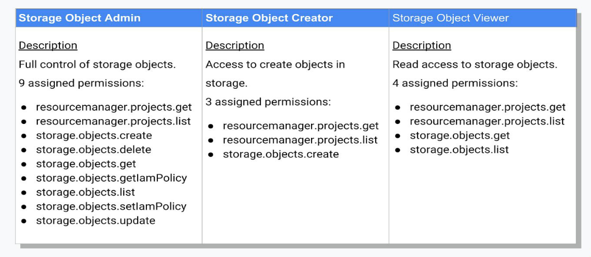

# Compute Engine Security Best Practices

## Patch Managment
Use OS patch management to apply operating system patches across a set of Compute Engine VM instances (VMs).Long running VMs require periodic system updates to protect against defects and vulnerabilities.

The OS patch management service has two main components:

* Patch compliance reporting:
  *  which provides insights on the patch status of your VM instances across Windows and Linux distributions. Along with the insights, you can also view recommendations for your VM instances.
* Patch deployment:
  * which automates the operating system and software patch update process. A patch deployment schedules patch jobs. A patch job runs across VM instances and applies patches.

**Benefits**
* Create patch approvals. You can select what patches to apply to your system from the full set of updates available for the specific operating system.
* Set up flexible scheduling. You can choose when to run patch updates (one-time and recurring schedules).
* Apply advanced patch configuration settings. You can customize your patches by adding configurations such as pre and post patching scripts.
* Manage these patch jobs or updates from a centralized location. You can use the the OS patch management dashboard for monitoring and reporting of patch jobs and compliance status.

## Service Accounts and IAMs
A default compute engine service account is created for every GCP project when Compute Engine API is enabled. The default SA has `Project Editor` role which can be dangerous as it has access to create and delete resources.

The default SA can be assigned to an instance created or you can specifiy another custom sa, which would require the correct permissions.

When an instance is assigned a service account, the VM authenticates using the identity of the service account when making calls to Google APIs.

Specifying _scopes_ can limit what the default service account can and cannot do.

Scopes:
* Allow default access:
  * Read-only access to storage
  * Access to Stackdriver Logging and Monitoring
* Allow full access:
  * can grant access to all Cloud APIs
  * Not best practice
* Set access for each API:
  * Choose requirements for you application
  * Can grant individual access to specific CLoud Apis

Using the default account, the instance(s) must be stopped in order to change the scopes associated. If using a custom/user-managed service account, IAM roles can be changed without needing to stop instances.

```
gcloud compute instances set-scopes [INSTANCE_NAME] --scopes [SCOPES]
```
`--scopes compute-rw,storage-ro,etc`

From a security standpoint it is NOT recommended to use the default service account, instead create a new one that follows the princal of least privilege.

## Secure Connection
Can added project wide ssh keys or instance level ssh keys.

Use OS Login to simplify SSH access management by linking your Linux user account to your Google identity.

Use firewalls to restrict traffic.
Use HTTPS and SSL for production Web Servers.
Configure Port Forwarding over SSH.
```
gcloud compute ssh example-instance \
    --project my-project \
    --zone us-central1-a \
    -- -L 2222:localhost:8888 -L 2299:localhost:8000
```

Connecting via Bastion Host to instances without external IPs:


**Use Identity Aware Proxy for TCP Forwarding**

IAP's TCP forwarding feature allows users to connect to arbitrary TCP ports on Compute Engine instances. For general TCP traffic, IAP creates a listening port on the local host that forwards all traffic to a specified instance. IAP then wraps all traffic from the client in HTTPS. Users gain access to the interface and port if they pass the authentication and authorization check of the target resource's Identity and Access Management (IAM) policy.


To configure IAP setup firewalls like such:

```
gcloud compute firewall-rules create allow-rdp-ingress-from-iap \
  --direction=INGRESS \
  --action=allow \
  --rules=tcp:3389 \
  --source-ranges=35.235.240.0/20
```
```
gcloud compute firewall-rules create allow-ssh-ingress-from-iap \
  --direction=INGRESS \
  --action=allow \
  --rules=tcp:22 \
  --source-ranges=35.235.240.0/20
```
```
gcloud compute firewall-rules create allow-ingress-from-iap \
  --direction=INGRESS \
  --action=allow \
  --rules=tcp:PORT \
  --source-ranges=35.235.240.0/20
```

Also grant permissions to use IAP:

```
gcloud projects add-iam-policy-binding [PROJECT_ID] \
    --member=user:[EMAIL ]\
    --role=roles/iap.tunnelResourceAccessor
```

Once IAP is configure you can use tunnel over ssh:

`gcloud compute ssh [INSTANCE_NAME]`

Or use the follow for IAP TCP tunnelling other ports:

```
gcloud compute start-iap-tunnel [INSTANCE_NAME] [INSTANCE_PORT] `
    --local-host-port=localhost:LOCAL_PORT `
    --zone=ZONE
```

If the instance(s) have no public IP configure a bastion host vm in order to connect to any private VM. The bastion host should be hardend and have necessary firewall rules to limit the source IPs that can connect to it.


## Secure Images
Define an Organization Policy that only allow compute engine VMs to be created from approved images and use only Trust images.

```
constraint: constraints/compute.trustedImageProjects
listPolicy:
  allowedValues:
    - projects/debian-cloud
    - projects/cos-cloud
  deniedValues:
    - projects/unwanted-images
```
Use Hardened custom OS images to help reduce the surface of vulnerability for the instance.

Subscribe to [gce-image-notifications](https://groups.google.com/forum/#!aboutgroup/gce-image-notifications) to recieve notifications about Compute Engine image update releases.

Compute Engine predefines the following curated IAM roles that you can use for image management:

* `roles/compute.imageUser`:
  * Permission to list, read, and use images in your requests, without having other permissions on the image.
* `roles/compute.storageAdmin`:
  * Permissions to create, modify, and delete disks, images, and snapshots.

As a best practice, Google recommends keeping all your custom images in a single project dedicated to hosting these images and nothing else.


# Cloud Storage
Cloud Storage is a service for storing your objects in Google Cloud. An object is an immutable piece of data consisting of a file of any format. You store objects in containers called buckets. All buckets are associated with a project, and you can group your projects under an organization.

You can enable versioning on the bucket to keep historical versions of all objects:

```
gsutil versioning set on | off gs:\\my-bucket
```

## Storage Types
There are several tiers or storage classes offered by Cloud Storage:

* STANDARD
  * >99.99 % availability in multi-region and dual regions
  * 99.99 % in regions
  * No min storage duration
  * Hot Frequent access data
* NEARLINE
  * 99.95 % in multi-regions and dual regions
  * 99.9% in regions  
  * min 30 days
  * lower storage cost than standard
  * higer cost for accessing
  * for infrequently accessed data
  * appropriate for backups
* COLDLINE
  * 99.95 % in multi-regions and dual regions
  * 99.9% in regions
  * min 90 days
  * Coldline storage is ideal for data you plan to read or modify at most once a quarter. Note, however, that for data being kept entirely for backup or archiving purposes, Archive storage is more cost-effective, as it offers the lowest storage costs.
* ARCHIVE
  * 99.95 % in multi-regions and dual regions
  * 99.9% in regions
  * min 365 days
  * high cost for accessing data
  * lowest storage fees
  * ideal for data that you will not touch for 1 year
  * DR scenerios

## Encrypting Data with gsutil

```
gsutil -o 'GSUtil:encryption_key=projects/PROJECT_ID/locations/LOCATION/keyRings/KEYRING/cryptoKeys/KEYNAME' \
       cp /some/local/file gs://my-bucket/
```

## Enabling logging within a bucket
 ```
 gsutil mb gs://bucket-for-logs
 gsutil acl ch -g [email_address]:W gs://bucket-for-logs
 gsutil defacl set project-private gs://bucket-for-logs
 gsutil logging set on -b gs://bucket-for-logs gs://[MAIN_BUCKET]
 ```

## Cloud Storage Permission and Access Control Lists (ACLs)
* Members can be granted access to Cloud Storage at the org , folder, project or bucket levels.
* Permissions flow down from higher levels.
* Cannot remove a permission at the lower level that was granted at a higher level.

### Predefine storage roles
Roles can be added to member and service accounts at the project or bucket level.


### Storage role permissions


* `Storage Object Admin`:
  * provides full control of the Cloud Storage Objects.
* `Storage Object Creator`:
    * ability to get and list objects and projects and as well as create objects
* `Storage Object Viewer`:
  * ability to get and list objects get and list projects and list Cloud Storage objects

## ACLs
Access Control Lists (ACLs) allows you  to define who has access to individual buckets and objects, as well as what level of access they have.

ACLs can work in tandem with IAM to grant access to buckets and objects. A user needs either an IAM or an ACL to access a bucket or object.

In most cases IAM permissions should be used. If you want more finer grained access control over buckets and objects, then use ACLs.

To make a bucket public, grant `allUsers` the `Storage Object Viewer` role. To make an object public, grant `allUsers` the `Reader` access.

View current ACL:

`gsutil defacl get gs://[BUCKET_NAME]`

## Signed URLs
Signed URLs allow access to Cloud Storage without having to add a user to and ACL or IAM. They provide temporary access with a timeout. Caveat is that anyone with the signe url has access to the bucket and/or object(s).

**Creating a signed URL with gsutil**

```
glcoud iam service-accounts keys create ~/key.json --iam-account [EMAIL_ADDRESS]

gsutil signurl -d 10m ~/key.json gs://[GCS_BUCKET_NAME]/[FILE]
```

`-d` is the duration the url with be available for (example 10 min)

## Signed Policy Documents
Provides control on what can be uploaded to a bucket. Allows control over size, content type and other upload characteristics.

Example of Signed Policy Document:
.

Requirements:
* Ensure the policy document is UTF-8 encoded
* Encode the policy document as a Base64 representation
* Sign your policy using RSA SHA-256 using the secret key provide from GCP Console
* Encode the message digest as a Base64 representation
* Add the policy document information to the HTML form.

## Cloud Storage Lifecyle Management
You can configure a set of rules that will trigger actions to either delete the object perminently or move it to a lower cost storage tier (Nearline, Coldline or Archive).

To enable Object Lifecycle Management via gsutil run :
```
gsutil lifecycle set [LIFECYCLE_CONFIG_FILE] gs://[BUCKET_NAME]
```

Sample Config File:
```
{
"lifecycle": {
  "rule": [
  {
    "action": {
      "type": "SetStorageClass",
      "storageClass": "NEARLINE"
    },
    "condition": {
      "age": 365,
      "matchesStorageClass": ["MULTI_REGIONAL", "STANDARD", "DURABLE_REDUCED_AVAILABILITY"]
    }
  },
  {
    "action": {
      "type": "SetStorageClass",
      "storageClass": "COLDLINE"
    },
    "condition": {
      "age": 1095,
      "matchesStorageClass": ["NEARLINE"]
    }
  }
]
}
}
```

## Data Retention Policies using Bucket Lock
You can include a retention policy when creating a new bucket, or you can add a retention policy to an existing bucket. Placing a retention policy on a bucket ensures that all current and future objects in the bucket cannot be deleted or overwritten until they reach the age defined by the policy.

Rententions Periods:
* A day is considered to be 86,400 seconds.
* A month is considered to be 31 days, which is 2,678,400 seconds.
* A year is considered to be 365.25 days, which is 31,557,600 seconds.

You can set a maximum retention period of 3,155,760,000 seconds (100 years).

**Locking a retention policy is irreversible**.

Bucket Lock can help with regulatory and compliance requirements such as those associated with FINRA, SEC and CFTC.

When a retention policy is locked, Cloud Storage automatically puts a `lien` on the to the `project.delete` permission where the bucket is contained. This means the the project cannot be deleted.


To apply a retention policy using `gsutil`:

```
gsutil retention set 600s gs://my-bucket
```
The above command applies a retention policy of 10 min.

To remove a retention policy:
```
gsutil retention clear gs://my-bucket
```

To lock a retention policy:
```
gsutil retention lock gs://my-bucket
```

# BigQuery Security
IAM Roles:
  * BigQuery Admin (`bigquery.admin`):
    * Create and read data
    * run jobs
    * set iam policies
  * BigQuery Data Owner (`bigquery.dataOwner`):
    * R/W access to data
    * can grant access to other users and groups by setting IAM policies
  * BigQuery Data Editor (`bigquer.dataEditor`):
    * R/W access to data
  * BigQuery Data Viewer (`bigquery.dataViewer`):
    * Read-only access to data
  * BigQuery Filtered Data Viewer (`bigquery.filteredDataViewer`):
    * Read-only access to filtered table data defined by a row access policy
  * BigQuery Job User (`bigquery.jobUser`):
    * Create and run jobs
    * no data access
  * BigQuery Metadata Viewer (`bigquery.metadataViewer`):
    * If applied to table or view allows reading metadata from a table or view
    * If applied to a dataset provides permissions to list tables and views in the dataset, read the metadata from the dataset's tables/views
    * If applied at the project or org level, follows same as applied to a dataset permissions but applies to all datasets in the project or org.
  * BigQuery User (`bigquery.user`):
    * Can run jobs
    * Create datasets
    * List tables
    * save queries
    * NO default access to data

A full list of predefined IAM roles can be found [here](https://cloud.google.com/bigquery/docs/access-control#bigquery).

The user who created the dataset is the owner.

Always best to assigned roles to groups.

BigQuery only supports _Customer-Managed Encryption Keys_(CMEK) for user controlled encryption.

### Authorized Views
Views to provide row or column level permissions to datasets.

To create `authorized views`, create a second dataset with different permissions from the frst. Add a view to the second dataset that selects the subset of data you want to expose from the first dataset.

Access control examples can be found [here](https://cloud.google.com/bigquery/docs/access-control-examples).

### Optimizing Storage
You can control storage costs and optimize storage usage by setting the default table expiration for newly created tables in a dataset. If you set the property when the dataset is created, any table created in the dataset is deleted after the expiration period. If you set the property after the dataset is created, only new tables are deleted after the expiration period.

```
bq mk \
--time_partitioning_type=DAY \
--time_partitioning_expiration=259200 \
project_id:dataset.table
```

BigQuery Command Line Reference can be found [here](https://cloud.google.com/bigquery/docs/reference/bq-cli-reference).
