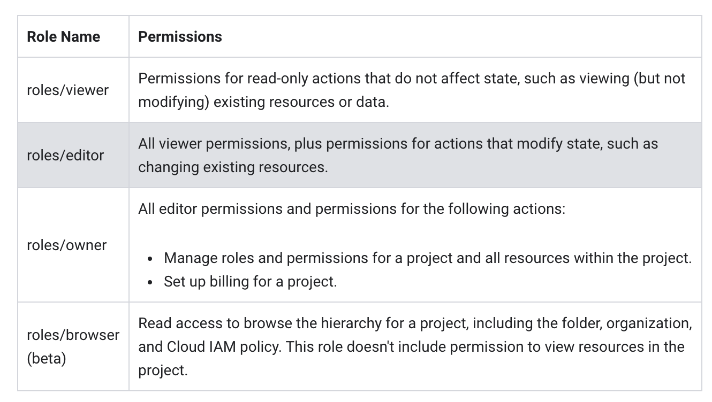
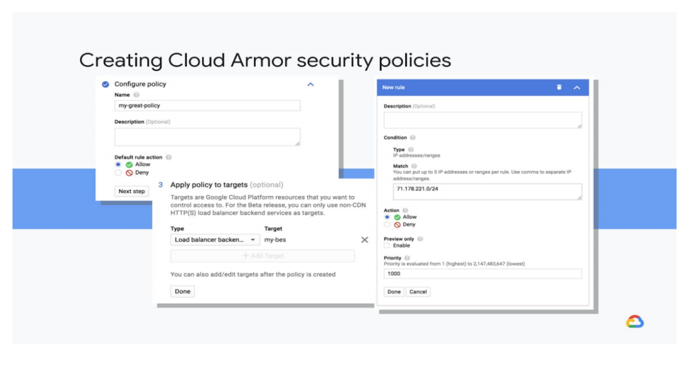

# Application Security Vulnerabilities
Application security is often undefined and untested.

Attackers will attack applications more often than any other target - more often than networks and infrastructure.

The most common app vulnerabilities are:
* Injection:
  * SQL Injection
  * LDAP injection
  * HTML Injection
* Cross-site scripting (XSS)
* Weak authentication and access control
* Secure data exposure
* Security misconfiguration
* Using components with known vulnerabilities


# Identity-Aware Proxy (IAP)
Is a central authentication and authorization layer that can be used for applications over HTTPS. It also replaces end-user VPN tunnels or the need to apply an authentication and authorization layer in from of web apps hosted in GCP.


When a user logs into the application the request is forwarded to the Cloud IAP proxy which requires the user to log in. The proxy will determin if the user is allowed to access the application, if they are, they are then forwarded to the requested app page.

Labs:

[User Authentication with Identity Aware Proxy](https://www.qwiklabs.com/focuses/5562?parent=catalog)

# Cloud Data Loss Prevention (DLP)
With over [120 built-in infoTypes](https://cloud.google.com/dlp/docs/infotypes-reference), Cloud DLP gives you the power to scan, discover, classify, and report on data from virtually anywhere. Cloud DLP has native support for scanning and classifying sensitive data in Cloud Storage, BigQuery, and Datastore and a streaming content API to enable support for additional data sources, custom workloads, and applications.

Cloud DLP using _information types - infoTypes_ to define what it scans. An `infoType` can be any type of sensitive data such as : age, email, credit card number.

A list of _built-in infoTypes_ can be found [here](https://cloud.google.com/dlp/docs/infotypes-reference).

Cloud DLP also allows you to define you own _custom infoType detector_ and will use this type to inspect and de-identify sensitive information that matches the pattern specified by this custom type.

There are three types of custom infoType detectors:

* _Regular custom dictionary detectors_:
  * simple words or phrases that Cloud DLP uses to match on.
  * use this type when you have a few hundred thousand words.
* _Stored custom dictionary detectors_:
  * generate by Cloud DLP from datasets stored in BigQuery or Cloud Storage.
  * Upto ten million words/phrases
* _Regular expressions(regex):
  * enables matching on regex expression pattern

You can also _fine tune_ the scan results using _inspection rules_.

* _Exclusion rules_:
  * excluding false or unwanted findings
* _Hotword rules_:
  * increase the quantity or accuracy of findings returned by adding rules to a buil-in or custom infoType detector.

**Custom infoType Example**

```
POST https://dlp.googleapis.com/v2/projects/[PROJECT_ID]/content:inspect?key={YOUR_API_KEY}

{
  "item":{
    "value":"Patients MRN 444-5-22222"
  },
  "inspectConfig":{
    "customInfoTypes":[
      {
        "infoType":{
          "name":"C_MRN"
        },
        "regex":{
          "pattern":"[1-9]{3}-[1-9]{1}-[1-9]{5}"
        },
        "likelihood":"POSSIBLE"
      }
    ]
  }
}
```

## Authentication
* API Key:
  * Typically used when applications need Cloud DLP via REST API, which can be created via the [GCP Console](https://support.google.com/cloud/answer/6158862)
  * The key is past to the REST API via the `key` parameter:
    * `curl https://dlp.googleapis.com/v2/infoTypes?key=[YOUR_API_KEY]`
* Tokens using Service Accounts:
  * If the user is calling the API directly then `Bearer Token` should be used
    * Bearer Token:
      * Auth: `gcloud auth activate-service-account --key-file [KEY_FILE]`
      * Get Token: `gcloud auth print-access-token`
      * Use Token:
        `curl -s -H 'Content-Type: application/json' -H 'Authorization: Bearer [ACCESS_TOKEN]' 'https://dlp.googleapis.com/v2/infoTypes'`
  * If using the GCloud Client Libraries to call the Cloud DLP Api then `Application Default Credentials` SHOULD be used.
    * `export GOOGLE_APPLICATION_CREDENTIALS=[PATH_TO_KEY_FILE]`

## Content Related Mitigations
Mitigating data misuse, privacy violations, and handling sensitive, restricted, or unacceptable content is accomplished by following a three step process.

1. Classifying content
   * Using Cloud Natural Language API
     * classifies content into categories along with a confidence score
2. Scanning and redacting content
    * Scann all documents using Data Loss Prevention API for sensitive data before publication
    * Redact any sensitive data
3. Detecting unacceptable content
   * Using Video Intelligence API for monitoring and scanning of videos
   * Data Loss Prevention API can be used to detect sensitive data content before it is accidentially exposed to the public

### Redaction
Using the DLP REST api you can redact content based on configurations provided:

**Inspect**:
```
curl -s \
  -H "Authorization: Bearer [ACCESS_TOKEN]" -H "Content-Type: application/json" \
  https://dlp.googleapis.com/v2/projects/$PROJECT_ID/content:inspect \
  -d @[JSON_REQUEST]
```
This method will inspect the request json for any sensitive information based on the `infoTypes` provided in the `inspectConfig`.

Sample Request:
```
{
  "item":{
    "value":"My phone number is (206) 555-0123."
  },
  "inspectConfig":{
    "infoTypes":[
      {
        "name":"PHONE_NUMBER"
      },
      {
        "name":"US_TOLLFREE_PHONE_NUMBER"
      }
    ],
    "minLikelihood":"POSSIBLE",
    "limits":{
      "maxFindingsPerItem":0
    },
    "includeQuote":true
  }
}
```

Sample Response:

The response will return details about any infoTypes found in the text with a `liklyhood` value, which a category of how likely the text matched, and `offset` information, which is the location of the data within the text.

```
{
  "result": {
    "findings": [
      {
        "quote": "(206) 555-0123",
        "infoType": {
          "name": "PHONE_NUMBER"
        },
        "likelihood": "LIKELY",
        "location": {
          "byteRange": {
            "start": "19",
            "end": "33"
          },
          "codepointRange": {
            "start": "19",
            "end": "33"
          }
        },
        "createTime": "2018-07-03T02:20:26.043Z"
      }
    ]
  }
}
```

**DeIdentify**
**_redactConfig_**
This method will redact/remove the data in the request `item` the matches the provided `infoType` value in  the`inspectConfig`.

```
curl -s \
  -H "Authorization: Bearer [ACCESS_TOKEN]" -H "Content-Type: application/json" \
  https://dlp.googleapis.com/v2/projects/$PROJECT_ID/content:deidentify \
  -d @[REQUEST]
```

Sample Request:
```
{
  "item": {
     "value":"My email is test@gmail.com",
   },
   "deidentifyConfig": {
     "infoTypeTransformations":{
          "transformations": [
            {
              "primitiveTransformation": {
                "redactConfig": {

                }
              }
            }
          ]
        }
    },
    "inspectConfig": {
      "infoTypes": {
        "name": "EMAIL_ADDRESS"
      }
    }
}
```
Sample Response:

```
{
  "item": {
    "value": "My email is "
  },
  "overview": {
    "transformedBytes": "14",
    "transformationSummaries": [
      {
        "infoType": {
          "name": "EMAIL_ADDRESS"
        },
        "transformation": {
          "replaceWithInfoTypeConfig": {}
        },
        "results": [
          {
            "count": "1",
            "code": "SUCCESS"
          }
        ],
        "transformedBytes": "14"
      }
    ]
  }
}
```

**_replaceConfig_**
The basic replacement transformation (ReplaceValueConfig in the DLP API) replaces detected sensitive data values with a value that you specify. For example, suppose you've told Cloud DLP to use "[fake@example.com]" to replace all detected EMAIL_ADDRESS infoTypes, and the following string is sent to Cloud DLP

```
POST https://dlp.googleapis.com/v2/projects/[PROJECT_ID]/content:deidentify?key={YOUR_API_KEY}

{
  "item":{
    "value":"My name is Alicia Abernathy, and my email address is aabernathy@example.com."
  },
  "deidentifyConfig":{
    "infoTypeTransformations":{
      "transformations":[
        {
          "infoTypes":[
            {
              "name":"EMAIL_ADDRESS"
            }
          ],
          "primitiveTransformation":{
            "replaceConfig":{
              "newValue":{
                "stringValue":"[email-address]"
              }
            }
          }
        }
      ]
    }
  },
  "inspectConfig":{
    "infoTypes":[
      {
        "name":"EMAIL_ADDRESS"
      }
    ]
  }
}
```

Sample Response:
```
{
  "item":{
    "value":"My name is Alicia Abernathy, and my email address is [email-address]."
  },
  "overview":{
    "transformedBytes":"22",
    "transformationSummaries":[
      {
        "infoType":{
          "name":"EMAIL_ADDRESS"
        },
        "transformation":{
          "replaceConfig":{
            "newValue":{
              "stringValue":"[email-address]"
            }
          }
        },
        "results":[
          {
            "count":"1",
            "code":"SUCCESS"
          }
        ],
        "transformedBytes":"22"
      }
    ]
  }
}
```

**_replaceWithInfoTypeConfig_**
This transformation does the same thing as basic replacement, above, but it replaces the matched data with the value specified detected `infoType` value.

Using `characterMaskConfig` you can partially or completely mask the result of the detective sensitive data by replacing the value with a fixed single character, such as (asterisk)`*` or (hash)`#`.

Sample:

```
POST https://dlp.googleapis.com/v2/projects/[PROJECT_ID]/content:deidentify?key={YOUR_API_KEY}

{
  "item":{
    "value":"My name is Alicia Abernathy, and my email address is aabernathy@example.com."
  },
  "deidentifyConfig":{
    "infoTypeTransformations":{
      "transformations":[
        {
          "infoTypes":[
            {
              "name":"EMAIL_ADDRESS"
            }
          ],
          "primitiveTransformation":{
            "characterMaskConfig":{
              "maskingCharacter":"#",
              "reverseOrder":false,
              "charactersToIgnore":[
                {
                  "charactersToSkip":".@"
                }
              ]
            }
          }
        }
      ]
    }
  },
  "inspectConfig":{
    "infoTypes":[
      {
        "name":"EMAIL_ADDRESS"
      }
    ]
  }
}
```

Sample Response:
```
{
  "item":{
    "value":"My name is Alicia Abernathy, and my email address is ##########@#######.###."
  },
  "overview":{
    "transformedBytes":"22",
    "transformationSummaries":[
      {
        "infoType":{
          "name":"EMAIL_ADDRESS"
        },
        "transformation":{
          "characterMaskConfig":{
            "maskingCharacter":"#",
            "charactersToIgnore":[
              {
                "charactersToSkip":".@"
              }
            ]
          }
        },
        "results":[
          {
            "count":"1",
            "code":"SUCCESS"
          }
        ],
        "transformedBytes":"22"
      }
    ]
  }
}
```

DLP offers other forms of transformations that leverages encryption keys to encrypt any detected sensitive data, they are as follows:

* [Cryptographic Hashing](https://cloud.google.com/dlp/docs/transformations-reference#crypto-hashing)
  * Leverages SHA-256 based message authentication code on the input and replaces it with a hashed Base64 encode value.
  * This process is a one way hash change
* [Format Preserving encryption](https://cloud.google.com/dlp/docs/transformations-reference#fpe)
  * Leverages the [format-preserving encryption](https://en.wikipedia.org/wiki/Format-preserving_encryption) with [FFX mode](http://www.connect-community.org/blog/2016/4/28/ffx-modes-of-the-aes-encryption-algorithm-specified-in-nists-sp-800-38g) enabled to generate a token value and replaces detective sensitive data in the input. The token is same length as in the input value and uses the same alphabet. By leverage the additional `surrogateInfoType` element the token can be _re-Identified_ using the original encryption key.
* [Deterministic encryption](https://cloud.google.com/dlp/docs/transformations-reference#de)
  * Leverages [AES in Synthetic Initialization Vector Mode (AES-SIV)](https://tools.ietf.org/html/rfc5297) to generate a token value and replaces detective sensitive data found in the input. By leverage the additional `surrogateInfoType` element the token can be _re-Identified_ using the original encryption key.
  
Labs:

[Data Loss Prevention - Quick Lab](https://google.qwiklabs.com/focuses/600?catalog_rank=%7B%22rank%22%3A3%2C%22num_filters%22%3A0%2C%22has_search%22%3Atrue%7D&parent=catalog&search_id=6768410)

[Redacting Confidential Data within your pipelines in Cloud Data Fusion using Cloud DLP](https://www.qwiklabs.com/focuses/12373?catalog_rank=%7B%22rank%22%3A1%2C%22num_filters%22%3A0%2C%22has_search%22%3Atrue%7D&parent=catalog&search_id=6763461)

## Storage Scans
Cloud DLP supports scan data stored in Cloud Storage, Datastore and BigQuery.
When scanning data in Cloud Storage it supports scanning: binary, text, image, Word, PDF, and Apache Avro files.

Cloud DLP initiates a job that inspects the data at the give storage location.

Best practices:
* Choose data initially that poses the highest risk
* Cloud DLP MUST be able to access the data, service accounts and vpc service controls!
* Limit scope instead of all data. Use sampling and exclusion rules.
* Avoid using all infoTypes if they are not needed
* Schedule scans regularly. Scans will only inspect data since last scan
  
Findings can be persisted to BigQuery for later analysis.

Sample 

Scanning data in Cloud Storage:
```
POST https://dlp.googleapis.com/v2/projects/[PROJECT-ID]/dlpJobs?key={YOUR_API_KEY}

{
  "inspectJob":{
    "storageConfig":{
      "cloudStorageOptions":{
        "fileSet":{
          "url":"gs://[BUCKET-NAME]/*"
        },
        "bytesLimitPerFile":"1073741824"
      },
      "timespanConfig":{
        "startTime":"2017-11-13T12:34:29.965633345Z",
        "endTime":"2018-01-05T04:45:04.240912125Z"
      }
    },
    "inspectConfig":{
      "infoTypes":[
        {
          "name":"PHONE_NUMBER"
        }
      ],
      "excludeInfoTypes":false,
      "includeQuote":true,
      "minLikelihood":"LIKELY"
    },
    "actions":[
      {
        "saveFindings":{
          "outputConfig":{
            "table":{
              "projectId":"[PROJECT-ID]",
              "datasetId":"[DATASET-ID]"
            }
          }
        }
      }
    ]
  }
}
```

For scanning Datastore use the `datastoreOptions` in the `storageConfig` element.

```
"inspectJob":{
    "storageConfig":{
      "datastoreOptions":{
        "kind":{
          "name":"Example-Kind"
        },
        "partitionId":{
          "namespaceId":"[NAMESPACE-ID]",
          "projectId":"[PROJECT-ID]"
        }
      }
    },
```

For scanning BigQuery use the `bigQueryOptions`:

```
"storageConfig":{
      "bigQueryOptions":{
        "tableReference":{
          "projectId":"[PROJECT-ID]",
          "datasetId":"[BIGQUERY-DATASET-NAME]",
          "tableId":"[BIGQUERY-TABLE-NAME]"
        },
        "identifyingFields":[
          {
            "name":"person.contactinfo"
          }
        ]
      },
```

# Distributed Denial of Service Attacks (DDoS) Mitigation

A Denial of Service (DoS) attack is an attempt to render your service or application unavailable to your end users.

With Distributed Denial of Service (DDoS) attacks, the attackers use multiple resources (often a large number of compromised hosts/instances) to orchestrate large scale attacks against targets. 

Mitigation Best Practices:
* **Reduce the attack surface for GCE Deployment**:
  * Provision with in isolated VPCs leveraging the best practices [here](https://cloud.google.com/docs/enterprise/best-practices-for-enterprise-organizations#define-your-network)
  * Isolate and secure deployment using vpcs, subnets, firewall rule tag, IAMs
  * Open access to only the ports and protocols you need and disable those that you dont using firewall rules and/or [protocol forwarding](https://cloud.google.com/compute/docs/protocol-forwarding/)
* **Isolate you internal traffice from the external world**
  * Deploy instances without public IPs unless necessary
  * set a NAT gateway or SSH Bastion host to limit the number of instances that are exposed to the internet
  * Deploy internal Load Balancers for internal clietn instances accessing internally deployed services
* **DDoS Proectection By Enabling Proxy-based Load Balancing**
  * SSL Proxy Or HTTP(s) Load Balancing mitigates and absorbs many Layer 4 and below attacks, such as SYN floods, IP fragment floods, ports exhaustion, etc
* **Scale to absorbe the attack**
  * With Google Cloud Global Load Balancing, the frontend infrastructure which terminates user traffic, automatically scales to absorb certain types of attacks (e.g., SYN floods) before they reach your compute instances.
  * _Anycast-based Load Balancing_:
    * HTTP(S) and SSL Proxy enable a single anycast IP to front-end you deployed instances in all regions to increase the surface area to absorb any attacks.
    * _Autoscaling_:
      * Provision sufficient number of instances and/or configure autoscaling to handle traffic spikes.
* **Protection with CDN Offloading**:
  * Google Cloud CDN acts as a proxy between your clients and your origin servers. For cacheable content, Cloud CDN caches and services this content from points-of-presence (POPs) closer to your users as opposed to sending them to backend servers (instances). In the event of DDoS attack for cacheable content, the requests are sent to POPs all over the globe as opposed to your origin servers, thereby providing a larger set of locations to absorb the attack.
  * If CDN interconnect is used, you can leverage additional DDoS protection provided by GCPs CDN Interconnect partners.
* **Deploy third-party DDoS protection solutions**:
  * DDoS protection solutions are offered by GCP partners such as CloudFlare, F5 Networks, Fortinet, etc.
  * DDoS protection solutions are available via the [Google Cloud Marketplace](http://console.cloud.google.com/marketplace/browse?q=DDoS)
  * GCP Cloud Armour offers DDoS Protection
* **App Engine Deployment**:
  * Designed to be a multi-tenant system and has safeguards to ensure a bad app will not impact performance or availability of other applications on the platform
  * Sits behind Google Front-Ends which mitigate and absorbes DDoS attacks
  * Use a [dos.yaml](https://cloud.google.com/appengine/docs/standard/python/config/dos) to block unwanted IPs/IP networks from access the app.
* **Google Cloud Storage**:
  * Used signed URLs
* Use Identity Aware Proxy (IAP)
* Use API Management (Cloud Endpoints, Apigee):
  * Request Limits
  * Control API Access
  * Monitor API Usage


# Security Partner Products
GCP offers best in class platfrom security they also have a fast partner ecosystem that provide security-centric products.

See the list [here](https://cloud.google.com/security/partners#tab1) for more details.

# Cloud Armour
Google Cloud Armor delivers defense at scale against infrastructure and application distributed denial of service (DDoS) attacks by using Google's global infrastructure and security systems.

Google Cloud Armor security policies are made up of rules that filter traffic based on layer 3, 4, and 7 attributes. For example, you can specify conditions that match on an incoming request's IP address, IP range, region code, or request headers. Security policies are available only for backend services behind an externall HTTP(s) Load Balancer, which can be in Premium or Standard Tier.

DDoS protection is automatically provided for HTTP(s), SSL Proxy and TCP Proxy Load Balancing.

Requirements for Cloud Armour Usage:
* Load Balancer **MUST** be an external HTTP(S) Load Balancer
* The backend service's load balancing scheme **MUST** be `EXTERNAL`.
* The backend service's protocol **MUST** be on of `HTTP`,`HTTPS` or `HTTP/2`

**IAM Permissions**:


## WAF / Security Policies



The default rule is automatically assigned a priority of 2147483647 (INT-MAX) and it is always present in the Google Cloud Armor security policy. This rule CANNOT be deleted.

Creating a Cloud Armour security Policy:

```
gcloud compute security-policies create [POLICY_NAME] --description [DESCRITPION]"
```

Update default rules to deny traffic:

```
gcloud compute security-policies rules update 2147483647 \
    --security-policy [POLICY_NAME] \
    --action "deny-404"|"deny-403"|"deny-502"
```

Add rules for specifiy valid IPv4/v6 CIDR IP ranges:

```
gcloud compute security-policies rules create 1000 \
    --security-policy [POLICY_NAME] \
    --description "allow traffic from 192.0.2.0/24" \
    --src-ip-ranges "192.0.2.0/24" \
    --action "allow"
```

Create a policy leveraging the advanced expression:


```
gcloud compute security-policies rules create 1000 \
   --security-policy my-policy \
   --expression "inIpRange(origin.ip, '1.2.3.4/32') && has(request.headers['user-agent']) && request.headers['user-agent'].contains('Godzilla')" \
   --action allow \
   --description "Block User-Agent 'Godzilla'"
```
```
gcloud compute security-policies rules create 1000 \
   --security-policy my-policy \
   --expression "origin.region_code == 'AU'" \
   --action "deny-403" \
   --description "AU block"
```

**Pre-Configured Rules**
You can also use the preconfigured rules that exist:

To view the pre-configured rules list :

`gcloud compute security-policies list-preconfigured-expression-sets`

Result:
```
    EXPRESSION_SET
sqli-canary
    RULE_ID
    owasp-crs-v030001-id942110-sqli
    owasp-crs-v030001-id942120-sqli
    …
xss-canary
    RULE_ID
    owasp-crs-v030001-id941110-xss
    owasp-crs-v030001-id941120-xss
…
sourceiplist-fastly
sourceiplist-cloudflare
sourceiplist-imperva
```

The output will display the list of rules that can be found [here](https://cloud.google.com/armor/docs/rule-tuning#preconfigured_rules).

**Tuning WAF Rules**

Each preconfigured rule consists of multiple signatures. Incoming requests are evaluated against the preconfigured rules. A request matches a preconfigured rule if the request matches any of the signatures that are associated with the preconfigured rule. A match is made when the `evaluatePreconfiguredExpr()` command returns the value `true`.

If you decide that a preconfigured rule matches more traffic than is necessary or if the rule is blocking traffic that needs to be allowed, the rule can be tuned to disable noisy or otherwise unnecessary signatures. To disable signatures in a particular preconfigured rule, you provide a list of IDs of the unwanted signatures to the `evaluatePreconfiguredExpr()` command. The following example excludes two CRS rule IDs from the preconfigured `xss-stable` WAF rule:

```
evaluatePreconfiguredExpr('xss-stable', ['owasp-crs-v020901-id981136-xss', 'owasp-crs-v020901-id981138-xss'])
```

The following command adds a rule that uses a pre-configured expression set to mitigate SQLi attacks:
```
gcloud compute security-policies rules create 1000 \
   --security-policy my-policy \
   --expression "evaluatePreconfiguredExpr('sqli-stable')" \
   --action "deny-403"
```


Attach the policy to backend services
```
gcloud compute backend-services update [BACKEND_SERVICE_NAME] --security-policy [POLICY_NAME]
```

Two kinds of match conditions:
* basic contains list of ips or ip ranges
* advanced contains expressions written using an extension of the [Common Expression Language (CEL)](https://github.com/google/cel-spec)

### Labs

[HTTP Loadbalancer with Cloud Armour](https://www.qwiklabs.com/focuses/1232?parent=catalog)

**Using Cloud Armour with Serverless apps**

Cloud Armour can be by-passed IF the user has the default URL for the Cloud Function. To mitigate this risk, us the `internal-and-gclb` when you configure Cloud Functions, which will allows only internal traffic and traffic sent to a public IP address exposed by the external HTTP(s) LB. Traffic sent to `cloudfunctions.net` or any custom domain setup through Cloud Functions is blocked.

## Monitoring
Cloud Armour logs are exported to Cloud Monitoring, which can be used to monitor and check whether policies are working as intended.

# Web Security Scanner (Formerly Cloud Security Scanner)
Web Security Scanner identifies security vulnerabilities in your App Engine, Google Kubernetes Engine (GKE), and Compute Engine web applications. It crawls your application, following all links within the scope of your starting URLs, and attempts to exercise as many user inputs and event handlers as possible. Currently, Web Security Scanner only supports public URLs and IPs that aren't behind a firewall.

It can automatically scan and detect five common vulnerabilities, including cross-site scripting, Flash injection, mixed content (HTTP in HTTPS), clear text passwords (invalid content-type or without `X-Content-Type-Options: nosniff`) and any outdated/insecure libraries.

The Scanner does the following:

* Navigates every link it finds (except those excluded)
* Activates every control and input
* Logs in with specified credentials
* User-agent and maximum QPS can be configured
* Scanner is optimized to avoid false positives

Scheduling the Scanner:
* Scans can be scheduled or manually initiated
* Scans can be configured to run on a preset schedule
* Scan duration scales with size and complexity of application; large apps can take hours to complete

Finding from security scans can be found [here](https://cloud.google.com/security-command-center/docs/concepts-web-security-scanner-overview#scan_findings).

Security Scanner generates real load against your application and can also generate state data in the application.

In order to avoid unwanted impacts :

* Run scans in a test environment
* Use test accounts
* Block specific UI elements
* Block specific URLs
* Use Backup Data

Labs:

[Getting Started with Cloud Security Scanner](https://google.qwiklabs.com/focuses/1715?catalog_rank=%7B%22rank%22%3A3%2C%22num_filters%22%3A0%2C%22has_search%22%3Atrue%7D&parent=catalog&search_id=6762807)

# Cloud Security Command Center
Security Command Center is the canonical security and risk database for Google Cloud. Security Command Center is an intuitive, intelligent risk dashboard and analytics system for surfacing, understanding, and remediating Google Cloud security and data risks across an organization. This is the Security Information and Event Management (SIEM) solution in GCP.

## Tiers
* Standard Features
  * [Security Health Analytics](https://cloud.google.com/security-command-center/docs/concepts-security-health-analytics-overview)
    * Managed vulnerability assessment scanning for Google Cloud that can automatically detect the highest severity vulnerabilities and misconfigurations for GCP assets.
      * Buckets, SQL instances, VMs etc
      * Misconfigured firewalls, open or overly permissive Firewalls
      * Insecure IAM Configurations

* Premium Features
  * Includes Standar Tier features
    * with additional monitoring and reporting for 
      * CIS 1.0
      * PCI DSS v3.2.1
      * NIST 800-53
      * ISO 27001
  * [Event Threat Detection](https://cloud.google.com/security-command-center/docs/concepts-event-threat-detection-overview))
    * Uses log data to discover the following:
      * Brute force SSH
      * Cryptomining
      * IAM abuse
      * Malware
      * Phising
    * If an event is found a `Finding` is written to Security Command Center and to a Cloud Log Project.
  * [Container Threat Detection](https://cloud.google.com/security-command-center/docs/concepts-container-threat-detection-overview)
    * Detects the following common runtime attacks:
      * Suspicious binary
      * Suspicious Library
      * Reverse Shell
  * [Web Security Scanner](https://cloud.google.com/security-command-center/docs/concepts-web-security-scanner-overview)
  * [Anomaly Detection](https://cloud.google.com/security-command-center/docs/concepts-security-sources#anomaly_detection)
    * Potential findings:
      * Leaked Service Account Creds
      * Potential Compromised Machine
      * Resource(s) used for cryptomining
      * Resource(s) used for outbound intrusion
      * Resource(s) used for phishing

# Forseti
Forseti gives you tools to understand all the resources you have in Google Cloud Platform (GCP). The core Forseti modules work together to provide complete information so you can take action to secure resources and minimize security risks.

* Inventory: 
  * regularly collects data from your GCP resources and makes it available, via Cloud SQL, to other modules. 
  * can be configured to run as often as you want
  * send email notifications when resource snapshots have been updated
* Scanner:
  * periodically compares the rules of GCP resource policies against the policies collected by Inventory, and saves the output for your review.
* Explain:
  *  helps you understand, test, and develop Cloud Identity and Access Management (Cloud IAM) policies.
* Enforcer :
  * uses policies you create to compare the current state of your Compute Engine firewall to the desired state.
  * an on-demand command-line tool that compares policies in batch mode over all managed projects or against selected projects.
  * if differences are found, it uses Google Cloud APIs to change resource policy state to match the state you define.
* Notifier :
  * keeps you up to date about Forseti findings and actions by send email notifications.

By default, Forseti is designed to be installed with complete organization access, and run with the organization as the root node in the resource hierarchy.

But, you also have the option to run Forseti on a subset of resources:

1. if you are Org Admin, and you want to run Forseti on a specific folder
2. if you are Folder Admin, and you want to run Forseti on a specific folder
3. if you are Project Admin, and you want to run Forseti on projects that are only owned by you.
   
NOTE: Inventory, Data Model, and Scanner will be supported for use on these subset of resources, but Explain will not be supported.

The following Google APIS MUST be enabled in order to use Forseti:

* cloudresourcemanager.googleapis.com
* serviceusage.googleapis.com
* compute.googleapis.com
* cloudasset.googleapis.com
  
```
gcloud services enable \
    cloudresourcemanager.googleapis.com \
    serviceusage.googleapis.com \
    compute.googleapis.com \
    cloudasset.googleapis.com \
    --project "${PROJECT_ID}"
```

### Deploying Foseti
Foreseti can be deployed into either Google Compute Engine or a Google Kubernetes Engine Cluster.

The easiest way to deploying it is through the terraform scripts provided by Foresti Security.

Service Account and required APIs can be set up by leveraging the provided script on the [Foreseti Terrafrom Github Repository](https://github.com/forseti-security/terraform-google-forseti/blob/master/helpers/setup.sh).

```
git clone --branch modulerelease522 --depth 1 https://github.com/forseti-security/terraform-google-forseti.git
```

```
cd terraform-google-forseti
```
```
. ./helpers/setup.sh -p PROJECT_ID -o ORG_ID
```

The above script will create a service account call `cloud-foundation-forseti-<suffix>`, assign it the required roles/permissions and download the service account credentials to `${PWD}/crendentials.json`.

NOTE: you could also lever the `-f HOST_PROJECT_ID` flag to provision Foreseti into a `Shared VPC Hoste Project`

Sample `maint.tf`

```
module "forseti" {
  source  = "terraform-google-modules/forseti/google"
  version = "~> 5.2.0"

  gsuite_admin_email       = "superadmin@yourdomain.com"
  domain                   = "yourdomain.com"
  project_id               = "my-forseti-project"
  org_id                   = "2313934234"
  
  config_validator_enabled = "true"
}
```

### Configurations
Forseti configurations are global and module-specific settings. Configurations are centrally maintained in the `forseti-security/configs/server/forseti_server_conf.yaml` file that’s organized into module-specific sections. A sample can be found [here](https://github.com/forseti-security/forseti-security/blob/master/configs/server/forseti_conf_server.yaml.sample).

In GCP this configuration file lives in a pre-configured Forseti Cloud Storage Bucket. It is picked up every time Forseti runs (via cronjob).

### Configure to send data to Security Command Center (Cloud SCC)

Forseti can be configured to send violations events to Cloud SCC.

Use the following steps:

1. Select `Add Security Source` on the Cloud SCC Dashboard
2. Find and select the `Forseti Cloud SCC Connector` in Cloud Marketplace.
3. Follow the step-by-step on-boarding flow triggered from the Forseti card.
   1. Choose the project that is hosting Forseti
   2. Use exists Forseti SA
4. Enable the Cloud SCC API in the Forseti Project either via UI or CLI
   1. `gcloud services enable securitycenter.googleapis.com`


