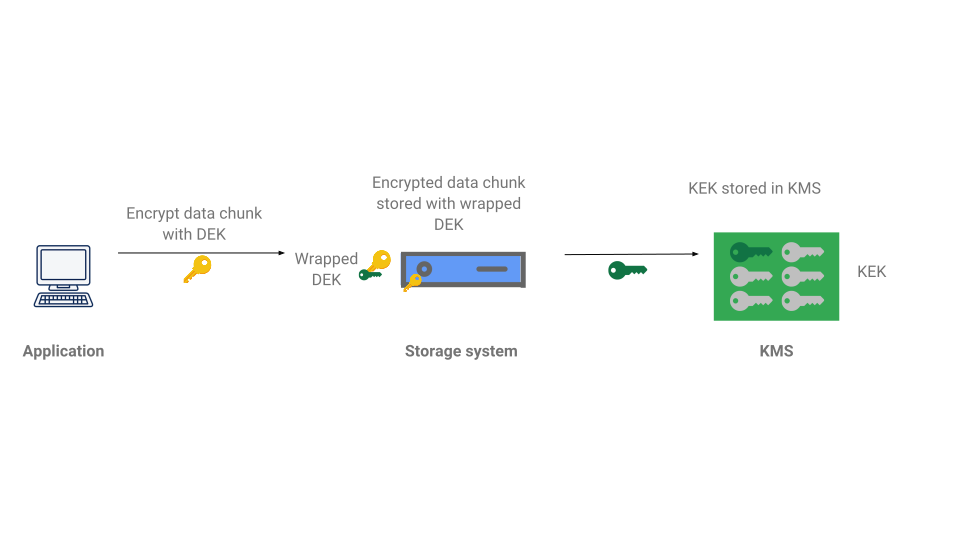

# Encryption on GCP
## Overview
Google Cloud Platform encrypts customer data stored at rest by default, with no additional action required from you. Data in Google Cloud Platform is broken into subfile chunks for storage, and each chunk is encrypted at the storage level with an individual encryption key. Google uses a common encryption library, [Keyczar](https://github.com/google/keyczar), to implement encryption across almost all GCP Platform products.

## Envelope Encryption
By default, at the storage layer, Google uses _Envelope Encryption_, with its internal kms service as a central keystore.



To encrypt data using envelope encryption:

* Generate a DEK locally. 
  * You could do this with an open source library such as OpenSSL, specifying a cipher type and a password from which to generate the key. You can also specify a salt and digest to use, if desired.

* Use this DEK locally to encrypt your data.
  * As an example, you could use OpenSSL as shown in the encrypting the message example. For best practice, use 256-bit Advanced Encryption Standard (AES-256) cipher in Galois Counter Mode (GCM).

* Generate a new key in Cloud KMS, or use an existing key, which will act as the KEK. Use this key to encrypt (wrap) the DEK.

* Store the encrypted data and the wrapped DEK.
  
## Encryption at Rest
By default GCP encrypts all customers data stored at rest using the Advanced Encryption Standard (AES) algorithm using a unique data encryption key (DEK).

DEKs are encrypted with ("wrapped" by) key encryption keys (KEKs) and stored with the data.


By default, KEKs are stored using Cloud KMS and are fully managed by Google. Decrypting the data requires the unwrapped data encryption key (DEK) for the data chunk.


All data stored at the storage level is encrypted with AES256 by default.

Decrypting data requires the unwrapped data encryption key
(DEK) for the data chunk.


KEK rotation varies by service, the standard rotation period is 90 days.

RE-encryption of data is required at least once every 5 years. Best practice is more frequent re-encryption.

Google persists/stores up to 20 verisons of encrypted data.

### Layers of Encryption
Google uses several layers of encryption to protect customers data. 


For more details on GCP Encryption at Rest see the [whitepaper](https://cloud.google.com/security/encryption-at-rest/default-encryption#granularity_of_encryption_in_each_google_cloud_platform_product).

## Encryption in Transit
This type of encryption protects your data if communications are intercepted while data moves between your site and the cloud provider or between two services. This protection is achieved by encrypting the data before transmission; authenticating the endpoints; and decrypting and verifying the data on arrival. For example, Transport Layer Security (TLS) is often used to encrypt data in transit for transport security, and Secure/Multipurpose Internet Mail Extensions (S/MIME) is used often for email message security.

Google Cloud services accept requests from around the world using a globally distributed system called the Google Front End (GFE). GFE terminates traffic for incoming HTTP(S), TCP and TLS proxy traffic, provides DDoS attack countermeasures, and routes and load balances traffic to the Google Cloud services themselves.

GFEs proxy traffic to Google Cloud services. GFEs route the user's request over our network backbone to a Google Cloud service. This connection is authenticated and encrypted from GFE to the front-end of the Google Cloud service or customer application, when those communications leave a physical boundary controlled by Google or on behalf of Google.

TLS in the GFE is implemented with BoringSSL, which is a Google-maintained open-source implementation of TLS protocoal, that is mostly interface-compatible with OpenSSL. Table 1 shows the encryption protocols that GFE supports when communicating with clients.

|Protocol| Authentication | Key exchange | Encryption | Hash Functions|
|-------|---------------|-----------|--------|-----------|
|TLS 1.3 | RSA 2048 | Curve25519 | AES-128-GCM| SHA384 |
|TLS 1.2 | ECDSPA P-256 | P-256 (NIST secp256r1) |AES-256-GCM | SHA256 |
|TLS 1.1 | | | AES-128-CBC |SHA1|
|TLS 1.0 | | | AES-256-CBC | MD5 |
|QUIC | | | ChaCha20-Poly1305 | |
| | | |3DES | |

For more details on how Encryption In Transit works at Google see the following [whitepaper](https://cloud.google.com/security/encryption-in-transit).

## Cloud Storage Encyption
Cloud Storage always encrypts the customers data on the server before it is writtent to disk. Cloud storage manages server-side encryption keys on the clients behalf. It leverages AES-256 encyption by default.

Alternatively the client has the option of using there own encryption keys for encrypting there data in Cloud Storage.

These are the following options:

* _Server Side Encryption_:
  * **Customer-supplied encryption keys (CSEK)**:
    * client can create and manage their own encryption keys for server-side encryption, which act as and additional encryption layer on top of the standard Cloud Storag Encryption.
    * these keys ARE NOT stored on Googles servers nor do they manage the keys
    * Examples for creating and using CSEK's : https://cloud.google.com/storage/docs/encryption/using-customer-supplied-keys
    * **Currently Cloud Storage Transfer Service, Cloud Dataflow and Cloud Dataproc DO NOT support objects encrypted with CSEKs.**
    * You cannot use CSEKs on a storage bucket, only on individual objects.
    * More details on CSEKs: https://cloud.google.com/storage/docs/encryption/customer-supplied-keys
  * **Customer-managed encryption keys (CMEK)**:
    * client can generate and manage the keys using Cloud Key Management Service (KMS).
    * encryption and decryption is done using service accounts with IAM permissions:
      * `roles/cloudkms.cryptoEncrypter`
        * encrypting only
      * `roles/cloudkms.cryptoEncrypterDecrypter`
        * encrypt and decrypt
      * `roles/cloudkms.publickeyviewer`
        * verify data only
      * `roles/cloudkms.signerVerifier`
        * sign and verify data
      * `roles/cloudkms.admin`
        * manage a key
    * For a full list of Cloud KMS Permission see here [https://cloud.google.com/kms/docs/reference/permissions-and-roles].
* _Client-side encyption_:
  * encyption occurs before data is sent to cloud storage. Once data is landed in on the server it is also encrypted server side.

**NOTE: If CSEK or client-side encryption is use there is a caveat where if the keys are lost the data will no longer be readable.**

## Cloud KMS
Cloud Key Management Service allows you to create, import, and manage cryptographic keys and perform cryptographic operations in a single centralized cloud service. You can use these keys and perform these operations by using Cloud KMS directly, by using Cloud HSM or Cloud External Key Manager, or by using Customer-Managed Encryption Keys (CMEK) integrations within other Google Cloud services.

**NOTE: CruptoKeys and KeyRings cannot be deleted in CLoud KMS!**

### Command Line snippets

To enable Cloud KMS:
```
gcloud services enable cloudkms.googleapis.com
```
Create a keyring and cryptokey:
```
gcloud kms keyrings create $KEYRING_NAME --location global
```

```
gcloud kms keys create $CRYPTOKEY_NAME --location global \
      --keyring $KEYRING_NAME \
      --purpose encryption
```

Using the encryption endpoint you can send the base64-encoded text you want to encrypt to the specified key:

```
curl -v "https://cloudkms.googleapis.com/v1/projects/$DEVSHELL_PROJECT_ID/locations/global/keyRings/$KEYRING_NAME/cryptoKeys/$CRYPTOKEY_NAME:encrypt" \
  -d "{\"plaintext\":\"$PLAINTEXT\"}" \
  -H "Authorization:Bearer $(gcloud auth application-default print-access-token)"\
  -H "Content-Type: application/json"
```

To save the encrypted data to a file use the following curl:

```
curl -v "https://cloudkms.googleapis.com/v1/projects/$DEVSHELL_PROJECT_ID/locations/global/keyRings/$KEYRING_NAME/cryptoKeys/$CRYPTOKEY_NAME:encrypt" \
  -d "{\"plaintext\":\"$PLAINTEXT\"}" \
  -H "Authorization:Bearer $(gcloud auth application-default print-access-token)"\
  -H "Content-Type:application/json" \
| jq .ciphertext -r > 1.encrypted
```

The command line tool [jq](https://stedolan.github.io/jq/) will parse out the `ciphertext` property form the response and save to a file.

To verify the data you can call the `decrypt` endpoint:

```
curl -v "https://cloudkms.googleapis.com/v1/projects/$DEVSHELL_PROJECT_ID/locations/global/keyRings/$KEYRING_NAME/cryptoKeys/$CRYPTOKEY_NAME:decrypt" \
  -d "{\"ciphertext\":\"$(cat 1.encrypted)\"}" \
  -H "Authorization:Bearer $(gcloud auth application-default print-access-token)"\
  -H "Content-Type:application/json" \
| jq .plaintext -r | base64 -d
```
Granting permissions to the keyring:

```
gcloud kms keyrings add-iam-policy-binding [KEYRING_NAME] \
    --location [LOCATION] \
    --member user:[USER_EMAIL] \
    --role [CLOUD_KMS_ROLE]
```
For the user managing Cloud KMS, that is, a member of an organization's IT security team: The two roles with the minimum permissions required to manage Cloud KMS via the Cloud Console are the predefined Project Editor (editor) role, or a custom role based on the Cloud KMS Admin `cloudkms.admin` role combined with the following permissions:
* `serviceusage.quotas.get`
* `serviceusage.services.get`
* `resourcemanager.projects.get`

You can grant or restrict the ability to perform specific cryptographic operations, such as rotating a key or encrypting data. You can grant IAM roles on:

* A key directly
* A key ring, inherited by all keys in that key ring
* A Google Cloud project, inherited by all keys in the project
* A Google Cloud folder, inherited by all keys in all projects in the folder
* A Google Cloud organization, inherited by all keys in folders in the organization

# Labs
[Getting Started With Cloud KMS](https://www.qwiklabs.com/focuses/1713?catalog_rank=%7B%22rank%22%3A1%2C%22num_filters%22%3A0%2C%22has_search%22%3Atrue%7D&parent=catalog&search_id=6747257)

[Encrypting a disk with Customer-Supplied Encryption Keys](https://docs.google.com/document/d/1xJRrSmC2EtSif6xaL0QaBxQ5CU9uR1DK1OMzr5xZ6Dg/edit#)

[Using Customer-Managed Encryption Keys with Cloud Storage and Cloud KMS](https://docs.google.com/document/d/1KvP7GjtqYVUKGgUs0QzO1jhf2MBlQ3GiA9_8NYSVMOs/edit#heading=h.t0mbi9us7mcl)

[Using Customer-Supplied Encryption Keys with Cloud Storage](https://docs.google.com/document/d/14AV9IgJXW_HYuii6JUUU0Ob0VN3hNMfzpQsfiz9K5Is/edit)


