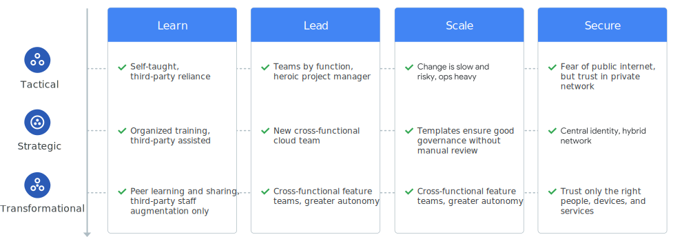

# Managing GCP Migrations
There are three types of migrations:
* Lift and shift
  * moving worksloads from source to target
  * minimal modifications in order for the workloads to operate in the target environment.
  * Ex: legacy or cots applications running on VMs can be migrated to run on Compute Engine VMs
* Improve and move
  * Modernize the workload while migrating it
  * Some refactoring will occur to take advantage of cloud native offerings
* Rip and Replace
  * Decommission legacy app and redesign and rewrite the entire application to you in a cloud-native fashion

Before a migration begins, you should leverage the [Google Cloud Adoption Framework](https://cloud.google.com/adoption-framework) to determine you cloud migration roadmap.

## Migration Path
There are four phases of the migration path.

1. Asssess
   * assessing current environment
   * take inventory of applications and their dependencies that exists
   * perform TCO calculations
   * establish benchmark app performance
2. Plan
   * create basic cloud infrastructure for you workloads to live in and plan how you will move apps
   * includes IAM, organization hierarchy, networking, prioritize migration strategy
3. Deploy
   * design and implement any changes necessary
   * execute deployment process to move the workload to gcp
   * refining the infrastructure as needed
4. Optimize
   * take full advantage of cloud-native technologies and capabilities to expand your business's potential to things such as performance, scalability, disaster recovery, costs, training, as well as opening the doors to machine learning and artificial intelligence integrations for your app.

# Disaster Recovery
Define  the following :

* _Recovery Time Objective_ (RTO)
  * max length of time you app can be offline
* _Recovery Point Objective_ (RPO)
  * max acceptable length of time during which data may be lost

The small the RTO and RPO values are the more complex you DR strategy becomes. For smaller RTO and RPO values you can achieve these only by configuring an HA pattern across your production enviroment. In the hybrid world, you would be DRing into GCP.

DR environment should mimic your production environment with similar infrastructure and security controls. 

Use of Infrastructure-As-Code is key for being able to replicate easily and quickly. 

Regularly test your DR plan:
* Automate infrastructure provisioning
* Monitor and debug tests with Cloud Logging and Cloud Monitoring
* Perform pen testing as if its production

# Backup and Recovery

Use Cloud Storage to store backups and plan daily routine backups.