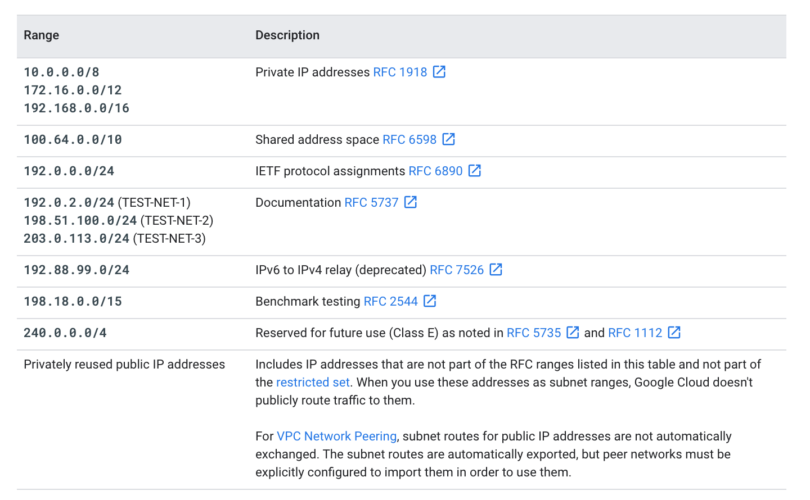
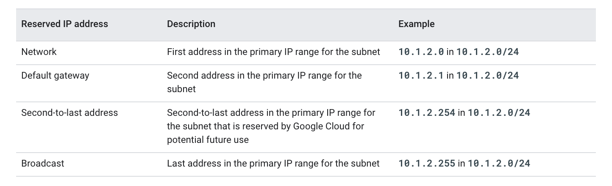
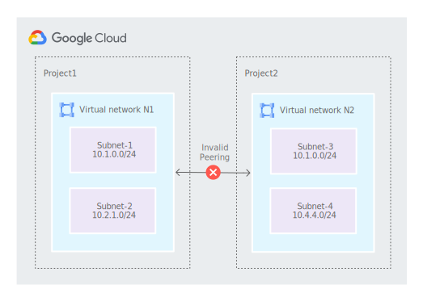
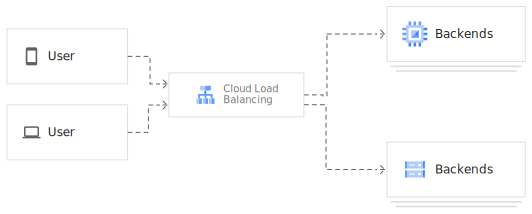
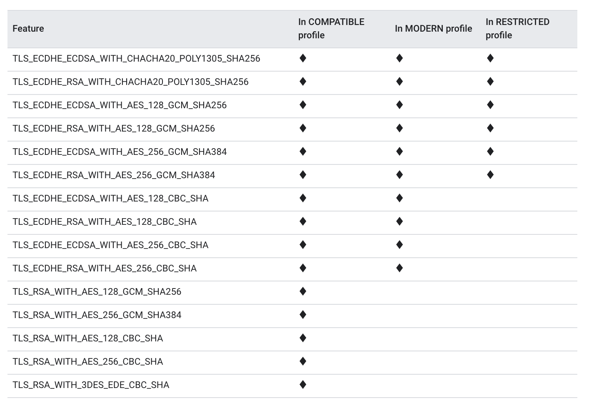
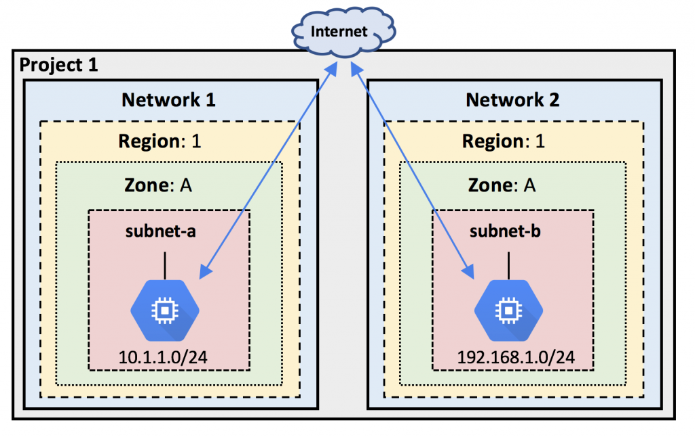
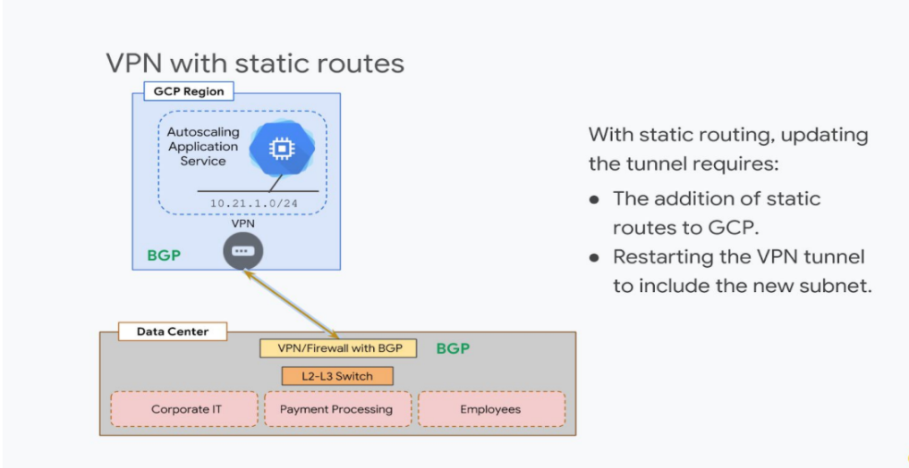
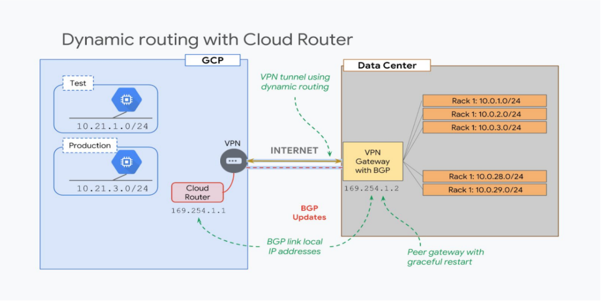
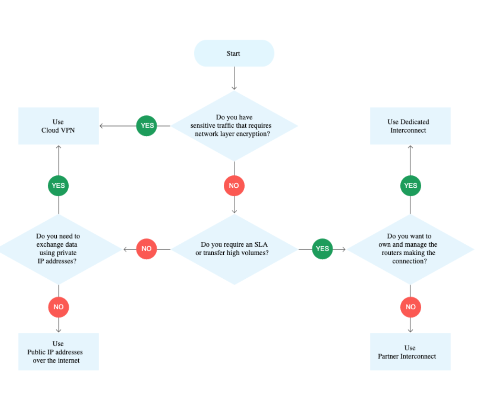
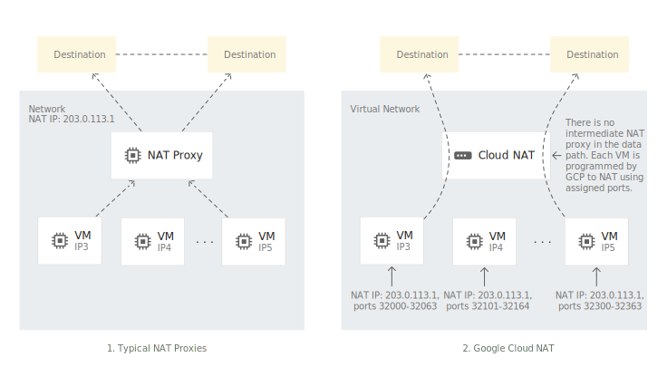

# Network Security
## VPCs
Best practices for secure VPC designs can be found [here](https://cloud.google.com/solutions/best-practices-vpc-design).

A Virtual Private Cloud (VPC) network is a virtual version of a physical network, implemented inside of Google's production network, using [Andromeda](https://www.usenix.org/system/files/conference/nsdi18/nsdi18-dalton.pdf). A VPC network provides the following:

* Provides connectivity for your Compute Engine virtual machine (VM) instances, including Google Kubernetes Engine (GKE) clusters, App Engine flexible environment instances, and other Google Cloud products built on Compute Engine VMs.
* Offers native Internal TCP/UDP Load Balancing and proxy systems for Internal HTTP(S) Load Balancing.
* Connects to on-premises networks using Cloud VPN tunnels and Cloud Interconnect attachments.
* Distributes traffic from Google Cloud external load balancers to backends.

VPC networks have the following properties:
* VPC networks, including their associated routes and firewall rules, are global resources. They are not associated with any particular region or zone.
* Subnets are regional resources. Each subnet defines a range of IP addresses.
* Traffic to and from instances can be controlled with network firewall rules.
* Resources within a VPC network can communicate with one another by using internal (private) IPv4 addresses, subject to applicable network firewall rules. [See Network Communication](https://cloud.google.com/vpc/docs/vpc#intra_vpc_reqs) 
* Instances with internal IP addresses can communicate with Google APIs and services. [See Private Access](https://cloud.google.com/vpc/docs/private-access-options)
* Network administration can be secured by using Cloud Identity and Access Management (Cloud IAM) roles.
* An organization can use Shared VPC to keep a VPC network in a common host project. Authorized Cloud IAM members from other projects in the same organization can create resources that use subnets of the Shared VPC network.
* VPC networks can be connected to other VPC networks in different projects or organizations by using VPC Network Peering.
* VPC networks can be securely connected in hybrid environments by using Cloud VPN or Cloud Interconnect.
* VPC networks only support IPv4 unicast traffic. They do not support broadcast, multicast, or IPv6 traffic within the network; VMs in the VPC network can only send to IPv4 destinations and only receive traffic from IPv4 sources. However, it is possible to create an IPv6 address for a global load balancer.

Each VPC network consists of one or more useful IP range partitions called _subnets_. Each subnet is associated with a region. VPC networks do not have any IP address ranges associated with them. IP ranges are defined for the subnets.

A network must have at least one subnet before you can use it. Auto mode VPC networks create subnets in each region automatically. Custom mode VPC networks start with no subnets, giving you full control over subnet creation. You can create more than one subnet per region.

Types of networks:
* **_auto mode_**:
  * one subnet from each region is automatically created within it. These automatically created subnets use a set of predefined IP ranges that fit within the 10.128.0.0/9 CIDR block. As new Google Cloud regions become available, new subnets in those regions are automatically added to auto mode VPC networks by using an IP range from that block.In addition to the automatically created subnets, you can add more subnets manually to auto mode VPC networks in regions that you choose by using IP ranges outside of 10.128.0.0/9.
* **_custom mode_**:
  * no subnets are automatically created. This type of network provides you with complete control over its subnets and IP ranges. You decide which subnets to create in regions that you choose by using IP ranges that you specify.

You can switch from auto mode to custom mode but this is a one-way conversion.

Considerations for choosing _auto mode_ over _custom mode_:

* auto mode:
  * easy to set up and use
  * Having subnets automatically created in each region is useful.
  * The predefined IP ranges of the subnets do not overlap with IP ranges that you would use for different purposes (for example, Cloud VPN connections to on-premises resources).

* custom mode:
  * more flexible and bettwe suited for production use cases
  * Having one subnet automatically created in each region isn't necessary.
  * Having new subnets automatically created as new regions become available could overlap with IP addresses used by manually created subnets or static routes, or could interfere with your overall network planning.
  * You need complete control over the subnets created in your VPC network, including regions and IP address ranges used.
  * You plan to connect VPC networks by using VPC Network Peering or Cloud VPN. Because the subnets of every auto mode VPC network use the same predefined range of IP addresses, you cannot connect auto mode VPC networks to one another.

**Default network**
Unless you choose to disable it, each new project starts with a default network. The default network is an auto mode VPC network with pre-populated firewall rules.

You can disable the creation of default networks by creating an organization policy with the `compute.skipDefaultNetworkCreation` constraint. Projects that inherit this policy won't have a default network.

### Subnets
When you create a subnet, you must define its primary IP address range. The primary internal addresses for the following resources come from the subnet's primary range: VM instances, internal load balancers, and internal protocol forwarding. You can optionally add secondary IP address ranges to a subnet, which are only used by alias IP ranges. However, you can configure alias IP ranges for instances from the primary or secondary range of a subnet.

The following table shows valid CIDR block ranges for IPs


Every subnet has four reserved IP addresses in its primary IP range. There are no reserved IP addresses in the secondary IP ranges.


**Code Snippets**
To Create a vpc you can leverage the following GCloud CLI command:
```
gcloud compute networks create NETWORK_NAME
    --subnet-mode=auto|custom
    --bgp-routing-mode=global|regional
```

To add a _subnet_ to an existing VPC use the following command:
```
gcloud compute networks subnets create SUBNET_NAME \
    --network=NETWORK \
    --range=PRIMARY_RANGE \
    --region=REGION
```

You can modify the previous command with the following optional flags:

* `--secondary-range=SECONDARY_RANGE_NAME=SECONDARY_RANGE`:
  * Replace SECONDARY_RANGE_NAME with name for the secondary range and SECONDARY_RANGE with a secondary range in CIDR notation. The per network limits describe the maximum number of secondary ranges that you can define for each subnet.
* `--enable-flow-logs`:
  *  Enables VPC Flow Logs in the subnet at creation time.
* `--enable-private-ip-google-access`: 
  * Enables Private Google Access in the subnet at creation time.
* `--purpose`: 
  * Enables you to creata a proxy-only subnet for Internal HTTP(S) Load Balancing.
* `--role`: 
  * For Internal HTTP(S) Load Balancing only, enables you to specify a role (active or backup) for a proxy-only subnet.

To delete a subnet use the following command:
```
gcloud compute networks subnets delete SUBNET_NAME \
    --region=REGION
```

To delete a VPC use the following command:
```
gcloud compute networks delete NETWORK_NAME
```

[Multi VPC Lab](https://www.qwiklabs.com/focuses/1230?parent=catalog)

### Firewalls
Virtual Private Cloud (VPC) firewall rules apply to a given project and network. You can create a [Firewall Policy](https://cloud.google.com/vpc/docs/firewall-policies) that can be applied accross the orgranization.

VPC firewall rules let you allow or deny connections to or from your virtual machine (VM) instances based on a configuration that you specify. Enabled VPC firewall rules are always enforced, protecting your instances regardless of their configuration and operating system, even if they have not started up.

Every VPC network functions as a distributed firewall. While firewall rules are defined at the network level, connections are allowed or denied on a per-instance basis. You can think of the VPC firewall rules as existing not only between your instances and other networks, but also between individual instances within the same network.

In addition to firewall rules that you create, Google Cloud has other rules that can affect incoming (ingress) or outgoing (egress) connections:

* Google Cloud doesn't allow certain IP protocols, such as egress traffic on TCP port 25 within a VPC network.
* Google Cloud always allows communication between a VM instance and its corresponding metadata server at 169.254.169.254. 
* Every network has two implied firewall rules that permit outgoing connections and block incoming connections. Firewall rules that you create can override these implied rules. These implied rules apply to all instances in the network.
* The default network is pre-populated with firewall rules that you can delete or modify.

Firewall rules only support IPv4 connections. 

To create a firewall rule use the following command:

```
gcloud compute firewall-rules create NAME \
    [--network NETWORK; default="default"] \
    [--priority PRIORITY;default=1000] \
    [--direction (ingress|egress|in|out); default="ingress"] \
    [--action (deny | allow )] \
    [--target-tags TAG,TAG,...] \
    [--target-service-accounts=IAM Service Account,IAM Service Account,...] \
    [--source-ranges CIDR-RANGE,CIDR-RANGE...] \
    [--source-tags TAG,TAG,...] \
    [--source-service-accounts=IAM Service Account,IAM Service Account,...] \
    [--destination-ranges CIDR-RANGE,CIDR-RANGE...] \
    [--rules (PROTOCOL[:PORT[-PORT]],[PROTOCOL[:PORT[-PORT]],...]] | all ) \
    [--disabled | --no-disabled] \
    [--enable-logging | --no-enable-logging] \
    [--logging-metadata logging_metadata]
```

Use the parameters as follows. More details about each are available in the SDK reference documentation.

* `--network`:
  * The network where the rule will be created. If omitted, the rule will be created in the default network. If you don't have a default network or want to create the rule in a specific network, you must use this field.
* `--priority`:
  * A numerical value that indicates the priority for the rule. The lower the number, the higher the priority. A rule with a priority of 1 is evaluated first. Priorities must be unique for each rule. A good practice is to give rules priority numbers that allow later insertion (such as 100, 200, 300).
* `--direction`: 
  * The direction of traffic, either ingress or egress.
* `--action`: 
  * The action on match, either allow or deny. Must be used with the `--rules` flag.
* Specify a target in one of three ways:
  * Omit `--target-tags` and `--target-service-accounts` if the rule should apply to all targets in the network.
  * `--target-tags` Use this flag to define targets by network tags.
  * `--target-service-accounts` Use this flag to define targets by associated service accounts.
* For an ingress rule, specify a source:
  * Omit `--source-ranges`, `source-tags`, and `--source-service-accounts` if the ingress source should be everywhere, 0.0.0.0/0.
  * `--source-ranges` Use this flag to specify ranges of source IP addresses in CIDR format.
  * `--source-tags` Use this flag to specify source instances by network tags. Filtering by source tag is only available if the target is not specified by service account. For more information, see filtering by service account vs. network tag.
  * `--source-ranges` and `--source-tags` can be used together. If both are specified, the effective source set is the union of the source range IP addresses and the instances identified by network tags, even if the tagged instances do not have IPs in the source ranges.
  * `--source-service-accounts` Use this flag to specify instances by the service accounts they use. Filtering by source service account is only available if the target is not specified by network tag. For more information, see [filtering by service account vs. network tag](https://cloud.google.com/vpc/docs/firewalls#service-accounts-vs-tags). `--source-ranges` and `--source-service-accounts` can be used together. If both are specified, the effective source set is the union of the source range IP addresses and the instances identified by source service accounts, even if the instances identified by source service accounts do not have IPs in the source ranges.
* For an egress rule, specify a destination:
  * Omit `--destination-ranges` if the egress destination should be anywhere, 0.0.0.0/0.
  * `--destination-ranges` Use this flag to specify ranges of destination IP addresses in CIDR format.
* `--rules`:
  *  A list of protocols and ports to which the rule will apply. Use all to make the rule applicable to all protocols and all ports. Requires the `--action` flag.
* By default, firewall rules are created and enforced automatically; however, you can change this behavior.
  * If both `--disabled` and `--no-disabled` are omitted, the firewall rule is created and enforced.
  * `--disabled` :
    * Add this flag to create the firewall rule but not enforce it. The firewall rule will remain in a disabled state until you update the firewall rule to enable it.
  * `--no-disabled`:
    * Add this flag to ensure the firewall rule is enforced.
* `--enable-logging` | `--no-enable-logging` : 
  * You can enable Firewall Rules Logging for a rule when you create or update it. Firewall Rules Logging allows you audit, verify, and analyze the effects of your firewall rules. See [Firewall Rules Logging](https://cloud.google.com/vpc/docs/firewall-rules-logging) for details.
* `--logging-metadata`:
  * If you enable logging, by default, Firewall Rules Logging includes base and metadata fields. You can omit metadata fields to save storage costs. 

To update a firewall rule use the following command:
```
gcloud compute firewall-rules update NAME \
    [--priority=PRIORITY] \
    [--description=DESCRIPTION] \
    [--target-tags=TAG,...] \
    [--target-service-accounts=IAM Service Account, ...] \
    [ --source-ranges=CIDR-RANGE, ...] \
    [--source-tags=TAG,...] \
    [--source-service-accounts=IAM Service Account, ...] \
    [--destination-ranges=CIDR-RANGE, ...] \
    [--rules=[PROTOCOL[:PORT[-PORT]],…]] \
    [--disabled | --no-disabled] \
    [--enable-logging | --no-enable-logging]
```

### GCP Allows Blocked Traffic
The following is network traffic that is allways blocked by GCP and firewall rules **CANNOT** unblock them:

|Blocked Traffic| Applies To|
|---------------|-----------|
| GRE Traffic| all sources, all destinations, including among instances using internal ip addresses, unless explicitly allowed through protocol forwarding|
| Protocols othan than TCP, UDP, ICMP, and IPIP| Traffic between: * instances and the internet * instances if they are addressed with external IPs * instances if a load balancer with an external IP is involved |
| Egress Traffic on TCP port 25 (SMTP) | Traffic From: * instances to the internet * instances to other instances addressed by external IPs |
| Egress Traffic on TCP port 465 or 587 (SMTP over SSL/TLS) | Traffic from: * instances to the internet, except for traffic destined for known Google SMTP Servers * instances to other instances addressed by external IPs |


**Filter by service account vs network tag**
If you need strict control over how firewall rules are applied to VMs, use target service accounts and source service accounts instead of target tags and source tags:

A network tag is an arbitrary attribute. One or more network tags can be associated with an instance by any Identity and Access Management (IAM) member who has permission to edit it. IAM members with the Compute Engine Instance Admin role to a project have this permission. IAM members who can edit an instance can change its network tags, which could change the set of applicable firewall rules for that instance.

A service account represents an identity associated with an instance. Only one service account can be associated with an instance. You control access to the service account by controlling the grant of the Service Account User role for other IAM members. For an IAM member to start an instance by using a service account, that member must have the Service Account User role to at least that service account and appropriate permissions to create instances (for example, having the Compute Engine Instance Admin role to the project).

You cannot mix filtering by service account or network tags.

[Configure VPC Firewall Lab](https://docs.google.com/document/d/1RWck9O9sJt6SqI1l8o9-aih2UPwLmp6dQQFbvoWmNwM/edit#heading=h.2g4x5d8r4egh)

## VPC Peering
Google Cloud VPC Network Peering allows internal IP address connectivity across two Virtual Private Cloud (VPC) networks regardless of whether they belong to the same project or the same organization.

VPC Network Peering enables you to connect VPC networks so that workloads in different VPC networks can communicate internally. Traffic stays within Google's network and doesn't traverse the public internet.

VPC Network Peering is useful for:

* SaaS (Software-as-a-Service) ecosystems in Google Cloud. You can make services available privately across different VPC networks within and across organizations.
* Organizations with several network administrative domains can peer with each other.

VPC Network Peering gives you several advantages over using external IP addresses or VPNs to connect networks, including:

* Network Latency: 
  * Connectivity that uses only internal addresses provides lower latency than connectivity that uses external addresses.
* Network Security: 
  * Service owners do not need to have their services exposed to the public Internet and deal with its associated risks.
* Network Cost: 
  * Google Cloud charges egress bandwidth pricing for networks using external IPs to communicate even if the traffic is within the same zone. If however, the networks are peered they can use internal IPs to communicate and save on those egress costs. Regular network pricing still applies to all traffic.

**Peering is NOT supported for legacy networks.**

Only directly peered networks can communicate. Transitive peering is not supported. In other words, if VPC network N1 is peered with N2 and N3, but N2 and N3 are not directly connected, VPC network N2 cannot communicate with VPC network N3 over VPC Network Peering.

At the time of peering, Google Cloud checks to see if there are any subnets with overlapping IP ranges between the two VPC networks or any of their peered networks. If there is an overlap, peering is not established. Since a full mesh connectivity is created between VM instances, subnets in the peered VPC networks can't have overlapping IP ranges as this would cause routing issues.



## VPC Flow Logs
VPC Flow Logs records network flows sent from or received by VM instances.
VPC flow logs will only include traffic seen by a VM (e.g., if traffic was blocked by an egress rule, it will be seen but traffic blocked by an ingress rule, not reaching a VM, will not be seen.
The traffic will include:
* Network flows between VMs in the same VPC
* Network flows between VMs in a VPC network and hosts in your on-premises network that are connected via VPN or Cloud Interconnect
* Network flows between VMs and end locations on the Internet
* Network flows between VMs and Google services in production Protocols: you can monitor network flows for TCP and UDP.

These logs can be used to monitor network traffic to and from your VMs, forensics, real-time security analysis, and expense optimization.

You can view flow logs in Stackdriver Logging, and you can export logs to any destination that Stackdriver Logging export supports (Cloud Pub/Sub, BigQuery, etc.).

Flow logs are aggregated by connection, at a 5 second interval, from Compute engine instances and exported in real time. By subcribing to Cloud Pub/Sub, you can analyze flow logs using real-time streaming.

VPC Flow Logs service is disabled by default on all VPC subnets. When enabled it applies to all VM instances in the subnet.

Enabling VPC Flow Logs can be done via Console (at any time) using the CLI.

```
gcloud compute networks subnets create|update subnet-name \
    --enable-flow-logs \
    [--logging-aggregation-interval=aggregation-interval \
    [--logging-flow-sampling=0.0...1.0] \
    [--logging-filter-expr=expression] \
    [--logging-metadata=(include-all | exclude-all | custom)] \
    [--logging-metadata-fields=fields] \
    [other flags as needed]
```

[VPC Flow Log Lab](https://www.qwiklabs.com/focuses/1236?parent=catalog)

For more details on VPC Peering go [here](https://cloud.google.com/vpc/docs/vpc-peering)

[VPC Peering Lab](https://www.qwiklabs.com/focuses/964?parent=catalog)

## Shared VPC
Shared VPC allows an organization to connect resources from multiple projects to a common Virtual Private Cloud (VPC) network, so that they can communicate with each other securely and efficiently using internal IPs from that network. When you use Shared VPC, you designate a project as a host project and attach one or more other service projects to it. The VPC networks in the host project are called Shared VPC networks. [Eligible resources](https://cloud.google.com/vpc/docs/shared-vpc#resources_that_can_be_attached_to_shared_vpc_networks_from_a_service_project) from service projects can use subnets in the Shared VPC network.

**Shared VPC Admin**
Shared VPC Admins have the Compute Shared VPC Admin `compute.xpnAdmin` and Project IAM Admin `resourcemanager.projectIamAdmin` roles for the organization or one or more folders. They perform various tasks necessary to set up Shared VPC, such as enabling host projects, attaching service projects to host projects, and delegating access to some or all of the subnets in Shared VPC networks to Service Project Admins. A Shared VPC Admin for a given host project is typically its project owner as well.
A user assigned the Compute Shared VPC Admin role for the organization has that role for all folders in the organization. A user assigned the role for a folder has that role for the given folder and any folders nested underneath it. A Shared VPC Admin can link projects in two different folders only if the admin has the role for both folders.

**Service Project Admins**
When defining each Service Project Admin, a Shared VPC Admin can grant permission to use the whole host project or just some subnets:

* Project-level permissions: 
  * A Service Project Admin can be defined to have permission to use all subnets in the host project if the Shared VPC Admin grants the role of `compute.networkUser` for the whole host project to the Service Project Admin. The result is that the Service Project Admin has permission to use all subnets in all VPC networks of the host project, including subnets and VPC networks added to the host project in the future.

* Subnet-level permissions: 
  * Alternatively, a Service Project Admin can be granted a more restrictive set of permissions to use only some subnets if the Shared VPC Admin grants the role of `compute.networkUser` for those selected subnets to the Service Project Admin. A Service Project Admin who only has subnet-level permissions is restricted to using only those subnets. After new Shared VPC networks or new subnets are added to the host project, a Shared VPC Admin should review the permission bindings for the compute.networkUser role to ensure that the subnet-level permissions for all Service Project Admins match the intended configuration.

**Network and Security Admins**
Shared VPC Admins have full control over the resources in the host project, including administration of the Shared VPC network. They can optionally delegate certain network administrative tasks to other IAM members:
* Network Admin:
  * Shared VPC Admin define a Network Admin by granting an IAM member the Network Admin `compute.networkAdmin` role to the host project. Network Admins have full control over all network resources except for firewall rules and SSL certificates. The network admin role does not allow a user to create, start, stop, or delete instances
* Network User (`compute.networkUser`):
  * Can use VPC networks and subnets that belong to the host project (Shared VPC). For example, a network user can create a VM instance that belongs to a host project network but they cannot delete or create new networks in the host project.
* Network Viewer (`compute.networkViewer`):
  * Read-only access to all networking resources.
* Security Admin:
  * A Shared VPC Admin can define a Security Admin by granting an IAM member the Security Admin `compute.securityAdmin` role to the host project. Security Admins manage firewall rules and SSL certificates.

**Project Structure**
Shared VPC connects projects within the same organization. Participating host and service projects cannot belong to different organizations. Linked projects can be in the same or different folders, but if they are in different folders the admin must have Shared VPC Admin rights to both folders. Refer to the Google Cloud resource hierarchy for more information about organizations, folders, and projects.

A project that participates in a Shared VPC can be either:

* a **_host_** project:
  * contains one or more Shared VPC networks. A Shared VPC Admin must first enable a project as a host project. After that, a Shared VPC Admin can attach one or more service projects to it.
* a **_service_** project:
  * is any project that has been attached to a host project by a Shared VPC Admin. This attachment allows it to participate in Shared VPC. It's a common practice to have multiple service projects operated and administered by different departments or teams in your organization.

* Project-level permissions: 
  * A Service Project Admin can be defined to have permission to use all subnets in the host project if the Shared VPC Admin grants the role of `compute.networkUser` for the whole host project to the Service Project Admin. The result is that the Service Project Admin has permission to use all subnets in all VPC networks of the host project, including subnets and VPC networks added to the host project in the future.
* Subnet-level permissions: 
  * Alternatively, a Service Project Admin can be granted a more restrictive set of permissions to use only some subnets if the Shared VPC Admin grants the role of `compute.networkUser` for those selected subnets to the Service Project Admin. A Service Project Admin who only has subnet-level permissions is restricted to using only those subnets. After new Shared VPC networks or new subnets are added to the host project, a Shared VPC Admin should review the permission bindings for the `compute.networkUser` role to ensure that the subnet-level permissions for all Service Project Admins match the intended configuration.

### Network Segmentation
VPC Service Controls improves your ability to mitigate the risk of data exfiltration from Google Cloud services such as Cloud Storage and BigQuery. With VPC Service Controls, you create perimeters that protect the resources and data of services that you explicitly specify.

To configure Service Control perimeter:
1. If you want to use the gcloud command-line tool or the Access Context Manager APIs to create your service perimeters, create an access policy.

_**Note**: You do not have to manually create an access policy if you are using the Cloud Console to manage VPC Service Controls. An access policy will be created for your Organization automatically.
Secure GCP resources with service perimeters._

2. Set up VPC accessible services to add additional restrictions to how services can be used inside your perimeters (optional).
3. Set up private connectivity from a VPC network (optional).
4. Grant access from outside a service perimeter using access levels (optional).
5. Set up resource sharing between perimeters using service perimeter bridges (optional).

[Creating a service perimeter]()

#### Create an access policy
An access policy collects the service perimeters and access levels you create for your Organization. An Organization can only have one access policy.

When service perimeters are created and managed using the VPC Service Controls page of the Cloud Console, you do not need to create an access policy.

```
gcloud access-context-manager policies create --organization ORGANIZATION_ID --title POLICY_TITLE
```

Set the default policy:

```
gcloud config set access-context-manager/policy POLICY_NAME
```

You can update the access levels of you organization by using the bulk management apis using gcloud cli:

```
gcloud access-context-manager levels replace-all \
  --source-file=FILE \
  --etag=ETAG \
  [--policy=POLICY_NAME]
```
 `FILE` is a `.yaml` file containing the access levels as shown below:

 ```
- name: accessPolicies/11271009391/accessLevels/corpnet_access
  title: Corpnet Access
  description: Permit access to corpnet.
  basic:
    combiningFunction: AND
    conditions:
      - ipSubnetworks:
        - 252.0.2.0/24
        - 2001:db8::/32
- name: accessPolicies/11271009391/accessLevels/prodnet_access
  title: Prodnet Access
  description: Permit access to prodnet.
  basic:
    combiningFunction: OR
    conditions:
      - members:
        - user:exampleuser@example.com
        - serviceAccount:exampleaccount@example.iam.gserviceaccount.com
      - ipSubnetworks:
        - 176.0.2.0/24
 ```

## Load Balancing and SSL Policies
A load balancer distributes user traffic across multiple instances of your applications. By spreading the load, load balancing reduces the risk that your applications become overburdened, slow, or nonfunctional.



Types of LBs:
* Global LB
  * Use this when you backen servers are across multi regions / continents
  * Provides IPV6 termination
* Regional LB
  * Use when only One region is needed
  * Use when only IPV 4 termination is needed
* External load balancers:
  * distribute traffic coming from the internet to your Google Cloud Virtual Private Cloud (VPC) network. They are Global load balancing requires that you use the Premium Tier of Network Service Tiers. For regional load balancing, you can use Standard Tier.
* Internal load balancers distribute traffic to instances inside of Google Cloud network permimeter.

GC Cloud Load balancers is built on the following propretary products:

* [Google Front End(s)](https://cloud.google.com/security/infrastructure/design#google_front_end_service):
  * which are software-defined, distributed systems that are located in Google points of presence (PoPs) and perform global load balancing in conjunction with other systems and control planes.
  * smart reverse-proxy
  * provides public IP hosting of its public DNS name, Denial of Service (DoS) protection, and TLS termination
* [Andromeda](https://cloudplatform.googleblog.com/2014/04/enter-andromeda-zone-google-cloud-platforms-latest-networking-stack.html)
  * is Google Cloud's software-defined network virtualization stack.
* [Maglev](https://research.google/pubs/pub44824/)
  * which is a distributed system for Network Load Balancing
* [Envoy proxy](https://www.envoyproxy.io/)
  * is an open source edge and service proxy, designed for cloud-native applications

* Internal HTTP(s) Load Balancer
  * built on the Andromeda network virtualization stack and is a managed service based on the open source Envoy proxy. This load balancer provides proxy-based load balancing of Layer 7 application data. You specify how traffic is routed with URL maps. The load balancer uses an internal IP address that acts as the frontend to your backends.
* External HTTP(s) Load Balancer
  * is implemented on GFEs. GFEs are distributed globally and operate together using Google's global network and control plane. In Premium Tier, GFEs offer cross-regional load balancing, directing traffic to the closest healthy backend that has capacity and terminating HTTP(S) traffic as close as possible to your users.
  * Provides DDoS Protection
* Internal TCP/UDP Load Balancer
  * is built on the Andromeda network virtualization stack. Internal TCP/UDP Load Balancing enables you to load balance TCP/UDP traffic behind an internal load balancing IP address that is accessible only to your internal virtual machine (VM) instances. By using Internal TCP/UDP Load Balancing, an internal load balancing IP address is configured to act as the frontend to your internal backend instances. You use only internal IP addresses for your load balanced service. Overall, your configuration becomes simpler.
  * supports regional managed instance groups so that you can autoscale across a region, protecting your service from zonal failures.
* External TCP/UDP Load Balancer
  * Built on Maglev. 
  * enables you to load balance traffic on your systems based on incoming IP protocol data, including address, port, and protocol type. It is a regional, non-proxied load balancing system. Use Network Load Balancing for UDP traffic, and for TCP and SSL traffic on ports that are not supported by the SSL proxy load balancer and TCP proxy load balancer. A network load balancer is a pass-through load balancer that does not proxy connections from clients.
* SSL Proxy Load Balancer
  * intended for non-HTTP(S) traffic
  * Implemented on GFEs that are distributed globally. 
  * If you choose the Premium Tier of Network Service Tiers, an SSL proxy load balancer is global. In Premium Tier, you can deploy backends in multiple regions, and the load balancer automatically directs user traffic to the closest region that has capacity. If you choose the Standard Tier, an SSL proxy load balancer can only direct traffic among backends in a single region.
  * Provides DDoS protection
  * Supports load balancing on ports:
    * 25, 43, 110, 143, 195, 443, 465, 587, 700, 993, 995, 1883, 3389, 5222, 5432, 5671, 5672, 5900, 5901, 6379, 8085, 8099, 9092, 9200, and 9300.
* TCP Proxy Load Balancer
  * implemented on GFEs that are distributed globally. If you choose the Premium Tier of Network Service Tiers, a TCP proxy load balancer is global. In Premium Tier, you can deploy backends in multiple regions, and the load balancer automatically directs user traffic to the closest region that has capacity. If you choose the Standard Tier, a TCP proxy load balancer can only direct traffic among backends in a single region.

Choosing the right Cloud Load Balancer:


[HTTP Load Balancer Lab](https://google.qwiklabs.com/focuses/12007?parent=catalog)
[Internal Load Balancer Lab](https://google.qwiklabs.com/focuses/1250?catalog_rank=%7B%22rank%22%3A1%2C%22num_filters%22%3A0%2C%22has_search%22%3Atrue%7D&parent=catalog&search_id=6735196)

#### SSL Policies
SSL policies give you the ability to control the features of SSL that your Google Cloud SSL proxy load balancer or external HTTP(S) load balancer negotiates with clients. 

By default, HTTP(S) Load Balancing and SSL Proxy Load Balancing use a set of SSL features that provides good security and wide compatibility. Some applications require more control over which SSL versions and ciphers are used for their HTTPS or SSL connections. You can define SSL policies to control the features of SSL that your load balancer negotiates with clients.

The TLS versions currently supported are TLS 1.0, 1.1 and 1.2. SSL 3.0 or ealier is no longer supported by GCP Load Balancers or SSL Proxy.

There are three pre-configured Google Managed profiles which allow you to specify the level of compatibility that is appropriate for your application. A custom profile is also provided that allows you to select the SSL features you want manually.

Google Managed Profiles:
* **COMPATIBLE**:
  * allows the broadset of clients, including those which support only out-of-date SSL features, to negotiate SSL with the LB.
* **MODERN**:
  * Supports a wide set of SSL features, allowing modern clients to negotiate SSL.
* **RESTRICTED**: 
  * Supports a reduced set of SSL features, intended to meet stricter compliance requirements.

The following table shows all the current features available that are supported for each pre-configured profiles.



**NOTE: If no SSL Policy is specified, the default SSL Policy is used which is equivalent to the _COMPATIBLE_ profile.**

Enabling an SSL Policy using `glcoud` command line tool:

```
gcloud compute ssl-policies create NAME \
    --profile COMPATIBLE|MODERN|RESTRICTED|CUSTOM \
    --global \
    [--min-tls-version 1.0|1.1|1.2] \
    [--custom-features FEATURES]
```

Using pre-defined (MODERN):
```
gcloud compute ssl-policies create my_ssl_policy \
    --global \
    --profile MODERN    \
    --min-tls-version 1.0
```

Using custom profile:
```
gcloud compute ssl-policies create NAME \
    --global \
    --profile CUSTOM --min-tls-version 1.2 \
    --custom-features "TLS_ECDHE_ECDSA_WITH_CHACHA20_POLY1305_SHA256,"\
    "TLS_ECDHE_RSA_WITH_CHACHA20_POLY1305_SHA256"
```

You can also create a target SSL Proxy or HTTPS proxy with an SSL Policy:

```
gcloud compute target-ssl-proxies | target-https-porxy create NAME \
    --backend-service BACKEND_SERVICE_NAME \
    --ssl-certificate SSL_CERTIFICATE_NAME \
    [--ssl-policy SSL_POLICY_NAME]
```

## Network Isolation
If you want complete isolation between various applications, customers, etc., you could create multiple networks.



You can have up to five networks per project, including the default network. Multiple networks within a single project can provide multi-tenancy, IP overlap, or isolation within the project itself. Just another option instead of having multiple projects.

## IPSec VPN and Cloud Interconnect
### Cloud VPN
Cloud VPN securely connects your peer network to your Virtual Private Cloud (VPC) network through an [IPsec](https://wikipedia.org/wiki/IPsec) [VPN](https://wikipedia.org/wiki/Virtual_private_network) connection.

Traffic traveling between the two networks is encrypted by one VPN gateway, and then decrypted by the other VPN gateway. This protects your data as it travels over the internet. You can also connect two instances of Cloud VPN to each other.


Offers an SLA of 99.9% service availability. Supports Static Routes or Dynamic Routes (with the use of a Cloud Router). Suppports IKEv1 and IKEv2 (Internet Key Exchange) using a shared secret (IKE preshared key).

Cloud VPN traffic with either traverse the public internet of can use a direct peering line to Google's Network (Cloud Interconnect).

Each _Cloud VPN_ can support up to 3 Gbs when traffic is traversing a direct pering link, or 1.5 Gps when its traversing over the public internet.

**VPN with Static Routes**


**VPN with Dynamic Routes using Cloud Router**


New subnets in GCP or in the Peer network are discovered and shared, enabling connectivity between the two peers for both entire networks.

Two types of configuration
* VPN Gateway:
  * A virtual VPN gateway running in Google Cloud managed by Google, using a configuration that you specify in your project, and used only by you. Each Cloud VPN gateway is a regional resource that uses one or more regional external IP addresses. A Cloud VPN gateway can connect to a peer VPN gateway.
* HA (High Availability) or Classic VPN
  * HA:
    * Supports only BGP (Border Gateway Protocol) Routing
    * External IPs created from a pool. No forwarding rules required.
    * Provides a 99.99% SLA when configured with two interfaces and two external IPs
* Classic:
  * External IPs and forwarding rules must be created
  * Static Routing (policy based, route based) or Dynamic Routing using BGP
  * Provides a 99.99% SLA 

### Cloud Interconnect
Network Connectivity provides two options for extending your on-premises network to your VPC networks in Google Cloud. You can create a dedicated connection (Dedicated Interconnect) or use a service provider (Partner Interconnect) to connect to VPC networks. When choosing an interconnect type, consider your connection requirements, such as the connection location and capacity. 

Cloud Interconnect provides low latency, high availability connections that enable you to reliably transfer data between you on-premise network and GCP VPC Networks.

Types:
* Dedicated Interconnect:
  * A direct connection to Google.
  * Traffic flows directly between networks, not through the public internet.
  * Availble in 10 Gbps or 100 Gbps circuits with flexible interconnect attachment (VLAN) capacities from 50 Mbps to 50 Gbps.
  * BGP must be configured on your on-prem routers as well as Cloud Routers
  * Google Provides end-to-end SLA
* Partner Interconnect:
  * More points of connectivity through one of our supported service providers.
  * Traffic flows between networks through a service provider, not through the public internet.
  * Flexible capacities from 50 Mbps to 50 Gbps.
  * For layer 2 connections, BGP must be configured on your on-prem routers and Cloud Routers
  * For Layer 3 connections, the configurations of Cloud Routers and their peers is fully automated.
  * Google provides and SLA between Google Network and the Service Provider. E2E SLA depends on the Service Provider.

Choosing the right connection:

  

## Cloud NAT
Cloud NAT (network address translation) allows Google Cloud virtual machine (VM) instances without external IP addresses and private Google Kubernetes Engine (GKE) clusters to send outbound packets to the internet and receive any corresponding established inbound response packets.

Cloud NAT is a distributed, software-defined managed service. It's not based on proxy VMs or appliances. Cloud NAT configures the [Andromeda software](https://cloudplatform.googleblog.com/2014/04/enter-andromeda-zone-google-cloud-platforms-latest-networking-stack.html) that powers your VPC network so that it also provides source network address translation (SNAT) for VMs without external IP addresses. Cloud NAT also provides destination network address translation (DNAT) for established inbound response packets.



Cloud NAT implements outbound NAT in conjunction with static routes in your VPC whose next hops are default internet gateway. In a basic configuration, a default route in your VPC network meets this requirement.

Cloud NAT does not implement unsolicited inbound connections from the internet. DNAT is only performed for packets that arrive as responses to outbound packets.

## Cloud DNS & DNS Security
Cloud DNS
DNSSEC is a feature of the Domain Name System that authenticates responses to domain name lookups. It does not provide privacy protections for those lookups, but prevents attackers from manipulating or poisoning the responses to DNS requests.

**Terminalogy**
* Managed Zones:
  * This zonr holds DNS records for the same DNS name suffix (example.com, for example). There can be multiple managed zones in a GCP project, but they all must have a unique name.In Cloud DNS, the managed zone is the resource that models a [DNS zone](https://en.wikipedia.org/wiki/DNS_zone). All records in a managed zone are hosted on the same Google-operated name servers. These name servers respond to DNS queries against your managed zone according to how you configure the zone. 
* Public Zones:
  * This zone is visible to the internet. Cloud DNS has public authoritative name servers that respond to queries about public zones regardless of where the queries originate. You can create DNS records in a public zone to publish your service on the internet. For example, you might create the following record in a public zone example.com for your public web site www.example.com.

ex: 
|DNS Name|Type|TTL (seconds)|Data|
|--------|-----|------------|-------|
|www.example.com|	A|	300	198.51.100.0|

Cloud DNS assigns a set of name servers when a public zone is created. For the DNS records in a public zone to be resolvable over the internet, you must update the name server setting of your domain registration at your registrar.

* Private Zones:
  * This zone enables you to manage custom domain names for your virtual machines, load balancers, and other Google Cloud resources without exposing the underlying DNS data to the public internet. A private zone is a container of DNS records that can only be queried by one or more VPC networks that you authorize. A private zone can only be queried by resources in the same project where it is defined. The VPC networks that you authorize must be located in the same project as the private zone. If you need to query records hosted in managed private zones in other projects, use DNS peering.
  * Private zones do not support DNS security extensions (DNSSEC) or custom resource record sets of type NS.

ex:
|DNS Name|	Type|	TTL (seconds)|	Data|
|--------|------|----------------|------|
|db-01.dev.gcp.example.com|	A|	5|	10.128.1.35|
|instance-01.dev.gcp.example.com|	A|	50|	10.128.1.10|
* Forwarding Zones:
  * A forwarding zone is a type of Cloud DNS managed private zone that sends requests for that zone to the IP addresses of its forwarding targets. For more information, see DNS forwarding methods.

For more details on Cloud DNS go [here](https://cloud.google.com/dns/docs/overview)

## Domain Name System Security Extensions (DNSSEC)
DNSSEC is a feature of the Domain Name System that authenticates responses to domain name lookups. It does not provide privacy protections for those lookups, but prevents attackers from manipulating or poisoning the responses to DNS requests.

DNSSec needs to be enabled in the following three places:

1. The DNS zone for your domain must serve special DNSSEC records for public keys (DNSKEY), signatures (RRSIG), and non-existence (NSEC, or NSEC3 and NSEC3PARAM) to authenticate your zone's contents. Cloud DNS manages this automatically if you [enable DNSSEC for a zone](https://cloud.google.com/dns/docs/dnssec-config#enabling).
2. The top-level domain registry (for example.com, this would be .COM) must have a DS record that authenticates a DNSKEY record in your zone. Do this by activating DNSSEC at your domain registrar.
3. For full DNSSEC protection, clients must use a DNS resolver that validates signatures for DNSSEC-signed domains. You can enable validation for individual systems or the local DNS resolvers (Refer to the appendices in this PDF guide). You can also configure systems to use public resolvers that validate DNSSEC, notably Google Public DNS and Verisign Public DNS.

You can enabel DNSSec on Cloud DNS managed zones through the console window as well as throught the Command Line Interface(CLI) tools:

On an existing managed zone:
```
gcloud dns managed-zones update EXAMPLE_ZONE --dnssec-state on
```

At creation time:
```
gcloud dns managed-zones create EXAMPLE_ZONE \
    --description "Signed Zone" --dns-name myzone.example.com --dnssec-state on
```

### Verifying DNSSEC deployment
You can use [DNSViz](http://dnsviz.net/),the [Verisign DNSSEC debugger](http://dnssec-debugger.verisignlabs.com/), or [Zonemaster](https://zonemaster.net/) to verify correct deployment of your DNSSEC-enabled zone (the latter two can also be used before you update your registrar with your Cloud DNS name servers or DS record to activate DNSSEC). An example of a domain that is properly configured for DNSSEC is example.com; you can see it with DNSViz at http://dnsviz.net/d/www.example.com/dnssec/.

## Private Google API Access
Private Google API Access enables Compute Engine instances on a VPC subnet to reach
Google APIs and services using an internal IP address rather than an external IP address. Previously, you had to provide a public path for your internal Compute Engine instances (for example, an external IP address or a NAT gateway) to allow the instances to access Google APIs.

With Private Google Access, an API call is resolved to a public IP address, but the traffic is all internal and private. Network address translation is in Google's infrastructure and is transparent
to the user.

If Private Google Access is not enabled, an organization requires an external IP address to communicate with Google APIs. Although the communication is encrypted, this IP address can increase an organization’s risk by unnecessarily exposing its network to the internet. 
When Private Google Access is enabled, VM instances in a subnet can reach the above APIs and services without needing an external IP address. Instead, VMs can use their internal IP addresses to access Google managed services.

Instances with external IP addresses are not affected when you enable the ability to access Google services from internal IP addresses. These instances can still connect to Google APIs and managed services.

The Cloud and Developer APIs and services that can be reached include, but are not limited to, the following:
* BigQuery
* Cloud Bigtable
* Container Registry
* Cloud Dataproc
* Cloud Datastore
* Cloud Pub/Sub
* Cloud Spanner
* Cloud Storage

Private Google Access does not apply to Cloud SQL. You do not get private connectivity to Cloud SQL when you use Private Google Access.

Private Goolge API access is enabled on VPC subnets but is disabled by default. You add this feature to your projects when you create a subnetwork or by modifying an existing subnetwork.

You must also ensure that any Compute Engine instance that accesses a Google API has a matching `default-internet-gateway` route set in its GCP-based network. All GCP networks have a `default-internet-gateway` route, unless the route has been manually deleted.

[Private Google Access and Cloud NAT Lab](https://www.qwiklabs.com/focuses/4362?parent=catalog)
