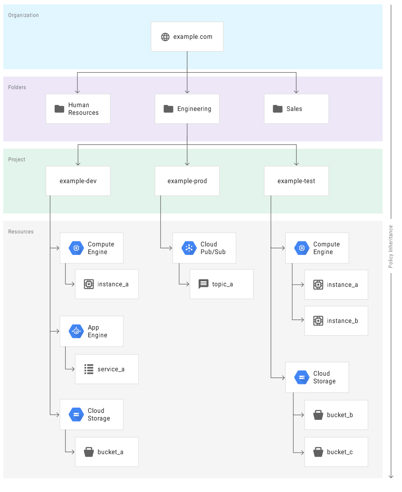

# Google Cloud - Cloud Security Engineer Certification

[^1] A Professional Cloud Security Engineer enables organizations to design and implement a secure infrastructure on Google Cloud Platform. Through an understanding of security best practices and industry security requirements, this individual designs, develops, and manages a secure infrastructure leveraging Google security technologies. The Cloud Security Professional should be proficient in all aspects of Cloud Security including managing identity and access management, defining organizational structure and policies, using Google technologies to provide data protection, configuring network security defenses, collecting and analyzing Google Cloud Platform logs, managing incident responses, and an understanding of regulatory concerns.

The Professional Cloud Security Engineer exam assesses your ability to:

* Configure access within a cloud solution environment
* Configure network security
* Ensure data protection
* Manage operations within a cloud solution environment
* Ensure compliance

Link to the Exam Guide: [Sec Engineer Exam](https://cloud.google.com/certification/guides/cloud-security-engineer)

## Exam Guide Breakdown
The follow section we will breakdown the exam guide into areas of study.

### 1. Configuring access within a cloud solution environment

#### 1.1 Configuring Cloud Identity. Considerations include:

* Managing Cloud Identity
* Configuring Google Cloud Directory Sync
* Management of super administrator account

##### Cloud Identity

Cloud Identity is an Identity as a Service (IDaaS) and enterprise mobility management (EMM) product. It offers the identity services and endpoint administration that are available in G Suite as a stand-alone product. As an administrator, you can use Cloud Identity to manage your users, apps, and devices from a central location—the Google Admin console.

There are free and premium editions of Cloud Identity. [Compare the differences](https://support.google.com/cloudidentity/answer/7431902)

**If you're a G Suite admin**
* G Suite licenses are required only for users who need certain G Suite services, like Gmail. To manage users who don't need any G Suite services, you can create free Cloud Identity accounts for them.  
* In most cases, Cloud Identity Free edition users have the same identity services as G Suite users, such as single sign-on (SSO) and 2-Step Verification (2SV).

**If you're a GCP admin**
* Consumer accounts, such as personal Gmail accounts or consumer accounts with work email IDs, are unmanaged accounts and are outside of your control. If developers in your organization use unmanaged accounts to use GCP resources, you can create Cloud Identity accounts to manage these users.
* You can create free Cloud Identity accounts for each user, separate from paid G Suite accounts. By doing so, you can manage all users across your entire domain from the Google Admin console.
* Cloud Identity Free edition provides common identity services, such as SSO.

You can manage Cloud Identity via the [REST API](https://cloud.google.com/identity/docs/reference/rest)

_Cloud Identity APIs_
* [Groups API](https://cloud.google.com/identity/docs/groups)
  * Allows you to create and manage different types of groups, each of which supports different features, as well as their memberships.

Google Recommends leveraging there [Client Libraries](https://cloud.google.com/apis/docs/client-libraries-explained) in order to interact with there APIs.

Enforce multi-factor authentication
* https://cloud.google.com/identity/solutions/enforce-mfa

Enable SSO for cloud apps:
* https://cloud.google.com/identity/solutions/enable-sso

Secure corporate access on personal devices:
* https://cloud.google.com/identity/solutions/secure-corp-on-personal-devices

#### Identity and access management (IAM)

Identity and access management (IAM) is the practice of granting the right individuals access to the right resources for the right reasons. This series explores IAM and the individuals who are subject to it, including the following:

* **Corporate identities**: The identities that you manage for employees of your organization. These identities are used for signing in to workstations, accessing email, or using corporate applications. Corporate identities might also include non-employees such as contractors or partners that need access to corporate resources.
* **Customer identities**: The identities that you manage for users in order to interact with your website or customer-facing applications.
* **Service identities**: The identities that you manage in order to enable applications to interact with other applications or the underlying platform.

You might need to grant access to the following resources:
* Google services such as Google Cloud, Google Analytics, or G Suite
* Resources in Google Cloud, such as projects, Cloud Storage buckets, or virtual machines (VMs)
* Custom applications or resources managed by such applications

#### Managing Customer Identities

Customer identities are the identities that you manage for users to let them interact with your website or customer-facing applications. Managing customer identities and their access is also referred to as customer identity and access management (CIAM).

By leveraging Google's [Identity Platfrom](https://cloud.google.com/identity-platform) you can control access to your business application. It provides Single-Sign-On (SSO) capabilities. This is done by building [authentication workflows](https://cloud.google.com/identity-platform/docs/concepts-authentication) into the application using easy-to-use SDK functionality.

#### Google Cloud Directory and Directory Sync

Google Cloud Directory Sync enables administrators to synchronize users, groups and other data from an Active Directory/LDAP service to their Google Cloud domain directory.

Google Cloud uses Google identities for authentication and access management. Manually maintaining Google identities for each employee can add unnecessary management overhead when all employees already have an account in Active Directory. By federating user identities between Google Cloud and your existing identity management system, you can automate the maintenance of Google identities and tie their lifecycle to existing users in Active Directory.

Cloud Directory Sync queries the LDAP directory to retrieve the necessary information from the directory and uses the [Directory API](https://developers.google.com/admin-sdk/directory/) to add, modify, or delete users in your Cloud Identity or G Suite account.

[Preparing your Cloud Identity or G Suit account](https://cloud.google.com/architecture/identity/federating-gcp-with-active-directory-synchronizing-user-accounts#configuring_cloud_identity)

[Configuring user provisioning](https://cloud.google.com/architecture/identity/federating-gcp-with-active-directory-synchronizing-user-accounts#configuring_user_provisioning)

#### Managing Super Admin

#### 1.2 Managing user accounts:

#### Designing identity roles at the project and organization level

IAM lets you set policies at the following levels of the resource hierarchy:

* Organization level. 
  * The organization resource represents your company. IAM roles granted at this level are inherited by all resources under the organization. For more information, see Access control for organizations using IAM.

* Folder level. 
  * Folders can contain projects, other folders, or a combination of both. Roles granted at the highest folder level will be inherited by projects or other folders that are contained in that parent folder. For more information, see Access control for folders using IAM.

* Project level. 
  * Projects represent a trust boundary within your company. Services within the same project have a default level of trust. For example, App Engine instances can access Cloud Storage buckets within the same project. IAM roles granted at the project level are inherited by resources within that project. For more information, see Access control for projects using IAM.

* Resource level. 
  * In addition to the existing Cloud Storage and BigQuery ACL systems, additional resources such as Genomics Datasets, Pub/Sub topics, and Compute Engine instances support lower-level roles so that you can grant certain users permission to a single resource within a project.

IAM policies are hierarchical and propagate down the structure. The effective policy for a resource is the union of the policy set at that resource and the policy inherited from its parent.

The following examples explain how policy inheritance works in practice.

**Example: Pub/Sub**
In Pub/Sub, topics and subscriptions are resources that live under a project. Assume that project_a has a topic topic_a under it. If you set a policy on project_a that grants the Editor role to bob@example.com, and set a policy on topic_a that grants the Publisher role to alice@example.com, you effectively grant the Editor role to bob@example.com and the Publisher role to alice@example.com for topic_a.

The following diagram illustrates the preceding example.

Other Examples can be found [here](https://cloud.google.com/iam/docs/resource-hierarchy-access-control)

**Best Practices**
* Mirror your Google Cloud resource hierarchy structure to your organization structure. The Google Cloud resource hierarchy should reflect how your company is organized, whether it's a startup, a SME, or a large corporation. A startup may start out with a flat resource hierarchy with no organization resource. When more people start collaborating on projects and the number of projects increase, getting an organization resource might make sense. An organization resource is recommended for larger companies with multiple departments and teams where each team is responsible for their own set of applications and services.

* Use projects to group resources that share the same trust boundary. For example, resources for the same product or microservice can belong to the same project.

* Set policies at the organization level and at the project level rather than at the resource level. As new resources are added, you may want them to automatically inherit policies from their parent resource. For example, as new virtual machines are added to the project through auto-scaling, they automatically inherit the policy on the project.

* Grant roles to a Google group instead of to individual users when possible. It is easier to manage members in a Google group than to update an IAM policy. Make sure to control the ownership of the Google group used in IAM policies.

* Use the security principle of least privilege to grant IAM roles; that is, only give the least amount of access necessary to your resources.

* Grant roles at the smallest scope needed. For example, if a user only needs access to publish messages to a Pub/Sub topic, grant the Publisher role to the user for that topic. **_Remember that the policies for child resources inherit from the policies for their parent resources. For example, if the policy for a project grants a user the ability to administer Compute Engine virtual machine (VM) instances, then the user can administer any Compute Engine VM in that project, regardless of the policy you set on each VM. If you need to grant a role to a user or group that spans across multiple projects, set that role at the folder level instead of setting it at the project level._**

* Use labels to annotate, group, and filter resources.

* Audit your policies to ensure compliance. Audit logs contain all setIamPolicy() calls, so you can trace when a policy has been created or modified.

* Audit the ownership and the membership of the Google groups used in policies.

* If you want to limit project creation in your organization, change the organization access policy to grant the Project Creator role to a group that you manage.

#### User Life Cycle Management Process

User lifecycle management—the ability to automatically add and remove users to applications—is one of the key features of [Cloud Identity](https://cloud.google.com/identity), Google Cloud’s identity, access, and device management solution, will allow you to provision and de-provision users and provide them access to a multitude of third-party applications directly from the Cloud Identiy or GSuite Admin Console. 

This is done by enabling Single-Sign-On (SSO) on the application to use Google Cloud Identity as the Identity Provider (IdP)

[^1]: Taken from the GCP Security Engineer Documentation (https://cloud.google.com/certification/cloud-security-engineer)