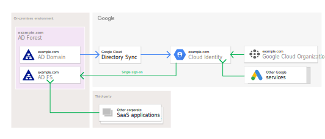
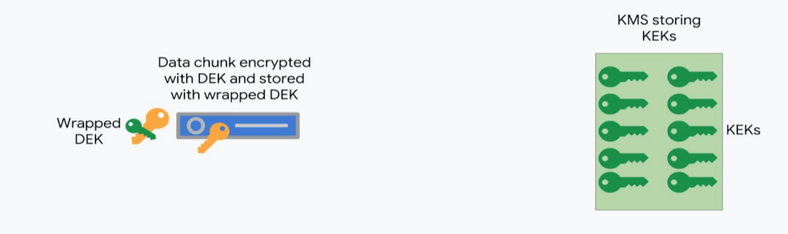
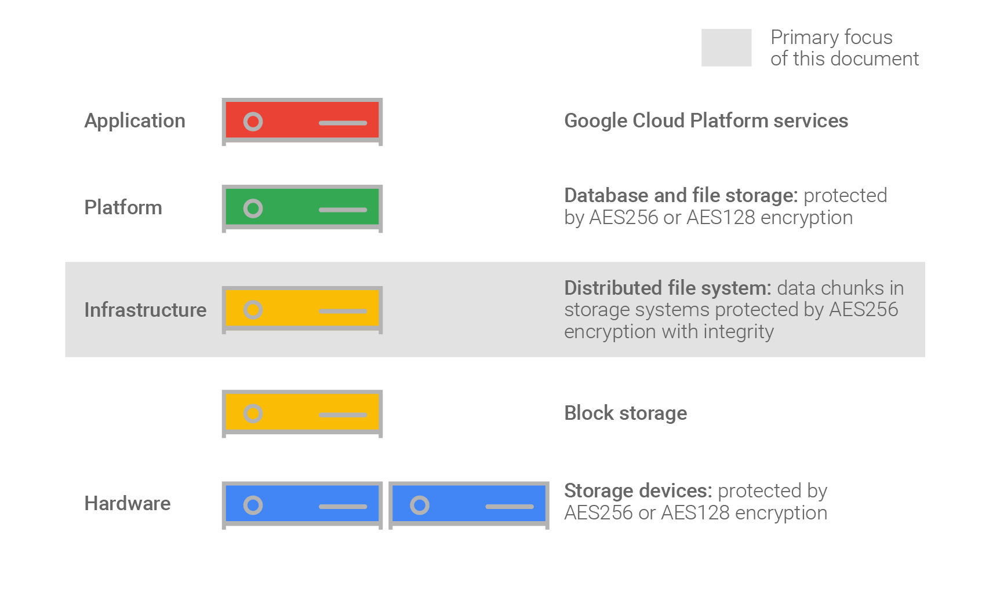

# Google Cloud - Cloud Security Engineer Certification

**UPDATED for 2024 Exam Edition**

[^1] A Cloud Security Engineer allows organizations to design and implement secure workloads and infrastructure on Google Cloud. Through an understanding of security best practices and industry requirements, this individual designs, develops, and manages a secure solution by using Google security technologies. A Cloud Security Engineer is proficient in identity and access management, defining organizational security structure and policies, using Google Cloud technologies to provide data protection, configuring network security defenses, monitoring environments for threats, security automation, AI security, the secure software supply chain, and enforcing regulatory controls.

## Section 1: Configuring Access (~27% of the exam)
### 1.1 - Managing Cloud Identity

Cloud Identity is an Identity as a Service (IDaaS) and enterprise mobility management (EMM) product. It offers the identity services and endpoint administration that are available in G Suite as a stand-alone product. As an administrator, you can use Cloud Identity to manage your users, apps, and devices from a central location—the Google Admin console.

There are free and premium editions of Cloud Identity. [Compare the differences](https://support.google.com/cloudidentity/answer/7431902)

**If you're a Google Workspace admin**
* Google Workspace licenses are required only for users who need certain Google Workspace services, like Gmail. To manage users who don't need any Workspace services, you can create free Cloud Identity accounts for them.  
* In most cases, Cloud Identity Free edition users have the same identity services as G Suite users, such as single sign-on (SSO) and 2-Step Verification (2SV).

**If you're a GCP admin**
* Consumer accounts, such as personal Gmail accounts or consumer accounts with work email IDs, are unmanaged accounts and are outside of your control. If developers in your organization use unmanaged accounts to use GCP resources, you can create Cloud Identity accounts to manage these users.
* You can create free Cloud Identity accounts for each user, separate from paid G Suite accounts. By doing so, you can manage all users across your entire domain from the Google Admin console.
* Cloud Identity Free edition provides common identity services, such as SSO.

You can manage Cloud Identity via the [REST API](https://cloud.google.com/identity/docs/reference/rest)

_Cloud Identity APIs_
* [Groups API](https://cloud.google.com/identity/docs/groups)
  * Allows you to create and manage different types of groups, each of which supports different features, as well as their memberships.

Google Recommends leveraging there [Client Libraries](https://cloud.google.com/apis/docs/client-libraries-explained) in order to interact with there APIs.

Enforce multi-factor authentication
* https://cloud.google.com/identity/solutions/enforce-mfa

Enable SSO for cloud apps:
* https://cloud.google.com/identity/solutions/enable-sso

Secure corporate access on personal devices:
* https://cloud.google.com/identity/solutions/secure-corp-on-personal-devices

The following diagram illustrates the flow for integrate you existing Identity and Access Management system.


* Grant roles to a Google group instead of to individual users when possible. It is easier to manage members in a Google group than to update an IAM policy. Make sure to control the ownership of the Google group used in IAM policies.

* Use the security principle of least privilege to grant IAM roles; that is, only give the least amount of access necessary to your resources.

* Grant roles at the smallest scope needed. For example, if a user only needs access to publish messages to a Pub/Sub topic, grant the Publisher role to the user for that topic. **_Remember that the policies for child resources inherit from the policies for their parent resources. For example, if the policy for a project grants a user the ability to administer Compute Engine virtual machine (VM) instances, then the user can administer any Compute Engine VM in that project, regardless of the policy you set on each VM. If you need to grant a role to a user or group that spans across multiple projects, set that role at the folder level instead of setting it at the project level._**

* Use labels to annotate, group, and filter resources.

* Audit your policies to ensure compliance. Audit logs contain all `setIamPolicy()` calls, so you can trace when a policy has been created or modified.

* Audit the ownership and the membership of the Google groups used in policies.

* If you want to limit project creation in your organization, change the organization access policy to grant the Project Creator role to a group that you manage.

#### Perform Google Workspace Domain-Wide Delegation of Authority
In enterprise applications you may want to programmatically access a user's data without any manual authorization on their part. In G Suite domains, the domain administrator can grant third-party applications with domain-wide access to its users' data — this is known as domain-wide delegation of authority. To delegate authority this way, domain administrators can use service accounts with OAuth 2.0.

To access user data on a G Suite domain, the service account that you created needs to be granted access by a super administrator for the domain.

* [Control API access with domain-wide delegation](https://support.google.com/a/answer/162106?hl=en)

OAuth Scopes:
For example, if you require domain-wide access to Users and Groups enter: https://www.googleapis.com/auth/admin.directory.user, https://www.googleapis.com/auth/admin.directory.group


#### Configuring Google Cloud Directory Sync and third-party connectors

Google Cloud Directory Sync enables administrators to synchronize users, groups and other data from an Active Directory/LDAP service to their Google Cloud domain directory.

You need to enable Cloud Platform to recognize your users, using one of two recommended methods: Google Cloud directory sync (shown on the left below), or third-party identity provider connectors to Cloud Identity (shown on the right below).




Google Cloud uses Google identities for authentication and access management. Manually maintaining Google identities for each employee can add unnecessary management overhead when all employees already have an account in Active Directory. By federating user identities between Google Cloud and your existing identity management system, you can automate the maintenance of Google identities and tie their lifecycle to existing users in Active Directory.

Cloud Directory Sync queries the LDAP directory to retrieve the necessary information from the directory and uses the [Directory API](https://developers.google.com/admin-sdk/directory/) to add, modify, or delete users in your Cloud Identity or G Suite account.

[Preparing your Cloud Identity or G Suit account](https://cloud.google.com/architecture/identity/preparing-your-g-suite-or-cloud-identity-account)


There are multiple option for federation:
* [Microsoft Entra ID user Provisioning and SSO](https://cloud.google.com/architecture/identity/federating-gcp-with-azure-ad-configuring-provisioning-and-single-sign-on)
* [Micrsoft Entra ID B2B User provisioning and SSO](https://cloud.google.com/architecture/identity/azure-ad-b2b-user-provisioning-and-sso)
* [Microsoft Entra ID My Apps portal integration](https://cloud.google.com/architecture/identity/integrating-google-services-and-apps-with-azure-ad-portal)
* [Active Directory User Account Provisioning](https://cloud.google.com/architecture/identity/federating-gcp-with-active-directory-synchronizing-user-accounts)
* [Active Directory Single Sign-On](https://cloud.google.com/architecture/identity/federating-gcp-with-active-directory-configuring-single-sign-on)
* [Keycloack Single Sign-on](https://cloud.google.com/architecture/identity/keycloak-single-sign-on)
* [Okta user provisioning and single sign-on](https://cloud.google.com/architecture/identity/okta-provisioning-and-single-sign-on)

[Reference Architectures](https://cloud.google.com/architecture/identity/reference-architectures)

**Single sign-on process**

Cloud Identity and Google Workspace support [Security Assertion Markup Language (SAML) 2.0](https://en.wikipedia.org/wiki/Security_Assertion_Markup_Language) for single sign-on. SAML is open source standard for exchanging authentication and authorization data between a SAML IdP and SAML service provider. When you use SSO for Cloud Identity or Google Workspace, your external IdP is the SAML IdP and Google is the SAML service provider.

Google implements [SAML 2.0 HTTP POST binding](https://docs.oasis-open.org/security/saml/v2.0/saml-bindings-2.0-os.pdf#page=15), which specifies how auth information is exchanged between IdP and service provider. The following diagram illustrates an example of how the process works:


More detail on the process can be found in the [official documentation](https://cloud.google.com/architecture/identity/single-sign-on).

#### Managed Active Directory

* Actual Microsoft AD
* Virtually maintenance free
* managed cloud-based, AD-dependent workloads
* supports hybrid cloud & standalone cloud domains

Features
* HA Configurations
* Hardened Servers
* Snapshots
* Automated patching
* Flexible, multi-regional deployments


**Forest design models**
Managed Microsoft AD supports the following [Active Directory forest design models](https://docs.microsoft.com/en-us/windows-server/identity/ad-ds/plan/forest-design-models):
* Organizational forest: 
  * The same forest contains both user accounts and resources, which are managed independently.
* Resource forest: 
  * A separate forest is used to manage resources.
* Restricted access forest: 
  * A separate forest contains user accounts and data that must be isolated from the rest of the organization.
  
**Configuring AD Domain**

Need the following APIs enabled:
* managedidentities.googleapis.com,
* dns.googleapis.com,
* compute.googleapis.com

Required Roles:
* Google Cloud Managed Identities Admin (roles/managedidentities.admin)
* Google Cloud Managed Identities Peering Admin (roles/managedidentities.peeringAdmin)
* Optional: Check if you have the following IAM roles as well:
  * Google Cloud Managed Identities Viewer (roles/managedidentities.viewer)
  * Compute Network User (roles/compute.networkUser)
  * Compute Network Viewer (roles/compute.networkViewer)

```
gcloud active-directory domains create FULLY_QUALIFIED_DOMAIN_NAME \
    --reserved-ip-range=CIDR_RANGE --region=REGION \
    --authorized-networks=projects/PROJECT_ID/global/networks/VPC_NETWORK_NAME
```


#### Identity Platform

* Supports authentication
  * password
  * phone numbers
  * federated IdPs
* Tightly integrated with GCP services
* Advanced User security
* Planet-scale infrastructure


#### Workforce Identity Federation
Allow the use of an external identity provider (IdP) to authenticate and authorize a workforce—a group of users, such as employees, partners, and contractors—using IAM, so that the users can access Google Cloud services. With Workforce Identity Federation you don't need to synchronize user identities from your existing IdP to Google Cloud identities, as you would with Cloud Identity's Google Cloud Directory Sync (GCDS). Workforce Identity Federation extends Google Cloud's identity capabilities to support syncless, attribute-based single sign on.

After user authentication, information that is received from the IdP is used to determine the scope of access to the Google Cloud resources.

You can use Workforce Identity Federation with any IdP that supports [OpenID Connect (OIDC)](https://openid.net/connect/) or [SAML 2.0](http://docs.oasis-open.org/security/saml/Post2.0/sstc-saml-tech-overview-2.0.html), such as Azure Active Directory (Azure AD), Active Directory Federation Services (AD FS), Okta, and others.

**Workforce Identity Pools**
Provides the following capabilities of managing groups of workforce identities and their access to Google Cloud Resources:

* Group user identities; for example, employees or partners
* Grant IAM access to an entire pool or a subset thereof.
* Federate identities from one or more IdPs.
* Define policies on a group of users that require similar access permissions.
* Specify IdP-specific configuration information, including attribute mapping and attribute conditions.
* Enable the Google Cloud CLI and API access for third-party identities.
* Log access by users within a pool to Cloud Audit Logs, along with the pool ID.

Pools are configured at the Organization Level and are available across projects/folders, as long as you have the appropriate IAM permissions to view the pool. When you first set up Workforce Identity Federation for your organization, you provide a name for the pool. In IAM allow policies, you reference the pool by its name. Because of this, we recommend that you name the pool so that it clearly describes the identities it contains.

**_Create Workforce Identity Pool_**

```
gcloud iam workforce-pools create WORKFORCE_POOL_ID \
    --organization=ORGANIZATION_ID \
    --display_name="DISPLAY_NAME" \
    --description="DESCRIPTION" \
    --session-duration=SESSION_DURATION \
    --location=global
```
Replace the following:
* **WORKFORCE_POOL_ID**: an ID that you choose to represent your Google Cloud workforce pool. For information on formatting the ID, see the Query parameters section in the API documentation.
* **ORGANIZATION_ID**: the numeric organization ID of your Google Cloud organization.
* **DISPLAY_NAME**: Optional. A display name for your workforce identity pool.
* **DESCRIPTION**: Optional. A workforce identity pool description.
* **SESSION_DURATION**: Optional. The session duration, which determines how long the Google Cloud access tokens, console (federated) sign-in sessions, and gcloud CLI sign-in sessions from this workforce pool are valid. The duration must be greater than 15 minutes (900s) and less than 12 hours (43200s). If session duration is not set, it defaults to a duration of one hour (3600s).

**Workfoce Identity Pool Providers**

* An Entity that describes a relationship between your GCP Organization and your IdP.
* Follows [OAuth 2.0 Token Exchange Specification (RFC 8693)](https://datatracker.ietf.org/doc/html/rfc8693)
  *  You provide a credential from your external identity provider to the Security Token Service, which verifies the identity in the credential, and then returns a short-lived Google Cloud access token in exchange.
* Also supports OIDC flows ([authorization code flow](https://openid.net/specs/openid-connect-core-1_0.html#CodeFlowAuth) and [implicit flow](https://openid.net/specs/openid-connect-core-1_0.html#ImplicitFlowAuth)) for OIDC providers.
  * Authorization code flow is considered the most secure, because tokens are returned from the IdP in a separate, secure backend transaction, directly from the IdP to GCP, after users authenticate.

**_Create a Workforce Identity Pool Provider for SAML based Auth_**

```
gcloud iam workforce-pools providers create-saml PROVIDER_ID \
    --workforce-pool="WORKFORCE_POOL_ID" \
    --display-name="DISPLAY_NAME" \
    --description="DESCRIPTION" \
    --idp-metadata-path="XML_METADATA_PATH" \
    --attribute-mapping="ATTRIBUTE_MAPPING" \
    --attribute-condition="ATTRIBUTE_CONDITION" \
    --location=global
```

**_Create a Workforce Identity Pool Provider for OIDC (Code Flow) based Auth_**

```
gcloud iam workforce-pools providers create-oidc PROVIDER_ID \
    --workforce-pool=WORKFORCE_POOL_ID \
    --display-name="DISPLAY_NAME" \
    --description="DESCRIPTION" \
    --issuer-uri="ISSUER_URI" \
    --client-id="OIDC_CLIENT_ID" \
    --client-secret-value="OIDC_CLIENT_SECRET" \
    --web-sso-response-type="code" \
    --web-sso-assertion-claims-behavior="merge-user-info-over-id-token-claims" \
    --web-sso-additional-scopes="WEB_SSO_ADDITIONAL_SCOPES" \
    --attribute-mapping="ATTRIBUTE_MAPPING" \
    --attribute-condition="ATTRIBUTE_CONDITION" \
    --jwk-json-path="JWK_JSON_PATH" \
    --location=global
```

**_Create a Workforce Identity Pool Provider for OIDC (Implicit Flow) based Auth_**

```
gcloud iam workforce-pools providers create-oidc PROVIDER_ID \
    --workforce-pool=WORKFORCE_POOL_ID \
    --display-name="DISPLAY_NAME" \
    --description="DESCRIPTION" \
    --issuer-uri="ISSUER_URI" \
    --client-id="OIDC_CLIENT_ID" \
    --client-secret-value="OIDC_CLIENT_SECRET" \
    --web-sso-response-type="code" \
    --web-sso-assertion-claims-behavior="merge-user-info-over-id-token-claims" \
    --web-sso-additional-scopes="WEB_SSO_ADDITIONAL_SCOPES" \
    --attribute-mapping="ATTRIBUTE_MAPPING" \
    --attribute-condition="ATTRIBUTE_CONDITION" \
    --jwk-json-path="JWK_JSON_PATH" \
    --location=global
```

Replace the following:
* **PROVIDER_ID**: A unique provider ID. The prefix gcp- is reserved and can't be used in a pool or provider ID.
* **WORKFORCE_POOL_ID**: The workforce identity pool ID to connect your IdP to.
* **DISPLAY_NAME**: An optional user-friendly display name for the provider; for example, idp-eu-employees.
* **DESCRIPTION**: An optional workforce provider description; for example, IdP for Partner Example Organization employees.
* **ISSUER_URI**: 
  * The OIDC issuer URI, in a valid URI format, that starts with https; for example, https://example.com/oidc. Note: For security reasons, ISSUER_URI must use the HTTPS scheme.
* **OIDC_CLIENT_ID**: 
  * The OIDC client ID that is registered with your OIDC IdP; the ID must match the aud claim of the JWT that is issued by your IdP.
* **WEB_SSO_ADDITIONAL_SCOPES**: Optional additional scopes to send to the OIDC IdP for console (federated) or gcloud CLI browser-based sign-in.
* **ATTRIBUTE_MAPPING**: 
  * An attribute mapping. For Azure AD with OIDC authentication, we recommend the following attribute mappings:
    ```
      google.subject=assertion.sub,
      google.groups=assertion.groups,
      google.display_name=assertion.preferred_username
    ```
  * This example maps the IdP attributes subject, groups, and preferred_username to the Google Cloud attributes google.subject, google.groups, and google.display_name, respectively.
* **ATTRIBUTE_CONDITION**: 
  * An attribute condition; for example, to limit the ipaddr attribute to a certain IP range you can set the condition assertion.ipaddr.startsWith('98.11.12.') .
  * If your multitenant IdP has a single issuer URI, you must use attribute conditions to ensure that access is restricted to the correct tenant.
* **JWK_JSON_PATH**: 
  * An optional path to a locally uploaded OIDC JWKs. If this parameter isn't supplied, Google Cloud instead uses your IdP's /.well-known/openid-configuration path to source the JWKs containing the public keys. For more information about locally uploaded OIDC JWKs, see manage OIDC JWKs.
* **XML_METADATA_PATH**: The path to the XML-formatted metadata file with configuration metadata for the SAML identity provider.

Example for the entire process:
* [Configure Workforce Identity Federation with Azure AD and sign in users](https://cloud.google.com/iam/docs/workforce-sign-in-azure-ad)


### 1.2 Managing service accounts.

A service account is a special kind of account typically used by an application or compute workload, such as a Compute Engine instance, rather than a person. A service account is identified by its email address, which is unique to the account.

When using an application to access Cloud Platform APIs, we recommend you use a service account, an identity whose credentials your application code can use to access other GCP services. You can access a service account from code running on GCP, in your on-premises environment or even another cloud.

Service accounts differ from user accounts in a few key ways:

  * Service accounts do not have passwords, and cannot log in via browsers or cookies.
  * Service accounts are associated with private/public RSA key-pairs that are used for authentication to Google.
  * IAM permissions can be granted to allow other users (or other service accounts) to impersonate a service account.
  * Service accounts are not members of your Google Workspace domain, unlike user accounts. 
    * For example, if you share assets with all members in your Workspace domain, they will not be shared with service accounts. 
    * Similarly, any assets created by a service account cannot be owned or managed by Workspace or Cloud Identity admins. 
    * This doesn't apply when using domain-wide delegation, because API calls are authorized as the impersonated user, not the service account itself.

  NOTE: Service account keys are a security risk if not managed correctly. You should choose a more secure alternative to service account keys whenever possible. If you must authenticate with a service account key, you are responsible for the security of the private key and for other operations described by [Best practices for managing service account keys](https://cloud.google.com/iam/docs/best-practices-for-managing-service-account-keys). If you are prevented from creating a service account key, service account key creation might be disabled for your organization. For more information, see [Managing secure-by-default organization resources](https://cloud.google.com/resource-manager/docs/secure-by-default-organizations).

Service accounts can be divided into the following categories:
  * User-managed service accounts, which you create and manage yourself
    * _Default Service Accounts_ are user-managed service accounts that are created automatically when you enable or use certain Google Cloud services. 
      * These service accounts let the service deploy jobs that access other Google Cloud resources. You are responsible for managing default service accounts after they are created.
      * Services and the associated default service account
        * App Engine : **_project-id_@appspot.gserviceaccount.com**
        * Compute Engine: **_project-number_-compute@developer.gserviceaccount.com**
  * Service agents, which Google Cloud creates and manages
    * These are NOT created in your projects so you won't see them and can't access them directly
    * See [documentation](https://cloud.google.com/iam/docs/service-account-types#service-specific) for this

#### Securing and protecting service accounts (including default service accounts)

Use enforce the following organization policies to reduce security risks on Service accounts
  * `iam.disableServiceAccountKeyCreation` and `iam.disableServiceAccountKeyUpload` to disable the creation of service account keys to reduce the risk of credential exposure
  * `iam.automaticIamGrantsForDefaultServiceAccounts` to prevent default service accounts from recieving overly permissive IAM role of Editor
    * using this policy you will need to decide which roles to grant the default service accounts and grant them yourself
    * if the default service account has the Editor role you can use the [Policy Simulator](https://cloud.google.com/policy-intelligence/docs/simulate-iam-policies) to see the impact of removing the grant prior to making the change effective

Warning: Unless a role recommendation suggests it, don't revoke the roles that are granted to the Google APIs Service Agent. If you revoke these roles in a way that is not suggested by a role recommendation, some Google Cloud services will no longer work.

#### Identifying scenarios requiring service accounts
Its recommend to avoid using service account keys as much as possible.

The following diagram outlines the decision for when to use service accounts.


#### Creating, disabling, and authorizing service accounts

To create a service account you require the `roles/iam.serviceAccountCreator` IAM role for the project as well as the `roles/resourcemanager.projectIamAdmin` to grant newly created service accounts access to your project.

To edit/manage service (CRUD) accounts you require the `roles/iam.serviceAccountAdmin` IAM role

To only view service accounts your require the `roles/iam.serviceAccountView` IAM role

To only delete service accounts your require the `roles/iam.serviceAccountDeleter` IAM role

**List service accounts**

`gcloud iam service-accounts list`

**Edit a Service Account**

```
gcloud iam service-accounts update SA_NAME@PROJECT_ID.iam.gserviceaccount.com 
  --description="UPDATED_SA_DESCRIPTION" 
  --display-name="UPDATED_DISPLAY_NAME"
```

**Create a service account**

The service account's name appears in the email address that is provisioned during creation, in the format **_SERVICE_ACCOUNT_NAME_@P_ROJECT_ID_.iam.gserviceaccount.com**.

```
gcloud iam service-accounts create SERVICE_ACCOUNT_NAME \
  --description="DESCRIPTION" \
  --display-name="DISPLAY_NAME"
```

* **SERVICE_ACCOUNT_NAME**: 
  * an alphanumeric ID between 6 - 30 characters long and can contain lowercase alphanumeric characters and dashes.
  * once created it CANT be changed

 Optionally you grant you service account a specific IAM role using the following:

 ```
 gcloud projects add-iam-policy-binding PROJECT_ID \
  --member="serviceAccount:SERVICE_ACCOUNT_NAME@PROJECT_ID.iam.gserviceaccount.com" \
  --role="ROLE_NAME"
 ```

 **ROLE_NAME**: a role name, such as `roles/compute.osLogin`

 Also you can allow users to [attach the service account to other resources, such as Compute Engine,](https://cloud.google.com/iam/docs/attach-service-accounts) by running the following:

```
gcloud iam service-accounts add-iam-policy-binding \
  SERVICE_ACCOUNT_NAME@PROJECT_ID.iam.gserviceaccount.com \
  --member="user:USER_EMAIL" \
  --role="roles/iam.serviceAccountUser"
```

**Disabling/Enabling a Service Account**

Recommend disabling before deleting

```
gcloud iam service-accounts disable SA_NAME@PROJECT_ID.iam.gserviceaccount.com
```
```
gcloud iam service-accounts enable SA_NAME@PROJECT_ID.iam.gserviceaccount.com
```

**Delete/Undelete a Service Account**

_Deleting a Service Account_
`gcloud iam service-accounts delete SA_NAME@PROJECT_ID.iam.gserviceaccount.com`

If you delete a service account, then create a new service account with the same name, the new service account is treated as a separate 
identity; it does not inherit the roles granted to the deleted service account. In contrast, when you delete a service account, then 
undelete it, the service account's identity does not change, and the service account retains its roles.

When a service account is deleted, its role bindings are not immediately removed; they are automatically purged from the system after a 
maximum of 60 days. Until that time, the service account appears in role bindings with a deleted: prefix and a `?uid=NUMERIC_ID` suffix, 
where **NUMERIC_ID** is a unique numeric ID for the service account.

_Undeleting a Service Account_

The following criteria must be met before you can use the `undelete` command to undelete a service account:
* **The service account was deleted less then 30 days ago**
  * Beyond 30 days, the service account is permanently removed and Google Cloud cannot recover it event if you file a support request
* **There is no existing service account with the same name as the delete service account**
  * If you accidentally delete the service account `my-service-account@project-id.iam.gserviceaccount.com`, and you recreate a new one with thehsame name the new service account does not inherit the permissions of the deleted service account as its a completely separate from the deleted one. This means that you cannt undelete the previosu service account because the name already exists. To address this you must delete the new service account and undelete the original service account.

In order to find the _NUMERIC-ID_ of the service account you can search the Cloud Audit Logs using the following query:

```
resource.type="service_account"
resource.labels.email_id="SERVICE_ACCOUNT_EMAIL"
"DeleteServiceAccount"
```

Once the _NUMERIC__ID_ is located, for example _123456789012345678901_ run the following command to undelete the service account:
`gcloud beta iam service-accounts undelete 123456789012345678901`

Output:
```
restoredAccount:
    email: SA_NAME@PROJECT_ID.iam.gserviceaccount.com
    etag: BwWWE7zpApg=
    name: projects/PROJECT_ID/serviceAccounts/SA_NAME@PROJECT_ID.iam.gserviceaccount.com
    oauth2ClientId: '123456789012345678901'
    projectId: PROJECT_ID
    uniqueId: 'ACCOUNT_ID'
```

#### Securing, auditing and mitigating the usage of service account keys

To help secure service accounts, consider their dual nature:
  * Because a service account is a principal, you must limit its privileges to reduce the potential harm that can be done by a compromised service account.
  * Because a service account is a resource, you must protect it from being compromised.

Think of service accounts as resources that belong to—or are part of—another resource, such as a particular VM instance or an application.

To effectively manage service accounts, don't look at service accounts in isolation. Instead, consider them in the context of the 
resource they're associated with and manage the service account and its associated resource as one unit: 
  * Apply the same processes, same lifecycle, and same diligence to the service account and its associated resource, and use the same 
  tools to manage them.

Use Cloud Audit Logs for analyzing and missue of Service Account usage and administrative actions use the following filter:
* `protoPayload.serviceName="iam.googleapis.com"`


Sample log for creating service accounts:

```
{
  "protoPayload": {
    "@type": "type.googleapis.com/google.cloud.audit.AuditLog",
    "authenticationInfo": {
      "principalEmail": "example-user@example.com"
    },
    "methodName": "google.iam.admin.v1.CreateServiceAccount",
    "response": {
      "email": "my-service-account@my-project.iam.gserviceaccount.com",
      "@type": "type.googleapis.com/google.iam.admin.v1.ServiceAccount",
      "display_name": "My service account."
    }
  },
  "resource": {
    "type": "service_account"
  }
}
```

Other samples can be found [here](https://cloud.google.com/iam/docs/audit-logging/examples-service-accounts)

Tools to use to monitoring Service Account Usage:
* [Policy Intelligence](https://cloud.google.com/policy-intelligence/docs/overview)
  * When was the last time that a specific service account or key was used to authenticate?
  * Which service accounts in my project have not been used in the past 90 days?
* [Cloud Monitorin](https://cloud.google.com/iam/docs/service-account-monitoring)
  * provides long-term usage metrics for service accounts and keys that you can use to detect anomalies.
* [Event Threat Detection](https://cloud.google.com/security-command-center/docs/concepts-event-threat-detection-overview)
  * Reports when dormant service accounts trigger actions. 
  * Dormant service accounts are service accounts that have been inactive for more than 180 days.

Follow the [Best Practices](https://cloud.google.com/iam/docs/best-practices-service-accounts) for service accounts.

#### Managing and creating short-lived credentials

Short-lived credentials for a service account allows you to [impersonate the service account](https://cloud.google.com/iam/docs/service-account-impersonation), depending on the type of token you create, the short-lived token provides the identity (for ID tokens) or permissions (for access tokens) associated with the service account.

If your system architecture requires you to use a series of token generation calls, you can use a [delegation chain consisting of several service accounts](https://cloud.google.com/iam/docs/create-short-lived-credentials-delegated). In most cases, the direct method, as explained on this page, is sufficient.

Enable the following APIs:
`gcloud services enable iam.googleapis.com iamcredentials.googleapis.com`

Required permissions/roles:
* Service Account Token Creator (`roles/iam.serviceAccountTokenCreator`) which contains the following permissions in order to impersonate a service account:
  * `iam.serviceAccounts.getAccessToken` 
  * `iam.serviceAccounts.signBlob`
  * `iam.serviceAccounts.signJwt`
  * `iam.serviceAccounts.implicitDelegation`
  * lets you create the following types of short-lived credentials:
    * OAuth 2.0 access tokens, which you can use to authenticate with Google APIs
    * OpenID Connect (OIDC) ID tokens
    * Signed JSON Web Tokens (JWTs) and binary blobs

Need to attach a IAM policy binding in order for the action to work

When the CALLER is a service account :
```
gcloud iam service-accounts add-iam-policy-binding PRIV_SA \
  --member=serviceAccount:CALLER_SA --role=roles/iam.serviceAccountTokenCreator --format=json
```

When the CALLER is a user :
```
gcloud iam service-accounts add-iam-policy-binding PRIV_SA \
  --member=user:CALLER_ACCOUNT --role=roles/iam.serviceAccountTokenCreator --format=json
```

Then you can generate an access token:

```
gcloud auth login CALLER_ACCOUNT
gcloud auth print-access-token --impersonate-service-account=PRIV_SA
```

**Credential Access Boundaries**

_Credential Access Boundary_ is a policy language that you can use to downscope the accessing power of your GCP short-lived credentials. You can define a Credential Access Boundary that specifies which resources the short-lived credential can access, as well as an upper bound on the permissions that are available on each resource

_Note: Only Cloud Storage supports Credential Access Boundaries. Other Google Cloud services do not support this feature._

If you need to give principals a distinct set of permissions for each session, using Credential Access Boundaries can be more efficient than creating many different service accounts and granting each service account a different set of roles.

Defining a boundary rule:
You downscope a token by transmitting that token to a google token endpoint along with a boundary rule describing the resources and roles the credential should be restricted to.

The definition of a boundary rule is just json:

```
{
  "accessBoundaryRules": [
    {
      "availableResource": "string",
      "availablePermissions": [
        "list"
      ],
      "availabilityCondition": {
        "title": "string",
        "expression": "string"
      }
    }
  ]
}
```
where

* `AvailableResource` (required) This is the GCP resource (such as organization, folder, project, bucket, etc) to which access may be allowed (and allowed to resources below that resource if applicable). It must be in the format of a GCP Resource Name.
* `AvailablePermissions` (required) This is a list of permissions that may be allowed for use on the specified resource or resources below the specified resource. The only supported value is IAM role with syntax: "inRole:roles/storage.admin"
* `AvailabilityCondition` (optional) This describes additional fine-grained constraints to apply to the token. The expression parameter describes the resource condition this rule applies to in CEL Format.

As an example, the following would generate the token to just objectViewer on `example-bucket` and specifically an object (prefix) `/customer-a/invoices/`:
```
{
  "accessBoundary": {
    "accessBoundaryRules": [
      {
        "availablePermissions": [
          "inRole:roles/storage.objectViewer"
        ],
        "availableResource": "//storage.googleapis.com/projects/_/buckets/example-bucket",
        "availabilityCondition": {
          "expression":
            "resource.name.startsWith('projects/_/buckets/example-bucket/objects/customer-a/invoices/') || api.getAttribute('storage.googleapis.com/objectListPrefix', '').startsWith('customer-a/invoices/')"
        }
      }
    ]
  }
}
```

[Example for Credential Access Boundary](https://github.com/salrashid123/downscoped_token/blob/master/README.md)

**Privileged Access Manager**

Control just-in-time temporary privilege elevation for select principals, and to view audit logs afterwards to find out who had access to what and when.

To allow temporary elevation, you create an _entitlement_ in Privileged Access Manager, and add the following attributes to it:
  * A set of principals who are allowed to request a grant against the entitlement.
  * Whether a justification is required for that grant.
  * A set of roles to temporarily grant. IAM conditions can be set on the roles.
  * The maximum duration a grant can last.
  * Optional: Whether requests need approval from a select set of principals, and whether those principals need to justify their approval.
  * Optional: Additional stakeholders to be notified about important events, such as grants and pending approvals.

Use Cases:
* **Grant emergency access**:
  * allow select emergency responders to perform critical tasks without having to wait for approval
* **Control access to sensitive resources**:
  * tighly control access to sensitive resources, requiring approvals and business justification
  * For example, you can use Privileged Access Manager to do the following:
    * Give developers temporary access to production environments for troubleshooting or deployments.
    * Give support engineers access to sensitive customer data for specific tasks.
    * Give database administrators elevated privileges for maintenance or configuration changes.
* **Help secure service accounts**
  * allow service accounts to self-elevate and assume roles only when needed for automated tasks.
* **Manage access for contractors and extended workforce**
  * Grant contractors or members of the extended workforce temporary, time-bound access to resources, with approvals and justifications required

Permissions/Roles required:
* To create, update, and delete entitlements: Privileged Access Manager Admin (roles/privilegedaccessmanager.admin). Additionally, either Folder IAM Admin (roles/resourcemanager.folderIamAdmin), Project IAM Admin (roles/resourcemanager.projectIamAdmin), or Security Admin (roles/iam.securityAdmin)
* To view entitlements and grants: Privileged Access Manager Viewer (roles/privilegedaccessmanager.viewer)
* To view audit logs: Logs Viewer (roles/logs.viewer)

The `gcloud beta pam entitlements create` command creates the the entitlement at the org, folder or project level.

SAMPLE entitlement.yaml
```
privilegedAccess:
  gcpIamAccess:
    resourceType: cloudresourcemanager.googleapis.com/RESOURCE_MANAGER_RESOURCE_TYPE
    resource: //cloudresourcemanager.googleapis.com/SCOPE
    roleBindings:
    - role: ROLE_1
    - role: ROLE_2
maxRequestDuration: TIME_IN_SECONDSs
eligibleUsers:
- principals:
  - REQUESTING_MEMBER_1
  - REQUESTING_MEMBER_2
approvalWorkflow:
  manualApprovals:
    requireApproverJustification: true
    steps:
    - approvalsNeeded: 1
      approverEmailRecipients:
      - APPROVING_EMAIL_1
      - APPROVING_EMAIL_2
      approvers:
      - principals:
        - APPROVING_MEMBER_1
        - APPROVING_MEMBER_2
requesterJustificationConfig:
  unstructured: {}
additionalNotificationTargets:
  adminEmailRecipients:
  - ADMIN_EMAIL_ADDRESS_1
  - ADMIN_EMAIL_ADDRESS_2
  requesterEmailRecipients:
  - REQUESTER_EMAIL_ADDRESS_1
  - REQUESTER_EMAIL_ADDRESS_2
```

#### Configuring Workload Identity Federation

Using _Workload Identity Federation_, you can provide on-premises or multicloud (AWS, Azure) workloads as well as deployment services such as Github and Gitlab with access to Google Cloud resources by using federated identities instead of a service account key. 

Workload Identity Federation supports any identity provider (IdP) that supports OpenID Connect (OIDC) or Security Assertion Markup Language (SAML) V2.0.

Follows the [OAuth 2.0 Token exchange specification](https://tools.ietf.org/html/rfc8693)

To federate workloads that don't have a public OIDC endpoint, you can upload [OIDC JSON Web Key Sets (JWKS)](https://auth0.com/docs/secure/tokens/json-web-tokens/json-web-key-sets) directly to the pool. This is common if you have Terraform or GitHub Enterprise hosted in your own environment or you have regulatory requirements not to expose public URLs.

##### Workload Identity Pool

A _workload identity pool_ is an entity that let's you manage external identities, it is recommended to create individualized pools for each non-Goolge Cloud environment that requires access to Google Cloud resources, such as deployment, staging, or production environments.

In order to manage _workload identity pools_ the following IAM permissions/roles are required:
* `roles/iam.workloadIdentityPoolViewer`:
  * To view pools and providers
* `roles/iam.workloadIdentityPoolAdmin`:
  * To view, create, update, and delete

**Create Pools**

```
gcloud iam workload-identity-pools create POOL_ID \
    --location="global" \
    --description="DESCRIPTION" \
    --display-name="DISPLAY_NAME"
```

##### Workload Identity Pool Providers

A _workload identity pool provider_ is an entity that describes a relationship between Google Cloud and your IdP, including the following:
* [AWS](https://cloud.google.com/iam/docs/workload-identity-federation-with-other-clouds#aws)
* [Azure](https://cloud.google.com/iam/docs/workload-identity-federation-with-other-clouds#azure)
* [GitHub](https://cloud.google.com/iam/docs/workload-identity-federation-with-deployment-pipelines#github-actions)
* [GitLab](https://cloud.google.com/iam/docs/workload-identity-federation-with-deployment-pipelines#gitlab-saas)
* [Azure DevOps](https://cloud.google.com/iam/docs/workload-identity-federation-with-deployment-pipelines#azure-devops)
* [Kubernetes clusters](https://cloud.google.com/iam/docs/workload-identity-federation-with-kubernetes#kubernetes)
* [GKE](https://cloud.google.com/iam/docs/workload-identity-federation-with-kubernetes#gke)
  * [Workload Identity For GKE](https://cloud.google.com/kubernetes-engine/docs/concepts/workload-identity)
* [AKS](https://cloud.google.com/iam/docs/workload-identity-federation-with-kubernetes#aks)
* [EKS](https://cloud.google.com/iam/docs/workload-identity-federation-with-kubernetes#eks)
* [Okta](https://medium.com/google-cloud/google-cloud-workload-identity-federation-with-okta-da50276101c0)
* [On-premises Active Directory Federation Services (AD FS)](https://cloud.google.com/iam/docs/workload-identity-federation-with-active-directory)
* [Terraform](https://cloud.google.com/iam/docs/workload-identity-federation-with-deployment-pipelines#terraform-cloud)

The tokens issued by your external IdP contain one or more attributes. Some IdPs refer to these attributes as claims.

Google Security Token Service tokens also contain one or more attributes, as listed in below:
Attribute mappings:
* `google.subject` (required):
  * A unique identifier for the user. This attribute is used in IAM principal:// role bindings and appears in Cloud Logging logs. The value must be unique and can't exceed 127 characters.
* `google.group` (optional):
  * A set of groups that the identity belongs to. This attribute is used in IAM principalSet:// role bindings to grant access to all members of a group.
* `attribute.{NAME}` (optional):
  * You can define up to 50 custom attributes and use these attributes in IAM principalSet:// role bindings to grant access to all identities with a certain attribute.

An _attribute mapping_ defines how to derive the value of the Google Security Token Service token attribute from an external token, examples can be found [here](https://cloud.google.com/iam/docs/workload-identity-federation#mapping).

An _attribute condition_ is a [CEL](https://github.com/google/cel-spec) expression that checks assertion attributes and target attributes, in order to evaluate to true otherwise the credential is rejected.

The following example only allows requests from identities that have a specific AWS role:

`attribute.aws_role == "ROLE_MAPPING"`

**Create an OIDC Workload Identity Pool Provider**
```
gcloud iam workload-identity-pools providers create-oidc PROVIDER_ID \
    --location="global" \
    --workload-identity-pool="POOL_ID" \
    --issuer-uri="ISSUER" \
    --attribute-mapping="MAPPINGS" \
    --attribute-condition="CONDITIONS"
```

**Create a SAML Workload Identity Pool Provider**
```
gcloud iam workload-identity-pools providers create-saml PROVIDER_ID \
    --location="global" \
    --workload-identity-pool="POOL_ID" \
    --idp-metadata-path="IDP_METADATA_PATH" \
    --attribute-mapping="MAPPINGS" \
    --attribute-condition="CONDITIONS"
```

To impersonate a service account you need to grant the external entity the Workload Identity User role (`roles.iam.workloadIdentityUser`) on a service account with roles required for the workload.

**Single Identity**
```
principal://iam.googleapis.com/projects/PROJECT_NUMBER/locations/global/workloadIdentityPools/POOL_ID/subject/SUBJECT_NAME
```

**All identities in a group**
```
principalSet://iam.googleapis.com/projects/PROJECT_NUMBER/locations/global/workloadIdentityPools/POOL_ID/group/GROUP_NAME
```

**All identities with a specific attribute value**
```
principalSet://iam.googleapis.com/projects/PROJECT_NUMBER/locations/global/workloadIdentityPools/POOL_ID/attribute.ATTRIBUTE_NAME/ATTRIBUTE_VALUE
```

**All identities in a pool**
```
principalSet://iam.googleapis.com/projects/PROJECT_NUMBER/locations/global/workloadIdentityPools/POOL_ID/*
```

##### Workload Identity Federation for GKE
_Workload Identity Federation for GKE_ is the recommended way for your workloads running on Google Kubernetes Engine (GKE) to access Google Cloud services in a secure and manageable way.


**Identity sameness**
If the metadata in your principal identifier is the same for workloads in multiple clusters that share a workload identity pool because they belong to the same Google Cloud project, IAM identifies those workloads as the same.

For example, consider the following diagram. Clusters A and B belong to the same workload identity pool. Google Cloud identifies applications that use the back-ksa ServiceAccount in the backend namespace of both Cluster A and Cluster B as the same identity. IAM doesn't distinguish between the clusters making the calls.


This identity sameness also means that you must be able to trust every cluster in a specific workload identity pool. For example, if a new cluster, Cluster C in the previous example was owned by an untrusted team, they could create a backend namespace and access Google Cloud APIs using the back-ksa ServiceAccount, just like Cluster A and Cluster B.

To avoid untrusted access, place your clusters in separate projects to ensure that they get different workload identity pools, or ensure that the namespace names are distinct from each other to avoid a common principal identifier.

Every node in a GKE with Workload Identity Federation for GKE enabled stores its metadata on the GKE metadata server. The GKE metadata server is a subset of the Compute Engine metadata server endpoints required for Kubernetes workloads.

The GKE metadata server runs as a DaemonSet, with one Pod on every Linux node or a native Windows service on every Windows node in the cluster. The metadata server intercepts HTTP requests to http://metadata.google.internal (169.254.169.254:80). For example, the GET /computeMetadata/v1/instance/service-accounts/default/token request retrieves a token for the IAM service account that the Pod is configured to impersonate. Traffic to the GKE metadata server never leaves the VM instance that hosts the Pod.

**Create a GKE Cluster with Workload Identity Federation enabled**
```
gcloud container clusters create CLUSTER_NAME \
    --location=LOCATION \
    --workload-pool=PROJECT_ID.svc.id.goog
```

This command will do the following:
* create a fixed workload identity pool for the the cluster in the GCP project with the following format:
  * `PROJECT_ID.svc.id.goog`
* Registers the GKE cluster as an identity provider in the workload identity pool
* Deploys the GKE metadata server, which intercepts credential requests from workloads, on every node.

Following this you need to configure applications to use Workload Identity Federation for GKE, walkthrough found [here](https://cloud.google.com/kubernetes-engine/docs/how-to/workload-identity#authenticating_to).

#### Managing service account impersonation

When an authenticated principal, such as a user or another service account, authenticates as a service account to gain the service account's permissions, it's called impersonating the service account. Impersonating a service account lets an authenticated principal access whatever the service account can access. Only authenticated principals with the appropriate permissions can impersonate service accounts.

Impersonation is useful when you want to change a user's permissions without changing your Identity and Access Management (IAM) policies.

Google Cloud service account impersonation is similar to Amazon Web Services (AWS) Security Token Service API methods like `AssumeRole`.

Service account impersonation is useful when you need to do tasks like the following:
  * Grant a user temporary elevated access
  * Test whether a specific set of permissions is sufficient for a task
  * Locally develop applications that can only run as a service account
  * Authenticate external applications

Required permissions/roles:
* Service Account Token Creator (`roles/iam.serviceAccountTokenCreator`) which contains the following permissions in order to impersonate a service account:
  * `iam.serviceAccounts.getAccessToken` 
  * `iam.serviceAccounts.signBlob`
  * `iam.serviceAccounts.signJwt`
  * `iam.serviceAccounts.implicitDelegation`
  * lets you create the following types of short-lived credentials:
    * OAuth 2.0 access tokens, which you can use to authenticate with Google APIs
    * OpenID Connect (OIDC) ID tokens
    * Signed JSON Web Tokens (JWTs) and binary blobs

To impersonate a service account use the `--impersonate-service-account` flag in the `gcloud` command line:
* `gcloud auth application-default login --impersonate-service-account SERVICE_ACCT_EMAIL`
* `gcloud storage buckets list --impersonate-service-account=SERVICE_ACCT_EMAIL`

You can also use impersonation in several other ways:
* By default with the Google CLI : `gcloud config set auth/impersonate_service_account SERVICE_ACCT_EMAIL`


### 1.3 Managing authentication

#### Creating a password and session management policy for user accounts
12 Best Practices on managing passwords - [here](https://cloud.google.com/blog/products/gcp/12-best-practices-for-user-account)

Set up password policy for users following the best practices found [here](https://cloud.google.com/solutions/modern-password-security-for-users.pdf) as well as best practices for system/app authentication [here](https://cloud.google.com/solutions/modern-password-security-for-system-designers.pdf).

Set up session management and force re-authentication for users in Admin Console, [here](https://cloud.google.com/blog/products/identity-security/improve-security-posture-with-time-bound-session-length)

**When password policies don't apply**
* You can update user passwords as a hash by using the bulk user upload tool or the [Google Workspace Password Sync](https://apps.google.com/supportwidget/articlehome?hl=en&article_url=https%3A%2F%2Fsupport.google.com%2Fa%2Fanswer%2F2611842%3Fhl%3Den&assistant_id=generic-unu&product_context=2611842&product_name=UnuFlow&trigger_context=a) tool. However, if you apply password policies to an entire organizational unit and then upload passwords as a hash for a subset of users in that unit, the policies are not enforced for that subset of users. 
* Password policies don't apply to any user passwords that you reset manually. If you manually reset a password, make sure to select Enforce password policy at next sign-in for that user.
* The password policies you configure don't apply to users who are authenticated on a third-party identity provider (IdP) using SAML.

Enabling SSO for Cloud Apps [here](https://cloud.google.com/identity/solutions/enable-sso)

#### Setting up Security Assertion Markup Language (SAML) and OAuth

Configure SSO / SAML: https://apps.google.com/supportwidget/articlehome?hl=en&article_url=https%3A%2F%2Fsupport.google.com%2Fa%2Fanswer%2F12032922%3Fhl%3Den&assistant_id=generic-unu&product_context=12032922&product_name=UnuFlow&trigger_context=a


#### Configuring and enforcing two-step verification

Configuring and enforcing Two-Factor Auth(2mfa): https://cloud.google.com/identity/solutions/enforce-mfa

If Cloud Identity is your identity provider (IdP), you can implement 2SV in several ways. If you use a third-party IdP, check with them about their 2SV offering.

You can select different levels of 2SV enforcement:

* Optional—employee decides if they will use 2SV.
* Mandatory—employee chooses the 2SV method.
* Mandatory security keys—employee must use a security key.

https://apps.google.com/supportwidget/articlehome?hl=en&article_url=https%3A%2F%2Fsupport.google.com%2Fa%2Fanswer%2F9176657%3Fhl%3Den&assistant_id=generic-unu&product_context=9176657&product_name=UnuFlow&trigger_context=a

### 1.4 Managing and implementing authorization controls

#### Managing privileged roles and separation of duties with Identity and Access Management (IAM) roles and permissions

Best practices for IAM Security can be found [here](https://cloud.google.com/iam/docs/using-iam-securely)

**Cloud IAM best Practices**
* Use groups when configuring GCP access
* Assign roles to the groups instead of individual users
* Utilizing predefined roles offers less admin overhead
* Predefined roles are managed by Google
* Custom roles are **NOT** managed by Google
* Audit logs record project-level permission changes
* Audit policy changes
* Export audit logs to Cloud Storage to store logs for longer periods of time
* Service Account Key Rotation
  * Create a new key, update app config, delete old key

The following command lists all grantable roles for a given resource.
```
gcloud iam list-grantable-roles [full-resource-name]
```

##### Temporary elevated access

One way to protect sensitive resources is to limit access to them. However, limiting access to sensitive resources also creates friction for anyone who occasionally needs to access those resources. For example, a user might need break-glass, or emergency, access to sensitive resources to resolve an incident.

In these situations, we recommend giving the user permission to access the resource temporarily. We also recommend that, to improve auditing, you record the user's justification for accessing the resource.

In Google Cloud, there are several ways that you can manage this kind of temporary elevated access.

**Privileged Access Management**
**_Currently in PREVIEW_**

You can use Privileged Access Manager (PAM) to manage just-in-time temporary privilege elevation for select principals, and to view audit logs afterwards to find out who had access to what and when.

See [overview](https://cloud.google.com/iam/docs/pam-overview) for more details.
See [Requesting temporary elevated access](https://cloud.google.com/iam/docs/pam-request-temporary-elevated-access) for more info on requesting temp elevation.

**Google Groups**

One way to manage temporary elevated access is to grant a Google group access to sensitive resources, then add and remove users from that group to control their access.

To set up a Google group for temporary elevated access:
  * first create a group, then grant it the roles that you want to temporarily give to users. If you use deny policies, also consider making the group exempt from any relevant deny rules to avoid unexpected denials.

After you set up your group, you can add and remove users to modify their access. If you use the Google Groups API, you can temporarily add users to a group by using [membership expiration](https://cloud.google.com/identity/docs/how-to/manage-expirations).

NOTE: Membership Expiration is only available to Google Workspace Enterprise Standard, Enterprise Plus, and Enterprise for Education, and Cloud Identity Premium accounts.

**Principal Access Boundary**
**_Currently In PREVIEW_**
Principal access boundary (PAB) policies let you restrict the resources that principals can access.

For example, you can use principal access boundary policies to prevent your principals from accessing resources in other organizations, which can help prevent phishing attacks or data exfiltration.

See [overview](https://cloud.google.com/iam/docs/principal-access-boundary-policies) for more details.

**Just-in-time privileged access**
Just-In-Time Access is an open source application that uses IAM Conditions to grant users just-in-time privileged access to Google Cloud resources. This application is designed to run on App Engine or Cloud Run.

This application has the following benefits over manually adding conditional role bindings:

Users can search for roles that they can activate with Just-In-Time Access.
Users are required to provide justifications before getting access.
The application replaces the existing conditional binding instead of creating new bindings, which helps maintain your IAM allow policy size.
For more information about Just-In-Time Access, see [Manage just-in-time privileged access to projects](https://cloud.google.com/architecture/manage-just-in-time-privileged-access-to-project).

#### Managing IAM and access control list (ACL) permissions

Exclusively using IAM and enabling [uniform bucket-level access](https://cloud.google.com/storage/docs/using-uniform-bucket-level-access#command-line) allows you to use other Google Cloud security features such as domain restricted sharing, workforce identity federation, and IAM Conditions.

You most likely want to use ACLs in the following cases:
* You need to customize access to individual objects within a bucket. ACLs can be set for individual objects, while IAM permissions can only be granted at the bucket level or higher.
* You are exclusively using the [XML API](https://cloud.google.com/storage/docs/xml-api/overview) or require [interoperability](https://cloud.google.com/storage/docs/interoperability) with Amazon S3.

IAM and ACLs work in tandem to grant access to your buckets and objects, which means a user only needs the relevant permission from either of these systems in order to access a bucket or object.

In most cases IAMs are the recommended approach for giving access to resources.

* ACLs
  * An access control list (ACL) is a mechanism you can use to define who has access to your buckets and objects, as well as what level of access they have. In Cloud Storage, you apply ACLs to individual buckets and objects. Each ACL consists of one or more entries. An entry gives a specific user (or group) the ability to perform specific actions. Each entry consists of two pieces of information:

    * A [**permission**](https://cloud.google.com/storage/docs/access-control/lists#permissions), which defines what actions can be performed (for example, read or write).
    * A [**scope**](https://cloud.google.com/storage/docs/access-control/lists#scopes) (sometimes referred to as a grantee), which defines who can perform the specified actions (for example, a specific user or group of users).

* Legacy Bucket Cloud IAM roles work in tandem with bucket ACLs: 
  * when you add or remove a Legacy Bucket role, the ACLs associated with the bucket reflect your changes. Similarly, changing a bucket-specific ACL updates the corresponding Legacy Bucket role for the bucket.
    * _(IAM) Storage Legacy Bucket Reader = (ACL)Bucket Reader_
    * _(IAM) Storage Legacy Bucket Writer = (ACL) Bucket Writer_
    * _(IAM) Storage Legacy Bucket Owner = (ACL) Bucket Owner_

* Predefined ACLs
  * https://cloud.google.com/storage/docs/access-control/lists#predefined-acl
  * CAUTION: By applying a predefined ACL to an existing bucket or object, you completely replace the existing bucket or object ACL with the predefined ACL. This change might cause you to lose access to the bucket or object ACL in some cases.
* IAMs
  * https://cloud.google.com/storage/docs/access-control/iam#overview
  * https://cloud.google.com/storage/docs/access-control/iam-permissions
  * Cloud IAM allows you to control who has access to the resources in your Google Cloud project. 
    * Resources include Cloud Storage buckets and objects stored within buckets, as well as other Google Cloud entities such as Compute Engine instances.
  * The set of access rules you apply to a resource is called a Cloud IAM policy. A Cloud IAM policy applied to your project defines the actions that users can take on all objects or buckets within your project. A Cloud IAM policy applied to a single bucket defines the actions that users can take on that specific bucket and objects within it.
    * For example, you can create a Cloud IAM policy for one of your buckets that gives one user administrative control of that bucket. Meanwhile, you can add another user to your project-wide Cloud IAM policy that gives that user the ability to view objects in any bucket of your project.
  * Roles are a bundle of one or more permissions. For example, the Storage Object Viewer role contains the permissions storage.objects.get and storage.objects.list. You assign roles to members, which allows them to perform actions on the buckets and objects in your project.
  * Granting roles at the bucket level does not affect any existing roles that you granted at the project level, and vice versa. For example, say you want to give a user permission to read objects in any bucket but create objects only in one specific bucket. To achieve this, give the user the Storage Object Viewer role at the project level, thus allowing the user to read any object stored in any bucket in your project, and give the user the Storage Object Creator role at the bucket level for a specific bucket, thus allowing the user to create objects only in that bucket. Some roles can be used at both the project level and the bucket level. When used at the project level, the permissions they contain apply to all buckets and objects in the project. When used at the bucket level, the permissions only apply to a specific bucket and the objects within it. Examples of such roles are Storage Admin, Storage Object Viewer, and Storage Object Creator. Some roles can only be applied at one level. For example, you can only apply the Viewer role at the project level, while you can only apply the Storage Legacy Object Owner role at the bucket level.
  * All other bucket-level Cloud IAM roles, and all project-level Cloud IAM roles, work independently from ACLs. For example, if you give a user the Storage Object Viewer role, the ACLs remain unchanged.

In most cases, IAM is the recommended method for controlling access to your resources:
* IAM provides access control across all of Google Cloud.
* IAM has greater control over what actions users are allowed to perform.
* IAM permissions granted to parent resources, such as projects, are inherited by child resources, such as buckets and objects, allowing you to more easily manage access to resources.
* IAM permissions can be applied to managed folders, while ACLs cannot.
* ACLs cannot be used exclusively to control access to your resources, because ACLs cannot be set on the overall project or other parent resources.

**Creating / Managing ACLs**
Required Roles : `roles/storage.admin`

`gcloud storage objects update gs://BUCKET_NAME/OBJECT_NAME FLAG`

FLAG: 
* `--add-acl-grant`: "--add-acl-grant=entity=user-john@gmail.com,role=READER"
* `--remove-acl-grant`: "--remove-acl-grant=user-john@gmail.com"

Can also pass in a JSON/YAML file detailing the grants you want to apply

`gcloud storage objects update gs://BUCKET_NAME/OBJECT_NAME --acl-file=FILE_LOCATION`

The file contents:
```
[
  {
    "entity": "project-owners-867489160491",
    "role": "OWNER",
    "projectTeam": {
      "projectNumber": "867489160491",
      "team": "owners"
    },
  },
  {
    "entity": "user-jane@gmail.com",
    "email": "jane@gmail.com",
    "role": "OWNER"
  },
  {
    "entity": "group-gs-announce@googlegroups.com",
    "email": "gs-announce@googlegroups.com",
    "role": "READER"
  }
]
```
#### Granting permissions to different types of identities, including using IAM conditions and IAM deny policies

##### IAM Conditions

You can use [IAM Conditions](https://cloud.google.com/iam/docs/conditions-overview) to define and enforce conditional, attribute-based access control for Google Cloud resources.

You can use conditions in the following places:
* Allow policies
* Deny policies
* Policy bindings for principal access boundary policies **PRE-GA PREVIEW**

The structure of Conditions in a role binding is as follows:

```
"bindings": [
  {
    "role": "ROLE",
    "members": [
      "MEMBER_1",
      "MEMBER_2"
    ],
    "condition": {
      "title": "TITLE",
      "description": "DESCRIPTION",
      "expression": "EXPRESSION"
    }
  }
]
```

IAM Conditions which leverages the [_Common Express Language (CEL)_](https://cloud.google.com/iam/docs/conditions-overview#cel) to specify conditions.

To learn more about the _Condition_ structure visit the official [documentation](https://cloud.google.com/iam/docs/conditions-overview#structure)

To manage conditional role bindings the following roles are required:
* `roles/resourcemanager.projectIamAdmin`
  * Manage access on the project
* `roles/resourcemanager.folderAdmin`
  * Managed access on the folder
* `roles/resourcemanager.organizationAdmin`
  * Manage access at the org level
* `roles/iam.securityAdmin`: 
  * To manage access to almost all GCP resources on the project, folder, or organization that you want to manage access to

**Allow Policies**
Use conditions in _allow polices_ when you want to grant access to principals only if specified conditions are met.
For example: granting temporary access to users so they can resolved a production issue, or you could grant acces only to employees making requests from you corporate network.

As stated above _conditions_ are specified as part of the IAM role binding of a resource policy


Examples

**Grant temporary access**

_Role Binding in IAM Policy_
```
{
  "bindings": [
    {
      "members": [
        "user:project-owner@example.com"
      ],
      "role": "roles/owner"
    },
    {
      "members": [
        "user:travis@example.com"
      ],
      "role": "roles/iam.securityReviewer",
      "condition": {
        "title": "Expires_July_1_2020",
        "description": "Expires on July 1, 2020",
        "expression":
          "request.time < timestamp('2020-07-01T00:00:00.000Z')"
      }
    }
  ],
  "etag": "BwWKmjvelug=",
  "version": 3
}
```

Example: Resource-based access

The resource name attribute can control access to the following Google Cloud services:
* Apigee
* Application Integration
* Backup and DR Service
* BigQuery
* Bigtable
* Binary Authorization
* Cloud Deploy
* Cloud Key Management Service
* Cloud Logging
* Cloud SQL
* Cloud Storage
* Compute Engine
* Dataform
* Google Kubernetes Engine
* Integration Connectors
* Pub/Sub Lite
* Secret Manager
* Spanner

```
{
  "bindings": [
    {
      "members": [
        "user:project-owner@example.com"
      ],
      "role": "roles/owner"
    },
    {
      "members": [
        "group:devs@example.com"
      ],
      "role": "roles/compute.instanceAdmin",
      "condition": {
          "title": "Dev_access_only",
          "description": "Only access to devAccess* VMs",
          "expression":
            "(resource.type == 'compute.googleapis.com/Disk' &&
            resource.name.startsWith('projects/project-123/regions/us-central1/disks/devAccess')) ||
            (resource.type == 'compute.googleapis.com/Instance' &&
            resource.name.startsWith('projects/project-123/zones/us-central1-a/instances/devAccess')) ||
            (resource.type != 'compute.googleapis.com/Instance' &&
            resource.type != 'compute.googleapis.com/Disk')"
      }
    }
  ],
  "etag": "BwWKmjvelug=",
  "version": 3
}
```
Update IAM Policy : `gcloud projects set-iam-policy project-id filepath`

##### Deny Policies
You use _deny polices_ to deny access to a principle. 
Each deny policy is attached to a Google Cloud organization, folder, or project. 
A deny policy contains deny rules, which identify principals and list the permissions that the principals cannot use.

Deny policies are separate from allow policies, also known as IAM policies. 
An allow policy provides access to resources by granting IAM roles to principals.

To manage _Deny Policies_ the following roles are required:
* `roles/iam.denyReviewer`: to view deny policies
* `roles/iam.denyAdmin`: to manage deny policies

Only certain permission can be denied as part of a deny policy, see this [list](https://cloud.google.com/iam/docs/deny-permissions-support) for supported permissions.


Each _deny policy_ is attached to an organization, folder, or project and can have up to 500 deny policies. When attached to one of these resources, deny policies are inherited by all lower-level resources in that project, folder, or organization.

See details on [attachment point](https://cloud.google.com/iam/docs/deny-access#attachment-point).

The following make up a deny policy:
* The permission(s) to deny
* The principal(s) that are being denied those permission(s)
* Optional you can specific exempt principal(s)
* Optionally you can add a condition that specific when the principals cannot use the permissions

Format of the deny rule:
```
{
  "displayName": "POLICY_NAME",
  "rules": [
    {
      "denyRule": DENY_RULE_1
    },
    {
      "denyRule": DENY_RULE_2
    },
    {
      "denyRule": DENY_RULE_N
    }
  ]
}
```

Example defines one deny rule that denies one permission to the user david@company.com:

```
{
  "displayName": "My deny policy.",
  "rules": [
    {
      "denyRule": {
        "deniedPrincipals": [
          "principal://goog/subject/david@company.com"
        ],
        "deniedPermissions": [
          "iam.googleapis.com/roles.create"
        ]
      }
    }
  ]
}
```

```
gcloud iam policies create my-deny-policy \
    --attachment-point=cloudresourcemanager.googleapis.com/projects/my-project \
    --kind=denypolicies \
    --policy-file=policy.json
```

Each deny policy contains an `etag` field that identifies the policy version. The `etag` changes each time you update the policy. 
When you write the updated policy, the `etag` in your request must match the current `etag` stored in IAM; if the values do not
match, the request fails. This feature helps prevent concurrent changes from overwriting each other.

##### Principal Access Boundary

**CURRENT IN PREVIEW**
Principal access boundary (PAB) policies let you limit the resources that a set of principals are eligible to access.

Roles required: 
* `roles/iam.principalAccessBoundaryAdmin`

[Creating a PAB policy](https://cloud.google.com/iam/docs/principal-access-boundary-policies-create#gcloud)


#### Designing identity roles at the organization, folder, project, and resource level


IAM lets you set policies at the following levels of the resource hierarchy:

* Organization level.
  * The organization resource represents your company. IAM roles granted at this level are inherited by all resources under the organization. For more information, see Access control for organizations using IAM.
    * Users who are not owners, including organization administrators, must be assigned either the `Organization Role Administrator role (roles/iam.organizationRoleAdmin)` or the IAM `Role Administrator role (roles/iam.roleAdmin)`. The IAM `Security Reviewer role (roles/iam.securityReviewer)` enables the ability to view custom roles but not administer them.

* Folder level.
  * Folders can contain projects, other folders, or a combination of both. Roles granted at the highest folder level will be inherited by projects or other folders that are contained in that parent folder. For more information, see Access control for folders using IAM.

* Project level.
  * Projects represent a trust boundary within your company. Services within the same project have a default level of trust. For example, App Engine instances can access Cloud Storage buckets within the same project. IAM roles granted at the project level are inherited by resources within that project. For more information, see Access control for projects using IAM.

* Resource level.
  * In addition to the existing Cloud Storage and BigQuery ACL systems, additional resources such as Genomics Datasets, Pub/Sub topics, and Compute Engine instances support lower-level roles so that you can grant certain users permission to a single resource within a project.

IAM policies are hierarchical and propagate down the structure. The effective policy for a resource is the union of the policy set at that resource and the policy inherited from its parent.

The following examples explain how policy inheritance works in practice.

**Example: Pub/Sub**
In Pub/Sub, topics and subscriptions are resources that live under a project. Assume that project_a has a topic topic_a under it. If you set a policy on project_a that grants the Editor role to bob@example.com, and set a policy on topic_a that grants the Publisher role to alice@example.com, you effectively grant the Editor role to bob@example.com and the Publisher role to alice@example.com for topic_a.

The following diagram illustrates the preceding example.


Other Examples can be found [here](https://cloud.google.com/iam/docs/resource-hierarchy-access-control)
Best Practices can be found [here](https://cloud.google.com/iam/docs/resource-hierarchy-access-control#best_practices)

#### Configuring Access Context Manager

Access Context Manager allows enterprises to configure access levels which map to a policy defined on request attributes.

Access Context Manager allows Google Cloud organization administrators to define fine-grained, attribute based access control for projects and resources in Google Cloud.

Access levels describe the requirements for requests to be honored. Examples include:
* Device type and operating system
* IP address
* User identity

Administrators first define an access policy, which is an organization-wide container for access levels and service perimeters.


Service perimeters define sandboxes of resources which can freely exchange data within the perimeter, but are not allowed to export data outside of it. Access Context Manager isn't responsible for policy enforcement. Its purpose is to describe the desired rules. Policy is configured and enforced across various points, such as [VPC Service Controls](https://cloud.google.com/vpc-service-controls). 

Access Context Manager is an integral part of the [BeyondCorp](https://cloud.google.com/beyondcorp/) effort at Google. 

You can configure and enforce Access Context Manager policies across the following [Chrome Enterprise](https://chromeenterprise.google/). solution Premium components:
* [VPC Service Controls](https://cloud.google.com/vpc-service-controls/docs/use-access-levels)
* [Identity-Aware Proxy](https://cloud.google.com/iap/docs/cloud-iap-context-aware-access-howto)
* [Context-Aware Access for Google Workspace](https://support.google.com/a/answer/9262032?&ref_topic=9262521)
* [Identity and Access Management (IAM) conditions](https://cloud.google.com/iam/docs/conditions-overview#example-access-level)

An access policy collects the service perimeters and access levels you create for your Organization. An Organization can only have one access policy.

When service perimeters are created and managed using the VPC Service Controls page of the Cloud Console, you do not need to create an access policy.

IAM Roles/Permissions required:

* accesscontextmanager.policies.create
  - Privided by the `roles/accesscontextmanager.policy.Editor` role
  - Allow creation of an orginzation-level access policy or scoped policies
* accesscontextmanager.policies.list
  - Provided by `roles/accesscontextmanager.policyEditor` and `roles/accesscontextmanager.policyReader`
  - Lists an organization-level access policy or scoped policies

**Create an access policy**
```
gcloud access-context-manager policies create --organization ORGANIZATION_ID --title POLICY_TITLE
```

You can use the `--scopes=SCOPE` flag to to specify which folder/project this policy apply too, only one folder or project can be specified.
If no _scope_ is supplied it applies to the entire organization

You can delegate administration by binding a principal and role with a scoped access policy, by using the `add-iam-policy-binding` command
```
gcloud access-context-manager policies add-iam-policy-binding [POLICY] --member=PRINCIPAL --role=ROLE
```
_ROLE_ is the role name to assign to the principal. The role name is the complete path of a predefined role, such as `roles/accesscontextmanager.policyReader`, or the role ID for a custom role, such as `organizations/{ORGANIZATION_ID}/roles/accesscontextmanager.policyReader`.

Set the default policy:

```
gcloud config set access-context-manager/policy POLICY_NAME
```

You can update the access levels of you organization by using the bulk management apis using gcloud cli:

```
gcloud access-context-manager levels replace-all \
  --source-file=FILE \
  --etag=ETAG \
  [--policy=POLICY_NAME]
```
 `FILE` is a `.yaml` file containing the access levels as shown below:

 ```
- name: accessPolicies/11271009391/accessLevels/corpnet_access
  title: Corpnet Access
  description: Permit access to corpnet.
  basic:
    combiningFunction: AND
    conditions:
      - ipSubnetworks:
        - 252.0.2.0/24
        - 2001:db8::/32
- name: accessPolicies/11271009391/accessLevels/prodnet_access
  title: Prodnet Access
  description: Permit access to prodnet.
  basic:
    combiningFunction: OR
    conditions:
      - members:
        - user:exampleuser@example.com
        - serviceAccount:exampleaccount@example.iam.gserviceaccount.com
      - ipSubnetworks:
        - 176.0.2.0/24
 ```

#### Applying Policy Intelligence for better permission management
_Policy Intelligence_ tools help you understand and manage your policies to proactively improve your security configuration.

_Cloud Asset Inventory_ provides **Policy Analyzer** for IAM allow policies, which lets you find out what principals have access to which Google Cloud resources based on your IAM allow policies.

#### Managing permissions through groups

### 1.5 Defining resource hierarchy.

#### Creating and managing organizations at scale

The following diagram outlines a sample resource outline in Google Cloud:
.

The _Origanization_ node is the root node and all access control policies will trickle down from there. Org admins can set [Originizational Policies](https://cloud.google.com/resource-manager/docs/organization-policy/overview), which is a configuration of restrictions that enforce access control to folders and/or projects at the organization level on resources and their descendants. Available for Google Workspace and Cloud Identity.

Best Practices For Organizations can be found [here](https://cloud.google.com/docs/enterprise/best-practices-for-enterprise-organizations).

Key Best Practices:
* Map you organizational structure to GCP
  * Top level node represents you organization, folders represent business units/departments and/or teams.
* Federate your identity provider with Google Cloud
  * If your organization uses an on-premises or third-party identity provider, synchronize your user directory with Cloud Identity to let users access Google Cloud with their corporate credentials. This way, your identity platform remains the source of truth while Cloud Identity controls how your employees access Google services.

The following image outlines an example of  resource hierarchy illustrating the core account-level resources involved in administering your Google Cloud account.


  * Billing Account:
    * Tracks all organizational costs
      * Linked to one or more projects
  * Domain:
    * Your company Domain is the primary identity of your organization and establishes your company's identity with Google services, including Google Cloud.
    * Can be linked to either a Google Workspace or Cloud Identity Account
  * Organization:
    * Highest unit
    * Using [Google Workspace](https://support.google.com/a/answer/53926) and [Cloud Identity](https://cloud.google.com/identity/docs/set-up-cloud-identity-admin)
    * Common place to register your domain as the org name
  * Folders:
    * Orgs can have one or more folders
    * Common practice is to have folders represent departments in an org
    * Max 100 folders under a single folder or up to four levels of folder nesting
  * Projects:
    * A unit of resource management below folders
    * Contains a set of users, API permission, billing information and provisioned resources
    * Identified by their project ID which should be unique to each org
    * Auto-generated by GCP
      * Cloud Deployment Manager
      * Terraform
      * Ansible
    * Users and roles specified per project
  * Resources:
    * Instance of offerings and services of GCP
    * Roles are defined to manage access

The following diagram outlines a sample resource outline in Google Cloud:
.

When you set an organization policy on a resource hierarchy node, all descendants of that resource hierarchy node inherit the organization policy by default. If you set an organization policy at the root organization node, then those restrictions are inherited by all child folders, projects, and resources.
You can set custom organization policy on child nodes, which will overwrite or merge with the inherited policy based on the rules of hierarchy evaluation.

**Resource Management Best Practices**

1. Mirror your Google Cloud resource hierarchy structure to your organization structure. The Google Cloud resource hierarchy should reflect how your company is organized, whether it's a startup, a SME, or a large corporation. A startup may start out with a flat resource hierarchy with no organization resource. When more people start collaborating on projects and the number of projects increase, getting an organization resource might make sense. An organization resource is recommended for larger companies with multiple departments and teams where each team is responsible for their own set of applications and services.

2. Use projects to group resources that share the same trust boundary. For example, resources for the same product or microservice can belong to the same project.

3. Set policies at the organization level and at the project level rather than at the resource level. As new resources are added, you may want them to automatically inherit policies from their parent resource. For example, as new virtual machines are added to the project through auto-scaling, they automatically inherit the policy on the project.

#### Managing organization policies for organization folders, projects, and resources

Organization policies are a set of configurations outlining restrictions associated to the organization, which can be assigned to organizations, folders, and projects in order to enforce the restrictions on that resource and its descendants.


In order to define an organization policy, you choose a [constraint](https://cloud.google.com/resource-manager/docs/organization-policy/overview#constraints), which is a particular type of restriction against either a Google Cloud service or a group of Google Cloud services. You configure that constraint with your desired restrictions.

The Organization Policy Service gives you centralized and programmatic control over your organization's cloud resources. As the organization policy administrator, you will be able to configure constraints across your entire resource hierarchy.

Benefits
* Centralize control to configure restrictions on how your organization’s resources can be used.
* Define and establish guardrails for your development teams to stay within compliance boundaries.
* Help project owners and their teams move quickly without worry of breaking compliance.

Identity and Access Management focuses on **who**, and lets the administrator authorize who can take action on specific resources based on permissions.

Organization Policy focuses on **what**, and lets the administrator set restrictions on specific resources to determine how they can be configured.


##### Policies and Constraints
The IAM role `roles/orgpolicy.policyAdmin` enables an administrator to manage organization policies.


##### Constraints

A **_constraint_** is a definition of the behaviors that are controlled by an organization policy. A constraint has a type, either list or boolean.

**Custom Constraint**
You can use the CEL language to create custom org constraints

Sample constraint YAML
```
name: organizations/1234567890123/customConstraints/custom.disableGkeAutoUpgrade
resourceTypes:
- container.googleapis.com/NodePool
methodTypes:
- CREATE
- UPDATE
condition: "resource.management.autoUpgrade == false"
actionType: ALLOW
displayName: Disable GKE auto upgrade
description: Only allow GKE NodePool resource to be created or updated if AutoUpgrade is not enabled where this custom constraint is enforced.
```
The run the `gcloud org-policies set-custom-constraint CONSTRAINT_PATH` to create the constraint


##### Restricting by domains
_Resource Manager_ provides a domain restriction constraint, used within an org policy, that can limit resource sharing based on domain.

Organization policies can use this constraint to limit resource sharing to a specified set of one or more G Suite domains, and exceptions can be granted on a per-folder or per-project basis.

The domain restriction constraint is not retroactive. Once a domain restriction is set, this limitation will apply to IAM policy changes made from that point forward, and not to any previous changes.

_For example, consider two related organizations: examplepetstore.com and altostrat.com. You have granted an examplepetstore.com identity an IAM role in altostrat.com. Later, you decided to restrict identities by domain, and implemented an organization policy with the domain restriction constraint in altostrat.com. In this case, the existing examplepetstore.com identities would not lose access in altostrat.com. From that point, you could only grant IAM roles to identities from the altostrat.com domain._

The domain restriction constraint is based on the `iam.allowedPolicyMemberDomains` list constraint.


#### Resource Liens

You can place a lien upon a project to block the project's deletion until you remove the lien. This can be useful to protect projects of particular importance.

**Create a project lien**
```
gcloud alpha resource-manager liens create
  --restrictions=resourcemanager.projects.delete
  --reason="Super important production system"
```

**Removing a project lien**
`gcloud alpha resource-manager liens delete [LIEN-NAME]`

_LIEN-NAME_ example: `liens/p1061081023732-l3d8032b3-ea2c-4683-ad48-5ca23ddd00e7` 


#### Using resource hierarchy for access control and permissions inheritance

The resource nodes that are in the hierarchy below the Organization Node are evaluated as follows:

* Resource 1 defines a custom policy that sets inheritFromParent to TRUE and allows blue diamond. The policy from the Organization Node is inherited and merged with the custom policy, and the effective policy evaluates to allow red square, green circle, and blue diamond.

* Resource 2 defines a custom policy that sets inheritFromParent to TRUE and denies green circle. Deny values always take precedence during policy reconciliation. The policy from the Organization Node is inherited and merged with the custom policy, and the effective policy evaluates to allow only red square.

* Resource 3 defines a custom policy that sets inheritFromParent to FALSE and allows yellow hexagon. The policy from the Organization Node is not inherited, so the effective policy evaluates to only allow yellow hexagon.

* Resource 4 defines a custom policy that sets inheritFromParent to FALSE and includes the restoreDefault value. The policy from the Organization Node is not inherited, and the default constraint behavior is used, so the effective policy evaluates to allow all.

Descendants of the targeted resource hierarchy node inherit the organization policy. By applying an organization policy to the root organization node, you are able to effectively drive enforcement of that organization policy and configuration of restrictions across your organization.

You can set an Cloud IAM policy at the organization level, the folder level, the project level, or (in some cases) the resource level. Resources inherit the policies of the parent node. If you set a policy at the Organization level, it is inherited by all its child folders and projects, and if you set a policy at the project level, it is inherited by all its child resources.

The effective policy for a resource is the union of the policy set on the resource and the policy inherited from its ancestors. This inheritance is transitive. In other words, resources inherit policies from the project, which inherit policies from the organization. Therefore, the organization-level policies also apply at the resource level.

Ex:


##### Tags

Tags provide a way to create annotations for resources, and in some cases conditionally allow or deny policies based on whether a resource has a specific tag. You can use tags and conditional enforcement of policies for fine-grained control across your resource hierarchy.

Administrators can control the usage of tags by restricting who can create, update, delete, and attach tags to resources. They can select an individual tag to make edits, such as to add or remove values, and update the description. This allows for fine-grained control of your tags.

**Tag Inheritance**

When a tag key-value pair is attached to a resource, all descendants of the resource inherit the tag. You can override an inherited tag on a descendant resource. To override an inherited tag, apply a tag using the same key as the inherited tag, but use a different value.

~[Tag Inheritance](https://cloud.google.com/static/resource-manager/img/tags-resource-hierarchy.svg)

###### Tag Management

Required Roles/Permissions

* View Tags
  * Tag Viewer (roles/resourcemanager.tagViewer)
  * Organization Viewer (roles/resourcemanager.organizationViewer)
* Tag Admin
  * Tag Administrator (roles/resourcemanager.tagAdmin)
  * Organization Viewer (roles/resourcemanager.organizationViewer)
* Managing Tags on Resources
  * Tag User (roles/resourcemanager.tagUser)

**Creating a Tag**

First you need a _tag key_
```
gcloud resource-manager tags keys create environment \
    --parent=organizations/123456789012
```

Next is to assign values to the key:
```
gcloud resource-manager tags values create production \
    --parent=environment
```

Next you can attach the tag to resources

```
gcloud resource-manager tags bindings create \
--tag-value=production \
--parent=//cloudresourcemanager.googleapis.com/projects/7890123456 \
--location=us-central1
```

**Protecting Tags From Deletion**

A tag hold is a resource that you can create to protect a tag value from being deleted. If a tag value has a tag hold, it cannot be deleted by users unless the tag hold is first deleted.
```
 gcloud resource-manager tags holds create production \
  --holder=HOLDER_NAME \
  --location=us-central1
```


## Section 2: Securing communications end establishing boundary protection (~21% of the exam)

### 2.1 Designing and configuring perimeter security.

#### Configuring network perimeter controls 


**VPC Service Controls**

VPC Service Controls improves your ability to mitigate the risk of data exfiltration from Google Cloud services such as Cloud Storage and BigQuery. With VPC Service Controls, you create perimeters that protect the resources and data of services that you explicitly specify.

To configure Service Control perimeter:
1. If you want to use the gcloud command-line tool or the Access Context Manager APIs to create your service perimeters, create an access policy.

_**Note**: You do not have to manually create an access policy if you are using the Cloud Console to manage VPC Service Controls. An access policy will be created for your Organization automatically.
Secure GCP resources with service perimeters._

2. Set up VPC accessible services to add additional restrictions to how services can be used inside your perimeters (optional).
3. Set up private connectivity from a VPC network (optional).
4. Grant access from outside a service perimeter using access levels (optional).
5. Set up resource sharing between perimeters using service perimeter bridges (optional).


You can configure private communication to Google Cloud resources from VPC networks that span hybrid environments with Private Google Access [on-premise extensions](https://cloud.google.com/vpc-service-controls/docs/private-connectivity). A VPC network must be part of a service perimeter for VMs on that network to privately access managed Google Cloud resources within that service perimeter.

VMs with private IPs on a VPC Network that is part of a service perimeter cannot access managed resources outside the service perimeter. If necessary, you can continue to enable inspected and audited access to all Google APIs (for example, Gmail) over the internet.

The following diagram shows a service perimeter that extends to hybrid environments with Private Google Access:


You can leverage Service Perimeter bridges to allow projects in different service perimeters to communicate. Perimeter Bridges are bidirectional, allow projects form each service perimeter equal access within the scope of the bridge.

[Creating a service perimeter](https://cloud.google.com/vpc-service-controls/docs/create-service-perimeters)

**gcloud - create vpc service perimeter**

```
gcloud access-context-manager perimeters create NAME \
  --title=TITLE \
  --resources=PROJECTS \
  --restricted-services=RESTRICTED-SERVICES \
  --ingress-policies=INGRESS-FILENAME.yaml \
  --egress-policies=EGRESS-FILENAME.yaml \
  [--access-levels=LEVELS] \
  [--enable-vpc-accessible-services] \
  [--vpc-allowed-services=ACCESSIBLE-SERVICES] \
  --policy=POLICY_NAME
```

In dry-run mode:

```
gcloud access-context-manager perimeters dry-run create NAME \
  --perimeter-title=TITLE \
  --perimeter-type=TYPE \
  --perimeter-resources=PROJECTS \
  --perimeter-restricted-services=RESTRICTED-SERVICES \
  --perimeter-ingress-policies=INGRESS-FILENAME.yaml \
  --perimeter-egress-policies=EGRESS-FILENAME.yaml \
  [--perimeter-access-levels=LEVELS] \
  [--perimeter-enable-vpc-accessible-services] \
  [--perimeter-vpc-allowed-services=ACCESSIBLE-SERVICES] \
  --policy=POLICY_NAME
```

Sample:
```
gcloud access-context-manager perimeters \
  dry-run create ProdPerimeter --perimeter-title="Production Perimeter" \
  --perimeter-type="regular" \
  --perimeter-resources=projects/12345,projects/67890 \
  --perimeter-restricted-services=storage.googleapis.com,bigquery.googleapis.com \
  --perimeter-ingress-policies=ingress.yaml \
  --perimeter-egress-policies=egress.yaml \
  --policy=330193482019
```
##### Firewall rules, hierarchical firewall policies

###### Cloud Next-Gen Firewall

Cloud Next Generation Firewall (NGFW) is a fully distributed firewall service with advanced protection capabilities, micro-segmentation, and pervasive coverage to protect your Google Cloud workloads from internal and external attacks.

Provides the following benefits:
* **Distributed firewall service**: 
  * Cloud NGFW provides a stateful, fully distributed host-based enforcement on each workload to enable zero-trust security architecture.
* **Simplified configuration and deployment**: 
  * Cloud NGFW implements network and hierarchical firewall policies that can be attached to a resource hierarchy node. These policies provide a consistent firewall experience across the Google Cloud resource hierarchy.
* **Granular control and micro-segmentation**: 
  * The combination of firewall policies and Identity and Access Management (IAM)-governed Tags provides fine control for both north-south and east-west traffic, down to a single VM, across Virtual Private Cloud (VPC) networks and organizations.

Cloud NGFW is available in the following tiers:
* Cloud Next Generation Firewall Essentials
  * Global and regional network firewall policies
  * IAM-governed Tags
  * [Address Groups](https://cloud.google.com/firewall/docs/address-groups-firewall-policies)
  * VPC firewall rules
* Cloud Next Generation Firewall Standard
  * Extends _Essentials_ tier with the following:
    * Full qualified domain name (FQDN) objects in fw policies for filtering in/out traffic
    * Geolocation objects in firewall policies 
    * Threat Intelligence for fw policy rules
* Cloud Next Generation Firewall Enterprise
  * Extends standard tier with the following features:
    * [Intrusion Prevention Service](https://cloud.google.com/firewall/docs/about-intrusion-prevention)  with TLS interception and decryption
      
**Address Groups**
An address group contains multiple IP addresses, IP address ranges in CIDR format, or both. Each address group can be used by multiple resources, such as rules in Cloud NGFW firewall policies or rules in Google Cloud Armor security policies.
Updates to an address group are automatically propagated to the resources that reference the address group
Two Types:
* **Project-scoped address groups**
  * defined list of ip addresses to be used within a single project or a network to block or allow a list of changing IP addresses
* **Organization-scoped address groups**
  * defined central list of ip addresses to be used in high-level rules to provide consistent control for the entire organization and reduce the overhead for individual network and project owners to maintain common lists, such as trusted services and internal IP addresses.

Create an address group:

```
gcloud network-security address-groups create NAME \
   --type TYPE \
   --capacity CAPACITY \
   --location LOCATION \
   --description DESCRIPTION
```

Add items to an address group
```
gcloud network-security address-groups add-items NAME \
    --items ITEMS \
    --location LOCATION
```
ITEMS is a comma-separated list of IP addresses or IP ranges in CIDR format

Defaults to project scoped, specify the `--organization=ORGANIZATION` flag to make it org scoped


Virtual Private Cloud (VPC) firewall rules apply to a given project and network. You can create a [Firewall Policy](https://cloud.google.com/vpc/docs/firewall-policies) that can be applied accross the orgranization.

VPC firewall rules let you allow or deny connections to or from your virtual machine (VM) instances based on a configuration that you specify. Enabled VPC firewall rules are always enforced, protecting your instances regardless of their configuration and operating system, even if they have not started up.

Every VPC network functions as a distributed firewall. While firewall rules are defined at the network level, connections are allowed or denied on a per-instance basis. You can think of the VPC firewall rules as existing not only between your instances and other networks, but also between individual instances within the same network.

In addition to firewall rules that you create, Google Cloud has other rules that can affect incoming (ingress) or outgoing (egress) connections:

* Google Cloud doesn't allow certain IP protocols, such as egress traffic on TCP port 25 within a VPC network.
* Google Cloud always allows communication between a VM instance and its corresponding metadata server at 169.254.169.254.
* Every network has **two implied firewall rules that permit outgoing connections and block incoming connections**. Firewall rules that you create can override these implied rules. These implied rules apply to all instances in the network.
* The default network is [pre-populated with firewall rules](https://cloud.google.com/firewall/docs/firewalls#more_rules_default_vpc) that you can delete or modify.

Firewall rules only support IPv4 connections. IPv6 connections are also supported in VPC networks that have IPv6 enabled. When specifying a source or destination for an ingress or egress rule by address, you can specify IPv4 or IPv6 addresses or blocks in CIDR notation.

Each firewall rule can contain either IPv4 or IPv6 ranges, but not both.

To create a firewall rule use the following command:

```
gcloud compute firewall-rules create NAME \
    [--network NETWORK; default="default"] \
    [--priority PRIORITY;default=1000] \
    [--direction (ingress|egress|in|out); default="ingress"] \
    [--action (deny | allow )] \
    [--target-tags TAG,TAG,...] \
    [--target-service-accounts=IAM Service Account,IAM Service Account,...] \
    [--source-ranges CIDR-RANGE,CIDR-RANGE...] \
    [--source-tags TAG,TAG,...] \
    [--source-service-accounts=IAM Service Account,IAM Service Account,...] \
    [--destination-ranges CIDR-RANGE,CIDR-RANGE...] \
    [--rules (PROTOCOL[:PORT[-PORT]],[PROTOCOL[:PORT[-PORT]],...]] | all ) \
    [--disabled | --no-disabled] \
    [--enable-logging | --no-enable-logging] \
    [--logging-metadata logging_metadata]
```

Use the parameters as follows. More details about each are available in the SDK reference documentation.

* `--network`:
  * The network where the rule will be created. If omitted, the rule will be created in the default network. If you don't have a default network or want to create the rule in a specific network, you must use this field.
* `--priority`:
  * A numerical value that indicates the priority for the rule. The lower the number, the higher the priority. A rule with a priority of 1 is evaluated first. Priorities must be unique for each rule. A good practice is to give rules priority numbers that allow later insertion (such as 100, 200, 300).
* `--direction`:
  * The direction of traffic, either ingress or egress.
* `--action`:
  * The action on match, either allow or deny. Must be used with the `--rules` flag.
* Specify a target in one of three ways:
  * Omit `--target-tags` and `--target-service-accounts` if the rule should apply to all targets in the network.
  * `--target-tags` Use this flag to define targets by network tags.
  * `--target-service-accounts` Use this flag to define targets by associated service accounts.
* For an ingress rule, specify a source:
  * Omit `--source-ranges`, `source-tags`, and `--source-service-accounts` if the ingress source should be everywhere, 0.0.0.0/0.
  * `--source-ranges` Use this flag to specify ranges of source IP addresses in CIDR format.
  * `--source-tags` Use this flag to specify source instances by network tags. Filtering by source tag is only available if the target is not specified by service account. For more information, see filtering by service account vs. network tag.
  * `--source-ranges` and `--source-tags` can be used together. If both are specified, the effective source set is the union of the source range IP addresses and the instances identified by network tags, even if the tagged instances do not have IPs in the source ranges.
  * `--source-service-accounts` Use this flag to specify instances by the service accounts they use. Filtering by source service account is only available if the target is not specified by network tag. For more information, see [filtering by service account vs. network tag](https://cloud.google.com/vpc/docs/firewalls#service-accounts-vs-tags). `--source-ranges` and `--source-service-accounts` can be used together. If both are specified, the effective source set is the union of the source range IP addresses and the instances identified by source service accounts, even if the instances identified by source service accounts do not have IPs in the source ranges.
* For an egress rule, specify a destination:
  * Omit `--destination-ranges` if the egress destination should be anywhere, 0.0.0.0/0.
  * `--destination-ranges` Use this flag to specify ranges of destination IP addresses in CIDR format.
* `--rules`:
  *  A list of protocols and ports to which the rule will apply. Use all to make the rule applicable to all protocols and all ports. Requires the `--action` flag.
* By default, firewall rules are created and enforced automatically; however, you can change this behavior.
  * If both `--disabled` and `--no-disabled` are omitted, the firewall rule is created and enforced.
  * `--disabled` :
    * Add this flag to create the firewall rule but not enforce it. The firewall rule will remain in a disabled state until you update the firewall rule to enable it.
  * `--no-disabled`:
    * Add this flag to ensure the firewall rule is enforced.
* `--enable-logging` | `--no-enable-logging` :
  * You can enable Firewall Rules Logging for a rule when you create or update it. Firewall Rules Logging allows you audit, verify, and analyze the effects of your firewall rules. See [Firewall Rules Logging](https://cloud.google.com/vpc/docs/firewall-rules-logging) for details.
* `--logging-metadata`:
  * If you enable logging, by default, Firewall Rules Logging includes base and metadata fields. You can omit metadata fields to save storage costs.

To update a firewall rule use the following command:
```
gcloud compute firewall-rules update NAME \
    [--priority=PRIORITY] \
    [--description=DESCRIPTION] \
    [--target-tags=TAG,...] \
    [--target-service-accounts=IAM Service Account, ...] \
    [ --source-ranges=CIDR-RANGE, ...] \
    [--source-tags=TAG,...] \
    [--source-service-accounts=IAM Service Account, ...] \
    [--destination-ranges=CIDR-RANGE, ...] \
    [--rules=[PROTOCOL[:PORT[-PORT]],…]] \
    [--disabled | --no-disabled] \
    [--enable-logging | --no-enable-logging]
```

**GCP Always Blocked Traffic**
The following is network traffic that is allways blocked by GCP and firewall rules **CANNOT** unblock them:

|Blocked Traffic| Applies To|
|---------------|-----------|
| GRE Traffic| all sources, all destinations, including among instances using internal ip addresses, unless explicitly allowed through protocol forwarding|
| Protocols other than than TCP, UDP, ICMP, and IPIP| Traffic between: * instances and the internet * instances if they are addressed with external IPs * instances if a load balancer with an external IP is involved |
| Egress Traffic on TCP port 25 (SMTP) | Traffic From: * instances to the internet * instances to other instances addressed by external IPs |
| Egress Traffic on TCP port 465 or 587 (SMTP over SSL/TLS) | Traffic from: * instances to the internet, except for traffic destined for known Google SMTP Servers * instances to other instances addressed by external IPs |

**Always allowed traffic**
For VM instances, VPC firewall rules and hierarchical firewall policies do not apply to the following:
* Packets sent to and received from the [Google Cloud Metadata server](https://cloud.google.com/firewall/docs/firewalls#gcp-metadata-server)
* Packets sent to an IP address assigned to one of the instance's own network interfaces where packets stay within the VM itself.


**Filter by service account vs network tag**
If you need strict control over how firewall rules are applied to VMs, use target service accounts and source service accounts instead of target tags and source tags:
  * A network tag is an arbitrary attribute. One or more network tags can be associated with an instance by any Identity and Access Management (IAM) member who has permission to edit it. IAM members with the Compute Engine Instance Admin role to a project have this permission. IAM members who can edit an instance can change its network tags, which could change the set of applicable firewall rules for that instance.
  * A service account represents an identity associated with an instance. Only one service account can be associated with an instance. You control access to the service account by controlling the grant of the Service Account User role for other IAM members. For an IAM member to start an instance by using a service account, that member must have the Service Account User role to at least that service account and appropriate permissions to create instances (for example, having the Compute Engine Instance Admin role to the project).

You cannot mix filtering by service account or network tags.

[Configure VPC Firewall Lab](https://docs.google.com/document/d/1RWck9O9sJt6SqI1l8o9-aih2UPwLmp6dQQFbvoWmNwM/edit#heading=h.2g4x5d8r4egh)

##### Firewall Policies

_Firewall Policies_ allows you to group several firewall rules so that you can update them all at once, effectively controlled by IAM.

**Hierarchical firewall** policies let you create and enforce a consistent firewall policy across your organization. You can assign hierarchical firewall policies to the organization as a whole or to individual folders. These policies contain rules that can explicitly deny or allow connections, as do Virtual Private Cloud (VPC) firewall rules. In addition, hierarchical firewall policy rules can delegate evaluation to lower-level policies or VPC network firewall rules with a goto_next action.

Lower-level rules cannot override a rule from a higher place in the resource hierarchy. This lets organization-wide admins manage critical firewall rules in one place.

* Hierarchical firewall policies are created at organization and folder nodes. Creating a policy does not automatically apply the rules to the node.
* Policies, once created, can be applied to (associated with) any nodes in the organization.
* Hierarchical firewall policies are containers for firewall rules. When you associate a policy with the organization or a folder, all rules are immediately applied. You can swap policies for a node, which atomically swaps all the firewall rules applied to virtual machine (VM) instances under that node.
* Rule evaluation is hierarchical based on resource hierarchy. All rules associated with the organization node are evaluated, followed by those of the first level of folders, and so on.
* Hierarchical firewall policy rules have a new goto_next action that you can use to delegate connection evaluation to lower levels of the hierarchy.
* Hierarchical firewall policy rules can be targeted to specific VPC networks and VMs by using target resources for networks and target service accounts for VMs. This lets you create exceptions for groups of VMs. Hierarchical firewall policy rules do not support targeting by instance tags.
* Each hierarchical firewall policy rule can include either IPv4 or IPv6 ranges, but not both.
* To help with compliance and debugging, firewall rules applied to a VM instance can be audited by using the VPC network details page and the VM instance's network interface details page.

By default, all hierarchical firewall policy rules apply to all VMs in all projects under the organization or folder where the policy is associated. However, you can restrict which VMs get a given rule by specifying target networks or target service accounts.


Hierarchical firewall policies containing rules (yellow boxes) are applied at the organization and folder levels. VPC firewall rules are applied at the VPC network level.

Required Roles:
* `roles/compute.orgFirewallPolicyAdmin` or (legacy) `roles/compute.orgSecurityResourceAdmin`
  * `compute.globalOperations.get`
  * `compute.globalOperations.getIamPolicy`
  * `compute.globalOperations.list`
  * `compute.globalOperations.setIamPolicy`
* `roles/compute.orgFirewallPolicyUser`


Creating a firewall policy:

```
gcloud compute firewall-policies create \
    [--organization ORG_ID] | --folder FOLDER_ID] \
    --short-name SHORT_NAME
```

Add a fw rule to the policy:
```
gcloud compute firewall-policies rules create PRIORITY \
    [--organization ORG_ID] \
    --firewall-policy POLICY_NAME \
    [--direction DIRECTION] \
    [--src-ip-ranges IP_RANGES] \
    [--dest-ip-ranges IP_RANGES ] \
    [--src-region-codes COUNTRY_CODE,[COUNTRY_CODE,...]] \
    [--dest-region-codes COUNTRY_CODE,[COUNTRY_CODE,...]] \
    [--src-threat-intelligence LIST_NAMES[,LIST_NAME,...]] \
    [--dest-threat-intelligence LIST_NAMES[,LIST_NAME,...]] \
    [--src-address-groups ADDR_GRP_URL[,ADDR_GRP_URL,...]] \
    [--dest-address-groups ADDR_GRP_URL[,ADDR_GRP_URLL,...]] \
    [--dest-fqdns DOMAIN_NAME[,DOMAIN_NAME,...]]
    [--src-fqdns DOMAIN_NAME[,DOMAIN_NAME,...]]
    --action ACTION \
    [--security-profile-group SECURITY_PROFILE_GROUP]  \
    [--tls-inspect | --no--tls-inspect] \
    [--layer4-configs PROTOCOL_PORT] \
    [--target-resources NETWORKS] \
    [--target-service-accounts SERVICE_ACCOUNTS] \
    [--enable-logging | --no-enable-logging] \
    [--disabled]
```

Associate a policy with a resource to activate the policy rules for any VMs under the resource in the hierarchy:
```
gcloud compute firewall-policies associations create \
    --firewall-policy POLICY_NAME \
    --organization ORG_ID \
    [ --folder FOLDER_ID ] \
    [ --name ASSOCIATION_NAME ] \
    [ --replace-association-on-target ]
```

[Hierchial Firewall Policy Examples](https://cloud.google.com/firewall/docs/firewall-policies-examples)

**Global network firewall policies** lets you group rules into a policy object applicable to all regions (global). After you associate a global network firewall policy with a VPC network, the rules in the policy can apply to resources in the VPC network.

Required roles:
* `roles/compute.securityAdmin`

Create the network policy:
```
gcloud compute network-firewall-policies create \
    NETWORK_FIREWALL_POLICY_NAME
    --description DESCRIPTION --global
```

Associate the policy with the network:
```
gcloud compute network-firewall-policies associations create \
    --firewall-policy POLICY_NAME \
    --network NETWORK_NAME \
    [ --name ASSOCIATION_NAME ] \
    --global-firewall-policy
```
Add a rule to the policy:
```
gcloud compute network-firewall-policies rules create 1000 \
    --action goto_next \
    --description "delegate-internal-traffic" \
    --layer4-configs all \
    --firewall-policy example-firewall-policy-global \
    --src-ip-ranges 10.0.0.0/8 \
    --global-firewall-policy
```

Examples:
* [Deny egress connections to specfic geolocations](https://cloud.google.com/firewall/docs/tutorials/configure-fwpolicy-deny-egress-geolocation)
* [Allow egress traffic to an FQDN](https://cloud.google.com/firewall/docs/quickstarts/configure-nwfwpolicy-fqdn-egress)
* [Other network firewall policy examples](https://cloud.google.com/firewall/docs/network-firewall-policy-examples)

**Regional network firewall policies** similar to _Global network firewall policies_ however these are limited to a specific region.

Required roles:
* `roles/compute.securityAdmin`

Create the network policy:
```
gcloud compute network-firewall-policies create \
    NETWORK_FIREWALL_POLICY_NAME
    --description DESCRIPTION --region=REGION_NAME
```

Associate the policy with the network:
```
gcloud compute network-firewall-policies associations create \
    --firewall-policy POLICY_NAME \
    --network NETWORK_NAME \
    [ --name ASSOCIATION_NAME ] \
    --firewall-policy-region=REGION_NAME
    [--replace-association-on-target true]
```
Add a rule to the policy:
```
gcloud compute network-firewall-policies rules create 1000 \
    --action goto_next \
    --description "delegate-internal-traffic" \
    --layer4-configs all \
    --firewall-policy POLICY_NAME \
    --src-ip-ranges 10.0.0.0/8 \
    --firewall-policy-region=region-a 
```


##### Policy and rule evaluation order

Rules in hierarchical firewall policies, global network firewall policies, regional network firewall policies, and VPC firewall rules are implemented as part of the VM packet processing of the [Andromeda network virtualization stack](https://www.usenix.org/system/files/conference/nsdi18/nsdi18-dalton.pdf). Rules are evaluated for each network interface (NIC) of the VM.

The order in which the firewall policy rules and VPC firewall rules are evaluated is determined by the [_networkFirewallPolicyEnforcementOrder_](https://cloud.google.com/sdk/gcloud/reference/compute/networks/update#--network-firewall-policy-enforcement-order) flag of the VPC network that is attached to the VM's NIC.

The `networkFirewallPolicyEnforcementOrder` flag can have the following two values:
* `BEFORE_CLASSIC_FIREWALL`:
  * the global, regional policies are evaluted before VPC firewall rules
* `AFTER_CLASSIC_FIREWALL`:
  * the global, regional policies are evaluted after VPC firewall rules
  * default value

Default policy and rule evaluation order, can be found [here](https://cloud.google.com/firewall/docs/firewall-policies-overview#default-rule-evaluation) 


##### Tags for firewalls

Tags let you define sources and targets in global network firewall policies and regional network firewall policies.

_Note: Tags are also referred as secure tags in global network firewall policies and regional network firewall policies._

[More details](https://cloud.google.com/firewall/docs/tags-firewalls-overview)

Tags used in firewall policies must be designated with a `GCE_FIREWALL` purpose. While the `GCE_FIREWALL` purpose is required for the Tag to be used in networking features, you can use the Tag for other actions.

**Create the Tag Key and Tag Value**
```
gcloud resource-manager tags keys create TAG_KEY \
   --parent organizations/ORGANIZATION_ID \
   --purpose GCE_FIREWALL \
   --purpose-data network=PROJECT_ID/NETWORK

gcloud resource-manager tags values create TAG_VALUE \
   --parent ORGANIZATION_ID/TAG_KEY
```

**Create a firewall policy rule with tags**

```
gcloud compute network-firewall-policies create \
   FIREWALL_POLICY_NAME \
   --global
```

```
gcloud compute network-firewall-policies rules create 1 \
    --firewall-policy FIREWALL_POLICY_NAME \
    --src-secure-tags ORGANIZATION_ID/TAG_KEY/TAG_VALUE \
    --target-secure-tags ORGANIZATION_ID/TAG_KEY/TAG_VALUE \
    --direction DIRECTION \
    --action ACTION \
    --layer4-configs tcp:PORT \
    --global-firewall-policy
```

##### Use Address Groups for Firewall Polices

An _address group_ contains multiple IP addresses, IP address ranges in CIDR format, or both. Each address group can be used by multiple resources, such as rules in Cloud NGFW firewall policies or rules in Google Cloud Armor security policies.

Updates to an address group are automatically propagated to the resources that reference the address group. For example, you can create an address group containing a set of trusted IP addresses. To change the set of trusted IP addresses, you update the address group. Your updates to the address group are reflected in each associated resource automatically.

Two Types of Address Groups:
* Project-scoped address groups
  * Use when you want to define your own list of IP addresses to be used within a project or a network to block or allow a list of changing IP addresses. 
  * _container type_ is set to `project`
* Organization-scoped address groups
  * Use when you want to define a central list of IP addresses that can be used in high-level rules to provide consistent control for the entire organization and reduce the overhead for individual network and project owners to maintain common lists, such as trusted services and internal IP addresses.
  * _container type_ is set to `organization`

IAM Roles
* View/Discover:
  * `compute.networkUser`
* Manage
  * `compute.networkAdmin`
  * `compute.securityAdmin`

**Create an address group**

```
gcloud network-security address-groups create NAME \
   --type TYPE (IPv4 | IPv6) \
   --capacity CAPACITY \
   --location LOCATION \
   --description DESCRIPTION
```

**Add items to an address group**

``` 
gcloud network-security address-groups add-items NAME \
    --items ITEMS \
    --location LOCATION
```

_ITEMS_ is a comma-separated list of IP addresses or IP ranges in CIDR format


Sepecify the `--organization {ORG}` flag for Organization-scoped addresss groups

[Configuring Address Groups for Firewall Policies](https://cloud.google.com/firewall/docs/tutorials/configure-address-groups)

#### VPC Peering
Google Cloud VPC Network Peering allows internal IP address connectivity across two Virtual Private Cloud (VPC) networks regardless of whether they belong to the same project or the same organization.

VPC Network Peering enables you to connect VPC networks so that workloads in different VPC networks can communicate internally. Traffic stays within Google's network and doesn't traverse the public internet.

VPC Network Peering is useful for:

* SaaS (Software-as-a-Service) ecosystems in Google Cloud. You can make services available privately across different VPC networks within and across organizations.
* Organizations with several network administrative domains can peer with each other.

VPC Network Peering gives you several advantages over using external IP addresses or VPNs to connect networks, including:

* Network Latency:
  * Connectivity that uses only internal addresses provides lower latency than connectivity that uses external addresses.
* Network Security:
  * Service owners do not need to have their services exposed to the public Internet and deal with its associated risks.
* Network Cost:
  * Google Cloud charges egress bandwidth pricing for networks using external IPs to communicate even if the traffic is within the same zone. If however, the networks are peered they can use internal IPs to communicate and save on those egress costs. Regular network pricing still applies to all traffic.

**Peering is NOT supported for legacy networks.**

Only directly peered networks can communicate. Transitive peering is not supported. In other words, if VPC network N1 is peered with N2 and N3, but N2 and N3 are not directly connected, VPC network N2 cannot communicate with VPC network N3 over VPC Network Peering.

At the time of peering, Google Cloud checks to see if there are any subnets with overlapping IP ranges between the two VPC networks or any of their peered networks. If there is an overlap, peering is not established. Since a full mesh connectivity is created between VM instances, subnets in the peered VPC networks can't have overlapping IP ranges as this would cause routing issues.


For more details on VPC Peering go [here](https://cloud.google.com/vpc/docs/vpc-peering)

[VPC Peering Lab](https://www.qwiklabs.com/focuses/964?parent=catalog)

#### Shared VPC
Shared VPC allows an organization to connect resources from multiple projects to a common Virtual Private Cloud (VPC) network, so that they can communicate with each other securely and efficiently using internal IPs from that network. When you use Shared VPC, you designate a project as a host project and attach one or more other service projects to it. The VPC networks in the host project are called Shared VPC networks. [Eligible resources](https://cloud.google.com/vpc/docs/shared-vpc#resources_that_can_be_attached_to_shared_vpc_networks_from_a_service_project) from service projects can use subnets in the Shared VPC network.

**Shared VPC Admin**
Shared VPC Admins have the Compute Shared VPC Admin `compute.xpnAdmin` and Project IAM Admin `resourcemanager.projectIamAdmin` roles for the organization or one or more folders. They perform various tasks necessary to set up Shared VPC, such as enabling host projects, attaching service projects to host projects, and delegating access to some or all of the subnets in Shared VPC networks to Service Project Admins. A Shared VPC Admin for a given host project is typically its project owner as well.
A user assigned the Compute Shared VPC Admin role for the organization has that role for all folders in the organization. A user assigned the role for a folder has that role for the given folder and any folders nested underneath it. A Shared VPC Admin can link projects in two different folders only if the admin has the role for both folders.

**Service Project Admins**
When defining each Service Project Admin, a Shared VPC Admin can grant permission to use the whole host project or just some subnets:

* Project-level permissions:
  * A Service Project Admin can be defined to have permission to use all subnets in the host project if the Shared VPC Admin grants the role of `compute.networkUser` for the whole host project to the Service Project Admin. The result is that the Service Project Admin has permission to use all subnets in all VPC networks of the host project, including subnets and VPC networks added to the host project in the future.

* Subnet-level permissions:
  * Alternatively, a Service Project Admin can be granted a more restrictive set of permissions to use only some subnets if the Shared VPC Admin grants the role of `compute.networkUser` for those selected subnets to the Service Project Admin. A Service Project Admin who only has subnet-level permissions is restricted to using only those subnets. After new Shared VPC networks or new subnets are added to the host project, a Shared VPC Admin should review the permission bindings for the compute.networkUser role to ensure that the subnet-level permissions for all Service Project Admins match the intended configuration.

**Network and Security Admins**
Shared VPC Admins have full control over the resources in the host project, including administration of the Shared VPC network. They can optionally delegate certain network administrative tasks to other IAM members:
* Network Admin:
  * Shared VPC Admin define a Network Admin by granting an IAM member the Network Admin `compute.networkAdmin` role to the host project. Network Admins have full control over all network resources except for firewall rules and SSL certificates. The network admin role does not allow a user to create, start, stop, or delete instances
* Network User (`compute.networkUser`):
  * Can use VPC networks and subnets that belong to the host project (Shared VPC). For example, a network user can create a VM instance that belongs to a host project network but they cannot delete or create new networks in the host project.
* Network Viewer (`compute.networkViewer`):
  * Read-only access to all networking resources.
* Security Admin:
  * A Shared VPC Admin can define a Security Admin by granting an IAM member the Security Admin `compute.securityAdmin` role to the host project. Security Admins manage firewall rules and SSL certificates.

**Project Structure**
Shared VPC connects projects within the same organization. Participating host and service projects cannot belong to different organizations. Linked projects can be in the same or different folders, but if they are in different folders the admin must have Shared VPC Admin rights to both folders. Refer to the Google Cloud resource hierarchy for more information about organizations, folders, and projects.

A project that participates in a Shared VPC can be either:

* a **_host_** project:
  * contains one or more Shared VPC networks. A Shared VPC Admin must first enable a project as a host project. After that, a Shared VPC Admin can attach one or more service projects to it.
* a **_service_** project:
  * is any project that has been attached to a host project by a Shared VPC Admin. This attachment allows it to participate in Shared VPC. It's a common practice to have multiple service projects operated and administered by different departments or teams in your organization.

* Project-level permissions:
  * A Service Project Admin can be defined to have permission to use all subnets in the host project if the Shared VPC Admin grants the role of `compute.networkUser` for the whole host project to the Service Project Admin. The result is that the Service Project Admin has permission to use all subnets in all VPC networks of the host project, including subnets and VPC networks added to the host project in the future.
* Subnet-level permissions:
  * Alternatively, a Service Project Admin can be granted a more restrictive set of permissions to use only some subnets if the Shared VPC Admin grants the role of `compute.networkUser` for those selected subnets to the Service Project Admin. A Service Project Admin who only has subnet-level permissions is restricted to using only those subnets. After new Shared VPC networks or new subnets are added to the host project, a Shared VPC Admin should review the permission bindings for the `compute.networkUser` role to ensure that the subnet-level permissions for all Service Project Admins match the intended configuration.


#### Identity-Aware Proxy [IAP]

Allow you to establish a central authentication layer for applications accessed by HTTPs so you can use an application-level access control model instead of relying of network-level firewalls.

IAP policies scale across you organization for a centrally managed

**How IAP Works**
When an application or resource is protected by IAP, it can only be accessed through the proxy by principals, also known as users, who have the correct Identity and Access Management (IAM) role. When you grant a user access to an application or resource by IAP, they're subject to the fine-grained access controls implemented by the product in use without requiring a VPN. When a user tries to access an IAP-secured resource, IAP performs authentication and authorization checks.

**_App Engine_**

**_Cloud Run_**

**GCE/GKE_**

**_On-Premises**


The users access the application required the **IAP-secured Web App User role** role on the project where the resource exists in order to be successfully authenticated over 

IAP secures authentication and authorization of all requests to App Engine, Cloud Load Balancing (HTTPS), or internal HTTP load balancing. IAP doesn't protect against activity within a project, such as another VM inside the project.

To ensure security, you must take the following precautions:
* Configure your firewall and load balancer to protect against traffic that doesn't come through the serving infrastructure.
  * As an alternative if you're using Cloud Run, you can restrict access by using ingress controls.
* Use [signed headers](https://cloud.google.com/iap/docs/signed-headers-howto) or the App Engine standard environment [Users API](https://cloud.google.com/iap/docs/identity-howto#get_identity_gae).

[Enable IAP for App Engine](https://cloud.google.com/iap/docs/enabling-app-engine)
[Enable IAP for Cloud Run](https://cloud.google.com/iap/docs/enabling-cloud-run)
[Enable IAP for Compute Engine](https://cloud.google.com/iap/docs/enabling-compute-howto)
[Enable IAP for GKE](https://cloud.google.com/iap/docs/enabling-kubernetes-howto)
[Enable IAP for On-prem](https://cloud.google.com/iap/docs/enabling-on-prem-howto)
[Customize OAuth configuration to enable IAP](https://cloud.google.com/iap/docs/custom-oauth-configuration)

#### Load Balancers

A load balancer distributes user traffic across multiple instances of your applications. By spreading the load, load balancing reduces the risk that your applications become overburdened, slow, or nonfunctional.


Types of LBs:
* Global LB
  * Use this when you backen servers are across multi regions / continents
  * Provides IPV6 termination
* Regional LB
  * Use when only One region is needed
  * Use when only IPV 4 termination is needed
* External load balancers:
  * distribute traffic coming from the internet to your Google Cloud Virtual Private Cloud (VPC) network. They are Global load balancing requires that you use the Premium Tier of Network Service Tiers. For regional load balancing, you can use Standard Tier.
* Internal load balancers distribute traffic to instances inside of Google Cloud network perimeter.

GC Cloud Load balancers is built on the following proprietary products:

* [Google Front End(s)](https://cloud.google.com/security/infrastructure/design#google_front_end_service):
  * which are software-defined, distributed systems that are located in Google points of presence (PoPs) and perform global load balancing in conjunction with other systems and control planes.
  * smart reverse-proxy
  * provides public IP hosting of its public DNS name, Denial of Service (DoS) protection, and TLS termination
* [Andromeda](https://cloudplatform.googleblog.com/2014/04/enter-andromeda-zone-google-cloud-platforms-latest-networking-stack.html)
  * is Google Cloud's software-defined network virtualization stack.
* [Maglev](https://research.google/pubs/pub44824/)
  * which is a distributed system for Network Load Balancing
* [Envoy proxy](https://www.envoyproxy.io/)
  * is an open source edge and service proxy, designed for cloud-native applications

* Internal HTTP(s) Load Balancer (Layer 7)
  * built on the Andromeda network virtualization stack and is a managed service based on the open source Envoy proxy. This load balancer provides proxy-based load balancing of Layer 7 application data. You specify how traffic is routed with URL maps. The load balancer uses an internal IP address that acts as the frontend to your backends.
* External HTTP(s) Load Balancer (Layer 7)
  * is implemented on GFEs. GFEs are distributed globally and operate together using Google's global network and control plane. In Premium Tier, GFEs offer cross-regional load balancing, directing traffic to the closest healthy backend that has capacity and terminating HTTP(S) traffic as close as possible to your users.
  * Provides DDoS Protection
  * provides Layer 4 protection + protection from connection-based attacks like [Slowloris](https://www.cloudflare.com/learning/ddos/ddos-attack-tools/slowloris/#:~:text=Slowloris%20is%20a%20denial%2Dof,the%20attacker%20and%20the%20target.)
* Internal TCP/UDP Load Balancer (Layer 4)
  * is built on the Andromeda network virtualization stack. Internal TCP/UDP Load Balancing enables you to load balance TCP/UDP traffic behind an internal load balancing IP address that is accessible only to your internal virtual machine (VM) instances. By using Internal TCP/UDP Load Balancing, an internal load balancing IP address is configured to act as the frontend to your internal backend instances. You use only internal IP addresses for your load balanced service. Overall, your configuration becomes simpler.
  * supports regional managed instance groups so that you can autoscale across a region, protecting your service from zonal failures.
  * Protect against things like UDP floods and TCP sync floods
* External TCP/UDP Load Balancer (Layer 4)
  * Built on Maglev.
  * enables you to load balance traffic on your systems based on incoming IP protocol data, including address, port, and protocol type. It is a regional, non-proxied load balancing system. Use Network Load Balancing for UDP traffic, and for TCP and SSL traffic on ports that are not supported by the SSL proxy load balancer and TCP proxy load balancer. A network load balancer is a pass-through load balancer that does not proxy connections from clients.
* SSL Proxy Load Balancer (Layer 7)
  * intended for non-HTTP(S) traffic
  * Implemented on GFEs that are distributed globally.
  * If you choose the Premium Tier of Network Service Tiers, an SSL proxy load balancer is global. In Premium Tier, you can deploy backends in multiple regions, and the load balancer automatically directs user traffic to the closest region that has capacity. If you choose the Standard Tier, an SSL proxy load balancer can only direct traffic among backends in a single region.
  * Provides DDoS protection
  * Supports load balancing on ports:
    * 25, 43, 110, 143, 195, 443, 465, 587, 700, 993, 995, 1883, 3389, 5222, 5432, 5671, 5672, 5900, 5901, 6379, 8085, 8099, 9092, 9200, and 9300.
* TCP Proxy Load Balancer (Layer 4)
  * implemented on GFEs that are distributed globally. If you choose the Premium Tier of Network Service Tiers, a TCP proxy load balancer is global. In Premium Tier, you can deploy backends in multiple regions, and the load balancer automatically directs user traffic to the closest region that has capacity. If you choose the Standard Tier, a TCP proxy load balancer can only direct traffic among backends in a single region.

Choosing the right Cloud Load Balancer:


[HTTP Load Balancer Lab](https://google.qwiklabs.com/focuses/12007?parent=catalog)
[Internal Load Balancer Lab](https://google.qwiklabs.com/focuses/1250?catalog_rank=%7B%22rank%22%3A1%2C%22num_filters%22%3A0%2C%22has_search%22%3Atrue%7D&parent=catalog&search_id=6735196)

##### SSL Policies
SSL policies give you the ability to control the features of SSL that your Google Cloud SSL proxy load balancer or external HTTP(S) load balancer negotiates with clients.

By default, HTTP(S) Load Balancing and SSL Proxy Load Balancing use a set of SSL features that provides good security and wide compatibility. Some applications require more control over which SSL versions and ciphers are used for their HTTPS or SSL connections. You can define SSL policies to control the features of SSL that your load balancer negotiates with clients.

The TLS versions currently supported are TLS 1.0, 1.1 and 1.2. SSL 3.0 or earlier is no longer supported by GCP Load Balancers or SSL Proxy.

There are three pre-configured Google Managed profiles which allow you to specify the level of compatibility that is appropriate for your application. A custom profile is also provided that allows you to select the SSL features you want manually.

Google Managed Profiles:
* **COMPATIBLE**:
  * allows the broadset of clients, including those which support only out-of-date SSL features, to negotiate SSL with the LB.
* **MODERN**:
  * Supports a wide set of SSL features, allowing modern clients to negotiate SSL.
* **RESTRICTED**:
  * Supports a reduced set of SSL features, intended to meet stricter compliance requirements.

The following table shows all the current features available that are supported for each pre-configured profiles.


**NOTE: If no SSL Policy is specified, the default SSL Policy is used which is equivalent to the _COMPATIBLE_ profile.**

Enabling an SSL Policy using `glcoud` command line tool:

```
gcloud compute ssl-policies create NAME \
    --profile COMPATIBLE|MODERN|RESTRICTED|CUSTOM \
    --global \
    [--min-tls-version 1.0|1.1|1.2] \
    [--custom-features FEATURES]
```

Using pre-defined (MODERN):
```
gcloud compute ssl-policies create my_ssl_policy \
    --global \
    --profile MODERN    \
    --min-tls-version 1.0
```

Using custom profile:
```
gcloud compute ssl-policies create NAME \
    --global \
    --profile CUSTOM --min-tls-version 1.2 \
    --custom-features "TLS_ECDHE_ECDSA_WITH_CHACHA20_POLY1305_SHA256,"\
    "TLS_ECDHE_RSA_WITH_CHACHA20_POLY1305_SHA256"
```

You can also create a target SSL Proxy or HTTPS proxy with an SSL Policy:

```
gcloud compute target-ssl-proxies | target-https-porxy create NAME \
    --backend-service BACKEND_SERVICE_NAME \
    --ssl-certificate SSL_CERTIFICATE_NAME \
    [--ssl-policy SSL_POLICY_NAME]
```

##### Network Endpoint Groups (NEGs)
A _network endpoint group (NEG)_ is a configuration object which specifies a group of backend endpoints/services. HTTPs (internal/external) LBs and External SSL/TCP proxy LBs support NEGs.

NEG Types:

* Zonal
  * Contains one or more endpoints that can be compute engine vms or services running on the VMs.
  * Endpoints are specified via `IP:port` combo
* Internet
  * contains a single endpoint that is hosted outside of GCP.
  * specified by a hostname `FQDN:port` or `IP:port` combination.
* Serverless
  * points to Cloud Run, App Engine or Cloud Functions services
  * MUST reside in the same region

**Standalone NEGs**
When NEGs are deployed with load balancers provisioned by anything other than Ingress, they are considered standalone NEGs. Standalone NEGs are deployed and managed through the NEG controller, but the forwarding rules, health checks, and other load balancing objects are deployed manually.

Standalone NEGs do not conflict with Ingress enabled container-native load balancing.

The following diagram shows the difference in how the load balancing objects are deployed in each scenerio:


#### Certificate Authority Service

_Certificate Authority Service_ is a highly available, scalable Google Cloud service that enables you to simplify, automate, and customize the deployment, management, and security of private certificate authorities (CA).

CA's are approved as part of ISO 27001, 27017, 27018, SOC1, SOC2, SOC3, BSI C5, and PCI DSS.

Private CAs issue digital certificates that include entity identity, issuer identity, and cryptographic signatures. Private certificates are one of the most common ways to authenticate users, machines, or services over networks. Private certificates are often used in DevOps environments to protect containers, microservices, virtual machines, and service accounts.

Using CA Service, you can do the following:
* Create custom root and subordinate CAs.
* Define the subject, key algorithm, and location of the CA.
* Select a subordinate CA's region independent of its root CA's region.
* Create reusable and parameterized templates for common certificate issuance scenarios.
* Bring your own root CA and configure other CAs to chain up to the existing root CA running on-premises or anywhere else outside Google Cloud.
* Store your private CA keys using Cloud HSM, which is FIPS 140-2 Level 3 validated and available in several regions across the Americas, Europe, and Asia Pacific.
* Obtain logs and gain visibility into who did what, when, and where with Cloud Audit Logs.
* Define granular access controls with Identity and Access Management (IAM) and virtual security perimeters with VPC Service Controls.
* Manage high volumes of certificates knowing that CA Service supports issuing up to 25 certificates per second per CA (DevOps tier), which means that each CA can issue millions of certificates. You can create multiple CAs behind one issuance endpoint called a CA pool and distribute the incoming certificate requests across all the CAs. Using this feature, you can effectively issue up to 100 certificates per second.
* Manage, automate, and integrate private CAs in whichever way is most convenient for you: using APIs, the Google Cloud CLI, the Google Cloud console, or Terraform.

Certificate Use Cases:
* **Software supply chain integrity and code identity**: Code signing, artifact authentication, and application identity certificates.
* **User identity**: Client authentication certificates used as user identity for zero trust networking, VPN, document signing, email, smartcard, and more.
* **IoT and mobile device identity**: Client authentication certificates used as device identity and authentication, for example, wireless access.
* **Intraservice identity**: mTLS certificates used by microservices.
* **Continuous integration and continuous delivery (CI/CD) channels**: Code signing certificates used throughout the CI/CD build to improve code integrity and security.
* **Kubernetes and Istio**: Certificates to secure connections between the Kubernetes and Istio components.

Web Public Key Infrastructure (PKI) vs Private PKI
* Web PKI
  * millions of clients across the world trust a set of independent certificate authorities (CAs) to assert identities (such as domain names) in certificates. As part of their responsibilities, CAs commit to only issuing certificates when they have independently validated the identity in that certificate.
  * limited to certain well-defined verification processes that are consistently applied across the Web PKI.
* Private PKI
  * smaller CA hierarchy, directly managed by an organization
  * sends certificates only to clients that inherently trust the organization to have the appropriate controls (for example, machines owned by that organization)
  * Since the CA admins often have their own ways of validating identities for which they issue certificates (for example, issuing certificates to their own employees), they aren't limited by the same requirements as for Web PKI
  * flexibile

**Types of CA**

* _Root CA_:
  * self-signed CA
  * known as a **trust anchor**
  * **a relying party**
    * Parties that need to authenticate certificates created from a root CA must know its CA certificate in advance. 
  * to change a _root CA_ you need to update all relying parties about the new _trust anchor_
  * cannot be revoked using CRLs of the issueing CA becauses its self-signed and instead must be removed from the trust store of every single client that trust it.
* _Subordinate CA_:
  * signed by a _Root CA_ or another sub CA
  * implicity trusted by relying parties because they trust the _root CA_ and ONLY if they can cryptographically validate the certificate chain that forms a path to the _root CA_

CA's uses a Google-managed Cloud KMS key's by default for signing certificates and Certificate Revocation Lists issued by the CA.
   * Can be linked to an exsiting self-managed key (Enterprise Tier)

CA Service creates a Google-managed Cloud Storage Bucket in the same location as the CA to host a CA certificate and any CRLs publishd by the CA
  * Can choose to use an existing self-managed exsiting bucket (enterprise)

Supported Key Algorithm:
* RSA
  * If you need to support clients using legacy operating systems, protocols, firmware or other technology stacks, RSA is a common choice.
  * [`RSA_SIGN_PSS`](https://tools.ietf.org/html/rfc8017#section-8.1): newer more secure
  * [`RSA_SIGN_PKCS1`](https://datatracker.ietf.org/doc/html/rfc8017#section-8.2): supported wider
  * largest supported key size is 4096 bits
* ECDSA
  * asymmetric keys based on elliptic curve
  * relatively newer than RSA 
  * popular due to providing same levels of security as RSA but with small key sizes
  * applications using ECDSA keys store and transmit less data over the wire
  * Cloud KMS has two major variants:
    * `EC_SIGN_P256`
    * `EC_SIGN_P384`
  * largest supported key size is 384 bits

[Choosing the appropriate key algorithm](https://cloud.google.com/certificate-authority-service/docs/choosing-key-algorithm#decision-making-guide)


**CA Settings**
* **Lifetime**: 
  * the lifetime of the CA, starting from creation time, that the CA is valid for
* **Subject**: 
  * a distinguished name and subject alternative names
  * purely informational
  * 
* **Label**:
  * Optional
  * No semantic meaning, can have multiple attached

**Certificate Authority (CA) states**
Once created a CA is in one of the following states:
* **Enabled**
* **Disabled**
* **Staged**
  * Root CA are created by default in this state
  * Recommeded to create and test certificates while the CA is still in this state, once verified that the CA certificate has been published to all clients and issueance has been tested then enable the CA.
  * The CA is created in the STAGED state and cannot issue certificates through CA pool load-balancing. CAs in the STAGED state can only issue certificates when requested directly by the clients.
* **Awaiting user activation**:
  * Subordinate CAs are created in this state and then set to `STAGED` state after activation
  * if the subordinate CA is not activated within 30 days it is deleted
* **Deleted**

**CA Operating Tiers**
* DevOps:
  * focused on high volume, short-lived certificate issurance which is found in microservice-based applications
  * Supports HSM for CA keys
  * Max num of issued certificates per sec for a CA is 25
* Enterprise:
  * Default tier
  * focused on lower volume, long-lived certificate issuance which is normally found in devices and user identity, where lifecycle management is important
  * Supports HSM for CA keys
  * Supports Customer-managed CA key, through Cloud KMS
  * Supports listing, describing, and revoking certificates
  * Max num of issued certificates per sec for a CA is 7

CA certificates and CRLs are available on HTTP-based URLs for the following reasons:
* A CA certificate that is published in a Cloud Storage bucket isn't supposed to be trusted by clients as-is. The CA certificates are a part of a certificate chain, which starts with the certificate of the root CA. Each certificate in the certificate chain is signed by the CA certificate that is higher in the chain to preserve the integrity of the certificate. Hence, there is no added advantage of using the HTTPS protocol.
* Some clients reject HTTPS-based URLs while validating certificates.

Enable CA certificate and CRL publication for CAs in a CA pool:
* `gcloud privateca pools update POOL_ID --publish-crl --publish-ca-cert`

Disable CA certificate and CRL publication for CAs in a CA pool:
* `gcloud privateca pools update POOL_ID --no-publish-crl --no-publish-ca-cert`

Update the encoding format of published CA certificates and CRLs
* `gcloud privateca pools update POOL_ID --publishing-encoding-format=PEM|DER`

NOTE: `PEM` is the default encoding format

###### Certificate Authority (CA) Pools

_CA Pool_ is a collection of multiple CAs with a common certificate issuance policy and IAM policy. They provide the ability to rotate trust chains without any outage or downtime for their paylods

Allows for increased total effective QPS by distributing the incoming certificate requests across all CA's in the `ENABLED` state. For example, if the effective QPS for a CA is 25 QPS and if you create 4 CAs in a CA pool, then the total effective QPS of the CA pool is 100 QPS.

Required Permissions to manage CA's and CA Pools:
* CA Serive Operation Manager (`roles/privateca.caManager`) or CA Service Admin (`roles/privateca.admin`)

**Create a CA Pool**

`gcloud privateca pools create POOL_NAME [--tier=TIER_NAME]`

###### Root CA

**Create a root CA**

```
gcloud privateca roots create ROOT_CA_ID --pool=POOL_ID \
  --key-algorithm=KEY_ALGORITHM \
  --subject="CN=my-ca, O=Test LLC"
```

`--key-algorithm` - defaults to `rsa-pkcs1-4096-sha256`
Can be one of the following:
* ec-p256-sha256
* ec-p384-sha384
* rsa-pkcs1-2048-sha256
* rsa-pkcs1-3072-sha256
* rsa-pkcs1-4096-sha256
* rsa-pss-2048-sha256
* rsa-pss-3072-sha256
* rsa-pss-4096-sha256

The CA is by default created in the `STAGED` state but can be enabled by default with the `--auto-enable` flag

To enable a root CA use the following:
* `gcloud privateca roots enable _ROOT-CA_ --pool=_POOL-ID_`

###### Subordinate CA

**Create a Subordinate CA**
Create a CA pool for subordinate CA, then create a suborindate CA in the subordinate pool

```
gcloud privateca subordinates create SUBORDINATE_CA_ID \
  --pool=SUBORDINATE_POOL_ID \
  --issuer-pool=POOL_ID \
  --key-algorithm="ec-p256-sha256" \
  --subject="CN=Example Server TLS CA, O=Example LLC"
```

Enable a subordinate CA
```
gcloud privateca subordinates enable SUBORDINATE_CA_ID --pool=SUBORDINATE_POOL_ID
```

[Create a subordinate CA from an external CA](https://cloud.google.com/certificate-authority-service/docs/create-sub-ca-from-external-ca)

###### Certificate Templates & Issuance Policies

Policy controls enable you to control the type of certificates that your certificate authority (CA) pool can issue. 

Policy controls are of two types: 
* Coarse-grained
  * Apply CA pool-specific constraints
* Fine-grained
  * Determine the operations a particular user can perform on a CA pool


You can use a certificate template when you have a well-defined certificate issuance scenario. You can use certificate templates to enable consistency across certificates issued from different CA pools. You can also use a certificate template to restrict the kinds of certificates that different individuals can issue.

A CA Manager can attach a certificate issuance policy to a CA pool to define restrictions on the kind of certificates that the CAs in the CA pool can issue. An issuance policy can define restrictions on certificate identities, certificate lifetimes, key types, certificate request modes, and X.509 extensions. The issuance policy can also contain a set of X.509 extensions that are applied to all incoming certificate requests.

**Create a certificate template**

```
gcloud privateca templates create TEMPLATE_ID \
  --copy-subject \
  --copy-sans \
  --identity-cel-expression <expr> \
  --predefined-values-file FILE_PATH \
  --copy-all-requested-extensions \
  --copy-extensions-by-oid <1.2.3.4,5.6.7.8> \
  --copy-known-extensions <ext1,ext2>
```

The `--copy-sans` flag allows the Subject Alternative Name (SAN) extension from the certificate request to be copied into the signed certificate. You can alternatively specify `--no-copy-sans` to drop any caller specified SANs from the certificate request.

The `--copy-subject` flag allows the Subject from the certificate request to be copied into the signed certificate. You can alternatively specify `--no-copy-subject` to drop any caller specified subjects from the certificate request.

The `--identity-cel-expression` flag takes a CEL expression that is evaluated against the Subject and Subject Alternative Name of the certificate before it is issued, and returns a boolean signifying whether the request should be allowed. 

The `--predefined-values-file` flag specifies the path to a YAML file describing any predefined X.509 values set by this template. The provided extensions are copied over to any certificate requests that use this template, taking precedence over any allowed extensions in the certificate request. If you update any part of the predefined X.509 values, the update replaces the entire set of the predefined X.509 values.

If the `--copy-all-requested-extensions` flag is set, all the extensions specified in the certificate request are copied into the signed certificate. Alternatively the `--copy-extensions-by-oid` flag can be used to copy specific OIDs from the certificate request into the signed certificate and the `--copy-known-extensions` flag can be used to copy extensions from the certificate request into the signed certificate. Must be one of: 
  * `base-key-usage`
  * `extended-key-usage`
  * `ca-options`
  * `policy-ids` 
  * `aia-ocsp-servers`

Remove the `--copy-all-requested-extensions` flag to ignore all X.509 extensions in the certificate request, but still keep predefined values defined in this template.

The following snippet mentions all the pre-defined fields in a certificate template, note values not specified in the YAML are either omitted or defaulted to `false`:

```
keyUsage:
  baseKeyUsage:
    digitalSignature: true
    keyEncipherment: true
    contentCommitment: false
    dataEncipherment: false
    keyAgreement: false
    certSign: false
    crlSign: false
    encipherOnly: false
    decipherOnly: false
  extendedKeyUsage:
    serverAuth: true
    clientAuth: false
    codeSigning: false
    emailProtection: false
    timeStamping: false
    ocspSigning: false
caOptions:
  isCa: true
  maxIssuerPathLength: 1
policyIds:
- objectIdPath:
  - 1
  - 2
  - 3
additionalExtensions:
- objectId:
    objectIdPath:
    - 1
    - 2
    - 3
  critical: false
  value: "base64 encoded extension value"
```

You can use a certificate template if you have the following role:
* `roles/privateca.templateUser`

```
gcloud privateca templates add-iam-policy-binding TEMPLATE_ID \
  --member "domain:example.com" \
  --role "roles/privateca.templateUser"
```


#### Differentiating between private and public IP addressing

**Private IP Address**
* cannot be routed on the internet
* can only be used as internal IP addresses within a VPC or on-premises network connected to a VPC network
* Private IPv4 Address Ranges
  * 10.0.0.0 - 10.255.255.255 (10/8 prefix)
  * 172.16.0.0 - 17.31.255.255 (172.16/12 prefix)
    * Some Google and Third-Party services use this range for routing within the guest OS (ie Docker bridge networ)
  * 192.168.0.0 - 192.168.255.255 (192.168/16 prefix)

**Public IP Address**
* Are internet routable, external IPv4 and IPv6 addresses are always public
* You can also use public IPv4 addresses as internal addresses when you configure the primary or secondary IPv4 address range of a subnet in your VPC network. These addresses are referred to as [privately used public IP addresses](https://cloud.google.com/vpc/docs/subnets#valid-ranges).

**Prohibited IPv4 Subnet Ranges**
* Public IPs for Google APIs: https://gstatic.com/ipranges/goog.txt
* 199.36.153.4/30 and 199.36.153.8/30
  * Private Google Access-specific virtual IPs
* 0.0.0.0/8
  * Current local network [RFC 1122](https://tools.ietf.org/html/rfc1122)
* 127.0.0.0/8
  * Local host [RFC 1122](https://tools.ietf.org/html/rfc1122)
* 169.254.0.0/16
  * Link-local [RFC 3927](https://tools.ietf.org/html/rfc3927)
* 224.0.0.0/4
  * Multicast (Class D)[RFC 5711](https://tools.ietf.org/html/rfc5771)
* 255.255.255.255/32
  * Limited broadcst destinateion address [RFC 8190](https://tools.ietf.org/html/rfc8190) and [RFC 919](https://tools.ietf.org/html/rfc919)

#### Configuring web application firewall (Google Cloud Armor)

**Google Cloud Armour** 
* Protect your Google Cloud deployments from multiple types of threats,including distributed denial-of-service (DDoS) attacks and application attacks like cross-site scripting (XSS) and SQL injection (SQLi). 
* Features some automatic protections and some that you need to configure manually
* Delivers defense at scale against infrastructure and application distributed denial of service (DDoS) attacks by using Google's global infrastructure and security systems.

Google Cloud Armour security policies are made up of rules that filter traffic based on layer 3, 4, and 7 attributes. For example, you can specify conditions that match on an incoming request's IP address, IP range, region code, or request headers. Security policies are available only for backend services behind an externall HTTP(s) Load Balancer, which can be in Premium or Standard Tier.

DDoS protection is automatically provided for HTTP(s), SSL Proxy and TCP Proxy Load Balancing.

Google Cloud Armor security policies are available for the following load balancer and endpoint types:
* Global external Application Load Balancer (HTTP/HTTPS)
* Classic Application Load Balancer (HTTP/HTTPS)
* Regional external Application Load Balancer (HTTP/HTTPS)
* Regional internal Application Load Balancer (HTTP/HTTPS)
* Global external proxy Network Load Balancer (TCP/SSL)
* Classic proxy Network Load Balancer (TCP/SSL)
* External passthrough Network Load Balancer (TCP/UDP)
* Protocol forwarding
* VMs with public IP addresses

DDoS Mitigation strategies
* Load Balancing
  * Using proxy-based lb to distribute load across resources
* Attack surface
  * reducing the attack surface on by reducing externally facing resources
* Internal traffic
  * Isolating traffic from the outside world by restricting access
* API Management
  * Monitor and manage APIs to spot and throttle DDoS attacks
* CDN Offloading  
  * Offloading static content to a CDN to minimize impact
* Speicallized DDoS protection
  * Deploying applciations that specifically provide deeper DDoS protection


**IAM Permissions**:


##### Security Policies

External load balancing is implemented at the edge of Google's network in their [Points of presence (PoPs)](https://cloud.google.com/about/locations#network-tab), Cloud Armour security policies apply at the edge for external load balancers:


* Protect applications running behind a load balancer from DDoS and other web attacks
* Configured manually with configurable match conditions and actions
* Comes with preconfigured policies that cover a variety of uses Cases
* Backend Services can be either of the following:
  - [Instances Groups](https://cloud.google.com/compute/docs/instance-groups)
  - [Zonal network endpoint groups (NEGs)](https://cloud.google.com/load-balancing/docs/negs/zonal-neg-concepts)
  - [Serverless NEGs](https://cloud.google.com/load-balancing/docs/negs/serverless-neg-concepts)
    - One or more AppEngine, Cloud Run or Cloud Functions Services
  - [Internet NEGs](https://cloud.google.com/load-balancing/docs/negs/internet-neg-concepts)
  - Cloud Storage buckets
* Provides advanced network DDoS protection for External TCP/UDP network load balancer, protocol forwarding, and VMs with public IP addresses
  - https://cloud.google.com/armor/docs/advanced-network-ddos


Common uses cases : https://cloud.google.com/armor/docs/common-use-cases

##### Configuring Security Policies
You require either the `roles/compute.securityAdmin` or `roles/compute.networkAdmin` in order to configure Cloud Armour Security Policies:
* SecurityAdmin can access the following APIs:
  - SecurityPolicies insert, delete, patch, addRule, patchRule, removeRule
  - Configuring, modifying, updating, and deleting of Cloud Armour Security Policies
* NetworkAdmin can setup a Cloud Armour security policy for a backend service
  - Access the following APIs:
    - BackendServices setSecurityPolicy, list (gcloud only)


The default rule is automatically assigned a priority of 2147483647 (INT-MAX) and it is always present in the Google Cloud Armor security policy. This rule CANNOT be deleted.

**Create the Cloud Armour Security policies**


Creating a Cloud Armour security Policy:

```
gcloud compute security-policies create [POLICY_NAME] --description [DESCRITPION]"
```

Update default rules to deny traffic:

```
gcloud compute security-policies rules update 2147483647 \
    --security-policy [POLICY_NAME] \
    --action "deny-404"|"deny-403"|"deny-502"
```

Add rules for specifiy valid IPv4/v6 CIDR IP ranges:

```
gcloud compute security-policies rules create 1000 \
    --security-policy [POLICY_NAME] \
    --description "allow traffic from 192.0.2.0/24" \
    --src-ip-ranges "192.0.2.0/24" \
    --action "allow"
```

Create a policy leveraging the advanced expression:

```
gcloud compute security-policies rules create 1000 \
   --security-policy my-policy \
   --expression "inIpRange(origin.ip, '1.2.3.4/32') && has(request.headers['user-agent']) && request.headers['user-agent'].contains('Godzilla')" \
   --action allow \
   --description "Block User-Agent 'Godzilla'"
```
```
gcloud compute security-policies rules create 1000 \
   --security-policy my-policy \
   --expression "origin.region_code == 'AU'" \
   --action "deny-403" \
   --description "AU block"
```


You can use the `--enable-layer7-ddos-defense` flag to enable [Adpative Protection](https://cloud.google.com/armor/docs/adaptive-protection-overview)

https://cloud.google.com/armor/docs/configure-adaptive-protection

Use the following `add-layer7-ddos-defense-threshold-config` command with the `--traffic-granularity-configs` flag to configure a granular traffic unit:

```
gcloud compute security-policies add-layer7-ddos-defense-threshold-config POLICY_NAME 
--threshold-config-name=per-host-config --traffic-granularity-configs=type=HTTP_HEADER_HOST;enableEachUniqueValue=true
```

Add Rules
```
gcloud compute security-policies rules create 1000 \
    --security-policy mobile-clients-policy \
    --description "allow traffic from 192.0.2.0/24" \
    --src-ip-ranges "192.0.2.0/24" \
    --action "allow"
```

Attach the policy to a the backend service:
```
gcloud compute backend-services update games \
    --security-policy mobile-clients-policy
```

`--type=CLOUD_ARMOUR|CLOUD_ARMOUR_EDGE` is optional and defaults to `CLOUD_ARMOUR` which creates a backend security policy. `CLOUD_ARMOUR_EDGE` is used to create an edge policy.

`CLOUD_ARMOR_NETWORK` for network based protections for supported types:
* Externall Passthrough LoadBalancer
* Protocol forwarding
* VM with public IP address

Network DDoS protection based on tiers
* Standard  
  * Protected endpoints same as ^ above
  * Supports forwarding rule enforcement
* Advanced (requires a subscription to Enterprise)
  * Protected endpoints same as ^ above
  * Forward rule enforcement
  * Always-on attack monitoring and alerting
  * Targeted attack mitigations
  * Mitigation telemetry

**GKE BackendConfig**

Once a security policy is configured your can reference it using the `BackendConfig` kubernetes config.

```
apiVersion: cloud.google.com/v1
kind: BackendConfig
metadata:
  namespace: cloud-armor-how-to
  name: my-backendconfig
spec:
  securityPolicy:
    name: "example-security-policy"
```

**Pre-Configured WAF Rules**

Preconfigured WAF rules use preconfigured static signatures, regular expressions, or both to match on the HTTP POST body, HTTP request headers, and query parameters. The available preconfigured WAF rules are based on the [OWASP Modsecurity core rule set version 3.3](https://modsecurity.org/crs/). 

You can also use the preconfigured rules that exist:

To view the pre-configured rules list :

`gcloud compute security-policies list-preconfigured-expression-sets`

Result:
```
    EXPRESSION_SET
sqli-canary
    RULE_ID
    owasp-crs-v030001-id942110-sqli
    owasp-crs-v030001-id942120-sqli
    …
xss-canary
    RULE_ID
    owasp-crs-v030001-id941110-xss
    owasp-crs-v030001-id941120-xss
…
sourceiplist-fastly
sourceiplist-cloudflare
sourceiplist-imperva
```

The output will display the list of rules that can be found [here](https://cloud.google.com/armor/docs/rule-tuning#preconfigured_rules).


Google Cloud Armor offers mitigations for the following [OWASP Top 10](https://owasp.org/www-project-top-ten/)attacks, whether they are deployed in Google Cloud,on-premises, or in a third-party provider:

* SQL injection (SQLi)
* Cross-site scripting (XSS)
* Local File Inclusion (LFI)
* Remote File Inclusion (RFI)
* Remote Code Execution (RCE)

Google Cloud Armor's preconfigured WAF rules can be added to a security policy to detect and deny unwelcome layer 7 requests containing SQLi or XSS attempts. Google Cloud Armor detects malicious requests and drops them at the edge of Google's infrastructure. The requests are not proxied to the backend service, regardless of where the backend service is deployed.

To defend a non-Google Cloud-hosted workload from these attacks at the edge of Google's network, follow these steps:
* Configure a global external Application Load Balancer or a classic Application Load Balancer with a backend service that has an internet NEG as a backend.
* Create a Google Cloud Armor security policy.
* Add preconfigured SQLi and XSS rules to the policy.
* Attach the security policy to the backend service that you created in step 1.
* Monitor Google Cloud Armor activity by using Cloud Logging, Cloud Monitoring, and the findings sent to Security Command Center.

##### Security Policies - Rules language
Cloud Armour custom rules language is an extension of the [Common Expression Language (CEL)](https://github.com/google/cel-spec) and is used to write expressions for advanced matching conditions for security policy rules.

An expression requires two components:
  * _Attributes_ that can be inspected in rule expressions.
    * List of Attibutes: https://cloud.google.com/armor/docs/rules-language-reference#attributes
    * reCAPTCHA Attributes: https://cloud.google.com/armor/docs/rules-language-reference#recaptcha-attributes
  * _Operations_ that can be performed on the attributes as part of an expression.
    * List of operations: 

The following example creates a rate-based ban rule at priority 100 for each IP address whose requests match a header `fist` with value `tuna` and ban it for 300 seconds when its rate exceeds a limit of 50 requests for each 120 seconds. Banned requests return an error code of `404`.

```
gcloud compute security-policies rules create 105 \
  --security-policy [SECURITY_POLICY_NAME] \
  --action=throttle \
  --expression="has(request.headers['first']) && request.headers['first'] = 'tuna'" \
  --rate-limit-threshold-count=50 \
  --rate-limit-threshold-interval-sec=300 \
  --conform-action allow \
  --exceed-action deny-404 \
  --encforce-on-key=IP
```

Reference to [Google Cloud Armor custom rules language attribute](https://cloud.google.com/armor/docs/rules-language-reference)

##### Tuning WAF Rules

Each preconfigured rule consists of multiple signatures sourced from the [ModSecurity Core Rule Set (CRS)](https://github.com/coreruleset/coreruleset/releases/tag/v3.3.2), and each signature corresponds to an attack detection rule in the ruleset. Incoming requests are evaluated against the preconfigured WAF rules. A request matches a preconfigured rule if the request matches any of the signatures that are associated with the preconfigured rule. A match is made when the `evaluatePreconfigureWaf()` or the legacy expression `evaluatePreconfiguredExpr()` command returns the value `true`.

**Sensitivity Level**

Every signature has a _sensitivity level_ that corresponds to a ModSecurity [_paranoia level_](https://coreruleset.org/20211028/working-with-paranoia-levels/), which defines how aggressive the rule is. You select between `0` and `4`, sensitivity level of `0` means that no rules are enabled by default.

Example: `evaluatePreconfiguredWaf('sqli-v33-stable', {'sensitivity': 1})`

**Out out rule signatures**

If you decide that a preconfigured rule matches more traffic than is necessary or if the rule is blocking traffic that needs to be allowed, the rule can be tuned to disable noisy or otherwise unnecessary signatures. To disable signatures in a particular preconfigured rule, you provide a list of IDs of the unwanted signatures to the `evaluatePreconfigureWaf()` command. The following example excludes two CRS rule IDs from the preconfigured `xss-stable` WAF rule:

```
evaluatePreconfiguredWaf('sqli-v33-stable', {'sensitivity': 4, 'opt_out_rule_ids': ['owasp-crs-v030301-id942350-sqli', 'owasp-crs-v030301-id942360-sqli']})
```
Or Legacy Expressions:

```
evaluatePreconfiguredExpr('xss-stable', ['owasp-crs-v020901-id981136-xss', 'owasp-crs-v020901-id981138-xss'])
```

**Excluding requests from inspection**

Your custom application might contain content in request fields (like headers, cookies, query parameters, or URIs) that matches signatures in preconfigured WAF rules, but which you know is legitimate. In this case, you can reduce false positives by excluding those request fields from inspection by associating a list of exclusions for request fields with the security policy rule.

```
gcloud compute security-policies rules add-preconfig-waf-exclusion PRIORITY \
    --security-policy POLICY_2 \
    --target-rule-set "xss-v33-stable" \
    --target-rule-ids "owasp-crs-v030301-id941140-xss" "owasp-crs-v030301-id941270-xss" \
    --request-header-to-exclude "op=STARTS_WITH,val=abc" \
    --request-header-to-exclude "op=ENDS_WITH,val=xyz"
```


The following command adds a rule that uses a pre-configured expression set to mitigate SQLi attacks:
```
gcloud compute security-policies rules create 1000 \
   --security-policy my-policy \
   --expression "evaluatePreconfiguredExpr('sqli-stable')" \
   --action "deny-403"
```

Attach the policy to backend services
```
gcloud compute backend-services update [BACKEND_SERVICE_NAME] --security-policy [POLICY_NAME]
```

Two kinds of match conditions:
* basic contains list of ips or ip ranges
* advanced contains expressions written using an extension of the [Common Expression Language (CEL)](https://github.com/google/cel-spec)


```
gcloud compute security-policies rules create 100 \
    --security-policy=sec-policy     \
    --expression="request.headers['fish'] == 'tuna'" \
    --action=rate-based-ban                   \
    --rate-limit-threshold-count=50           \
    --rate-limit-threshold-interval-sec=120   \
    --ban-duration-sec=300           \
    --conform-action=allow           \
    --exceed-action=deny-404         \
    --enforce-on-key=IP
```

The following example creates a rate-based ban rule at priority 101 to limit all requests whose region code matches `US` to 10 requests per 60 seconds. The rule also bans requests from the US region for 300 seconds when their rate exceeds a limit of 1000 requests per 600 seconds. Banned requests return an error code of `403`.

```
gcloud compute security-policies rules create 101 \
   --security-policy sec-policy     \
   --expression "origin.region_code == 'US'" \
   --action rate-based-ban                 \
   --rate-limit-threshold-count 10         \
   --rate-limit-threshold-interval-sec 60  \
   --ban-duration-sec 300           \
   --ban-threshold-count 1000       \
   --ban-threshold-interval-sec 600 \
   --conform-action allow           \
   --exceed-action deny-403         \
   --enforce-on-key ALL
```

You can use `--src-ip-ranges="*"` to setup a rule that applies to any source IP address range.

You can also issue rate-based bans for users who have a valid reCAPTCHA exemption cookie. For example, the following gcloud command creates a throttle rule at priority 115 with a rate limit of 20 requests per 5 minutes for each unique reCAPTCHA exemption cookie across all requests that have a valid reCAPTCHA exemption cookie. Requests that exceed the throttling limit are redirected for reCAPTCHA Enterprise assessment. For more information about exemption cookies and reCAPTCHA Enterprise assessment, see the [bot management overview](https://cloud.google.com/armor/docs/bot-management)

```
gcloud compute security-policies rules create 115 \
    --security-policy sec-policy     \
    --expression="token.recaptcha_exemption.valid"     \
    --action=throttle                \
    --rate-limit-threshold-count=20 \
    --rate-limit-threshold-interval-sec=300 \
    --conform-action=allow           \
    --exceed-action=redirect         \
    --exceed-redirect-type=google-recaptcha         \
    --enforce-on-key=HTTP-COOKIE         \
    --enforce-on-key-name="recaptcha-ca-e"
```

Other sec policy examples can be found [here](https://cloud.google.com/armor/docs/configure-security-policies)

##### Configuring Bot Management

```
gcloud compute security-policies update SECURITY_POLICY \
    --recaptcha-redirect-site-key SITE_KEY
```

***Redirect traffic for reCAPTCHA assessment**

```
gcloud compute security-policies rules create PRIORITY \
  --security-policy SECURITY_POLICY \
  {--expression EXPRESSION | --src-ip-ranges SRC_IP_RANGE} \
  --action redirect \
  --redirect-type google-recaptcha
```

[Other bot management examples](https://cloud.google.com/armor/docs/configure-bot-management)

##### Rate Limiting

```
gcloud compute security-policies rules create PRIORITY \
    --security-policy=SECURITY_POLICY \
    {--expression=EXPRESSION | --src-ip-ranges=SRC_IP_RANGE} \
    --action "throttle" \
    --rate-limit-threshold-count=RATE_LIMIT_THRESHOLD_COUNT \
    --rate-limit-threshold-interval-sec=RATE_LIMIT_THRESHOLD_INTERVAL_SEC \
    --conform-action=[allow] \
    --exceed-action=[deny-403|deny-404|deny-429|deny-502|redirect] \
    --exceed-redirect-type=[google-recaptcha|external-302] \
    --exceed-redirect-target=REDIRECT_URL \
    --enforce-on-key=[IP | ALL | HTTP-HEADER | XFF-IP | HTTP-COOKIE | HTTP-PATH | SNI | REGION-CODE] \
    --enforce-on-key-name=[HTTP_HEADER_NAME|HTTP_COOKIE_NAME]
```

[Cloud Armor - Rate Limiting](https://cloud.google.com/armor/docs/configure-rate-limiting)

##### POST body content parsing

If your protected workloads do any of the following, then its recommended to configure Cloud Armor to enable alternative parsing for any supported Content-Type to avoid noise and reduce the risk of false positives:
* Serve REST APIs
* Use GraphQL
* Receive any requests with JSON encoded content

By default this option is disabled

**Use JSON parsing**
```
gcloud compute security-policies update POLICY_NAME \
    --json-parsing STANDARD \
    --json-custom-content-types "application/json,application/vnd.api+json,application/vnd.collection+json,application/vnd.hyper+json"
```

**Use GraphQL parsing**
```
gcloud compute security-policies update POLICY_NAME \
    --json-parsing STANDARD_WITH_GRAPHQL
```


##### Cloud Armour Tiers

* **Google Cloud Armor Standard**
  * Pay-as-you go pricing
  * Always-on protection from volumetric and protocol-based DDoS attacks across your globally and regionally load-balanced infrastructure
  * Access to Google Cloud Armor web application firewall (WAF) rule capabilities, including preconfigured WAF rules for OWASP Top 10 protection
* **Google Cloud Armor Enterprise**
  * All features of Standard Tier
  * Choice of Paygo or Annual Subsription
  * Bundled Google Cloud Armor WAF usage, including rules, policy, and requests
  * Third-party named IP Address lists
  * Threat Intelligence for Google Cloud Armor
  * Adaptive Protection for Layer 7 endpoints
  * Advanced network DDoS protection for pass-through endpoints—external passthrough Network Load Balancers, protocol forwarding, and public IP addresses for virtual machine (VM) instances
  * (Cloud Armor Enterprise Annual only): 
    * Access to DDoS bill protection and DDoS response team services (additional conditions apply, see Engage DDoS response support)
  * Access to DDoS attack visibility

##### Cloud Armor Enterprise

To enroll in a annual subscription you need the following permissions:
* `resourcemanager.projects.createBillingAssignment`
* `resourcemanager.projects.update`

**Subscribe and enroll projects**
For annual subscriptions this can **only** be don via the GCP Console.
For PayGo use the following cli command:
* `gcloud compute project-info update --cloud-armor-tier CA_ENTERPRISE_PAYGO`

The activation can take upto 24hrs.

To remove a project from Enterprise use: `gcloud compute project-info update --cloud-armor-tier CA_STANDARD`

**Apply Threat Intelligence**

Google Cloud Armor Threat Intelligence lets Google Cloud Armor Enterprise subscribers secure their traffic by allowing or blocking traffic to their external Application Load Balancers based on several categories of threat intelligence data. Threat Intelligence data is divided into the following categories:
* _Tor exit nodes_: 
  * Tor is open-source software that enables anonymous communication. To exclude users who hide their identity, block the IP addresses of Tor exit nodes (points at which traffic exits the Tor network).
* _Known malicious IP addresses_: 
  * IP addresses that need to be blocked to improve your application's security posture because attacks on web applications are known to originate there.
* _Search engines_: 
  * IP addresses that you can allow to enable site indexing.
* _VPN providers_: 
  * IP addresses that are used by low-reputation VPN providers. This category can be blocked to deny attempts to circumnavigate IP address-based rules.
* _Anonymous proxies_: 
  * IP addresses that are used by known anonymous proxies.
* _Crypto miners_: 
  * IP addresses that are used by known cryptocurrency mining websites.
* _Public cloud IP address ranges_: 
  * This category can be either blocked to avoid malicious automated tools from browsing web applications or allowed if your service uses other public clouds.

To leverage threat intelligence you create a security policy that allows/blocks traffic based on some or all of the above categories using the `evaluateThreatIntelligence` match expression along with a feed name that represents one of the categories.

Example:

```
gcloud compute security-policies rules create 1000 \
    --security-policy=NAME \
    --evaluateThreatIntelligence('iplist-known-malicious-ips', ['ADDRESS']) \
    --action="deny"
```

Action can be either `allow`, `deny`, or `throttle`

Feed Names:
* `iplist-tor-exit-nodes`:Matches Tor exit nodes' IP addresses
* `iplist-known-malicious-ips`:	Matches IP addresses known to attack web applications
* `iplist-search-engines-crawlers`:	Matches IP addresses of search engine crawlers
* `iplist-vpn-providers`:	Matches IP address ranges that are used by low-reputation VPN providers
* `iplist-anon-proxies`: Matches IP address ranges that belong to open anonymous proxies
* `iplist-crypto-miners`:	Matches IP address ranges that belong to crypto mining sites
* `iplist-cloudflare`:	Matches IPv4 and IPv6 address ranges of Cloudflare proxy services
* `iplist-fastly`:	Matches IP address ranges of Fastly proxy services
* `iplist-imperva`:	Matches IP address ranges of Imperva proxy services
* `iplist-public-clouds`: Matches IP addresses belonging to public clouds
  * `iplist-public-clouds-aws`: Matches IP address ranges used by Amazon Web Services
  * `iplist-public-clouds-azure`: Matches IP address ranges used by Microsoft Azure
  * `iplist-public-clouds-gcp` : Matches IP address ranges used by Google Cloud


**Use named IP address lists**
_Named IP address lists_ are lists of IP addresses grouped under different names, typically refers to the provider. _Named IP address lists_ are not subject to the quota limit on the number of IP addresses per rule and allows you to reference lists of IP addresses and IP ranges that are maintained by third-party providers. You can configure named IP address lists within a security policy. You don't need to manually specify each IP address or IP range individually.

You cannot create your own custom named IP address lists. This feature is available only with respect to named IP address lists that are maintained by third-party providers that partner with Google. If such named IP address lists don't meet your needs, you can create a security policy where the rules allow or deny access to your resources based on the IP address from which requests originate.

Current list of providers:
* Fastly
  * IP address list name: `sourceiplist-fastly`
  * URLs: `https://api.fastly.com/public-ip-list`
* Cloudflare
  * IP address list name: `sourceiplist-cloudflare`
  * URLs:
    * `https://www.cloudflare.com/ips-v4`
    * `https://www.cloudflare.com/ips-v6`
* Imperva
  * IP address list name: `sourceiplist-imperva`
  * URLs:
    * `https://my.imperva.com/api/integration/v1/ips`
      * Require a POST requrest
        * `curl -d "" https://my.imperva.com/api/integration/v1/ips`

```
gcloud beta compute security-policies rules create 1000 \
    --security-policy POLICY_NAME \
    --expression "evaluatePreconfiguredExpr('provider-a')" \
    --action "allow"
```

**Adaptive Protection**

Adaptive Protection helps you protect your Google Cloud applications, websites, and services against L7 distributed denial-of-service (DDoS) attacks such as HTTP floods and other high-frequency layer 7 (application-level) malicious activity. 

Adaptive Protection builds machine-learning models that do the following:
* Detect and alert on anomalous activity
* Generate a signature describing the potential attack
* Generate a custom Google Cloud Armor WAF rule to block the signature

You enable or disable Adaptive Protection on a per-security-policy basis.

Alerts about anomalous traffic (potential attacks), which include the signatures of the attacks, appear in the Adaptive Protection event dashboard with event logs sent to Cloud Logging, where they can be directly analyzed or forwarded to a downstream log or security event monitoring workflow. Alerts of potential attacks are also generated as findings in the Security Command Center.

Full Adaptive Protection alerts are only available when you subscribe to the Enterprise Tier, otherwise you recieve only _basic alerts_ without an _attack signature_ or ability to deploy a suggested rule.

Use the `--enable-layer7-ddos-defense` flag when configure a security policy to enable Adaptive Protections, also you the `--no-enable-layer7-ddos-defense` to disable it.

**Granular models** is a feature that lets you configure specific hosts or paths as the granular units that Adaptive Protection analyzes. Below is the list of all the possible flags:
* `--threshold-config-name`:	The name of the threshold config.
* `--traffic-granularity-configs`:	Configuration options for enabling Adaptive Protection to work on the specified service granularity.
* `--auto-deploy-impacted-baseline-threshold`:	Threshold on Adaptive Protection's estimated impact to the baseline traffic of the suggested mitigating rule to a detected attack. Automatic defenses are applied only if the threshold is not exceeded.
* `--auto-deploy-expiration-sec`:	The duration of actions, if any, taken by auto-deploy.
* `--detection-load-threshold`:	Detection threshold based on the backend service's load.
* `--detection-absolute-qps`:	Detection threshold based on absolute QPS.
* `--detection-relative-to-baseline-qps`:	Detection threshold based on QPS relative to the average of baseline traffic.

In the following example you configure different auto-deploy and detection thresholds for some or all of the granular traffic units

```
gcloud compute security-policies add-layer7-ddos-defense-threshold-config POLICY_NAME \
--threshold-config-name=my-host-config \
--auto-deploy-impacted-baseline-threshold=0.01 \
--auto-deploy-expiration-sec=3600 \
--traffic-granularity-configs=type=HTTP_HEADER_HOST;value=HOST,type=HTTP_PATH;value=PATH
```

Configuration steps for automatically deploying the suggested rules that Adaptive Protection generates. 
To enable automatic rule deployment, you must create a placeholder rule with the following values:
* Match expression: `evaluateAdaptiveProtectionAutoDeploy()`
* Action: `Any`
* Priority: `Any`. We recommend that you set an explicit allow rule at a higher priority than your other rules for high-priority, legitimate traffic.

If you use an upstream proxy in front of your external Application Load Balancer, such as a third-party CDN, you can configure the placeholder rule to match requests based on the original client's IP address from a specified header or headers. To use this preview feature, configure the `userIpRequestHeaders[]` option in the `advancedOptionsConfig` field of the [ComputeSecurityPolicy](https://cloud.google.com/compute/docs/reference/rest/beta/securityPolicies) resource.

```
gcloud compute security-policies rules create 1000 \
    --security-policy POLICY_NAME \
    --expression "evaluateAdaptiveProtectionAutoDeploy()" \
    --action deny-403
```

**Protecting Network Load Balancers and VMs**

For workloads using external passthrough Network Load Balancers, protocol forwarding, or VMs with public IP addresses, Google Cloud Armor offers the following options to help protect systems against DDoS attacks:
* **Standard network DDoS protection**: 
  * Basic always-on protection for external passthrough Network Load Balancer, protocol forwarding, or VMs with public IP addresses. This is covered under Google Cloud Armor Standard and does not require any additional subscriptions.
* **Advanced network DDoS protection**: 
  * Additional protections for Cloud Armor Enterprise subscribers who use external passthrough Network Load Balancer, protocol forwarding, or VMs with public IP addresses. 
  
The following permissions are required in order to managed edge security policies:
* `compute.networkEdgeSecurityServices.create`
* `compute.networkEdgeSecurityServices.update`
* `compute.networkEdgeSecurityServices.get`
* `compute.networkEdgeSecurityServices.delete`

The type of policy is `CLOUD_ARMOR_NETWORK`

```
 gcloud compute security-policies create SECURITY_POLICY_NAME \
     --type CLOUD_ARMOR_NETWORK \
     --region REGION
```

Update the security policy by setting the  `--network-ddos-protection` flag to either `ADVANCED` or `ADVANCED_PREVIEW` to enable the security policy in preview mode
```
 gcloud compute security-policies update SECURITY_POLICY_NAME \
     --network-ddos-protection ADVANCED | ADVANCED_PREVIEW \
     --region REGION
```

Create a network edge security service that uses teh security policy:
```
 gcloud compute network-edge-security-services create SERVICE_NAME \
     --security-policy SECURITY_POLICY_NAME \
     --region REGION
```

NOTE: Preview mode lets you monitor the effects of advanced network DDoS protection without enforcing the mitigation.

**Network DDoS mitigation telemetry**
Google Cloud Armor generates three types of event logs when mitigating DDoS attacks: 
  * `MITIGATION_STARTED`:
    * Log Filter:
      * `resource.type="network_security_policy`
      * `jsonPayload.mitigationType="MITIGATION_STARTED"`
  * `MITIGATION_ONGOING`
    * * Log Filter:
      * `resource.type="network_security_policy`
      * `jsonPayload.mitigationType="MITIGATION_ONGOING"`
  * `MITIGATION_ENDED`
    * Log Filter:
      * `resource.type="network_security_policy`
      * `jsonPayload.mitigationType="MITIGATION_ENDED"`

In preview mode, each of the preceding mitigation_types are preceded by `PREVIEWED_`

Sample event log:
```
  @type: "type.googleapis.com/google.cloud.networksecurity.cloudarmor.logging.v1.CloudArmorMitigationAlert"
  alertId: "11275630857957031521"
  mitigation_type: "MITIGATION_STARTED"
  target_vip: "XXX.XXX.XXX.XXX"
  total_volume: {
   pps: 1400000
   bps: 140000000
  }
  started: {
   total_attack_volume: {
    pps: 1100000
    bps: 110000000
   }
   classified_attack: {
    attack_type: "NTP-udp"
    attack_volume: {
       pps: 500000
       bps: 50000000
    }
   }
   classified_attack: {
    attack_type: "CHARGEN-udp"
    attack_volume: {
       pps: 600000
       bps: 60000000
    }
   }
  }
```

Use the `gcloud compute security-policies add-user-defined-field` command to add (up to 8) user-defined fields per policy:

```
gcloud compute security-policies add-user-defined-field SECURITY_POLICY --user-defined-field-name=my-field --base=ipv6 --offset=10 --size=3
```

Google Cloud Armor is integrated automatically with Security Command Center and exports two findings to the Security Command Center dashboard: 
  * [Allowed traffic spike](https://cloud.google.com/armor/docs/cscc-findings#allowed_traffic_spike_finding)
  * [Increasing deny ratio](https://cloud.google.com/armor/docs/cscc-findings#increasing_deny_ratio_finding)


##### Distributed Denial of Service Attacks (DDoS) Mitigation

A Denial of Service (DoS) attack is an attempt to render your service or application unavailable to your end users.

With Distributed Denial of Service (DDoS) attacks, the attackers use multiple resources (often a large number of compromised hosts/instances) to orchestrate large scale attacks against targets.

Mitigation Best Practices:
* **Reduce the attack surface for GCE Deployment**:
  * Provision with in isolated VPCs leveraging the best practices [here](https://cloud.google.com/docs/enterprise/best-practices-for-enterprise-organizations#define-your-network)
  * Isolate and secure deployment using vpcs, subnets, firewall rule tag, IAMs
  * Open access to only the ports and protocols you need and disable those that you dont using firewall rules and/or [protocol forwarding](https://cloud.google.com/compute/docs/protocol-forwarding/)
* **Isolate you internal traffice from the external world**
  * Deploy instances without public IPs unless necessary
  * set a NAT gateway or SSH Bastion host to limit the number of instances that are exposed to the internet
  * Deploy internal Load Balancers for internal clietn instances accessing internally deployed services
* **DDoS Proectection By Enabling Proxy-based Load Balancing**
  * SSL Proxy Or HTTP(s) Load Balancing mitigates and absorbs many Layer 4 and below attacks, such as SYN floods, IP fragment floods, ports exhaustion, etc
* **Scale to absorbe the attack**
  * With Google Cloud Global Load Balancing, the frontend infrastructure which terminates user traffic, automatically scales to absorb certain types of attacks (e.g., SYN floods) before they reach your compute instances.
  * _Anycast-based Load Balancing_:
    * HTTP(S) and SSL Proxy enable a single anycast IP to front-end you deployed instances in all regions to increase the surface area to absorb any attacks.
    * _Autoscaling_:
      * Provision sufficient number of instances and/or configure autoscaling to handle traffic spikes.
* **Protection with CDN Offloading**:
  * Google Cloud CDN acts as a proxy between your clients and your origin servers. For cacheable content, Cloud CDN caches and services this content from points-of-presence (POPs) closer to your users as opposed to sending them to backend servers (instances). In the event of DDoS attack for cacheable content, the requests are sent to POPs all over the globe as opposed to your origin servers, thereby providing a larger set of locations to absorb the attack.
  * If CDN interconnect is used, you can leverage additional DDoS protection provided by GCPs CDN Interconnect partners.
* **Deploy third-party DDoS protection solutions**:
  * DDoS protection solutions are offered by GCP partners such as CloudFlare, F5 Networks, Fortinet, etc.
  * DDoS protection solutions are available via the [Google Cloud Marketplace](http://console.cloud.google.com/marketplace/browse?q=DDoS)
  * GCP Cloud Armour offers DDoS Protection
* **App Engine Deployment**:
  * Designed to be a multi-tenant system and has safeguards to ensure a bad app will not impact performance or availability of other applications on the platform
  * Sits behind Google Front-Ends which mitigate and absorbes DDoS attacks
  * Use a [dos.yaml](https://cloud.google.com/appengine/docs/standard/python/config/dos) to block unwanted IPs/IP networks from access the app.
* **Google Cloud Storage**:
  * Used signed URLs
* Use Identity Aware Proxy (IAP)
* Use API Management (Cloud Endpoints, Apigee):
  * Request Limits
  * Control API Access
  * Monitor API Usage

##### Labs

[HTTP Loadbalancer with Cloud Armour](https://www.qwiklabs.com/focuses/1232?parent=catalog)

**Using Cloud Armour with Serverless apps**

Cloud Armour can be by-passed IF the user has the default URL for the Cloud Function. To mitigate this risk, us the `internal-and-gclb` when you configure Cloud Functions, which will allows only internal traffic and traffic sent to a public IP address exposed by the external HTTP(s) LB. Traffic sent to `cloudfunctions.net` or any custom domain setup through Cloud Functions is blocked.

###### Monitoring
Cloud Armour logs are exported to Cloud Monitoring, which can be used to monitor and check whether policies are working as intended.

#### Deploying Secure Web Proxy

**Secure Web Proxy (SWP)** helps you secure egress web traffic (HTTP/S), clients can be configured to use _SWP_ explicity as a gateway. The web requests can orginate from the following sources:
* VMs
* Containers
* A serverless environment that uses a serverless connector
* Workloads outside of GCP connected by Cloud VPN or Cloud Interconnect 

Two deployment models:
* Explicit Proxy Routing Mode
* Private Service Connect service attachment mode

**Explicit Routing Mode**
Configure workloads to explicitly use the proxy server to isolate clients from the internet by creating TCP connections on their behalf


**Private Service Connect service attachment mode**
Allows for SWP to be used as a central deployment when multiple networks are used (leverage Network Connectivity Center) however their are some scaling uses so adding SWP as a Private Service Connect (PSC) service attachment overcomes such limitations.

You can deploy Secure Web Proxy as follows:
* Add Secure Web Proxy as a Private Service Connect service attachment on the producer side of a Private Service Connect connection.
* Create a Private Service Connect consumer endpoint in each VPC network that needs to be connected to the Private Service Connect service attachment.
* Point your workload egress traffic to the centralized Secure Web Proxy within the region and apply policies to this traffic.


Roles / Permissions can be found [here](https://cloud.google.com/secure-web-proxy/docs/roles-permissions)

Before a SWP can be deployed a few initial steps must be taken:

1. **Create a proxy subnet**
A proxy subnet must be created in each region where you plan to deploy SWP in  and must be aleast /26 (64) proxy-only address. A /23 of 512 proxy-addresses is recommended, due to SWP connectivity is provided by a pool of IP addresses reserved for SWP. This pool is used to allocated unique IP addresses on the egress side of each proxy for interaction with Cloud NAT and destinations in the VPC network.

```
 gcloud compute networks subnets create PROXY_SUBNET_NAME \
    --purpose=REGIONAL_MANAGED_PROXY \
    --role=ACTIVE \
    --region=REGION \
    --network=NETWORK_NAME \
    --range=IP_RANGE
```

2. **Create and Upload a SSL certificat to Certificate Managere**

[Deploy a regional Google-managed certificate](https://cloud.google.com/certificate-manager/docs/deploy-google-managed-regional)
[Deploy a regional Google-managed certificate with CA Service](https://cloud.google.com/certificate-manager/docs/deploy-google-managed-cas-regional)

The below example is a regional self-managed certificate using Certificate Manager:

**Create an SSL Certificate
```
openssl req -x509 -newkey rsa:2048 \
  -keyout KEY_PATH \
  -out CERTIFICATE_PATH -days 365 \
  -subj '/CN=SWP_HOST_NAME' -nodes -addext \
  "subjectAltName=DNS:SWP_HOST_NAME"
```

```
gcloud certificate-manager certificates create CERTIFICATE_NAME \
   --certificate-file=CERTIFICATE_PATH \
   --private-key-file=KEY_PATH \
   --location=REGION
```

##### Create a Secure Web Proxy Instance

Once the initial steps are completed next is to create the Secure Web Proxy Instance

**Basic Policy**

_policy.yaml_
```
description: basic Secure Web Proxy policy
name: projects/PROJECT_ID/locations/REGION/gatewaySecurityPolicies/policy1
```

```
gcloud network-security gateway-security-policies import policy1 \
    --source=policy.yaml \
    --location=REGION
```

**Add Rules**

_rule.yaml_

```
name: projects/PROJECT_ID/locations/REGION/gatewaySecurityPolicies/policy1/rules/allow-wikipedia-org
description: Allow wikipedia.org
enabled: true
priority: 1
basicProfile: ALLOW
sessionMatcher: host() == 'wikipedia.org'
```

```
gcloud network-security gateway-security-policies rules import allow-wikipedia-org \
    --source=rule.yaml \
    --location=REGION \
    --gateway-security-policy=policy1
```

**Setup a web proxy**

_gateway.yaml_
```
name: projects/PROJECT_ID/locations/REGION/gateways/swp1
type: SECURE_WEB_GATEWAY
addresses: ["10.128.0.99"]
ports: [443]
certificateUrls: ["projects/PROJECT_ID/locations/REGION/certificates/cert1"]
gatewaySecurityPolicy: projects/PROJECT_ID/locations/REGION/gatewaySecurityPolicies/policy1
network: projects/PROJECT_ID/global/networks/default
subnetwork: projects/PROJECT_ID/regions/REGION/subnetworks/default
scope: samplescope
```

```
gcloud network-services gateways import swp1 \
    --source=gateway.yaml \
    --location=REGION
```

##### Deploy a SWP as a Private Service Connect service attachment


Once the SWP instance is created, you can deploy Secure Web Proxy as a service attachment in the central (Hub) VPC network:

```
gcloud compute service-attachments create SERVICE_ATTACHMENT_NAME \
  --target-service=SWP_INSTANCE \ 
  --connection-preference ACCEPT_AUTOMATIC \ 
  --nat-subnets NAT_SUBNET_NAME \ 
  --region REGION  \
  --project PROJECT
```

Replace the following:
* `SERVICE_ATTACHMENT_NAM`: the name of the service attachment
* `SWP_INSTANCE`: the URL to access the Secure Web Proxy instance
* `NAT_SUBNET_NAME`: the name of the Cloud NAT subnet
* `REGION`: the region of the Secure Web Proxy deployment
* `PROJECT`: the project of the deployment

Next create a Private Service Connect (PSC) endpoint in the VPC network that includes the workload

```
gcloud compute forwarding-rules create ENDPOINT_NAME \
  --region REGION  \
  --target-service-attachment=SERVICE_ATTACHMENT_NAME  \
  --project PROJECT \
  --network NETWORK \
  --subnet SUBNET  \
  --address= ADDRESS
```
Replace:
* `ENDPOINT_NAM`: the name of the Private Service Connect endpoint
* `REGION`: the region of the Secure Web Proxy deployment
* `SERVICE_ATTACHMENT_NAME`: the name of the service attachment created earlier
* `PROJECT:` the project of the deployment
* `NETWORK`: the VPC network within which the endpoint is created
* `SUBNET`: the subnet of the deployment
* `ADDRESS`: the address of the endpoint

Finally perform the following steps:
* Point the workload to the Secure Web Proxy by using a proxy variable.
* Create a policy with a rule that allows traffic from the workload (identified by the source IP address) to a particular destination (For example: example.com).
* Create a policy with a rule that blocks traffic from the workload (identified by the source IP address) to a particular destination (For example: altostrat.com).

##### Transport Layer Security (TLS) Inspection

Secure Web Proxy offers a TLS inspection service that lets you intercept the TLS traffic, inspect the encrypted request, and enforce security policies. Based on the implemented security rules and the TLS inspection configuration, the Secure Web Proxy solution establishes two secure connections, one with the client and another with the external server. The Secure Web Proxy solution then inspects the traffic between the two secure connections. After successful verification, you can apply the same filtering and security controls to encrypted traffic that you do to unencrypted traffic.

Secure Web Proxy TLS inspection supports the following features:
* Tight integration with CAS, which is a highly available and scalable repository for private CAs.
* The ability to use your own root of trust if required. You can also use an existing root CA to sign for subordinate CAs held by CAS. If you prefer, you can generate a new root certificate within CAS.
* Granular decryption criteria by using SessionMatcher within Secure Web Proxy policy rules. This criteria includes matching hosts present in URL lists, regular expressions, IP address ranges, and similar expressions. If required, criteria can be combined with boolean expressions.
* Each Secure Web Proxy policy can be configured with its own TLS inspection policy and CA pool. Alternatively, multiple Secure Web Proxy policies can share a single TLS inspection policy.

**Create a TLS Inspection Policy**

_tlsInspectionConfig.yaml_

```
name: projects/PROJECT_ID/locations/REGION/tlsInspectionPolicies/TLS_INSPECTION_NAME
caPool: projects/PROJECT_ID/locations/REGION/caPools/CA_POOL
```

Import the TLS inspection policy:
```
gcloud network-security tls-inspection-policies import TLS_INSPECTION_NAME \
  --source=_tlsInspectionConfig.yaml \
  --location=REGION
```

_policy.yaml_
```
  description: basic Secure Web Proxy policy
  name: projects/PROJECT_ID/locations/REGION/gatewaySecurityPolicies/policy1
  tlsInspectionPolicy: projects/PROJECT_ID/locations/REGION/tlsInspectionPolicies/TLS_INSPECTION_NAME
```

Create the SWP Policy
```
  gcloud network-security gateway-security-policies import policy1 \
      --source=policy.yaml --location=REGION
```

_rule.yaml_
```
  name: projects/PROJECT_ID/locations/REGION/gatewaySecurityPolicies/policy1/rules/allow-example-com
  description: Allow example.com
  enabled: true
  priority: 1
  basicProfile: ALLOW
  sessionMatcher: host() == 'example.com'
  applicationMatcher: request.path.contains('index.html')
  tlsInspectionEnabled: true
```

Create the security policy rule:
```
  gcloud network-security gateway-security-policies rules import allow-example-com \
      --source=rule.yaml \
      --location=REGION \
      --gateway-security-policy=policy1
```
#### Configuring Cloud DNS security settings

##### Cloud DNS & DNS Security
Cloud DNS is a high-performance, resilient, global Domain Name System (DNS) service that publishes your domain names to the global DNS in a cost-effective way.

DNS is a hierarchical distributed database that lets you store IP addresses and other data, and look them up by name. Cloud DNS lets you publish your zones and records in DNS without the burden of managing your own DNS servers and software.

Cloud DNS offers both public zones and private managed DNS zones. A public zone is visible to the public internet, while a private zone is visible only from one or more Virtual Private Cloud (VPC) networks that you specify. For detailed information about zones, see DNS zones overview.

Cloud DNS supports Identity and Access Management (IAM) permissions at the project level and individual DNS zone level (available in Preview). For information about how to set individual resource IAM permissions, see Create a zone with specific IAM permissions.

DNSSEC is a feature of the Domain Name System that authenticates responses to domain name lookups. It does not provide privacy protections for those lookups, but prevents attackers from manipulating or poisoning the responses to DNS requests.

**Terminalogy**
* Managed Zones:
  * This zone holds Domain Name System (DNS) records for the same DNS name suffix (example.com). There can be multiple managed zones in a GCP project, but they all must have a unique name. 
  * In Cloud DNS, the managed zone is the resource that models a [DNS zone](https://en.wikipedia.org/wiki/DNS_zone). All records in a managed zone are hosted on the same Google-operated name servers. These name servers respond to DNS queries against your managed zone according to how you configure the zone.
* Public Zones:
  * This zone is visible to the internet. Cloud DNS has public authoritative name servers that respond to queries about public zones regardless of where the queries originate. You can create DNS records in a public zone to publish your service on the internet. For example, you might create the following record in a public zone example.com for your public web site www.example.com.

ex:
|DNS Name|Type|TTL (seconds)|Data|
|--------|-----|------------|-------|
|www.example.com|	A|	300	198.51.100.0|

Cloud DNS assigns a set of name servers when a public zone is created. For the DNS records in a public zone to be resolvable over the internet, you must update the name server setting of your domain registration at your registrar.

* Private Zones:
  * This zone enables you to manage custom domain names for your virtual machines, load balancers, and other Google Cloud resources without exposing the underlying DNS data to the public internet. 
  * A private zone is a container of DNS records that can only be queried by one or more VPC networks that you authorize. 
  * A private zone can only be queried by resources in the same project where it is defined.The VPC networks that you authorize must be located in the same project as the private zone. If you need to query records hosted in managed private zones in other projects, use DNS peering.
  * Private zones do not support DNS security extensions (DNSSEC) or custom resource record sets of type NS.
  * Can be used with Shared VPCs
  * Enables you to create _split horizon_ DNS Configurations

ex:
|DNS Name|	Type|	TTL (seconds)|	Data|
|--------|------|----------------|------|
|db-01.dev.gcp.example.com|	A|	5|	10.128.1.35|
|instance-01.dev.gcp.example.com|	A|	50|	10.128.1.10|

* Forwarding Zones:
  * A forwarding zone is a type of Cloud DNS managed private zone that sends requests for that zone to the IP addresses of its forwarding targets. For more information, see DNS forwarding methods.

For more details on Cloud DNS go [here](https://cloud.google.com/dns/docs/overview)

**Split Horizon DNS Example**

You can use a combination of public and private zones in a split horizon DNS configuration. Private zones enable you to define different responses to a query for the same record when the query originates from a VM within an authorized VPC network. Split horizon DNS is useful whenever you need to provide different records for the same DNS queries depending on the originating VPC network.

Consider the following split horizon example:
* You've created a public zone, gcp.example.com, and you've configured its registrar to use Cloud DNS name servers.
* You've created a private zone, gcp.example.com, and you've authorized your VPC network to access this zone.

In the private zone you have a single record

|DNS Name|	Type|	TTL (seconds)|	Data|
|--------|------|----------------|------|
|myrecord1.gcp.example.com|	A|	5|	10.128.1.35|

In the public zone you have two
|DNS Name|	Type|	TTL (seconds)|	Data|
|myrecord1.gcp.example.com|	A|	5|	104.198.6.142|
|myrecord2.gcp.example.com|	A|	50|	104.198.7.142|

The following queries are resolved as described:
* A query for `myrecord1.gcp.example.com` from a VM in your VPC network returns `10.128.1.35`.
* A query for `myrecord1.gcp.example.com` from the internet returns `104.198.6.142`.
* A query for `myrecord2.gcp.example.com` from a VM in your VPC network returns an `NXDOMAIN` error because there's no record for `myrecord2.gcp.example.com` in the private zone gcp.example.com.
* A query for `myrecord2.gcp.example.com` from the internet returns `104.198.7.145`.

**Cross-Project Binding**
_Cross-Project Binding_ Allows you to keep ownership of the DNS Namespace of the service project independent of the ownership of the DNS namespace of the entire VPC. Often a DNS namespace is created from the VPC network's namespace to match the service project's resources. For such a setup, it can be easier to delegate the administration of each service project's DNS namespace to the administrators of each service project (which are often different departments or businesses). Cross-project binding lets you separate the ownership of the DNS namespace of the service project from the ownership of the DNS namespace of the entire VPC network.

The following figure shows a setup using cross-project binding. Cloud DNS lets each service project create and own its DNS zones, but still have it bound to the shared network that the host project owns. This allows for better autonomy and a more precise permission boundary for DNS zone administration.


Cross-project binding provides the following:
* Service project administrators and users can create and manage their own DNS zones.
* You don't need to create a placeholder VPC network.
* Host project administrators don't have to manage the service project.
* IAM roles still apply at the project level.
* All the DNS zones are directly associated with the Shared VPC network.
* Any-to-any DNS resolution is readily available. Any VM in the Shared VPC network can resolve associated zones.
* There is no transitive hop limit. You can manage it in a hub and spoke design.

**Create a zone with cross-project binding**

Roles required:
* `roles/dns.admin`
Permissions required:
* `dns.networks.bindPrivateDNSZone` on the project the owns the VPC network
* `dns.managedZone.create` on the project that owns the DNS zone

```
gcloud dns managed-zones create NAME \
 --dns-name=DNS_SUFFIX \
 --description="Cross Project Binding" \
 --visibility=private \
 --networks=VPC_NETWORK
```

* `DNS_SUFFIX`: `example.private`
* `VPC_NETWORK`: the shared VPC URL that is authorized to query the zone from another project, such as https://www.googleapis.com/compute/v1/projects/project-a/global/networks/default.


**Domain Name System Security Extensions (DNSSEC)**
DNSSEC is a feature of the Domain Name System that authenticates responses to domain name lookups. It **does not** provide privacy protections for those lookups, but prevents attackers from manipulating or poisoning the responses to DNS requests.

DNSSec needs to be enabled in the following three places:

1. The DNS zone for your domain must serve special DNSSEC records for public keys (DNSKEY), signatures (RRSIG), and non-existence (NSEC, or NSEC3 and NSEC3PARAM) to authenticate your zone's contents. Cloud DNS manages this automatically if you [enable DNSSEC for a zone](https://cloud.google.com/dns/docs/dnssec-config#enabling).
2. The top-level domain (TLD) registry (for example.com, this would be .com) must have a DS record that authenticates a DNSKEY record in your zone. Do this by activating DNSSEC at your domain registrar.
  * https://github.com/GoogleCloudPlatform/community/blob/master/archived/dnssec-cloud-dns-domains/index.md
3. For full DNSSEC protection, clients must use a DNS resolver that validates signatures for DNSSEC-signed domains. You can enable validation for individual systems or the local DNS resolvers (Refer to the appendices in this PDF guide). You can also configure systems to use public resolvers that validate DNSSEC, notably [Google Public DNS](https://developers.google.com/speed/public-dns/docs/using) and [Verisign Public DNS](https://www.verisign.com/security-services/public-dns/index.xhtml).

The second point limits the domain names where DNSSEC can work. Both the registrar and registry must support DNSSEC for the TLD that you are using. If you cannot add a DS record through your domain registrar to activate DNSSEC, enabling DNSSEC in Cloud DNS has no effect.

Before enabling DNSSEC, check the following resources:
  * The DNSSEC documentation for both your domain registrar and TLD registry
  * The [Google Cloud community tutorial's](https://cloud.google.com/community/tutorials/dnssec-cloud-dns-domains#domain_registrar-specific_instructions) domain registrar-specific instructions
  * The [ICANN list](https://www.icann.org/search/#!/?searchText=domain%20registrar%20DNSSEC%20support) of domain registrar DNSSEC support to confirm DNSSEC support for your domain.

If the TLD registry supports DNSSEC, but your registrar does not (or does not support it for that TLD), you might be able to transfer your domains to a different registrar that does. After you have completed that process, you can activate DNSSEC for the domain.

You can enable DNSSec on Cloud DNS managed zones through the console window as well as throught the Command Line Interface(CLI) tools:

On an existing managed zone:
```
gcloud dns managed-zones update EXAMPLE_ZONE --dnssec-state on
```

At creation time:
```
gcloud dns managed-zones create EXAMPLE_ZONE \
    --description "Signed Zone" --dns-name myzone.example.com --dnssec-state on
```

Unlike TTL expirations, which are relative to the time a name server sends a response to a query, DNSSEC signatures expire at a fixed absolute time. TTLs configured longer than a signature lifetime can lead to many clients requesting records at the same time as the DNSSEC signature expires. Short TTLs can also cause problems for DNSSEC-validating resolvers.

When reading `RFC 6781 section 4.4.1`, consider that many signature time parameters are fixed by Cloud DNS and you cannot change them. You cannot change the following parameters (subject to change without notice or update to this document):
  * Inception offset = 1 day
  * Validity period = 21 days
  * Re-sign period = 3 days
  * Refresh period = 18 days
  * Jitter interval = ½ day (or ±6 hours)
  * Minimum signature validity = refresh – jitter = 17.75 days = 1533600

You must never use a TTL longer than the minimum signature validity.

**Verifying DNSSEC deployment**
You can use [DNSViz](http://dnsviz.net/),the [Verisign DNSSEC debugger](http://dnssec-debugger.verisignlabs.com/), or [Zonemaster](https://zonemaster.net/) to verify correct deployment of your DNSSEC-enabled zone (the latter two can also be used before you update your registrar with your Cloud DNS name servers or DS record to activate DNSSEC). An example of a domain that is properly configured for DNSSEC is example.com; you can see it with DNSViz at http://dnsviz.net/d/www.example.com/dnssec/.

**dig Command**
The `dig` command allows you to query information about various DNS records, including host addressses, mail exchanges, and name servers. Its mostly used by system adminstrators for troubleshooting DNS problems.

`$ dig linux.org`

Output:


More details on the dig command can be found [here](https://linuxize.com/post/how-to-use-dig-command-to-query-dns-in-linux/)

**Delegate DNSSEC-signed subdomains**
You can enable DNSSEC for delegated subdomains after you have enabled DNSSEC for your primary domain. To enable DNSSEC for delegated subdomains, first create a DS record within a Cloud DNS zone. You must also create one or more NS records.

[Example process for DNSSEC-signed subdomains](https://cloud.google.com/dns/docs/dnssec-advanced#subdelegation)

**Use advanced signing options**
When enabling DNSSEC for a managed zone, or creating a managed zone with DNSSEC, you can select the DNSSEC signing algorithms and the denial-of-existence type.

You can change DNSSEC settings (for example, to the algorithm used to crytopgraphically sign records) for a managed zone before enabling DNSSEC. If DNSSEC is already enabled for a managed zone, to make changes, first disable DNSSEC, make the required changes, and then use the following command to re-enable DNSSEC:

```
gcloud dns managed-zones update EXAMPLE_ZONE \
  --dnssec-state on \
  --ksk-algorithm ECDSAP256SHA256 --ksk-key-length 256 \
  --zsk-algorithm ECDSAP256SHA256 --zsk-key-length 256 \
  --denial-of-existence NSEC
```
The above command enables DNSSEC with 256-bit ECDSA and NSEC for the smallest DNSSEC-signed response packets possible using Cloud DNS.

The following list are support algorithms:
* `RSASHA256`:
  * KSK Lengths: 2048
    * Default if not algo is specified	
  * ZSK Lenghts: 1024 (Default is no algo is supplied),2048	
* `RSASHA512`:
  * KSK Lengths: 2048	
  * ZSK Lenghts: 1024,2048	
  * Not widely supported
* `ECDSAP256SHA256`
  * KSK Lengths: 256	
  * ZSK Lenghts: 256	
* `ECDSAP384SHA384`	
  * KSK Lengths: 384	
  * ZSK Lenghts: 384
  * Not widely supported

Resolver support for `ECDSA` is limited to fairly recent systems.

**NSEC3** is the default `denial-of-existence` type, it offers limited protection against zone walkers trying to discover all the records in your zone. The _NSEC3PARAM_ settings are fixed: NSEC3 `opt-out` is disabled for security, and there is one additional hash iteration (for a total of two) with a 64-bit salt.

**NSEC** has slightly smaller responses, but offers not protection against zone walking. Use _NSEC_ can also reduce queries for nonexistent doamins

**New DNS record types with DNSSEC-secure zones**
After your domain has been fully DNSSEC-secured, you can start by using several new DNS record types that use the authenticity and integrity guarantees of DNSSEC-signed zones to enhance the security of other services.

* **SSHFP**
  * contains fingerprints of an SSH server's pub key that ssh client apps can use to validate the SSH servers
  * an ssh client configure to use SSHFP always uses the key in the server's SSHFP record for that server
  * SSHFP record format:
    * Algorithm number:
      * RSA, DSA, ECDSA, ED25519
    * Fingerprint type number:
      * SHA-1 (deprecated, only for compatibility), SHA-256
    * Server key fingerprint
* **TLSA**
  * Contains info that can be used to validate x.509 certificates without depending on one of a preconfigured set of CAs signing them
  * allows you to use and setup your own CAs and generate certs for HTTPS
* **DANE**
  * Domain Authentication of Name Entities as specified in [RFC 6698](https://tools.ietf.org/html/rfc6698) uses TLSA records in specific ways to secure many protocols and apps
  * See the following articles for more details:
    * [DANE Overview](https://www.internetsociety.org/resources/deploy360/dane/)
    * [Intro Article](https://www.ietfjournal.org/dane-taking-tls-authentication-to-the-next-level-using-dnssec/)
* **HTTPS**
  * DANE lets you securely configure HTTPS servers by using certificates generated with your own CA infra based on OpenSSL and Cloudflare's CFSSL
* **SMTP (Email) TLS certificate Verification**
  * SMTP is vulnerable to [downgrade attacks that disable encryption](https://arstechnica.com/information-technology/2015/10/dont-count-on-starttls-to-automatically-encrypt-your-sensitive-e-mails/), which DANE provides a way to prevent these types of attacks
    * See the following articles:
      * [Part 1](https://www.internetsociety.org/blog/2016/01/lets-encrypt-certificates-for-mail-servers-and-dane-part-1-of-2/)
      * [Part 2](https://www.internetsociety.org/blog/2016/03/lets-encrypt-certificates-for-mail-servers-and-dane-part-2-of-2/)
* **XMPP (Jabber Chat) TLS certificate** 
  * Can take advantage of DANE also (example [here](https://op-co.de/blog/posts/yax_im_dnssec/))
* **TXT (OpenPGP / GnuPG) public key association**
  * TXT records can be used without DNSSEC, but DNSSEC-signed TXT records provide greater confidence in their authenticity. This is important for DNS-based publication of OpenPGP (GnuPG) public keys, which are not signed by well-known parties like X.509 CAs.
  * For example, if Alice publishes a TXT record like the following in the DNSSEC-signed an.example zone, and hosts a copy of the ASCII-armored public key at the given URI, Bob can look up an OpenPGP key for alice@an.example with reasonable security (this is not a replacement for web-of-trust validation, but makes OpenPGP encryption possible with previously unknown parties):
    * `alice._pka 86400 IN TXT "v=pka1;fpr=083382bac0059be3d6544c8b0dcf16f482a6;uri=https://an.example/a.asc"`
  * [The complete guide to publishing PGP keys in DNS](https://gushi.org/make-dns-cert/HOWTO.html)
    * Cloud DNS **does not** support CERT or OPENPGPKEY records
* **TXT (SPF, DKIM, and DMARC)**
  * used for securing email services and prevent spammers and scammers from sending emails that come from your domain
  * **SPF** : speficies the SMTP servers that may send email for a domain
  * **DKIM**: Publishes a set of public keys used to verify that the emil is sent from a domain, and protects messages from being modified in flight
  * **DMARC**: Specifies doamin policies and reporting for SPF and DKIM validation and error reporting
* Other record types enhanced by DNSSEC
  * Certificate Authority Authorization (CAA)
  * IPSECKEY
  
[Migrate DNSSEC-signed zones to Cloud DNS](https://cloud.google.com/dns/docs/dnssec-migrate#migrating-to)
  

#### Continually monitoring and restricting configured APIs

### 2.2 Configuring boundary segmentation.

#### Configuring security properties of a VPC network, VPC peering, Shared VPC, and firewall rules

#### Configuring network isolation and data encapsulation for N-tier applications

If you want complete isolation between various applications, customers, etc., you could create multiple networks.


You can have up to five networks per project, including the default network. Multiple networks within a single project can provide multi-tenancy, IP overlap, or isolation within the project itself. Just another option instead of having multiple projects.

Leverage VPC Private Access for data access (Serverless VPC Access for Cloud Run / App Engine)

##### GKE Network Policy

Control communication between Cluster Pods and Services using _Network Policy Enforcement_

Control Pods' egress traffic to any endpoint or Service outside of the cluster using fully qualified domain name (FQDN) network policies.

[Network Policies](https://kubernetes.io/docs/concepts/services-networking/network-policies/) create Pod-level firewall rules that determine which Pods and Services can access one another inside your cluster.

For example, you can create a network policy to ensure that a compromised front-end service in your application cannot communicate directly with a billing or accounting service several levels down.

Network policy can also make it easier for your application to host data from multiple users simultaneously. For example, you can provide secure multi-tenancy by defining a tenant-per-namespace model. In such a model, network policy rules can ensure that Pods and Services in a given namespace cannot access other Pods or Services in a different namespace.

Requirements/Limitations:
* Must [allow egress access to the metadata server](https://cloud.google.com/kubernetes-engine/docs/how-to/network-policy#network-policy-and-workload-identity)
  * For clusters running GKE version 1.21.0-gke.1000 and later, allow egress to 169.254.169.252/32 on port 988.
  * For clusters running GKE versions earlier than 1.21.0-gke.1000, allow egress to 127.0.0.1/32 on port 988.
  * For clusters running GKE Dataplane V2, allow egress to 169.254.169.254/32 on port 80.
* If you specify an endPort field in a Network Policy on a cluster that has GKE Dataplane V2 enabled, it might not take effect starting in GKE version 1.22. For more information, see Network Policy port ranges don't take effect. For Autopilot clusters, GKE Dataplane V2 is always enabled.
* (Standard Clusters Only) 
  * Enabling network policy enforcement requires that your nodes be re-created.
  * The recommended minimum cluster size to run network policy enforcement is three e2-medium instances.
  * Network policy is not supported for clusters whose nodes are f1-micro or g1-small instances, as the resource requirements are too high.

Enable network policy enforcement at cluster creation: `gcloud container clusters create CLUSTER_NAME --enable-network-policy`

Enable network policy enforcement on existing cluster: `gcloud container clusters update CLUSTER_NAME --update-addons=NetworkPolicy=ENABLED` or `gcloud container clusters update CLUSTER_NAME --enable-network-policy`

Network Policies contain the following information:
* Pods the network policies apply to, usually designated by a label selector
* Type of traffic the network policy affects: 
  * Ingress for incoming traffic, 
  * Egress for outgoing traffic, or both
* For Ingress policies, which Pods can connect to the specified Pods
* For Egress policies, the Pods to which the specified Pods can connect

Sample Network Policy that allows only traffic from pods with the label `app=foo`:
```
kind: NetworkPolicy
apiVersion: networking.k8s.io/v1
metadata:
  name: hello-allow-from-foo
spec:
  policyTypes:
  - Ingress
  podSelector:
    matchLabels:
      app: hello
  ingress:
  - from:
    - podSelector:
        matchLabels:
          app: foo
```

Sample Network Policy controlling the egress traffic from Pods with label app=foo with two allowed destinations:

* Pods in the same namespace with the label app=hello.
* Cluster Pods or external endpoints on port 53 (UDP and TCP).


```
kind: NetworkPolicy
apiVersion: networking.k8s.io/v1
metadata:
  name: foo-allow-to-hello
spec:
  policyTypes:
  - Egress
  podSelector:
    matchLabels:
      app: foo
  egress:
  - to:
    - podSelector:
        matchLabels:
          app: hello
  - ports:
    - port: 53
      protocol: TCP
    - port: 53
      protocol: UDP
```

To control egress communication between Pods and resources outside of the Google Kubernetes Engine (GKE) cluster using fully qualified domain names (FQDN). The custom resource that you use to configure FQDNs is the `FQDNNetworkPolicy` resource.

Command `gcloud container clusters create CLUSTER_NAME --enable-fqdn-network-policy`

(For Standard Clusters only) you need to restart the GKE Dataplane V2 `anetd` DeamonSet `kubectl rollout restart ds -n kube-system anetd`

Create a FQDNNetworkPolicy

```
apiVersion: networking.gke.io/v1alpha1
kind: FQDNNetworkPolicy
metadata:
  name: allow-out-fqdnnp
spec:
  podSelector:
    matchLabels:
      app: curl-client
  egress:
  - matches:
    - pattern: "*.yourdomain.com"
    - name: "www.google.com"
    ports:
    - protocol: "TCP"
      port: 443
```

**How FQDN network policies work**
FQDNNetworkPolicies are egress-only policies which control which endpoints selected Pods can send traffic to. Similar to Kubernetes NetworkPolicy, a FQDNNetworkPolicy that selects a workload creates an implicit deny rule to endpoints not specified as allowed egress destinations. FQDNNetworkPolicies can be used with Kubernetes NetworkPolicies.

FQDNNetworkPolicies are enforced on the IP address and port level. They are not enforced using any Layer 7 protocol information (e.g. the Request-URI in a HTTP request). The specified domain names are translated to IP addresses using the DNS information provided by the GKE cluster's DNS provider.

**DNS requests**
An active FQDNNetworkPolicy that selects workloads does not affect the ability of workloads to make DNS requests. Commands such as nslookup or dig work on any domains without being affected by the policy. However, subsequent requests to the IP address backing domains not in the allowist would be dropped.

For example, if a FQDNNetworkPolicy allows egress to www.github.com, then DNS requests for all domains are allowed but traffic sent to an IP address backing twitter.com is dropped.

**FQDNNetworkPolicy and NetworkPolicy**
When both a FQDNNetworkPolicy and a NetworkPolicy apply to the same Pod, meaning the Pod's labels match what is configured in the policies, egress traffic is allowed as long as it matches one of the policies. There is no hierarchy between egress NetworkPolicies specifying IP addresses or label-selectors and FQDNNetworkPolicies.

**Control cluster-wide communications**

As a cluster administrator, you can configure [Cilium cluster-wide network policies (CCNP)](https://docs.cilium.io/en/latest/network/kubernetes/policy/#ciliumclusterwidenetworkpolicy), which overcome the network policy limitations for managing cluster-wide administrative traffic. Cilium cluster-wide network policies enforce strict network rules for all workloads across the entire cluster, across namespaces, overriding any application-specific rules.

Cilium cluster-wide network policy for GKE is a cluster-scoped CustomResourceDefinition (CRD) that specifies policies enforced by GKE. By enabling Cilium cluster-wide network policy in GKE, you can centrally manage network rules for your entire cluster. You can control basic Layer 3 (IP-level) and Layer 4 (port-level) access for traffic entering and leaving the cluster.

Benefits
* **Enforce centralized security**
  * define network access rules that apply to your entire network. These CCNP rules act as a top-level security layer, overriding any potentially conflicting policies at the namespace level.
* **Protect multi-tenancy**
  * you can secure isolation within a shared cluster by implementing CCNP rules, which focus on network traffic control. You can enforce network-level separation by assigning namespaces or groups of namespaces to specific teams.
* **Define flexible default policies**
  * you can define default network rules for the entire cluster. You can customize these rules when necessary without compromising your overall cluster security.

Requirements
* Google Cloud CLI version 465.0.0+
* GKE Cluster running the following versions
  * 1.28.6-gke.1095000 or later
  * 1.29.1-gke.1016000 or later
* Cluster must use [GKE Dataplane V2](https://cloud.google.com/kubernetes-engine/docs/how-to/dataplane-v2)
* must enable Cilium cluster-wide network policy CRD.

Limitations
* Layer 7 policies are not supported.
* Node selectors are not supported.
* The maximum number of CiliumClusterwideNetworkPolicy per cluster is 1000.

Enable Cilium cluster-wide network policy in a new cluster:
Autopilot:
```
gcloud container clusters create-auto CLUSTER_NAME \
    --location COMPUTE_LOCATION \
    --enable-cilium-clusterwide-network-policy
```

Standard:
```
gcloud container clusters create CLUSTER_NAME \
    --location COMPUTE_LOCATION \
    --enable-cilium-clusterwide-network-policy \
    --enable-dataplane-v2
```

When upgrading existing clusters run the following after enabling cilium cluster-wide network policy feature

```
kubectl rollout restart ds -n kube-system anetd && \
    kubectl rollout status ds -n kube-system anetd
```

Example 1: Control ingress traffic to a workload:
```
apiVersion: "cilium.io/v2"
kind: CiliumClusterwideNetworkPolicy
metadata:
  name: "l4-rule-ingress"
spec:
  endpointSelector:
    matchLabels:
      role: backend
  ingress:
    - fromEndpoints:
        - matchLabels:
            role: frontend
      toPorts:
        - ports:
            - port: "80"
              protocol: TCP
```

Example 2: Restrict egress traffic from a workload on a given port
```
apiVersion: "cilium.io/v2"
kind: CiliumClusterwideNetworkPolicy
metadata:
  name: "l4-rule-egress"
spec:
  endpointSelector:
    matchLabels:
      app: myService
  egress:
    - toPorts:
        - ports:
            - port: "80"
              protocol: TCP

```

#### Configuring VPC Service Controls
**VPC Service Controls**

VPC Service Controls improves your ability to mitigate the risk of data exfiltration from Google Cloud services such as Cloud Storage and BigQuery. With VPC Service Controls, you create perimeters that protect the resources and data of services that you explicitly specify.

To configure Service Control perimeter:
1. If you want to use the gcloud command-line tool or the Access Context Manager APIs to create your service perimeters, create an access policy.

_**Note**: You do not have to manually create an access policy if you are using the Cloud Console to manage VPC Service Controls. An access policy will be created for your Organization automatically.
Secure GCP resources with service perimeters._

2. Set up VPC accessible services to add additional restrictions to how services can be used inside your perimeters (optional).
3. Set up private connectivity from a VPC network (optional).
4. Grant access from outside a service perimeter using access levels (optional).
5. Set up resource sharing between perimeters using service perimeter bridges (optional).


You can configure private communication to Google Cloud resources from VPC networks that span hybrid environments with Private Google Access [on-premise extensions](https://cloud.google.com/vpc-service-controls/docs/private-connectivity). A VPC network must be part of a service perimeter for VMs on that network to privately access managed Google Cloud resources within that service perimeter.

VMs with private IPs on a VPC Network that is part of a service perimeter cannot access managed resources outside the service perimeter. If necessary, you can continue to enable inspected and audited access to all Google APIs (for example, Gmail) over the internet.

The following diagram shows a service perimeter that extends to hybrid environments with Private Google Access:


You can leverage Service Perimeter bridges to allow projects in different service perimeters to communicate. Perimeter Bridges are bidirectional, allow projects form each service perimeter equal access within the scope of the bridge.

[Creating a service perimeter](https://cloud.google.com/vpc-service-controls/docs/create-service-perimeters)

**gcloud - create vpc service perimeter**

```
gcloud access-context-manager perimeters create NAME \
  --title=TITLE \
  --resources=PROJECTS \
  --restricted-services=RESTRICTED-SERVICES \
  --ingress-policies=INGRESS-FILENAME.yaml \
  --egress-policies=EGRESS-FILENAME.yaml \
  [--access-levels=LEVELS] \
  [--enable-vpc-accessible-services] \
  [--vpc-allowed-services=ACCESSIBLE-SERVICES] \
  --policy=POLICY_NAME
```

In dry-run mode:

```
gcloud access-context-manager perimeters dry-run create NAME \
  --perimeter-title=TITLE \
  --perimeter-type=TYPE \
  --perimeter-resources=PROJECTS \
  --perimeter-restricted-services=RESTRICTED-SERVICES \
  --perimeter-ingress-policies=INGRESS-FILENAME.yaml \
  --perimeter-egress-policies=EGRESS-FILENAME.yaml \
  [--perimeter-access-levels=LEVELS] \
  [--perimeter-enable-vpc-accessible-services] \
  [--perimeter-vpc-allowed-services=ACCESSIBLE-SERVICES] \
  --policy=POLICY_NAME
```

Sample:
```
gcloud access-context-manager perimeters \
  dry-run create ProdPerimeter --perimeter-title="Production Perimeter" \
  --perimeter-type="regular" \
  --perimeter-resources=projects/12345,projects/67890 \
  --perimeter-restricted-services=storage.googleapis.com,bigquery.googleapis.com \
  --perimeter-ingress-policies=ingress.yaml \
  --perimeter-egress-policies=egress.yaml \
  --policy=330193482019
```

### 2.3 Establishing private connectivity

#### Designing and configuring private connectivity between VPC networks and Google Cloud projects (Shared VPC, VPC peering, and Private Google Access for on-premises hosts)

#### Designing and configuring private connectivity between data centers and VPC network (HA-VPN, IPsec, MACsec, and Cloud Interconnect)

##### Secure Networking Architecture Patterns

https://cloud.google.com/blog/products/networking/google-cloud-networking-in-depth-three-defense-in-depth-principles-for-securing-your-environment

https://cloud.google.com/architecture/hybrid-multicloud-secure-networking-patterns/design-considerations

##### Cloud VPN
Cloud VPN securely connects your peer network to your Virtual Private Cloud (VPC) network through an [IPsec](https://wikipedia.org/wiki/IPsec) [VPN](https://wikipedia.org/wiki/Virtual_private_network) connection.

Traffic traveling between the two networks is encrypted by one VPN gateway, and then decrypted by the other VPN gateway. This protects your data as it travels over the internet. You can also connect two instances of Cloud VPN to each other.

**Internet Protocol (IP) Security (IPSec)** is a set of communication rules or protocols for setting up secure connections over a network. Internet Protocol (IP) is the common standard that determines how data travels over the internet. IPSec adds encryption and authentication to make the protocol more secure.


Offers an SLA of 99.9% service availability. Supports Static Routes or Dynamic Routes (with the use of a Cloud Router). Supports IKEv1 and IKEv2 (Internet Key Exchange) using a shared secret (IKE pre-shared key).

Cloud VPN traffic will either traverse the public internet or can use a direct peering line to Google's Network (Cloud Interconnect).

Each _Cloud VPN_ can support up to 3 GBs when traffic is traversing a direct peering link, or 1.5 Gps when its traversing over the public internet.

**VPN with Static Routes**


**VPN with Dynamic Routes using Cloud Router**


New subnets in GCP or in the Peer network are discovered and shared, enabling connectivity between the two peers for both entire networks. No restart required.

**VPN Gateway** is a virtual VPN gateway running in Google Cloud managed by Google, using a configuration that you specify in your project, and used only by you. Each Cloud VPN gateway is a regional resource that uses one or more regional external IP addresses. A Cloud VPN gateway can connect to a peer VPN gateway.

Two types of configuration
* Cloud VPN HA (High Availability)
    * Recommended approach
    * Supports only BGP (Border Gateway Protocol) Routing
    * Leverages IPSec as a secure channel in a single region
    * External IPs created from a pool. No forwarding rules required.
    * Provides a 99.99% SLA when configured with two interfaces and two external IPs
    * supports creation of multiple HA VPN Gateways, and each of the HA VPN gateway interfaces supports multiple tunnels.
* Classic VPN:
  * Single interface, single external IP and forwarding rules must be created
  * Supports Static Routing (policy based, route based) or Dynamic Routing using Cloud Router with Border Gateway Protocol (BGP)
  * Provides a 99.99% SLA

[Site-to-Site IPSec VPN Example](https://medium.com/@nitinkrsharma/site-to-site-ipsec-vpn-connectivity-between-google-cloud-and-aws-c572b4dd893a)


##### Cloud Interconnect
Network Connectivity provides two options for extending your on-premises network to your VPC networks in Google Cloud. You can create a dedicated connection (Dedicated Interconnect) or use a service provider (Partner Interconnect) to connect to VPC networks. When choosing an interconnect type, consider your connection requirements, such as the connection location and capacity.

Cloud Interconnect provides low latency, high availability connections that enable you to reliably transfer data between you on-premise network and GCP VPC Networks.

Types:
* **Dedicated Interconnect**:
  * A direct connection to Google.
  * Traffic flows directly between networks, not through the public internet.
  * Availble in 10 Gbps or 100 Gbps circuits with flexible interconnect attachment (VLAN) capacities from 50 Mbps to 50 Gbps.
  * BGP must be configured on your on-prem routers as well as Cloud Routers
  * Google Provides end-to-end SLA
* **Partner Interconnect**:
  * More points of connectivity through one of our supported service providers.
  * Traffic flows between networks through a service provider, not through the public internet.
  * Flexible capacities from 50 Mbps to 50 Gbps.
  * For layer 2 connections, BGP must be configured on your on-prem routers and Cloud Routers
  * For Layer 3 connections, the configurations of Cloud Routers and their peers is fully automated.
  * Google provides and SLA between Google Network and the Service Provider. E2E SLA depends on the Service Provider.
* **Cross-Cloud Interconnect**
  * Direct physical connection between you network in another cloud and the Google Network
  * Supports AWS, Azure, Oracle, and Alibaba Cloud
  * Connections available in two sizes: 10 Gbps and 100 Gbps
  * You pay for ports and attachments in both clouds and data transfer out for traffic leaving Google Cloud
  * [Connect to AWS](https://cloud.google.com/network-connectivity/docs/interconnect/how-to/cci/aws/connectivity-overview)
  * [Connect to Azure](https://cloud.google.com/network-connectivity/docs/interconnect/how-to/cci/azure/connectivity-overview)
  * [Connect to Oracle Cloud Infrastructure (OCI)](https://cloud.google.com/network-connectivity/docs/interconnect/how-to/cci/oci/connectivity-overview)
  * [Connect to Alibaba Cloud](https://cloud.google.com/network-connectivity/docs/interconnect/how-to/cci/alibaba/connectivity-overview)
* Partner Cross-Cloud Interconenct for OCI
  * Ensures the lowest possible latency between both clouds, while keeping traffic private and secure.
  * Lets you provision connections on demand, with variable speed options for maximum flexibility (1 Gbps, 2 Gbps, 5 Gbps, 10 Gbps, 20 Gbps, and 50 Gbps).
  * Coordinated support from both Google Cloud and OCI to address any issues.
  * Zero cost data transfers.
  * Uses pre-provisioned capacity because Google Cloud and OCI build, maintain, and scale multi-tenant private connections between their edge routers in different locations.
  * [Details](https://cloud.google.com/network-connectivity/docs/interconnect/concepts/partner-cci-for-oci-overview)
  * 

Choosing the right connection:


##### MACsec and Cloud Interconnect

[Media Access Control Security (MACsec)](https://1.ieee802.org/security/802-1ae/) operates at the data link layer acting as a client of the Ethernet Media Access Control (MAC) layer. It encapsulates IP packets with a 16-byte MACsec SecTag header and 16-byte Integrity Check Value (ICV) tail and uses a special EtherType (0x88E5).

MACsec is configured in connectivity associations, which is a set of MACsec attributes that interfaces use to create two secure channels, one for inbound traffic and one for outbound traffic. The secure channels are responsible for transmitting and receiving data on the MACsec-secured link.

The secure channels are automatically created and do not have any user-configurable parameters. All configuration is done within the connectivity association but outside of the secure channels.

The connectivity association must be assigned to a MACsec-capable interface on each side of the point-to-point Ethernet link. If you want to enable MACsec on multiple Ethernet links, you must configure MACsec individually on each link. Other user-configurable parameters, such as MAC address or port, must also match on the interfaces on each side of the link to enable MACsec.

MACsec can be enabled using the following security modules:
* **Static CAK Mode**
  * recommended for links connecting switches or routers
  * ensures security by frequently refreshing to a new random security key and by sharing only the security key between the two devices on the MACsec-secured point-to-point link
  * two security keys—a connectivity association key (CAK) that secures control plane traffic and a randomly-generated secure association key (SAK) that secures data plane traffic—are used to secure the link. Both keys are regularly exchanged between both devices on each end of the point-to-point Ethernet link to ensure link security.
  * secure connection is established using a pre-shared key, which includes a conenction association name (CKN) and its own CAK. 
  * the CKN and CAK are configured by the user in the connectivity association and must be on both ends of the link to initially enable MACsec
  * Once matching pre-shared keys are successfully exchanged, the MACsec Key Agreement (MKA) protocol is enabled, which is responsible for maintaining MACsec on the link and decides which switch on the point-to-point link becomes the key server.
  * the key server creates the SAK which is shared with the switch at the other end of the link only. 
    * the key server will continue to periodically create and share a randomly generated SAK over the linke for as long a MACsec is enabled
* **Dynamic CAK Mode**
  * peer nodes on the MACsec link generate the security keys dynamically as part of the 802.1X authentication process. 
  * peer nodes receive MACsec key attributes from the RADIUS server during authentication and use these attributes to dynamically generate the CAK and the CKN. Then they exchange the keys to create a MACsec-secured connection.
  * provides easier administration than static CAK mode, because the keys do not need to be configured manually. Also, the keys can be centrally-managed from the RADIUS server.
  * You can use dynamic CAK mode to secure a switch-to-host link or a link that connects switches or routers.
    * switch-to-host link, the switch is the 802.1X authenticator and the host is the supplicant
    * link connecting switches or routers, the devices must act as both authenticator and supplicant so they can authenticate each other
  * relies on certificate-based validation using Extensible Authentication Protocol-Transport Layer Security (EAP-TLS). The RADIUS server and switching devices must use EAP-TLS and public key infrastructure to support MACsec in dynamic CAK mode


**MACsec** is used on Cloud Interconnect to help secure traffic on Cloud Interconnect connections, especially between your on-premises routers and Google's edge routers.

MACsec for Cloud Interconnect is available for 10‑Gbps and 100‑Gbps circuits. However, to order MACsec for Cloud Interconnect for 10‑Gbps circuits, you must contact your account manager.

MACsec for Cloud Interconnect supports all VLAN attachment features, including IPv4, IPv6, and IPsec.


To use MACsec on Partner Interconnect, work with your service provider to ensure that your network traffic is encrypted through your providers' network.

You use the Google Cloud CLI (gcloud CLI) or the Google Cloud console to generate a GCM-AES-256 connectivity association key (CAK) and connectivity association key name (CKN) values. You configure your router to use the CAK and CKN values to configure MACsec. After you enable MACsec on your router and in Cloud Interconnect, MACsec encrypts your traffic between your on-premises router and Google's peering edge router.

Supported Specifications:
* MACsec cipher suite:
  * GCM-AES-256-XPN
    * recommended to avoid packet drops
  * GCM-AES-256
    * not recommended for high-bandwidth links due to possible lost/drop packets when control plane is overloaded
* CAK cryptographic algorithm:
  * AES_256_CMAC
* Key server priority: 15
* Secure association key (SAK) rekey interval: 28800 seconds
* MACsec confidentiality offset: 0
* Window size: 64
* Integrity check value (ICV) indicator: yes
* Secure Channel Identifier (SCI): enabled

**Check for MACsec availability**

```
gcloud compute interconnects locations describe COLOCATION_FACILITY
```
* `COLOCATION_FACILITY` can be replaced with the colocation facility name listed in the [locations table](https://cloud.google.com/network-connectivity/docs/interconnect/concepts/choosing-colocation-facilities#locations-table)

The following is a sample output, take note of the `availableFeatures` section, MACsec-capable connections contain the following:
* For 10‑Gbps links: `linkType: LINK_TYPE_ETHERNET_10G_LR` and `availableFeatures: IF_MACSEC`
* For 100‑Gbps links: `linkType: LINK_TYPE_ETHERNET_100G_LR`; all 100‑Gbps links are MACsec capable

```
address: |-
  Equinix
  47 Bourke Road
  Alexandria
  Sydney, New South Wales 2015
  Australia
availabilityZone: zone1
availableFeatures:
- IF_MACSEC
availableLinkTypes:
- LINK_TYPE_ETHERNET_10G_LR
- LINK_TYPE_ETHERNET_100G_LR
city: Sydney
continent: C_ASIA_PAC
creationTimestamp: '2019-12-05T12:56:15.000-08:00'
description: Equinix Sydney (SY3)
facilityProvider: Equinix
facilityProviderFacilityId: SY3
id: '1173'
kind: compute#interconnectLocation
name: syd-zone1-1605
peeringdbFacilityId: '1605'
regionInfos:
- region: https://www.googleapis.com/compute/v1/projects/my-project/regions/australia-southeast1
- region: https://www.googleapis.com/compute/v1/projects/my-project/regions/australia-southeast2
- region: https://www.googleapis.com/compute/v1/projects/my-project/regions/us-east7
selfLink: https://www.googleapis.com/compute/v1/projects/my-project/global/interconnectLocations/syd-zone1-1605
status: AVAILABLE
```

**Set Up MACsec for Cloud Interconnect**

Requires the `roles/compute.networkAdmin` role or for custom roles the following permission is required `compute.interconnects.getMacsecConfig`

To verify if your existing is MACsec capable run `gcloud compute interconnects describe INTERCONNECT_CONNECTION_NAME`

* `macsecEnabled` will either be true or false. It will be false until its enabled

A 100‑GB Cloud Interconnect connection is MACsec capable by default. However, a 10‑GB connection is not MACsec capable by default. If your existing connection isn't MACsec capable, then you need to request a new connection before continuing.

To request a new 10-GB conenction

```
gcloud compute interconnects create INTERCONNECT_CONNECTION_NAME \
    --customer-name=CUSTOMER_NAME \
    --interconnect-type=DEDICATED \
    --link-type=LINK_TYPE_ETHERNET_10G_LR \
    --location="INTERCONNECT_CONNECTION_LOCATION" \
    --requested-link-count=LINK_COUNT \
    --requested-features=IF_MACSEC
```

Once the MACsec-capable CI connection is provisioned, create the pre-shared keys that MACsec uses to encrypt traffic.

```
gcloud compute interconnects macsec add-key INTERCONNECT_CONNECTION_NAME \
     --key-name=KEY_NAME --start-time="START_TIME"
```

* `START_TIME` is in ISO 8601 format (`2023-07-01T21:00:01.000Z`)

Retrieve the pre-shared keys:
``
gcloud compute interconnects macsec get-config INTERCONNECT_CONNECTION_NAME
``
Sample output:
```
preSharedKeys:
- cak: 0123456789abcdef...0123456789abcdef
  ckn: 0101016789abcdef...0123456789abcdef
  name: key1
  startTime: 2023-07-01T21:00:01.000Z
```

Next you must configure your router to use the pre-shared keys (vendor specific).

Once your on-premises router is configure, next you need to enable MACsec on the connection

```
gcloud compute interconnects macsec update INTERCONNECT_CONNECTION_NAME \
    --enabled
```

To verify: `gcloud compute interconnects describe INTERCONNECT_CONNECTION_NAME`

Note in the output the following:

```
...
macsec:
  failOpen: false
  preSharedKeys:
  - name: key1
    startTime: 2023-07-01T21:00:01.000Z
macsecEnabled: true
....

```

`macsec.failOpen`
  * if set to false and MACsec key agreement (MKA) session can't be established, then Cloud Interconnect drops all traffic
  * if set to true and MACsec key agreement (MKA) session can't be established, then Cloud Interconnect passes unecrypted traffic

Now enable MACsec on you vendor's router

To enable fail-open behaviour you need to temporarily disable MACsec

```
gcloud compute interconnects macsec update INTERCONNECT_CONNECTION_NAME \
    --no-enabled \
    --fail-open
gcloud compute interconnects macsec update INTERCONNECT_CONNECTION_NAME \
    --enabled
```

The same process is required to disable fail-open
```
gcloud compute interconnects macsec update INTERCONNECT_CONNECTION_NAME \
    --no-enabled \
    --no-fail-open
gcloud compute interconnects macsec update INTERCONNECT_CONNECTION_NAME \
    --enabled
```

[Rotate MACsec keys](https://cloud.google.com/network-connectivity/docs/interconnect/how-to/macsec/rotate-macsec-keys)

To retrieve diagnostic information on your CI connections use the `get-diagnostics` command:

```
gcloud compute interconnects get-diagnostics INTERCONNECT_CONNECTION_NAME \
    --project=PROJECT_NAME
```

Sample output:

```
bundleAggregationType: BUNDLE_AGGREGATION_TYPE_STATIC
bundleOperationalStatus: BUNDLE_OPERATIONAL_STATUS_UP
links:
- circuitId: LOOP-0
  googleDemarc: fake-local-demarc-0
  lacpStatus:
    googleSystemId: '00:11:22:33:44:55'
    neighborSystemId: '55:44:33:22:11:00'
    state: ACTIVE
  macsec:
    ckn: 0101010189abcdef...0123456789abcdef
    operational: false
  operationalStatus: LINK_OPERATIONAL_STATUS_UP
  receivingOpticalPower:
    state: OK
    value: -2.49
  transmittingOpticalPower:
    state: OK
    value: -0.88
macAddress: 00:11:22:33:44:55
```

* `bundleOperationalStatus: BUNDLE_OPERATIONAL_STATUS_UP` indicates that the bundle is operationally up.
* `links.lacpStatus.state: ACTIVE` indicates that the LACP member link is up.
* `links.macsec.operational: false` indicates that MACsec is operationally down.
* If there isn't a value displayed for `links.macsec.ckn`, then contact Google Cloud Support for help.

Troubleshooting MACsec:
* [Monitoring Connections](https://cloud.google.com/network-connectivity/docs/interconnect/how-to/monitoring)
* `network/interconnect/link/macsec/received_errors_count`: 
  * if this metric is incrementing then the packets are dropping at the ingress Cloud Interconnect connection due to errors which indicates a protocol mismatch between on-prem routers and googles, likely need to fix the on-prem router config
* if any of the following counters are incrementing you must contact GCP support:
  * `network/interconnect/link/macsec/received_dropped_packets_count`
  * `network/interconnect/link/macsec/send_errors_count`
  * `network/interconnect/link/macsec/send_dropped_packets_count`
* if none of the following counters are incrementing, then packets are dropping at the egress of your on-prem routers and requires troubleshooting via their logs:
  * `network/interconnect/receive_errors_count`
  * `network/interconnect/received_unicast_packets_count`
  * `network/interconnect/link/macsec/received_control_packets_count` 
  * `network/interconnect/link/macsec/received_data_packets_count`
  * `network/interconnect/link/macsec/received_errors_count`
  * `network/interconnect/link/macsec/received_dropped_packets_count`

When MACsec fail-open behavior is enabled, the following counters increment:

* `network/interconnect/sent_unicast_packets_count`
* `network/interconnect/received_unicast_packets_count`

When MACsec fail-open behavior is enabled, the following counters don't increment:
* `network/interconnect/link/macsec/received_control_packets_count`
* `network/interconnect/link/macsec/received_data_packets_count`
* `network/interconnect/link/macsec/sent_control_packets_count`
* `network/interconnect/link/macsec/sent_data_packets_count`

#### Establishing private connectivity between VPC and Google APIs (Private Google Access, Private Google Access for on-premises hosts, restricted Google access, Private Service Connect)

##### Private Google API Access
Private Google API Access enables Compute Engine instances on a VPC subnet to reach
Google APIs and services using an internal IP address rather than an external IP address. Previously, you had to provide a public path for your internal Compute Engine instances (for example, an external IP address or a NAT gateway) to allow the instances to access Google APIs.

With Private Google Access, an API call is resolved to a public IP address, but the traffic is all internal and private. Network address translation is in Google's infrastructure and is transparent to the user.

If Private Google Access is not enabled, an organization requires an external IP address to communicate with Google APIs. Although the communication is encrypted, this IP address can increase an organization’s risk by unnecessarily exposing its network to the internet.

When Private Google Access is enabled, VM instances in a subnet can reach the above APIs and services without needing an external IP address. Instead, VMs can use their internal IP addresses to access Google managed services.

Instances with external IP addresses are not affected when you enable the ability to access Google services from internal IP addresses. These instances can still connect to Google APIs and managed services.

The Cloud and Developer APIs and services that can be reached include, but are not limited to, the following:
* BigQuery
* Cloud Bigtable
* Container Registry
* Cloud Dataproc
* Cloud Datastore
* Cloud Pub/Sub
* Cloud Spanner
* Cloud Storage

Private Google Access does not apply to Cloud SQL. You do not get private connectivity to Cloud SQL when you use Private Google Access.

Private Goolge API access is enabled on VPC subnets but is disabled by default. You add this feature to your projects when you create a subnetwork or by modifying an existing subnetwork.

You must also ensure that any Compute Engine instance that accesses a Google API has a matching `default-internet-gateway` route set in its GCP-based network. All GCP networks have a `default-internet-gateway` route, unless the route has been manually deleted.

[Private Google Access and Cloud NAT Lab](https://www.qwiklabs.com/focuses/4362?parent=catalog)

* Default domains (no DNS configuration required)
  * Enables API access to most Google APIs and services regardless of whether they are supported by VPC Service Controls. Includes API access to Google Maps, Google Ads, and Google Cloud. Includes Google Workspace web applications such as Gmail and Google Docs, and other web applications.
  * Ensure that your VPC can route traffic to the IP address ranges that are used by Google APIs and services
    * Basic Config
      * have default routes with next hop `default-internet-gateway` and a dest range of `0.0.0.0/0` (ipv4) and `::/0` (ipv6 if needed)
    * Custom config:
      * Create routes for the IP address
  * Ensure you FW rules allow egress to the IP address ranges used by Google APIs and services
  * The default allow egress firewall rule allows this traffic, if there is no higher priority rule that blocks it.
* private.googleapis.com 
  * IPv4 (199.36.153.8/3)
  * IPv6 (2600:2d00:0002:2000::/64)
  * Enables API access to most Google APIs and services regardless of whether they are supported by VPC Service Controls. Includes API access to Maps, Google Ads, Google Cloud platform, and most other Google APIs, including the lists below. Does not support Workspace web applications.
  * Use private.googleapis.com to access Google APIs and services using a set of IP addresses only routable from within Google Cloud. Choose private.googleapis.com under these circumstances:
  * You don't use VPC Service Controls.
  * You do use VPC Service Controls, but you also need to access Google APIs and services that are not supported by VPC Service Controls.
  * Ensure your VPC has the following routes and FW rules to allow egress to the following IP ranges:
    * For IPv4 traffic:
      * `199.36.153.8/30`
      * `34.126.0.0/18`
    * For IPv6 traffic:
      * `2600:2d00:0002:2000::/64`
      * `2001:4860:8040::/42`
* restricted.googleapis.com 
  * IPv4 (199.36.153.4/30)
  * IPv6 (2600:2d00:0002:1000::/64)
  * Use restricted.googleapis.com to access Google APIs and services using a set of IP addresses only routable from within Google Cloud. 
  * Choose restricted.googleapis.com when you only need access to Google APIs and services that are supported by VPC Service Controls
    * restricted.googleapis.com does not permit access to Google APIs and services that do not support VPC Service Controls.
  * Ensure your VPC has the following routes and FW rules to allow egress to the following IP ranges:
    * For IPv4 traffic:
      * `199.36.153.4/30`
      * `34.126.0.0/18`
    * For IPv6 traffic:
      * `2600:2d00:0002:1000::/64`
      * `2001:4860:8040::/42`


##### Private Google Access to on-premises hosts

Private Google Access for on-premises hosts provides a way for on-premises systems to connect to Google APIs and services by routing traffic through a Cloud VPN tunnel or a VLAN attachment for Cloud Interconnect. Private Google Access for on-premises hosts is an alternative to connecting to Google APIs and services over the internet.

[Configuring Private Google Access for on-prem hosts](https://cloud.google.com/vpc/docs/configure-private-google-access-hybrid)

##### Serverless VPC Access

Serverless VPC Access enables you to connect from a serverless environment on Google Cloud (Cloud Run (fully managed), Cloud Functions, or the App Engine standard environment) directly to your VPC network. This connection makes it possible for your serverless environment to access Compute Engine VM instances, Memorystore instances, and any other resources with an internal IP address. For example, this can be helpful in the following cases:

* You use Memorystore to store data for a serverless service.
* Your serverless workloads use third-party software that you run on a Compute Engine VM.
* You run a backend service on a Managed Instance Group in Compute Engine and need your serverless environment to communicate with this backend without exposure to the public internet.
* Your serverless environment needs to access data from your on-premises database through Cloud VPN.

Connection to a VPC network enables your serverless environment to send requests to internal DNS names and internal IP addresses as defined by RFC 1918 and RFC 6598. These internal addresses are only accessible from Google Cloud services. Using internal addresses avoids exposing resources to the public internet and improves the latency of communication between your services.

To access resources across multiple VPC networks and GCP projects you must configure Shared VPC or VPC peering.


**Serverless VPC Access Connector**
Serverless VPC Access is based on a resource called a connector. A connector handles traffic between your serverless environment and your VPC network. When you create a connector in your Google Cloud project, you attach it to a specific VPC network and region. You can then configure your serverless services to use the connector for outbound network traffic.

When you create a connector, you also assign it an IP range. Traffic sent through the connector into your VPC network will originate from an address in this range. The IP range must be a CIDR /28 range that is not already reserved in your VPC network. An implicit firewall rule with priority 1000 is created on your VPC network to allow ingress from the connector's IP range to all destinations in the network.

Serverless VPC Access automatically provisions throughput for a connector in 100 Mbps increments depending on the amount of traffic sent through the connector. Automatically provisioned throughput can only scale up and does not scale down. A connector always has at least 200 Mbps provisioned and can scale up to 1000 Mbps. You can configure throughput scaling limits when you create a connector; note that actual throughput through a connector may exceed the provisioned throughput, especially for short traffic bursts.

IAM Roles:

* Serverless VPC Access Admin
  * `roles/vpcaccess.admin`
  * Full access to all Serverless VPC Access resources
* Serverless VPC Access User
  * `roles/vpcaccess.user`
  * User of Serverless VPC Access connectors
* Serverless VPC Access Viewer
  * `roles/vpcaccess.viewer`
  * Viewer of all Serverless VPC Access resources


To enable this feature you need to enable the API:

```
gcloud services enable vpcaccess.googleapis.com
```

To create the connector:

```
gcloud compute networks vpc-access connectors create [CONNECTOR_NAME] \
--network [VPC_NETWORK] \
--region [REGION] \
--range [IP_RANGE]
```

[Configure VPC Access for CLoud Run](https://cloud.google.com/run/docs/configuring/connecting-vpc)
[Configure VPC Access for Cloud Functions](https://cloud.google.com/functions/docs/connecting-vpc)
[Configure VPC Access for App Engine Standard](https://cloud.google.com/appengine/docs/standard/python/connecting-vpc)

If you create a connector in a standalone VPC network or in the host project of a Shared VPC network, Google Cloud creates all necessary firewall rules. These firewall rules exist only as long as the associated connector exists. They are visible in the Google Cloud console, but you cannot edit or delete them.

See [Severless VPC Access - Firewall Rules](https://cloud.google.com/vpc/docs/serverless-vpc-access#firewall_rules) for the list of created FW rules.


##### Private Service Connect

Private Service Connect (PSC), implemented by using software-defined networking (SDN) from Google Cloud called [Andromeda](https://www.usenix.org/system/files/conference/nsdi18/nsdi18-dalton.pdf), which is the distributed control plane and data plane for Google Cloud networking that enables networking for Virtual Private Cloud (VPC) networks. The Andromeda networking fabric processes packets on the physical servers that host VMs. As a result, the data plane is fully distributed and has no centralized bottlenecks on intermediate proxies or appliances.


PSC allows private consumption of services across VPC networks that belong to different groups, teams, projects, or organizations. You can publish and consume services using IP addresses that you define and that are internal to your VPC network.

You can use Private Service Connect to access Google APIs and services, or managed services in another VPC network.

By default, if you have an application that uses a Google service, such as Cloud Storage, your application connects to the default DNS name for that service, such as `storage.googleapis.com`. Even though the IP addresses for the default DNS names are publicly routable, traffic sent from Google Cloud resources remains within Google's network.

With Private Service Connect, you can create private endpoints using global internal IP addresses within your VPC network. You can assign DNS names to these internal IP addresses with meaningful names like `storage-vialink1.p.googleapis.com` and `bigtable-adsteam.p.googleapis.com`. These names and IP addresses are internal to your VPC network and any on-premises networks that are connected to it using Cloud VPN tunnels or VLAN attachments. You can control which traffic goes to which endpoint, and can demonstrate that traffic stays within Google Cloud.

This option gives you access to all Google APIs and services that are included in the API bundles. If you need to restrict access to only certain APIs and services, Private Service Connect with consumer HTTP(S) service controls allows you to choose which APIs and services are made available, for supported regional service endpoints.


This can also be used setup service endpoints for third part consumers to connect to applications behind an internal load balancer, as per [documentation](https://cloud.google.com/vpc/docs/private-service-connect#benefits-controls).

More details can be found [here](https://cloud.google.com/vpc/docs/private-service-connect).

* All APIs (all-apis): most Google APIs (same as private.googleapis.com).
* VPC Service Controls (vpc-sc): APIs that VPC Service Controls supports (same as restricted.googleapis.com).

IAM Roles required for using Private Service Connect:

To Create a service endpoint:
  * Compute Network Admin (`roles/compute.networkAdmin`)
  * Service Directory Editor (`roles/servicedirectory.editor`)
  * DNS Administrator (`roles/dns.admin`)

To configure google private access:
  * Compute Network Admin (`roles/compute.networkAdmin`)

Private Service Connect Types:
* **Private Service Connect endpoints**
  * deployed by using forwarding rules that provide the consumer an IP address that is mapped to the Private Service Connect Service
* **Private Service Connect backends**
  * deployed using network endpoint groups (NEGs) that let consumers direct traffic to their load balancers before reaching a PSC service
  * [More Details](https://cloud.google.com/vpc/docs/private-service-connect-backends)

[Deployment Patterns For PSC](https://cloud.google.com/vpc/docs/private-service-connect-deployments)

**Private Service Connect Interface**
PSC Interfaces are resources that lets a producer VPC initiate connections to various destinations in a consumer VPC. Producer and consumer networks can be in different projects/organizations.

When you create a Private Service Connect interface, you create a virtual machine (VM) instance that has at least two network interfaces. The first interface connects to a subnet in a producer VPC network. The second interface is a Private Service Connect interface that requests a connection to a network attachment in a consumer network. If the connection is accepted, Google Cloud assigns the Private Service Connect interface an internal IP address from the consumer subnet that is specified by the network attachment.

This Private Service Connect interface connection lets producer and consumer organizations configure their VPC networks so that the two networks are connected and can communicate by using internal IP addresses. 


To create/manager a PSC interface the following roles are required:
  * Compute Network Admin (`roles/compute.networkAdmin`)
  * Compute Instance Admin (v1) (`roles/compute.instanceAdmin.v1`)
    * contains the `compute.instances.pscInterfaceCreate` permission

Create a vm with with at least two nics (the first connects to a producer subnet, the other is a PSC interface that requests a connection to a network attachment in a consumer VPC)

```
gcloud compute instances create INSTANCE_NAME \
    --zone=ZONE \
    --machine-type=MACHINE_TYPE \
    --image-project=IMAGE_PROJECT \
    --image=IMAGE \
    --network-interface='network=PRODUCER_NETWORK,subnet=PRODUCER_SUBNET,no-address' \
    --network-interface='network-attachment=projects/CONSUMER_PROJECT_ID/regions/REGION/networkAttachments/ATTACHMENT_NAME'
```

Use the `stack-type='IPV4_IPV6'` to assign both IPv4 and v6 IP address when assigning a PSC interface `--network-interface='network-attachment=projects/CONSUMER_PROJECT_ID/regions/REGION/networkAttachments/ATTACHMENT_NAME,stack-type='IPV4_IPV6''`

Same thing applies to alias IP ranges (``..,aliases=ALIAS_IP_RANGE'`)

[More details](https://cloud.google.com/vpc/docs/create-manage-private-service-connect-interfaces)

[Configure Security for PSC Interfaces](https://cloud.google.com/vpc/docs/configure-security-private-service-connect-interfaces)

[Managing Producer Security](https://cloud.google.com/vpc/docs/manage-security-private-service-connect-producers)


**Setup Google Private Access for a subnet**

```
gcloud compute networks subnets update SUBNET_NAME \
--region=REGION \
--enable-private-ip-google-access
```

**Setup Private Service Connect**

```
gcloud compute addresses create ADDRESS_NAME \
  --global \
  --purpose=PRIVATE_SERVICE_CONNECT \
  --addresses=ENDPOINT_IP \
  --network=NETWORK_NAME
```

```
gcloud compute forwarding-rules create ENDPOINT_NAME \
  --global \
  --network=NETWORK_NAME \
  --address=ADDRESS_NAME \
  --target-google-apis-bundle=API_BUNDLE \
  [ --service-directory-registration=REGION_NAMESPACE_URI ]
```


##### Using Cloud NAT to enable outbound traffic

Cloud NAT (network address translation) lets certain resources in Google Cloud create outbound connections to the internet or to other Virtual Private Cloud (VPC) networks, on-premises networks, or other cloud provider networks. Cloud NAT supports address translation for established inbound response packets only. It does not allow unsolicited inbound connections.

Cloud NAT is a distributed, software-defined managed service. It's not based on proxy VMs or appliances. Cloud NAT configures the [Andromeda software](https://cloudplatform.googleblog.com/2014/04/enter-andromeda-zone-google-cloud-platforms-latest-networking-stack.html) that powers your VPC network so that it also provides source network address translation (SNAT) for VMs without external IP addresses. Cloud NAT also provides destination network address translation (DNAT) for established inbound response packets.


Cloud NAT provides outgoing connectivity for the following resources:
* Compute Engine virtual machine (VM) instances
* Private Google Kubernetes Engine (GKE) clusters
* Cloud Run instances through Serverless VPC Access or Direct VPC egress
* Cloud Run functions instances through Serverless VPC Access
* App Engine standard environment instances through Serverless VPC Access

Cloud NAT implements outbound NAT in conjunction with static routes in your VPC whose next hops are default internet gateway. In a basic configuration, a default route in your VPC network meets this requirement.

Cloud NAT does not implement unsolicited inbound connections from the internet. DNAT is only performed for packets that arrive as responses to outbound packets.

Types of Cloud NAT:
* **Public NAT**
  * lets Google Cloud resources that do not have public IP addresses communicate with the internet. These VMs use a set of shared public IP addresses to connect to the internet. Public NAT does not rely on proxy VMs. Instead, a Public NAT gateway allocates a set of external IP addresses and source ports to each VM that uses the gateway to create outbound connections to the internet.
* **Private NAT**
  * enables _private-to-private_ NAT for the following traffic
    * From VPC to VPC --> supported as VPC spokes to a NCC hub (https://cloud.google.com/nat/docs/about-private-nat-for-ncc)
    * From VPC to network outside Google Cloud (Hybrid NAT):
      * Using NCC as a hyrbid spoke (preview)
      * Using Cloud Interconnect / VPN (Hybrid NAT (preview))

**Creating a Cloud Router**

NOTE the Cloud Router MUST be in the same region as the instance using  Cloud NAT

```
gcloud compute routers create nat-router \
    --network custom-network1 \
    --region us-east4
```

Add a NATS configuration to the router:

```
gcloud compute routers nats create nat-config \
    --router-region us-east4 \
    --router nat-router \
    --nat-all-subnet-ip-ranges \
    --auto-allocate-nat-external-ips \
    --enable-logging
```

Use the `--nat-external-ip-pool=IP_ADDRESS1, IP_ADDRESS2` to manually specify what IP address the Cloud NAT will use

Use the `--auto-network-tier=PREMIUM|STANDARD` to specify the network tier to use when automatically allocating IP addresses for the Cloud NAT gateway.

Use the optional `--min-ports-per-vm=MIN_PORTS` and `--max-ports-per-vm=MAX_PORTS` to specify dynamic port allocation (MIN can be between 32 (Default) and 32758 (power of 2)) and (MAX can be between 64 and 65536, default is 65536).

**Cloud NAT Rules**
Cloud NAT Rules are written in CEL, _Endpoint-Independant Mapping_ must be disable on the NAT gateway before you can add rules

Example:

VMs must use NAT IP address with resource name IP_ADDRESS1 to send traffic to destination 198.51.100.10.

```
gcloud compute routers nats rules create NAT_RULE_NUMBER \
    --router=ROUTER_NAME \
    --nat=NAT_NAME \
    --match='destination.ip == "198.51.100.10"' \
    --source-nat-active-ips=[IP_ADDRESS1] \
    [--region=REGION] [GLOBAL-FLAG ...]
```

You can also specify rules in a rule file (nat_rules.yaml):

```
rules:
 - ruleNumber: 100
   match: destination.ip == '198.51.100.10'
   action:
     sourceNatActiveIps:
     -  /projects/PROJECT ID/regions/REGION/addresses/IP_ADDRESS1
 - ruleNumber: 200
   match: inIpRange(destination.ip, '198.51.100.20/30')
   action:
     sourceNatActiveIps:
     -  /projects/PROJECT ID/regions/REGION/addresses/IP_ADDRESS2
     -  /projects/PROJECT ID/regions/REGION/addresses/IP_ADDRESS3
```

Then configure the fules by passing the _natrules.yaml_ file to the cli:

```
gcloud compute routers nats create NAT_NAME \
    --router=ROUTER_NAME \
    --nat-external-ip-pool=[IP_ADDRESS4],[IP_ADDRESS5] \
    --nat-all-subnet-ip-ranges \
    --rules=natrules.yaml\
    [--region=REGION] [GLOBAL-FLAG ...]
```

`--auto-allocate-nat-external-ips` to allow Cloud NAT to automatically allocate the IP addresses, you must also specify the Network Tier using `--auto-network-tier=PREMIUM|STANDARD`

Use the following flags to use dynamic port allocation with automatic NAT IP address allocation
```
 --enable-dynamic-port-allocation \
    [ --min-ports-per-vm=MIN_PORTS ] \
    [ --max-ports-per-vm=MAX_PORTS ]
```

Use the flag `--purpose=PRIVATE_NAT` when creating a subnet that it will be for PRIVATE NAT 

```
    gcloud compute networks subnets create NAT_SUBNET \
      --network=NETWORK \
      --region=REGION \
      --range=IP_RANGE \
      --purpose=PRIVATE_NAT
```

Then setup the NAT config usig the `--type=PRIVATE` flag

```
gcloud compute routers nats create NAT_CONFIG \
  --router=ROUTER_NAME --type=PRIVATE --region=REGION \
  --nat-custom-subnet-ip-ranges=SUBNETWORK:ALL|[SUBNETWORK_1:ALL ...] | \
  [--nat-all-subnet-ip-ranges]
```


## Section 3: Ensuring data proctection (~20% of the exam)
### 3.1 Protecting sensitive data and preventing data loss

#### Inspecting and redacting personally identifiable information (PII)

##### Cloud Data Loss Prevention (DLP)
With over [120 built-in infoTypes](https://cloud.google.com/dlp/docs/infotypes-reference), Cloud DLP gives you the power to scan, discover, classify, and report on data from virtually anywhere. Cloud DLP has native support for scanning and classifying sensitive data in Cloud Storage, BigQuery, and Datastore and a streaming content API to enable support for additional data sources, custom workloads, and applications.

Cloud DLP using _information types - infoTypes_ to define what it scans. An `infoType` can be any type of sensitive data such as : age, email, credit card number.

A list of _built-in infoTypes_ can be found [here](https://cloud.google.com/dlp/docs/infotypes-reference).

List of **High-sensitivity** _infoType_ detectors can be found [here](https://cloud.google.com/sensitive-data-protection/docs/high-sensitivity-infotypes-reference)

Cloud DLP also allows you to define you own _custom infoType detector_ and will use this type to inspect and de-identify sensitive information that matches the pattern specified by this custom type.

There are three types of custom infoType detectors:

* _Regular custom dictionary detectors_:
  * simple words or phrases that Cloud DLP uses to match on.
  * use this type when you have a few hundred thousand words.
* _Stored custom dictionary detectors_:
  * generate by Cloud DLP from datasets stored in BigQuery or Cloud Storage.
  * Upto ten million words/phrases
* _Regular expressions(regex) detectors_:
  * enables matching on regex expression pattern

You can also _fine tune_ the scan results using _inspection rules_.

* [_Exclusion rules_](https://cloud.google.com/sensitive-data-protection/docs/creating-custom-infotypes-rules#exclusion-rules):
  * excluding false or unwanted findings
* [_Hotword rules_](https://cloud.google.com/sensitive-data-protection/docs/creating-custom-infotypes-rules#hotword_rules):
  * increase the quantity or accuracy of findings returned by adding rules to a built-in or custom infoType detector.

Likelihood is determined by the number of mathcing elements a result contains:

* LIKELYHOOD_UNSPECIFIED
* VERY_UNLIKELY
* UNLIKELY
* POSSIBLE
* LIKELY
* VERY_LIKELY

**Custom infoType Example**

```
POST https://dlp.googleapis.com/v2/projects/[PROJECT_ID]/content:inspect?key={YOUR_API_KEY}

{
  "item":{
    "value":"Patients MRN 444-5-22222"
  },
  "inspectConfig":{
    "customInfoTypes":[
      {
        "infoType":{
          "name":"C_MRN"
        },
        "regex":{
          "pattern":"[1-9]{3}-[1-9]{1}-[1-9]{5}"
        },
        "likelihood":"POSSIBLE"
      }
    ]
  }
}
```

##### De-Identification

Process of removing identifying information from data. The DLP API detects sensitive data such as personally identifiable information (PII) and then uses a de-identification transformation to mask, delete, or otherwise obscure the data.

The API uses the following methods for de-identification:

* Date Shifting
  - Randomly shift a set of dates but preserves the sequence and duration of a period of time
  - Done in context to an individual or an entity
  - Each individual's dates are shifted by and amount of time that is unique to that individual
* Generalization and Bucketing
  - Process of taking a distinguishing value and abstracting it into a more general, les distinguishing value
  - Attempts to preserve data utility while also reducing the identifiability of the data
  - DLP supports a generalization technique called _bucketing_
  - Group records into smaller buckets

##### Authentication
* API Key:
  * Typically used when applications need Cloud DLP via REST API, which can be created via the [GCP Console](https://support.google.com/cloud/answer/6158862)
  * The key is past to the REST API via the `key` parameter:
    * `curl https://dlp.googleapis.com/v2/infoTypes?key=[YOUR_API_KEY]`
* Tokens using Service Accounts:
  * If the user is calling the API directly then `Bearer Token` should be used
    * Bearer Token:
      * Auth: `gcloud auth activate-service-account --key-file [KEY_FILE]`
      * Get Token: `gcloud auth print-access-token`
      * Use Token:
        `curl -s -H 'Content-Type: application/json' -H 'Authorization: Bearer [ACCESS_TOKEN]' 'https://dlp.googleapis.com/v2/infoTypes'`
  * If using the GCloud Client Libraries to call the Cloud DLP Api then `Application Default Credentials` SHOULD be used.
    * `export GOOGLE_APPLICATION_CREDENTIALS=[PATH_TO_KEY_FILE]`

##### Content Related Mitigations
Mitigating data misuse, privacy violations, and handling sensitive, restricted, or unacceptable content is accomplished by following a three step process.

1. Classifying content
   * Using Cloud Natural Language API
     * classifies content into categories along with a confidence score
2. Scanning and redacting content
    * Scann all documents using Data Loss Prevention API for sensitive data before publication
    * Redact any sensitive data
3. Detecting unacceptable content
   * Using Video Intelligence API for monitoring and scanning of videos
   * Data Loss Prevention API can be used to detect sensitive data content before it is accidentially exposed to the public

##### Redaction
Using the DLP REST api you can redact content based on configurations provided:

**Inspect**:
```
curl -s \
  -H "Authorization: Bearer [ACCESS_TOKEN]" -H "Content-Type: application/json" \
  https://dlp.googleapis.com/v2/projects/$PROJECT_ID/content:inspect \
  -d @[JSON_REQUEST]
```
This method will inspect the request json for any sensitive information based on the `infoTypes` provided in the `inspectConfig`.

Sample Request:
```
{
  "item":{
    "value":"My phone number is (206) 555-0123."
  },
  "inspectConfig":{
    "infoTypes":[
      {
        "name":"PHONE_NUMBER"
      },
      {
        "name":"US_TOLLFREE_PHONE_NUMBER"
      }
    ],
    "minLikelihood":"POSSIBLE",
    "limits":{
      "maxFindingsPerItem":0
    },
    "includeQuote":true
  }
}
```

Sample Response:

The response will return details about any infoTypes found in the text with a `liklyhood` value, which a category of how likely the text matched, and `offset` information, which is the location of the data within the text.

```
{
  "result": {
    "findings": [
      {
        "quote": "(206) 555-0123",
        "infoType": {
          "name": "PHONE_NUMBER"
        },
        "likelihood": "LIKELY",
        "location": {
          "byteRange": {
            "start": "19",
            "end": "33"
          },
          "codepointRange": {
            "start": "19",
            "end": "33"
          }
        },
        "createTime": "2018-07-03T02:20:26.043Z"
      }
    ]
  }
}
```

**DeIdentify**
**_redactConfig_**
This method will redact/remove the data in the request `item` the matches the provided `infoType` value in  the`inspectConfig`.

```
curl -s \
  -H "Authorization: Bearer [ACCESS_TOKEN]" -H "Content-Type: application/json" \
  https://dlp.googleapis.com/v2/projects/$PROJECT_ID/content:deidentify \
  -d @[REQUEST]
```

Sample Request:
```
{
  "item": {
     "value":"My email is test@gmail.com",
   },
   "deidentifyConfig": {
     "infoTypeTransformations":{
          "transformations": [
            {
              "primitiveTransformation": {
                "redactConfig": {

                }
              }
            }
          ]
        }
    },
    "inspectConfig": {
      "infoTypes": {
        "name": "EMAIL_ADDRESS"
      }
    }
}
```
Sample Response:

```
{
  "item": {
    "value": "My email is "
  },
  "overview": {
    "transformedBytes": "14",
    "transformationSummaries": [
      {
        "infoType": {
          "name": "EMAIL_ADDRESS"
        },
        "transformation": {
          "replaceWithInfoTypeConfig": {}
        },
        "results": [
          {
            "count": "1",
            "code": "SUCCESS"
          }
        ],
        "transformedBytes": "14"
      }
    ]
  }
}
```

**_replaceConfig_**
The basic replacement transformation (ReplaceValueConfig in the DLP API) replaces detected sensitive data values with a value that you specify. For example, suppose you've told Cloud DLP to use "[fake@example.com]" to replace all detected EMAIL_ADDRESS infoTypes, and the following string is sent to Cloud DLP

```
POST https://dlp.googleapis.com/v2/projects/[PROJECT_ID]/content:deidentify?key={YOUR_API_KEY}

{
  "item":{
    "value":"My name is Alicia Abernathy, and my email address is aabernathy@example.com."
  },
  "deidentifyConfig":{
    "infoTypeTransformations":{
      "transformations":[
        {
          "infoTypes":[
            {
              "name":"EMAIL_ADDRESS"
            }
          ],
          "primitiveTransformation":{
            "replaceConfig":{
              "newValue":{
                "stringValue":"[email-address]"
              }
            }
          }
        }
      ]
    }
  },
  "inspectConfig":{
    "infoTypes":[
      {
        "name":"EMAIL_ADDRESS"
      }
    ]
  }
}
```

Sample Response:
```
{
  "item":{
    "value":"My name is Alicia Abernathy, and my email address is [email-address]."
  },
  "overview":{
    "transformedBytes":"22",
    "transformationSummaries":[
      {
        "infoType":{
          "name":"EMAIL_ADDRESS"
        },
        "transformation":{
          "replaceConfig":{
            "newValue":{
              "stringValue":"[email-address]"
            }
          }
        },
        "results":[
          {
            "count":"1",
            "code":"SUCCESS"
          }
        ],
        "transformedBytes":"22"
      }
    ]
  }
}
```

**_replaceWithInfoTypeConfig_**
This transformation does the same thing as basic replacement, above, but it replaces the matched data with the value specified detected `infoType` value.

Using `characterMaskConfig` you can partially or completely mask the result of the detective sensitive data by replacing the value with a fixed single character, such as (asterisk)`*` or (hash)`#`.

Sample:

```
POST https://dlp.googleapis.com/v2/projects/[PROJECT_ID]/content:deidentify?key={YOUR_API_KEY}

{
  "item":{
    "value":"My name is Alicia Abernathy, and my email address is aabernathy@example.com."
  },
  "deidentifyConfig":{
    "infoTypeTransformations":{
      "transformations":[
        {
          "infoTypes":[
            {
              "name":"EMAIL_ADDRESS"
            }
          ],
          "primitiveTransformation":{
            "characterMaskConfig":{
              "maskingCharacter":"#",
              "reverseOrder":false,
              "charactersToIgnore":[
                {
                  "charactersToSkip":".@"
                }
              ]
            }
          }
        }
      ]
    }
  },
  "inspectConfig":{
    "infoTypes":[
      {
        "name":"EMAIL_ADDRESS"
      }
    ]
  }
}
```

Sample Response:
```
{
  "item":{
    "value":"My name is Alicia Abernathy, and my email address is ##########@#######.###."
  },
  "overview":{
    "transformedBytes":"22",
    "transformationSummaries":[
      {
        "infoType":{
          "name":"EMAIL_ADDRESS"
        },
        "transformation":{
          "characterMaskConfig":{
            "maskingCharacter":"#",
            "charactersToIgnore":[
              {
                "charactersToSkip":".@"
              }
            ]
          }
        },
        "results":[
          {
            "count":"1",
            "code":"SUCCESS"
          }
        ],
        "transformedBytes":"22"
      }
    ]
  }
}
```

DLP offers other forms of transformations that leverages encryption keys to encrypt any detected sensitive data, they are as follows:

* [Cryptographic Hashing](https://cloud.google.com/dlp/docs/transformations-reference#crypto-hashing)
  * Leverages SHA-256 based message authentication code on the input and replaces it with a hashed Base64 encode value.
  * This process is a one way hash change
* [Format Preserving encryption](https://cloud.google.com/dlp/docs/transformations-reference#fpe)
  * Leverages the [format-preserving encryption](https://en.wikipedia.org/wiki/Format-preserving_encryption) with [FFX mode](http://www.connect-community.org/blog/2016/4/28/ffx-modes-of-the-aes-encryption-algorithm-specified-in-nists-sp-800-38g) enabled to generate a token value and replaces detective sensitive data in the input. The token is same length as in the input value and uses the same alphabet. By leverage the additional `surrogateInfoType` element the token can be _re-Identified_ using the original encryption key.
* [Deterministic encryption](https://cloud.google.com/dlp/docs/transformations-reference#de)
  * Leverages [AES in Synthetic Initialization Vector Mode (AES-SIV)](https://tools.ietf.org/html/rfc5297) to generate a token value and replaces detective sensitive data found in the input. By leverage the additional `surrogateInfoType` element the token can be _re-Identified_ using the original encryption key.

Labs:

[Data Loss Prevention - Quick Lab](https://google.qwiklabs.com/focuses/600?catalog_rank=%7B%22rank%22%3A3%2C%22num_filters%22%3A0%2C%22has_search%22%3Atrue%7D&parent=catalog&search_id=6768410)

[Redacting Confidential Data within your pipelines in Cloud Data Fusion using Cloud DLP](https://www.qwiklabs.com/focuses/12373?catalog_rank=%7B%22rank%22%3A1%2C%22num_filters%22%3A0%2C%22has_search%22%3Atrue%7D&parent=catalog&search_id=6763461)

**Inspection Rules**
This helps refine the scan results that Cloud DLP returns by modifying the detection mechanism of a given infoType detector.

If you want to exclude or include more values from the results that are returned by a built-in infoType detector, you can create a new custom infoType from scratch and define all the criteria that Cloud DLP should look for.

There are two types of inspection rules:

* _Exclusion rules_:
  * help exclude false or unwanted findings
* _Hotword rules_:
  * help detect additional findings

Samples:

Exclusion Rules:
```
...
    "inspectConfig":{
      "ruleSet":[
        {
          "infoTypes":[
            {
              "name":"EMAIL_ADDRESS"
            }
          ],
          "rules":[
            {
              "exclusionRule":{
                "dictionary":{
                  "wordList":{
                    "words":[
                      "example@example.com"
                    ]
                  }
                },
                "matchingType": "MATCHING_TYPE_FULL_MATCH"
              }
            }
          ]
        }
      ]
    }
...
```

Or using regex patterns

```
...
    "inspectConfig":{
      "ruleSet":[
        {
          "infoTypes":[
            {
              "name":"EMAIL_ADDRESS"
            }
          ],
          "rules":[
            {
              "exclusionRule":{
                "regex":{
                  "pattern":".+@example.com"
                },
                "matchingType": "MATCHING_TYPE_FULL_MATCH"
              }
            }
          ]
        }
      ]
    }
...

```

You can also exclude specific infoTypes:

```
...
    "inspectConfig":{
      "infoTypes":[
        {
          "name":"DOMAIN_NAME"
        },
        {
          "name":"EMAIL_ADDRESS"
        }
      ],
      "customInfoTypes":[
        {
          "infoType":{
            "name":"EMAIL_ADDRESS"
          },
          "exclusionType":"EXCLUSION_TYPE_EXCLUDE"
        }
      ],
      "ruleSet":[
        {
          "infoTypes":[
            {
              "name":"DOMAIN_NAME"
            }
          ],
          "rules":[
            {
              "exclusionRule":{
                "excludeInfoTypes":{
                  "infoTypes":[
                    {
                      "name":"EMAIL_ADDRESS"
                    }
                  ]
                },
                "matchingType": "MATCHING_TYPE_PARTIAL_MATCH"
              }
            }
          ]
        }
      ]
    }
...
```

Hotword rules:

* You want to change likelihood values assigned to scan matches based on the match's proximity to a hotword. For example, you want to set the likelihood value higher for matches on patient names depending on the names' proximity to the word "patient."

```
...
  "inspectConfig":{
    "ruleSet":[
      {
        "infoTypes":[
          {
            "name":"PERSON_NAME"
          }
        ],
        "rules":[
          {
            "hotwordRule":{
              "hotwordRegex":{
                "pattern":"patient"
              },
              "proximity":{
                "windowBefore":50
              },
              "likelihoodAdjustment":{
                "fixedLikelihood":"VERY_LIKELY"
              }
            }
          }
        ]
      }
    ],
    "minLikelihood":"VERY_LIKELY"
  }
...
```

#### Ensuring continuous discovery of sensitive data (structured and unstructured)

_Discovery Service_ is component of Sensitive Data Protection that monitors data assets across your organization and runs continously and automatically to discover, classify, and profile your data assets. Discovery can help you understand the location and nature of the data you're storing, including data assets that you might not be aware of. Unknown data (sometimes called **_shadow data_**) typically doesn't undergo the same level of data governance and risk management as known data.

You can configure it at the organization, folder, or project level as well as set different profiling schedules for different subsets of data.

**Data Profile** is a set of insights and metadata that the discovery service gathers from scanning a [supported resource](https://cloud.google.com/sensitive-data-protection/docs/data-profiles#supported-resources). Insights include the predicted _infoTypes_ and the [calculated data risk and sensitity](https://cloud.google.com/sensitive-data-protection/docs/sensitivity-risk-calculation) levels of your data.


To start generating data profiles you create a _discovery scan configuration_ where you define the scope of the discovery operation and the type of data you want to profile.

When you create a scan configuration for your organization or for a folder, Sensitive Data Protection requires you to provide a _service agent container_ which is a Google Cloud project that Sensitive Data Protection uses to track billed charges related to organization- and folder-level profiling operations.

The service agent container contains a service agent, which Sensitive Data Protection uses to profile data on your behalf. You need a service agent to authenticate to Sensitive Data Protection and other APIs. Your service agent must have all the required permissions to access and profile your data. The service agent's ID is in the following format:

`service-PROJECT_NUMBER@dlp-api.iam.gserviceaccount.com`

Current supported resources for discovery scans:
* Standard BigQuery Tables
  * [Profile BQ data in a single project](https://cloud.google.com/sensitive-data-protection/docs/profile-project)
  * [Profile BQ data in an organization or folder](https://cloud.google.com/sensitive-data-protection/docs/profile-org-folder)
* BigLake tables stored in Cloud Storage
* Cloud SQL
  * [Profile Cloud SQL data in a single project](https://cloud.google.com/sensitive-data-protection/docs/profile-project-cloud-sql)
  * [Profile GCS data in an organization or folder](https://cloud.google.com/sensitive-data-protection/docs/profile-org-folder-cloud-sql)
* Cloud Storage
  * [Profile GCS data in a single project](https://cloud.google.com/sensitive-data-protection/docs/profile-project-cloud-storage)
  * [Profile GCS data in an organization or folder](https://cloud.google.com/sensitive-data-protection/docs/profile-org-folder-cloud-storage)
* [Cloud Run functions environment variables (secrets)](https://cloud.google.com/sensitive-data-protection/docs/secrets-discovery)

Roles Required
* Configure/View data profiles
  * `roles/dlp.admin`:
    * create a disco scan config and view profile data
  * `role/resourcemanager.projectCreator`
    * To create a project to be used as the service agent container
  * one of the following, in order to grant disco access
    * `roles/resourcemanager.organizationAdmin` or `iam.securityAdmin`
  * View data profiles (readonly): `roles/dlp.dataProfileReader` or `roles/dlp.reader`

**Discover Scan Configuration**
Includes the following settings:
* Scope (org, folder, or project)
* Type of resource to profile
* Inspection templates to use
* Scan frequency
* Subset of data to exclude
* Actions to take 
* Service Agent to use for disco operations

You can also setup scheduled inspection jobs to scan Cloud Storage buckets, BigQuery tables, and Datastore kinds.

When scanning data in Cloud Storage it supports scanning: binary, text, image, Word, PDF, and Apache Avro files.

Cloud DLP initiates a job that inspects the data at the give storage location.

Best practices:
* Choose data initially that poses the highest risk
* Cloud DLP MUST be able to access the data, service accounts and vpc service controls!
* Limit scope instead of all data. Use sampling and exclusion rules.
* Avoid using all infoTypes if they are not needed
* Schedule scans regularly. Scans will only inspect data since last scan

Findings can be persisted to BigQuery for later analysis or sent to SCC

Sample

Scanning data in Cloud Storage:
```
POST https://dlp.googleapis.com/v2/projects/[PROJECT-ID]/dlpJobs?key={YOUR_API_KEY}

{
  "inspectJob":{
    "storageConfig":{
      "cloudStorageOptions":{
        "fileSet":{
          "url":"gs://[BUCKET-NAME]/*"
        },
        "bytesLimitPerFile":"200",
        "fileTypes":[
          "TEXT_FILE"
        ],
        "filesLimitPercent":90,
        "sampleMethod": "RANDOM_START"
      },
      "timespanConfig":{
        "startTime":"2017-11-13T12:34:29.965633345Z",
        "endTime":"2018-01-05T04:45:04.240912125Z"
      }
    },
    "inspectConfig":{
      "infoTypes":[
        {
          "name":"PHONE_NUMBER"
        }
      ],
      "excludeInfoTypes":false,
      "includeQuote":true,
      "minLikelihood":"LIKELY"
    },
    "actions":[
      {
        "saveFindings":{
          "outputConfig":{
            "table":{
              "projectId":"[PROJECT-ID]",
              "datasetId":"[DATASET-ID]"
            },
            "outputSchema":"BASIC_COLUMNS"
          }
        }
      }
    ]
  }
}
```

For scanning Datastore use the `datastoreOptions` in the `storageConfig` element.

```
"inspectJob":{
    "storageConfig":{
      "datastoreOptions":{
        "kind":{
          "name":"Example-Kind"
        },
        "partitionId":{
          "namespaceId":"[NAMESPACE-ID]",
          "projectId":"[PROJECT-ID]"
        }
      }
    },
```

For scanning BigQuery use the `bigQueryOptions`:

```
"storageConfig":{
      "bigQueryOptions":{
        "tableReference":{
          "projectId":"[PROJECT-ID]",
          "datasetId":"[BIGQUERY-DATASET-NAME]",
          "tableId":"[BIGQUERY-TABLE-NAME]"
        },
        "rowsLimit": "1000",
        "sampleMethod": "RANDOM_START",
        "identifyingFields":[
          {
            "name":"person.contactinfo"
          }
        ]
      },
```

#### Configuring pseudonymization

Pseudonymization is a de-identification technique that replaces sensitive data values with cryptographically generated tokens. Pseudonymization is widely used in industries like finance and healthcare to help reduce the risk of data in use, narrow compliance scope, and minimize the exposure of sensitive data to systems while preserving data utility and accuracy.

Pseudonymization techniques enable either one-way or two-way tokens. A one-way token has been transformed irreversibly, while a two-way token can be reversed. Because the token is created using symmetric encryption, the same cryptographic key that can generate new tokens can also reverse tokens. For situations in which you don't need reversibility, you can use one-way tokens that use secure hashing mechanisms.

Cloud DLP supports three pseudonymization techniques for de-identification, and generates tokens by applying one of the three cryptographic transformation methods below to original sensitive data values:

* **Deterministic encryption using AES-SIV**
  * Encryption Type: [AES-SIV](https://tools.ietf.org/html/rfc5297)
  * Supported input values:
    * At least 1 char long; no character set limits
  * Surrogate annotation: Optional
  * Context tweak: Optional
  * Character set and length preservation: NO
  * Reversible: Yes
  * Referential integerity: Yes
* **Format preserving encryption**
* encryption Type: [FPE-FFX](https://en.wikipedia.org/wiki/Format-preserving_encryption)
  * https://cloud.google.com/sensitive-data-protection/docs/pseudonymization#fpe-ffx
  * Supported input values:
    * At least 2 char long; must be encoded as ASCII
  * Surrogate annotation: Optional
  * Context tweak: Optional
  * Character set and length preservation: Yes
  * Reversible: Yes
  * Referential integerity: Yes
* **Cryptographic Hashing**
  * Encryption Type: [HMAC-SHA-256](https://tools.ietf.org/html/rfc4634)
  * Supported input values:
    * Must be a string or an integer value
  * Surrogate annotation: N/A
  * Context tweak: N/A
  * Character set and length preservation: No
  * Reversible: No
  * Referential integerity: Yes

**Deterministic encryption using AES-SIV**
An input value is replaced with a value that has been encrypted using the [AES-SIV](https://tools.ietf.org/html/rfc5297), Advanced Encryption Standard in Synthetic Initialization Vector mode, encryption algorithm with a cryptographic key, encoded using base64, and then prepended with a surrogate annotation, if specified. This method produces a hashed value, so it does not preserve the character set or the length of the input value. Encrypted, hashed values can be re-identified using the original cryptographic key and the entire output value, including surrogate annotation. Learn more about [the format of values tokenized using AES-SIV encryption](https://cloud.google.com/dlp/docs/pseudonymization#aes-siv).

```
{
  "item": {
    "value": "My name is Alicia Abernathy, and my email address is aabernathy@example.com."
  },
  "deidentifyConfig": {
    "infoTypeTransformations": {
      "transformations": [
        {
          "infoTypes": [
            {
              "name": "EMAIL_ADDRESS"
            }
          ],
          "primitiveTransformation": {
            "cryptoDeterministicConfig": {
              "cryptoKey": {
                "kmsWrapped": {
                  "cryptoKeyName": "projects/PROJECT_ID/locations/global/keyRings/dlp-keyring/cryptoKeys/dlp-key",
                  "wrappedKey": "WRAPPED_KEY"
                }
              },
              "surrogateInfoType": {
                "name": "EMAIL_ADDRESS_TOKEN"
              }
            }
          }
        }
      ]
    }
  },
  "inspectConfig": {
    "infoTypes": [
      {
        "name": "EMAIL_ADDRESS"
      }
    ]
  }
}
```

Re-identify request:

```
{
  "reidentifyConfig":{
    "infoTypeTransformations":{
      "transformations":[
        {
          "infoTypes":[
            {
              "name":"EMAIL_ADDRESS_TOKEN"
            }
          ],
          "primitiveTransformation":{
            "cryptoDeterministicConfig":{
              "cryptoKey":{
              "kmsWrapped": {
                "cryptoKeyName": "projects/PROJECT_ID/locations/global/keyRings/dlp-keyring/cryptoKeys/dlp-key",
                "wrappedKey": "WRAPPED_KEY"
              }
            },
              "surrogateInfoType":{
                "name":"EMAIL_ADDRESS_TOKEN"
              }
            }
          }
        }
      ]
    }
  },
  "inspectConfig":{
    "customInfoTypes":[
      {
        "infoType":{
          "name":"EMAIL_ADDRESS_TOKEN"
        },
        "surrogateType":{

        }
      }
    ]
  },
  "item":{
    "value": "My name is Alicia Abernathy, and my email address is TOKEN."
  }
}
```

[Demo](https://cloud.google.com/dlp/docs/inspect-sensitive-text-de-identify)

**Cryptographic hashing**
An input value is replaced with a value that has been encrypted and hashed using [Hash-based Message Authentication Code (HMAC)-Secure Hash Algorithm (SHA)-256](https://tools.ietf.org/html/rfc4634) on the input value with a cryptographic key. The hashed output of the transformation is always the same length and can't be re-identified. Learn more about [the format of values tokenized using cryptographic hashing](https://cloud.google.com/dlp/docs/pseudonymization#cryptographic-hashing).

Three options for cryptographic keys
* Cloud KMS wrapped crypto key
  * most secure and recommended to use with SDP
  * consist of a 128-, 192-, or 256-bit cryptographic key that has been encrypted using another key
* Transient crypto key
  * generated by SDP at the time of de-identification and then discarded
  * cant be used to reverse encryption
  * only keeps integrity per API request
* Unwrapped crypto key
  * raw base64-encoded 128-, 192-, or 256-bit crypto key that you provie inside the de-identification request to DLP api
  * you are responsible for keeping these safe for later re-identification

By default, all the cryptographic transformation methods of de-identification have referential integrity, whether output tokens are one-way or two-way. That is, given the same cryptographic key, an input value is always transformed to the same encrypted value. In situations where repetitive data or data patterns might occur, the risk of re-identification increases. To instead make it so that the same input value is always transformed to a different encrypted value, you can specify a unique context tweak.

You specify a context tweak simply using the `context` object in DLP API, see examples [here](https://cloud.google.com/sensitive-data-protection/docs/pseudonymization#context-tweaks).

#### Configuring format-preserving encryption

**Format preserving encryption**

An input value is replaced with a value that has been encrypted using the [FPE-FFX](https://en.wikipedia.org/wiki/Format-preserving_encryption) encryption algorithm with a cryptographic key, and then prepended with a surrogate annotation, if specified. By design, both the character set and the length of the input value are preserved in the output value. Encrypted values can be re-identified using the original cryptographic key and the entire output value, including surrogate annotation. (For some important considerations around using this encryption method, see [Format preserving encryption](https://cloud.google.com/dlp/docs/pseudonymization#fpe-ffx))

```
{
  "item": {
    "value": "My name is Alicia Abernathy, and my email address is aabernathy@example.com."
  },
  "deidentifyConfig": {
    "infoTypeTransformations": {
      "transformations": [
        {
          "infoTypes": [
            {
              "name": "EMAIL_ADDRESS"
            }
          ],
          "primitiveTransformation": {
            "crypto_replace_ffx_fpe_config": {
              "cryptoKey": {
                "kmsWrapped": {
                  "cryptoKeyName": "projects/PROJECT_ID/locations/global/keyRings/dlp-keyring/cryptoKeys/dlp-key",
                  "wrappedKey": "WRAPPED_KEY"
                }
              },
              "surrogateInfoType": {
                "name": "EMAIL_ADDRESS_TOKEN"
              }
            }
          }
        }
      ]
    }
  },
  "inspectConfig": {
    "infoTypes": [
      {
        "name": "EMAIL_ADDRESS"
      }
    ]
  }
}
```
Re-identify request:

```
{
  "reidentifyConfig":{
    "infoTypeTransformations":{
      "transformations":[
        {
          "infoTypes":[
            {
              "name":"EMAIL_ADDRESS_TOKEN"
            }
          ],
          "primitiveTransformation":{
            "crypto_replace_ffx_fpe_config":{
              "cryptoKey":{
              "kmsWrapped": {
                "cryptoKeyName": "projects/PROJECT_ID/locations/global/keyRings/dlp-keyring/cryptoKeys/dlp-key",
                "wrappedKey": "WRAPPED_KEY"
              }
            },
              "surrogateInfoType":{
                "name":"EMAIL_ADDRESS_TOKEN"
              }
            }
          }
        }
      ]
    }
  },
  "inspectConfig":{
    "customInfoTypes":[
      {
        "infoType":{
          "name":"EMAIL_ADDRESS_TOKEN"
        },
        "surrogateType":{

        }
      }
    ]
  },
  "item":{
    "value": "My name is Alicia Abernathy, and my email address is TOKEN."
  }
}
```


#### Analyze re-identification risk

_Re-identification risk analysis_ (or just _risk analysis_) is the process of analyzing sensitive data to find properties that might increase the risk of subjects being identified, or of sensitive information about individuals being revealed. You can use risk analysis methods before de-identification to help determine an effective de-identification strategy, or after de-identification to monitor for any changes or outliers.

[**Re-identification**](https://en.wikipedia.org/wiki/Data_Re-Identification) is the process of matching up de-identified data with other available data to determine the person to whom the data belongs.

Common terms:
* _Identifiers_: can be used to uniquely identify someone
* _Quasi-identifiers_: dont uniquely identifier and individual, but, when combined and cross-referenced with individual records, they can substantially increase the likelyhood that an attacker will be able to re-identify someone
* _Sensitive data_: data that is protected
* _Equivalence classes_: group of rows with identical quasi-identifiers

Four types of techniques SDP can use to quantify the level of risk associated with a dataset:
* **_k-anonymity_**:
  * property of a dataset that indicates the re-identifiability of its records
  * A dataset is k-anonymous if quasi-identifiers for each person in the dataset are identical to at least k – 1 other people also in the dataset.
  * Learn more [here](https://cloud.google.com/sensitive-data-protection/docs/concepts-risk-analysis#about-k-anonymity)
* **_l-diversity_**:
  * extension of _k-anonymity_ that additionally measures the diversity of sensitve values for each column in which they occur.
  * A dataset has l-diversity if, for every set of rows with identical quasi-identifiers, there are at least l distinct values for each sensitive attribute.
  * Learn more [here](https://cloud.google.com/sensitive-data-protection/docs/concepts-risk-analysis#about-l-diversity)
* **_k-map_**:
  * computes re-identifiability risk by computing a given de-identified dataset of subjects with a larger re-identification -or "attack" -dataset and statistically models if by using publicly available data like the US Census, by using a custom statistical model (indicated as one or more BigQuery tables), or by extrapolating from the distribution of values in the input dataset. 
  * Each dataset—the sample dataset and the re-identification dataset—shares one or more quasi-identifier columns.
  * Learn more [here](https://cloud.google.com/sensitive-data-protection/docs/concepts-risk-analysis#about-k-map)
* **_Delta-presence_**:
  * Estimates the probability that a given user in a larger population is present in the dataset. This is used when membership in the dataset is itself sensitive information. 
  * Similarly to k-map, Sensitive Data Protection doesn't know the attack dataset, but statistically models it using publicly available data, user-specified distributions, or extrapolation from the input dataset.
  * Learn more [here](https://cloud.google.com/sensitive-data-protection/docs/concepts-risk-analysis#about-delta-presence)

Leaverage the `RiskAnalysisJobConfig` to perform the risk analysis by submitting the job to `https://dlp.googleapis.com/v2/projects/PROJECT_ID/dlpJobs`

```
{
  "privacyMetric": {
    object (PrivacyMetric)
  },
  "sourceTable": {
    object (BigQueryTable)
  },
  "actions": [
    {
      object (Action)
    }
  ]
}
```

For _k-anonymity_ use the `kAnonymityConfig`
```
"kAnonymityConfig": {
    {
      "quasiIds": [
        {
          object (FieldId)
        }
      ],
      "entityId": {
        object (EntityId)
      }
    }
  },
```

For _l-diveristy_ use the `LDiversityConfig`

```
"lDiversityConfig": {
    {
      "quasiIds": [
        {
          object (FieldId)
        }
      ],
      "sensitiveAttribute": {
        object (FieldId)
      }
    }
  },
```

For _k-map_ use the `kMapEstimationConfig`

```
 "kMapEstimationConfig": {
    {
      "quasiIds": [
        {
          object (TaggedField)
        }
      ],
      "regionCode": string,
      "auxiliaryTables": [
        {
          object (AuxiliaryTable)
        }
      ]
    }
  },
```

For _deltra-presence_ use the `DeltaPresenceEstimationConfig`
```
"deltaPresenceEstimationConfig": {
    {
      "quasiIds": [
        {
          object (QuasiId)
        }
      ],
      "regionCode": string,
      "auxiliaryTables": [
        {
          object (StatisticalTable)
        }
      ]
    }
  }
```

Sample input to calculate the k-anonymity on a dataset

```
POST https://dlp.googleapis.com/v2/projects/dlp-demo-2/dlpJobs

{
  "riskJob": {
    "sourceTable": {
      "projectId": "dlp-demo-2",
      "datasetId": "dlp_testing",
      "tableId": "dlp_test_data_kanon"
    },
    "privacyMetric": {
      "kAnonymityConfig": {
        "entityId": {
          "field": {
            "name": "id"
          }
        },
        "quasiIds": [
          {
            "name": "age"
          },
          {
            "name": "job_title"
          }
        ]
      }
    },
    "actions": [
      {
        "saveFindings": {
          "outputConfig": {
            "table": {
              "projectId": "dlp-demo-2",
              "datasetId": "dlp_testing",
              "tableId": "test_results"
            }
          }
        }
      }
    ]
  }
}
```

#### Restricting access to BigQuery, Cloud Storage, and Cloud SQL datastores

##### BigQuery Access Security

IAM Roles:
  * BigQuery Admin (`bigquery.admin`):
    * Create and read data
    * run jobs
    * set iam policies
  * BigQuery Data Owner (`bigquery.dataOwner`):
    * R/W access to data (tables and views)
    * can grant access to other users and groups by setting IAM policies
  * BigQuery Data Editor (`bigquer.dataEditor`):
    * R/W access to data
  * BigQuery Data Viewer (`bigquery.dataViewer`):
    * Read-only access to data
  * BigQuery Filtered Data Viewer (`bigquery.filteredDataViewer`):
    * Read-only access to filtered table data defined by a row access policy
  * BigQuery Job User (`bigquery.jobUser`):
    * Create and run jobs
    * no data access
  * BigQuery Metadata Viewer (`bigquery.metadataViewer`):
    * If applied to table or view allows reading metadata from a table or view
    * If applied to a dataset provides permissions to list tables and views in the dataset, read the metadata from the dataset's tables/views
    * If applied at the project or org level, follows same as applied to a dataset permissions but applies to all datasets in the project or org.
  * BigQuery User (`bigquery.user`):
    * Can run jobs
    * Create datasets
    * List tables
    * save queries
    * NO default access to data

A full list of predefined IAM roles can be found [here](https://cloud.google.com/bigquery/docs/access-control#bigquery).

The user who created the dataset is the owner.

Always best to assigned roles to groups.

BigQuery only supports _Customer-Managed Encryption Keys_(CMEK) for user controlled encryption

**Dataset level Permissions**

You can apply access controls during dataset creation by calling the `datasets.insert` API method.

Access controls can't be applied during dataset creation in the Google Cloud console, the `bq` command-line tool, or data definition language (DDL) statements.

You can apply access controls to a dataset after it is created in the following ways:

* Using the Google Cloud console.
* Using the GRANT and REVOKE DCL statements.
* Using the bq update command in the bq command-line tool.
* Calling the datasets.patch API method.
* Using the client libraries.

BQ SQL GRANT Command:

```
GRANT `roles/bigquery.dataViewer`
ON SCHEMA mydataset
TO 'user:joe@example.com';
```

BQ SQL Revoke Command:
```
REVOKE `roles/bigquery.dataViewer`
ON SCHEMA mydataset
FROM 'user:joe@example.com';
```

bq update command:

```
File containing access permissions (access.json)
{
 "access": [
  {
   "role": "READER",
   "specialGroup": "projectReaders"
  },
  {
   "role": "WRITER",
   "specialGroup": "projectWriters"
  },
  {
   "role": "OWNER",
   "specialGroup": "projectOwners"
  },
  {
   "role": "READER",
   "specialGroup": "allAuthenticatedUsers"
  },
  {
   "role": "READER",
   "domain": "domain_name"
  },
  {
   "role": "WRITER",
   "userByEmail": "user_email"
  },
  {
   "role": "WRITER",
   "userByEmail": "service_account_email"
  },
  {
   "role": "READER",
   "groupByEmail": "group_email"
  }
 ],
 ...
}

$ bq update \
--source path_to_file \
project_id:dataset
```

**IAM Conditions**

You can leverage [IAM Conditions](https://cloud.google.com/iam/docs/conditions-overview) to 
grant access to BigQuery resources only if specified conditions are such as grant access to a resource for a limited duration or periodically for certain hours of the day. IAM Conditions are supported at the project, folder, and organization level and can be applied on BigQuery datasets, tables, routines, and models.

Does not support Authorized view/routine/datasets

Dont use negative conditions like `resource.name != resource` which can inadvertently grant overly permissive access. Unsupported BigQuery resources have empty resource attributes, meaning they match all negative conditions. Resources in services outside of BigQuery might match negative conditions as well. This applies to wildcard statements also.

More details can be found [here](https://cloud.google.com/bigquery/docs/conditions#gcloud)

**Using Tags**

You can leverage _Tags_ within conditional IAM to grant access to BigQuery resources

Create a tag when creating or updating a table:

```
bq mk --table \
    --schema=SCHEMA \
    --add_tags=TAG \
    PROJECT_ID:DATASET_ID.TABLE_ID

bq update \
    --add_tags=TAG \
    PROJECT_ID:DATASET_ID.TABLE_ID
```

_TAG_ example `556741164180/env:prod,myProject/department:sales`

Use the following in an IAM condition

```
resource.matchTag('556741164180/env', 'prod') &&
    resource.matchTagTag('myProject/department', 'sales')
```

This process applies to `--dataset` also.

**VPC Service Controls**

* Preventing data leakage by restricting access to resources, except those specifically allowed in the ingress and egress rules.
* Securely loading data into BigQuery from third-party sources or Google Cloud services, such as Cloud Storage.
* Controlling data export from BigQuery to Cloud Storage or other targets.

Details can be found [here](https://cloud.google.com/bigquery/docs/vpc-sc)

**Table or View Level Access**

You can set or update the access policy on a bq resources using the following:

* `bq set-iam-policy`
* `bq add-iam-policy-binding`
* `bq remove-iam-policy-binding`
* Using the Google console
* Calling `tables.setIamPolicy` API method
* Using `GRANT`, `REVOKE` BQ SQL statements

**Column-Level Access**

BiqQuery provides fine-grained access to sensitive columns using _policy tags_, or type-based classification, of data. Using BigQuery column-level access control, you can create policies that check, at query time, whether a user has proper access. For example, a policy can enforce access checks such as:

You must be in group:high-access to see the columns containing TYPE_SSN.
To enhance column-level access control, you can optionally use dynamic data masking. Data masking lets you mask sensitive data by substituting null, default, or hashed content in place of the column's actual value.

_Column-level access control workflow_


https://cloud.google.com/bigquery/docs/column-level-security-intro

Set up column-level access control by completing these tasks:
* [Create a taxonomy of policy tags.](https://cloud.google.com/bigquery/docs/column-level-security#create_taxonomy)
* [Associate principals with the policy tags and grant the principals the Data Catalog Fine-Grained Reader role](https://cloud.google.com/bigquery/docs/column-level-security#set_permissions_on_policy_tags).
* Associate the policy tags with BigQuery table columns. --> See Below
* [Enforce access control on the taxonomy containing the policy tags.](https://cloud.google.com/bigquery/docs/column-level-security#enforce_access_control)

The user or service account that sets a policy tag needs the `datacatalog.taxonomies.get` and `bigquery.tables.setCategory` permissions. `datacatalog.taxonomies.get` is included in the `Data Catalog Policy Tags Admin (datacatalog.categoryAdmin)` and `Project Viewer` roles. `bigquery.tables.setCategory` is included in the `BigQuery Admin (roles/bigquery.admin)` and `BigQuery Data Owner (roles/bigquery.dataOwner)` roles.

Write the schema to a local file:
```
bq show --schema --format=prettyjson \
   project-id:dataset.table > schema.json
```

Modify the schema to set a policy tag on a column:
```
[
 ...
 {
   "name": "ssn",
   "type": "STRING",
   "mode": "REQUIRED",
   "policyTags": {
     "names": ["projects/project-id/locations/location/taxonomies/taxonomy-id/policyTags/policytag-id"]
   }
 },
 ...
]
```

Update the schema:

```
bq update \
   project-id:dataset.table schema.json
```

**Row-Level Access**

Row-level security lets you filter data and enables access to specific rows in a table based on qualifying user conditions.

BigQuery supports access controls at the project, dataset, and table levels, as well as column-level security through policy tags. Row-level security extends the principle of least privilege by enabling fine-grained access control to a subset of data in a BigQuery table, by means of row-level access policies.

One table can have multiple row-level access policies. Row-level access policies can coexist on a table with column-level security as well as dataset-level, table-level, and project-level access controls.

Example:

Create a dataset using the following query:

```
CREATE TABLE IF NOT EXISTS
  dataset1.table1 (partner STRING,
    contact STRING,
    country STRING,
    region STRING);
INSERT INTO
  dataset1.table1 (partner,
    contact,
    country,
    region)
VALUES
  ('Example Customers Corp', 'alice@examplecustomers.com', 'Japan', 'APAC'),
  ('Example Enterprise Group', 'bob@exampleenterprisegroup.com', 'Singapore', 'APAC'),
  ('Example HighTouch Co.', 'carrie@examplehightouch.com', 'USA', 'US'),
  ('Example Buyers Inc.', 'david@examplebuyersinc.com', 'USA', 'US');
```

Add Row level access policy:

```
CREATE ROW ACCESS POLICY
  apac_filter
ON
  dataset1.table1 GRANT TO ("group: sales-apac@example.com")
FILTER USING
  (region="APAC" );

CREATE ROW ACCESS POLICY
  us_filter
ON
  dataset1.table1 GRANT TO ("group:sales-us@example.com",
"user: jon@example.com")
FILTER USING
  (region="US");
```


Can uses the `SESSION_USER()` function to filter/restrict access to rows that belong to the user running the query, based on their email address.

Requires either bigquery.admin / dataOwner roles or a custom role with rowAccessPolicies.* permissions sets.

[Managing Row-Level Access](https://cloud.google.com/bigquery/docs/managing-row-level-security)


**Dynamic Masking**
BigQuery supports data masking at the column level. You can use data masking to selectively obscure column data for users groups, while still allowing them access to the column. Data masking functionality is built on top of column-level access control.

When you use data masking in combination with column-level access control, you can configure a range of access to column data, from full access to no access, based on the needs of different user groups. For example, for tax ID data, you might want to grant your accounting group full access, your analyst group masked access, and your sales group no access.

* https://cloud.google.com/bigquery/docs/column-data-masking-intro


**Authorized Views**
Views to provide row or column level permissions to datasets.

To create `authorized views`, create a second dataset with different permissions from the frst. Add a view to the second dataset that selects the subset of data you want to expose from the first dataset.

Access control examples can be found [here](https://cloud.google.com/bigquery/docs/access-control-examples).

**Optimizing Storage**
You can control storage costs and optimize storage usage by setting the default table expiration for newly created tables in a dataset. If you set the property when the dataset is created, any table created in the dataset is deleted after the expiration period. If you set the property after the dataset is created, only new tables are deleted after the expiration period.

```
bq mk \
--time_partitioning_type=DAY \
--time_partitioning_expiration=259200 \
project_id:dataset.table
```

BigQuery Command Line Reference can be found [here](https://cloud.google.com/bigquery/docs/reference/bq-cli-reference).

**BigQuery storage Best Practices**
* Use IAM roles to separate who can create and manage Datasets versus who can process data
  * Be careful when giving all authenticated users access to data
* Use authorized views to restrict access to sensitive data
  * Principle of least privilege
* Use the expiration settings to remove unneeded tables and partitions
  * Optimize storage costs


##### Cloud Storage Access Security

**Prevent Public Access**

Public access prevention lets you restrict public access to your buckets and objects.

```
gcloud storage buckets update gs://BUCKET_NAME --public-access-prevention | --no-public-access-prevention
```

Can also setup an Org Policy using the `contraints/storage.publicAccessPrevention` to enable 

**Access**
Choose between uniform and fine-grain access
* Uniform
  * Recommended
  * Uses IAM alone to manage permissions and applies to all objects contained in the bucket or groups of objects with common name prefixes.
  * Allows you to use features such as _Managed Folders_, _IAM Conditions_, _domain restricted sharing_, and _workforce identity federation_ which are not supported by ACLs
* Fine-grained
  * allows you to use IAM and Access Control Lists (ACLs) together
  * ACLs are a legacy access control system for Cloud Storage designed for interoperability with Amazon S3. 
  * ACLs also allow you to specify access on a per-object basis

Legacy ACLS permissions:
* READER
  * Allows a user to list a bucket's contents. 
  * Also allows a user to read bucket metadata, excluding ACLs.
  * Allows users to download an object's data
* WRITER
  * Gives a user all access that's granted by the READER permission. 
  * Additionally allows a user to create, replace, and delete objects in a bucket, including creating objects using multipart uploads.
  * Cannot apply this permission to objects
* OWNER
  * Gives a user all access that's granted by the WRITER permission. 
  * Also allows a user to read and write bucket metadata, including ACLs, and to work with tags on the bucket.
  * Gives a user all access that's granted by the READER permission. Also allows a user to read and write object metadata, including ACLs.
* Default
  * Buckets have the predefined project-private ACL applied when they are created. Buckets are always owned by the project-owners group.
  * Objects have the predefined project-private ACL applied when they are uploaded. Objects are always owned by the original requester who uploaded the object.

* Special identifier for all entities:
  * The special scope identifier `allUsers` represents any entity on the Internet. Note that while this identifier is a User entity type, when using the Google Cloud console it's labeled as a Public entity type.

* Special identifier for all valid accounts:
  * The special scope identifier `allAuthenticatedUsers` represents most authenticated accounts, including service accounts. Note that while this identifier is a User entity type, when using the Google Cloud console it's labeled as a Public entity type.

Use the `--add-acl-grant` or `--remove-acl-grant` to add / remove acl to storag objects

`--add-acl-grant=entity=user-jane@gmail.com,role=READER`

You can also specify an acl file that manages all ACL access using `--acl-file=FILE_LOCATION`

```
[
  {
    "entity": "project-owners-867489160491",
    "role": "OWNER",
    "projectTeam": {
      "projectNumber": "867489160491",
      "team": "owners"
    },
  },
  {
    "entity": "user-jane@gmail.com",
    "email": "jane@gmail.com",
    "role": "OWNER"
  },
  {
    "entity": "group-gs-announce@googlegroups.com",
    "email": "gs-announce@googlegroups.com",
    "role": "READER"
  }
]
```

Use the `--predefined-default-object-acl=PREDEFINE_ACL` to set default object acl for a bucket to a predefined ACL, example `projectPrivate`

`--add-default-object-acl-grant` and a grant that you want to add to the overall default object ACL for the bucket.

`--default-object-acl-file` and the path to a local file that defines a new default object ACL for the bucket.

`--predefined-default-object-acl` and the name of a predefined object ACL that you want to replace the existing default object ACL for the bucket with.

`--remove-default-object-acl-grant` and an entity that you want to remove from the overall default object ACL for the bucket.

List of Predefined ACLs can be found [here](https://cloud.google.com/storage/docs/access-control/lists#predefined-acl)


When you enable uniform bucket-level access on an existing bucket, you should ensure that users and services that previously relied on ACLs for access have their permissions migrated to IAM. An IAM permission applied at the bucket level applies to all objects in the bucket, whereas object ACLs can vary from object to object.

IAM equivalent to object ACLs
* READER	= Storage Legacy Object Reader (roles/storage.legacyObjectReader)
* OWNER	= Storage Legacy Object Owner (roles/storage.legacyObjectOwner)

To configure a bucket to use uniform bucket-level access use the `--uniform-bucket-level-access` to disable it use the `--no-uniform-bucket-level-access`


**Managed Folders**

Managed folders are a type of folder on which you can grant IAM roles, so you have more fine-grained access control over specific groups of objects within a bucket.

Requirements:
* Managed folder names can contain any sequence of valid Unicode characters, of length 1-1024 bytes when UTF-8 encoded.
* Managed folder names cannot contain Carriage Return or Line Feed characters.
* Managed folder names must end with /. At most, a managed folder name can have 15 /s. In other words, managed folders can be nested up to 15 levels deep.
* Managed folder names cannot start with .well-known/acme-challenge/.
* Managed folders cannot be named . or ...

Create a managed folder:
```
gcloud storage managed-folders create gs://BUCKET_NAME/MANAGED_FOLDER_NAME
```

**Signed URLs**
Use signed URLs to give time-limited read/write access to an object through a URL you generated

`gcloud storage sign-url gs://example-bucket/cat.jpeg --private-key-file=~/key.json --duration=10m`
`gsutil signurl -d 10m ~/key.json gs://example-bucket/cat.jpeg`

Response:
```
---
expiration: '2023-07-14 23:19:35'
http_verb: GET
resource: gs://example-bucket/cat.jpeg
signed_url: https://storage.googleapis.com/example-bucket/cat.jpeg?
x-goog-signature=11ae9c61ca84dd0bec319f7d52a38029e5873caa2eeced0568
ef96076258cfc1a925a9683cc907d210036b61af9e06a13bf4a15b15fab3916669b
e2f4c9f66ea6be822bec5858af519a6da705415b5768721197be213103fa09b8a18
8a143be77a24351517ff208a2c62cfebb78040daf1f953907080bd98f9462739d11
1355b1d9bcf54705b862f37392c031fde0d52add1a4d3bbb98a22e8b7023f6a1623
2e0a2dd56e524d410624d28663e557fafaf4ba0a04290a1066f894713857b429258
d14f056066c7622baf114c124e645688e19b4df3c4a7925f580693c93fa9c1dae7f
dff0edff7259c72f3f0eadc5a9f9f556c83c9c8dc02ee3af8d20ab634bad&x-goog
-algorithm=GOOG4-RSA-SHA256&x-goog-credential=example%40example-pro
ject.iam.gserviceaccount.com%2F20230714%2Fus%2Fstorage%2Fgoog4_requ
est&x-goog-date=20230714T221935Z&x-goog-expires=600&x-goog-signedhe
aders=host
```

Using CORS --> https://cloud.google.com/storage/docs/using-cors

**Signed Policy Documents**
Document which defines what users with access to the corresponding [HTML form](https://cloud.google.com/storage/docs/xml-api/post-object-forms) can upload to Cloud Storage. A policy document provides authorization to ensure that the HTML form can upload files into the target bucket. You can use policy documents to allow visitors to a website to upload files to Cloud Storage. Also allows greater control over size, content-type, and other upload characteristics than signed URLs.

Contains the following:
* `expiration`: 
  * expiration time of the policy document in iso 8601 format (`YYYMMDD T HHMMSS Z`)
  * an expire policy causes the HTML form to break
* `conditions` : array of conditions that every upload must satisfy

Sample policy

```
{"expiration": "2020-06-16T11:11:11Z",
 "conditions": [
  ["starts-with", "$key", ""],
  {"bucket": "travel-maps"},
  {"acl": "bucket-owner-read"},
  {"success_action_redirect": "http://www.example.com/success_notification.html"},
  ["eq", "$Content-Type", "image/jpeg"],
  ["content-length-range", 0, 1000000],
  {"x-goog-algorithm": "GOOG4-RSA-SHA256"},
  {"x-goog-credential": "example_account@example_project.iam.gserviceaccount.com/20191102/us-central1/storage/goog4_request"},
  {"x-goog-date": "20191102T043530Z"}
  ]
}
```
Example form
```
<form
    action="https://storage.googleapis.com/travel-maps"
    method="post"
    enctype="multipart/form-data">
  <input
      type="text"
      name="key"
      value="test-object">
  <input
      type="hidden"
      name="Content-Type"
      value="image/jpeg">
  <input
      type="hidden"
      name="success_action_redirect"
      value="https://www.example.com/success_notification.html">
  <input
      type="hidden"
      name="policy"
      value="eyJjb25kaXRpb25zIjpbey...">
  <input
      type="hidden"
      name="x-goog-algorithm"
      value="GOOG4-RSA-SHA256">
  <input
      type="hidden"
      name="x-goog-credential"
      value="example_account@example_project.iam.gserviceaccount.com/20191102/us-central1/storage/goog4_request">
  <input
      type="hidden"
      name="x-goog-date"
      value="20191102T043530Z">
  <input
      type="hidden"
      name="x-goog-signature"
      value="58bc39b8f604ee1f18171f...">
  <input
      name="file"
      type="file">
  <input
      type="submit"
      value="Upload">
</form>

```

* Ensure the policy document is UTF-8 encoded
* Encode the policy document as a Base64 representation
* Sign your policy document using RSA with SHA256 using the secret key provided to you in the Google cloud console
* Encode the message digest as a Base64 representatioBn
* Add the policy document information to the HTLM form

**Cloud Storage Best Practices**
* Don't use PII in bucket names
* Don't use PII in object names, because objects appear in URLs
* Set default object ACLs on buckets
* Use signed URLs to provide access for users with no account
* Don't allow buckets to be publicly writable
* Use lifecycle rules to remove sensitive data that is no longer needed


##### Cloud SQL Datastores Access Security

* Instance Level Access
  * Instance-level access authorizes access to your Cloud SQL instance from an application or client (running on an App Engine standard environment or externally) or from another Google Cloud service, such as Compute Engine.
  * [Connecting from GCE](https://cloud.google.com/sql/docs/mysql/connect-compute-engine)
  * [Connecting from App Engine Standard](https://cloud.google.com/sql/docs/mysql/connect-app-engine-standard)
  * [External application connections](https://cloud.google.com/sql/docs/mysql/connect-overview)
  * [Connecting from Cloud Run functions](https://cloud.google.com/sql/docs/mysql/connect-functions)
  * [Connecting from Cloud Run](https://cloud.google.com/sql/docs/mysql/connect-run)
  * [Connecting from GKE](https://cloud.google.com/sql/docs/mysql/connect-kubernetes-engine)
* Database Access
  * Database access
    * [MySQL's access control system](https://dev.mysql.com/doc/refman/5.7/en/access-control.html) to allow MySQL users to have access to the data in your instance.
    * [PostgreSQL roles](https://www.postgresql.org/docs/current/static/user-manag.html) to allow PostgreSQL users to have access to the data in your instance.
    * [Server-level roles](https://docs.microsoft.com/en-us/sql/relational-databases/security/authentication-access/server-level-roles) to control which SQL Server users can access the data in your instance.

**Enforce SSL/TLS encryption**
Cloud SQL automatically creates a server certificate (server-ca.pem) when an instance is created. It is recommended that you enforce all connections to use SSL/TLS.

You can use the SSL mode setting to enforce SSL encryption in the following ways:
* Allow both non-SSL/non-TLS and SSL/TLS connections. The client certificate isn't verified for SSL/TLS connections. This is the default.
  * If you select Allow non-SSL/non-TLS and SSL/TLS connections for your Cloud SQL instance, SSL/TLS connections are accepted, as well as unencrypted and unsecure connections. If you do not require SSL/TLS for all connections, unencrypted connections are still allowed. For this reason, if you are accessing your instance using public IP, we strongly recommend that you enforce SSL for all connections.
* Only allow connections encrypted with SSL/TLS. The client certificate isn't verified for SSL connections.
* Only allow connections encrypted with SSL/TLS and with valid client certificates.

```
   gcloud sql instances patch INSTANCE_NAME \
   --ssl-mode=SSL_ENFORCEMENT_MODE
```

_SSL_ENFORCEMENT_MODE_: 
* `ALLOW_UNENCRYPTED_AND_ENCRYPTED` allows non-SSL/non-TLS and SSL/TLS connections. For SSL connections, the client certificate is not verified. This is the default value.
* `ENCRYPTED_ONLY` only allows connections encrypted with SSL/TLS. The client certificate isn't verified for SSL connections.
* `TRUSTED_CLIENT_CERTIFICATE_REQUIRED` only allows connections encrypted with SSL/TLS and with valid client certificates.

However, the server certificate has an expiration date of 10 years; after that date, it is no longer valid, and clients are not able to establish a secure connection to your instance using that certificate. You're periodically notified that the server certificate is nearing expiration. The notifications are sent the following number of days before the expiration date: 90, 30, 10, 2, and 1.

To create a new cert use the following command:

```
gcloud beta sql ssl server-ca-certs create \
--instance=INSTANCE_NAME

gcloud beta sql ssl server-ca-certs list \
--format="value(cert)" \
--instance=INSTANCE_NAME > \
FILE_PATH/FILE_NAME.pem
```

You can create upto 10 client certs per instances, you are not notified about client cert experiation.

```
gcloud sql ssl client-certs create CERT_NAME client-key.pem \
--instance=INSTANCE_NAME

gcloud sql ssl client-certs describe CERT_NAME \
--instance=INSTANCE_NAME \
--format="value(cert)" > client-cert.pem
```

Depending on which tool you use to connect, these three items are specified in different ways. For example, when connecting using MySQL client, these three files are the values for the `--ssl-ca`, -`-ssl-cert`, and `--ssl-key` command options, respectively. 

Another option is to use [Cloud SQL Auth Proxy](https://cloud.google.com/sql/docs/mysql/sql-proxy) which is a Cloud SQL connector that provides secure access to your instances without a need for authorized networks or for configuring SSL. It is the recommended method for connecting to a Cloud SQL instance. The Cloud SQL Auth Proxy:
  * Works with both public and private IP endpoints
  * Validates connections using credentials for a user or service account
  * Wraps the connection in a SSL/TLS layer that's authorized for a Cloud SQL instance


Leverage [Tags](https://cloud.google.com/sql/docs/mysql/tags) and IAM Condiftions for access

Use [IAM database authentication](https://cloud.google.com/sql/docs/mysql/iam-authentication) which uses IAM to authenticate a user by using an access token. You have two options for managing users or service accounts.
  * Individually: 
    * By default, when you use IAM database authentication, you grant IAM roles and assign database privileges to individual users and service accounts. You add individual accounts to instances and manage the privileges of each account separately.
  * By group: 
    * IAM group authentication lets you control access to Cloud SQL instances at a group level. For example, you can assign Identity and Access Management roles and database privileges to a Cloud Identity group. All the users and service accounts in the Cloud Identity group inherit the IAM roles and database privileges that are assigned to the group.

**Configure an instance for IAM db authentication**

Run `gcloud sql instances create` with the `--database-flags` parameter set to `cloudsql_iam_authentication=on`.

```
gcloud sql instances create INSTANCE_NAME \
--database-version=MYSQL_VERSION \
--cpu=NUMBER_OF_CORES \
--memory=AMOUNT_OF_MEMORY \
--zone=ZONE_NAME \
--root-password=PASSWORD \
--database-flags=cloudsql_iam_authentication=on
```

Or Update:

```
gcloud sql instances patch INSTANCE_NAME \
--database-flags=cloudsql_iam_authentication=on
```

See [Manage users with IAM Db Auth](https://cloud.google.com/sql/docs/mysql/add-manage-iam-users) and [Log in using IAM db Auth](https://cloud.google.com/sql/docs/mysql/iam-logins) for setting users/group to login in using IAM DB auth.


#### Securing secrets with Secret Manager

**Grant/Remove Access**

```
gcloud secrets add-iam-policy-binding secret-id \
    --member="member" \
    --role="roles/secretmanager.secretAccessor"
```

```
gcloud secrets remove-iam-policy-binding secret-id \
    --member="member" \
    --role="roles/secretmanager.secretAccessor"
```

Roles:
* Secret Manager Admin (roles/secretmanager.admin)
  * Full access to administer Secret Manager resources
* Secret Manager Secret Accessor (roles/secretmanager.secretAccesor)
  * Allows accessing the payload of secrets
* Secret Manager Secret Version Adder (roles/secretmanager.secretVersionAdder)
  * Allows adding versions to existing secrets
* Secret Manager Secret Version Manager (roles/secretmanager.secretVersionManager)
  * Allows creating/managing versions of existing secrets
* Secret Manager Viewer (roles/secretmanager.viewer)
  * Allows viewing metadata of all Secret Manager Resources

If a principal only needs to access a single secret's value, don't grant that principal the ability to access all secrets. For example, you can grant a service account the Secret Manager Secret Accessor role (roles/secretmanager.secretAccessor) on a single secret.

If a principal only needs to manage a single secret, don't grant that principal the ability to manage all secrets. For example, you can grant a service account the Secret Manager Admin role (roles/secretmanager.admin) on a single secret.

Use IAM Conditions

##### Secret Replication
Secrets have global names and globally replicated metadata, but the location where the secret payload data is stored can be controlled using the replication policy. Each secret has its own replication policy which is set at creation. The locations in the replication policy cannot be updated.

There are two replication types:

  * `Automatic`:
    * simplest configuration and recommended for most users
    * default policy
    * secret with automatic policy can only be created if the the resource creation in `global` is allowed.
    * payload data is replicated without restriction.
  * `User Managed`:
    * payload data replicated to a user configured set of locations.
    * Supported Locations found [here](https://cloud.google.com/secret-manager/docs/locations).
    * a secret with a user managed replication policy can only be created if resource creation is allowed in the all selected locations.

[Encryting Secrets at the application level in GKE](https://cloud.google.com/kubernetes-engine/docs/how-to/encrypting-secrets)

#### Protecting and managing compute instance metadata

For all VMs, you can query the metadata server by using the http endpoint (http://metadata.google.internal/computeMetadata/v1).

For Shielded VMs you can query the metadata server by using one of the following:
* The http endpoint: http://metadata.google.internal/computeMetadata/v1
* The https endpoint: (https://metadata.google.internal/computeMetadata/v1). 
  * This https endpoint is available in Preview.

You can add metadata key-value pairs using the following command:

`gcloud compute project-info add-metadata --metadata=foo=bar,baz=bat`

Use the `--zone=ZONE` flag to specify zonal metadata

##### Secure Boot
Secure Boot helps ensure that the system only runs authentic software by verifying the digital signature of all boot components, and halting the boot process if signature verification fails

Shielded VM instances run firmware which is signed and verified using Google's Certificate Authority, ensuring that the instance's firmware is unmodified and establishing the [root of trust](https://uefi.org/sites/default/files/resources/UEFI%20RoT%20white%20paper_Final%208%208%2016%20%28003%29.pdf) for Secure Boot. The [Unified Extensible Firmware Interface (UEFI) 2.3.1 firmware](https://uefi.org/sites/default/files/resources/UEFI_Secure_Boot_in_Modern_Computer_Security_Solutions_2013.pdf), securely manages the certificates that contain the keys used by the software manufacturers to sign the system firmware, the system boot loader, and any binaries they load. Shielded VM instances use UEFI firmware.

On each boot, the UEFI firmware verifies the digital signature of each boot component against the secure store of approved keys. Any boot component that isn't properly signed, or isn't signed at all, isn't allowed to run.

If this occurs, the VM instance's serial console log will have an entry containing the strings UEFI: Failed to load image and Status: Security Violation, along with a description of the boot option that failed. To troubleshoot the failure, disable Secure Boot by using the instructions in Modifying Shielded VM options so that you can boot the VM instance, diagnose and resolve the issue, then re-enable Secure Boot.


```
gcloud compute instances update VM_NAME \
    [--[no-]shielded-secure-boot] \
    [--[no-]shielded-vtpm] \
    [--[no-]shielded-integrity-monitoring]

```

##### Shielded VMs
By default, Shielded VM supports [Container-Optimized OS](https://cloud.google.com/container-optimized-os/docs), various distributions of Linux, and multiple versions of Windows Server. But if you require custom images for your application, you can still take advantage of Shielded VM.

**Copying custom image to Compute Engine**
```
gcloud compute images create [IMAGE_NAME] \
--source-disk [SOURCE_DISK] \
--source-disk-zone [ZONE] \
--platform-key-file=<file.der> \
--key-exchange-key-file=<file.der> \
--signature-database-file=<file.bin>,<file.der> \
--forbidden-database-file=<file.bin> \
--guest-os-features="UEFI_COMPATIBLE[,WINDOWS]"
```

##### OS login

OS Login is the recommend connection option for most scenerios. This feature lets you use Compute Engine IAM users/roles to manage SSH access to Linux instances. You can add an extra layer of security by setting up OS Login with two-factor authentication, and manage access at the organization level by setting up organization policies.

**Setup OS Login**
```
gcloud compute project-info add-metadata \
    --metadata enable-oslogin=TRUE

gcloud compute instances add-metadata VM_NAME \
    --metadata enable-oslogin=TRUE

OR

gcloud compute instances create INSTANCE_NAME --zone=ZONE --metadata=enable-oslogin=TRUE
```

After you enable OS Login on one or more instances in your project, those VMs accept connections only from user accounts that have the necessary IAM roles in your project or organization.

If the user(s) do not have `roles/owner`, `roles/editor`, or `roles/compute.instanceAdmin` roles than grant the following:
* `roles/compute.osLogin`: which doesnt grant admin Permissions
* `roles/compute.osAdminLogin` : which grants admin Permissions
* `roles/compute.osLoginExternalUser`: grants access to an instance to user(s) that reside outside the organization

If your VM uses a service account, then each user that connects to the VM using SSH must have the ability to impersonate the service account. Granting the `roles/iam.serviceAccountUser` allows for impersonating a service account.


Use HTTPS and SSL for production Web Servers.
Configure Port Forwarding over SSH.
```
gcloud compute ssh example-instance \
    --project my-project \
    --zone us-central1-a \
    -- -L 2222:localhost:8888 -L 2299:localhost:8000
```

Connecting via Bastion Host to instances without external IPs:


**Use Identity Aware Proxy for TCP Forwarding**

IAP's TCP forwarding feature allows users to connect to arbitrary TCP ports on Compute Engine instances. For general TCP traffic, IAP creates a listening port on the local host that forwards all traffic to a specified instance. IAP then wraps all traffic from the client in HTTPS. Users gain access to the interface and port if they pass the authentication and authorization check of the target resource's Identity and Access Management (IAM) policy.


To configure IAP setup firewalls like such:

```
gcloud compute firewall-rules create allow-rdp-ingress-from-iap \
  --direction=INGRESS \
  --action=allow \
  --rules=tcp:3389 \
  --source-ranges=35.235.240.0/20
```
```
gcloud compute firewall-rules create allow-ssh-ingress-from-iap \
  --direction=INGRESS \
  --action=allow \
  --rules=tcp:22 \
  --source-ranges=35.235.240.0/20
```
```
gcloud compute firewall-rules create allow-ingress-from-iap \
  --direction=INGRESS \
  --action=allow \
  --rules=tcp:PORT \
  --source-ranges=35.235.240.0/20
```

Also grant permissions to use IAP:

```
gcloud projects add-iam-policy-binding [PROJECT_ID] \
    --member=user:[EMAIL ]\
    --role=roles/iap.tunnelResourceAccessor
```

Once IAP is configure you can use tunnel over ssh:

`gcloud compute ssh [INSTANCE_NAME]`

Or use the follow for IAP TCP tunnelling other ports:

```
gcloud compute start-iap-tunnel [INSTANCE_NAME] [INSTANCE_PORT] `
    --local-host-port=localhost:LOCAL_PORT `
    --zone=ZONE
```

If the instance(s) have no public IP configure a bastion host vm in order to connect to any private VM. The bastion host should be hardend and have necessary firewall rules to limit the source IPs that can connect to it.

### 3.2 Managing encryption at rest, in transit, and in use. Considerations include:

#### Identifying use cases for Google default encryption, customer-managed encryption keys (CMEK), Cloud External Key Manager (EKM), and Cloud HSM


Google Cloud Platform encrypts customer data stored at rest by default, with no additional action required from you. Data in Google Cloud Platform is broken into subfile chunks for storage, and each chunk is encrypted at the storage level with an individual encryption key. Google uses a common encryption library, [Keyczar](https://github.com/google/keyczar), to implement encryption across almost all GCP Platform products.

##### Envelope Encryption
By default, at the storage layer, Google uses _Envelope Encryption_, with its internal kms service as a central keystore.


To encrypt data using envelope encryption:

* Generate a DEK locally.
  * You could do this with an open source library such as OpenSSL, specifying a cipher type and a password from which to generate the key. You can also specify a salt and digest to use, if desired.
* Use this DEK locally to encrypt your data.
  * As an example, you could use OpenSSL as shown in the encrypting the message example. For best practice, use 256-bit Advanced Encryption Standard (AES-256) cipher in Galois Counter Mode (GCM).
* Generate a new key in Cloud KMS, or use an existing key, which will act as the KEK. Use this key to encrypt (wrap) the DEK.
* Store the encrypted data and the wrapped DEK.

##### Encryption at Rest
By default GCP encrypts all customers data stored at rest using the Advanced Encryption Standard (AES) algorithm using a unique data encryption key (DEK).

DEKs are encrypted with ("wrapped" by) key encryption keys (KEKs) and stored with the data.


By default, KEKs are stored using Keystore (formally known Googles' Key Management Service) and are fully managed by Google. Decrypting the data requires the unwrapped data encryption key (DEK) for the data chunk.



All data stored at the storage level is encrypted with AES256 by default.

Decrypting data requires the unwrapped data encryption key
(DEK) for the data chunk.


KEK rotation varies by service, the standard rotation period is 90 days.

RE-encryption of data is required at least once every 5 years. Best practice is more frequent re-encryption.

Google persists/stores up to 20 verisons of encrypted data.

KEKs used by storage systems are NOT exportable, this helps prevent leaks and misuse and enables Keystore to create an audit trail

Keystore can automatically rotate KEKs at regular intervals

##### Layers of Encryption
Google uses several layers of encryption to protect customers data.



For more details on GCP Encryption at Rest see the [whitepaper](https://cloud.google.com/security/encryption-at-rest/default-encryption#granularity_of_encryption_in_each_google_cloud_platform_product).

##### Encryption in Transit
This type of encryption protects your data if communications are intercepted while data moves between your site and the cloud provider or between two services. This protection is achieved by encrypting the data before transmission; authenticating the endpoints; and decrypting and verifying the data on arrival. For example, Transport Layer Security (TLS) is often used to encrypt data in transit for transport security, and Secure/Multipurpose Internet Mail Extensions (S/MIME) is used often for email message security.

Google Cloud services accept requests from around the world using a globally distributed system called the Google Front End (GFE). GFE terminates traffic for incoming HTTP(S), TCP and TLS proxy traffic, provides DDoS attack countermeasures, and routes and load balances traffic to the Google Cloud services themselves.

GFEs proxy traffic to Google Cloud services. GFEs route the user's request over our network backbone to a Google Cloud service. This connection is authenticated and encrypted from GFE to the front-end of the Google Cloud service or customer application, when those communications leave a physical boundary controlled by Google or on behalf of Google.

TLS in the GFE is implemented with BoringSSL, which is a Google-maintained open-source implementation of TLS protocoal, that is mostly interface-compatible with OpenSSL. Table 1 shows the encryption protocols that GFE supports when communicating with clients.

|Protocol| Authentication | Key exchange | Encryption | Hash Functions|
|-------|---------------|-----------|--------|-----------|
|TLS 1.3 | RSA 2048 | Curve25519 | AES-128-GCM| SHA384 |
|TLS 1.2 | ECDSPA P-256 | P-256 (NIST secp256r1) |AES-256-GCM | SHA256 |
|TLS 1.1 | | | AES-128-CBC |SHA1|
|TLS 1.0 | | | AES-256-CBC | MD5 |
|QUIC | | | ChaCha20-Poly1305 | |
| | | |3DES | |

For more details on how Encryption In Transit works at Google see the following [whitepaper](https://cloud.google.com/security/encryption-in-transit).

##### Key Access Justifications

Key Access Justifications lets you set a policy on Cloud Key Management Service (Cloud KMS) keys to view, approve, and deny key access requests depending on the provided [justification code](https://cloud.google.com/assured-workloads/key-access-justifications/docs/justification-codes). For select external key management partners, you can configure Key Access Justifications policies outside of Google Cloud to be exclusively enforced by the external key manager rather than by Cloud KMS. Key Access Justifications works with the following Cloud KMS key types depending on which Assured Workloads control package you select:

* Cloud EKM keys
* Cloud HSM keys


##### Cloud Storage Encyption
Cloud Storage always encrypts the customers data on the server before it is written to disk. Cloud storage manages server-side encryption keys on the clients behalf. It leverages AES-256 encryption by default.

Alternatively the client has the option of using their own encryption keys for encrypting their data in Cloud Storage.

These are the following options:

* _Server Side Encryption_:
  * **Customer-supplied encryption keys (CSEK)**:
    * client can create and manage their own encryption keys for server-side encryption, which act as and additional encryption layer on top of the standard Cloud Storag Encryption.
    * these keys ARE NOT stored on Googles servers nor do they manage the keys
    * Examples for creating and using CSEK's : https://cloud.google.com/storage/docs/encryption/using-customer-supplied-keys
    * **Currently Cloud Storage Transfer Service, Cloud Dataflow and Cloud Dataproc DO NOT support objects encrypted with CSEKs.**
    * You cannot use CSEKs on a storage bucket, only on individual objects.
    * More details on CSEKs: https://cloud.google.com/storage/docs/encryption/customer-supplied-keys
  * **Customer-managed encryption keys (CMEK)**:
    * client can generate and manage the keys using Cloud Key Management Service (KMS).
    * org policies
      * constraints/gcp.restrictNonCmekServices is used to require CMEK protection.
      * constraints/gcp.restrictCmekCryptoKeyProjects is used to limit which Cloud KMS keys are used for CMEK protection.
    * encryption and decryption is done using service accounts with IAM permissions:
      * `roles/cloudkms.cryptoEncrypter`
        * encrypting only
      * `roles/cloudkms.cryptoEncrypterDecrypter`
        * encrypt and decrypt
      * `roles/cloudkms.publickeyviewer`
        * verify data only
      * `roles/cloudkms.signerVerifier`
        * sign and verify data
      * `roles/cloudkms.admin`
        * manage a key
    * For a full list of Cloud KMS Permission see here [https://cloud.google.com/kms/docs/reference/permissions-and-roles].
* _Client-side encyption_:
  * encyption occurs before data is sent to cloud storage. Once data is landed in on the server it is also encrypted server side.

**NOTE: If CSEK or client-side encryption is use there is a caveat where if the keys are lost the data will no longer be readable.**

##### Cloud KMS
Cloud Key Management Service allows you to create, import, and manage cryptographic keys and perform cryptographic operations in a single centralized cloud service. You can use these keys and perform these operations by using Cloud KMS directly, by using Cloud HSM or Cloud External Key Manager, or by using Customer-Managed Encryption Keys (CMEK) integrations within other Google Cloud services.

Ensure the user that is calling the encrypt and decrypt methods has the `cloudkms.cryptoKeyVersions.useToEncrypt` and `cloudkms.cryptoKeyVersions.useToDecrypt` permissions on the key used to encrypt or decrypt.

One way to permit a user to encrypt or decrypt is to add the user to the `roles/cloudkms.cryptoKeyEncrypter`, `roles/cloudkms.cryptoKeyDecrypter`, or `roles/cloudkms.cryptoKeyEncrypterDecrypter` IAM roles for that key. Please note that the `roles/cloudkms.admin` role does not provide these two permissions.

**NOTE: CryptoKeys and KeyRings cannot be deleted in Cloud KMS!**

**Cloud KMS Protection Levels**

* **Software**
  * Cloud KMS keys with the SOFTWARE protection level are used for cryptographic operations that are performed in software. Cloud KMS keys can be generated by Google or imported.
  * Cloud KMS using the [BoringCrypto module (BCM)](https://boringssl.googlesource.com/boringssl/+/master/crypto/fipsmodule/FIPS.md) for all crypto operations for software keys
  * The BCM is [FIPS 140-2](https://csrc.nist.gov/publications/detail/fips/140/2/final) validated and Cloud KMS keys use FIPS 140-2 Level 1 - validated Cryptographic Primitives of BCM
  * Good choice for use cases that do not have specific regulatory requirements for higher FIPS 140-2 validation level.
* **Hardware**
  * Cloud HSM keys with the HARDWARE protection level are stored in a Google-owned Hardware Security Module (HSM). 
  * Cryptographic operations using these keys are performed in our HSMs. You can use Cloud HSM keys the same way you use Cloud KMS keys. Cloud HSM keys can be generated by Google or imported.
  * **FIPS 140-2 Level 3 validated**
  * Use the  `--purpose "encryption" --protection-level "hsm"` flags when creating a key ring to create an HSM key `gcloud kms keys create .. `
* **External via Internet**
  * Cloud EKM keys with the `EXTERNAL` protection level are generated and stored in your external key management (EKM) system. Cloud EKM stores additional cryptographic material and a path to your unique key, which is used to access your key over the internet.
  * Google has no control over the availability of your externally managed key in the external key management partner system. If you lose keys that you manage outside of Google Cloud, Google can't recover your data.
* **External via VPC**
  * Cloud EKM keys with the `EXTERNAL_VPC` protection level are generated and stored in your external key management (EKM) system. Cloud EKM stores additional cryptographic material and a path to your unique key, which is used to access your key over a virtual private cloud (VPC) network.
  * Google has no control over the availability of your externally managed key in the external key management partner system. If you lose keys that you manage outside of Google Cloud, Google can't recover your data.

**Command Line snippets**

To enable Cloud KMS:
```
gcloud services enable cloudkms.googleapis.com
```
Create a keyring and cryptokey:
```
gcloud kms keyrings create $KEYRING_NAME --location global
```

```
gcloud kms keys create $CRYPTOKEY_NAME --location global \
      --keyring $KEYRING_NAME \
      --purpose encryption
```

Using the encryption endpoint you can send the base64-encoded text you want to encrypt to the specified key:

```
curl -v "https://cloudkms.googleapis.com/v1/projects/$DEVSHELL_PROJECT_ID/locations/global/keyRings/$KEYRING_NAME/cryptoKeys/$CRYPTOKEY_NAME:encrypt" \
  -d "{\"plaintext\":\"$PLAINTEXT\"}" \
  -H "Authorization:Bearer $(gcloud auth application-default print-access-token)"\
  -H "Content-Type: application/json"
```

To save the encrypted data to a file use the following curl:

```
curl -v "https://cloudkms.googleapis.com/v1/projects/$DEVSHELL_PROJECT_ID/locations/global/keyRings/$KEYRING_NAME/cryptoKeys/$CRYPTOKEY_NAME:encrypt" \
  -d "{\"plaintext\":\"$PLAINTEXT\"}" \
  -H "Authorization:Bearer $(gcloud auth application-default print-access-token)"\
  -H "Content-Type:application/json" \
| jq .ciphertext -r > 1.encrypted
```

The command line tool [jq](https://stedolan.github.io/jq/) will parse out the `ciphertext` property form the response and save to a file.

To verify the data you can call the `decrypt` endpoint:

```
curl -v "https://cloudkms.googleapis.com/v1/projects/$DEVSHELL_PROJECT_ID/locations/global/keyRings/$KEYRING_NAME/cryptoKeys/$CRYPTOKEY_NAME:decrypt" \
  -d "{\"ciphertext\":\"$(cat 1.encrypted)\"}" \
  -H "Authorization:Bearer $(gcloud auth application-default print-access-token)"\
  -H "Content-Type:application/json" \
| jq .plaintext -r | base64 -d
```
Granting permissions to the keyring:

```
gcloud kms keyrings add-iam-policy-binding [KEYRING_NAME] \
    --location [LOCATION] \
    --member user:[USER_EMAIL] \
    --role [CLOUD_KMS_ROLE]
```

For the user managing Cloud KMS, that is, a member of an organization's IT security team: The two roles with the minimum permissions required to manage Cloud KMS via the Cloud Console are the predefined Project Editor (editor) role, or a custom role based on the Cloud KMS Admin `cloudkms.admin` role combined with the following permissions:
* `serviceusage.quotas.get`
* `serviceusage.services.get`
* `resourcemanager.projects.get`

You can grant or restrict the ability to perform specific cryptographic operations, such as rotating a key or encrypting data. You can grant IAM roles on:

* A key directly
* A key ring, inherited by all keys in that key ring
* A Google Cloud project, inherited by all keys in the project
* A Google Cloud folder, inherited by all keys in all projects in the folder
* A Google Cloud organization, inherited by all keys in folders in the

Types of encryption keys:

**Customer-managed encryption keys (CMEK)**
Docs: https://cloud.google.com/kms/docs/cmek

* Managed encryption keys using Cloud kms
* Doesnt unnecessarily provdie more security over Google's default encryption mechanism
* CMEK gives you more control over the lifecycle and management of your keys:
  - You can control Google's ability to decrypt data at rest by disabling the keys used to protect that data.
  - You can protect your data using a key that meets specific locality or residency requirements.
  - You can automatically or manually rotate the keys used to protect your data.
  - You can protect your data using a Cloud HSM key or a Cloud External Key Manager key, or an existing key that you import into Cloud KMS.

Two org policies constraints to help ensure CMEK usage:

* `constraints/gcp.restrictNonCmekServices` is used to require CMEK protection.
* `constraints/gcp.restrictCmekCryptoKeyProjects` is used to limit which Cloud KMS keys are used for CMEK protection.
  - Supported services:
    - Artifact registry
    - BigQuery
    - Cloud Bigtable
    - Cloud Composer
    - Compute Engine
    - GKE (Preview)
    - Dataflow
    - Cloud logging
    - Pub/Sub
    - Cloud Spanner
    - Cloud SQL
    - Cloud Storage


**Customer-supplied encryption keys (CSEK)**
Docs: https://cloud.google.com/docs/security/encryption/customer-supplied-encryption-keys

Customer-Supplied Encryption Keys (CSEK) are a feature in Google Cloud Storage and Google Compute Engine. If you supply your own encryption keys, Google uses your key to protect the Google-generated keys used to encrypt and decrypt your data.

Using CSEK in GCS (https://cloud.google.com/docs/security/encryption/customer-supplied-encryption-keys#cloud_storage):


* Add `encryption_key` and `decryption_key1` flag to you [boto configuration file](https://cloud.google.com/storage/docs/boto-gsutil) or pass it during execution of `gsutil` command `$ gsutil -o "GSUtil:decryption_key1=ENCRYPTION_KEY_FILE" cp...` or `$ gsutil -o "GSUtil:ecnryption_key=ENCRYPTION_KEY_FILE" cp...`

Using CSEK in GCE (https://cloud.google.com/docs/security/encryption/customer-supplied-encryption-keys#compute_engine):


`gsutil rewrite` will rewrite cloud objects in storage and apply specified transformations to them
* `-k` : add, rotate, or remove encryption keys on objects
* `-r` : makes the operation recursive and will apply to all objects
* `-s`: changes the storage class

**Cloud External Key Manager (EKM)**
Docs: https://cloud.google.com/kms/docs/ekm

Use when you have keys that you manage with [supported external key management partner](https://cloud.google.com/kms/docs/ekm#supported_partners). Integrates with Cloud KMS


Considerations:
* GCP has no control over availability of your externally-managed keys and cannot recover any keys
* Communication to external service over the internet can lead to problems with reliability, availability, and latency. For applications with low tolerance for these types of risks, consider using Cloud HSM or Cloud KMS to store your key material.
* Cloud EKM can be used with [Hosted Private HSM](https://cloud.google.com/kms/docs/hosted-private-hsm) to create a single-tenant HSM solution integrated with Cloud KMS. Choose a Cloud EKM partner that supports single-tenant HSMs and review the requirements at [Hosted Private HSM](https://cloud.google.com/kms/docs/hosted-private-hsm) to learn more.
* Key Benefits
  * Key Provenance
  * Access Control
  * Centralized Key Management


**Cloud HMS**
Docs: https://cloud.google.com/kms/docs/hsm
Cloud HSM is a cloud-hosted Hardware Security Module (HSM) service that allows you to host encryption keys and perform cryptographic operations in a cluster of [FIPS 140-2 Level 3](https://csrc.nist.gov/publications/detail/fips/140/2/final) certified HSMs. Google manages the HSM cluster for you, so you don't need to worry about clustering, scaling, or patching. Because Cloud HSM uses Cloud KMS as its front end, you can leverage all the conveniences and features that Cloud KMS provides.

Creating a key in HMS:

```
gcloud kms keys create key \
    --keyring key-ring \
    --location location \
    --purpose "encryption" \
    --protection-level "hsm"
```

[PKCS Standard #11](https://docs.oasis-open.org/pkcs11/pkcs11-base/v2.40/errata01/csprd01/include/pkcs11-v2.40/pkcs11t.h)

**Cloud HSM Attestations**
* For keys created in Cloud HSM an attestation statement can be generated
* The attestation statement:
  * Provides evidence that the key is HSM-protected
  * Contains a token that is cryptographically signed directly by the physical hardware
  * Can be verified by the user
    * Scripts can be found [here](https://github.com/GoogleCloudPlatform/python-docs-samples/tree/main/kms/attestations)
    * [Sample verification of attestation](https://cloud.google.com/kms/docs/attest-key#gcloud)

If a key is extractable the `0x0102` would have a value of `\x01` or `true` otherwise it is  `\x00` or `false`

How the key got into the HSM will be in the `0x0163` field its value would be either `\x01` for created locally, or `\x00` for imported.

The key's type is stored in `0x0100` key types are documented in the PCKS#11 standard with prefix `CKK_*` as an example an AES key has a type of `\x1f`


**Labs**
[Getting Started With Cloud KMS](https://www.qwiklabs.com/focuses/1713?catalog_rank=%7B%22rank%22%3A1%2C%22num_filters%22%3A0%2C%22has_search%22%3Atrue%7D&parent=catalog&search_id=6747257)

[Encrypting a disk with Customer-Supplied Encryption Keys](https://docs.google.com/document/d/1xJRrSmC2EtSif6xaL0QaBxQ5CU9uR1DK1OMzr5xZ6Dg/edit#)

[Using Customer-Managed Encryption Keys with Cloud Storage and Cloud KMS](https://docs.google.com/document/d/1KvP7GjtqYVUKGgUs0QzO1jhf2MBlQ3GiA9_8NYSVMOs/edit#heading=h.t0mbi9us7mcl)

[Using Customer-Supplied Encryption Keys with Cloud Storage](https://docs.google.com/document/d/14AV9IgJXW_HYuii6JUUU0Ob0VN3hNMfzpQsfiz9K5Is/edit)

#### Creating and managing encryption keys for CMEK and EKM

**CMEK**

Symmetric key:
```
gcloud kms keys create key \
    --keyring key-ring \
    --location location \
    --purpose "encryption"
```

Asymmetric decryption key:

```
gcloud kms keys create key \
    --keyring key-ring \
    --location location \
    --purpose "asymmetric-encryption" \
    --default-algorithm "rsa-decrypt-oaep-2048-sha256"
```

Asymmetric signing key:
```
gcloud kms keys create key \
    --keyring key-ring \
    --location location \
    --purpose "asymmetric-signing" \
    --default-algorithm "rsa-sign-pkcs1-2048-sha256"
```

Set key rotation:
```
gcloud kms keys create key \
    --keyring key-ring \
    --location location \
    --purpose "encryption" \
    --rotation-period rotation-period \
    --next-rotation-time next-rotation-time
```

**EKM via VPC**

Symmetric encyption key:

```
gcloud kms keys create KEY \
    --keyring KEY_RING \
    --location LOCATION \
    --purpose "encryption" \
    --default-algorithm "external-symmetric-encryption" \
    --protection-level "external-vpc" \
    --skip-initial-version-creation \
    --crypto-key-backend EKM_CONNECTION
```

Asymmetric signnig key:
```
gcloud kms keys create KEY \
    --keyring KEY_RING \
    --location LOCATION \
    --purpose asymmetric-signing \
    --protection-level "external-vpc" \
    --skip-initial-version-creation \
    --default-algorithm ec-sign-p256-sha256
    --crypto-key-backend EKM_CONNECTION
```

Key verison:
```
gcloud kms keys versions create \
    --key KEY \
    --keyring KEY_RING \
    --location LOCATION \
    --ekm-connection-key-path EKM_CONNECTION_KEY_PATH
    --primary
```

**EKM via internet**
Symmetric encyption key:

```
gcloud kms keys create KEY_NAME \
    --keyring KEY_RING \
    --location LOCATION \
    --purpose encryption \
    --default-algorithm external-symmetric-encryption \
    --protection-level external \
    --skip-initial-version-creation
```

Asymmetric signnig key:
```
gcloud kms keys create KEY \
    --keyring KEY_RING \
    --location LOCATION \
    --purpose asymmetric-signing \
    --protection-level external \
    --skip-initial-version-creation \
    --default-algorithm ec-sign-p256-sha256
```

Key verison:
```
gcloud kms keys versions create \
    --key KEY_NAME \
    --keyring KEY_RING \
    --location LOCATION \
    --external-key-uri EXTERNAL_KEY_URI \
    --primary
```

By default, key versions in Cloud KMS spend 24hrs in the Scheduled for destruction before they are destroyed. To create a custom deletion schedule, with the following caveats:

* The duration is only configurable during key creation.
* Once specified, the duration for the key cannot be changed.
* The duration applies to all versions of the key created in the future.
* The minimum duration is 24 hours for all keys, except for import-only keys which have a minimum duration of 0.
* The maximum duration is 120 days.
* The default duration is 24 hours.

```
gcloud kms keys create key \
    --keyring key-ring \
    --location location \
    --purpose purpose \
    --destroy-scheduled-duration duration
```

**EKM**

Symmetric keys:
```
gcloud kms keys \
 create KEY_NAME \
 --keyring KEY_RING_NAME \
 --location LOCATION \
 --purpose encryption \
 --protection-level external \
 --skip-initial-version-creation \
 --default-algorithm external-symmetric-encryption
```

Asymmetric Key:
```
gcloud kms keys \
 create KEY_NAME \
 --keyring KEY_RING_NAME \
 --location LOCATION \
 --purpose asymmetric-signing \
 --protection-level external \
 --skip-initial-version-creation \
 --default-algorithm ec-sign-p256-sha256
```

Create new versions:
```
gcloud kms keys versions create \
 --key KEY_NAME \
 --keyring KEY_RING_NAME \
 --location LOCATION \
 --external-key-uri EXTERNAL_KEY_URI \
 --primary
```


#### Applying Google's encryption approach to use cases


#### Configuring object lifecycle policies for Cloud Storage

loud Storage is a service for storing your objects in Google Cloud. An object is an immutable piece of data consisting of a file of any format. You store objects in containers called buckets. All buckets are associated with a project, and you can group your projects under an organization.

You can enable versioning on the bucket to keep historical versions of all objects:

```
gsutil versioning set on | off gs:\\my-bucket
```

##### Cloud Storage Lifecyle Management
You can configure a set of rules that will trigger actions to either delete the object perminently or move it to a lower cost storage tier (Nearline, Coldline or Archive).

To enable Object Lifecycle Management via gsutil run :
```
gsutil lifecycle set [LIFECYCLE_CONFIG_FILE] gs://[BUCKET_NAME]
```

Sample Config File:
```
{
"lifecycle": {
  "rule": [
  {
    "action": {
      "type": "SetStorageClass",
      "storageClass": "NEARLINE"
    },
    "condition": {
      "age": 365,
      "matchesStorageClass": ["MULTI_REGIONAL", "STANDARD", "DURABLE_REDUCED_AVAILABILITY"]
    }
  },
  {
    "action": {
      "type": "SetStorageClass",
      "storageClass": "COLDLINE"
    },
    "condition": {
      "age": 1095,
      "matchesStorageClass": ["NEARLINE"]
    }
  }
]
}
}
```

##### Data Retention Policies using Bucket Lock
You can include a retention policy when creating a new bucket, or you can add a retention policy to an existing bucket. Placing a retention policy on a bucket ensures that all current and future objects in the bucket cannot be deleted or overwritten until they reach the age defined by the policy.

Rententions Periods:
* A day is considered to be 86,400 seconds.
* A month is considered to be 31 days, which is 2,678,400 seconds.
* A year is considered to be 365.25 days, which is 31,557,600 seconds.

You can set a maximum retention period of 3,155,760,000 seconds (100 years).

**Locking a retention policy is irreversible**.

Bucket Lock can help with regulatory and compliance requirements such as those associated with FINRA, SEC and CFTC.

When a retention policy is locked, Cloud Storage automatically puts a `lien` on the to the `project.delete` permission where the bucket is contained. This means the the project cannot be deleted.


To apply a retention policy using `gsutil`:

```
gsutil retention set 600s gs://my-bucket
```
The above command applies a retention policy of 10 min.

To remove a retention policy:
```
gsutil retention clear gs://my-bucket
```

To lock a retention policy:
```
gsutil retention lock gs://my-bucket
```

##### Object Retention Lock

lets you set a retention configuration on objects within Cloud Storage buckets that have enabled the feature. A retention configuration governs how long the object must be retained and has the option to permanently prevent the retention time from being reduced or removed.

Object Retention Lock can help with regulatory and compliance requirements, such as those associated with FINRA, SEC, and CFTC. It can also help you address regulations in other industries such as health care.

Retention configuration contains the following properties:
* A _retain-until_ time which specifies a date/time until which the object must be retained
  * has a maximum value of 3,155,760,000 seconds (100 years) from the current date/time
* A _retention mode_ which controls what changes you can make to the retention config
  * `Unlocked` allows authorized users to modify or remove an object's retention config without nay limits also known as `GOVERNANCE` for XML API
  * `Locked` permanently prevents the retention date from being reduced or removed.
    * Once set to `Locked` the mode cannot be changed and the retention period can only be increased
    * `COMPLIANCE` used for XML API

You can only set retention configurations on objects that reside in buckets that have enabled the feature.
  * Enabling the feature for a bucket can only be done during the bucket's creation.
  * Once enabled, the feature cannot be disabled on a bucket.

Considerations:
* A bucket containing retained objects cannot be deleted until the retain-until time on all objects in the bucket has passed and all objects inside the bucket have been deleted.
* You can use Object Lifecycle Management to automatically delete objects, but a lifecycle rule won't delete an object until after the object has reached its retention expiration date, even if the conditions of the lifecycle rule have been met.

`gcloud storage buckets create gs://my-bucket gs://my-other-bucket --enable-per-object-retention`

**Set an objects retention configuration**

`gcloud storage objects update gs://BUCKET_NAME/OBJECT_NAME --retain-until=DATETIME --retention-mode=STATE`

* STATE is either `Locked` or `Unlocked`
* DATE is any date/time ex `2028-02-15T05:30:00Z`

Use the following flags to remove a retention configure from an object `--clear-retention --override-unlocked-retention`

#### Enabling Confidential Computing

Confidential Computing is the protection of data in-use with hardware-based Trusted Execution Environment (TEE). TEEs are secure and isolated environments that prevent unauthorized access or modification of applications and data while they are in use. This security standard is defined by the Confidential Computing Consortium.

End-to-end encryption is comprised of three states.

* Encryption-at-rest protects your data while it is being stored.
* Encryption-in-transit protects your data when it is moving between two points.
* Encryption-in-use protects your data while it is being processed.

Confidential Computing provides the last piece of end-to-end encryption: encryption-in-use.

A Confidential VM is a type of Compute Engine virtual machine (VM) that enables enhanced performance and security for high-memory workloads using AMD Secure Encrypted Virtualization (SEV). Confidential VM includes inline memory encryption to secure processing of sensitive data in memory. Together with encryption at rest and encryption in transit, inline memory encryption allows you to keep your data and apps encrypted at all times. Learn more about [Confidential VM and Compute Engine](https://cloud.google.com/compute/confidential-vm/docs/about-cvm).

**DOES NOT SUPPORT LIVE MIGRATION**
**YOU CAN ONLY ENABLE CONFIDENTIAL COMPUTING ON A VM WHEN YOU FIRST CREATE THE INSTANCE.**

It has the following features and benefits:

* **Isolation**:
  - Encryption keys are generated by AMD Secure Processor (SP) during VM creation and reside solely within the AMD Sytem-On-Chip (SOC). These keys are not even accessible by Google, offering improved isolation.
* **Attestation**:
  - Confidential VM uses [Virtual Trusted Platform Module (vTPM)](https://trustedcomputinggroup.org/resource/trusted-platform-module-tpm-summary/) attestation. Every time an AMD SEV-based Confidential VM boots, a [launch attestation report event](https://cloud.google.com/compute/confidential-vm/docs/monitoring#about_launch_attestation_report_events) is generated.
* **High performance**:
  - AMD SEV offers high performance for demanding computational tasks. Enabling Confidential VM has little or not impact on most workloads, with only a 0-6% degradation in performance.

**Confidential Computing Technologies**
* **AMD Secure Encrypted Virtualization (SEV)**
  * offers hardwared-based memory encryption through the AMD Secure Processor, and boot-time attestation through Google's vTPM
  * high-performance for demanding computational tasks
  * live migration is supported on N2D machines
  * [AMD SEV Whitepaper](https://www.amd.com/content/dam/amd/en/documents/epyc-business-docs/white-papers/memory-encryption-white-paper.pdf)
* **AMD Secure Encryption Virtualization-Secure Nested Paging (SEV-SNP)**
  * expands on SEV and adds hardware-based security to help prevent malicious hypervisor-based attacks like data replay and memory remapping
  * attestation reports can be requested at any time directly from the AMD Secure Processor
  * more resource-intensive than SEV
  * [AMD SEV-SNP Whitepaper](https://www.amd.com/content/dam/amd/en/documents/epyc-business-docs/white-papers/SEV-SNP-strengthening-vm-isolation-with-integrity-protection-and-more.pdf)
* **Intel Trust Domain Extensions (TDX)**
  * Currently in Preview
  * Hardware-based trusted execution environment (TEE)
  * creates an isolated trust domain within a VM, and uses hardware extensions for managing and encrypting memory
  * augments defense of the TD againsts limited forms of attacks that use physical access to the platform memory such as offline, dynamic random access memory (DRAM) analysis and active attacks of DRAM interfaces, including capturing, modifying, relocating, splicing, and aliasing memory contents
  * [Intel TDX Whitepaper](https://www.intel.com/content/www/us/en/developer/tools/trust-domain-extensions/documentation.html)

Supported Machine Types
* AMD SEV on AMD EPYC Milan and AMD EPYC Rome (depricated)
  * C2D, N2D
* AMD SEV on AMD EPYC Genoa
  * C3D (Preview)
* AMD SEV-SNP (Preview) on Milan only
  * N2D
  * Live migration is supported
* Intel TDX on Intel Sapphire Rapids
  * c3-standard-* (Preview)

Creating a confidential compute instances

```
gcloud compute instances create INSTANCE_NAME \
    --machine-type=MACHINE_TYPE \
    --min-cpu-platform="CPU_PLATFORM" \
    --zone=ZONE_NAME \
    --confidential-compute-type=SEV \
    --image-family=IMAGE_FAMILY_NAME \
    --image-project=IMAGE_PROJECT \
    --project=PROJECT_ID
```

Use the same command but the `beta` version to create a confidential instance on the C3D machine type

Only N2D supports live migration—if you choose a C2D or C3D machine type, you must add the --maintenance-policy=TERMINATE flag.

The three largest C2D Compute Engine VM shapes (32, 56, and 112) support high-bandwidth networking.

Follow the same process as non-confidential computing instance to create a [custom image](https://cloud.google.com/compute/docs/images/create-custom#gcloud).

Enforcing Confidential VM use enable the deny org policy `contraints/compute.restrictNonConfidentialCompute` 

```
gcloud resource-manager org-policies deny \
    constraints/compute.restrictNonConfidentialComputing compute.googleapis.com \
    --organization=ORGANIZATION_ID
```

You can verify that Confidential Computing is enabled using the describe command:

```
gcloud compute instances describe INSTANCE_NAME --zone=ZONE_NAME --format="yaml(confidentialInstanceConfig)"
```

the `enableConfidentialCompute` setting should be set to `true` and the `confidentialInstanceType` setting should be set to either `SEV`, `SEV_SNP`, or `TDX` dependand on the type created.

Before sending sensitive data to the instance you can verify the [identity of the instance](https://cloud.google.com/compute/docs/instances/verifying-instance-identity#verifying) by retrieving the vm's unique identity token from the metadata server.

If the `instance_confidentiality` claim in the token has a value of `1`, then the VM is a Confidential VM instance.

**Confidential VM Attestation**
Attestation is the process of increasing confidence that a Confidential VM instance is legitimate and operating in an expected state. It's a vital tool in validating that your workload is running in a trusted execution environment (TEE).

Attestation reports are the evidence that your VM is running in a TEE. They are generated by the Confidential VM instance, and depending on the Confidential Computing technology used are signed either by a software-based vTPM, or a dedicated, hardware-based Trusted Security Module (TSM). Attestation reports contain measurements related to bootloader activity, hardware configuration, firmware configuration, and other boot-time logged events that help to validate the Confidential VM instance's state and identity.

Type of signing sources
* **Google-managed vTPM**
  * Type: Software-based vTPM
  * Report coverage: boot loader activity, kernel integrity
  * Supported Confidential Tech : SEV, SEV-SNP, Intel TDX (Preview)
* **AMD Secure Processor**
  * Type: Hardware-based vTPM
  * Report coverage: hardware and firmware environment
  * Supported Confidential Tech : SEV-SNP
* **Intel TDX module**
  * Type: Hardware-based vTPM
  * Report coverage: hardware and firmware environment
  * Supported Confidential Tech : Intel TDX (preview)

You can request an attestion report from the above signing sources using the following tools:
* [Go-TPM](https://github.com/google/go-tpm)
* [Go-TPM tools](https://github.com/google/go-tpm-tools)
  * Compliemnts `Go-TPM`
  * version 0.4.4 or later is required for AMD SEV-SNP and Intel TDX support

The `GceNonHostInfo` event in the vTPM attestation event log shows what Confidential Computing technology is in use.


**Creating a Confidential VM**
```
gcloud compute instances create INSTANCE_NAME \
  --machine-type "MACHINE_TYPE" --zone "ZONE_NAME" \
  --confidential-compute --maintenance-policy=TERMINATE \
  --image-family=IMAGE_NAME \
  --image-project=IMAGE_PROJECT
```

SAMPLE:

```
gcloud compute instances create example-instance \
  --machine-type "n2d-standard-16" --zone "us-central1-f" \
  --confidential-compute --maintenance-policy=TERMINATE \
  --image="example-cvm-image" \
  --image-project="public-image-project"
```

**Using the AMD EPYC Milan processor**
To set your instance to the AMD EPYC Milan processor, include the `--min-cpu-platform="AMD Milan"` flag in the gcloud compute instances create command. Learn more about [Compute Engine and AMD EPYC Milan processors](https://cloud.google.com/blog/products/compute/3rd-gen-amd-epyc-comes-to-compute-engine-n2d-machine-family).

Command to verify confidential computing is enable : `$ dmesg | grep SEC | head`

##### Enabled Confidential Computing on GKE

Confidential Computing on GKE can be set at the Cluster or Node pool level

For cluster level enabledement your required to create a new cluster, note the following caveats:
  * All nodes in the cluster in any node pool use Confidential GKE Nodes. You cannot do the following:
    * Disable Confidential GKE Nodes for a new or existing node pool in the cluster
    * Disable Confidential GKE Nodes on the cluster
    * Enable Confidential GKE Nodes on existing clusters

For node pool level enablement this can be done on creation or updating, but this can only be used if Confidential GKE is disabled at the cluster level

Only support in zones/regions with N2D or C2D instances available
Only used with [Container-Optimized OS](https://cloud.google.com/kubernetes-engine/docs/concepts/node-images#cos) and [Container-Optimized OS with containerd (cos_containerd)](https://cloud.google.com/kubernetes-engine/docs/concepts/using-containerd)

Create a confidential cluster:
```
gcloud container clusters create CLUSTER_NAME \
    --machine-type=MACHINE_TYPE \
    --enable-confidential-nodes
```

Nodel pool level (new)
```
gcloud container node-pools create NODE_POOL_NAME \
    --cluster=CLUSTER_NAME \
    --machine-type=MACHINE_TYPE \
    --enable-confidential-nodes
```

Update

```
gcloud container node-pools update NODE_POOL_NAME \
    --cluster=CLUSTER_NAME \
    --enable-confidential-nodes
```

**Run apps on confidential gke nodes**

Google's approach to Confidential Computing is to enable an effortless lift and shift for existing applications. GKE workloads that you run today can run on Confidential GKE Nodes without code changes. Optionally you can use the node selector to declaratively express that workloads must only run on clusters with Confidential GKE nodes, as show below:

```
apiVersion: v1
kind: Pod
spec:
  containers:
  - name: my-confidential-app
    image: us-docker.pkg.dev/myproject/myrepo/my-confidential-app
  nodeSelector:
    cloud.google.com/gke-confidential-nodes: "true"
```


### 3.3 Planning for security and privacy in AI. Considerations include:

#### Implementing security controls for AI/ML systems (e.g., protecting against unintentional exploitation of data or models)

* Leverage Sensistive Data Protection for DLP perposes, data risk management
* VPC Service Controls
* CMEK for encryption of data
* Cloud Armor for DDoS and OWASP protection on model endpoints
* Assured workload for governance and control
* 

#### Determining security requirements for IaaS-hosted and PaaS-hosted training models

* https://www.whizlabs.com/blog/design-strategy-securing-iaas-paas-and-saas/


## Section 4: Managing Operations (~22% of the exam)

### 4.1 Automating infrastructure and application security. Considerations include:

#### Automating security scanning for Common Vulnerabilities and Exposures (CVEs) through a continuous integration and delivery (CI/CD) pipeline

**Ransomware**
* prominent threat infrecting enterprise networks
* hackers threaten to publish the victim's data or perpetually block access to data unless a ransom is paid
* commonly uses a cryptoviral extortion to make data inaccessible

[Ransom wahre attack squence](https://cloud.google.com/architecture/mitigating-ransomware-attacks#ransomware-attack-sequence)


[Mitigations of Ransomware in Google Cloud](https://cloud.google.com/architecture/mitigating-ransomware-attacks)
* Global infrastructure designed with security throughout the information-processing lifecycle.
* Built-in security features for Google Cloud products and services, such as monitoring, threat detection, data loss prevention, and access controls.
* High availability with regional clusters and global load balancers.
* Built-in backup, with easily scalable services.
* Automation capabilities using Infrastructure as Code and configuration guardrails.


**Common Application Vulnerabilities**
* Injection
  * SQL Injection
  * LDAP Injection
  * HTML Injection
* Cross-site scripting (XSS)
* Weak authentication and access control
* Sensitive data exposure
* Security misconfiguration
* Use components with known vulnerabilities

**Web Security Scanner**
* Navigates every link it finds (except those excluded)
* Activates every control and input
* Logs in with specified credentials
* User-agent and max QPS can be config
* Scanner is optimzed to avoid "false" positives
* Vulns reported in:
  * Web Sec Scanner "Results" tab
  * SCC
  * Cloud Logging
* Runs on schedules or manually initiated
* Scans can be configured to run on a preset schedule
* Scan duration scales with size and complexity of application
  * large apps can take hours to complete
* Considersations
  * generates real load againts your app 
  * can change state data in app
  * to avoid unwanted impact
    * run in a prod-like test environment
    * use test accounts
    * block specific UI elements by applying the CSS class "inq-no-click"
    * block specific urls
    * use backup data

* [Automatically Scan workloads in GKE for Known Vulnerabilities](https://cloud.google.com/kubernetes-engine/docs/how-to/security-posture-vulnerability-scanning)
  * Leverages Container Security
  * Leverages Container Analysis
  * GKE continously scans the following language packages:
    * Go
    * Maven
    * Javascript
    * Python
  * Only vulnerabilities that have an associated CVE number are displayed in the security posture dashboard


* Automatic Scanning with [Container Scanning API](https://cloud.google.com/container-analysis/docs/container-scanning-overview)
* Manual Scanning with the [On-Demand Scanning API](https://cloud.google.com/container-analysis/docs/on-demand-scanning)

**Container Scanning API**
When enabled, allows you to automate OS vulnerability detection, scanning each time you push an image to Container Registry or Artifact Registry.

Artifcat Registry:

```
gcloud artifacts docker images describe \
LOCATION-docker.pkg.dev/PROJECT_ID/REPOSITORY/IMAGE_ID:TAG \
--show-package-vulnerability

gcloud artifacts docker images describe \
LOCATION-docker.pkg.dev/PROJECT_ID/REPOSITORY/IMAGE_ID@sha256:HASH \
--show-package-vulnerability
```

Container Registry (subset of artifcat registry):
```
gcloud beta container images describe HOSTNAME/PROJECT_ID/IMAGE_ID@sha256:HASH \
--show-package-vulnerability
```

**On-Demand Scanning API**
Allows you to manually scan container images for OS vulnerabilities, either locally on your computer or remotely in Container Registry or Artifact Registry.
https://cloud.google.com/container-analysis/docs/ods-cloudbuild

Setup a Cloud Build Pipeline to check/scan :
```
steps:
   - id: build
     name: gcr.io/cloud-builders/docker
     entrypoint: /bin/bash
     args:
     - -c
     - |
       docker build -t us-central1-docker.pkg.dev/$_PROJECT_ID/ods-build-repo/ods-test:latest -f ./Dockerfile . &&
       docker image inspect us-central1-docker.pkg.dev/$_PROJECT_ID/ods-build-repo/ods-test:latest --format \
       '{{index .RepoTags 0}}@{{.Id}}' > /workspace/image-digest.txt &&
       cat image-digest.txt
   - id: scan
     name: gcr.io/google.com/cloudsdktool/cloud-sdk
     entrypoint: /bin/bash
     args:
     - -c
     - |
       gcloud artifacts docker images scan us-central1-docker.pkg.dev/$_PROJECT_ID/ods-build-repo/ods-test:latest \
       --format='value(response.scan)' > /workspace/scan_id.txt
   - id: severity check
     name: gcr.io/google.com/cloudsdktool/cloud-sdk
     entrypoint: /bin/bash
     args:
     - -c
     - |
       gcloud artifacts docker images list-vulnerabilities $(cat /workspace/scan_id.txt) \
       --format='value(vulnerability.effectiveSeverity)' | if grep -Fxq $_SEVERITY; \
       then echo 'Failed vulnerability check' && exit 1; else exit 0; fi
   - id: push
     name: gcr.io/cloud-builders/docker
     entrypoint: /bin/bash
     args:
     - -c
     - |
       docker push us-central1-docker.pkg.dev/$_PROJECT_ID/ods-build-repo/ods-test:latest
images: ['us-central1-docker.pkg.dev/$_PROJECT_ID/ods-build-repo/ods-test:latest']

```
##### GKE Security Posture

GKE Architecture
* **Pods and Workloads**
  * Containers execute with pods
  * A Pod makes its environment available to containers; for example, its:
    * Network ports
    * IP Address
    * Namespace
  * The term _Workload_ is sometiems used for how to deploy a pod
* **Nodes**
  * Each node:
    * Is a VM
    * Has its own instance of the OS
  * Nodes provide services to the pods 
* **Clusters**
  * set of one or more nodes
  * control plane (primary node) controls the other nodes in the cluster
  * GKE manages the control plane
    * the control plane is not visible in the console
* **K8S Secrets**
  * Contains sensitive data (passwords, OAuth tokens, SSH keys, etc)
  * Can be encrypted (managed by GKE)
  * Are used by pods to gain access to areas where they need to accomplish tasks
  * Maintened separately from Google Cloud secrets

K8S Accounts
* User Accounts
* Service Accounts
  * part of the cluster
  * generally used with that cluster

GKE Hardening best practices
* Upgrade GKE infra in a timely fashion using release channels
  * Rapid
    * quickest access to new features as soon as they are released
  * Regular
    * updates are more predictable cadence
    * default update channel / recommended for most users
  * Stable
    * least frequent updates
    * allow more time for feature validation
* Monitor cluster configurations (Security Health Analytics)
* Limit exposure of access to control plane and nodes (private cluster)
  * Public edpoint disabled
    * prevents all internet access to both control planes and nodes and works with networks using Cloud interconnect and vpn
  * Public endpoint access enabled; control plane authorized networks enabled
    * gives the control plan a public IP address but installs a customer configurable firewall in front that allows public internet connections without the use of vpn
  * Public endpoint access enabled, control plane authorized networks disabled,
    * the default setting
    * allows any public internet user to make connections to the control plane
  * to disable internet access to nodes specify the following:
    * `--enable-private-nodes` at cluster creation with the `gcloud container clusters create` command
* Consider using Google Group Authentication (RBAC)
  * `--security-group="gke-security-groups@DOMAIN"` in the `gcloud container clusters create` command
* Use "least privilege" Service Accounts
  * min roles:
    * monitoring.viewer
    * monitoring.metricWriter
    * logging.logWriter
* retristic access to cluster resources
  * using namespaces
* shielded gke nodes
  * `--enable-shielded-nodes`
* restrict traffic between pods
  * Istio
  * Network Policies
* Hardened node image with the containerd runtime
* secret management using 3rd party
* restrict cluster discovery permissions
* configure authorized networks
* curate the subjects of the default `system:discovery` and `system:basic-user` `ClusterRoleBindings` to allow access by only certain known Users and Groups.
* GKE automatically creates firewall rules when creating the following resources:
  * [GKE clusters](https://cloud.google.com/kubernetes-engine/docs/concepts/firewall-rules#cluster-fws)
  * [GKE Services](https://cloud.google.com/kubernetes-engine/docs/concepts/firewall-rules#service-fws)
  * [GKE Gateways and HTTPRoutes](https://cloud.google.com/kubernetes-engine/docs/concepts/firewall-rules#gateway-fws)
  * [GKE Ingresses](https://cloud.google.com/kubernetes-engine/docs/concepts/firewall-rules#ingress-fws)

Securing workloads
* limit pod container privileges
  * Critical to securing workloads and clusters
  * set security-related options via Security Context on both pods and containers
    * allow you to change the sec settings of your workload processes
  * Change settings at the cluster level requires implementation of `PodSecurityPolicy` or `PodSecurity` admission controllers
* Use Workload Identity
* Binary Authorization

Monitoring
* Dashboard
  * Summary pane
  * Toolbar
  * Timeline selector
  * Details
* Organize cluster info with hierarchies
  * Infra: Cluster -> Node -> Pod -> Container
  * Workloads: Cluster -> Namespace -> Workload -> Pod -> Container
  * Services: Cluster -> Namespace -> Service -> Pod -> Container

GKE 
GKE Security Posture
* Tiers
  * **Security Standard**
    * Requires GKE version 1.27+
    * GKE Enterprise edition: 
      * Enabled by default in all new clusters
    * GKE Standard edition: 
      * Enabled by default in all new clusters
    * Included capbilities
      * [Automatic scanning of worksloads for configuration concerns (Container Security API)](https://cloud.google.com/kubernetes-engine/docs/how-to/protect-workload-configuration)
      * [Actionable security bulletin surfacing (Preview)](https://cloud.google.com/kubernetes-engine/docs/concepts/about-configuration-scanning#security-bulletins)
  * **Advanced Tier (Preview)**
    * Not automatically enabled in any version or mode of operation. 
    * Requires GKE Enterprise edition
    * Included Features
      * [GKE Threat detection for GKE Enterprise (Preview)](https://cloud.google.com/kubernetes-engine/docs/concepts/about-gke-threat-detection)

Workload Vulnerability Scanning
* Tiers
  * **Standard**
    * As of July 31, 2025 this feature will no longer be available in GKE Standard Edition
    * **GKE Enterprise**
      * Enabled by default in all new clusters running version 1.27+
    * **GKE Standard**
      * Enabled by default in all new Autopilot mode clusters running version 1.27 and later. Disabled by default in all new Standard mode clusters.
      * Included Features
        [Automatic scanning of container images for actionable vulnerabilities](https://cloud.google.com/kubernetes-engine/docs/how-to/security-posture-vulnerability-scanning#about-container-os-scanning)
          * Available in both Standard and Enterprise
            * OS image vulnerabilities
            * Language package vulnerabilities
          * Starting July 31, 2025 the following are ONLY available in Enterprise
            * Enable OS image vulnerability scanning
            * Enable Advanced Vulnerability Insights
            * View new vulnerability scanning results
            * View historical vulnerability scanning results

If your using GKE with a version less than 1.27 you can enable security posture feature by using the `--security-posture=TIER` flag with `TIER` being either `standard` or `enterprise`

Required permissions to use workload vulnerability scanning you require `roles/containersecurity.viewer`

To enable Workload Vulnerability on clusters with versions prior to 1.27 use the `--workload-vulnerability-scanning=standard|enterprise` flag

GKE addes entries to Cloud Logging for each discovered concern, use the sample queries to find vulnerability logs :
```
resource.type="k8s_cluster"
jsonPayload.@type="type.googleapis.com/cloud.kubernetes.security.containersecurity_logging.Finding"
jsonPayload.type="FINDING_TYPE_VULNERABILITY"
```

Use the following query to locate misconfigurations
```
resource.type="k8s_cluster"
jsonPayload.@type="type.googleapis.com/cloud.kubernetes.security.containersecurity_logging.Finding"
jsonPayload.type="FINDING_TYPE_MISCONFIG"
```

Windows Server node pools aren't supported.
Workload configuration auditing doesn't scan GKE-managed workloads, such as workloads in the kube-system namespace.

**About workload configuration audit**

Workload configuration audit checks each deployed workload against a subset of policies in the [Pod Security Standards](https://kubernetes.io/docs/concepts/security/pod-security-standards/). Workload configuration auditing happens on Google's infrastructure and doesn't use compute resources on your nodes.

For each eligible deployed workload, GKE continuously scans the workload's specification and compares the fields and values to the controls defined in the underlying security policy. For example, a Pod with `spec.containers.securityContext.privileged=true` violates the Baseline Pod Security Standard, and a Pod with the `spec.securityContext.runAsNonRoot` field set to false violates the Restricted standard.

Other concerns that the audit checks can be found [here](https://cloud.google.com/kubernetes-engine/docs/concepts/about-configuration-scanning#what-checks)

**Fleet Security Monitoring**

With GKE Enterprise you can enable security posture as a fleet-default configurations
You can create fleet-level defaults for the following security posture dashboard settings:
  * Kubernetes security posture scanning `standard` tier: 
    * audit the clusters and workloads in your fleet for common security configuration concerns.
  * Workload vulnerability scanning, available in the following tiers:
    * Workload OS vulnerability scanning ( `standard` tier): scan the container OS for known vulnerabilities.
    * Advanced vulnerability insights (`enterprise` tier): scan the container OS and language packages for known vulnerabilities.

`gcloud container fleet create --security-posture standard`
`gcloud container fleet create --workload-vulnerability-scanning standard | enterprise`

[Enabling Linux auditd logs on GKE nodes](https://cloud.google.com/kubernetes-engine/docs/how-to/linux-auditd-logging)


#### Configuring Binary Authorization to secure GKE clusters or Cloud Run

##### Binary Authorization
Binary Authorization is a service on Google Cloud that provides software supply-chain security for applications that run in the cloud. BA is based on the [Kritis](https://github.com/grafeas/kritis/blob/master/docs/binary-authorization.md) specification, which is part of the [Grafeas](https://grafeas.io/) open source project

It works with images that you deploy to GKE from Container Registry or another container image registry. With Binary Authorization, you can ensure that internal processes that safeguard the quality and integrity of your software have successfully completed before an application is deployed to your production environment.

You can use Binary Authorization to do the following:
* **Monitor**: 
  * You can configure [continuous validation (CV) with check-based platform policies (Preview)](https://cloud.google.com/binary-authorization/docs/overview#cv) to periodically monitor that container images associated with running Pods conform to a policy that you define. If images don't conform with the policy, CV produces log entries in Cloud Logging.
* **Enforce**: 
  * You can configure [Binary Authorization enforcement](https://cloud.google.com/binary-authorization/docs/overview#policy-model) to enforce that images that are being deployed to one of the [supported container-based platforms]() conform with a policy that you define. Images that conform with the policy are allowed to be deployed; otherwise, they are disallowed from being deployed

Supported Platforms:
* [GKE](https://cloud.google.com/kubernetes-engine/docs)
* [Cloud Run](https://cloud.google.com/run/docs)
* [Cloud Service Mesh](https://cloud.google.com/service-mesh/docs)
* [Google Distributed Cloud software](https://cloud.google.com/anthos/gke/docs/on-prem/overview)

To enable this service on a project run the following command:

```
gcloud services enable \
    container.googleapis.com \
    containeranalysis.googleapis.com \
    binaryauthorization.googleapis.com
```

To create a cluster with `Binary Authorization` enabled run:

```
gcloud container clusters create \
    --binauthz-evaluation-mode=PROJECT_SINGLETON_POLICY_ENFORCE \
    --zone [ZONE] \
    [CLUSTER_NAME]
```

A _policy_ in Binary Authorization is a set of rules that govern the deployment of container images to Google Kubernetes Engine (GKE). A policy has the following parts:

* Deployment rules
  * Rules define constraints that iamges much statisfy before they can be deployed
  * Policies has one default rule and one or more specific rules
    * **Default rule**
      * applies to any deployment request that does not match a specific rule
      * specified by the `defaultAdmissionRule` node in the policy YAML
    * **Specific rules**
      * One or more can be added to a policy
      * applies to images that are to be deployed to specific clusters, service account, or identity.
      * Support for specific rules varies by platform
      * each cluster-specific rule is specified in a `clusterAdmissionRule` node
  * Each rule can be configured with an evaluation mode and an enforcement mode
    * **Evaluation Mode**
      * specifies the type of constraint that BA enforces for a rule
      * specified using the `evaluationMode` property of the policy YAML
      * Three modes:
        * **Allow all images**: allows all images to be deployed 
        * **Disallow all images**: disallow all images from being deployed
        * **Require attestations**:
          * requires a _signer_ to digitally sign the image digest and create an attestion before deployment
          * at deploy time, BA enforcer uses an attestor to verify the signature in the attestion before deploying the associated image
    * **Enforcement Modes**
      * sepcifies the action that is taken by GKE when an image does not conform to the rule
      * Two Modes:
        * **Block and Audit Log**
          * deployment of image is blocked and a message is written to the audit log to indicate why 
        * **Dry Run: Audit Log Only**
          * allows non-conformant images to be deployed, but writes details about the deployment to Audit logs
          * allows for testing a policy
* List of exempt images

Each GCP project can have exactly ONE policy.

You must configure the policy in the project where you run your deployment platform. In a _single-project_ configuration, the policy and all subordinate resources—attestors and attestations—reside in the same project.

To establish separation of duties, you can use a _multi-project_ configuration. In this configuration, the deployment platform can run in one project, attestors can reside in another project, and attestations can reside in still another project.

[Multi-Project Configuration Example](https://cloud.google.com/binary-authorization/docs/multi-project-setup-cli)

Sample Policy:

```
admissionWhitelistPatterns:
- namePattern: gcr.io/google_containers/*
- namePattern: gcr.io/google-containers/*
- namePattern: k8s.gcr.io/*
- namePattern: gke.gcr.io/*
- namePattern: gcr.io/stackdriver-agents/*
globalPolicyEvaluationMode: ENABLE --> TRUST all google-mainted system images
defaultAdmissionRule:
  evaluationMode: ALWAYS_ALLOW
  enforcementMode: ENFORCED_BLOCK_AND_AUDIT_LOG
name: projects/PROJECT_ID/policy
```

An _attestation_ is a digital document that certifies that GKE is allowed to deploy the container image.

An attestation is created after a container image is built. Each such container has a globally unique digest. A signer signs the container image digest using a private key from a key pair and uses the signature to create the attestation. At deploy time, the Binary Authorization enforcer uses the attestor's public key to verify the signature in the attestation. Typically one attestor corresponds to exactly one signer.

Use cases involving attestions include the following:
* **Build verification**
  * attestations used to verify that an image was built by a specific build system or continuous integration (CI) pipeline.
* **Vulnerability scanning**
  * CI-built image has also been scanned for vulnerabilities by Artifact Analysis
  * the attestation is only created if identified vulnerabilities statify a vulnerability signing policy
* **Manual check**:
  * where a person, for example, a QA respresentative, manually creates the attestion

Binary Authorization is part of the [Software Delivery Shield Solution](https://cloud.google.com/software-supply-chain-security/docs/sds/overview), which is a fully-managed, end-to-end software supply chain security solution that helps you to improve the security posture of developer workflows and tools, software dependencies, CI/CD systems used to build and deploy your software, and runtime environments such as Google Kubernetes Engine and Cloud Run.

BA supports two types of cryptographic keys:
* [PKIX](https://cloud.google.com/kms/docs/creating-asymmetric-keys)
  * can be stored locally, externally, or in Cloud KMS
* [PGP](https://www.ietf.org/rfc/rfc4880.txt)

To enable attestations in Binary Authorization, your policy's `enforcementMode` is set to `REQUIRE_ATTESTATION`.

Permissions required to create attestations:
* `roles/containeranalysis.notes.attacher`
* `roles/containeranalysis.occurrences.editor`

Create a signature payload file:
```
gcloud container binauthz create-signature-payload \
    --artifact-url="${IMAGE_TO_ATTEST}" > /tmp/generated_payload.json

```

JSON-formatted payload:
```
{
  "critical": {
    "identity": {
      "docker-reference": "us-docker.pkg.dev/google-samples/containers/gke/hello-app"
    },
    "image": {
      "docker-manifest-digest": "sha256:37e5287945774f27b418ce567cd77f4bbc9ef44a1bcd1a2312369f31f9cce567"
    },
    "type": "Google cloud binauthz container signature"
  }
}
```

Sign the payload:
```
PRIVATE_KEY_FILE=PRIVATE_KEY_FILE
openssl dgst -sha256 -sign ${PRIVATE_KEY_FILE} /tmp/generated_payload.json > /tmp/ec_signature
```

Get the public key ID:
```
PUBLIC_KEY_ID=$(gcloud container binauthz attestors describe ${ATTESTOR_NAME} \
  --format='value(userOwnedGrafeasNote.publicKeys[0].id)')
```

Creating attestations:
```
gcloud container binauthz attestations create \
    --project="${ATTESTATION_PROJECT_ID}" \
    --artifact-url="${IMAGE_TO_ATTEST}" \
    --attestor="projects/${ATTESTOR_PROJECT_ID}/attestors/${ATTESTOR_NAME}" \
    --signature-file=/tmp/ec_signature \
    --public-key-id="${PUBLIC_KEY_ID}" \
    --validate
```

The `validate` flag checks that the attestation can be verified by the attestor you configured in your policy

Using Cloud KMS:

```
gcloud beta container binauthz attestations sign-and-create \
    --project="${ATTESTATION_PROJECT_ID}" \
    --artifact-url="${IMAGE_TO_ATTEST}" \
    --attestor="${ATTESTOR_NAME}" \
    --attestor-project="${ATTESTOR_PROJECT_ID}" \
    --keyversion-project="${KMS_KEY_PROJECT_ID}" \
    --keyversion-location="${KMS_KEY_LOCATION}" \
    --keyversion-keyring="${KMS_KEYRING_NAME}" \
    --keyversion-key="${KMS_KEY_NAME}" \
    --keyversion="${KMS_KEY_VERSION}"
```

From a user's perspective, the Binary Authorization policy may incorrectly block an image or there may be another issue with the successful operation of the admission controller webhook.

In this "emergency" case, there is a "break glass" capability that leverages a specific annotation to signal to the admission controller to run the pod and skip policy enforcement.

Note: You will want to notify a security team when this occurs as this can be leveraged by malicious users if they have the ability to create a pod.
In this case, though, your response procedures can be started within seconds of the activity occurring. The logs are available in Stackdriver:

To run an unsigned nginx container with the "break glass" annotation, run:

```
cat << EOF | kubectl create -f -
apiVersion: v1
kind: Pod
metadata:
  name: nginx-alpha
  annotations:
    image-policy.k8s.io/break-glass: "true"
spec:
  containers:
  - name: nginx
    image: "nginx:latest"
    ports:
    - containerPort: 80
EOF
```

##### Monitoring Audit Logs

Queries to verify Audit logs for blocked deployments

GKE:
```
resource.type="k8s_cluster"
logName:"cloudaudit.googleapis.com%2Factivity"
(protoPayload.methodName="io.k8s.core.v1.pods.create" OR
 protoPayload.methodName="io.k8s.core.v1.pods.update")
protoPayload.response.status="Failure"
(protoPayload.response.reason="VIOLATES_POLICY" OR
protoPayload.response.reason="Forbidden")
NOT "kube-system"
NOT "istio-system"
```

Queries for break-glass events:
```
resource.type="k8s_cluster"
logName:"cloudaudit.googleapis.com%2Factivity"
(protoPayload.methodName="io.k8s.core.v1.pods.create" OR
protoPayload.methodName="io.k8s.core.v1.pods.update")
"image-policy.k8s.io/break-glass"
```

Failed Open
```
resource.type="k8s_cluster"
logName:"cloudaudit.googleapis.com%2Factivity"
(protoPayload.methodName="io.k8s.core.v1.pods.create" OR
 protoPayload.methodName="io.k8s.core.v1.pods.update")
("image-policy.k8s.io/failed-open" OR
 "imagepolicywebhook.image-policy.k8s.io/failed-open" OR
 "failed-open.validating.webhook.admission.k8s.io")
```

Similar logs for [Cloud Run](https://cloud.google.com/binary-authorization/docs/run/viewing-audit-logs-cloud-run) and [Google Distributed Cloud](https://cloud.google.com/binary-authorization/docs/viewing-on-prem-logs)


##### Container Best Practices
A full list of best practices can be found [here](https://cloud.google.com/blog/products/gcp/7-best-practices-for-building-containers).

Highlights:

* Single App Per Container
  * Ex (Apache/MySQL/PHP stack):
    * Each should be their own container
* Properly handle PID 1, signal handling and zombie processes
  * Handle SIGTERM/SIGKILL in you application
  * Lauch process using `CMD` or `ENTRYPOINT`
    * If additional preparation is needed before launching your process, launch a shell script using the `exec` command.
  * Docker and k8s can only handle signals to the process that has PID 1 inside a container
* Remove unnecessary tools
  * ex (netcat, tracing or debugging tools)
* Avoid running as root
  * ex disable use of sudo
* Launch Containers is RO model `--read-only` docker command flag or `readOnlyRootFilesystem` option in Kubernetes.
  * This can also be enforced using a [`PodSecurityPolicy`](https://kubernetes.io/docs/concepts/policy/pod-security-policy/#volumes-and-file-systems)
* Build the smallest image as possible
  * [Reduce clutter in your image](https://cloud.google.com/solutions/best-practices-for-building-containers#reduce_the_amount_of_clutter_in_your_image).
* Use vulnerability scanning in Container Registry
* Enable process namespace sharing in kubernetes  
  - Process namespace sharing for a Pod can be enabled where kubernetes uses a single process namespace for all containers in that Pod
  - Kubernetes Pod infrastructure container becomes PID 1 and automatically reaps orphaned processes
* Use a speicialize init system
  - Init systems suche as `tini` created especially for containers that can be used to handle signals and reaps any zombie processes
* Optimize for the Docker build cache
  - Images are built layer by layer, and in a Dockerfile, each instruction creates a layer in the resulting image.
  - Docker build cache can accelerate the building of container images.
  - During a build, when possible, Docker reuses a layer from a previous build and skips a potentially costly step.
  - Docker can use its build cache only if all previous build steps used it.
* Scan images for vulnerabilities
  - Container Analysis API (On-Demand Scanning, )

##### App Engine - App Security

* **Use HTTPS requests**
  * `appspot.com` domains
    * Use the https URL prefix to send HTTPS request to the default service of your Google Cloud project, for example:  
      * `https://PROJECT_ID.REGION_ID.r.appspot.com`
    * To target specific resources in your App Engine app, use the -dot- syntax to separate each resource you want to target, for example:
      * `https://VERSION-dot-SERVICE-dot-PROJECT_ID.REGION_ID.r.appspot.com`
    * To convert an HTTP URL to an HTTPS URL, replace the periods between each resource with -dot-, for example:
      * `http://SERVICE_ID.PROJECT_ID.REGION_ID.r.appspot.com`
      * `https://SERVICE_ID-dot-PROJECT_ID.REGION_ID.r.appspot.com`
  * custom domains
    * use managed SSL certificates that are provisioned by App Engine
      * https://cloud.google.com/appengine/docs/flexible/securing-custom-domains-with-ssl
  * **Access Control**
    * You can assign different roles to different accounts to ensure each account has only the permissions it needs to support your app. 
      * https://cloud.google.com/appengine/docs/flexible/access-control?tab=python
      * [App Engine Predefine Roles](https://cloud.google.com/appengine/docs/flexible/roles#predefined_roles)
      * Recommended Roles for application deployment
        * App Engine Deployer Role (`roles/appengine.deployer`)
        * Service Account User Role (`roles/iam.serviceAccountUser`)
          * used to impersonated the default App Engine SA during deployment
        * if using `gcloud` command to deploy
          * Storage Object Admin (`roles/storage.objectAdmin`)
          * Cloud Build Editor (`roles/cloudbuild.builds.editor`)
        * To access data stored in Datastore, or update indexes, enable the Cloud Datastore Index Admin role 
          * (`roles/datastore.indexAdmin`)
  * **App Engine Firewall**
    * allows you to controll access to App Engine through fw rules (allow / deny requests)
    * _Allow only traffic from within a specific network_
      * Ensure that only a certain range of IP addresses from specific networks can access your app.
    * _Allow only traffic from a specific service_
      * Ensure that all the traffic to your App Engine app is first proxied through a specific service, WAF (Cloud Armor)
    * [Allow incoming requests from you services](https://cloud.google.com/appengine/docs/flexible/understanding-firewalls#allowing_incoming_requests_from_your_services)
    * If there are VPC-based firewall rules (such as VPC firewall rules or hierarchical firewall policies) configured in your network environment, both VPC-level firewalls and App Engine firewalls need to allow an incoming request's IP range for your App Engine app to receive it.
      * For VPC-level firewalls, Hierarchical firewall policies are evaluated before VPC firewall rules and follow a sequence during VPC firewall evaluation
    * Shared VPC
      * If used, App Engine Flexible environment does not automatically create fw rules and you would need to control access and allow traffic on the VPC network, you can create fw rules on the Shared VPC network
      * If not used, App Engine Flexible environment will create up to 2 hidden VPC fw rules depending on whether your app uses split health checks (default) or legacy health checks. These allow service traffic and health checks to the flexible environment:
        * `Network name`: The network specified in app.yaml, or the default network if no network is configured.
        * `Target tag`: The instance_tags specified in app.yaml file. By default, if no target tags are provided, the App Engine flexible environment generates a unique tag that follows the format of aef-INSTANCE_ID. This tag only affects the instances in that specific flexible version, and the firewall rule will target this tag.
        * `Direction of traffic`: Ingress
        * `Action on match`: Allow
        * `Source IP ranges`: `35.191.0.0/16` and `130.211.0.0/22`
        * `Protocols and ports`:
            * `tcp`: 8443 (for legacy health checks) or 10402 (for split health checks)
        * Priority: `1000`
    * Command to create an app engine fw rule
      * `gcloud app firewall-rules create PRIORITY --action ALLOW_OR_DENY --source-range IP_RANGE --description DESCRIPTION`
        * `gcloud app firewall-rules create 123456 --source-range "74.125.0.0/16" --action deny`
  * **Available Ingress Settings**
    * Types
      * **Internal**
        * Most restrictive
        * Allow requests from resources attached to the project's VPC networks, such as
          * VMs in the same project
          * Shared VPC when the app engine app is deployed in Shared VPC host project
            * See [here](https://cloud.google.com/appengine/docs/flexible/ingress-settings#internal-services)
        * Requests from these sources stay within the Google network, even if they access your service at the appspot.com URL. Requests from other sources, including the internet, cannot reach your service at the appspot.com URL or custom domains 
        * No multi-tenancy support
      * **Internal and Cloud Load Balancing**
        * Allow requests from the following sources:
          * Resources allowed by the more restrictive internal setting
          * External Application Load Balancer
        * Accepts requests an external App LB but not directly from the internet
        * Requests to `appspot.com` URL bypass the external ALB so this setting prevents external requests form reaching the `appsot.com` URL
        * leave the default App Engine FW rule (`allow`) and use Cloud Armor
      * **ALL**
        * Least restrictive
        * Allows all requests, including requests directly from the internet to appsot.com URL
    * Command
      * `gcloud app services update SERVICE --ingress=INGRESS`
        * `SERVICE` is the name of the app engine service
        * `INGRESS` can be one of `all`, `internal-only`, or `internal-and-cloud-load-balancing`
  * **Authenticate Users**
    * [Identity Platform (recommended)](https://cloud.google.com/appengine/docs/flexible/authenticating-users?tab=python#identity-platform)
      * Enhanced versions of Firebase Auth
      * Authenticate users using passwords, phone numbers, popular federated identity providers like Google, Facebook, Twitter, and any provider that supports SAML or OpenID Connect protocol. It offers enterprise features including multi-factor authentication, OIDC and SAML SSO support, multi-tenancy, 99.95% SLA, and more.
      * Recommended when starting a new project, use both Identity Platform and Firebase Auth Legacy features
    * [Firebase Authentication](https://cloud.google.com/appengine/docs/flexible/authenticating-users?tab=python#firebase-authentication)
      * Authenticate users by using different authentication options including with Google, Facebook, and Twitter. Firebase Authentication supports the largest number of users while maintaining the smallest amount of code.
      * The recommended method for deploying a solution in the fewest steps. 
    * [Google Identity Services for Web](https://cloud.google.com/appengine/docs/flexible/authenticating-users?tab=python#google-sign-in)
      * Authenticates users by using Google accounts from Gmail and Google Workspace
      * Recommended for supporting Google only accounts or support Google accounts in an external sign-in system
    * [OAuth 2.0 and OpenID Connect](https://cloud.google.com/appengine/docs/flexible/authenticating-users?tab=python#oauth-open-id-connect)
      * Provides federated identity from the provider of your choice
      * Recommended if you want to build the user authentication protocol yourself
    * [Identity-Aware Proxy (IAP)](https://cloud.google.com/appengine/docs/flexible/authenticating-users?tab=python#iap)
      * Provides authentication by adding an Identity and Access Management (IAM) verification layer above your App Engine app. IAP lets you control access to your App Engine services, before requests reach your application resources. This makes IAP unsuitible for protecting against activity within the same Google Cloud project.
      * Recommended if you want to use Google Accounts and IAM to control user access

##### Cloud Run Security

Cloud Run runs on top of [Borg](https://research.google/pubs/pub43438/) in the same environment where Google deploys billions of containers a week, hosting some of the biggest sites in the world, including Gmail and YouTube. Because Cloud Run components share the same infrastructure, they are built to the same security standards as other Google services.


**Compute Security**

Cloud Run components run on Borg but for containers Cloud Run offers two [execution environments](https://cloud.google.com/run/docs/about-execution-environments):
* **First Generation**:
  * Based on the [gVisor](https://gvisor.dev/) container security platform which has a small codebase
  * provides a smaller attack surface area
  * every change is security-reviewed and most changes are written in a memory-safe manner
  * futher hardening is achived by using [Secure Computing Mode (seccomp)](https://en.wikipedia.org/wiki/Seccomp#seccomp-bpf) system call filtering
* **Second Generation**:
  * Based on Linux microVMs
  * provides more compatibility and perfromance fo custom workloads
  * further hardening is achived by using seccomp system call filter and [Sandbox2](https://developers.google.com/code-sandboxing/sandbox2/explained) linux namespaces

The following diagram illustrates the isolation techniques for both generations:


Egress (outbound) traffic in cloud run is treated as transport layer 4 (TCP/UDP) and by default takes one of the following paths:

![egress paths][https://cloud.google.com/static/run/docs/images/cloud-run-security-egress-connector.svg]

Egress can be controlled using the `--vpc-egress` flag in the `glcoud run deploy` command
* `all` 
  * DEPRECATED
  * Sends all outbound traffic through Direct VPC egress or the VPC connector. Provides the same functionality as `all-traffic`. Prefer to use `all-traffic` instead.
* `all-traffic`
  * Sends all outbound traffic through Direct VPC egress or the VPC connector
* `private-ranges-only`
  * Default option
  * Send outbound traffic to private IP addresses (RFC 1918 and Private Google Access IPs) through Direct VPC egress or the VPC connector.
  * Traffic to other Cloud Run services might require additional configuration

Ingress (inbound) traffic is at the application layer 7 (HTTP) and can accept incoming traffic from the following sources:
* **Public internet**
  * requests are routed directly from public sources to cloud run service
  * optional you can route traffic through an externall HTTP(S) load balancer (using serverless neg)
* **VPC network**
  * traffic from a VPC network by using Private Google Access, Private Service Connect, or an internall app load balancer
  * traffic always stays within Google's network
* **Google Cloud services**
  * traffic travels directly to Cloud Run form other Google Cloud services, such as BigQuery or even Cloud Run itself
  * can be routed through a VPC network
  * traffic always stays on Google's network


You can control ingress using the `--ingress` flag in ` gcloud run deploy` command with one of the available settings
* **Internal**
  * `gcloud run deploy [SERVICE] --image=[IMAGE_URL]  --ingress=internal`
  * Most restrictive
  * Allows requests from the following sources:
    * Internal ALB, including those from a Shared VPC
    * Resources allow by any VPC Service Controls perimeter that contains your Cloud Run service and cloud run must be configured as a restricted service
    * VPC Networks in the same project
    * Shared VPC ingress, see [Special considerations for Shared VPC](https://cloud.google.com/run/docs/securing/private-networking#shared-vpc)
    * From the following products, if they're in the same project or VPC Service Controls perimeter as your Cloud Run service and if they're using the default run.app URL and not a custom domain:
      * Cloud Scheduler
      * Cloud Tasks
      * Eventarc
      * Pub/Sub
      * [Synthetic Monitors (including uptime checks)](https://cloud.google.com/monitoring/uptime-checks/introduction)
      * Workflows
      * [BigQuery - Remote Functions](https://cloud.google.com/bigquery/docs/reference/standard-sql/remote-functions)
* **Internal and Cloud Load Balancing**
  * `gcloud run deploy [SERVICE] --image=[IMAGE_URL] --ingress=internal-and-cloud-loading-balancing`
  * allows requests from the following resources
    * Resources allowed by the more restrictive "internal" setting
    * External Application Load Balancer
  * Use this setting for the following:
    * Accept requests from the internet through external ALB
    * Direct requests to `run.app` URL from the internet are not allowed
    * Can leverage IaP, Cloud Armor, and Cloud CDN
* **All**
  * `gcloud run deploy [SERVICE] --image=[IMAGE_URL]  --ingress=all`
  * Least restrictive
  * Allows all requests, including requests directly from the internet to the `run.app` URL

Cloud Run has built-in support for Binary Authorization
Because it runs on Borg, Cloud Run implements the same supply chain security that is standard accross other services such as Gmail or YouTube. See [BeyondProd](https://cloud.google.com/docs/security/beyondprod) and [Binary Authorization for Borg](https://cloud.google.com/docs/security/binary-authorization-for-borg) whitepapers.


#### Automating virtual machine image creation, hardening, maintenance, and patch management

Image
* a bundle of the raw bytes used to create a prepopulated hard disk
* written on any formatted disk is a partition table that points to one or more partitions that contain data.
* to be bootable an image must contain the following:
  * A partition table: either a [master boot record](https://wikipedia.org/wiki/Master_boot_record) or [GUID partition table](https://wikipedia.org/wiki/GUID_Partition_Table)
  * A bootable partition
* For a disk to be imported as a Compute Engine image, the disk's bytes must be written to a file named `disk.raw`.


[Best practices](https://cloud.google.com/compute/docs/images/image-management-best-practices):
* Use public images supplied by Google Cloud, as these are updated regularly
* Use `compute.trustedImagedProjects` org policy contraints to allow only approved and trusted images in your folder/organization, see [here](https://cloud.google.com/compute/docs/images/restricting-image-access#gcloud) for more details
* Use [startup scripts](https://cloud.google.com/compute/docs/startupscript) to run commands that deploy your application as it boots
* Use [Packer](https://cloud.google.com/build/docs/building/build-vm-images-with-packer) to automate the creation of images


[Secure image pipeline](https://github.com/GoogleCloudPlatform/secure-image-pipeline) is an open source tool that sets up a framework of Google Cloud projects, resources, and GitHub repository that can be used to create and maintain customized and secure base images.

[Secure image pipeline alkthrough](https://cloud.google.com/software-supply-chain-security/docs/create-secure-image-pipeline?hl=en)

The following diagram illustrates the process:


Best practice is to split the creation of images and sharing across projects for security best practices see [here](https://cloud.google.com/compute/docs/images/managing-access-custom-images)


##### Secure Images
Define an Organization Policy that only allow compute engine VMs to be created from approved images and use only Trust images.

```
constraint: constraints/compute.trustedImageProjects
listPolicy:
  allowedValues:
    - projects/debian-cloud
    - projects/cos-cloud
  deniedValues:
    - projects/unwanted-images
```
Use Hardened custom OS images to help reduce the surface of vulnerability for the instance.

Subscribe to [gce-image-notifications](https://groups.google.com/forum/#!aboutgroup/gce-image-notifications) to recieve notifications about Compute Engine image update releases.

Compute Engine predefines the following curated IAM roles that you can use for image management:

* `roles/compute.imageUser`:
  * Permission to list, read, and use images in your requests, without having other permissions on the image.
* `roles/compute.storageAdmin`:
  * Permissions to create, modify, and delete disks, images, and snapshots.

As a best practice, Google recommends keeping all your custom images in a single project dedicated to hosting these images and nothing else.

##### Patch Managment
Use OS patch management is a feature of [VM Manager](https://cloud.google.com/compute/vm-manager/docs/overview) that allow you to apply operating system patches across a set of Compute Engine VM instances (VMs).Long running VMs require periodic system updates to protect against defects and vulnerabilities.

The OS patch management service has two main components:

* Patch compliance reporting:
  *  which provides insights on the patch status of your VM instances across Windows and Linux distributions. Along with the insights, you can also view recommendations for your VM instances.
* Patch deployment:
  * which automates the operating system and software patch update process. A patch deployment schedules patch jobs. A patch job runs across VM instances and applies patches.

**Benefits**
* Create patch approvals. You can select what patches to apply to your system from the full set of updates available for the specific operating system.
* Set up flexible scheduling. You can choose when to run patch updates (one-time and recurring schedules).
* Apply advanced patch configuration settings. You can customize your patches by adding configurations such as pre and post patching scripts.
* Manage these patch jobs or updates from a centralized location. You can use the the OS patch management dashboard for monitoring and reporting of patch jobs and compliance status.


Running a patch job:

```
gcloud compute os-config patch-jobs execute \
    --instance-filter-all \
    --duration="1h30m" --reboot-config="DEFAULT" \
    --apt-dist --windows-exclusive-patches=4339284 \
    --yum-minimal --yum-security \
    --async
```

Instances filter examples:  https://cloud.google.com/compute/docs/os-patch-management/create-patch-job#example-instance-filters


Owners of a Cloud project have full access to run and manage patch jobs. For all other users, you need to grant permissions. You can grant one of the following granular roles:

`roles/osconfig.patchJobExecutor`: Contains permissions to run, cancel, get, and list patch jobs. It also contains permissions to view instance details for a patch job.
`roles/osconfig.patchJobViewer`: Contains permissions for read-only access to get and list patch jobs. It also contains permissions to view instance details for a patch job.

##### Service Accounts and IAMs
A default compute engine service account is created for every GCP project when Compute Engine API is enabled. The default SA has `Project Editor` role which can be dangerous as it has access to create and delete resources.

The default SA can be assigned to an instance created or you can specifiy another custom sa, which would require the correct permissions.

When an instance is assigned a service account, the VM authenticates using the identity of the service account when making calls to Google APIs.

Specifying _scopes_ can limit what the default service account can and cannot do.

Scopes:
* Allow default access:
  * Read-only access to storage
  * Access to Cloud Logging and Monitoring
* Allow full access:
  * can grant access to all Cloud APIs
  * Not best practice
  * Violates Least priviledge best practices
* Set access for each API:
  * Choose requirements for you application
  * Can grant individual access to specific Cloud Apis
  * Follows least priviledge best practices

Using the default account, the instance(s) must be stopped in order to change the scopes associated. If using a custom/user-managed service account, IAM roles can be changed without needing to stop instances.

```
gcloud compute instances set-scopes [INSTANCE_NAME] --scopes [SCOPES]
```
`--scopes compute-rw,storage-ro,etc`

From a security standpoint it is NOT recommended to use the default service account, instead create a new one that follows the princal of least privilege.


#### Automating container image creation, verification, hardening, maintenance, and patch management


#### Managing policy and drift detection at scale (custom organization policies and custom modules for Security Health Analytics)

##### Security Posture

Security Posture is a built in feature off Security Command Center that allow you to define, assess, and monitor cloud assets and the overall status of your security in GCP. Only available in Premium or Enterprise tiers and is automatically enabled when you activate Security Command Center at the organization level.

Required permision/role: **Security Posture Admin**(`roles/securityposture.admin`)

Made up of several components:
* **Posture**
  * Container for one or more policy sets that enforce preventative and detective controls
  * can be applied at the organization, folder, or project level
  * List of [Predefine Posture Templates](https://cloud.google.com/security-command-center/docs/security-posture-overview#predefined-policy)
* **Policy Sets**
  * set of security requirements and associated controls in GCP
  * consists of all the policies that let you meet requirements of a particular security standard or compliance regulation
* **Policy**
  * a particular constraint or restriction that controls or monitors the behavior of resoruces in GCP
  * Can be preventative (org polciy contraints) or detective (sec health detectors)
  * Supported policies are the following
    * Organization Policy contraints, including custom constraints
    * Security Health Analytics detectors, including custom modules
* **Posture deployment**
  * Once a _posture_ is created it can be deployed/applied to an organization, folders, or projects

The following diagram illustrates how the components are tied together:


After you deploy your posture, you can monitor your environment for any drift from your defined posture. Security Command Center reports instances of drift as findings that you can review, filter, and resolve. In addition, you can export these findings in the same way that you export any other findings from Security Command Center.

**Create a posture file from a predefined template**
```
gcloud scc posture-templates describe \
  gcloud scc posture-templates describe \
    organizations/3589215982/locations/global/postureTemplates/secure_ai_essential \
    --revision-id=v.1.0
```

You can modify as neededed

The run the following to create the posture:
``
gcloud scc postures create POSTURE_NAME \
    --posture-from-file=POSTURE_FROM_FILE
``

The deploy to a target resource:
```
gcloud scc posture-deployments create POSTURE_DEPLOYMENT_NAME \
    --posture-name=POSTURE_NAME \
    --posture-revision-id=POSTURE_REVISION_ID \
    --target-resource=TARGET_RESOURCE
```

Target resource can be either `organizations/_ORG-ID_`, `folders/_FOLDER-ID_`, or `projects/_PROJECT-NUMBER_`

More details can be found [here](https://cloud.google.com/security-command-center/docs/how-to-use-security-posture#gcloud)

**Monitoring posture drift**

Drift is a change to a policy that occurs outside of posture, example when an administrator changes a policy defining in the console instead of updating the posture deployment.

You can view findings leveraging SCC

```
gcloud scc findings list ORGANIZATION_ID \
    --filter="category=\"SECURITY_POSTURE_DRIFT\""
```

**Validating IaC against policies**
Validating IaC allows you to determine whether any new or modified configurations violates existing polices (Posture and Sec Health Detectors) that are applied to your GCP environment.
It will analyze your code against all the policies in your organization.

Currently on Terraform is supported.

Run the following command to validate you terraform plan
```
gcloud scc iac-validation-reports create PARENT \
  --tf-plan-file=TF_PLAN_JSON_FILENAME.json
```

IaC Validation can be supported in you build process:
* [Cloud Build](https://cloud.google.com/security-command-center/docs/iac-validation-cloud-build)
* [Jenkins](https://cloud.google.com/security-command-center/docs/iac-validation-jenkins)
* [GitHub Actions](https://cloud.google.com/security-command-center/docs/iac-validation-github-actions)
* [Creating a sample violation report](https://cloud.google.com/security-command-center/docs/iac-validation-tutorial)

##### Security Health Analytics

Security Health Analytics is managed service of Security Command Center that scans your cloud environments for common misconfigurations that might expose you to attack and is automatically enabled when you activate Security Command Center.

Three tiers:
* Standard
  * can detect only a basic group of medium-severity and high-severity vulnerabilities
  * [Features supported](https://cloud.google.com/security-command-center/docs/concepts-security-command-center-overview#standard-tier)
* Premium
  * Includes all detectors from Standard plus:
    * All detectors for Google Cloud, as well as a number of other vulnerability detection features, such as the ability to create custom detection modules.
    * Findings are mapped to compliance controls for compliance reporting. For more information, see Detectors and compliance.
    * Security Command Center attack path simulations calculate attack exposure scores and potential attack paths for most Security Health Analytics findings. For more information, see Overview of attack exposure scores and attack paths.
    * [Features supported](https://cloud.google.com/security-command-center/docs/concepts-security-command-center-overview#premium-tier)
* Enterprise
  * Includes all Premium tier features as well as detectors for other cloud service providers
  * [Features supported](https://cloud.google.com/security-command-center/docs/concepts-security-command-center-overview#enterprise-tier)
  * Currently supports AWS for detecting multi-cloud misconfigurations

Scan types:
* Batch:
  * all detectors are scheduled to run for all enrolled orgs/projects once a day
* Real-time
  * GCP deployments only, supported detectors start scans whenever a change is detected in a resource's configuration
  * Findings are written to SCC
* Mixed-mode
  * some detectors support real-time scans might not detect changes in real time for supported resource types
  * configuration changes for some resource types are captured immediately and others are captured in batch scans

Custom module detectors can scan only the resources that are available to the project in which they are created.

**Custom Modules**
* Security Health Analytics custom modules are custom detectors for Google Cloud that extend the detection capabilities of Security Health Analytics beyond those provided by the built-in detectors.
* Custom modules are not supported for other cloud platforms
* Can be created using guided workflows in console or via YAML containing CEL expressions
* Custom detectors are not supported by Attack Path Simulations
* After you create or update the definition of a custom module, there can be a delay of up to several hours before the new or updated custom module is available for use in scans.
* Required Permissins/Roles
  * View/Test
    * **Security Settings Viewer** (`roles/securitycenter.settingsViewer`)
    * **Security Admin Viewer** (`roles/securitycenter.adminViewer`)
    * **Security Center Management SHA Custom Modules Viewer** (`roles/securitycentermanagement.shaCustomModulesViewer`):
      * `securitycentermanagement.securityHealthAnalyticsCustomModules.list`
      * `securitycentermanagement.securityHealthAnalyticsCustomModules.get`
      * `securitycentermanagement.effectiveSecurityHealthAnalyticsCustomModules.list`
      * `securitycentermanagement.effectiveSecurityHealthAnalyticsCustomModules.get`
      * `securitycentermanagement.securityHealthAnalyticsCustomModules.simulate`
      * `securitycentermanagement.securityHealthAnalyticsCustomModules.test`
   * Edit
    **Security Settings Editor** (`roles/securitycenter.settingsEditor`)
    * **Security Admin** (`roles/securitycenter.admin`)
    * **Security Center Management SHA Custom Modules Editor** (`roles/securitycentermanagement.shaCustomModuleEditor`):
      * `securitycentermanagement.securityHealthAnalyticsCustomModules.create`
      * `securitycentermanagement.securityHealthAnalyticsCustomModules.update`
      * `securitycentermanagement.effectiveSecurityHealthAnalyticsCustomModules.delete`

**Creating Custom Detectors**

```
gcloud scc custom-modules sha create \
    PARENT_FLAG=PARENT_ID \
    --display-name="MODULE_DISPLAY_NAME" \
    --enablement-state="ENABLEMENT_STATE" \
    --custom-config-from-file=MODULE_FILE_NAME.yaml
```

Sample YAML
```
severity: HIGH
description: "Regular key rotation helps provide protection against
compromised keys, and limits the number of encrypted messages available
to cryptanalysis for a specific key version."
recommendation: "To fix this issue go to
https://console.cloud.google.com/security/kms. Click the key-ring that
contains the key. Click the key. Click \"Edit rotation period\". Then
set the rotation period to at most 30 days."
resource_selector:
  resource_types:
  - cloudkms.googleapis.com/CryptoKey
predicate:
  expression: resource.rotationPeriod > duration("2592000s")
custom_output:
  properties:
    - name: duration
      value_expression:
        expression: resource.rotationPeriod
    - name: violation
      value_expression:
        expression:
          "Excessive rotation period for CryptoKey"

```

[Best practice for writing custom detectors](https://cloud.google.com/security-command-center/docs/custom-modules-sha-code)

You can also test out the custom detector by providing a test definition

Example Test Resource Definition:
```
testData:
- asset:
    resource: THE CRYPTOKEY TEST WAS SUCCESSFUL!
    assetType: cloudkms.googleapis.com/CryptoKey
    resourceData:
      nextRotationTime:  '2020-02-05T12:00:55.192645Z'
      primary:
        state: 'ENABLED'
      purpose: 'ENCRYPT_DECRYPT'
      rotationPeriod: '2592001s'
```
Example Policy Definition
```
testData:
- asset:
    resource: //cloudresourcemanager.googleapis.com/projects/fake-project
    assetType: cloudresourcemanager.googleapis.com/Project
    iamPolicyData:
      bindings:
      - role: "roles/viewer"
        members:
        - "serviceAccount:fake-service-account@compute-system.iam.gserviceaccount.com"
        - "user:fake-email-account"
```

The you can upload the YAML files to validate the custom module within SCC SEC Health Modules, as part of this [guide](https://cloud.google.com/security-command-center/docs/custom-modules-sha-test#test_a_custom_module).


### 4.2 Configuring logging, monitoring, and detection. Considerations include:

#### Configuring and analyzing network logs 

#### Firewall Rules Logging
Firewall Rules Logging allows you to audit, verify, and analyze the effects of your firewall rules. For example, you can determine if a firewall rule designed to deny traffic is functioning as intended. Logging is also useful if you need to determine how many connections are affected by a given firewall rule. Firewall rule logs are created in the project that hosts the network containing the VM instances and firewall rules. With Shared VPC, VM instances are created in service projects, but they use a Shared VPC Network located in the host project. Firewall rules logs are stored in that host project.

**Enable**
```
gcloud compute firewall-rules update NAME \
    --enable-logging
    --logging-metadata=LOGGING_METADATA
```

**Disable**
```
gcloud compute firewall-rules update NAME \
    --no-enable-logging
```

Querying firewall rules in Logs Explorer

```
resource.type="gce_subnetwork"
logName="projects/PROJECT_ID/logs/compute.googleapis.com%2Ffirewall"

or

resource.type="gce_subnetwork"
logName="projects/PROJECT_ID/logs/compute.googleapis.com%2Ffirewall"
resource.labels.subnetwork_name="SUBNET_NAME"

or

resource.type="gce_subnetwork"
logName="projects/PROJECT_ID/logs/compute.googleapis.com%2Ffirewall"
jsonPayload.instance.vm_name="INSTANCE_NAME"
```

#### VPC flow logs
VPC Flow Logs records network flows sent from or received by VM instances.
VPC flow logs will only include traffic seen by a VM (e.g., if traffic was blocked by an egress rule, it will be seen but traffic blocked by an ingress rule, not reaching a VM, will not be seen.

The traffic will include:
* Network flows between VMs in the same VPC
* Network flows between VMs in a VPC network and hosts in your on-premises network that are connected via VPN or Cloud Interconnect
* Network flows between VMs and end locations on the Internet
* Network flows between VMs and Google services in production Protocols: you can monitor network flows for TCP and UDP.

These logs can be used to monitor network traffic to and from your VMs, forensics, real-time security analysis, and expense optimization.

You can view flow logs in Cloud Logging, and you can export logs to any destination that Cloud Logging export supports (Cloud Pub/Sub, BigQuery, etc.).

Flow logs are aggregated by connection, at a 5 second interval, from Compute engine instances and exported in real time. By subcribing to Cloud Pub/Sub, you can analyze flow logs using real-time streaming.

VPC Flow Logs service is disabled by default on all VPC subnets. When enabled it applies to all VM instances in the subnet.

Logs are stored in Logging for 30 days by default.

Details on VPC Flow Log records can be found [here](https://cloud.google.com/vpc/docs/about-flow-logs-records)

Details on VPC Flow Logs - Traffic Flows can be found [here](https://cloud.google.com/vpc/docs/about-traffic-flows)

**Log sampling and processing**
Google Cloud samples packets that leave and enter a VM to generate flow logs. Not every packet is captured into its own log record. About 1 out of every 30 packets is captured, but this sampling rate might be lower depending on the VM's load. You cannot adjust this rate.

After the flow logs are generated, Google Cloud processes them according to the following procedure:

1. **Filtering**: You can specify that only logs that match specified criteria are generated. For example, you can filter so that only logs for a particular VM or only logs with a particular metadata value are generated and the rest are discarded.
2. **Aggregation**: Information for sampled packets is aggregated over a configurable aggregation interval to produce a flow log entry. Time interval can be set to either: 5 seconds (default), 30 seconds, 1, 5, 10 or 15 minutes
3. **Flow log sampling**: This is a second sampling process. Flow log entries are further sampled according to a configurable sample rate parameter. Rate can be configured: 0.5 (50%) is default, 1.0 (100% all logs kept) down to 0 where no logs are kept.
4. **Metadata**: If disabled, all Metadata annotations are discarded. If you want to keep metadata, you can specify that all fields or a specified set of fields are retained. Refer to [metadata annotations](https://cloud.google.com/vpc/docs/flow-logs#metadata) for details.
5. **Write to Logging**: The final log entries are written to Cloud Logging.

To log flows between Pods on the same Google Kubernetes Engine (GKE) node, you must enable Intranode visibility for the cluster by ussing the following command:

```
gcloud container clusters create CLUSTER_NAME \
    --region=COMPUTE_REGION \
    --enable-intra-node-visibility

or

gcloud container clusters update CLUSTER_NAME \
    --enable-intra-node-visibility
```

Use the `--no-enable-intra-node-visibility` flag when updating a cluster to disbale intranode visibility.

Enabling VPC Flow Logs can be done via Console (at any time) using the CLI.

```
gcloud compute networks subnets create|update subnet-name \
    --enable-flow-logs \
    [--logging-aggregation-interval=aggregation-interval \
    [--logging-flow-sampling=0.0...1.0] \
    [--logging-filter-expr=expression] \
    [--logging-metadata=(include-all | exclude-all | custom)] \
    [--logging-metadata-fields=fields] \
    [other flags as needed]
```

Disbaling VPC flow logs:
```
gcloud compute networks subnets update SUBNET_NAME \
    --no-enable-flow-logs
```

You can query VPC flow logs in Log Explorer using the following:
* Flow logs for subnets are available in the `compute.googleapis.com/vpc_flows` log.
* Flow logs for VLAN attachments and Cloud VPN tunnels are available in the `networkmanagement.googleapis.com/vpc_flows` log (**Preview**).

[VPC Flow Log Lab](https://www.qwiklabs.com/focuses/1236?parent=catalog)

**VPC Flow Logs Org Policies**

Org Admins can set the `constraints/compute.requireVpcFlowLogs` constraint to require that VPC flow logs is enabled for all subnets. Sampling rates can be set to either of the the following:

| Policy Value | Sample rate |
| ------------ | ----------- |
| ESSENTIAL    | Greater than or equal to 0.1 (10%) and less than 0.5 (50%)|
| LIGHT   | Greater than or equal to 0.5 (50%) and less than 1.0 (100%)|
| COMPREHESIVE   | Equal to 1.0 (100%)   |

These policy values can be combined:

| Sample rate | Values to include in constraint |
| ----------  | ------------------------------- |
| At least 0.1 (10%) | ESSENTIAL, LIGHT, and COMPREHESIVE   |
| At least 0.5 (50%) | LIGHT and COMPREHESIVE   |
| 1.0 (100%)   | COMPREHESIVE   |

Configuring VPC Flow log constraint:

```
gcloud org-policies describe \
    compute.requireVpcFlowLogs \
    [ --organization=ID | --folder=ID | --project=ID ]

** /tmp/policy.yaml **
name: organizations/ID/policies/compute.requireVpcFlowLogs
    spec:
     rules:
     - values:
         allowedValues:
         - ESSENTIAL
         - LIGHT
         - COMPREHENSIVE

gcloud org-policies set-policy /tmp/policy.yaml
```

[VPC Audit Logging](https://cloud.google.com/vpc/docs/audit-logging)

#### Packet Mirroring

Packet Mirroring clones the traffic of specified instances in your Virtual Private Cloud (VPC) network and forwards it for examination. Packet Mirroring captures all traffic and packet data, including payloads and headers. The capture can be configured for both egress and ingress traffic, only ingress traffic, or only egress traffic.

The mirroring happens on the virtual machine (VM) instances, not on the network. Consequently, Packet Mirroring consumes additional bandwidth on the VMs.

Packet Mirroring is useful when you need to monitor and analyze your security status. It exports all traffic, not only the traffic between sampling periods. For example, you can use security software that analyzes mirrored traffic to detect all threats or anomalies.

Use Packet Mirroring to mirror traffic to and from particular VM instances. You can use the collected traffic to help you detect security threats and monitor application performance. Mirrored traffic is sent to VMs where you have installed appropriate software. See [Packet mirroring partner providers](https://cloud.google.com/vpc/docs/packet-mirroring-partners) for a list of vendors who supply software.


**IAM Roles**

* `compute.packetMirroringUser`: grants user permission to create, update, and delete packet mirroring policies. To use Packet mirroring this roles is reqired by users.
* `compute.packetMirroringAdmin`: grants users persmission to mirror particular resources. Even if users have permissions to create a packet mirrroring policy, they still require persmission to mirror related sources. Use this role in projects where the owner of a policy might not have any permissions.

**Create a mirroring policy**
You must have an internal Passthrough Netowrk(TCP/UDP) load balancer that is configured for packet mirroring, and it must be located in the same region as the instances that you're mirroring. All traffic from mirrored sources is sent to the collector instances that are behind the load balancer. The load balancer MUST use [session affinity](https://cloud.google.com/load-balancing/docs/internal#session_affinity) of `NONE` (5-tuple hash)

Create the forwarding rule for the internal TCP/UDP load balancer, use the --is-mirroring-collector flag:
```
gcloud compute forwarding-rules create COLLECTOR_RULE \
    --region=REGION \
    --load-balancing-scheme=internal \
    --backend-service=COLLECTOR_BACKEND_SERVICE \
    --ports=all \
    --is-mirroring-collector \
    --network=NETWORK
```

Create the packet mirroring policy:
```
gcloud compute packet-mirrorings create POLICY_NAME \
  --region=REGION \
  --network=NETWORK_NAME \
  --collector-ilb=FORWARDING_RULE_NAME \
  [--mirrored-subnets=SUBNET,[SUBNET,...]] \
  [--mirrored-tags=TAG,[TAG,...]] \
  [--mirrored-instances=INSTANCE,[INSTANCE,...]] \
  [--filter-cidr-ranges=ADDRESS_RANGE,[ADDRESS_RANGE,...]] \
  [--filter-protocols=PROTOCOL,[PROTOCOL,...]] \
  [--filter-direction=DIRECTION]
```

`PROTOCOL` is an IP protocol to mirror. Valid values are tcp, udp, icmp, esp, ah, ipip, sctp, or an [IANA protocol number](https://www.iana.org/assignments/protocol-numbers/protocol-numbers.xhtml). You can provide multiple protocols in a comma-separated list. If --filter-protocols is omitted, all protocols are mirrored.

`DIRECTION` is the direction of the traffic to be mirrored relative to the VM. By default, this is set to BOTH, which means that both ingress and egress traffic is mirrored. You can restrict which packets are captured by specifying INGRESS to capture only ingress packets or EGRESS to capture only egress packets.

Disbale / Enable a packet mirroring policy to stop or start collection

```
gcloud compute packet-mirrorings update POLICY_NAME \
  --region=REGION \
  --no-enable

or

gcloud compute packet-mirrorings update POLICY_NAME \
  --region=REGION \
  --enable
```

Delete a packet mirror policy:

```
gcloud compute packet-mirrorings delete POLICY_NAME \
  --region=REGION \
```

#### Cloud Intrusion Detection System [Cloud IDS]

Cloud IDS is an intrusion detection service that provides threat detection for intrusions, malware, spyware, and command-and-control attacks on your network. Cloud IDS works by creating a Google-managed peered network with mirrored virtual machine (VM) instances. Traffic in the peered network is mirrored and then inspected by Palo Alto Networks threat protection technologies to provide advanced threat detection. You can mirror all traffic, or you can mirror filtered traffic based on protocol, IP address range, or ingress and egress.

Cloud IDS detects and alerts on threats, but it does not take action to prevent attacks or repair damage.

Required roles: 
* Cloud IDS Admin Role (`role/ids.admin`)
* Cloud IDS Viewer Role (`roles/ids.viewer`)
* Compute packet mirroring user role (`roles/compute.packetMirroringUser`)
* Logs Viewer role (`roles/logging.viwer`)

**IDS endpoint**

* Zonal resource that can inspect traffic from any zone in its region
* Each endpoint recieves mirrored traffic and performs threat detection analysis.
* Leverages Private Service Access connections to connect your VMs to the Google-managed peered VMs
* create an IDS endpoint in each region that you want to monitor
* create multiple endpoints in earch region and each has a max inspection capactity of 5 Gbps
* each endpoint can handle spikes of up to 17 Gbps however its recommended to configure one for every 5 Gbps of throughtput that you network experiences

Service Networking API needs to be enabled first:
* `gcloud services enable servicenetworking.googleapis.com --project=PROJECT_ID`

Reserve an IP address range for Google Services:
```
gcloud compute addresses create RESERVED_RANGE_NAME \
  --global \
  --purpose=VPC_PEERING \
  --addresses=192.168.0.0 \
  --prefix-length=16 \
  --description="DESCRIPTION" \
  --network=VPC_NETWORK
```

Create a private connection to a service provider:
```
gcloud services vpc-peerings connect \
  --service=servicenetworking.googleapis.com \
  --ranges=RESERVED_RANGE_NAME \
  --network=VPC_NETWORK \
  --project=PROJECT_ID
```

Optinally you can enable VPC service controls:

```
gcloud services vpc-peerings enable-vpc-service-controls \
    --service=servicenetworking.googleapis.com \
    --network=VPC_NETWORK \
    --project=PROJECT_ID
```

Creating a IDS Endpoint:

```
gcloud ids endpoints create ENDPOINT_NAME \
  --network=VPC_NETWORK \
  --zone=ZONE \
  --severity=SEVERITY \
 [--no-async] \
 [GCLOUD_WIDE_FLAG...]
```

`--severity` flag can be one of the following:
* INFORMATIONAL
* LOW
* MEDIUM
* HIGH
* CRITICAL

Create a Packet Mirror Policy to mirror traffic into Cloud IDS

```
gcloud compute packet-mirrorings create POLICY_NAME \
--region=REGION --collector-ilb=ENDPOINT_FORWARDING_RULE \
--network=VPC_NETWORK --mirrored-subnets=SUBNET
```

`ENDPOINT_FORWARDING_RULE` is the `endpoint_forwarding_rule` from the created Cloud IDS endpoint.

You can use `--threat-exceptions` to disable noisey or unncessary threat IDs.

Investiate threat alerts --> https://cloud.google.com/intrusion-detection-system/docs/investigate

**Audit Logging**
All Cloud IDS logs use the `ids.googleapis.com` and can have logs filtered using the following `protoPayload.serviceName="ids.googleapis.com"`
  
See more details [here](https://cloud.google.com/intrusion-detection-system/docs/audit-logging)

Sample Cloud Logging query to query the IDS threat logs:

```
logName="projects/my-project/logs/ids.googleapis.com/threat"
   AND resource.type="ids.googleapis.com/Endpoint"
   AND resource.labels.id="my-endpoint"
   AND timestamp >= "2021-04-18T08:00:00-07"
   AND timestamp <= "2021-04-18T09:00:00-07"
   AND jsonPayload.alert_severity=("HIGH" OR "CRITICAL")
```

#### Log Analytics

* Powered by BigQuery
* allows searching, aggregating, and transforming all log data types
* to use requires the storage buckets must support log analytics
  * `glcoud logging buckets update BUCKET-ID --location=LOCATION --enable-analytics --async`

**Sample queries for Security Insights**

Changes made to Logging settings:
```
SELECT
  receive_timestamp, timestamp AS eventTimestamp,
  proto_payload.audit_log.request_metadata.caller_ip,
  proto_payload.audit_log.authentication_info.principal_email,
  proto_payload.audit_log.resource_name,
  proto_payload.audit_log.method_name
FROM
  `TABLE_NAME_OF_LOG_VIEW`
WHERE
  proto_payload.audit_log.service_name = "logging.googleapis.com"
  AND log_id = "cloudaudit.googleapis.com/activity"
```

Other [Security Queries](https://cloud.google.com/logging/docs/analyze/analyze-audit-logs)


#### Designing an effective logging strategy

Cloud Logging is a fully managed service that allows you to store, search, analyze, monitor, and alert on logging data and events from Google Cloud and Amazon Web Services.

Using Cloud Logging includes access to the [BindPlane service](https://bluemedora.com/products/bindplane/bindplane-for-stackdriver/), which you can use to collect logging data from over 150 common application components, on-premises systems, and hybrid cloud systems.

The [Legacy Logging Agent](https://cloud.google.com/logging/docs/agent/logging?_gl=1*1hxxzo6*_up*MQ..&gclid=Cj0KCQjwjNS3BhChARIsAOxBM6p7uZWJOQBlsjeu7HM1eYG9JE_4jsiKUj-Wr2W7TmfIYEcGzac_v1kaAhMQEALw_wcB&gclsrc=aw.ds), an application based on [fluentd](https://www.fluentd.org/), which runs on VMs in order to stream logs into Cloud Logging.

The [OpsAgent](https://cloud.google.com/logging/docs/agent/ops-agent?_gl=1*1hxxzo6*_up*MQ..&gclid=Cj0KCQjwjNS3BhChARIsAOxBM6p7uZWJOQBlsjeu7HM1eYG9JE_4jsiKUj-Wr2W7TmfIYEcGzac_v1kaAhMQEALw_wcB&gclsrc=aw.ds), is the preferred and primary agent for collecting telemetry from Compute Engine instances

Use structure logging, as shown below:

```
{
  "insertId": "42",
  "jsonPayload": {
    "message": "There was an error in the application",
    "times": "2019-10-12T07:20:50.52Z"
  },
  "httpRequest": {
    "requestMethod": "GET"
  },
  "resource": {
    "type": "k8s_container",
    "labels": {
      "container_name": "hello-app",
      "pod_name": "helloworld-gke-6cfd6f4599-9wff8",
      "project_id": "stackdriver-sandbox-92334288",
      "namespace_name": "default",
      "location": "us-west4",
      "cluster_name": "helloworld-gke"
    }
  },
  "timestamp": "2020-11-07T15:57:35.945508391Z",
  "severity": "ERROR",
  "labels": {
    "user_label_2": "value_2",
    "user_label_1": "value_1"
  },
  "logName": "projects/stackdriver-sandbox-92334288/logs/stdout",
  "operation": {
    "id": "get_data",
    "producer": "github.com/MyProject/MyApplication",
    "first": true
  },
  "trace": "projects/my-projectid/traces/06796866738c859f2f19b7cfb3214824",
  "sourceLocation": {
    "file": "get_data.py",
    "line": "142",
    "function": "getData"
  },
  "receiveTimestamp": "2020-11-07T15:57:42.411414059Z",
  "spanId": "000000000000004a"
}
```

You can write structured logs to Logging in several ways:

* Using the Cloud Logging API to write log entries
  - https://cloud.google.com/logging/docs/samples/logging-write-log-entry
* Using Cloud Logging client libraries
  * https://cloud.google.com/logging/docs/reference/libraries
* Using the Google Cloud CLI to write log entries
  * `gcloud logging write LOG_NAME '{"key" : "value"} --payload-type=json'`
* Using the BindPlane service to ingest logs
  * https://docs.bindplane.observiq.com/docs/getting-started
* Write logs by using an agent (OpsAgent or Legacy Cloud Logging Agent)

App Engine (Standard and Flexibile) has built-in support for writing logs to Cloud Logging.

Google Kubernetes Engine (GKE) node instances have built-in support also for writing to Cloud Logging. [Cloud Operations for GKE](https://cloud.google.com/monitoring/kubernetes-engine/installing) can be enabled on new or existing cluster to add cluster wide logging.

Cloud Run and Cloud Functions (HTTP and Background) have built-in support for writing logs to Cloud Logging.

**Ops Agent**

Requires the `roles/osconfig.osPolicyAssignmentEditor` to install and configure Ops Agent

OpsAgent is the primary agent for collecting telemetry from you compute engine instances. Combines the collection of logs, metrics, and traces into a single process.

Uses [Fluent Bit](https://fluentbit.io/) for logs, which supports high-throughput logging, and the [OpenTelemetry Collector](https://opentelemetry.io/docs/collector/) for metrics and traces.

Leverages YAML for configuration

Can be installed on Dataproc clusters that use image version 2.2 and later to collect syslog logs and host metrics. 

[Supported OS](https://cloud.google.com/stackdriver/docs/solutions/agents/ops-agent#supported_operating_systems)

[Install OpsAgent](https://cloud.google.com/stackdriver/docs/solutions/agents/ops-agent/install-index)

VM Manager uses OS configuration policies to manage Ops Agent installation. . A configuration policy is applied to a VM by using a mapping called an assignment ID, which looks like the following example:
`goog-ops-agent-v2-x86-template-1-0-0-ZONE`

Build-in configuration
```
logging:
  receivers:
    syslog:
      type: files
      include_paths:
      - /var/log/messages
      - /var/log/syslog
  service:
    pipelines:
      default_pipeline:
        receivers: [syslog]
metrics:
  receivers:
    hostmetrics:
      type: hostmetrics
      collection_interval: 60s
  processors:
    metrics_filter:
      type: exclude_metrics
      metrics_pattern: []
  service:
    pipelines:
      default_pipeline:
        receivers: [hostmetrics]
        processors: [metrics_filter]
```

To override the built-in configuration, you add new configuration elements to the user configuration file. Put your configuration for the Ops Agent in the following files:

* For Linux: /etc/google-cloud-ops-agent/config.yaml
* For Windows: C:\Program Files\Google\Cloud Operations\Ops Agent\config\config.yaml

The `receiver` element contains a set of receivers which describes how to retrieve the logs,for example, by tailing files, by using a TCP port, or from the Windows Event Log.

Each receiver includes a `type` element the following are the valid types:
* `files`: 
  * Collect logs by tailling files on disk
  * Additional Options:
    * `include_paths`: (Required), list of filesystem paths to read
    * `exclude_paths`: list of fs paths to exclude
    * `record_log_file_path`: (true|false), if true then the path to the specific file from which the log record was obtained appears in the output log entry as the value of the
    * `wildcard_refresh_interval`: The interval at which wildcard file paths in include_paths are refreshed
* `fluent_forward`: 
  * (Ops Agent versions 2.12.0 and later)
  * Collect logs sent via the Fluent Forward protocol over TCP
  * Additional Options:
    * `listen_host`: An IP address to listen on. The default value is 127.0.0.1.
    * `listen_port`: A port to listen on. The default value is 24224.
* `tcp`:
  * Ops Agent version 2.3+
  * Collects logs in JSON by listening to a TCP port
  * Additional Options:
    * `format`: Required. Log format. Supported value: json.
    * `listen_host`: Optional. An IP address to listen on. The default value is 127.0.0.1.
    * `listen_port`: Optional. A port to listen on. The default value is 5170.
* Linux Only
  * `syslog`: 
    * Collect Syslog messages over TCP or UDP
    * Additional Options:
      * `transport_protocol`: Optional. Supported values: tcp, udp. The default is tcp.
      * `listen_host`: Optional. An IP address to listen on. The default value is 0.0.0.0.
      * `listen_port`: Optional. A port to listen on. The default value is 5140.
  * `systemd_journald`
    * Ops Agent 2.4+
    * Collect systemd journal logs from the systemd-journald service
* Windows Only
  * `windows_even_log`: 
    * Collect Windows Event Logs using the Windows Event Log API
    * Additional Options:
      * `channels`: Required. A list of Windows Event Log channels from which to read logs.
      * `receiver_version`: Optional. Controls which Windows Event Log API to use. Supported values are 1 and 2. The default value is 1.
      * `render_as_xml`: Optional. If set to true, then all Event Log fields, except for jsonPayload.Message and jsonPayload.StringInserts, are rendered as an XML document in a string field named jsonPayload.raw_xml. The default value is false. This cannot be set to true when receiver_version is 1.


**Legacy Logging Agent**

Cloud Logging Agent, `google-fluentd`, is a modified version of [fluentd](https://www.fluentd.org/) log data collector.

How Cloud Logging Agent Works:


If your VMs are running in Google Kubernetes Engine or App Engine, the agent is already included in the VM image, so you can skip this page.

The VM images for Compute Engine and Amazon Elastic Compute Cloud (EC2) don't include the Logging agent so you need to install it. The agent runs under both Linux and Windows.


The agent is supported on GCP Compute Engine instances and AWS EC2 instances, which sends logs to an [AWS Connector Project](https://cloud.google.com/monitoring/accounts#account-project) in GCP.


**Install Cloud Logging Agent**

Linux:

```
curl -sSO https://dl.google.com/cloudagents/add-logging-agent-repo.sh
sudo bash add-logging-agent-repo.sh --also-install
```

Windows:

```
(New-Object Net.WebClient).DownloadFile("https://dl.google.com/cloudagents/windows/StackdriverLogging-v1-19.exe", "${env:UserProfile}\StackdriverLogging-v1-19.exe")
& "${env:UserProfile}\StackdriverLogging-v1-19.exe"
```

**Enable Strucuture Logging**

Linux:

```
sudo yum remove -y google-fluentd-catch-all-config
sudo yum install -y google-fluentd-catch-all-config-structured
sudo service google-fluentd restart


OR

sudo apt-get remove -y google-fluentd-catch-all-config
sudo apt-get install -y google-fluentd-catch-all-config-structured
sudo service google-fluentd restart
```

windows

```
Restart-Service -Name StackdriverLogging
```

##### Log Storage

GCP leverages the _Logs Router_, which checks the log entry against a set of rules to determine which logs to discard, write/ingest/store in Cloud Logging and which logs to route to other destinations using _sinks_. The supported sink destinations are:

* Cloud Storage: JSON Files stored in GCS buckets; provides inexpensive, long-term storage
* BigQuery: Tables created in BigQuery datasets; provides big data analysis capabilities
* Pub/Sub: JSON-formatted messages delivered to Pub/Sub Topics; supports third-party integrations, such as Splunk, with Logging
* Cloud Logging bucket: Provides storage in Cloud Logging, Log entries held in log buckets; provides storage in Cloud Logging with customizable retention periods.
  * **_Required** log bucket
    * Cloug Logging routes the following log entries to the `_Required` bucket:
      * [Admin Activity audit logs](https://cloud.google.com/logging/docs/audit#admin-activity)
      * [System Event audit logs](https://cloud.google.com/logging/docs/audit#system-event)
      * Google Workspace Admin audit logs
      * Enterprise Groups Audit Logs
      * Login Audit logs
      * [Access Transparency logs](https://cloud.google.com/logging/docs/audit/access-transparency-overview)(if enabled)
    * retain for 400 days, can't be changed
    * can't be modified or deleted
    * sink can't be disabled
  * **_Default** log bucket
    * any log entry not routed to `_Required` bucket is routed by the `_Default_` sink to the `_Default` bucket
    * can be disabled or edited
    * Log Entry types routed
      * Data Access audit logs
      * Policy Denied audit logs
    * Retained for 30 days, can be configured to a different retention period , see [here](https://cloud.google.com/logging/docs/buckets#custom-retention)
      * `gcloud logging buckets update _Default --location=global --retention-days=365`
  * **User-defined** log bucket(s)
    * sinks can be create to send log entries to a user defined log bucket and configure a desired retain period


**Log Exclusions**

There are 2 kinds of exclusions:
* Exclusion Filters:
  * based on a filter expression
* Resource-type exclusions:
  * block all logs from a specific resource types

[Creating Exclusions](https://cloud.google.com/logging/docs/exclusions)

See [IAM Documentation](https://cloud.google.com/logging/docs/access-control) for all Cloud Logging Roles/Permissions


#### Logging, monitoring, responding to, and remediating security incidents


#### Designing secure access to logs

* Use IAM roles/permissions:
  * Logging Admin (`roles/logging.admin`) : Full access
  * Logs Bucket Writer (`roles/logging.bucketWriter`): Ability to write logs to a bucket
  * Logs Configuration Writer (`roles/logging.configWriter`): R/W the configs of log-based metrics and sinks for exporting logs
  * Log Field Accessor (`roles/fieldAccessor`): read restricted fields in a log bucket
  * Logs Writer (`roles/logWriter`): Write Log entries
  * Private Logs Viewer (`roles/logs.privateLogViewer`): same as log viewer role + RO access to log entries in private logs
    * `_Required`, `_Default`, including Data Access Logs
  * Logs View Accessor (`roles/logging.viewAccessor`): read logs in a viewer
  * Logs Viewer (`roles/logging.viewer`): view logs
    * Can view Admin Activity and Policy deny logs but not able to access Data Access Audit logs in `_Default` buckets
* Configure [Log Views](https://cloud.google.com/logging/docs/logs-views) to restrict access to specific logs entries
* Restrict [field level access](https://cloud.google.com/logging/docs/field-level-acl) to hide LogEntry fields from User
* Configure [CMEK for log buckets](https://cloud.google.com/logging/docs/routing/managed-encryption-storage)

Create a log view: `gcloud logging views create VIEW_ID --bucket=BUCKET_NAME --location=LOCATION --log-filter=FILTER --description=DESCRIPTION`


#### Exporting logs to external security systems

Exporting involves writing a filter that selects the log entries you want to export, and choosing a destination in Cloud Storage, BigQuery, Pub/Sub, or Cloud Logging. The filter and destination are held in an object called a sink. Sinks can be created in Google Cloud projects, organizations, folders, and billing accounts.

To create sinks, the user must have the IAM roles of `role/owner` or `role/logging.configWriter`.

Logging export scenerios and best practices can be found [here](https://cloud.google.com/architecture/security-log-analytics?hl=en).

When logs are exported to BigQuery, dated tables are created to hold log entries and log entries are placed in the tables whose names are based on the entries' log names.


#### Configuring and analyzing Google Cloud audit logs and data access logs

Google Cloud services write audit logs to help you answer the questions, "Who did what, where, and when?" within your Google Cloud resources. Your Google Cloud projects contain only the audit logs for resources that are directly within the Cloud project. Other Google Cloud resources, such as folders, organizations, and billing accounts, contain the audit logs for the entity itself.

Audit Logs are comprised of the following two type which are stored in Cloud Logging:
* **Admin Activity Logs**: 
  * Includes "admin write" operations that write metadata or configuration information. You can't disable Admin Activity audit logs.
* **Data Access audit logs**: 
  * Includes "admin read" operations that read metadata or configuration information. Also includes "data read" and "data write" operations that read/write user-provided data. Data Access audit logs are disabled by default and aren't written unless explicitly enabled (the exception is Data Access audit logs for BigQuery, which can't be disabled).
  * Publicly available resources that have the Identity and Access Management policies `allAuthenticatedUsers` or `allUsers` don't generate audit logs. Resources that can be accessed without logging into a Google Cloud, Google Workspace, Cloud Identity, or Drive Enterprise account don't generate audit logs. This helps protect end-user identities and information.
* **Policy Denied audit logs**
  * logs recorded when aGoogle Cloud service denies access to a user or service account because of a security policy violation
  * generated by default and your Google Cloud project is changed for the log storage
  * cant be disabled, but can supply an exclusion filter to prevent Policy Denied Audit logs from being stored in Cloud Logging
* **System Event audit logs**
  * contain log entries for Google Cloud actions that modify the configuration of resources. System Event audit logs are generated by Google systems; they aren't driven by direct user action.
  * always written, can't be configured, excluded or disabled

```
   projects/PROJECT_ID/logs/cloudaudit.googleapis.com%2Factivity
   projects/PROJECT_ID/logs/cloudaudit.googleapis.com%2Fdata_access
   projects/PROJECT_ID/logs/cloudaudit.googleapis.com%2Fsystem_event
   projects/PROJECT_ID/logs/cloudaudit.googleapis.com%2Fpolicy

   folders/FOLDER_ID/logs/cloudaudit.googleapis.com%2Factivity
   folders/FOLDER_ID/logs/cloudaudit.googleapis.com%2Fdata_access
   folders/FOLDER_ID/logs/cloudaudit.googleapis.com%2Fsystem_event
   folders/FOLDER_ID/logs/cloudaudit.googleapis.com%2Fpolicy

   billingAccounts/BILLING_ACCOUNT_ID/logs/cloudaudit.googleapis.com%2Factivity
   billingAccounts/BILLING_ACCOUNT_ID/logs/cloudaudit.googleapis.com%2Fdata_access
   billingAccounts/BILLING_ACCOUNT_ID/logs/cloudaudit.googleapis.com%2Fsystem_event
   billingAccounts/BILLING_ACCOUNT_ID/logs/cloudaudit.googleapis.com%2Fpolicy

   organizations/ORGANIZATION_ID/logs/cloudaudit.googleapis.com%2Factivity
   organizations/ORGANIZATION_ID/logs/cloudaudit.googleapis.com%2Fdata_access
   organizations/ORGANIZATION_ID/logs/cloudaudit.googleapis.com%2Fsystem_event
   organizations/ORGANIZATION_ID/logs/cloudaudit.googleapis.com%2Fpolicy
```

**Configuring Data Access Audit logs**
https://cloud.google.com/logging/docs/audit/configure-data-access

The audit log configuraion consists of a list of _AuditConfig_ objects. Each object configures teh logs for one service, or it establishes a broader configuration for all services. Looks like the following:

```
{
  "service": SERVICE,
  "auditLogConfigs": [
    {
      "logType": "ADMIN_READ"
      "exemptedMembers": [ PRINCIPAL,]
    },
    {
      "logType": "DATA_READ"
      "exemptedMembers": [ PRINCIPAL,]
    },
    {
      "logType": "DATA_WRITE"
      "exemptedMembers": [ PRINCIPAL,]
    },
  ]
},
```

The following applies for _allServices_ as well as a fine grain exemption for cloud sql:

```
"auditConfigs": [
  {
    "auditLogConfigs": [
      {
        "logType": "ADMIN_READ"
      },
      {
        "logType": "DATA_WRITE"
      },
      {
        "logType": "DATA_READ"
      }
    ],
    "service": "allServices"
  },
  {
    "auditLogConfigs": [
      {
        "exemptedMembers": [
          "499862534253-compute@developer.gserviceaccount.com"
        ],
        "logType": "ADMIN_READ"
      }
    ],
    "service": "cloudsql.googleapis.com"
  }
],
```

Use the [setIamPolicy API](https://cloud.google.com/resource-manager/reference/rest/v1/projects/setIamPolicy#http-request) to update the policy binding:

```
{
  "auditConfigs": [
    {
      "auditLogConfigs": [
        {
          "logType": "ADMIN_READ"
        },
        {
          "logType": "DATA_WRITE"
        },
        {
          "logType": "DATA_READ"
        }
      ],
      "service": "allServices"
  },
  "bindings": [
  {
    "members": [
      "user:colleague@example.com"
    ],
    "role": "roles/editor"
  },
  {
    "members": [
      "user:myself@example.com"
    ],
    "role": "roles/owner"
  }
],
"etag": "BwUsv2gimRs="
"version": 1
```

Using gcloud:

```
--> tmp/policy.YAML

auditConfigs:
- auditLogConfigs:
  - logType: DATA_WRITE
  service: cloudsql.googleapis.com
bindings:
- members:
  - user:colleague@example.com
  role: roles/editor
- members:
  - user:myself@example.com
  role: roles/owner
etag: BwVM-FDzeYM=
version: 1

$ gcloud projects set-iam-policy PROJECT_ID /tmp/policy.yaml

or using json

$ gcloud projects set-iam-policy PROJECT_ID --format=json >/tmp/policy.json


```

_biindings_ and _etag_ MUST always be present as per https://cloud.google.com/logging/docs/audit/configure-data-access#updatemask.


***Enable logging within a bucket**
* Make a bucket to hold logs : `gcloud storage buckets create gs://example-log-bucket`
* Allow write access to the bucket: `gsutil acl ch -g cloud-storage-analytics@google.com:W gs://example-log-bucket`
* Set logging on and specify the log bucket
  * Storage logs are created once a day
  * Usage logs are created every hour
  * `gsutil defacl set project-private gs://example-log-bucket`
  * `gsutil logging set on -b gs://example-log-bucket gs://example-bucket`

**Export the logs to BigQuery**
* Create a BQ dataset : `bg mk storageanalysis`
* Use a load job to copy log data into BigQuery:
  * `bq load --skip_leading_rows=1 storageanalysis.usage gs://example-log-bucket/example-bucket_usage_2018_01_15_14_00_00_1702e6_v0 ./cloud_storage_usage_schema_v0.json`
  * `bq load --skip_leading_rows=1 storageanalysis.storage gs://example-log-bucket/example-bucket_storage_2018_01_15_14_00_00_1702e6_v0 ./cloud_storage_storage_schema_v0.json`
* 
#### Configuring log exports (log sinks and aggregated sinks)

**IAM Roles/Permissions**

You have one of the following IAM roles for the Google Cloud organization or folder from which you're routing logs.

* Owner (`roles/owner`)
* Logging Admin (`roles/logging.admin`)
* Logs Configuration Writer (`roles/logging.configWriter`)

**Supported Sinks**
* **GCP Project**
  * Route log entries to another GCP project, the sinks in the destination project processes the log entries.
* **Pub/Sub Topic**
  * support for third-party integrations
  * log entries are formatted into JSON then routed to Pub/Sub
  * can be in the same project or a different one
* **BigQuery Dataset**
  * storage to log entries in a writeable dataset
  * can be in the same project as the original log or a different one for big data analysis
* **Cloud Storage bucket**
  * can be in the samep project or a different one
  * store as JSON files
* **Cloud Logging Bucket**
  * can store log entries that are recieved by multiple GCP projects
  * can be in the same project or a different one
  * You can combine your Cloud Logging data with other data by upgrading a log bucket to use Log Analytics, and then creating a linked dataset, which is a read-only dataset that can be queried by the BigQuery Studio and Looker Studio pages.

**Create Logging Sinks - Command Line Samples**

```
gcloud logging sinks create  NEW_SINK_NAME  DESTINATION  --log-filter="..." ...
```
The above command is the general gcloud command to create a sink for exporting logs.

You can leverage one of the following additional flags `--folder`,`--billing-account`, and `--organization` to export logs from those resources. NOTE that by default, using these flags restricts the sink to exporting only the logs held in the named folder, organization, or billing account.

If you additionally add the `--include-children` flag, then the sink becomes an `aggregated` sink and the sink exports logs from all folders and projects contained within the named resource, subject to the filter in the `--log-filter` flag.

Also note that Billing accounts don't contain folders or projects, so `--include-children` has no effect with `--billing-account`.


For example, if you're creating an aggregated sink at the folder level and whose destination is a BigQuery dataset, your command might look like the following:

```
gcloud logging sinks create SINK_NAME \
bigquery.googleapis.com/projects/PROJECT_ID/datasets/DATASET_ID --include-children \
--folder=FOLDER_ID --log-filter="logName:activity"
```

Filter queries:

```
logName:"projects/PROJECT_ID/logs" AND
resource.type=RESOURCE_TYPE AND
resource.labels.instance_id=INSTANCE_ID

OR

logName:("projects/PROJECT_A_ID/logs/" OR "projects/PROJECT_B_ID/logs/") AND ...

OR

logName:"folders/FOLDER_ID/logs/" AND ...

OR

logName:"organizations/ORGANIZATION_ID/logs/" AND ...
```

When you create a sink, Logging creates a new service account for the sink, called a unique writer identity. Your sink destination must permit this service account to write log entries. You can't manage this service account directly as it is owned and managed by Cloud Logging. The service account is deleted if the sink gets deleted.

To route logs to a resource protected by a service perimeter, you must add the service account for that sink to an access level and then assign it to the destination service perimeter. This isn't necessary for non-aggregated sinks. For details, see [VPC Service Controls: Cloud Logging](https://cloud.google.com/vpc-service-controls/docs/supported-products#logging).

**Get the service account from the `writerIdentity` field in the sink**

```
gcloud logging sinks describe SINK_NAME
```

Should look something like this:

```
serviceAccount:p123456789012-12345@gcp-sa-logging.iam.gserviceaccount.com
```

Setup the IAM policy (this example routing logs between Logging buckets in different Cloud projects):

```
{
"bindings": [
 {
   "members": [
     "user:username@gmail.com"
   ],
   "role": "roles/owner"
 },
 {
   "members": [
     "SERVICE_ACCOUNT"
   ],
   "role": "roles/logging.bucketWriter",
   "condition": {
       "title": "Bucket writer condition example",
       "description": "Grants logging.bucketWriter role to service account SERVICE_ACCOUNT used by sink SINK_NAME",
       "expression":
         "resource.name.endsWith(\'locations/global/buckets/BUCKET_ID\')"
   }
 }
],
"etag": "BwWd_6eERR4=",
"version": 3
}

$ gcloud projects set-iam-policy DESTINATION_PROJECT_ID output.json
```

**Aggregated Sinks**
Combine and route log entries from the resources contained by an organization or folder to a destination.

You can create up to 200 sinks per folder or organization.

Two types:
* **Non-intercepting aggregated sink**
  * routes log entries in chil resources
  * With this sink, you maintain visibility of log entries in the resources in which they were generated
  * Non-intercepting sinks aren't visible to child resources.
    * For example, you might create a non-intercepting aggregated sink that routes all log entries generated from the folders contained by an organization to a central log bucket. The log entries are stored in the central log bucket, and also in the resources in which the log entries were generated.
* **intercepting aggregated sink**
  * prevents log entries from being routed through sinks in child resources, except for `_Required` sinks. 
  * This sink can be useful in preventing duplicate copies of log entries from being stored in multiple places.
  * prevent logs being passed through the Log Router of child resources, unless the logs also match the _Required sink


#### Configuring and monitoring Security Command Center

##### Cloud Security Command Center
Security Command Center is the canonical security and risk database for Google Cloud. Security Command Center is an intuitive, intelligent risk dashboard and analytics system for surfacing, understanding, and remediating Google Cloud security and data risks across an organization. This is the Security Information and Event Management (SIEM) solution in GCP.


Standard is free of charge

Activating SCC at the org level requires the following:
* Organization Admin `roles/resourcemanager.organizationAdmin`
* Security Center Admin `roles/securitycenter.admin`
* Security Admin `roles/iam.securityAdmin`
* Create Service Accounts `roles/iam.serviceAccountCreator`


###### Tiers
* Standard
  * Free of charge and enabled by default in all projects/orgs
  * [Security Health Analytics](https://cloud.google.com/security-command-center/docs/concepts-security-health-analytics-overview)
    * Managed vulnerability assessment scanning for Google Cloud that can automatically detect the highest severity vulnerabilities and misconfigurations for GCP assets.
      - In Standard Tier the following finding types are included:
        - DATAPROC_IMAGE_OUTDATED
        - LEGACY_AUTHORIZATION_ENABLED
        - MFA_NOT_ENFORCED
        - NON_ORG_IAM_MEMBER
        - OPEN_CISCOSECURE_WEBSM_PORT
        - OPEN_DIRECTORY_SERVICES_PORT
        - OPEN_FIREWALL
        - OPEN_GROUP_IAM_MEMBER
        - OPEN_RDP_PORT
        - OPEN_SSH_PORT
        - OPEN_TELNET_PORT
        - PUBLIC_BUCKET_ACL
        - PUBLIC_COMPUTE_IMAGE
        - PUBLIC_DATASET
        - PUBLIC_IP_ADDRESS
        - PUBLIC_LOG_BUCKET
        - PUBLIC_SQL_INSTANCE
        - SSL_NOT_ENFORCED
        - WEB_UI_ENABLED
  * [Web Security Scanner custom scans](https://cloud.google.com/security-command-center/docs/how-to-web-security-scanner-custom-scans)
    - In standard tier, Web Security Scanner supports custom scans of deployed applications with public URLs and IP addresses that aren't behind a firewall. Scans are manually configured, managed, and executed for all projects, and support a subset of categories in the [OWASP Top Ten](https://owasp.org/www-project-top-ten/).
  * [Security Command Center errors](https://cloud.google.com/security-command-center/docs/concepts-scc-errors)
    - Security Command Center provides detection and remediation guidance for configuration errors that prevent Security Command Center and its services from functioning properly.
  * Continuous Exports to pub/sub
  * Support for granting IAM access roles at the Org Level
  * Access to integrated Google Cloud services, including the following:
    - Sensitive Data Protection
    - Cloud Armour
    - [Anomaly Detection](https://cloud.google.com/security-command-center/docs/concepts-security-sources#anomaly_detection)
      * Potential findings:
        * Leaked Service Account Creds
        * Potential Compromised Machine
        * Resource(s) used for cryptomining
        * Resource(s) used for outbound intrusion
        * Resource(s) used for phishing
    - Policy Controller
    - [Integration with BigQuery](https://cloud.google.com/security-command-center/docs/how-to-analyze-findings-in-big-query) for exporting findings
   - Sensitive Actions Service (Admin Audit)
* Premium Feature (Includes all Standard Tier features and addes the following)
  * Attack Path Simulations
  * Vulnerability findings include CVE assessments provided by Mandiant to help priorities remediartions
  * [Event Threat Detection](https://cloud.google.com/security-command-center/docs/concepts-event-threat-detection-overview))
    * Uses log data to discover the following:
      * Brute force SSH
      * Cryptomining
      * IAM abuse (anomalous grant)
      * Malware
      * Phising
      * Data exfiltration
      * Outgoing DoS
      * Workspace threats
        - Leaked passwords
        - Attempted account breaches
        - Changes to 2-step verification settings
        - Changes to SSO settings
        - Government-backed attacks
    * If an event is found a `Finding` is written to Security Command Center and to a Cloud Log Project.
  * [Container Threat Detection](https://cloud.google.com/security-command-center/docs/concepts-container-threat-detection-overview)
    * Detects the following common runtime attacks:
      * Added Binary executed
      * Added Library loaded
      * Execution: Added Malicious Binary Executed
      * Execution: Added Malicious Library Loaded
      * Execution: Built in Malicious Binary Executed
      * Execution: Modified Malicious Binary Executed
      * Execution: Modified Malicious Library Loaded
      * Malicious Script Executed
      * Reverse Shell
      * Unexpected Child Shell
  * Policy Intelligence
    * Advanced IAM recommender features including
      * Recommendations for non-basic roles
      * Recommendations for roles granted on resources other than organizations, folders, and projects—for example, recommendations for roles granted on Cloud Storage buckets
      * Recommendations that suggest custom roles
      * Policy insights
      * Lateral movement insights
    * Policy Analyzer at scale (above 20 queries per organization per day). This limit is shared among all Policy Analyzer tools.
  * [Security Health Analytics](https://cloud.google.com/security-command-center/docs/concepts-vulnerabilities-findings):
    - The Premium tier includes managed vulnerability scans for all Security Health Analytics detectors (140+) and provides monitoring for many industry best practices, and compliance monitoring across your Google Cloud assets. These results can also be reviewed in a Compliance dashboard and exported as manageable CSVs.
    - In premium tier SHA includes additional monitoring and reporting for
      * CIS 1.0, 1.2, 1.1
      * PCI DSS v3.2.1
      * NIST 800-53
      * ISO 27001
  * [Web Security Scanner](https://cloud.google.com/security-command-center/docs/concepts-web-security-scanner-overview)
    * Includes all standard tier features and additional detectors that support catego in the OWASP Top Ten.
    * Supports App Engine, GKE, and GCE hosted applications
    * Also adds support for [managed scans](https://cloud.google.com/security-command-center/docs/concepts-web-security-scanner-overview#managed_scans) that are automatically configured. These scans identity the following sec vulnerabilities in your google cloud apps:
      - Cross-site scripting (XSS)
      - Flash Injection
      - Mixed-content (HTTPS & HTTP)
      - Clear text passwords
      - Usage of insecure JavaScript libraries
    * See Below for Details
  * [VM Threat Detection](https://cloud.google.com/security-command-center/docs/concepts-vm-threat-detection-overview)
    * Managed service that scans Compute Engine projects and vm instances to detect unwanted applications, such as cryptocurrency mining software, running in VMs. It ingests metadata from the hypervisor into the guest VM's live memory without pausing operations and writes findings to SCC. Including a list of application names, per-process CPU usage, hashes of memory pages, CPU hardware performance counters, and information about executed machine code to determine whether any application matches known cryptomining signatures.
    * Detects the following common threats and observations:
      - Execution: Cryotocurrency Mining Hash Match
      - Exection: Cryptocurrency Mining YARA Rule
      - Exection: Cryptocurrency Mining Combine Detection (Hash matching & YARA Rule)
    * VMTD Disable: Inidicates Threat detection is disabled
  * The Premium tier includes support for granting users IAM roles at the organization, folder, and project levels.
  * The Premium tier includes the [Continuous Exports](https://cloud.google.com/security-command-center/docs/how-to-export-data#continuous_exports) feature, which automatically manages the export of new findings to Pub/Sub.
  * Query Cloud Asset Inventory

###### Mute Findings in Security Command center

* Security Center Findings Viewer (roles/securitycenter.findingsViewer)
* Security Center Findings Editor (roles/securitycenter.findingsEditor)

Mute Findings is a volume management feature in Security Command Center that lets you manually or programmatically hide irrelevant findings, and create filters to automatically silence existing and future findings based on criteria you specify.

Mute Findings works differently than existing volume management solutions. Security Health Analytics lets you use dedicated security marks to [add assets to allowlists](https://cloud.google.com/security-command-center/docs/how-to-use-security-health-analytics#allowlist-assets), which stops detectors from creating security findings for specific assets. Security Command Center also lets you [disable detectors](https://cloud.google.com/sdk/gcloud/reference/alpha/scc/settings/services/modules/disable).

However, Mute Findings offers several advantages over allowlists and disabling detectors:

  * You can mute findings without locating their underlying assets.
  * Findings that aren't attached to any resources can be muted.
  * You can create custom filters to fine-tune mute functionality.
  * Muting findings doesn't stop underlying assets from being scanned. Findings are still generated but remain hidden until you decide to view them.

  To use Mute Findings, you need one of the following Identity and Access Management (IAM) roles at the organization, folder, or project level:

  * View mute rules:
    - Security Center Admin Viewer (roles/securitycenter.adminViewer)
    - Security Center Settings Viewer (roles/securitycenter.settingsViewer)
    - Security Center Mute Configurations Viewer (roles/securitycenter.muteConfigsViewer)
  * View, create, update, and delete mute rules:
    - Security Center Admin (roles/securitycenter.admin)
    - Security Center Admin Editor (roles/securitycenter.adminEditor)
    - Security Center Settings Editor (roles/securitycenter.settingsEditor)
    - Security Center Mute Configurations Editor (roles/securitycenter.muteConfigsEditor)
  * Manually mute findings:
    - Security Center Findings Editor (roles/securitycenter.findingsEditor)

  You can also create and grant custom roles with some or all of the following permissions:

  * Mute rule read permissions
    - securitycenter.muteconfigs.get
    - securitycenter.muteconfigs.list
  * Mute rule write permissions
    - securitycenter.muteconfigs.create
    - securitycenter.muteconfigs.update
    - securitycenter.muteconfigs.delete
  * Finding write permissions
    - securitycenter.findings.setMute
    - securitycenter.findings.bulkMuteUpdate

Mute/Unmute individual findings (using glcoud):
```
gcloud scc findings set-mute FINDING_ID \
  --RESOURCE=RESOURCE_ID \
  --source=SOURCE_ID \
  --mute=MUTED|UNMUTED
```

Bulk mute findings:
```
gcloud scc findings bulk-mute \
    --RESOURCE=RESOURCE_ID \
    --filter="FILTER"
```

For example, to mute all existing low-severity `OPEN_FIREWALL` and `PUBLIC_IP_ADDRESS` findings in the internal-test project, your filter can be `"category=\"OPEN_FIREWALL\" OR category=\"PUBLIC_IP_ADDRESS\" AND severity=\"LOW\" AND resource.project_display_name=\"internal-test\""`.

**Create mute rules**
Mute rules are Security Command Center configurations that use filters you create to automatically mute future findings based on criteria you specify. New findings that match mute filters are automatically muted on an ongoing basis. A single organization can create a maximum of 1,000 mute rules.

```
gcloud scc muteconfigs create RULE_NAME \
  --RESOURCE=RESOURCE_ID \
  --description=RULE_DESCRIPTION \
  --filter=FILTER
```
Supports `list`, `update`, `get`, and `delete` commands.


## Section 5: Supporting compliance requirements (~10% of the exam)

### 5.1 Determining regulatory requirements for the cloud. Considerations include:

#### Determining concerns relative to compute, data, network, and storage

#### Evaluating the shared responsibility model


When an application is moved to Google Cloud Platform, Google handles many lower layers of infrastructure and security, such as Hardware, storage encryption and networking and network security. The upper layers of security remain the customer's responsibility.

#### Configuring security controls within cloud environments to support compliance requirements (regionalization of data and services)

* Assured Workloads: https://cloud.google.com/assured-workloads/docs/overview
* VPC Service Controls
* Sensitive Data Protection

#### Restricting compute and data for regulatory compliance (Assured Workloads, organizational policies, Access Transparency, Access Approval)

##### Assured Workloads

Provides the ability to apply controls to a folder in support of regulatory, regional, or sovereign requirements

Note: You should only use Assured Workloads if your Google Cloud use case is actively subject to regulatory compliance. If you choose to use Assured Workloads, we recommend you select only the control package for your use case. The control package you select can enforce restrictions, including—but not limited to—personnel restrictions, reporting requirements, the Google Cloud services that are available to you, and regions where those services are available.

Encryption: Google-owned and Google-managed keys, provided by default, are FIPS-140-2 compliant and support FedRAMP Moderate compliance. Customer-managed encryption keys (CMEK) represent an added layer of control and separation of duties. For example, IL4 requires FIPS 140-2 validated modules.

Org is required

**Moving a project/workload to Assured Workload**

REST API approach.

The `analyzeWorkloadMove` method performs an analysis of moving the source project to the destination Assured Workloads folder.

`GET https://[ENDPOINT_URI]/v1/organizations/[DESTINATION_ORGANIZATION_ID]/locations/[DESTINATION_LOCATION_ID]/workloads/[DESTINATION_WORKLOAD_ID]:analyzeWorkloadMove?project=projects/SOURCE_PROJECT_ID&page_size=PAGE_SIZE&page_token=PAGE_TOKEN`

`GET https://us-west1-assuredworkloads.googleapis.com/v1/organizations/919698298765/locations/us-west1/workloads/00-701ea036-7152-4781-a867-9f5:analyzeWorkloadMove?project=projects/my-project-123&page_size=5&page_token=CiAKGjBpNDd2Nmp2Zml2cXRwYjBpOXA`

Sample response:

```
{
  "assetMoveAnalyses": [
    {
      "asset": "//orgpolicy.googleapis.com/projects/130536381852/policies/container.restrictNoncompliantDiagnosticDataAccess",
      "assetType": "orgpolicy.googleapis.com/Policy"
    },
    {
      "asset": "//compute.googleapis.com/projects/my-project-123/global/routes/default-route-9ca6e6b0ab7326f0",
      "assetType": "compute.googleapis.com/Route",
      "analysisGroups": [
        {
          "displayName": "RESOURCE_LOCATIONS",
          "analysisResult": {
            "warnings": [
              {
                "detail": "The asset's location 'global' is incompatible with the gcp.resourceLocations org policy effective at the target. In case of 'global only' assets, this may be ignored."
              }
            ]
          }
        }
      ]
    },
    {
      "asset": "//compute.googleapis.com/projects/my-project-123/regions/europe-west10/subnetworks/default",
      "assetType": "compute.googleapis.com/Subnetwork",
      "analysisGroups": [
        {
          "displayName": "RESOURCE_LOCATIONS",
          "analysisResult": {
            "blockers": [
              {
                "detail": "The asset's location 'europe-west10' is incompatible with the gcp.resourceLocations org policy effective at the target."
              }
            ]
          }
        }
      ]
    },
    {
      "asset": "//serviceusage.googleapis.com/projects/130536381852/services/servicemanagement.googleapis.com",
      "assetType": "serviceusage.googleapis.com/Service"
    },
    {
      "asset": "//serviceusage.googleapis.com/projects/130536381852/services/monitoring.googleapis.com",
      "assetType": "serviceusage.googleapis.com/Service"
    },
    {
      "asset": "//serviceusage.googleapis.com/projects/130536381852/services/bigquerymigration.googleapis.com",
      "assetType": "serviceusage.googleapis.com/Service",
      "analysisGroups": [
        {
          "displayName": "DISALLOWED_SERVICES",
          "analysisResult": {
            "warnings": [
              {
                "detail": "This service is not allowed by the gcp.restrictServiceUsage org policy effective at the target"
              }
            ]
          }
        }
      ]
    },
    {
      "asset": "//cloudresourcemanager.googleapis.com/projects/my-project-123",
      "assetType": "cloudresourcemanager.googleapis.com/Project",
      "analysisGroups": [
        {
          "displayName": "ORG_POLICIES",
          "analysisResult": {
            "warnings": [
              {
                "detail": "constraints/gcp.resourceLocations: Target applies/inherits this custom policy and it is not applied by the source. Upon moving, this policy will get inherited from the target."
              },
              {
                "detail": "constraints/compute.disableInstanceDataAccessApis: Source applies this custom policy and it is not applied by the target."
              },
              {
                "detail": "constraints/cloudkms.allowedProtectionLevels: Source and target set different values for this policy."
              },
              {
                "detail": "constraints/container.restrictNoncompliantDiagnosticDataAccess: Source and target set different values for this policy."
              },
              {
                "detail": "constraints/gcp.restrictServiceUsage: Target applies/inherits this custom policy and it is not applied by the source. Upon moving, this policy will get inherited from the target."
              }
            ],
            "blockers": [
              {
                "detail": "constraints/gcp.resourceLocations: The value applied at the source is not compliant with the target compliance program. The expected allowed values are [us-west4, us-west1, us-west2, us-west3, us-central1, us-east1, us-east4, us-south1, us-central2, us-east5]."
              },
              {
                "detail": "constraints/container.restrictNoncompliantDiagnosticDataAccess: The value applied at the source is not compliant with the target compliance program. The expected value is [true]."
              },
              {
                "detail": "constraints/container.restrictTLSVersion: The value applied at the source is not compliant with the target compliance program. The expected denied values are [TLS_VERSION_1, TLS_VERSION_1_1]."
              }
            ]
          }
        }
      ]
    }
  ],
  "nextPageToken": "Ch8wLDc0MzY3NTExNCwzMzg4ODM1NTM2NDQ0NTg4MDMy"
}
```

[Control Packages](https://cloud.google.com/assured-workloads/docs/control-packages)
[Supported Products Per Control Packages](https://cloud.google.com/assured-workloads/docs/supported-products)

##### Access Transparency

Access Transparency lets you review logs of actions that Google personnel take when accessing certain customer content to fulfill their contractual obligations.

Access Transparency logs include information about Google personnel activity, including the following:
  * Actions taken by the Cloud Customer Care team to resolve a support ticket that you filed.
  * Investigation of an outage.

AT logs provides different information than Cloud Audit Logs, Cloud Audit Logs record the actions that members of your Google Cloud organization have taken in your Google Cloud resources, whereas Access Transparency logs record the actions taken by Google personnel.

To enable Access Transparency you required the following roles:
  * Access Transparency Admin (`roles/axt.admin`)

Viewing Access Transparency Logs :
`logName="projects/PROJECT_ID/logs/cloudaudit.googleapis.com%2Faccess_transparency"`

Sample log entry:

```
{
 insertId:  "abcdefg12345"
 jsonPayload: {
  @type:  "type.googleapis.com/google.cloud.audit.TransparencyLog"
  location: {
   principalOfficeCountry:  "US"
   principalEmployingEntity:  "Google LLC"
   principalPhysicalLocationCountry:  "CA"
  }
  principalJobTitle: "Engineering"
  product: [
   0:  "Cloud Storage"
  ]
  reason: [
    detail:  "Case number: bar123"
    type:  "CUSTOMER_INITIATED_SUPPORT"
  ]
  eventId: "asdfg12345asdfg12345asdfg12345"
  accesses: [
   0: {
    methodName: "GoogleInternal.Read"
    resourceName: "//googleapis.com/storage/buckets/BUCKET_NAME/objects/foo123"
    }
  ]
  accessApprovals: [
   0: "projects/123/approvalRequests/abcdef12345"
  ]
 }
 logName:  "projects/PROJECT_ID/logs/cloudaudit.googleapis.com%2Faccess_transparency"
 operation: {
  id:  "12345xyz"
 }
 receiveTimestamp:  "2017-12-18T16:06:37.400577736Z"
 resource: {
  labels: {
   project_id:  "1234567890"
  }
  type:  "project"
 }
 severity:  "NOTICE"
 timestamp:  "2017-12-18T16:06:24.660001Z"
}
```

Review Access Transparency Logs for Google Workspace:

```
logName="organizations/ORG_ID/logs/cloudaudit.googleapis.com%2Faccess_transparency"
jsonPayload.@type="type.googleapis.com/ccc_hosted_reporting.ActivityProto"
```

Sample log entry for Google Workspace:
```
{
  "insertId": "-6x8cuqc3rk",
  "jsonPayload": {
    "activityId": {
      "uniqQualifier": "1720950322606095479",
      "timeUsec": "1621441673703908"
    },
    "@type": "type.googleapis.com/ccc_hosted_reporting.ActivityProto",
    "event": [
      {
        "status": {
          "success": true
        },
        "eventType": "GSUITE_RESOURCE",
        "parameter": [
          {
            "multiStrValue": [
              "GMAIL"
            ],
            "name": "GSUITE_PRODUCT_NAME",
          },
          {
            "name": "RESOURCE_NAME",
            "multiStrValue": [
              "//googleapis.com/gmail/users/owner@example.com"
            ],
          },
          {
            "name": "LOG_ID",
            "value": "Qt8v90c0fAEy_SyaOplDvJc",
          },
          {
            "multiStrValue": [
              "Google Initiated Service - For details, please refer to the documentation."
            ],
            "name": "JUSTIFICATIONS",
          },
          {
            "name": "ACTOR_HOME_OFFICE",
            "value": "US",
          },
          {
            "value": "owner@example.net",
            "name": "OWNER_EMAIL",
          }
        ],
        "eventName": "ACCESS"
      }
    ]
  },
  "resource": {
    "type": "organization",
    "labels": {
      "organization_id": "12345"
    }
  },
  "timestamp": "2021-05-19T16:27:53.703908Z",
  "severity": "NOTICE",
  "logName": "organizations/12345/logs/cloudaudit.googleapis.com%2Faccess_transparency",
  "receiveTimestamp": "2021-05-19T16:28:52.867650088Z"
}
```
https://cloud.google.com/assured-workloads/docs/overview

* VPC Service Controls
* Org Policies


#### Determining the Google Cloud environment in scope for regulatory compliance

GDPR, SOC 1/2/3, FedRAMP, HIPAA, etc see the [GCP Security Compliance Page](https://cloud.google.com/security/compliance) for more details.

##### FIPS 140-2
[Federal Information Processing Standard (FIPS) Publication 140-2](https://csrc.nist.gov/csrc/media/publications/fips/140/2/final/documents/fips1402.pdf) is a security standard that sets forth requirements for cryptographic modules, including hardware, software, and/or firmware, for U.S. federal agencies.

GCP uses a FIPS 140-2 validated encryption module called [BoringCrypto (certificate 3318)](https://csrc.nist.gov/projects/cryptographic-module-validation-program/Certificate/3318) in there production environment. This means that both data in transit to the customer and between data centers, and data at rest are encrypted using FIPS 140-2 validated encryption.

NOTE:
* Google's Local SSD does not have FIPS 140-2 validation, so you need to roll you own if required.
* Google encrypts traffic between VMs that travel between Google's data centers with NIST-approved encryption algorithms, but not FIPS
* Apps built and operated in GCP, must include there own FIPS cryptographic module implementation.

##### PCI Compliance
* App Engine and Cloud Functions
  * Ingress firewall rules are available
  * Egress rules are currently not available
  * Alternative use Compute Engine and GKE
  * SAQ A-EP, SAQ-D Type merchants must provide compensating controls to meet the requirements

* Cloud Storage
  * PAN (Primary Account Number) MUST be unreadible anywhere it is stored.
    * Leverage Cloud DLP to encrypt if needed

SAQ outlines criteria that you must address to comply with PCI DSS.

SAQ Types:
* A:
  * Merchants that have fully outsourced payment card processing to a third-party site.
  * Customers leaves your site, complete payment and return
  * Company does NOT touch card info
* A-EP:
  * Merchants that outsource payment processing to a third-party provider, but who can access customer card data at any point in the process.
* D:
  * Merchants that accept payments online and don't qualify for SAQ A or SAQ A-EP. This type includes all merchants that call a payment processor API from their own servers, regardless of tokenization.

###### Payment Processing Environments
* Creating a new Google Cloud account to isolate your payment-processing environment from your production environment.
  * To simplify access restriction and compliance auditing, create a production-quality, payment-processing environment that is fully isolated from your standard production environment and any dev/QA environments
* Restricting access to your environment.
  * Allow payment-processing environment access only to individuals who deploy your payment system code or manage your payment system machines (principle of least priviledge).
* Setting up your virtual resources.
* Designing the base Linux image that you will use to set up your app servers.
* Implementing a secure package management solution

###### PCI DSS Compliance on GKE

[PCI GKE Blueprint](https://github.com/GoogleCloudPlatform/pci-gke-blueprint)

#### FedRAMP 

The Federal Risk and Authorization Management Program (FedRAMP) is a government-wide program that standardizes how the Federal Information Security Modernization Act (FISMA) applies to cloud computing. It establishes a repeatable approach to security assessment, authorization, and continuous monitoring for cloud-based services.

Using FedRAMP's standards and guidelines, you can secure sensitive, mission-essential, and mission-critical data in the cloud, making it possible to detect cybersecurity vulnerabilities quickly.

At a high level, FedRAMP has the following goals:

Ensure that cloud services and systems used by government agencies have adequate safeguards.
De-duplicate efforts and reduce risk management costs.
Enable government agencies to rapidly and cost effectively procure information systems and services.
In adherence to FedRAMP, federal government agencies must do the following:

Ensure that all cloud systems which process, transmit, and store government data use the FedRAMP security controls baseline.
Use the security assessment plan when granting security authorizations under FISMA.
Enforce FedRAMP requirements through contracts with cloud service providers (CSPs).

https://cloud.google.com/architecture/fedramp-implementation-guide


#### ISO Standards

* ISO/IEC 27001:
  * outlines and provides the requirements for an information security management system (ISMS), specifies a set of best practices, and details the security controls that can help manage information risks.
* ISO/IEC 27017:
  * gives guidelines for information security controls applicable to the provision and use of cloud services by providing:
    * Additional implementation guidance for relevant controls specified in ISO/IEC 27002
    * Additional controls with implementation guidance that specifically relate to cloud services
  * provides controls and implementation guidance for both cloud service providers like Google and cloud service customers.
    * Who is responsible for what between the cloud service provider and the cloud customer
    * The removal/return of assets when a contract is terminated
    * Protection and separation of the customer’s virtual environment
    * Virtual machine configuration
    * Administrative operations and procedures associated with the cloud environment
    * Customer monitoring of activity within the cloud
    * Virtual and cloud network environment alignment
* ISO/IEC 27018:
  * relates to one of the most critical components of cloud privacy: the protection of personally identifiable information (PII).
* ISO/IEC 27701:
  * a global privacy standard that focuses on the collection and processing of personally identifiable information (PII). This standard was developed to help organizations comply with international privacy frameworks and laws, and focuses on three main factors :
    * Extends the requirements of ISO/IEC 27001 and ISO/IEC 27002 to include data privacy;
    * Provides a framework for implementing, maintaining, and continuously improving a Privacy Information Management System (PIMS);
    * Includes requirements and guidance for organizations acting as PII controllers and PII processors.
  * ISO/IEC 27110:
    - specifies that all  cybersecurity frameworks should have the following concepts: Identify, Protect, Detect, Respond, Recover. It also outlines the distinction between Information Security and Cybersecurity. These guidelines align with the [NIST Cybersecurity  Framework (CSF)](https://services.google.com/fh/files/misc/gcp_nist_cybersecurity_framework.pdf).
    - **Identify**: The Identify concept addresses people, policies, processes and technology when defining the scope of activities.
    - **Protect**: The Protect concept can contain many categories and activities related to the safeguarding of assets against intentional or unintentional misuse.
Detect: The Detect concept can include traditional asset monitoring and attack detection.
Respond: The Respond concept can include the traditional incident response concepts as well as policies, procedures and plans.
Recover: The activities in the Recover concept define the restoration and communication related activities after a cybersecurity event.
Google's security risk management capabilities are audited as part of ISO/IEC 27001/27002 (Information Security Management), ISO/IEC 27017 (Cloud Security),  FedRAMP, and NIST 800-53, which align with the conceptual framework and recommended guidance specified in ISO/IEC 27110 (Identify, Protect, Detect, Respond, Recover).


----------------------------------------------------------------------------------
[^1]: Taken from the GCP Security Engineer Documentation (https://cloud.google.com/certification/cloud-security-engineer)