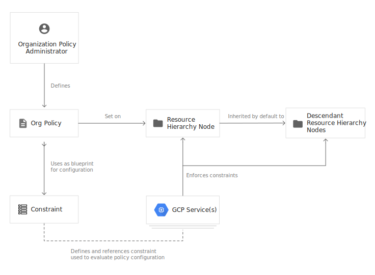
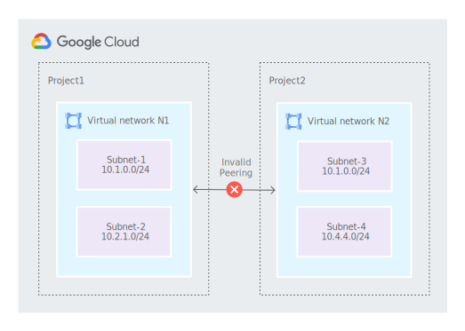

# Google Cloud - Cloud Security Engineer Certification

**UPDATED for 2024 Exam Edition**

[^1] A Cloud Security Engineer allows organizations to design and implement secure workloads and infrastructure on Google Cloud. Through an understanding of security best practices and industry requirements, this individual designs, develops, and manages a secure solution by using Google security technologies. A Cloud Security Engineer is proficient in identity and access management, defining organizational security structure and policies, using Google Cloud technologies to provide data protection, configuring network security defenses, monitoring environments for threats, security automation, AI security, the secure software supply chain, and enforcing regulatory controls.

## Section 1: Configuring Access (~27% of the exam)
### 1.1 - Managing Cloud Identity

Cloud Identity is an Identity as a Service (IDaaS) and enterprise mobility management (EMM) product. It offers the identity services and endpoint administration that are available in G Suite as a stand-alone product. As an administrator, you can use Cloud Identity to manage your users, apps, and devices from a central location—the Google Admin console.

There are free and premium editions of Cloud Identity. [Compare the differences](https://support.google.com/cloudidentity/answer/7431902)

**If you're a G Suite admin**
* Google Workspace licenses are required only for users who need certain Google Workspace services, like Gmail. To manage users who don't need any Workspace services, you can create free Cloud Identity accounts for them.  
* In most cases, Cloud Identity Free edition users have the same identity services as G Suite users, such as single sign-on (SSO) and 2-Step Verification (2SV).

**If you're a GCP admin**
* Consumer accounts, such as personal Gmail accounts or consumer accounts with work email IDs, are unmanaged accounts and are outside of your control. If developers in your organization use unmanaged accounts to use GCP resources, you can create Cloud Identity accounts to manage these users.
* You can create free Cloud Identity accounts for each user, separate from paid G Suite accounts. By doing so, you can manage all users across your entire domain from the Google Admin console.
* Cloud Identity Free edition provides common identity services, such as SSO.

You can manage Cloud Identity via the [REST API](https://cloud.google.com/identity/docs/reference/rest)

_Cloud Identity APIs_
* [Groups API](https://cloud.google.com/identity/docs/groups)
  * Allows you to create and manage different types of groups, each of which supports different features, as well as their memberships.

Google Recommends leveraging there [Client Libraries](https://cloud.google.com/apis/docs/client-libraries-explained) in order to interact with there APIs.

Enforce multi-factor authentication
* https://cloud.google.com/identity/solutions/enforce-mfa

Enable SSO for cloud apps:
* https://cloud.google.com/identity/solutions/enable-sso

Secure corporate access on personal devices:
* https://cloud.google.com/identity/solutions/secure-corp-on-personal-devices

The following diagram illustrates the flow for integrate you existing Identity and Access Management system.


* Grant roles to a Google group instead of to individual users when possible. It is easier to manage members in a Google group than to update an IAM policy. Make sure to control the ownership of the Google group used in IAM policies.

* Use the security principle of least privilege to grant IAM roles; that is, only give the least amount of access necessary to your resources.

* Grant roles at the smallest scope needed. For example, if a user only needs access to publish messages to a Pub/Sub topic, grant the Publisher role to the user for that topic. **_Remember that the policies for child resources inherit from the policies for their parent resources. For example, if the policy for a project grants a user the ability to administer Compute Engine virtual machine (VM) instances, then the user can administer any Compute Engine VM in that project, regardless of the policy you set on each VM. If you need to grant a role to a user or group that spans across multiple projects, set that role at the folder level instead of setting it at the project level._**

* Use labels to annotate, group, and filter resources.

* Audit your policies to ensure compliance. Audit logs contain all `setIamPolicy()` calls, so you can trace when a policy has been created or modified.

* Audit the ownership and the membership of the Google groups used in policies.

* If you want to limit project creation in your organization, change the organization access policy to grant the Project Creator role to a group that you manage.

### Perform Google Workspace Domain-Wide Delegation of Authority
In enterprise applications you may want to programmatically access a user's data without any manual authorization on their part. In G Suite domains, the domain administrator can grant third-party applications with domain-wide access to its users' data — this is known as domain-wide delegation of authority. To delegate authority this way, domain administrators can use service accounts with OAuth 2.0.

To access user data on a G Suite domain, the service account that you created needs to be granted access by a super administrator for the domain.

* [Control API access with domain-wide delegation](https://support.google.com/a/answer/162106?hl=en)

OAuth Scopes:
For example, if you require domain-wide access to Users and Groups enter: https://www.googleapis.com/auth/admin.directory.user, https://www.googleapis.com/auth/admin.directory.group


#### Configuring Google Cloud Directory Sync and third-party connectors

Google Cloud Directory Sync enables administrators to synchronize users, groups and other data from an Active Directory/LDAP service to their Google Cloud domain directory.

You need to enable Cloud Platform to recognize your users, using one of two recommended methods: Google Cloud directory sync (shown on the left below), or third-party identity provider connectors to Cloud Identity (shown on the right below).


Google Cloud uses Google identities for authentication and access management. Manually maintaining Google identities for each employee can add unnecessary management overhead when all employees already have an account in Active Directory. By federating user identities between Google Cloud and your existing identity management system, you can automate the maintenance of Google identities and tie their lifecycle to existing users in Active Directory.

Cloud Directory Sync queries the LDAP directory to retrieve the necessary information from the directory and uses the [Directory API](https://developers.google.com/admin-sdk/directory/) to add, modify, or delete users in your Cloud Identity or G Suite account.

[Preparing your Cloud Identity or G Suit account](https://cloud.google.com/architecture/identity/preparing-your-g-suite-or-cloud-identity-account)


There are multiple option for federation:
* [Microsoft Entra ID user Provisioning and SSO](https://cloud.google.com/architecture/identity/federating-gcp-with-azure-ad-configuring-provisioning-and-single-sign-on)
* [Micrsoft Entra ID B2B User provisioning and SSO](https://cloud.google.com/architecture/identity/azure-ad-b2b-user-provisioning-and-sso)
* [Microsoft Entra ID My Apps portal integration](https://cloud.google.com/architecture/identity/integrating-google-services-and-apps-with-azure-ad-portal)
* [Active Directory User Account Provisioning](https://cloud.google.com/architecture/identity/federating-gcp-with-active-directory-synchronizing-user-accounts)
* [Active Directory Single Sign-On](https://cloud.google.com/architecture/identity/federating-gcp-with-active-directory-configuring-single-sign-on)
* [Keycloack Single Sign-on](https://cloud.google.com/architecture/identity/keycloak-single-sign-on)
* [Okta user provisioning and single sign-on](https://cloud.google.com/architecture/identity/okta-provisioning-and-single-sign-on)

[Reference Architectures](https://cloud.google.com/architecture/identity/reference-architectures)

**Single sign-on process**

Cloud Identity and Google Workspace support [Security Assertion Markup Language (SAML) 2.0](https://en.wikipedia.org/wiki/Security_Assertion_Markup_Language) for single sign-on. SAML is open source standard for exchanging authentication and authorization data between a SAML IdP and SAML service provider. When you use SSO for Cloud Identity or Google Workspace, your external IdP is the SAML IdP and Google is the SAML service provider.

Google implements [SAML 2.0 HTTP POST binding](https://docs.oasis-open.org/security/saml/v2.0/saml-bindings-2.0-os.pdf#page=15), which specifies how auth information is exchanged between IdP and service provider. The following diagram illustrates an example of how the process works:


More detail on the process can be found in the [official documentation](https://cloud.google.com/architecture/identity/single-sign-on).

#### Workforce Identity Federation
Allow the use of an external identity provider (IdP) to authenticate and authorize a workforce—a group of users, such as employees, partners, and contractors—using IAM, so that the users can access Google Cloud services. With Workforce Identity Federation you don't need to synchronize user identities from your existing IdP to Google Cloud identities, as you would with Cloud Identity's Google Cloud Directory Sync (GCDS). Workforce Identity Federation extends Google Cloud's identity capabilities to support syncless, attribute-based single sign on.

After user authentication, information that is received from the IdP is used to determine the scope of access to the Google Cloud resources.

You can use Workforce Identity Federation with any IdP that supports [OpenID Connect (OIDC)](https://openid.net/connect/) or [SAML 2.0](http://docs.oasis-open.org/security/saml/Post2.0/sstc-saml-tech-overview-2.0.html), such as Azure Active Directory (Azure AD), Active Directory Federation Services (AD FS), Okta, and others.

**Workforce Identity Pools**
Provides the following capabilities of managing groups of workforce identities and their access to Google Cloud Resources:

* Group user identities; for example, employees or partners
* Grant IAM access to an entire pool or a subset thereof.
* Federate identities from one or more IdPs.
* Define policies on a group of users that require similar access permissions.
* Specify IdP-specific configuration information, including attribute mapping and attribute conditions.
* Enable the Google Cloud CLI and API access for third-party identities.
* Log access by users within a pool to Cloud Audit Logs, along with the pool ID.

Pools are configured at the Organization Level and are available across projects/folders, as long as you have the appropriate IAM permissions to view the pool. When you first set up Workforce Identity Federation for your organization, you provide a name for the pool. In IAM allow policies, you reference the pool by its name. Because of this, we recommend that you name the pool so that it clearly describes the identities it contains.

**_Create Workforce Identity Pool_**

```
gcloud iam workforce-pools create WORKFORCE_POOL_ID \
    --organization=ORGANIZATION_ID \
    --display_name="DISPLAY_NAME" \
    --description="DESCRIPTION" \
    --session-duration=SESSION_DURATION \
    --location=global
```
Replace the following:
* **WORKFORCE_POOL_ID**: an ID that you choose to represent your Google Cloud workforce pool. For information on formatting the ID, see the Query parameters section in the API documentation.
* **ORGANIZATION_ID**: the numeric organization ID of your Google Cloud organization.
* **DISPLAY_NAME**: Optional. A display name for your workforce identity pool.
* **DESCRIPTION**: Optional. A workforce identity pool description.
* **SESSION_DURATION**: Optional. The session duration, which determines how long the Google Cloud access tokens, console (federated) sign-in sessions, and gcloud CLI sign-in sessions from this workforce pool are valid. The duration must be greater than 15 minutes (900s) and less than 12 hours (43200s). If session duration is not set, it defaults to a duration of one hour (3600s).

**Workfoce Identity Pool Providers**

* An Entity that describes a relationship between your GCP Organization and your IdP.
* Follows [OAuth 2.0 Token Exchange Specification (RFC 8693)](https://datatracker.ietf.org/doc/html/rfc8693)
  *  You provide a credential from your external identity provider to the Security Token Service, which verifies the identity in the credential, and then returns a short-lived Google Cloud access token in exchange.
* Also supports OIDC flows ([authorization code flow](https://openid.net/specs/openid-connect-core-1_0.html#CodeFlowAuth) and [implicit flow](https://openid.net/specs/openid-connect-core-1_0.html#ImplicitFlowAuth)) for OIDC providers.
  * Authorization code flow is considered the most secure, because tokens are returned from the IdP in a separate, secure backend transaction, directly from the IdP to GCP, after users authenticate.

**_Create a Workforce Identity Pool Provider for SAML based Auth_**

```
gcloud iam workforce-pools providers create-saml PROVIDER_ID \
    --workforce-pool="WORKFORCE_POOL_ID" \
    --display-name="DISPLAY_NAME" \
    --description="DESCRIPTION" \
    --idp-metadata-path="XML_METADATA_PATH" \
    --attribute-mapping="ATTRIBUTE_MAPPING" \
    --attribute-condition="ATTRIBUTE_CONDITION" \
    --location=global
```

**_Create a Workforce Identity Pool Provider for OIDC (Code Flow) based Auth_**

```
gcloud iam workforce-pools providers create-oidc PROVIDER_ID \
    --workforce-pool=WORKFORCE_POOL_ID \
    --display-name="DISPLAY_NAME" \
    --description="DESCRIPTION" \
    --issuer-uri="ISSUER_URI" \
    --client-id="OIDC_CLIENT_ID" \
    --client-secret-value="OIDC_CLIENT_SECRET" \
    --web-sso-response-type="code" \
    --web-sso-assertion-claims-behavior="merge-user-info-over-id-token-claims" \
    --web-sso-additional-scopes="WEB_SSO_ADDITIONAL_SCOPES" \
    --attribute-mapping="ATTRIBUTE_MAPPING" \
    --attribute-condition="ATTRIBUTE_CONDITION" \
    --jwk-json-path="JWK_JSON_PATH" \
    --location=global
```

**_Create a Workforce Identity Pool Provider for OIDC (Implicit Flow) based Auth_**

```
gcloud iam workforce-pools providers create-oidc PROVIDER_ID \
    --workforce-pool=WORKFORCE_POOL_ID \
    --display-name="DISPLAY_NAME" \
    --description="DESCRIPTION" \
    --issuer-uri="ISSUER_URI" \
    --client-id="OIDC_CLIENT_ID" \
    --client-secret-value="OIDC_CLIENT_SECRET" \
    --web-sso-response-type="code" \
    --web-sso-assertion-claims-behavior="merge-user-info-over-id-token-claims" \
    --web-sso-additional-scopes="WEB_SSO_ADDITIONAL_SCOPES" \
    --attribute-mapping="ATTRIBUTE_MAPPING" \
    --attribute-condition="ATTRIBUTE_CONDITION" \
    --jwk-json-path="JWK_JSON_PATH" \
    --location=global
```

Replace the following:
* **PROVIDER_ID**: A unique provider ID. The prefix gcp- is reserved and can't be used in a pool or provider ID.
* **WORKFORCE_POOL_ID**: The workforce identity pool ID to connect your IdP to.
* **DISPLAY_NAME**: An optional user-friendly display name for the provider; for example, idp-eu-employees.
* **DESCRIPTION**: An optional workforce provider description; for example, IdP for Partner Example Organization employees.
* **ISSUER_URI**: 
  * The OIDC issuer URI, in a valid URI format, that starts with https; for example, https://example.com/oidc. Note: For security reasons, ISSUER_URI must use the HTTPS scheme.
* **OIDC_CLIENT_ID**: 
  * The OIDC client ID that is registered with your OIDC IdP; the ID must match the aud claim of the JWT that is issued by your IdP.
* **WEB_SSO_ADDITIONAL_SCOPES**: Optional additional scopes to send to the OIDC IdP for console (federated) or gcloud CLI browser-based sign-in.
* **ATTRIBUTE_MAPPING**: 
  * An attribute mapping. For Azure AD with OIDC authentication, we recommend the following attribute mappings:
    ```
      google.subject=assertion.sub,
      google.groups=assertion.groups,
      google.display_name=assertion.preferred_username
    ```
  * This example maps the IdP attributes subject, groups, and preferred_username to the Google Cloud attributes google.subject, google.groups, and google.display_name, respectively.
* **ATTRIBUTE_CONDITION**: 
  * An attribute condition; for example, to limit the ipaddr attribute to a certain IP range you can set the condition assertion.ipaddr.startsWith('98.11.12.') .
  * If your multitenant IdP has a single issuer URI, you must use attribute conditions to ensure that access is restricted to the correct tenant.
* **JWK_JSON_PATH**: 
  * An optional path to a locally uploaded OIDC JWKs. If this parameter isn't supplied, Google Cloud instead uses your IdP's /.well-known/openid-configuration path to source the JWKs containing the public keys. For more information about locally uploaded OIDC JWKs, see manage OIDC JWKs.
* **XML_METADATA_PATH**: The path to the XML-formatted metadata file with configuration metadata for the SAML identity provider.

Example for the entire process:
* [Configure Workforce Identity Federation with Azure AD and sign in users](https://cloud.google.com/iam/docs/workforce-sign-in-azure-ad)


### 1.2 Managing service accounts.

A service account is a special kind of account typically used by an application or compute workload, such as a Compute Engine instance, rather than a person. A service account is identified by its email address, which is unique to the account.

When using an application to access Cloud Platform APIs, we recommend you use a service account, an identity whose credentials your application code can use to access other GCP services. You can access a service account from code running on GCP, in your on-premises environment or even another cloud.

Service accounts differ from user accounts in a few key ways:

  * Service accounts do not have passwords, and cannot log in via browsers or cookies.
  * Service accounts are associated with private/public RSA key-pairs that are used for authentication to Google.
  * IAM permissions can be granted to allow other users (or other service accounts) to impersonate a service account.
  * Service accounts are not members of your Google Workspace domain, unlike user accounts. 
    * For example, if you share assets with all members in your Workspace domain, they will not be shared with service accounts. 
    * Similarly, any assets created by a service account cannot be owned or managed by Workspace or Cloud Identity admins. 
    * This doesn't apply when using domain-wide delegation, because API calls are authorized as the impersonated user, not the service account itself.

  NOTE: Service account keys are a security risk if not managed correctly. You should choose a more secure alternative to service account keys whenever possible. If you must authenticate with a service account key, you are responsible for the security of the private key and for other operations described by [Best practices for managing service account keys](https://cloud.google.com/iam/docs/best-practices-for-managing-service-account-keys). If you are prevented from creating a service account key, service account key creation might be disabled for your organization. For more information, see [Managing secure-by-default organization resources](https://cloud.google.com/resource-manager/docs/secure-by-default-organizations).

Service accounts can be divided into the following categories:
  * User-managed service accounts, which you create and manage yourself
    * _Default Service Accounts_ are user-managed service accounts that are created automatically when you enable or use certain Google Cloud services. 
      * These service accounts let the service deploy jobs that access other Google Cloud resources. You are responsible for managing default service accounts after they are created.
      * Services and the associated default service account
        * App Engine : **_project-id_@appspot.gserviceaccount.com**
        * Compute Engine: **_project-number_-compute@developer.gserviceaccount.com**
  * Service agents, which Google Cloud creates and manages
    * These are NOT created in your projects so you won't see them and can't access them directly
    * See [documentation](https://cloud.google.com/iam/docs/service-account-types#service-specific) for this

#### Securing and protecting service accounts (including default service accounts)

Use enforce the following organization policies to reduce security risks on Service accounts
  * `iam.disableServiceAccountKeyCreation` and `iam.disableServiceAccountKeyUpload` to disable the creation of service account keys to reduce the risk of credential exposure
  * `iam.automaticIamGrantsForDefaultServiceAccounts` to prevent default service accounts from recieving overly permissive IAM role of Editor
    * using this policy you will need to decide which roles to grant the default service accounts and grant them yourself
    * if the default service account has the Editor role you can use the [Policy Simulator](https://cloud.google.com/policy-intelligence/docs/simulate-iam-policies) to see the impact of removing the grant prior to making the change effective

Warning: Unless a role recommendation suggests it, don't revoke the roles that are granted to the Google APIs Service Agent. If you revoke these roles in a way that is not suggested by a role recommendation, some Google Cloud services will no longer work.

#### Identifying scenarios requiring service accounts
Its recommend to avoid using service account keys as much as possible.

The following diagram outlines the decision for when to use service accounts.


#### Creating, disabling, and authorizing service accounts

To create a service account you require the `roles/iam.serviceAccountCreator` IAM role for the project as well as the `roles/resourcemanager.projectIamAdmin` to grant newly created service accounts access to your project.

To edit/manage service (CRUD) accounts you require the `roles/iam.serviceAccountAdmin` IAM role

To only view service accounts your require the `roles/iam.serviceAccountView` IAM role

To only delete service accounts your require the `roles/iam.serviceAccountDeleter` IAM role

**List service accounts**

`gcloud iam service-accounts list`

**Edit a Service Account**

```
gcloud iam service-accounts update SA_NAME@PROJECT_ID.iam.gserviceaccount.com 
  --description="UPDATED_SA_DESCRIPTION" 
  --display-name="UPDATED_DISPLAY_NAME"
```

**Create a service account**

The service account's name appears in the email address that is provisioned during creation, in the format **_SERVICE_ACCOUNT_NAME_@P_ROJECT_ID_.iam.gserviceaccount.com**.

```
gcloud iam service-accounts create SERVICE_ACCOUNT_NAME \
  --description="DESCRIPTION" \
  --display-name="DISPLAY_NAME"
```

* **SERVICE_ACCOUNT_NAME**: 
  * an alphanumeric ID between 6 - 30 characters long and can contain lowercase alphanumeric characters and dashes.
  * once created it CANT be changed

 Optionally you grant you service account a specific IAM role using the following:

 ```
 gcloud projects add-iam-policy-binding PROJECT_ID \
  --member="serviceAccount:SERVICE_ACCOUNT_NAME@PROJECT_ID.iam.gserviceaccount.com" \
  --role="ROLE_NAME"
 ```

 **ROLE_NAME**: a role name, such as `roles/compute.osLogin`

 Also you can allow users to [attach the service account to other resources, such as Compute Engine,](https://cloud.google.com/iam/docs/attach-service-accounts) by running the following:

```
gcloud iam service-accounts add-iam-policy-binding \
  SERVICE_ACCOUNT_NAME@PROJECT_ID.iam.gserviceaccount.com \
  --member="user:USER_EMAIL" \
  --role="roles/iam.serviceAccountUser"
```

**Disabling/Enabling a Service Account**

Recommend disabling before deleting

```
gcloud iam service-accounts disable SA_NAME@PROJECT_ID.iam.gserviceaccount.com
```
```
gcloud iam service-accounts enable SA_NAME@PROJECT_ID.iam.gserviceaccount.com
```

**Delete/Undelete a Service Account**

_Deleting a Service Account_
`gcloud iam service-accounts delete SA_NAME@PROJECT_ID.iam.gserviceaccount.com`

If you delete a service account, then create a new service account with the same name, the new service account is treated as a separate 
identity; it does not inherit the roles granted to the deleted service account. In contrast, when you delete a service account, then 
undelete it, the service account's identity does not change, and the service account retains its roles.

When a service account is deleted, its role bindings are not immediately removed; they are automatically purged from the system after a 
maximum of 60 days. Until that time, the service account appears in role bindings with a deleted: prefix and a `?uid=NUMERIC_ID` suffix, 
where **NUMERIC_ID** is a unique numeric ID for the service account.

_Undeleting a Service Account_

The following criteria must be met before you can use the `undelete` command to undelete a service account:
* **The service account was deleted less then 30 days ago**
  * Beyond 30 days, the service account is permanently removed and Google Cloud cannot recover it event if you file a support request
* **There is no existing service account with the same name as the delete service account**
  * If you accidentally delete the service account `my-service-account@project-id.iam.gserviceaccount.com`, and you recreate a new one with thehsame name the new service account does not inherit the permissions of the deleted service account as its a completely separate from the deleted one. This means that you cannt undelete the previosu service account because the name already exists. To address this you must delete the new service account and undelete the original service account.

In order to find the _NUMERIC-ID_ of the service account you can search the Cloud Audit Logs using the following query:

```
resource.type="service_account"
resource.labels.email_id="SERVICE_ACCOUNT_EMAIL"
"DeleteServiceAccount"
```

Once the _NUMERIC__ID_ is located, for example _123456789012345678901_ run the following command to undelete the service account:
`gcloud beta iam service-accounts undelete 123456789012345678901`

Output:
```
restoredAccount:
    email: SA_NAME@PROJECT_ID.iam.gserviceaccount.com
    etag: BwWWE7zpApg=
    name: projects/PROJECT_ID/serviceAccounts/SA_NAME@PROJECT_ID.iam.gserviceaccount.com
    oauth2ClientId: '123456789012345678901'
    projectId: PROJECT_ID
    uniqueId: 'ACCOUNT_ID'
```

#### Securing, auditing and mitigating the usage of service account keys

To help secure service accounts, consider their dual nature:
  * Because a service account is a principal, you must limit its privileges to reduce the potential harm that can be done by a compromised service account.
  * Because a service account is a resource, you must protect it from being compromised.

Think of service accounts as resources that belong to—or are part of—another resource, such as a particular VM instance or an application.

To effectively manage service accounts, don't look at service accounts in isolation. Instead, consider them in the context of the 
resource they're associated with and manage the service account and its associated resource as one unit: 
  * Apply the same processes, same lifecycle, and same diligence to the service account and its associated resource, and use the same 
  tools to manage them.

Use Cloud Audit Logs for analyzing and missue of Service Account usage and administrative actions use the following filter:
* `protoPayload.serviceName="iam.googleapis.com"`


Sample log for creating service accounts:

```
{
  "protoPayload": {
    "@type": "type.googleapis.com/google.cloud.audit.AuditLog",
    "authenticationInfo": {
      "principalEmail": "example-user@example.com"
    },
    "methodName": "google.iam.admin.v1.CreateServiceAccount",
    "response": {
      "email": "my-service-account@my-project.iam.gserviceaccount.com",
      "@type": "type.googleapis.com/google.iam.admin.v1.ServiceAccount",
      "display_name": "My service account."
    }
  },
  "resource": {
    "type": "service_account"
  }
}
```

Other samples can be found [here](https://cloud.google.com/iam/docs/audit-logging/examples-service-accounts)

Tools to use to monitoring Service Account Usage:
* [Policy Intelligence](https://cloud.google.com/policy-intelligence/docs/overview)
  * When was the last time that a specific service account or key was used to authenticate?
  * Which service accounts in my project have not been used in the past 90 days?
* [Cloud Monitorin](https://cloud.google.com/iam/docs/service-account-monitoring)
  * provides long-term usage metrics for service accounts and keys that you can use to detect anomalies.
* [Event Threat Detection](https://cloud.google.com/security-command-center/docs/concepts-event-threat-detection-overview)
  * Reports when dormant service accounts trigger actions. 
  * Dormant service accounts are service accounts that have been inactive for more than 180 days.

Follow the [Best Practices](https://cloud.google.com/iam/docs/best-practices-service-accounts) for service accounts.

#### Managing and creating short-lived credentials
Short-lived credentials for a service account allows you to [impersonate the service account](https://cloud.google.com/iam/docs/service-account-impersonation), depending on the type of token you create, the short-lived token provides the identity (for ID tokens) or permissions (for access tokens) associated with the service account.

If your system architecture requires you to use a series of token generation calls, you can use a [delegation chain consisting of several service accounts](https://cloud.google.com/iam/docs/create-short-lived-credentials-delegated). In most cases, the direct method, as explained on this page, is sufficient.

Enable the following APIs:
`gcloud services enable iam.googleapis.com iamcredentials.googleapis.com`

Required permissions/roles:
* Service Account Token Creator (`roles/iam.serviceAccountTokenCreator`) which contains the following permissions in order to impersonate a service account:
  * `iam.serviceAccounts.getAccessToken` 
  * `iam.serviceAccounts.signBlob`
  * `iam.serviceAccounts.signJwt`
  * `iam.serviceAccounts.implicitDelegation`
  * lets you create the following types of short-lived credentials:
    * OAuth 2.0 access tokens, which you can use to authenticate with Google APIs
    * OpenID Connect (OIDC) ID tokens
    * Signed JSON Web Tokens (JWTs) and binary blobs

Need to attach a IAM policy binding in order for the action to work

When the CALLER is a service account :
```
gcloud iam service-accounts add-iam-policy-binding PRIV_SA \
  --member=serviceAccount:CALLER_SA --role=roles/iam.serviceAccountTokenCreator --format=json
```

When the CALLER is a user :
```
gcloud iam service-accounts add-iam-policy-binding PRIV_SA \
  --member=user:CALLER_ACCOUNT --role=roles/iam.serviceAccountTokenCreator --format=json
```

Then you can generate an access token:

```
gcloud auth login CALLER_ACCOUNT
gcloud auth print-access-token --impersonate-service-account=PRIV_SA
```

**Credential Access Boundaries**

_Credential Access Boundary_ is a policy language that you can use to downscope the accessing power of your GCP short-lived credentials. You can define a Credential Access Boundary that specifies which resources the short-lived credential can access, as well as an upper bound on the permissions that are available on each resource

_Note: Only Cloud Storage supports Credential Access Boundaries. Other Google Cloud services do not support this feature._

If you need to give principals a distinct set of permissions for each session, using Credential Access Boundaries can be more efficient than creating many different service accounts and granting each service account a different set of roles.

Defining a boundary rule:
You downscope a token by transmitting that token to a google token endpoint along with a boundary rule describing the resources and roles the credential should be restricted to.

The definition of a boundary rule is just json:

```
{
  "accessBoundaryRules": [
    {
      "availableResource": "string",
      "availablePermissions": [
        "list"
      ],
      "availabilityCondition": {
        "title": "string",
        "expression": "string"
      }
    }
  ]
}
```
where

* `AvailableResource` (required) This is the GCP resource (such as organization, folder, project, bucket, etc) to which access may be allowed (and allowed to resources below that resource if applicable). It must be in the format of a GCP Resource Name.
* `AvailablePermissions` (required) This is a list of permissions that may be allowed for use on the specified resource or resources below the specified resource. The only supported value is IAM role with syntax: "inRole:roles/storage.admin"
* `AvailabilityCondition` (optional) This describes additional fine-grained constraints to apply to the token. The expression parameter describes the resource condition this rule applies to in CEL Format.

As an example, the following would generate the token to just objectViewer on `example-bucket` and specifically an object (prefix) `/customer-a/invoices/`:
```
{
  "accessBoundary": {
    "accessBoundaryRules": [
      {
        "availablePermissions": [
          "inRole:roles/storage.objectViewer"
        ],
        "availableResource": "//storage.googleapis.com/projects/_/buckets/example-bucket",
        "availabilityCondition": {
          "expression":
            "resource.name.startsWith('projects/_/buckets/example-bucket/objects/customer-a/invoices/') || api.getAttribute('storage.googleapis.com/objectListPrefix', '').startsWith('customer-a/invoices/')"
        }
      }
    ]
  }
}
```

[Example for Credential Access Boundary](https://github.com/salrashid123/downscoped_token/blob/master/README.md)

#### Configuring Workload Identity Federation

Using _Workload Identity Federation_, you can provide on-premises or multicloud (AWS, Azure) workloads as well as deployment services such as Github and Gitlab with access to Google Cloud resources by using federated identities instead of a service account key. 

Workload Identity Federation supports any identity provider (IdP) that supports OpenID Connect (OIDC) or Security Assertion Markup Language (SAML) V2.0.

Follows the [OAuth 2.0 Token exchange specification](https://tools.ietf.org/html/rfc8693)

To federate workloads that don't have a public OIDC endpoint, you can upload [OIDC JSON Web Key Sets (JWKS)](https://auth0.com/docs/secure/tokens/json-web-tokens/json-web-key-sets) directly to the pool. This is common if you have Terraform or GitHub Enterprise hosted in your own environment or you have regulatory requirements not to expose public URLs.

##### Workload Identity Pool

A _workload identity pool_ is an entity that let's you manage external identities, it is recommended to create individualized pools for each non-Goolge Cloud environment that requires access to Google Cloud resources, such as deployment, staging, or production environments.

In order to manage _workload identity pools_ the following IAM permissions/roles are required:
* `roles/iam.workloadIdentityPoolViewer`:
  * To view pools and providers
* `roles/iam.workloadIdentityPoolAdmin`:
  * To view, create, update, and delete

**Create Pools**

```
gcloud iam workload-identity-pools create POOL_ID \
    --location="global" \
    --description="DESCRIPTION" \
    --display-name="DISPLAY_NAME"
```

##### Workload Identity Pool Providers

A _workload identity pool provider_ is an entity that describes a relationship between Google Cloud and your IdP, including the following:
* [AWS](https://cloud.google.com/iam/docs/workload-identity-federation-with-other-clouds#aws)
* [Azure](https://cloud.google.com/iam/docs/workload-identity-federation-with-other-clouds#azure)
* [GitHub](https://cloud.google.com/iam/docs/workload-identity-federation-with-deployment-pipelines#github-actions)
* [GitLab](https://cloud.google.com/iam/docs/workload-identity-federation-with-deployment-pipelines#gitlab-saas)
* [Azure DevOps](https://cloud.google.com/iam/docs/workload-identity-federation-with-deployment-pipelines#azure-devops)
* [Kubernetes clusters](https://cloud.google.com/iam/docs/workload-identity-federation-with-kubernetes#kubernetes)
* [GKE](https://cloud.google.com/iam/docs/workload-identity-federation-with-kubernetes#gke)
  * [Workload Identity For GKE](https://cloud.google.com/kubernetes-engine/docs/concepts/workload-identity)
* [AKS](https://cloud.google.com/iam/docs/workload-identity-federation-with-kubernetes#aks)
* [EKS](https://cloud.google.com/iam/docs/workload-identity-federation-with-kubernetes#eks)
* [Okta](https://medium.com/google-cloud/google-cloud-workload-identity-federation-with-okta-da50276101c0)
* [On-premises Active Directory Federation Services (AD FS)](https://cloud.google.com/iam/docs/workload-identity-federation-with-active-directory)
* [Terraform](https://cloud.google.com/iam/docs/workload-identity-federation-with-deployment-pipelines#terraform-cloud)

The tokens issued by your external IdP contain one or more attributes. Some IdPs refer to these attributes as claims.

Google Security Token Service tokens also contain one or more attributes, as listed in below:
Attribute mappings:
* `google.subject` (required):
  * A unique identifier for the user. This attribute is used in IAM principal:// role bindings and appears in Cloud Logging logs. The value must be unique and can't exceed 127 characters.
* `google.group` (optional):
  * A set of groups that the identity belongs to. This attribute is used in IAM principalSet:// role bindings to grant access to all members of a group.
* `attribute.{NAME}` (optional):
  * You can define up to 50 custom attributes and use these attributes in IAM principalSet:// role bindings to grant access to all identities with a certain attribute.

An _attribute mapping_ defines how to derive the value of the Google Security Token Service token attribute from an external token, examples can be found [here](https://cloud.google.com/iam/docs/workload-identity-federation#mapping).

An _attribute condition_ is a [CEL](https://github.com/google/cel-spec) expression that checks assertion attributes and target attributes, in order to evaluate to true otherwise the credential is rejected.

The following example only allows requests from identities that have a specific AWS role:

`attribute.aws_role == "ROLE_MAPPING"`

**Create an OIDC Workload Identity Pool Provider**
```
gcloud iam workload-identity-pools providers create-oidc PROVIDER_ID \
    --location="global" \
    --workload-identity-pool="POOL_ID" \
    --issuer-uri="ISSUER" \
    --attribute-mapping="MAPPINGS" \
    --attribute-condition="CONDITIONS"
```

**Create a SAML Workload Identity Pool Provider**
```
gcloud iam workload-identity-pools providers create-saml PROVIDER_ID \
    --location="global" \
    --workload-identity-pool="POOL_ID" \
    --idp-metadata-path="IDP_METADATA_PATH" \
    --attribute-mapping="MAPPINGS" \
    --attribute-condition="CONDITIONS"
```

To impersonate a service account you need to grant the external entity the Workload Identity User role (`roles.iam.workloadIdentityUser`) on a service account with roles required for the workload.

**Single Identity**
```
principal://iam.googleapis.com/projects/PROJECT_NUMBER/locations/global/workloadIdentityPools/POOL_ID/subject/SUBJECT_NAME
```

**All identities in a group**
```
principalSet://iam.googleapis.com/projects/PROJECT_NUMBER/locations/global/workloadIdentityPools/POOL_ID/group/GROUP_NAME
```

**All identities with a specific attribute value**
```
principalSet://iam.googleapis.com/projects/PROJECT_NUMBER/locations/global/workloadIdentityPools/POOL_ID/attribute.ATTRIBUTE_NAME/ATTRIBUTE_VALUE
```

**All identities in a pool**
```
principalSet://iam.googleapis.com/projects/PROJECT_NUMBER/locations/global/workloadIdentityPools/POOL_ID/*
```

##### Workload Identity Federation for GKE
_Workload Identity Federation for GKE_ is the recommended way for your workloads running on Google Kubernetes Engine (GKE) to access Google Cloud services in a secure and manageable way.


**Identity sameness**
If the metadata in your principal identifier is the same for workloads in multiple clusters that share a workload identity pool because they belong to the same Google Cloud project, IAM identifies those workloads as the same.

For example, consider the following diagram. Clusters A and B belong to the same workload identity pool. Google Cloud identifies applications that use the back-ksa ServiceAccount in the backend namespace of both Cluster A and Cluster B as the same identity. IAM doesn't distinguish between the clusters making the calls.


This identity sameness also means that you must be able to trust every cluster in a specific workload identity pool. For example, if a new cluster, Cluster C in the previous example was owned by an untrusted team, they could create a backend namespace and access Google Cloud APIs using the back-ksa ServiceAccount, just like Cluster A and Cluster B.

To avoid untrusted access, place your clusters in separate projects to ensure that they get different workload identity pools, or ensure that the namespace names are distinct from each other to avoid a common principal identifier.

Every node in a GKE with Workload Identity Federation for GKE enabled stores its metadata on the GKE metadata server. The GKE metadata server is a subset of the Compute Engine metadata server endpoints required for Kubernetes workloads.

The GKE metadata server runs as a DaemonSet, with one Pod on every Linux node or a native Windows service on every Windows node in the cluster. The metadata server intercepts HTTP requests to http://metadata.google.internal (169.254.169.254:80). For example, the GET /computeMetadata/v1/instance/service-accounts/default/token request retrieves a token for the IAM service account that the Pod is configured to impersonate. Traffic to the GKE metadata server never leaves the VM instance that hosts the Pod.

**Create a GKE Cluster with Workload Identity Federation enabled**
```
gcloud container clusters create CLUSTER_NAME \
    --location=LOCATION \
    --workload-pool=PROJECT_ID.svc.id.goog
```

This command will do the following:
* create a fixed workload identity pool for the the cluster in the GCP project with the following format:
  * `PROJECT_ID.svc.id.goog`
* Registers the GKE cluster as an identity provider in the workload identity pool
* Deploys the GKE metadata server, which intercepts credential requests from workloads, on every node.

Following this you need to configure applications to use Workload Identity Federation for GKE, walkthrough found [here](https://cloud.google.com/kubernetes-engine/docs/how-to/workload-identity#authenticating_to).

#### Managing service account impersonation

When an authenticated principal, such as a user or another service account, authenticates as a service account to gain the service account's permissions, it's called impersonating the service account. Impersonating a service account lets an authenticated principal access whatever the service account can access. Only authenticated principals with the appropriate permissions can impersonate service accounts.

Impersonation is useful when you want to change a user's permissions without changing your Identity and Access Management (IAM) policies.

Google Cloud service account impersonation is similar to Amazon Web Services (AWS) Security Token Service API methods like `AssumeRole`.

Service account impersonation is useful when you need to do tasks like the following:
  * Grant a user temporary elevated access
  * Test whether a specific set of permissions is sufficient for a task
  * Locally develop applications that can only run as a service account
  * Authenticate external applications

Required permissions/roles:
* Service Account Token Creator (`roles/iam.serviceAccountTokenCreator`) which contains the following permissions in order to impersonate a service account:
  * `iam.serviceAccounts.getAccessToken` 
  * `iam.serviceAccounts.signBlob`
  * `iam.serviceAccounts.signJwt`
  * `iam.serviceAccounts.implicitDelegation`
  * lets you create the following types of short-lived credentials:
    * OAuth 2.0 access tokens, which you can use to authenticate with Google APIs
    * OpenID Connect (OIDC) ID tokens
    * Signed JSON Web Tokens (JWTs) and binary blobs

To impersonate a service account use the `--impersonate-service-account` flag in the `gcloud` command line:
* `gcloud auth application-default login --impersonate-service-account SERVICE_ACCT_EMAIL`
* `gcloud storage buckets list --impersonate-service-account=SERVICE_ACCT_EMAIL`

You can also use impersonation in several other ways:
* By default with the Google CLI : `gcloud config set auth/impersonate_service_account SERVICE_ACCT_EMAIL`


### 1.3 Managing authentication

#### Creating a password and session management policy for user accounts
12 Best Practices on managing passwords - [here](https://cloud.google.com/blog/products/gcp/12-best-practices-for-user-account)

Set up password policy for users following the best practices found [here](https://cloud.google.com/solutions/modern-password-security-for-users.pdf) as well as best practices for system/app authentication [here](https://cloud.google.com/solutions/modern-password-security-for-system-designers.pdf).

Set up session management and force re-authentication for users in Admin Console, [here](https://cloud.google.com/blog/products/identity-security/improve-security-posture-with-time-bound-session-length)

**When password policies don't apply**
* You can update user passwords as a hash by using the bulk user upload tool or the [Google Workspace Password Sync](https://apps.google.com/supportwidget/articlehome?hl=en&article_url=https%3A%2F%2Fsupport.google.com%2Fa%2Fanswer%2F2611842%3Fhl%3Den&assistant_id=generic-unu&product_context=2611842&product_name=UnuFlow&trigger_context=a) tool. However, if you apply password policies to an entire organizational unit and then upload passwords as a hash for a subset of users in that unit, the policies are not enforced for that subset of users. 
* Password policies don't apply to any user passwords that you reset manually. If you manually reset a password, make sure to select Enforce password policy at next sign-in for that user.
* The password policies you configure don't apply to users who are authenticated on a third-party identity provider (IdP) using SAML.

Enabling SSO for Cloud Apps [here](https://cloud.google.com/identity/solutions/enable-sso)

#### Setting up Security Assertion Markup Language (SAML) and OAuth

Configure SSO / SAML: https://apps.google.com/supportwidget/articlehome?hl=en&article_url=https%3A%2F%2Fsupport.google.com%2Fa%2Fanswer%2F12032922%3Fhl%3Den&assistant_id=generic-unu&product_context=12032922&product_name=UnuFlow&trigger_context=a


#### Configuring and enforcing two-step verification

Configuring and enforcing Two-Factor Auth(2mfa): https://cloud.google.com/identity/solutions/enforce-mfa

If Cloud Identity is your identity provider (IdP), you can implement 2SV in several ways. If you use a third-party IdP, check with them about their 2SV offering.

You can select different levels of 2SV enforcement:

* Optional—employee decides if they will use 2SV.
* Mandatory—employee chooses the 2SV method.
* Mandatory security keys—employee must use a security key.

https://apps.google.com/supportwidget/articlehome?hl=en&article_url=https%3A%2F%2Fsupport.google.com%2Fa%2Fanswer%2F9176657%3Fhl%3Den&assistant_id=generic-unu&product_context=9176657&product_name=UnuFlow&trigger_context=a

### 1.4 Managing and implementing authorization controls

#### Managing privileged roles and separation of duties with Identity and Access Management (IAM) roles and permissions

Best practices for IAM Security can be found [here](https://cloud.google.com/iam/docs/using-iam-securely)

**Cloud IAM best Practices**
* Use groups when configuring GCP access
* Assign roles to the groups instead of individual users
* Utilizing predefined roles offers less admin overhead
* Predefined roles are managed by Google
* Custom roles are **NOT** managed by Google
* Audit logs record project-level permission changes
* Audit policy changes
* Export audit logs to Cloud Storage to store logs for longer periods of time
* Service Account Key Rotation
  * Create a new key, update app config, delete old key

The following command lists all grantable roles for a given resource.
```
gcloud iam list-grantable-roles [full-resource-name]
```

##### Temporary elevated access

One way to protect sensitive resources is to limit access to them. However, limiting access to sensitive resources also creates friction for anyone who occasionally needs to access those resources. For example, a user might need break-glass, or emergency, access to sensitive resources to resolve an incident.

In these situations, we recommend giving the user permission to access the resource temporarily. We also recommend that, to improve auditing, you record the user's justification for accessing the resource.

In Google Cloud, there are several ways that you can manage this kind of temporary elevated access.

**Privileged Access Management**
**_Currently in PREVIEW_**

You can use Privileged Access Manager (PAM) to manage just-in-time temporary privilege elevation for select principals, and to view audit logs afterwards to find out who had access to what and when.

See [overview](https://cloud.google.com/iam/docs/pam-overview) for more details.
See [Requesting temporary elevated access](https://cloud.google.com/iam/docs/pam-request-temporary-elevated-access) for more info on requesting temp elevation.

**Google Groups**

One way to manage temporary elevated access is to grant a Google group access to sensitive resources, then add and remove users from that group to control their access.

To set up a Google group for temporary elevated access:
  * first create a group, then grant it the roles that you want to temporarily give to users. If you use deny policies, also consider making the group exempt from any relevant deny rules to avoid unexpected denials.

After you set up your group, you can add and remove users to modify their access. If you use the Google Groups API, you can temporarily add users to a group by using [membership expiration](https://cloud.google.com/identity/docs/how-to/manage-expirations).

NOTE: Membership Expiration is only available to Google Workspace Enterprise Standard, Enterprise Plus, and Enterprise for Education, and Cloud Identity Premium accounts.

**Principal Access Boundary**
**_Currently In PREVIEW_**
Principal access boundary (PAB) policies let you restrict the resources that principals can access.

For example, you can use principal access boundary policies to prevent your principals from accessing resources in other organizations, which can help prevent phishing attacks or data exfiltration.

See [overview](https://cloud.google.com/iam/docs/principal-access-boundary-policies) for more details.

**Just-in-time privileged access**
Just-In-Time Access is an open source application that uses IAM Conditions to grant users just-in-time privileged access to Google Cloud resources. This application is designed to run on App Engine or Cloud Run.

This application has the following benefits over manually adding conditional role bindings:

Users can search for roles that they can activate with Just-In-Time Access.
Users are required to provide justifications before getting access.
The application replaces the existing conditional binding instead of creating new bindings, which helps maintain your IAM allow policy size.
For more information about Just-In-Time Access, see [Manage just-in-time privileged access to projects](https://cloud.google.com/architecture/manage-just-in-time-privileged-access-to-project).

#### Managing IAM and access control list (ACL) permissions

Exclusively using IAM and enabling [uniform bucket-level access](https://cloud.google.com/storage/docs/using-uniform-bucket-level-access#command-line) allows you to use other Google Cloud security features such as domain restricted sharing, workforce identity federation, and IAM Conditions.

You most likely want to use ACLs in the following cases:
* You need to customize access to individual objects within a bucket. ACLs can be set for individual objects, while IAM permissions can only be granted at the bucket level or higher.
* You are exclusively using the [XML API](https://cloud.google.com/storage/docs/xml-api/overview) or require [interoperability](https://cloud.google.com/storage/docs/interoperability) with Amazon S3.

IAM and ACLs work in tandem to grant access to your buckets and objects, which means a user only needs the relevant permission from either of these systems in order to access a bucket or object.

In most cases IAMs are the recommended approach for giving access to resources.

* ACLs
  * An access control list (ACL) is a mechanism you can use to define who has access to your buckets and objects, as well as what level of access they have. In Cloud Storage, you apply ACLs to individual buckets and objects. Each ACL consists of one or more entries. An entry gives a specific user (or group) the ability to perform specific actions. Each entry consists of two pieces of information:

    * A [**permission**](https://cloud.google.com/storage/docs/access-control/lists#permissions), which defines what actions can be performed (for example, read or write).
    * A [**scope**](https://cloud.google.com/storage/docs/access-control/lists#scopes) (sometimes referred to as a grantee), which defines who can perform the specified actions (for example, a specific user or group of users).

* Legacy Bucket Cloud IAM roles work in tandem with bucket ACLs: 
  * when you add or remove a Legacy Bucket role, the ACLs associated with the bucket reflect your changes. Similarly, changing a bucket-specific ACL updates the corresponding Legacy Bucket role for the bucket.
    * _(IAM) Storage Legacy Bucket Reader = (ACL)Bucket Reader_
    * _(IAM) Storage Legacy Bucket Writer = (ACL) Bucket Writer_
    * _(IAM) Storage Legacy Bucket Owner = (ACL) Bucket Owner_

* Predefined ACLs
  * https://cloud.google.com/storage/docs/access-control/lists#predefined-acl
  * CAUTION: By applying a predefined ACL to an existing bucket or object, you completely replace the existing bucket or object ACL with the predefined ACL. This change might cause you to lose access to the bucket or object ACL in some cases.
* IAMs
  * https://cloud.google.com/storage/docs/access-control/iam#overview
  * https://cloud.google.com/storage/docs/access-control/iam-permissions
  * Cloud IAM allows you to control who has access to the resources in your Google Cloud project. 
    * Resources include Cloud Storage buckets and objects stored within buckets, as well as other Google Cloud entities such as Compute Engine instances.
  * The set of access rules you apply to a resource is called a Cloud IAM policy. A Cloud IAM policy applied to your project defines the actions that users can take on all objects or buckets within your project. A Cloud IAM policy applied to a single bucket defines the actions that users can take on that specific bucket and objects within it.
    * For example, you can create a Cloud IAM policy for one of your buckets that gives one user administrative control of that bucket. Meanwhile, you can add another user to your project-wide Cloud IAM policy that gives that user the ability to view objects in any bucket of your project.
  * Roles are a bundle of one or more permissions. For example, the Storage Object Viewer role contains the permissions storage.objects.get and storage.objects.list. You assign roles to members, which allows them to perform actions on the buckets and objects in your project.
  * Granting roles at the bucket level does not affect any existing roles that you granted at the project level, and vice versa. For example, say you want to give a user permission to read objects in any bucket but create objects only in one specific bucket. To achieve this, give the user the Storage Object Viewer role at the project level, thus allowing the user to read any object stored in any bucket in your project, and give the user the Storage Object Creator role at the bucket level for a specific bucket, thus allowing the user to create objects only in that bucket. Some roles can be used at both the project level and the bucket level. When used at the project level, the permissions they contain apply to all buckets and objects in the project. When used at the bucket level, the permissions only apply to a specific bucket and the objects within it. Examples of such roles are Storage Admin, Storage Object Viewer, and Storage Object Creator. Some roles can only be applied at one level. For example, you can only apply the Viewer role at the project level, while you can only apply the Storage Legacy Object Owner role at the bucket level.
  * All other bucket-level Cloud IAM roles, and all project-level Cloud IAM roles, work independently from ACLs. For example, if you give a user the Storage Object Viewer role, the ACLs remain unchanged.

In most cases, IAM is the recommended method for controlling access to your resources:
* IAM provides access control across all of Google Cloud.
* IAM has greater control over what actions users are allowed to perform.
* IAM permissions granted to parent resources, such as projects, are inherited by child resources, such as buckets and objects, allowing you to more easily manage access to resources.
* IAM permissions can be applied to managed folders, while ACLs cannot.
* ACLs cannot be used exclusively to control access to your resources, because ACLs cannot be set on the overall project or other parent resources.

**Creating / Managing ACLs**
Required Roles : `roles/storage.admin`

`gcloud storage objects update gs://BUCKET_NAME/OBJECT_NAME FLAG`

FLAG: 
* `--add-acl-grant`: "--add-acl-grant=entity=user-john@gmail.com,role=READER"
* `--remove-acl-grant`: "--remove-acl-grant=user-john@gmail.com"

Can also pass in a JSON/YAML file detailing the grants you want to apply

`gcloud storage objects update gs://BUCKET_NAME/OBJECT_NAME --acl-file=FILE_LOCATION`

The file contents:
```
[
  {
    "entity": "project-owners-867489160491",
    "role": "OWNER",
    "projectTeam": {
      "projectNumber": "867489160491",
      "team": "owners"
    },
  },
  {
    "entity": "user-jane@gmail.com",
    "email": "jane@gmail.com",
    "role": "OWNER"
  },
  {
    "entity": "group-gs-announce@googlegroups.com",
    "email": "gs-announce@googlegroups.com",
    "role": "READER"
  }
]
```
#### Granting permissions to different types of identities, including using IAM conditions and IAM deny policies

##### IAM Conditions

You can use [IAM Conditions](https://cloud.google.com/iam/docs/conditions-overview) to define and enforce conditional, attribute-based access control for Google Cloud resources.

You can use conditions in the following places:
* Allow policies
* Deny policies
* Policy bindings for principal access boundary policies **PRE-GA PREVIEW**

The structure of Conditions in a role binding is as follows:

```
"bindings": [
  {
    "role": "ROLE",
    "members": [
      "MEMBER_1",
      "MEMBER_2"
    ],
    "condition": {
      "title": "TITLE",
      "description": "DESCRIPTION",
      "expression": "EXPRESSION"
    }
  }
]
```

IAM Conditions which leverages the [_Common Express Language (CEL)_](https://cloud.google.com/iam/docs/conditions-overview#cel) to specify conditions.

To learn more about the _Condition_ structure visit the official [documentation](https://cloud.google.com/iam/docs/conditions-overview#structure)

To manage conditional role bindings the following roles are required:
* `roles/resourcemanager.projectIamAdmin`
  * Manage access on the project
* `roles/resourcemanager.folderAdmin`
  * Managed access on the folder
* `roles/resourcemanager.organizationAdmin`
  * Manage access at the org level
* `roles/iam.securityAdmin`: 
  * To manage access to almost all GCP resources on the project, folder, or organization that you want to manage access to

**Allow Policies**
Use conditions in _allow polices_ when you want to grant access to principals only if specified conditions are met.
For example: granting temporary access to users so they can resolved a production issue, or you could grant acces only to employees making requests from you corporate network.

As stated above _conditions_ are specified as part of the IAM role binding of a resource policy


Examples

**Grant temporary access**

_Role Binding in IAM Policy_
```
{
  "bindings": [
    {
      "members": [
        "user:project-owner@example.com"
      ],
      "role": "roles/owner"
    },
    {
      "members": [
        "user:travis@example.com"
      ],
      "role": "roles/iam.securityReviewer",
      "condition": {
        "title": "Expires_July_1_2020",
        "description": "Expires on July 1, 2020",
        "expression":
          "request.time < timestamp('2020-07-01T00:00:00.000Z')"
      }
    }
  ],
  "etag": "BwWKmjvelug=",
  "version": 3
}
```

Example: Resource-based access

The resource name attribute can control access to the following Google Cloud services:
* Apigee
* Application Integration
* Backup and DR Service
* BigQuery
* Bigtable
* Binary Authorization
* Cloud Deploy
* Cloud Key Management Service
* Cloud Logging
* Cloud SQL
* Cloud Storage
* Compute Engine
* Dataform
* Google Kubernetes Engine
* Integration Connectors
* Pub/Sub Lite
* Secret Manager
* Spanner

```
{
  "bindings": [
    {
      "members": [
        "user:project-owner@example.com"
      ],
      "role": "roles/owner"
    },
    {
      "members": [
        "group:devs@example.com"
      ],
      "role": "roles/compute.instanceAdmin",
      "condition": {
          "title": "Dev_access_only",
          "description": "Only access to devAccess* VMs",
          "expression":
            "(resource.type == 'compute.googleapis.com/Disk' &&
            resource.name.startsWith('projects/project-123/regions/us-central1/disks/devAccess')) ||
            (resource.type == 'compute.googleapis.com/Instance' &&
            resource.name.startsWith('projects/project-123/zones/us-central1-a/instances/devAccess')) ||
            (resource.type != 'compute.googleapis.com/Instance' &&
            resource.type != 'compute.googleapis.com/Disk')"
      }
    }
  ],
  "etag": "BwWKmjvelug=",
  "version": 3
}
```
Update IAM Policy : `gcloud projects set-iam-policy project-id filepath`

##### Deny Policies
You use _deny polices_ to deny access to a principle. 
Each deny policy is attached to a Google Cloud organization, folder, or project. 
A deny policy contains deny rules, which identify principals and list the permissions that the principals cannot use.

Deny policies are separate from allow policies, also known as IAM policies. 
An allow policy provides access to resources by granting IAM roles to principals.

To manage _Deny Policies_ the following roles are required:
* `roles/iam.denyReviewer`: to view deny policies
* `roles/iam.denyAdmin`: to manage deny policies

Only certain permission can be denied as part of a deny policy, see this [list](https://cloud.google.com/iam/docs/deny-permissions-support) for supported permissions.


Each _deny policy_ is attached to an organization, folder, or project and can have up to 500 deny policies. When attached to one of these resources, deny policies are inherited by all lower-level resources in that project, folder, or organization.

See details on [attachment point](https://cloud.google.com/iam/docs/deny-access#attachment-point).

The following make up a deny policy:
* The permission(s) to deny
* The principal(s) that are being denied those permission(s)
* Optional you can specific exempt principal(s)
* Optionally you can add a condition that specific when the principals cannot use the permissions

Format of the deny rule:
```
{
  "displayName": "POLICY_NAME",
  "rules": [
    {
      "denyRule": DENY_RULE_1
    },
    {
      "denyRule": DENY_RULE_2
    },
    {
      "denyRule": DENY_RULE_N
    }
  ]
}
```

Example defines one deny rule that denies one permission to the user david@company.com:

```
{
  "displayName": "My deny policy.",
  "rules": [
    {
      "denyRule": {
        "deniedPrincipals": [
          "principal://goog/subject/david@company.com"
        ],
        "deniedPermissions": [
          "iam.googleapis.com/roles.create"
        ]
      }
    }
  ]
}
```

```
gcloud iam policies create my-deny-policy \
    --attachment-point=cloudresourcemanager.googleapis.com/projects/my-project \
    --kind=denypolicies \
    --policy-file=policy.json
```

Each deny policy contains an `etag` field that identifies the policy version. The `etag` changes each time you update the policy. 
When you write the updated policy, the `etag` in your request must match the current `etag` stored in IAM; if the values do not
match, the request fails. This feature helps prevent concurrent changes from overwriting each other.

##### Principal Access Boundary

**CURRENT IN PREVIEW**
Principal access boundary (PAB) policies let you limit the resources that a set of principals are eligible to access.

Roles required: 
* `roles/iam.principalAccessBoundaryAdmin`

[Creating a PAB policy](https://cloud.google.com/iam/docs/principal-access-boundary-policies-create#gcloud)


#### Designing identity roles at the organization, folder, project, and resource level


IAM lets you set policies at the following levels of the resource hierarchy:

* Organization level.
  * The organization resource represents your company. IAM roles granted at this level are inherited by all resources under the organization. For more information, see Access control for organizations using IAM.
    * Users who are not owners, including organization administrators, must be assigned either the `Organization Role Administrator role (roles/iam.organizationRoleAdmin)` or the IAM `Role Administrator role (roles/iam.roleAdmin)`. The IAM `Security Reviewer role (roles/iam.securityReviewer)` enables the ability to view custom roles but not administer them.

* Folder level.
  * Folders can contain projects, other folders, or a combination of both. Roles granted at the highest folder level will be inherited by projects or other folders that are contained in that parent folder. For more information, see Access control for folders using IAM.

* Project level.
  * Projects represent a trust boundary within your company. Services within the same project have a default level of trust. For example, App Engine instances can access Cloud Storage buckets within the same project. IAM roles granted at the project level are inherited by resources within that project. For more information, see Access control for projects using IAM.

* Resource level.
  * In addition to the existing Cloud Storage and BigQuery ACL systems, additional resources such as Genomics Datasets, Pub/Sub topics, and Compute Engine instances support lower-level roles so that you can grant certain users permission to a single resource within a project.

IAM policies are hierarchical and propagate down the structure. The effective policy for a resource is the union of the policy set at that resource and the policy inherited from its parent.

The following examples explain how policy inheritance works in practice.

**Example: Pub/Sub**
In Pub/Sub, topics and subscriptions are resources that live under a project. Assume that project_a has a topic topic_a under it. If you set a policy on project_a that grants the Editor role to bob@example.com, and set a policy on topic_a that grants the Publisher role to alice@example.com, you effectively grant the Editor role to bob@example.com and the Publisher role to alice@example.com for topic_a.

The following diagram illustrates the preceding example.


Other Examples can be found [here](https://cloud.google.com/iam/docs/resource-hierarchy-access-control)
Best Practices can be found [here](https://cloud.google.com/iam/docs/resource-hierarchy-access-control#best_practices)

#### Configuring Access Context Manager

Access Context Manager allows enterprises to configure access levels which map to a policy defined on request attributes.

Access Context Manager allows Google Cloud organization administrators to define fine-grained, attribute based access control for projects and resources in Google Cloud.

Access levels describe the requirements for requests to be honored. Examples include:
* Device type and operating system
* IP address
* User identity

Administrators first define an access policy, which is an organization-wide container for access levels and service perimeters.


Service perimeters define sandboxes of resources which can freely exchange data within the perimeter, but are not allowed to export data outside of it. Access Context Manager isn't responsible for policy enforcement. Its purpose is to describe the desired rules. Policy is configured and enforced across various points, such as [VPC Service Controls](https://cloud.google.com/vpc-service-controls). 

Access Context Manager is an integral part of the [BeyondCorp](https://cloud.google.com/beyondcorp/) effort at Google. 

You can configure and enforce Access Context Manager policies across the following [Chrome Enterprise](https://chromeenterprise.google/). solution Premium components:
* [VPC Service Controls](https://cloud.google.com/vpc-service-controls/docs/use-access-levels)
* [Identity-Aware Proxy](https://cloud.google.com/iap/docs/cloud-iap-context-aware-access-howto)
* [Context-Aware Access for Google Workspace](https://support.google.com/a/answer/9262032?&ref_topic=9262521)
* [Identity and Access Management (IAM) conditions](https://cloud.google.com/iam/docs/conditions-overview#example-access-level)

An access policy collects the service perimeters and access levels you create for your Organization. An Organization can only have one access policy.

When service perimeters are created and managed using the VPC Service Controls page of the Cloud Console, you do not need to create an access policy.

IAM Roles/Permissions required:

* accesscontextmanager.policies.create
  - Privided by the `roles/accesscontextmanager.policy.Editor` role
  - Allow creation of an orginzation-level access policy or scoped policies
* accesscontextmanager.policies.list
  - Provided by `roles/accesscontextmanager.policyEditor` and `roles/accesscontextmanager.policyReader`
  - Lists an organization-level access policy or scoped policies

**Create an access policy**
```
gcloud access-context-manager policies create --organization ORGANIZATION_ID --title POLICY_TITLE
```

You can use the `--scopes=SCOPE` flag to to specify which folder/project this policy apply too, only one folder or project can be specified.
If no _scope_ is supplied it applies to the entire organization

You can delegate administration by binding a principal and role with a scoped access policy, by using the `add-iam-policy-binding` command
```
gcloud access-context-manager policies add-iam-policy-binding [POLICY] --member=PRINCIPAL --role=ROLE
```
_ROLE_ is the role name to assign to the principal. The role name is the complete path of a predefined role, such as `roles/accesscontextmanager.policyReader`, or the role ID for a custom role, such as `organizations/{ORGANIZATION_ID}/roles/accesscontextmanager.policyReader`.

Set the default policy:

```
gcloud config set access-context-manager/policy POLICY_NAME
```

You can update the access levels of you organization by using the bulk management apis using gcloud cli:

```
gcloud access-context-manager levels replace-all \
  --source-file=FILE \
  --etag=ETAG \
  [--policy=POLICY_NAME]
```
 `FILE` is a `.yaml` file containing the access levels as shown below:

 ```
- name: accessPolicies/11271009391/accessLevels/corpnet_access
  title: Corpnet Access
  description: Permit access to corpnet.
  basic:
    combiningFunction: AND
    conditions:
      - ipSubnetworks:
        - 252.0.2.0/24
        - 2001:db8::/32
- name: accessPolicies/11271009391/accessLevels/prodnet_access
  title: Prodnet Access
  description: Permit access to prodnet.
  basic:
    combiningFunction: OR
    conditions:
      - members:
        - user:exampleuser@example.com
        - serviceAccount:exampleaccount@example.iam.gserviceaccount.com
      - ipSubnetworks:
        - 176.0.2.0/24
 ```

#### Applying Policy Intelligence for better permission management
_Policy Intelligence_ tools help you understand and manage your policies to proactively improve your security configuration.

_Cloud Asset Inventory_ provides **Policy Analyzer** for IAM allow policies, which lets you find out what principals have access to which Google Cloud resources based on your IAM allow policies.


#### Managing permissions through groups

### 1.5 Defining resource hierarchy.

#### Creating and managing organizations at scale

The following diagram outlines a sample resource outline in Google Cloud:
.

The _Origanization_ node is the root node and all access control policies will trickle down from there. Org admins can set [Originizational Policies](https://cloud.google.com/resource-manager/docs/organization-policy/overview), which is a configuration of restrictions that enforce access control to folders and/or projects at the organization level on resources and their descendants. Available for Google Workspace and Cloud Identity.

Best Practices For Organizations can be found [here](https://cloud.google.com/docs/enterprise/best-practices-for-enterprise-organizations).

Key Best Practices:
* Map you organizational structure to GCP
  * Top level node represents you organization, folders represent business units/departments and/or teams.
* Federate your identity provider with Google Cloud
  * If your organization uses an on-premises or third-party identity provider, synchronize your user directory with Cloud Identity to let users access Google Cloud with their corporate credentials. This way, your identity platform remains the source of truth while Cloud Identity controls how your employees access Google services.

The following image outlines an example of  resource hierarchy illustrating the core account-level resources involved in administering your Google Cloud account.


  * Billing Account:
    * Tracks all organizational costs
      * Linked to one or more projects
  * Domain:
    * Your company Domain is the primary identity of your organization and establishes your company's identity with Google services, including Google Cloud.
    * Can be linked to either a Google Workspace or Cloud Identity Account
  * Organization:
    * Highest unit
    * Using [Google Workspace](https://support.google.com/a/answer/53926) and [Cloud Identity](https://cloud.google.com/identity/docs/set-up-cloud-identity-admin)
    * Common place to register your domain as the org name
  * Folders:
    * Orgs can have one or more folders
    * Common practice is to have folders represent departments in an org
    * Max 100 folders under a single folder or up to four levels of folder nesting
  * Projects:
    * A unit of resource management below folders
    * Contains a set of users, API permission, billing information and provisioned resources
    * Identified by their project ID which should be unique to each org
    * Auto-generated by GCP
      * Cloud Deployment Manager
      * Terraform
      * Ansible
    * Users and roles specified per project
  * Resources:
    * Instance of offerings and services of GCP
    * Roles are defined to manage access

The following diagram outlines a sample resource outline in Google Cloud:
.

When you set an organization policy on a resource hierarchy node, all descendants of that resource hierarchy node inherit the organization policy by default. If you set an organization policy at the root organization node, then those restrictions are inherited by all child folders, projects, and resources.
You can set custom organization policy on child nodes, which will overwrite or merge with the inherited policy based on the rules of hierarchy evaluation.

**Resource Management Best Practices**

1. Mirror your Google Cloud resource hierarchy structure to your organization structure. The Google Cloud resource hierarchy should reflect how your company is organized, whether it's a startup, a SME, or a large corporation. A startup may start out with a flat resource hierarchy with no organization resource. When more people start collaborating on projects and the number of projects increase, getting an organization resource might make sense. An organization resource is recommended for larger companies with multiple departments and teams where each team is responsible for their own set of applications and services.

2. Use projects to group resources that share the same trust boundary. For example, resources for the same product or microservice can belong to the same project.

3. Set policies at the organization level and at the project level rather than at the resource level. As new resources are added, you may want them to automatically inherit policies from their parent resource. For example, as new virtual machines are added to the project through auto-scaling, they automatically inherit the policy on the project.

#### Managing organization policies for organization folders, projects, and resources

Organization policies are a set of configurations outlining restrictions associated to the organization, which can be assigned to organizations, folders, and projects in order to enforce the restrictions on that resource and its descendants.



In order to define an organization policy, you choose a [constraint](https://cloud.google.com/resource-manager/docs/organization-policy/overview#constraints), which is a particular type of restriction against either a Google Cloud service or a group of Google Cloud services. You configure that constraint with your desired restrictions.

The Organization Policy Service gives you centralized and programmatic control over your organization's cloud resources. As the organization policy administrator, you will be able to configure constraints across your entire resource hierarchy.

Benefits
* Centralize control to configure restrictions on how your organization’s resources can be used.
* Define and establish guardrails for your development teams to stay within compliance boundaries.
* Help project owners and their teams move quickly without worry of breaking compliance.

Identity and Access Management focuses on **who**, and lets the administrator authorize who can take action on specific resources based on permissions.

Organization Policy focuses on **what**, and lets the administrator set restrictions on specific resources to determine how they can be configured.

##### Policies and Constraints
The IAM role `roles/orgpolicy.policyAdmin` enables an administrator to manage organization policies.


##### Constraints

A **_constraint_** is a definition of the behaviors that are controlled by an organization policy. A constraint has a type, either list or boolean.


##### Restricting by domains
_Resource Manager_ provides a domain restriction constraint, used within an org policy, that can limit resource sharing based on domain.

Organization policies can use this constraint to limit resource sharing to a specified set of one or more G Suite domains, and exceptions can be granted on a per-folder or per-project basis.

The domain restriction constraint is not retroactive. Once a domain restriction is set, this limitation will apply to IAM policy changes made from that point forward, and not to any previous changes.

_For example, consider two related organizations: examplepetstore.com and altostrat.com. You have granted an examplepetstore.com identity an IAM role in altostrat.com. Later, you decided to restrict identities by domain, and implemented an organization policy with the domain restriction constraint in altostrat.com. In this case, the existing examplepetstore.com identities would not lose access in altostrat.com. From that point, you could only grant IAM roles to identities from the altostrat.com domain._

The domain restriction constraint is based on the `iam.allowedPolicyMemberDomains` list constraint.


#### Resource Liens

You can place a lien upon a project to block the project's deletion until you remove the lien. This can be useful to protect projects of particular importance.

**Create a project lien**
```
gcloud alpha resource-manager liens create
  --restrictions=resourcemanager.projects.delete
  --reason="Super important production system"
```

**Removing a project lien**
`gcloud alpha resource-manager liens delete [LIEN-NAME]`

_LIEN-NAME_ example: `liens/p1061081023732-l3d8032b3-ea2c-4683-ad48-5ca23ddd00e7` 


#### Using resource hierarchy for access control and permissions inheritance

The resource nodes that are in the hierarchy below the Organization Node are evaluated as follows:

* Resource 1 defines a custom policy that sets inheritFromParent to TRUE and allows blue diamond. The policy from the Organization Node is inherited and merged with the custom policy, and the effective policy evaluates to allow red square, green circle, and blue diamond.

* Resource 2 defines a custom policy that sets inheritFromParent to TRUE and denies green circle. Deny values always take precedence during policy reconciliation. The policy from the Organization Node is inherited and merged with the custom policy, and the effective policy evaluates to allow only red square.

* Resource 3 defines a custom policy that sets inheritFromParent to FALSE and allows yellow hexagon. The policy from the Organization Node is not inherited, so the effective policy evaluates to only allow yellow hexagon.

* Resource 4 defines a custom policy that sets inheritFromParent to FALSE and includes the restoreDefault value. The policy from the Organization Node is not inherited, and the default constraint behavior is used, so the effective policy evaluates to allow all.

Descendants of the targeted resource hierarchy node inherit the organization policy. By applying an organization policy to the root organization node, you are able to effectively drive enforcement of that organization policy and configuration of restrictions across your organization.

You can set an Cloud IAM policy at the organization level, the folder level, the project level, or (in some cases) the resource level. Resources inherit the policies of the parent node. If you set a policy at the Organization level, it is inherited by all its child folders and projects, and if you set a policy at the project level, it is inherited by all its child resources.

The effective policy for a resource is the union of the policy set on the resource and the policy inherited from its ancestors. This inheritance is transitive. In other words, resources inherit policies from the project, which inherit policies from the organization. Therefore, the organization-level policies also apply at the resource level.

Ex:


## Section 2: Securing communications end establishing boundary protection (~21% of the exam)

### 2.1 Designing and configuring perimeter security.

#### Configuring network perimeter controls 
**VPC Service Controls**

VPC Service Controls improves your ability to mitigate the risk of data exfiltration from Google Cloud services such as Cloud Storage and BigQuery. With VPC Service Controls, you create perimeters that protect the resources and data of services that you explicitly specify.

To configure Service Control perimeter:
1. If you want to use the gcloud command-line tool or the Access Context Manager APIs to create your service perimeters, create an access policy.

_**Note**: You do not have to manually create an access policy if you are using the Cloud Console to manage VPC Service Controls. An access policy will be created for your Organization automatically.
Secure GCP resources with service perimeters._

2. Set up VPC accessible services to add additional restrictions to how services can be used inside your perimeters (optional).
3. Set up private connectivity from a VPC network (optional).
4. Grant access from outside a service perimeter using access levels (optional).
5. Set up resource sharing between perimeters using service perimeter bridges (optional).


You can configure private communication to Google Cloud resources from VPC networks that span hybrid environments with Private Google Access [on-premise extensions](https://cloud.google.com/vpc-service-controls/docs/private-connectivity). A VPC network must be part of a service perimeter for VMs on that network to privately access managed Google Cloud resources within that service perimeter.

VMs with private IPs on a VPC Network that is part of a service perimeter cannot access managed resources outside the service perimeter. If necessary, you can continue to enable inspected and audited access to all Google APIs (for example, Gmail) over the internet.

The following diagram shows a service perimeter that extends to hybrid environments with Private Google Access:


You can leverage Service Perimeter bridges to allow projects in different service perimeters to communicate. Perimeter Bridges are bidirectional, allow projects form each service perimeter equal access within the scope of the bridge.

[Creating a service perimeter](https://cloud.google.com/vpc-service-controls/docs/create-service-perimeters)

**gcloud - create vpc service perimeter**

```
gcloud access-context-manager perimeters create NAME \
  --title=TITLE \
  --resources=PROJECTS \
  --restricted-services=RESTRICTED-SERVICES \
  --ingress-policies=INGRESS-FILENAME.yaml \
  --egress-policies=EGRESS-FILENAME.yaml \
  [--access-levels=LEVELS] \
  [--enable-vpc-accessible-services] \
  [--vpc-allowed-services=ACCESSIBLE-SERVICES] \
  --policy=POLICY_NAME
```

In dry-run mode:

```
gcloud access-context-manager perimeters dry-run create NAME \
  --perimeter-title=TITLE \
  --perimeter-type=TYPE \
  --perimeter-resources=PROJECTS \
  --perimeter-restricted-services=RESTRICTED-SERVICES \
  --perimeter-ingress-policies=INGRESS-FILENAME.yaml \
  --perimeter-egress-policies=EGRESS-FILENAME.yaml \
  [--perimeter-access-levels=LEVELS] \
  [--perimeter-enable-vpc-accessible-services] \
  [--perimeter-vpc-allowed-services=ACCESSIBLE-SERVICES] \
  --policy=POLICY_NAME
```

Sample:
```
gcloud access-context-manager perimeters \
  dry-run create ProdPerimeter --perimeter-title="Production Perimeter" \
  --perimeter-type="regular" \
  --perimeter-resources=projects/12345,projects/67890 \
  --perimeter-restricted-services=storage.googleapis.com,bigquery.googleapis.com \
  --perimeter-ingress-policies=ingress.yaml \
  --perimeter-egress-policies=egress.yaml \
  --policy=330193482019
```
##### Firewall rules, hierarchical firewall policies

###### Cloud Next-Gen Firewall

Cloud Next Generation Firewall (NGFW) is a fully distributed firewall service with advanced protection capabilities, micro-segmentation, and pervasive coverage to protect your Google Cloud workloads from internal and external attacks.

Provides the following benefits:
* **Distributed firewall service**: 
  * Cloud NGFW provides a stateful, fully distributed host-based enforcement on each workload to enable zero-trust security architecture.
* **Simplified configuration and deployment**: 
  * Cloud NGFW implements network and hierarchical firewall policies that can be attached to a resource hierarchy node. These policies provide a consistent firewall experience across the Google Cloud resource hierarchy.
* **Granular control and micro-segmentation**: 
  * The combination of firewall policies and Identity and Access Management (IAM)-governed Tags provides fine control for both north-south and east-west traffic, down to a single VM, across Virtual Private Cloud (VPC) networks and organizations.

Cloud NGFW is available in the following tiers:
* Cloud Next Generation Firewall Essentials
  * Global and regional network firewall policies
  * IAM-governed Tags
  * [Address Groups](https://cloud.google.com/firewall/docs/address-groups-firewall-policies)
  * VPC firewall rules
* Cloud Next Generation Firewall Standard
  * Extends _Essentials_ tier with the following:
    * Full qualified domain name (FQDN) objects in fw policies for filtering in/out traffic
    * Geolocation objects in firewall policies 
    * Threat Intelligence for fw policy rules
* Cloud Next Generation Firewall Enterprise
  * Extends standard tier with the following features:
    * [Intrusion Prevention Service](https://cloud.google.com/firewall/docs/about-intrusion-prevention)  with TLS interception and decryption


Virtual Private Cloud (VPC) firewall rules apply to a given project and network. You can create a [Firewall Policy](https://cloud.google.com/vpc/docs/firewall-policies) that can be applied accross the orgranization.

VPC firewall rules let you allow or deny connections to or from your virtual machine (VM) instances based on a configuration that you specify. Enabled VPC firewall rules are always enforced, protecting your instances regardless of their configuration and operating system, even if they have not started up.

Every VPC network functions as a distributed firewall. While firewall rules are defined at the network level, connections are allowed or denied on a per-instance basis. You can think of the VPC firewall rules as existing not only between your instances and other networks, but also between individual instances within the same network.

In addition to firewall rules that you create, Google Cloud has other rules that can affect incoming (ingress) or outgoing (egress) connections:

* Google Cloud doesn't allow certain IP protocols, such as egress traffic on TCP port 25 within a VPC network.
* Google Cloud always allows communication between a VM instance and its corresponding metadata server at 169.254.169.254.
* Every network has **two implied firewall rules that permit outgoing connections and block incoming connections**. Firewall rules that you create can override these implied rules. These implied rules apply to all instances in the network.
* The default network is [pre-populated with firewall rules](https://cloud.google.com/firewall/docs/firewalls#more_rules_default_vpc) that you can delete or modify.

Firewall rules only support IPv4 connections. IPv6 connections are also supported in VPC networks that have IPv6 enabled. When specifying a source or destination for an ingress or egress rule by address, you can specify IPv4 or IPv6 addresses or blocks in CIDR notation.

Each firewall rule can contain either IPv4 or IPv6 ranges, but not both.

To create a firewall rule use the following command:

```
gcloud compute firewall-rules create NAME \
    [--network NETWORK; default="default"] \
    [--priority PRIORITY;default=1000] \
    [--direction (ingress|egress|in|out); default="ingress"] \
    [--action (deny | allow )] \
    [--target-tags TAG,TAG,...] \
    [--target-service-accounts=IAM Service Account,IAM Service Account,...] \
    [--source-ranges CIDR-RANGE,CIDR-RANGE...] \
    [--source-tags TAG,TAG,...] \
    [--source-service-accounts=IAM Service Account,IAM Service Account,...] \
    [--destination-ranges CIDR-RANGE,CIDR-RANGE...] \
    [--rules (PROTOCOL[:PORT[-PORT]],[PROTOCOL[:PORT[-PORT]],...]] | all ) \
    [--disabled | --no-disabled] \
    [--enable-logging | --no-enable-logging] \
    [--logging-metadata logging_metadata]
```

Use the parameters as follows. More details about each are available in the SDK reference documentation.

* `--network`:
  * The network where the rule will be created. If omitted, the rule will be created in the default network. If you don't have a default network or want to create the rule in a specific network, you must use this field.
* `--priority`:
  * A numerical value that indicates the priority for the rule. The lower the number, the higher the priority. A rule with a priority of 1 is evaluated first. Priorities must be unique for each rule. A good practice is to give rules priority numbers that allow later insertion (such as 100, 200, 300).
* `--direction`:
  * The direction of traffic, either ingress or egress.
* `--action`:
  * The action on match, either allow or deny. Must be used with the `--rules` flag.
* Specify a target in one of three ways:
  * Omit `--target-tags` and `--target-service-accounts` if the rule should apply to all targets in the network.
  * `--target-tags` Use this flag to define targets by network tags.
  * `--target-service-accounts` Use this flag to define targets by associated service accounts.
* For an ingress rule, specify a source:
  * Omit `--source-ranges`, `source-tags`, and `--source-service-accounts` if the ingress source should be everywhere, 0.0.0.0/0.
  * `--source-ranges` Use this flag to specify ranges of source IP addresses in CIDR format.
  * `--source-tags` Use this flag to specify source instances by network tags. Filtering by source tag is only available if the target is not specified by service account. For more information, see filtering by service account vs. network tag.
  * `--source-ranges` and `--source-tags` can be used together. If both are specified, the effective source set is the union of the source range IP addresses and the instances identified by network tags, even if the tagged instances do not have IPs in the source ranges.
  * `--source-service-accounts` Use this flag to specify instances by the service accounts they use. Filtering by source service account is only available if the target is not specified by network tag. For more information, see [filtering by service account vs. network tag](https://cloud.google.com/vpc/docs/firewalls#service-accounts-vs-tags). `--source-ranges` and `--source-service-accounts` can be used together. If both are specified, the effective source set is the union of the source range IP addresses and the instances identified by source service accounts, even if the instances identified by source service accounts do not have IPs in the source ranges.
* For an egress rule, specify a destination:
  * Omit `--destination-ranges` if the egress destination should be anywhere, 0.0.0.0/0.
  * `--destination-ranges` Use this flag to specify ranges of destination IP addresses in CIDR format.
* `--rules`:
  *  A list of protocols and ports to which the rule will apply. Use all to make the rule applicable to all protocols and all ports. Requires the `--action` flag.
* By default, firewall rules are created and enforced automatically; however, you can change this behavior.
  * If both `--disabled` and `--no-disabled` are omitted, the firewall rule is created and enforced.
  * `--disabled` :
    * Add this flag to create the firewall rule but not enforce it. The firewall rule will remain in a disabled state until you update the firewall rule to enable it.
  * `--no-disabled`:
    * Add this flag to ensure the firewall rule is enforced.
* `--enable-logging` | `--no-enable-logging` :
  * You can enable Firewall Rules Logging for a rule when you create or update it. Firewall Rules Logging allows you audit, verify, and analyze the effects of your firewall rules. See [Firewall Rules Logging](https://cloud.google.com/vpc/docs/firewall-rules-logging) for details.
* `--logging-metadata`:
  * If you enable logging, by default, Firewall Rules Logging includes base and metadata fields. You can omit metadata fields to save storage costs.

To update a firewall rule use the following command:
```
gcloud compute firewall-rules update NAME \
    [--priority=PRIORITY] \
    [--description=DESCRIPTION] \
    [--target-tags=TAG,...] \
    [--target-service-accounts=IAM Service Account, ...] \
    [ --source-ranges=CIDR-RANGE, ...] \
    [--source-tags=TAG,...] \
    [--source-service-accounts=IAM Service Account, ...] \
    [--destination-ranges=CIDR-RANGE, ...] \
    [--rules=[PROTOCOL[:PORT[-PORT]],…]] \
    [--disabled | --no-disabled] \
    [--enable-logging | --no-enable-logging]
```

**GCP Always Blocked Traffic**
The following is network traffic that is allways blocked by GCP and firewall rules **CANNOT** unblock them:

|Blocked Traffic| Applies To|
|---------------|-----------|
| GRE Traffic| all sources, all destinations, including among instances using internal ip addresses, unless explicitly allowed through protocol forwarding|
| Protocols other than than TCP, UDP, ICMP, and IPIP| Traffic between: * instances and the internet * instances if they are addressed with external IPs * instances if a load balancer with an external IP is involved |
| Egress Traffic on TCP port 25 (SMTP) | Traffic From: * instances to the internet * instances to other instances addressed by external IPs |
| Egress Traffic on TCP port 465 or 587 (SMTP over SSL/TLS) | Traffic from: * instances to the internet, except for traffic destined for known Google SMTP Servers * instances to other instances addressed by external IPs |

**Always allowed traffic**
For VM instances, VPC firewall rules and hierarchical firewall policies do not apply to the following:
* Packets sent to and received from the [Google Cloud Metadata server](https://cloud.google.com/firewall/docs/firewalls#gcp-metadata-server)
* Packets sent to an IP address assigned to one of the instance's own network interfaces where packets stay within the VM itself.


**Filter by service account vs network tag**
If you need strict control over how firewall rules are applied to VMs, use target service accounts and source service accounts instead of target tags and source tags:
  * A network tag is an arbitrary attribute. One or more network tags can be associated with an instance by any Identity and Access Management (IAM) member who has permission to edit it. IAM members with the Compute Engine Instance Admin role to a project have this permission. IAM members who can edit an instance can change its network tags, which could change the set of applicable firewall rules for that instance.
  * A service account represents an identity associated with an instance. Only one service account can be associated with an instance. You control access to the service account by controlling the grant of the Service Account User role for other IAM members. For an IAM member to start an instance by using a service account, that member must have the Service Account User role to at least that service account and appropriate permissions to create instances (for example, having the Compute Engine Instance Admin role to the project).

You cannot mix filtering by service account or network tags.

[Configure VPC Firewall Lab](https://docs.google.com/document/d/1RWck9O9sJt6SqI1l8o9-aih2UPwLmp6dQQFbvoWmNwM/edit#heading=h.2g4x5d8r4egh)

##### Firewall Policies


_Firewall Policies_ allows you to group several firewall rules so that you can update them all at once, effectively controlled by IAM.

**Hierarchical firewall** policies let you create and enforce a consistent firewall policy across your organization. You can assign hierarchical firewall policies to the organization as a whole or to individual folders. These policies contain rules that can explicitly deny or allow connections, as do Virtual Private Cloud (VPC) firewall rules. In addition, hierarchical firewall policy rules can delegate evaluation to lower-level policies or VPC network firewall rules with a goto_next action.

Lower-level rules cannot override a rule from a higher place in the resource hierarchy. This lets organization-wide admins manage critical firewall rules in one place.

* Hierarchical firewall policies are created at organization and folder nodes. Creating a policy does not automatically apply the rules to the node.
* Policies, once created, can be applied to (associated with) any nodes in the organization.
* Hierarchical firewall policies are containers for firewall rules. When you associate a policy with the organization or a folder, all rules are immediately applied. You can swap policies for a node, which atomically swaps all the firewall rules applied to virtual machine (VM) instances under that node.
* Rule evaluation is hierarchical based on resource hierarchy. All rules associated with the organization node are evaluated, followed by those of the first level of folders, and so on.
* Hierarchical firewall policy rules have a new goto_next action that you can use to delegate connection evaluation to lower levels of the hierarchy.
* Hierarchical firewall policy rules can be targeted to specific VPC networks and VMs by using target resources for networks and target service accounts for VMs. This lets you create exceptions for groups of VMs. Hierarchical firewall policy rules do not support targeting by instance tags.
* Each hierarchical firewall policy rule can include either IPv4 or IPv6 ranges, but not both.
* To help with compliance and debugging, firewall rules applied to a VM instance can be audited by using the VPC network details page and the VM instance's network interface details page.

By default, all hierarchical firewall policy rules apply to all VMs in all projects under the organization or folder where the policy is associated. However, you can restrict which VMs get a given rule by specifying target networks or target service accounts.


Hierarchical firewall policies containing rules (yellow boxes) are applied at the organization and folder levels. VPC firewall rules are applied at the VPC network level.

Required Roles:
* `roles/compute.orgFirewallPolicyAdmin` or (legacy) `roles/compute.orgSecurityResourceAdmin`
  * `compute.globalOperations.get`
  * `compute.globalOperations.getIamPolicy`
  * `compute.globalOperations.list`
  * `compute.globalOperations.setIamPolicy`
* `roles/compute.orgFirewallPolicyUser`


Creating a firewall policy:

```
gcloud compute firewall-policies create \
    [--organization ORG_ID] | --folder FOLDER_ID] \
    --short-name SHORT_NAME
```

Add a fw rule to the policy:
```
gcloud compute firewall-policies rules create PRIORITY \
    [--organization ORG_ID] \
    --firewall-policy POLICY_NAME \
    [--direction DIRECTION] \
    [--src-ip-ranges IP_RANGES] \
    [--dest-ip-ranges IP_RANGES ] \
    [--src-region-codes COUNTRY_CODE,[COUNTRY_CODE,...]] \
    [--dest-region-codes COUNTRY_CODE,[COUNTRY_CODE,...]] \
    [--src-threat-intelligence LIST_NAMES[,LIST_NAME,...]] \
    [--dest-threat-intelligence LIST_NAMES[,LIST_NAME,...]] \
    [--src-address-groups ADDR_GRP_URL[,ADDR_GRP_URL,...]] \
    [--dest-address-groups ADDR_GRP_URL[,ADDR_GRP_URLL,...]] \
    [--dest-fqdns DOMAIN_NAME[,DOMAIN_NAME,...]]
    [--src-fqdns DOMAIN_NAME[,DOMAIN_NAME,...]]
    --action ACTION \
    [--security-profile-group SECURITY_PROFILE_GROUP]  \
    [--tls-inspect | --no--tls-inspect] \
    [--layer4-configs PROTOCOL_PORT] \
    [--target-resources NETWORKS] \
    [--target-service-accounts SERVICE_ACCOUNTS] \
    [--enable-logging | --no-enable-logging] \
    [--disabled]
```

Associate a policy with a resource to activate the policy rules for any VMs under the resource in the hierarchy:
```
gcloud compute firewall-policies associations create \
    --firewall-policy POLICY_NAME \
    --organization ORG_ID \
    [ --folder FOLDER_ID ] \
    [ --name ASSOCIATION_NAME ] \
    [ --replace-association-on-target ]
```

[Hierchial Firewall Policy Examples](https://cloud.google.com/firewall/docs/firewall-policies-examples)

**Global network firewall policies** lets you group rules into a policy object applicable to all regions (global). After you associate a global network firewall policy with a VPC network, the rules in the policy can apply to resources in the VPC network.

Required roles:
* `roles/compute.securityAdmin`

Create the network policy:
```
gcloud compute network-firewall-policies create \
    NETWORK_FIREWALL_POLICY_NAME
    --description DESCRIPTION --global
```

Associate the policy with the network:
```
gcloud compute network-firewall-policies associations create \
    --firewall-policy POLICY_NAME \
    --network NETWORK_NAME \
    [ --name ASSOCIATION_NAME ] \
    --global-firewall-policy
```
Add a rule to the policy:
```
gcloud compute network-firewall-policies rules create 1000 \
    --action goto_next \
    --description "delegate-internal-traffic" \
    --layer4-configs all \
    --firewall-policy example-firewall-policy-global \
    --src-ip-ranges 10.0.0.0/8 \
    --global-firewall-policy
```

Examples:
* [Deny egress connections to specfic geolocations](https://cloud.google.com/firewall/docs/tutorials/configure-fwpolicy-deny-egress-geolocation)
* [Allow egress traffic to an FQDN](https://cloud.google.com/firewall/docs/quickstarts/configure-nwfwpolicy-fqdn-egress)
* [Other network firewall policy examples](https://cloud.google.com/firewall/docs/network-firewall-policy-examples)

**Regional network firewall policies** similar to _Global network firewall policies_ however these are limited to a specific region.

Required roles:
* `roles/compute.securityAdmin`

Create the network policy:
```
gcloud compute network-firewall-policies create \
    NETWORK_FIREWALL_POLICY_NAME
    --description DESCRIPTION --region=REGION_NAME
```

Associate the policy with the network:
```
gcloud compute network-firewall-policies associations create \
    --firewall-policy POLICY_NAME \
    --network NETWORK_NAME \
    [ --name ASSOCIATION_NAME ] \
    --firewall-policy-region=REGION_NAME
    [--replace-association-on-target true]
```
Add a rule to the policy:
```
gcloud compute network-firewall-policies rules create 1000 \
    --action goto_next \
    --description "delegate-internal-traffic" \
    --layer4-configs all \
    --firewall-policy POLICY_NAME \
    --src-ip-ranges 10.0.0.0/8 \
    --firewall-policy-region=region-a 
```


##### Policy and rule evaluation order

Rules in hierarchical firewall policies, global network firewall policies, regional network firewall policies, and VPC firewall rules are implemented as part of the VM packet processing of the [Andromeda network virtualization stack](https://www.usenix.org/system/files/conference/nsdi18/nsdi18-dalton.pdf). Rules are evaluated for each network interface (NIC) of the VM.

The order in which the firewall policy rules and VPC firewall rules are evaluated is determined by the [_networkFirewallPolicyEnforcementOrder_](https://cloud.google.com/sdk/gcloud/reference/compute/networks/update#--network-firewall-policy-enforcement-order) flag of the VPC network that is attached to the VM's NIC.

The `networkFirewallPolicyEnforcementOrder` flag can have the following two values:
* `BEFORE_CLASSIC_FIREWALL`:
  * the global, regional policies are evaluted before VPC firewall rules
* `AFTER_CLASSIC_FIREWALL`:
  * the global, regional policies are evaluted after VPC firewall rules
  * default value

Default policy and rule evaluation order, can be found [here](https://cloud.google.com/firewall/docs/firewall-policies-overview#default-rule-evaluation) 


### VPC Peering
Google Cloud VPC Network Peering allows internal IP address connectivity across two Virtual Private Cloud (VPC) networks regardless of whether they belong to the same project or the same organization.

VPC Network Peering enables you to connect VPC networks so that workloads in different VPC networks can communicate internally. Traffic stays within Google's network and doesn't traverse the public internet.

VPC Network Peering is useful for:

* SaaS (Software-as-a-Service) ecosystems in Google Cloud. You can make services available privately across different VPC networks within and across organizations.
* Organizations with several network administrative domains can peer with each other.

VPC Network Peering gives you several advantages over using external IP addresses or VPNs to connect networks, including:

* Network Latency:
  * Connectivity that uses only internal addresses provides lower latency than connectivity that uses external addresses.
* Network Security:
  * Service owners do not need to have their services exposed to the public Internet and deal with its associated risks.
* Network Cost:
  * Google Cloud charges egress bandwidth pricing for networks using external IPs to communicate even if the traffic is within the same zone. If however, the networks are peered they can use internal IPs to communicate and save on those egress costs. Regular network pricing still applies to all traffic.

**Peering is NOT supported for legacy networks.**

Only directly peered networks can communicate. Transitive peering is not supported. In other words, if VPC network N1 is peered with N2 and N3, but N2 and N3 are not directly connected, VPC network N2 cannot communicate with VPC network N3 over VPC Network Peering.

At the time of peering, Google Cloud checks to see if there are any subnets with overlapping IP ranges between the two VPC networks or any of their peered networks. If there is an overlap, peering is not established. Since a full mesh connectivity is created between VM instances, subnets in the peered VPC networks can't have overlapping IP ranges as this would cause routing issues.



For more details on VPC Peering go [here](https://cloud.google.com/vpc/docs/vpc-peering)

[VPC Peering Lab](https://www.qwiklabs.com/focuses/964?parent=catalog)

### Shared VPC
Shared VPC allows an organization to connect resources from multiple projects to a common Virtual Private Cloud (VPC) network, so that they can communicate with each other securely and efficiently using internal IPs from that network. When you use Shared VPC, you designate a project as a host project and attach one or more other service projects to it. The VPC networks in the host project are called Shared VPC networks. [Eligible resources](https://cloud.google.com/vpc/docs/shared-vpc#resources_that_can_be_attached_to_shared_vpc_networks_from_a_service_project) from service projects can use subnets in the Shared VPC network.

**Shared VPC Admin**
Shared VPC Admins have the Compute Shared VPC Admin `compute.xpnAdmin` and Project IAM Admin `resourcemanager.projectIamAdmin` roles for the organization or one or more folders. They perform various tasks necessary to set up Shared VPC, such as enabling host projects, attaching service projects to host projects, and delegating access to some or all of the subnets in Shared VPC networks to Service Project Admins. A Shared VPC Admin for a given host project is typically its project owner as well.
A user assigned the Compute Shared VPC Admin role for the organization has that role for all folders in the organization. A user assigned the role for a folder has that role for the given folder and any folders nested underneath it. A Shared VPC Admin can link projects in two different folders only if the admin has the role for both folders.

**Service Project Admins**
When defining each Service Project Admin, a Shared VPC Admin can grant permission to use the whole host project or just some subnets:

* Project-level permissions:
  * A Service Project Admin can be defined to have permission to use all subnets in the host project if the Shared VPC Admin grants the role of `compute.networkUser` for the whole host project to the Service Project Admin. The result is that the Service Project Admin has permission to use all subnets in all VPC networks of the host project, including subnets and VPC networks added to the host project in the future.

* Subnet-level permissions:
  * Alternatively, a Service Project Admin can be granted a more restrictive set of permissions to use only some subnets if the Shared VPC Admin grants the role of `compute.networkUser` for those selected subnets to the Service Project Admin. A Service Project Admin who only has subnet-level permissions is restricted to using only those subnets. After new Shared VPC networks or new subnets are added to the host project, a Shared VPC Admin should review the permission bindings for the compute.networkUser role to ensure that the subnet-level permissions for all Service Project Admins match the intended configuration.

**Network and Security Admins**
Shared VPC Admins have full control over the resources in the host project, including administration of the Shared VPC network. They can optionally delegate certain network administrative tasks to other IAM members:
* Network Admin:
  * Shared VPC Admin define a Network Admin by granting an IAM member the Network Admin `compute.networkAdmin` role to the host project. Network Admins have full control over all network resources except for firewall rules and SSL certificates. The network admin role does not allow a user to create, start, stop, or delete instances
* Network User (`compute.networkUser`):
  * Can use VPC networks and subnets that belong to the host project (Shared VPC). For example, a network user can create a VM instance that belongs to a host project network but they cannot delete or create new networks in the host project.
* Network Viewer (`compute.networkViewer`):
  * Read-only access to all networking resources.
* Security Admin:
  * A Shared VPC Admin can define a Security Admin by granting an IAM member the Security Admin `compute.securityAdmin` role to the host project. Security Admins manage firewall rules and SSL certificates.

**Project Structure**
Shared VPC connects projects within the same organization. Participating host and service projects cannot belong to different organizations. Linked projects can be in the same or different folders, but if they are in different folders the admin must have Shared VPC Admin rights to both folders. Refer to the Google Cloud resource hierarchy for more information about organizations, folders, and projects.

A project that participates in a Shared VPC can be either:

* a **_host_** project:
  * contains one or more Shared VPC networks. A Shared VPC Admin must first enable a project as a host project. After that, a Shared VPC Admin can attach one or more service projects to it.
* a **_service_** project:
  * is any project that has been attached to a host project by a Shared VPC Admin. This attachment allows it to participate in Shared VPC. It's a common practice to have multiple service projects operated and administered by different departments or teams in your organization.

* Project-level permissions:
  * A Service Project Admin can be defined to have permission to use all subnets in the host project if the Shared VPC Admin grants the role of `compute.networkUser` for the whole host project to the Service Project Admin. The result is that the Service Project Admin has permission to use all subnets in all VPC networks of the host project, including subnets and VPC networks added to the host project in the future.
* Subnet-level permissions:
  * Alternatively, a Service Project Admin can be granted a more restrictive set of permissions to use only some subnets if the Shared VPC Admin grants the role of `compute.networkUser` for those selected subnets to the Service Project Admin. A Service Project Admin who only has subnet-level permissions is restricted to using only those subnets. After new Shared VPC networks or new subnets are added to the host project, a Shared VPC Admin should review the permission bindings for the `compute.networkUser` role to ensure that the subnet-level permissions for all Service Project Admins match the intended configuration.


##### Identity-Aware Proxy [IAP]

Allow you to establish a central authentication layer for applications accessed by HTTPs so you can use an application-level access control model instead of relying of network-level firewalls.

IAP policies scale across you organization for a centrally managed

**How IAP Works**
When an application or resource is protected by IAP, it can only be accessed through the proxy by principals, also known as users, who have the correct Identity and Access Management (IAM) role. When you grant a user access to an application or resource by IAP, they're subject to the fine-grained access controls implemented by the product in use without requiring a VPN. When a user tries to access an IAP-secured resource, IAP performs authentication and authorization checks.

**_App Engine_**

**_Cloud Run_**

**GCE/GKE_**

**_On-Premises**


The users access the application required the **IAP-secured Web App User role** role on the project where the resource exists in order to be successfully authenticated over 

IAP secures authentication and authorization of all requests to App Engine, Cloud Load Balancing (HTTPS), or internal HTTP load balancing. IAP doesn't protect against activity within a project, such as another VM inside the project.

To ensure security, you must take the following precautions:
* Configure your firewall and load balancer to protect against traffic that doesn't come through the serving infrastructure.
  * As an alternative if you're using Cloud Run, you can restrict access by using ingress controls.
* Use [signed headers](https://cloud.google.com/iap/docs/signed-headers-howto) or the App Engine standard environment [Users API](https://cloud.google.com/iap/docs/identity-howto#get_identity_gae).

[Enable IAP for App Engine](https://cloud.google.com/iap/docs/enabling-app-engine)
[Enable IAP for Cloud Run](https://cloud.google.com/iap/docs/enabling-cloud-run)
[Enable IAP for Compute Engine](https://cloud.google.com/iap/docs/enabling-compute-howto)
[Enable IAP for GKE](https://cloud.google.com/iap/docs/enabling-kubernetes-howto)
[Enable IAP for On-prem](https://cloud.google.com/iap/docs/enabling-on-prem-howto)
[Customize OAuth configuration to enable IAP](https://cloud.google.com/iap/docs/custom-oauth-configuration)

##### Load Balancers

A load balancer distributes user traffic across multiple instances of your applications. By spreading the load, load balancing reduces the risk that your applications become overburdened, slow, or nonfunctional.


Types of LBs:
* Global LB
  * Use this when you backen servers are across multi regions / continents
  * Provides IPV6 termination
* Regional LB
  * Use when only One region is needed
  * Use when only IPV 4 termination is needed
* External load balancers:
  * distribute traffic coming from the internet to your Google Cloud Virtual Private Cloud (VPC) network. They are Global load balancing requires that you use the Premium Tier of Network Service Tiers. For regional load balancing, you can use Standard Tier.
* Internal load balancers distribute traffic to instances inside of Google Cloud network perimeter.

GC Cloud Load balancers is built on the following proprietary products:

* [Google Front End(s)](https://cloud.google.com/security/infrastructure/design#google_front_end_service):
  * which are software-defined, distributed systems that are located in Google points of presence (PoPs) and perform global load balancing in conjunction with other systems and control planes.
  * smart reverse-proxy
  * provides public IP hosting of its public DNS name, Denial of Service (DoS) protection, and TLS termination
* [Andromeda](https://cloudplatform.googleblog.com/2014/04/enter-andromeda-zone-google-cloud-platforms-latest-networking-stack.html)
  * is Google Cloud's software-defined network virtualization stack.
* [Maglev](https://research.google/pubs/pub44824/)
  * which is a distributed system for Network Load Balancing
* [Envoy proxy](https://www.envoyproxy.io/)
  * is an open source edge and service proxy, designed for cloud-native applications

* Internal HTTP(s) Load Balancer (Layer 7)
  * built on the Andromeda network virtualization stack and is a managed service based on the open source Envoy proxy. This load balancer provides proxy-based load balancing of Layer 7 application data. You specify how traffic is routed with URL maps. The load balancer uses an internal IP address that acts as the frontend to your backends.
* External HTTP(s) Load Balancer (Layer 7)
  * is implemented on GFEs. GFEs are distributed globally and operate together using Google's global network and control plane. In Premium Tier, GFEs offer cross-regional load balancing, directing traffic to the closest healthy backend that has capacity and terminating HTTP(S) traffic as close as possible to your users.
  * Provides DDoS Protection
* Internal TCP/UDP Load Balancer (Layer 4)
  * is built on the Andromeda network virtualization stack. Internal TCP/UDP Load Balancing enables you to load balance TCP/UDP traffic behind an internal load balancing IP address that is accessible only to your internal virtual machine (VM) instances. By using Internal TCP/UDP Load Balancing, an internal load balancing IP address is configured to act as the frontend to your internal backend instances. You use only internal IP addresses for your load balanced service. Overall, your configuration becomes simpler.
  * supports regional managed instance groups so that you can autoscale across a region, protecting your service from zonal failures.
* External TCP/UDP Load Balancer (Layer 4)
  * Built on Maglev.
  * enables you to load balance traffic on your systems based on incoming IP protocol data, including address, port, and protocol type. It is a regional, non-proxied load balancing system. Use Network Load Balancing for UDP traffic, and for TCP and SSL traffic on ports that are not supported by the SSL proxy load balancer and TCP proxy load balancer. A network load balancer is a pass-through load balancer that does not proxy connections from clients.
* SSL Proxy Load Balancer (Layer 7)
  * intended for non-HTTP(S) traffic
  * Implemented on GFEs that are distributed globally.
  * If you choose the Premium Tier of Network Service Tiers, an SSL proxy load balancer is global. In Premium Tier, you can deploy backends in multiple regions, and the load balancer automatically directs user traffic to the closest region that has capacity. If you choose the Standard Tier, an SSL proxy load balancer can only direct traffic among backends in a single region.
  * Provides DDoS protection
  * Supports load balancing on ports:
    * 25, 43, 110, 143, 195, 443, 465, 587, 700, 993, 995, 1883, 3389, 5222, 5432, 5671, 5672, 5900, 5901, 6379, 8085, 8099, 9092, 9200, and 9300.
* TCP Proxy Load Balancer (Layer 4)
  * implemented on GFEs that are distributed globally. If you choose the Premium Tier of Network Service Tiers, a TCP proxy load balancer is global. In Premium Tier, you can deploy backends in multiple regions, and the load balancer automatically directs user traffic to the closest region that has capacity. If you choose the Standard Tier, a TCP proxy load balancer can only direct traffic among backends in a single region.

Choosing the right Cloud Load Balancer:


[HTTP Load Balancer Lab](https://google.qwiklabs.com/focuses/12007?parent=catalog)
[Internal Load Balancer Lab](https://google.qwiklabs.com/focuses/1250?catalog_rank=%7B%22rank%22%3A1%2C%22num_filters%22%3A0%2C%22has_search%22%3Atrue%7D&parent=catalog&search_id=6735196)

###### SSL Policies
SSL policies give you the ability to control the features of SSL that your Google Cloud SSL proxy load balancer or external HTTP(S) load balancer negotiates with clients.

By default, HTTP(S) Load Balancing and SSL Proxy Load Balancing use a set of SSL features that provides good security and wide compatibility. Some applications require more control over which SSL versions and ciphers are used for their HTTPS or SSL connections. You can define SSL policies to control the features of SSL that your load balancer negotiates with clients.

The TLS versions currently supported are TLS 1.0, 1.1 and 1.2. SSL 3.0 or earlier is no longer supported by GCP Load Balancers or SSL Proxy.

There are three pre-configured Google Managed profiles which allow you to specify the level of compatibility that is appropriate for your application. A custom profile is also provided that allows you to select the SSL features you want manually.

Google Managed Profiles:
* **COMPATIBLE**:
  * allows the broadset of clients, including those which support only out-of-date SSL features, to negotiate SSL with the LB.
* **MODERN**:
  * Supports a wide set of SSL features, allowing modern clients to negotiate SSL.
* **RESTRICTED**:
  * Supports a reduced set of SSL features, intended to meet stricter compliance requirements.

The following table shows all the current features available that are supported for each pre-configured profiles.


**NOTE: If no SSL Policy is specified, the default SSL Policy is used which is equivalent to the _COMPATIBLE_ profile.**

Enabling an SSL Policy using `glcoud` command line tool:

```
gcloud compute ssl-policies create NAME \
    --profile COMPATIBLE|MODERN|RESTRICTED|CUSTOM \
    --global \
    [--min-tls-version 1.0|1.1|1.2] \
    [--custom-features FEATURES]
```

Using pre-defined (MODERN):
```
gcloud compute ssl-policies create my_ssl_policy \
    --global \
    --profile MODERN    \
    --min-tls-version 1.0
```

Using custom profile:
```
gcloud compute ssl-policies create NAME \
    --global \
    --profile CUSTOM --min-tls-version 1.2 \
    --custom-features "TLS_ECDHE_ECDSA_WITH_CHACHA20_POLY1305_SHA256,"\
    "TLS_ECDHE_RSA_WITH_CHACHA20_POLY1305_SHA256"
```

You can also create a target SSL Proxy or HTTPS proxy with an SSL Policy:

```
gcloud compute target-ssl-proxies | target-https-porxy create NAME \
    --backend-service BACKEND_SERVICE_NAME \
    --ssl-certificate SSL_CERTIFICATE_NAME \
    [--ssl-policy SSL_POLICY_NAME]
```

###### Network Endpoint Groups (NEGs)
A _network endpoint group (NEG)_ is a configuration object which specifies a group of backend endpoints/services. HTTPs (internal/external) LBs and External SSL/TCP proxy LBs support NEGs.

NEG Types:

* Zonal
  * Contains one or more endpoints that can be compute engine vms or services running on the VMs.
  * Endpoints are specified via `IP:port` combo
* Internet
  * contains a single endpoint that is hosted outside of GCP.
  * specified by a hostname `FQDN:port` or `IP:port` combination.
* Serverless
  * points to Cloud Run, App Engine or Cloud Functions services
  * MUST reside in the same region

**Standalone NEGs**
When NEGs are deployed with load balancers provisioned by anything other than Ingress, they are considered standalone NEGs. Standalone NEGs are deployed and managed through the NEG controller, but the forwarding rules, health checks, and other load balancing objects are deployed manually.

Standalone NEGs do not conflict with Ingress enabled container-native load balancing.

The following diagram shows the difference in how the load balancing objects are deployed in each scenerio:


##### Certificate Authority Service


#### Differentiating between private and public IP addressing
#### Configuring web application firewall (Google Cloud Armor)
#### Deploying Secure Web Proxy
#### Configuring Cloud DNS security settings
#### Continually monitoring and restricting configured APIs

### 2.2 Configuring boundary segmentation. Considerations include:

* Configuring security properties of a VPC network, VPC peering, Shared VPC, and firewall rules
* Configuring network isolation and data encapsulation for N-tier applications
#### Configuring VPC Service Controls
**VPC Service Controls**

VPC Service Controls improves your ability to mitigate the risk of data exfiltration from Google Cloud services such as Cloud Storage and BigQuery. With VPC Service Controls, you create perimeters that protect the resources and data of services that you explicitly specify.

To configure Service Control perimeter:
1. If you want to use the gcloud command-line tool or the Access Context Manager APIs to create your service perimeters, create an access policy.

_**Note**: You do not have to manually create an access policy if you are using the Cloud Console to manage VPC Service Controls. An access policy will be created for your Organization automatically.
Secure GCP resources with service perimeters._

2. Set up VPC accessible services to add additional restrictions to how services can be used inside your perimeters (optional).
3. Set up private connectivity from a VPC network (optional).
4. Grant access from outside a service perimeter using access levels (optional).
5. Set up resource sharing between perimeters using service perimeter bridges (optional).


You can configure private communication to Google Cloud resources from VPC networks that span hybrid environments with Private Google Access [on-premise extensions](https://cloud.google.com/vpc-service-controls/docs/private-connectivity). A VPC network must be part of a service perimeter for VMs on that network to privately access managed Google Cloud resources within that service perimeter.

VMs with private IPs on a VPC Network that is part of a service perimeter cannot access managed resources outside the service perimeter. If necessary, you can continue to enable inspected and audited access to all Google APIs (for example, Gmail) over the internet.

The following diagram shows a service perimeter that extends to hybrid environments with Private Google Access:


You can leverage Service Perimeter bridges to allow projects in different service perimeters to communicate. Perimeter Bridges are bidirectional, allow projects form each service perimeter equal access within the scope of the bridge.

[Creating a service perimeter](https://cloud.google.com/vpc-service-controls/docs/create-service-perimeters)

**gcloud - create vpc service perimeter**

```
gcloud access-context-manager perimeters create NAME \
  --title=TITLE \
  --resources=PROJECTS \
  --restricted-services=RESTRICTED-SERVICES \
  --ingress-policies=INGRESS-FILENAME.yaml \
  --egress-policies=EGRESS-FILENAME.yaml \
  [--access-levels=LEVELS] \
  [--enable-vpc-accessible-services] \
  [--vpc-allowed-services=ACCESSIBLE-SERVICES] \
  --policy=POLICY_NAME
```

In dry-run mode:

```
gcloud access-context-manager perimeters dry-run create NAME \
  --perimeter-title=TITLE \
  --perimeter-type=TYPE \
  --perimeter-resources=PROJECTS \
  --perimeter-restricted-services=RESTRICTED-SERVICES \
  --perimeter-ingress-policies=INGRESS-FILENAME.yaml \
  --perimeter-egress-policies=EGRESS-FILENAME.yaml \
  [--perimeter-access-levels=LEVELS] \
  [--perimeter-enable-vpc-accessible-services] \
  [--perimeter-vpc-allowed-services=ACCESSIBLE-SERVICES] \
  --policy=POLICY_NAME
```

Sample:
```
gcloud access-context-manager perimeters \
  dry-run create ProdPerimeter --perimeter-title="Production Perimeter" \
  --perimeter-type="regular" \
  --perimeter-resources=projects/12345,projects/67890 \
  --perimeter-restricted-services=storage.googleapis.com,bigquery.googleapis.com \
  --perimeter-ingress-policies=ingress.yaml \
  --perimeter-egress-policies=egress.yaml \
  --policy=330193482019
```

### 2.3 Establishing private connectivity. Considerations include:

* Designing and configuring private connectivity between VPC networks and Google Cloud projects (Shared VPC, VPC peering, and Private Google Access for on-premises hosts)
* Designing and configuring private connectivity between data centers and VPC network (HA-VPN, IPsec, MACsec, and Cloud Interconnect)
* Establishing private connectivity between VPC and Google APIs (Private Google Access, Private Google Access for on-premises hosts, restricted Google access, Private Service Connect)
* Using Cloud NAT to enable outbound traffic


## Section 3: Ensuring data proctection (~20% of the exam)
### 3.1 Protecting sensitive data and preventing data loss. Considerations include:

* Inspecting and redacting personally identifiable information (PII)
* Ensuring continuous discovery of sensitive data (structured and unstructured)
* Configuring pseudonymization
* Configuring format-preserving encryption
* Restricting access to BigQuery, Cloud Storage, and Cloud SQL datastores
* Securing secrets with Secret Manager
* Protecting and managing compute instance metadata

### 3.2 Managing encryption at rest, in transit, and in use. Considerations include:

* Identifying use cases for Google default encryption, customer-managed encryption keys (CMEK), Cloud External Key Manager (EKM), and Cloud HSM
* Creating and managing encryption keys for CMEK and EKM
* Applying Google's encryption approach to use cases
* Configuring object lifecycle policies for Cloud Storage
* Enabling Confidential Computing

### 3.3 Planning for security and privacy in AI. Considerations include:

* Implementing security controls for AI/ML systems (e.g., protecting against unintentional exploitation of data or models)

* Determining security requirements for IaaS-hosted and PaaS-hosted training models

## Section 4: Managing Operations (~22% of the exam)

### 4.1 Automating infrastructure and application security. Considerations include:

* Automating security scanning for Common Vulnerabilities and Exposures (CVEs) through a continuous integration and delivery (CI/CD) pipeline

* Configuring Binary Authorization to secure GKE clusters or Cloud Run

* Automating virtual machine image creation, hardening, maintenance, and patch management

* Automating container image creation, verification, hardening, maintenance, and patch management

* Managing policy and drift detection at scale (custom organization policies and custom modules for Security Health Analytics)

### 4.2 Configuring logging, monitoring, and detection. Considerations include:

* Configuring and analyzing network logs (Firewall Rules Logging, VPC flow logs, Packet Mirroring, Cloud Intrusion Detection System [Cloud IDS], Log Analytics)
* Designing an effective logging strategy
* Logging, monitoring, responding to, and remediating security incidents
* Designing secure access to logs
* Exporting logs to external security systems
* Configuring and analyzing Google Cloud audit logs and data access logs
* Configuring log exports (log sinks and aggregated sinks)
* Configuring and monitoring Security Command Center

## Section 5: Supporting compliance requirements (~10% of the exam)

### 5.1 Determining regulatory requirements for the cloud. Considerations include:

* Determining concerns relative to compute, data, network, and storage

* Evaluating the shared responsibility model

* Configuring security controls within cloud environments to support compliance requirements (regionalization of data and services)

* Restricting compute and data for regulatory compliance (Assured Workloads, organizational policies, Access Transparency, Access Approval)

* Determining the Google Cloud environment in scope for regulatory compliance


----------------------------------------------------------------------------------
[^1]: Taken from the GCP Security Engineer Documentation (https://cloud.google.com/certification/cloud-security-engineer)