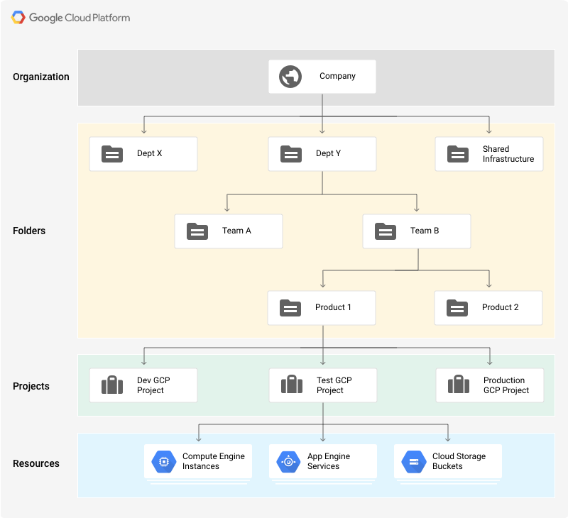

# Resource Manager

The following diagram outlines a sample resource outline in Google Cloud:
.

The _Origanization_ node is the root node and all access control policies will trickle down from there. Org admins can set [Originizational Policies](https://cloud.google.com/resource-manager/docs/organization-policy/overview), which will control access to folders and/or projects at the organization level. 


Best Practices For Organizations can be found [here](https://cloud.google.com/docs/enterprise/best-practices-for-enterprise-organizations).


## Resource Hierarchy
The following image outlines an example of  resource hierarchy illustrating the core account-level resources involved in administering your Google Cloud account.


* Billing Account:
  * Tracks all organizational costs
    * Linked to one or more projects
* Domain:
  * Your company Domain is the primary identity of your organization and establishes your company's identity with Google services, including Google Cloud. 
  * Can be linked to either a GSuite or Cloud Identity Account
* Organization:
  * Highest unit
  * Using GSuite and Cloud Identity
  * Common place to register your domain as the org name
* Folders:
  * Orgs can have one or more folders
  * Common practice is to have folders represent departments in an org
  * Max 100 folders under a single folder or up to four levels of folder nesting
* Projects:
  * A unit of resource management below folders
  * Contains a set of users, API permission, billing information and provisioned resources
  * Identified by their project ID which should be unique to each org
  * Auto-generated by GCP
    * Cloud Deployment Manager
    * Terraform
    * Ansible
  * Users and roles specified per project
* Resources:
  * Instance of offerings and services of GCP
  * Roles are defined to manage access

The following diagram outlines a sample resource outline in Google Cloud:
.

When you set an organization policy on a resource hierarchy node, all descendants of that resource hierarchy node inherit the organization policy by default. If you set an organization policy at the root organization node, then those restrictions are inherited by all child folders, projects, and resources.
You can set custom organization policy on child nodes, which will overwrite or merge with the inherited policy based on the rules of hierarchy evaluation.

Ex:


## Policies and Constraints
The IAM role `roles/orgpolicy.policyAdmin` enables an administrator to manage organization policies.

### Organization Policies
Organization policices are a set of configurations outlining restrictions associated to the organization, which can be assigned to organizations, folders, and projects in order to enforce the restrictions on that resource and its descendants.

In order to define an organization policy, you choose a [constraint](https://cloud.google.com/resource-manager/docs/organization-policy/overview#constraints), which is a particular type of restriction against either a Google Cloud service or a group of Google Cloud services. You configure that constraint with your desired restrictions.

Descendants of the targeted resource hierarchy node inherit the organization policy. By applying an organization policy to the root organization node, you are able to effectively drive enforcement of that organization policy and configuration of restrictions across your organization.

You can set an Cloud IAM policy at the organization level, the folder level, the project level, or (in some cases) the resource level. Resources inherit the policies of the parent node. If you set a policy at the Organization level, it is inherited by all its child folders and projects, and if you set a policy at the project level, it is inherited by all its child resources.

The effective policy for a resource is the union of the policy set on the resource and the policy inherited from its ancestors. This inheritance is transitive. In other words, resources inherit policies from the project, which inherit policies from the organization. Therefore, the organization-level policies also apply at the resource level.


### Constraints

A **_constraint_** is a definition of the behaviors that are controlled by an organization policy. A constraint has a type, either list or boolean.

The resource nodes that are in the hierarchy below the Organization Node are evaluated as follows:

* Resource 1 defines a custom policy that sets inheritFromParent to TRUE and allows blue diamond. The policy from the Organization Node is inherited and merged with the custom policy, and the effective policy evaluates to allow red square, green circle, and blue diamond.

* Resource 2 defines a custom policy that sets inheritFromParent to TRUE and denies green circle. Deny values always take precedence during policy reconciliation. The policy from the Organization Node is inherited and merged with the custom policy, and the effective policy evaluates to allow only red square.

* Resource 3 defines a custom policy that sets inheritFromParent to FALSE and allows yellow hexagon. The policy from the Organization Node is not inherited, so the effective policy evaluates to only allow yellow hexagon.

* Resource 4 defines a custom policy that sets inheritFromParent to FALSE and includes the restoreDefault value. The policy from the Organization Node is not inherited, and the default constraint behavior is used, so the effective policy evaluates to allow all.

## Resource Liens

The project resource is the base-level organizing entity. Organizations and folders may contain multiple projects. A project is required to use Google Cloud, and forms the basis for creating, enabling, and using all Google Cloud services, managing APIs, enabling billing, adding and removing collaborators, and managing permissions.
https://cloud.google.com/resource-manager/docs/access-control-proj
You can place a lien upon a project to block the project's deletion until you remove the lien. This can be useful to protect projects of particular importance.
```
gcloud alpha resource-manager liens create
  --restrictions=resourcemanager.projects.delete
  --reason="Super important production system"
```

### Resource Management Best Practices

1. Mirror your Google Cloud resource hierarchy structure to your organization structure. The Google Cloud resource hierarchy should reflect how your company is organized, whether it's a startup, a SME, or a large corporation. A startup may start out with a flat resource hierarchy with no organization resource. When more people start collaborating on projects and the number of projects increase, getting an organization resource might make sense. An organization resource is recommended for larger companies with multiple departments and teams where each team is responsible for their own set of applications and services.

2. Use projects to group resources that share the same trust boundary. For example, resources for the same product or microservice can belong to the same project.

3. Set policies at the organization level and at the project level rather than at the resource level. As new resources are added, you may want them to automatically inherit policies from their parent resource. For example, as new virtual machines are added to the project through auto-scaling, they automatically inherit the policy on the project.


## Super Admin Best Practices

Super admin accounts have irrevocable administrative permissions that we do not recommended using in the day-to-day administration of your organization. Best practices for managing super admins are as follows:

* Create a super admin email address
  * Create a new email address that is not specific to a particular user as the G Suite or Cloud Identity super admin account. This account should be further secured with multi-factor authentication, and could be used as an emergency recovery tool.

* Designate organization admins
  * This role has a smaller set of permissions that are designed to manage your day to day organization operations. You should also create a private Google Cloud administrator group in your G Suite or Cloud Identity super admin account. Add your organization administrator users to this group, but not your super admin user. Grant this group the Organization Administrator IAM role or a limited subset of the role's permissions.
  * We recommend keeping your super admin account separate from your organization administrator group.

* Set appropriate roles
* Discourage the use of Super Admin
  * Enforce multi-factor authentication on your super admin accounts as well as all accounts that have elevated privileges.
  * Use a security key or other physical authentication device to enforce two-step verification.
  * For the initial super admin account, ensure that the security key is kept in a safe place, preferably at your physical location.

* Setup Multiple Super Admin Accounts
  * A business should have more than one super admin account, each managed by a separate individual. If one account is lost or compromised, another super admin can perform critical tasks while the other account is recovered.
